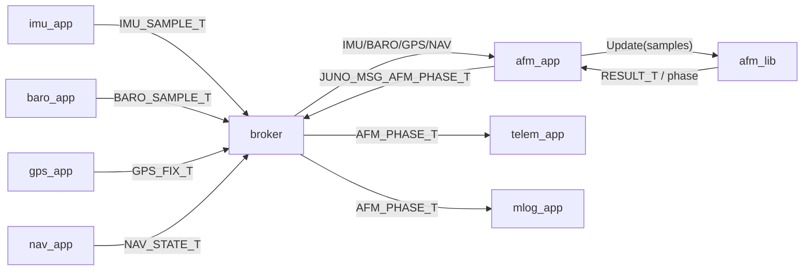
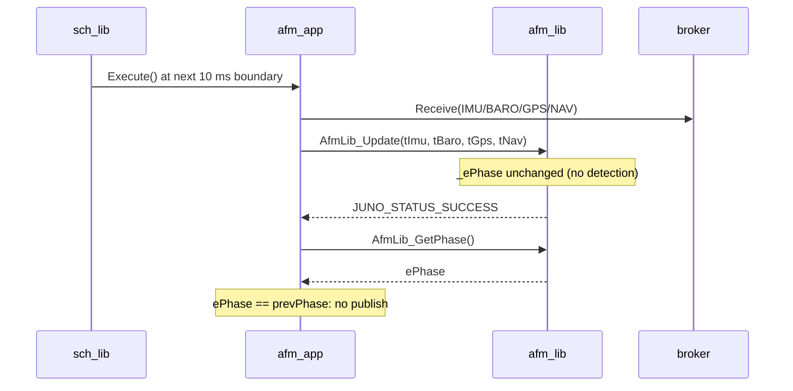
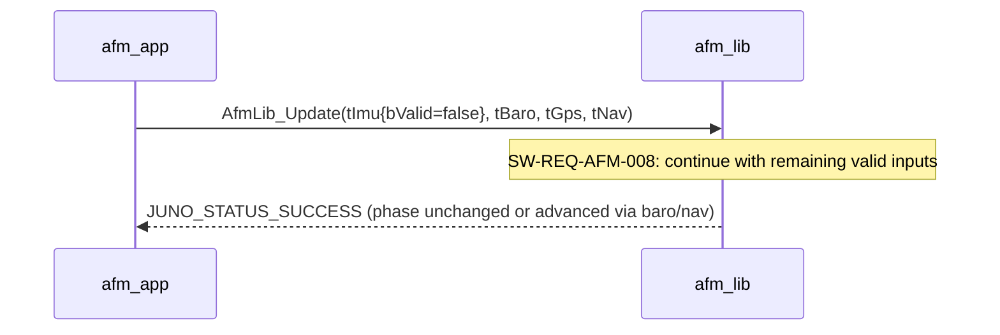
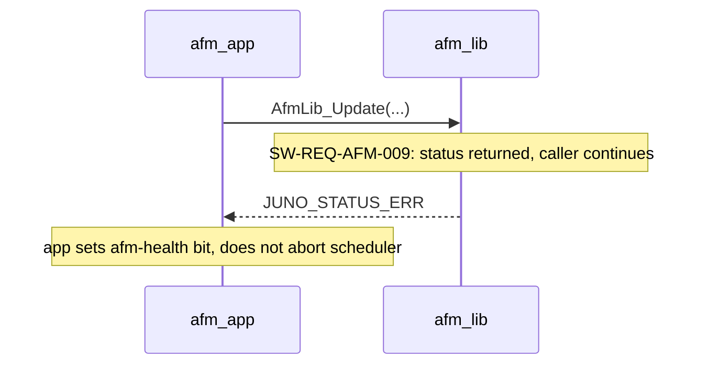

# Juno FSW — afm_lib Design (L2)

**Document type:** IEEE 1016 Software Design Description
**Module:** `afm_lib` — Automated Flight Manager phase state machine (algorithm-agnostic)
**Authoritative for:** Phase state machine logic, public API surface, memory ownership.
**References (do not contradict):** `docs/design/conventions.md` (cross-module names, idioms); `docs/design/system/system_design.md` (composition root, bus catalog); `docs/requirements/afm/requirements.json` (`SW-REQ-AFM-001`..`-011`).

---

<!-- @{"design": ["SW-REQ-AFM-001", "SW-REQ-AFM-002", "SW-REQ-AFM-003"]} -->
## 1. Purpose and Scope

This document is the L2 design for `afm_lib`, the Automated Flight Manager library that classifies the rocket's current flight phase from sensor and navigation inputs and exposes the phase to its app. It addresses every requirement in `docs/requirements/afm/requirements.json` (`SW-REQ-AFM-001` through `SW-REQ-AFM-011`) and decomposes from `SW-REQ-SYS-016` (FSW shall detect boost, apogee, descent, landing during the mission), `SW-REQ-SYS-017` (phase published on bus), `SW-REQ-SYS-018` (transition timestamps), `SW-REQ-SYS-043` (POSIX/Pico2 equivalence), `SW-REQ-SYS-044` (determinism), and `SW-REQ-SYS-062` (AFM-loss tolerance).

In scope: the LibJuno C++ module pattern for `afm_lib` (`AFM_LIB_ROOT_T`, `AFM_LIB_API_T`, `AFM_LIB_IMPL_T`); the canonical phase state machine and its monotonic-forward transition contract; the algorithm-agnostic seam between API and IMPL; memory ownership; error handling; traceability for all 11 AFM requirements.

Out of scope: the concrete phase-detection algorithm (e.g., specific accel/altitude thresholds, hysteresis, sliding-window sizes) — these are IMPL concerns and are deliberately not specified at the API surface (`SW-REQ-AFM-007` is a black-box latency bound; the algorithm that satisfies it is replaceable). Out of scope: bus publishing (owned by `afm_app`, see `system_design.md` §4); AFM telemetry packet layout (owned by `telem_app`); AFM log records (owned by `mlog_app`); composition wiring (owned by `apps/main.cpp`).

---

## 2. Definitions and Abbreviations

Cross-module vocabulary (phase enum `JUNO_PHASE_T`, time base `JUNO_TIME_US_T`, status semantics, message naming, frames, units, body axes) is defined in `docs/design/conventions.md` §4 and is **not** redefined here. Module-local terms only:

| Term | Meaning |
|------|---------|
| AFM | Automated Flight Manager — the library and app pair owning flight-phase classification |
| Phase | The discrete flight regime returned by AFM (`JUNO_PHASE_T`; see `conventions.md` §4.1) |
| Transition | A single phase-to-phase advance (e.g., `BOOST`→`APOGEE`); the AFM records the µs timestamp |
| Tick | One `Update()` call from `afm_app::Execute()`; the cooperative cycle granularity |
| Detector / IMPL | The platform-specific `AFM_LIB_IMPL_T` instance carrying the chosen detection algorithm |
| API surface | The function references in `AFM_LIB_API_T`; algorithm-agnostic and stable |
| Algorithm seam | The `AFM_LIB_API_T`/`AFM_LIB_IMPL_T` boundary; replacing the algorithm replaces only the IMPL |

Cross-module IDs referenced verbatim: `JUNO_PHASE_T` (`conventions.md` §4.1), `JUNO_TIME_US_T` (§4.2), `JUNO_STATUS_T` / `RESULT_T<T>` / `OPTION_T<T>` (§4.3), `JUNO_MSG_AFM_PHASE_T` / `JUNO_MSG_IMU_SAMPLE_T` / `JUNO_MSG_BARO_SAMPLE_T` / `JUNO_MSG_GPS_FIX_T` / `JUNO_MSG_NAV_STATE_T` (§4.4 + `system_design.md` §4).

---

<!-- @{"design": ["SW-REQ-AFM-001", "SW-REQ-AFM-003", "SW-REQ-AFM-009", "SW-REQ-AFM-010"]} -->
## 3. System Overview

### 3.1 MVC layer mapping

| Layer | Realization | Notes |
|-------|-------------|-------|
| View (App) | `afm_app` (separate L2 design) — TDM-scheduled at `kAfmAppPeriodMs = 10` per `system_design.md` §3.3 | Subscribes to IMU/BARO/GPS/NAV; publishes `JUNO_MSG_AFM_PHASE_T` on phase change |
| Controller (Lib) | `afm_lib` — this design — `juno::afm` namespace, `AFM_LIB_ROOT_T` / `AFM_LIB_API_T` / `AFM_LIB_IMPL_T` | Pure compute; black-box phase classifier; algorithm-agnostic API |
| Model (Bus) | `JUNO_MSG_AFM_PHASE_T` (published by `afm_app`, not by `afm_lib`) | `afm_lib` never touches the broker |

**`afm_lib` does not interact with the software bus directly.** All bus interaction is owned by `afm_app`, which calls into `afm_lib` via `AFM_LIB_API_T` and then publishes the resulting phase. This separation keeps `afm_lib` freestanding-pure (no broker dependency, no I/O, deterministic given inputs).

### 3.2 Module context



### 3.3 Pure-compute property

`afm_lib` has no platform-specific I/O: no file descriptors, no peripheral handles, no clocks, no broker handles. The IMPL holds only algorithmic state (counters, ring buffers of recent samples, the current phase, the transition timestamp). Because the only platform-divergent input is the timestamp on each sample (which is supplied by the caller from `juno_time`), the same `AFM_LIB_IMPL_T` source compiles and links unchanged on POSIX and Pico2. `SW-REQ-AFM-010` (POSIX/Pico2 equivalence) is therefore satisfied by construction; see §6 and §11. There is **no `src/posix/` vs. `src/pico2/` split for `afm_lib`** — a single `src/afm_impl.cpp` serves both targets.

---

<!-- @{"design": ["SW-REQ-AFM-001", "SW-REQ-AFM-003", "SW-REQ-AFM-006", "SW-REQ-AFM-008", "SW-REQ-AFM-009", "SW-REQ-AFM-011"]} -->
## 4. Interface Definitions

Header path: `libs/afm_lib/include/afm_lib/afm_api.hpp` (per `system_design.md` §3.3).
Namespace: `juno::afm` (per `conventions.md` §1.1).
Implementation: `libs/afm_lib/src/afm_impl.cpp` (single-file, platform-agnostic; see §3.3 / §6).

### 4.1 Type sketch (illustrative)

```cpp
namespace juno::afm
{
struct AFM_LIB_ROOT_T;

struct AFM_LIB_API_T
{
    JUNO_STATUS_T (&Init)  (AFM_LIB_ROOT_T &tRoot,
                            JUNO_TIME_US_T tStartupUs) noexcept;
    JUNO_STATUS_T (&Update)(AFM_LIB_ROOT_T &tRoot,
                            const JUNO_MSG_IMU_SAMPLE_T &tImu,
                            const JUNO_MSG_BARO_SAMPLE_T &tBaro,
                            const JUNO_MSG_GPS_FIX_T   &tGps,
                            const JUNO_MSG_NAV_STATE_T &tNav) noexcept;
    JUNO_PHASE_T  (&GetPhase)        (const AFM_LIB_ROOT_T &tRoot) noexcept;
    JUNO_TIME_US_T(&GetTransitionUs) (const AFM_LIB_ROOT_T &tRoot) noexcept;
};

struct AFM_LIB_ROOT_T JUNO_MODULE_ROOT(AFM_LIB_API_T,
    JUNO_PHASE_T   _ePhase;          // current phase (initial = JUNO_PHASE_PRE_LAUNCH)
    JUNO_TIME_US_T _tTransitionUs;   // µs timestamp of last transition
);
} // namespace juno::afm
```

Phase enum values come from `conventions.md` §4.1 verbatim and are sourced by `SW-REQ-AFM-002`. The canonical `juno::afm::JUNO_PHASE_T` declaration lives in this module's public header `libs/afm_lib/include/afm_lib/afm_api.hpp`; it is **not redefined** in any consumer. Cross-module consumers — `JUNO_MSG_AFM_PHASE_T` (per `system_design.md` §4), `telem_app`, `mlog_app`, and `sim_dynamics` (`sim_dynamics/design.md` §6.1 `#include "afm_lib/afm_api.hpp"`) — `#include` the same header verbatim.

### 4.2 Function contracts

<!-- @{"design": ["SW-REQ-AFM-002", "SW-REQ-AFM-009"]} -->
#### 4.2.1 `AfmLib_Init`

| Attribute | Value |
|-----------|-------|
| Signature | `JUNO_STATUS_T AfmLib_Init(AFM_LIB_ROOT_T &tRoot, JUNO_TIME_US_T tStartupUs) noexcept` |
| Preconditions | `tRoot` reached via `New()`; vtable bound; caller provides startup µs from `juno_time` |
| Postconditions | `_ePhase = JUNO_PHASE_PRE_LAUNCH`; `_tTransitionUs = tStartupUs`; algorithm state cleared |
| Error conditions | `JUNO_STATUS_SUCCESS` always for the pure-compute IMPL (no fallible resources); future IMPLs reserve right to return error |
| Thread safety | Not thread-safe; single-threaded TDM caller only |

Initial state is `PRE_LAUNCH` — pre-launch is the at-power-on initial state and is **not** a detected phase (per the brief and consistent with `SW-REQ-SYS-016`, which enumerates only the four detected phases boost/apogee/descent/landing).

<!-- @{"design": ["SW-REQ-AFM-001", "SW-REQ-AFM-004", "SW-REQ-AFM-005", "SW-REQ-AFM-008", "SW-REQ-AFM-009", "SW-REQ-AFM-011"]} -->
#### 4.2.2 `AfmLib_Update`

| Attribute | Value |
|-----------|-------|
| Signature | `JUNO_STATUS_T AfmLib_Update(AFM_LIB_ROOT_T&, const JUNO_MSG_IMU_SAMPLE_T&, const JUNO_MSG_BARO_SAMPLE_T&, const JUNO_MSG_GPS_FIX_T&, const JUNO_MSG_NAV_STATE_T&) noexcept` |
| Preconditions | `tRoot` initialized; sample structs are valid POD aggregates (their `bValid` flag indicates input availability per `SW-REQ-AFM-008`) |
| Postconditions | If a forward transition fires: `_ePhase` advances exactly one step in the canonical order (per §5); `_tTransitionUs` is set to the originating sample's `tTimestampUs` (per `SW-REQ-AFM-006`). Otherwise `_ePhase` and `_tTransitionUs` are unchanged. |
| Error conditions | `JUNO_STATUS_SUCCESS` on nominal step. `JUNO_STATUS_ERR` if internal invariant fails. The function **never** aborts the calling app (`SW-REQ-AFM-009`). |
| Determinism | Identical input sequences produce identical output sequences (`SW-REQ-AFM-011`). No internal time source, no RNG, no global state. |
| Degraded inputs | Continues with the available subset; absent inputs are recognized via `bValid=false` on the corresponding sample (`SW-REQ-AFM-008`). The algorithm policy for substitution is an IMPL concern. |
| Monotonicity | Cannot regress phase (`SW-REQ-AFM-005`) and cannot skip — transitions follow the canonical order (`SW-REQ-AFM-004`). |
| Thread safety | Not thread-safe; single-threaded TDM caller only |

`Update()` is the algorithm seam. It accepts the four input message types and emits a phase decision into `_ePhase`. The decision rule is **deliberately not specified in this design** — see §5 for the state machine and §3.3 for why this is the only freestanding-pure boundary that satisfies `SW-REQ-AFM-010` and `SW-REQ-AFM-011`.

<!-- @{"design": ["SW-REQ-AFM-002", "SW-REQ-AFM-003", "SW-REQ-AFM-009"]} -->
#### 4.2.3 `AfmLib_GetPhase`

| Attribute | Value |
|-----------|-------|
| Signature | `JUNO_PHASE_T AfmLib_GetPhase(const AFM_LIB_ROOT_T &tRoot) noexcept` |
| Preconditions | `tRoot` initialized |
| Postconditions | Returns `_ePhase`; no side effects |
| Error conditions | None — pure read; cannot fail |
| Thread safety | Not thread-safe; reader-writer ordering is the caller's responsibility (TDM single-thread satisfies it) |

Returns by value. `JUNO_PHASE_T` is `uint8_t`-backed (`conventions.md` §4.1) and trivially copyable.

<!-- @{"design": ["SW-REQ-AFM-006"]} -->
#### 4.2.4 `AfmLib_GetTransitionUs`

| Attribute | Value |
|-----------|-------|
| Signature | `JUNO_TIME_US_T AfmLib_GetTransitionUs(const AFM_LIB_ROOT_T &tRoot) noexcept` |
| Preconditions | `tRoot` initialized |
| Postconditions | Returns the µs timestamp recorded at the most recent transition (or `tStartupUs` if no transition has occurred). No side effects. |
| Error conditions | None — pure read |
| Thread safety | Not thread-safe; TDM single-thread |

This is the value `afm_app` writes into `JUNO_MSG_AFM_PHASE_T.tTransitionUs` when publishing the phase event (`SW-REQ-SYS-018`).

### 4.3 Doxygen header sketch

```cpp
/**
 * @brief Initialize the AFM library to PRE_LAUNCH at startup.
 * @param tRoot Module root (caller-owned; vtable already bound by New()).
 * @param tStartupUs Monotonic-µs startup timestamp from juno_time.
 * @return JUNO_STATUS_SUCCESS on success.
 */
JUNO_STATUS_T (&Init)(AFM_LIB_ROOT_T &tRoot, JUNO_TIME_US_T tStartupUs) noexcept;
/**
 * @brief Step the phase state machine using the latest sensor and nav samples.
 * @param tRoot   Module root.
 * @param tImu    Latest IMU sample (bValid indicates availability).
 * @param tBaro   Latest baro sample.
 * @param tGps    Latest GPS fix.
 * @param tNav    Latest nav state.
 * @return JUNO_STATUS_SUCCESS on success; never aborts the caller (SW-REQ-AFM-009).
 */
JUNO_STATUS_T (&Update)(AFM_LIB_ROOT_T &tRoot, ...) noexcept;
```

---

<!-- @{"design": ["SW-REQ-AFM-002", "SW-REQ-AFM-004", "SW-REQ-AFM-005"]} -->
## 5. State Machines

The AFM phase state machine is the canonical example for the FSW (referenced from `system_design.md` §5 / §7.3). It is monotonic forward through the five values defined in `conventions.md` §4.1.

```mermaid
stateDiagram-v2
    [*] --> PRE_LAUNCH: Init(tStartupUs) — power-on initial state, not a detected phase
    PRE_LAUNCH --> BOOST: Update() detects boost (algorithm-defined; SW-REQ-AFM-004)
    BOOST --> APOGEE: Update() detects apogee
    APOGEE --> DESCENT: Update() detects descent
    DESCENT --> LANDING: Update() detects landing
    LANDING --> [*]: external power removed (SW-REQ-SYS-047)
```

Rules (cross-cutting, enforced inside `Update()`):

1. **Initial state is `PRE_LAUNCH`.** Set by `Init()`, never re-entered (`SW-REQ-AFM-005` forbids regression).
2. **Transitions are forward-only and follow the canonical order** `PRE_LAUNCH → BOOST → APOGEE → DESCENT → LANDING` (`SW-REQ-AFM-004`).
3. **No regression.** Once `BOOST` is entered, `PRE_LAUNCH` is unreachable; once `APOGEE`, neither `PRE_LAUNCH` nor `BOOST`; and so on (`SW-REQ-AFM-005`).
4. **No skips at the API contract.** A correct IMPL advances exactly one step per detected transition. If an IMPL determines that, e.g., apogee was missed and the system is already descending, the design choice is to advance one step at a time on successive `Update()` calls; the algorithm authors can choose to advance in a single call as long as the per-step ordering of `_ePhase` values still respects the canonical sequence and `_tTransitionUs` records the latest transition's input timestamp.
5. **`LANDING` is the terminal phase.** There is **no** `LANDED` value (`conventions.md` §4.1); the FSW continues running in `LANDING` until external power is removed (`SW-REQ-SYS-047`), and the recovery beacon (`SW-REQ-SYS-048`) continues to operate during the `LANDING` phase.
6. **No `COAST` value.** Any IMPL behavior between burnout and apogee is internal algorithm state, not an exposed phase (`conventions.md` FLAG-1).
7. **Detection latency is bounded.** Each transition fires within 1 s of actual occurrence (`SW-REQ-AFM-007`); the bound is asserted at the API surface but realized inside the IMPL. Hysteresis, sliding-window length, and threshold values are IMPL-internal.

State storage in `AFM_LIB_ROOT_T`: `_ePhase` (single `JUNO_PHASE_T`) and `_tTransitionUs` (single `JUNO_TIME_US_T`). No history of prior phases is retained — monotonic forward progress makes a one-step current-state-and-time pair sufficient.

---

<!-- @{"design": ["SW-REQ-AFM-001", "SW-REQ-AFM-003"]} -->
## 6. Data Flow

`afm_lib` does **not** subscribe to or publish on the bus. It is invoked synchronously by `afm_app::Execute()` and returns synchronously. All bus traffic is owned by `afm_app` (separate L2 design):

```
broker --(JUNO_MSG_IMU_SAMPLE_T)----> afm_app
broker --(JUNO_MSG_BARO_SAMPLE_T)---> afm_app
broker --(JUNO_MSG_GPS_FIX_T)-------> afm_app
broker --(JUNO_MSG_NAV_STATE_T)-----> afm_app
                                       afm_app -- AfmLib_Update(...) --> afm_lib
                                       afm_lib -- _ePhase / _tTransitionUs --> afm_app
afm_app --(JUNO_MSG_AFM_PHASE_T)---> broker  [publish on phase change]
```

Message types referenced verbatim from `system_design.md` §4 (`conventions.md` §4.4 naming).

Buffer ownership across the seam: `afm_app` owns its receive buffers (the four input messages are POD-copied by the broker into `afm_app`-local storage and passed by const-reference into `Update()`); `afm_lib` never retains pointers to caller storage — it copies any algorithm-relevant fields it needs into `_ePhase`/`_tTransitionUs` before returning. See §10 for the explicit ownership table.

---

<!-- @{"design": ["SW-REQ-AFM-003", "SW-REQ-AFM-006", "SW-REQ-AFM-008", "SW-REQ-AFM-009"]} -->
## 7. Sequence Diagrams

### 7.1 Nominal tick — no transition



### 7.2 Phase transition — apogee detected

```mermaid
sequenceDiagram
    participant sch as sch_lib
    participant afm_app
    participant afm_lib
    participant broker

    sch->>afm_app: Execute()
    afm_app->>broker: Receive(IMU/BARO/GPS/NAV)
    afm_app->>afm_lib: AfmLib_Update(tImu, tBaro, tGps, tNav)
    Note over afm_lib: detect APOGEE; _ePhase = APOGEE; _tTransitionUs = tBaro.tTimestampUs
    afm_lib-->>afm_app: JUNO_STATUS_SUCCESS
    afm_app->>afm_lib: AfmLib_GetPhase()
    afm_lib-->>afm_app: APOGEE
    afm_app->>afm_lib: AfmLib_GetTransitionUs()
    afm_lib-->>afm_app: tTransitionUs
    afm_app->>broker: Publish(JUNO_MSG_AFM_PHASE_T{ePhase=APOGEE, tTransitionUs})
```

### 7.3 Degraded sensor — IMU bValid=false



### 7.4 Internal-error path — no caller abort



---

<!-- @{"design": ["SW-REQ-AFM-007", "SW-REQ-AFM-011"]} -->
## 8. Timing and Scheduling Analysis

`afm_lib` itself is unscheduled — it has no thread, no timer, no periodic task. It runs synchronously inside `afm_app::Execute()` on the cooperative TDM scheduler.

| Item | Value | Source |
|------|-------|--------|
| Caller (app) | `afm_app` | `system_design.md` §3.3 |
| App TDM period | `kAfmAppPeriodMs = 10` (100 Hz) | `system_design.md` §3.3, §8.2 |
| Per-tick budget for `Update()` | bounded so `afm_app::Execute()` fits within its slice of the 5 ms tick (see `system_design.md` §8.2) | `SW-REQ-SYS-044` |
| Detection latency bound | 1 s, end-to-end (`SW-REQ-AFM-007`) | brief / requirement |

Latency derivation: at 100 Hz, the AFM observes a candidate transition at the next sample boundary (≤10 ms after the underlying physical event), the detector confirms over its hysteresis window (algorithm-internal — IMPL constraint: window ≤ 990 ms), and the app publishes on the same tick. Total worst-case 1000 ms. The 990 ms hysteresis budget is an IMPL constraint not visible at the API surface; the design only mandates that the IMPL achieve the 1 s bound.

Determinism: `Update()` performs no allocation, no I/O, no system-clock reads, no RNG (`SW-REQ-AFM-011`). All branching is driven by the input arguments and the existing `_ePhase`/algorithm-internal state. Per `SW-REQ-SYS-044`, this contributes to the system's overall determinism.

Downstream consumers of the phase (via `JUNO_MSG_AFM_PHASE_T` from `afm_app`):
- `telem_app` (`kTelemAppPeriodMs = 500`)
- `mlog_app` (`kMlogAppPeriodMs = 5`)

---

<!-- @{"design": ["SW-REQ-AFM-008", "SW-REQ-AFM-009"]} -->
## 9. Error Handling Strategy

1. **Status propagation.** Every public `AFM_LIB_API_T` function returns `JUNO_STATUS_T` or a primitive value (`JUNO_PHASE_T`, `JUNO_TIME_US_T`). Internal helpers use `JUNO_ASSERT_SUCCESS` / `JUNO_ASSERT_OK` / `JUNO_ASSERT_SOME` / `JUNO_ASSERT_EXISTS` per `conventions.md` §4.3. Bare `if`-return is forbidden.
2. **Failure handler.** `JUNO_FAILURE_HANDLER_T` is wired through `New()` (the LibJuno C++ pattern; see `conventions.md` §1.2). It is **diagnostic-only and does not alter control flow** — a callback emits a log/MLOG record via the failure-handler chain owned by `log_lib` / `mlog_app` (`system_design.md` §9.2).
3. **Continuation policy on degraded inputs (`SW-REQ-AFM-008`).** When any of the four input messages reports `bValid = false`, `Update()` continues using the remaining valid inputs. The algorithm chooses how to fall back; at the API level, the contract is "no abort, no error code on degradation alone".
4. **Continuation policy on internal failure (`SW-REQ-AFM-009`).** If `Update()` returns a non-success status, the caller (`afm_app`) sets the AFM-related health bit (handled by `sys_app` per `SW-REQ-SYS-062`) and continues. `afm_lib` does **not** call `std::terminate`, does **not** assert-and-abort, and does **not** call into the failure handler with a fatal context. The `_ePhase` value is preserved at its prior value across an errored update; subsequent successful updates resume from there.
5. **No exceptions.** All functions are `noexcept` (`conventions.md` §1.3, `SW-REQ-SYS-053`). A stray throw would invoke `std::terminate`; the design treats this as a structural invariant.
6. **No sensor-health responsibility.** `afm_lib` does not own any sensor-health bit — it only consumes `bValid` flags. Setting the AFM-loss health bit is `sys_app`'s job (via `SW-REQ-SYS-062` and the `JUNO_MSG_SYS_HEALTH_T` bitmap).
7. **Phase-monotonicity invariant.** `Update()` enforces `SW-REQ-AFM-004`/`-005`: any internal computation that would yield a phase value < `_ePhase` is suppressed; `_ePhase` is only ever overwritten with a value strictly greater than the prior value. This invariant is the single most important defensive check; a violation returns `JUNO_STATUS_ERR` and leaves `_ePhase` unchanged.

---

## 10. Memory Ownership

Per `conventions.md` §5:

| Buffer / facility | Owner | Lifetime | Allocation |
|-------------------|-------|----------|------------|
| `AFM_LIB_IMPL_T` instance | composition root (`apps/main.cpp`) | program lifetime, `.bss` zero-init | Static — caller-owned |
| `AFM_LIB_ROOT_T` (embedded in IMPL) | same | same | Static |
| `_ePhase`, `_tTransitionUs` (members of `AFM_LIB_ROOT_T`) | same | same | Static (POD) |
| Algorithm-internal state (e.g., sample history) | `AFM_LIB_IMPL_T` member | program lifetime | Static; sized by template param or `static constexpr` |
| Vtable (`tApi`) | `New()` factory, file-scope `static` local | program lifetime | Read-only after construction |
| Input message buffers passed to `Update()` | caller (`afm_app`) | call duration only | Caller-owned; `afm_lib` never retains pointers |

Invariants asserted (per `constraints.md` and `conventions.md` §5):

- **Caller owns all storage.** `afm_lib` never allocates.
- **No `new`, `delete`, `malloc`, `calloc`, `realloc`, `free`.**
- **No heap-backed STL containers.** Sample history (if any) lives as a fixed-size member array in `AFM_LIB_IMPL_T`.
- **No global mutable state in the library.** The `static` `tApi` inside `New()` is read-only after construction.
- **No constructors / destructors on `AFM_LIB_ROOT_T` or `AFM_LIB_IMPL_T`.** Both remain trivially constructible so `.bss` zero-init is safe; explicit `Init()` performs setup.
- **No `virtual`, no RTTI, no exceptions.** Enforced by `-fno-rtti -fno-exceptions` (`SW-REQ-SYS-052`/`-053`).

---

<!-- @{"design": ["SW-REQ-AFM-010"]} -->
## 11. Traceability

Per-section `<!-- @{"design": [...]} -->` tags above are authoritative; this table is descriptive consolidation. Every `SW-REQ-AFM-NNN` is mapped to at least one section and is also tagged inline.

| Req ID | Title | Section(s) |
|--------|-------|-----------|
| SW-REQ-AFM-001 | Sensor and Nav Input Acceptance | §1, §3, §4.2.2, §6 |
| SW-REQ-AFM-002 | Flight Phase Enumeration | §1, §4.1, §4.2.1, §5 |
| SW-REQ-AFM-003 | Current Phase Output | §1, §3, §4.2.3, §6, §7 |
| SW-REQ-AFM-004 | Phase Transition Ordering | §4.2.2, §5, §9 |
| SW-REQ-AFM-005 | No Phase Regression | §4.2.2, §5, §9 |
| SW-REQ-AFM-006 | Transition Timestamp Output | §4.2.2, §4.2.4, §7.2 |
| SW-REQ-AFM-007 | Bounded Detection Latency | §8 |
| SW-REQ-AFM-008 | Degraded Sensor Continuation | §4.2.2, §7.3, §9 |
| SW-REQ-AFM-009 | Callable Without Side Effects on Failure | §3, §4.2.2, §7.4, §9 |
| SW-REQ-AFM-010 | POSIX and Pico2 Equivalence | §3.3, §11 (below) |
| SW-REQ-AFM-011 | Deterministic Phase Output | §4.2.2, §8 |

POSIX/Pico2 functional equivalence statement (`SW-REQ-AFM-010`, traceable to `SW-REQ-SYS-043`): `afm_lib` is pure compute (§3.3). It does not depend on platform-specific facilities and ships as a single `libs/afm_lib/src/afm_impl.cpp`. The same source compiles unchanged on both POSIX and Pico2 builds; identical input sequences therefore produce bit-identical phase outputs by construction. Trick SITL (`SW-REQ-SYS-045`) drives `afm_lib` through the same `AFM_LIB_API_T` the flight build uses, with no platform-specific shimming required.

Determinism statement (`SW-REQ-AFM-011`, traceable to `SW-REQ-SYS-044`): `Update()` performs no dynamic allocation, no I/O, no system-clock reads, no RNG, and no global-state reads. Its output is a pure function of `(prior _ePhase, prior _tTransitionUs, prior algorithm state, input messages)`.
