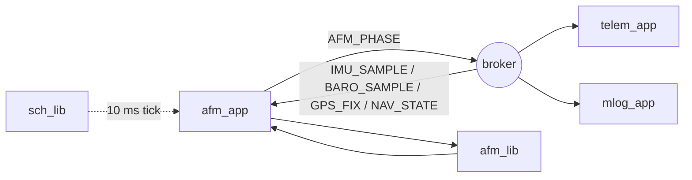
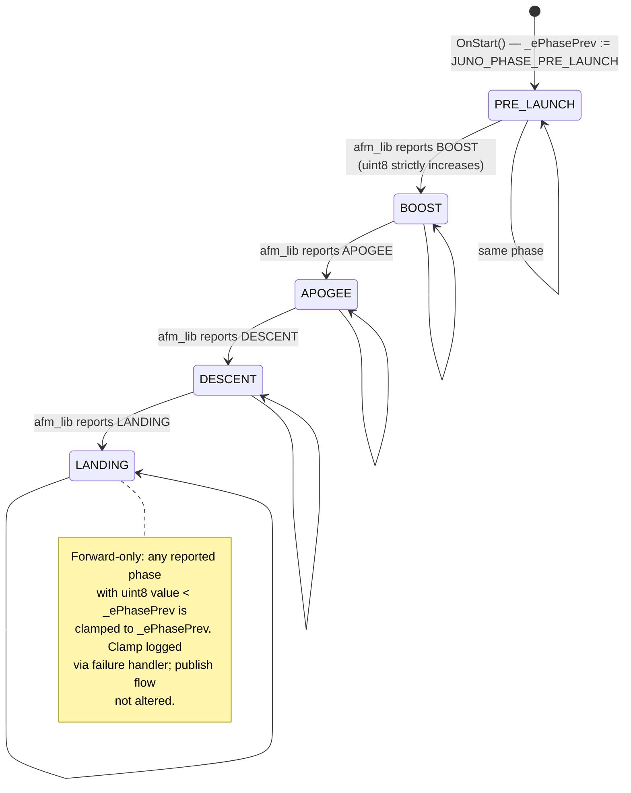
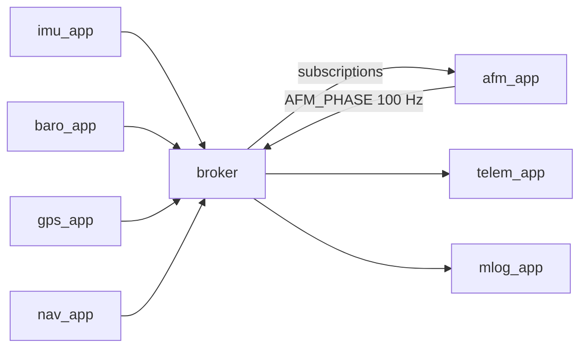

# Juno FSW — AFM App Design (L2)

**Document type:** IEEE 1016 Software Design Description
**Module:** `afm_app`
**Scope:** Phase-detection App (View) for the Juno FT1 flight software.
**References (do not contradict):** `docs/design/conventions.md`, `docs/design/system/system_design.md`, `docs/requirements/afm_app/requirements.json`, `docs/requirements/afm/requirements.json`, `libjuno/include/juno/app/app_api.hpp`.

---

<!-- @{"design": ["SW-REQ-AFM-APP-001", "SW-REQ-AFM-APP-002", "SW-REQ-AFM-APP-003", "SW-REQ-AFM-APP-004", "SW-REQ-AFM-APP-005", "SW-REQ-AFM-APP-006", "SW-REQ-AFM-APP-007", "SW-REQ-AFM-APP-008", "SW-REQ-AFM-APP-009", "SW-REQ-AFM-APP-010"]} -->
## 1. Purpose and Scope

L2 design for `afm_app`, the FT1 phase-detection App that hosts `afm_lib` and surfaces the current flight phase onto the software bus. Addresses every requirement in `docs/requirements/afm_app/requirements.json` (`SW-REQ-AFM-APP-001` through `SW-REQ-AFM-APP-010`).

`afm_app` is a thin View — it owns no detection logic. All detection logic lives in `afm_lib` (`SW-REQ-AFM-001`..`-011`). Per tick the app: (1) drains its bus subscriptions for the latest IMU, baro, GPS, and nav samples; (2) forwards them to `afm_lib::Update`; (3) reads the current phase via `afm_lib::GetPhase`; (4) publishes `JUNO_MSG_AFM_PHASE_T`.

The app exposes itself to the cyclic-executive scheduler via the canonical `juno::app::APP_API_T` triple `OnStart`/`OnProcess`/`OnExit` (see `conventions.md` §1.4 and `libjuno/include/juno/app/app_api.hpp`). A free `AfmAppInit` setup function wires dependencies and aggregate-initializes the embedded `juno::app::APP_ROOT_T` with a static `APP_API_T` vtable.

In scope: lifecycle wiring through `juno::app::APP_ROOT_T`; bus subscription wiring at `OnStart`; per-tick flow in `OnProcess`; scheduling at `kAfmAppPeriodMs = 10` (100 Hz, co-runs with nav); error containment; publish-on-tick semantics; transition-timestamp publication; POSIX/Pico2 equivalence.

Out of scope: phase-detection algorithm and phase state machine internals (owned by `afm_lib` per `SW-REQ-AFM-002`..`-005`); transition latency budget (`SW-REQ-AFM-007`); telemetry packet content (`telem_app`); SD logging (`mlog_app`).

---

## 2. Definitions and Abbreviations

Cross-module vocabulary is locked in `conventions.md` §4 and is **not** redefined here. The phase enum used here is the canonical `juno::afm::JUNO_PHASE_T` from `conventions.md` §4.1, with values `{JUNO_PHASE_PRE_LAUNCH, JUNO_PHASE_BOOST, JUNO_PHASE_APOGEE, JUNO_PHASE_DESCENT, JUNO_PHASE_LANDING}` — no `COAST`, no `LANDED`. Lifecycle hook signatures are the canonical `juno::app::APP_API_T` triple (`conventions.md` §1.4).

| Term | Meaning |
|------|---------|
| AFM | Apogee / Flight Mode (the phase-detection capability) |
| App (View) | `afm_app` — schedules, drains bus, calls lib, publishes |
| Lib (Controller) | `afm_lib` — owns detection logic |
| Tick | One scheduler invocation of `OnProcess` at `kAfmAppPeriodMs` |
| Phase transition | First tick at which `afm_lib::GetPhase` returns a value strictly greater than the previously observed phase |
| `APP_ROOT_T` | LibJuno-published `juno::app::APP_ROOT_T` aggregate carrying the `APP_API_T*` vtable |
| Lifecycle hooks | `OnStart` (once before first tick), `OnProcess` (every tick), `OnExit` (once on graceful shutdown — POSIX only) |

---

<!-- @{"design": ["SW-REQ-AFM-APP-002", "SW-REQ-AFM-APP-003", "SW-REQ-AFM-APP-005"]} -->
## 3. System Overview

`afm_app` lives in the MVC View layer (`conventions.md` §1, `system_design.md` §3). Wired by `apps/main.cpp` (`system_design.md` §8.1) with three injected collaborators: `afm_lib`, the broker, and `time_lib`. The scheduler holds the app's `APP_ROOT_T*` in its static schedule table and dispatches lifecycle calls through the `APP_API_T*` vtable.

| Layer | Realization |
|-------|-------------|
| View (App) | `juno::afm_app::AFM_APP_T` (first member: `juno::app::APP_ROOT_T tRoot;`) |
| Controller (Lib) | `juno::afm::AFM_LIB_ROOT_T` (afm_lib L2 design) |
| Model (Bus) | `juno::sb::BROKER_ROOT_T<JUNO_MSG_BUS_VARIANT_T, 8, 64>` |

### 3.1 Module context



Per `system_design.md` §3.3 and `conventions.md` §4.5, `afm_app` has period `kAfmAppPeriodMs = 10` (100 Hz, co-runs with `nav_app` on the IMU-aligned 10 ms boundary). It subscribes to `JUNO_MSG_NAV_STATE_T` and `JUNO_MSG_BARO_SAMPLE_T` (mandatory per brief), plus `JUNO_MSG_IMU_SAMPLE_T` and `JUNO_MSG_GPS_FIX_T` consumed by `afm_lib::Update` (`SW-REQ-AFM-001`). It publishes `JUNO_MSG_AFM_PHASE_T`.

### 3.2 File layout

| File | Role |
|------|------|
| `apps/afm_app/include/afm_app/afm_app.hpp` | `AFM_APP_T` aggregate, `kAfmAppPeriodMs`, free `AfmAppInit` declaration |
| `apps/afm_app/src/afm_app.cpp` | `AfmAppInit` definition; static file-scope `APP_API_T tApi{}`; static `OnStart`/`OnProcess`/`OnExit` impls |

No platform-specific source split — the app does not touch hardware. Platform difference is the `afm_lib`, broker, and `time_lib` IMPLs injected via `AfmAppInit` (`SW-REQ-AFM-APP-009`, `SW-REQ-AFM-010`).

---

<!-- @{"design": ["SW-REQ-AFM-APP-001", "SW-REQ-AFM-APP-002", "SW-REQ-AFM-APP-003", "SW-REQ-AFM-APP-004", "SW-REQ-AFM-APP-005", "SW-REQ-AFM-APP-008"]} -->
## 4. Interface Definitions

`afm_app` exposes its functionality through the LibJuno-canonical `juno::app::APP_API_T` triple wired into an embedded `juno::app::APP_ROOT_T`. The scheduler dispatches via the `APP_ROOT_T::tApi` vtable (see `libjuno/include/juno/app/app_api.hpp`). All hooks and the free `AfmAppInit` are `noexcept` per `conventions.md` §1.3 / `SW-REQ-SYS-053`. **There is no bespoke per-app `API_T` and no parallel ROOT type — the only API surface for peers is the LibJuno `APP_API_T` vtable.**

### 4.1 Public namespace and aggregate

```cpp
#include "juno/app/app_api.hpp"
#include "juno/sb/broker_api.hpp"
#include "juno/time/time_api.hpp"
#include "afm_lib/afm_api.hpp"

namespace juno::afm_app
{

static constexpr uint32_t kAfmAppPeriodMs = 10;  // SW-REQ-AFM-APP-001

struct AFM_APP_T
{
    juno::app::APP_ROOT_T tRoot;   // FIRST member — scheduler holds APP_ROOT_T*

    juno::afm::AFM_LIB_ROOT_T                              *_ptAfmLib;
    juno::sb::BROKER_ROOT_T<JUNO_MSG_BUS_VARIANT_T, 8, 64> *_ptBus;
    juno::time::TIME_ROOT_T                                *_ptTime;

    JUNO_MSG_IMU_SAMPLE_T   _tLastImu;
    JUNO_MSG_BARO_SAMPLE_T  _tLastBaro;
    JUNO_MSG_GPS_FIX_T      _tLastGps;
    JUNO_MSG_NAV_STATE_T    _tLastNav;

    juno::afm::JUNO_PHASE_T _ePhasePrev;      // monotonic guard
    JUNO_TIME_US_T          _tTransitionUs;   // last transition µs (cached)
};

JUNO_STATUS_T AfmAppInit(
    AFM_APP_T &tApp,
    juno::afm::AFM_LIB_ROOT_T &tAfmLib,
    juno::sb::BROKER_ROOT_T<JUNO_MSG_BUS_VARIANT_T, 8, 64> &tBus,
    juno::time::TIME_ROOT_T &tTime,
    JUNO_FAILURE_HANDLER_T pfcnFailureHandler,
    JUNO_USER_DATA_T *pvUserData
) noexcept;

} // namespace juno::afm_app
```

`AFM_APP_T` is a trivially constructible POD (`conventions.md` §1.3). Caller-owned. No constructors, destructors, or virtual.

### 4.2 Free setup function `AfmAppInit`

<!-- @{"design": ["SW-REQ-AFM-APP-001", "SW-REQ-AFM-APP-002", "SW-REQ-AFM-APP-003"]} -->
#### 4.2.1 AfmAppInit contract

| Attribute | Value |
|-----------|-------|
| Signature | `JUNO_STATUS_T juno::afm_app::AfmAppInit(AFM_APP_T &tApp, juno::afm::AFM_LIB_ROOT_T &tAfmLib, juno::sb::BROKER_ROOT_T<JUNO_MSG_BUS_VARIANT_T, 8, 64> &tBus, juno::time::TIME_ROOT_T &tTime, JUNO_FAILURE_HANDLER_T pfcnFailureHandler, JUNO_USER_DATA_T *pvUserData) noexcept` |
| Preconditions | `tAfmLib`, `tBus`, `tTime` initialized via their `New()` / `TimeInit` factories. `tApp` is `.bss`/static zero-initialized. |
| Postconditions | `tApp._ptAfmLib`/`_ptBus`/`_ptTime` point at the three roots; `tApp.tRoot` aggregate-initialized via `juno::app::AppInit(tApp.tRoot, tApi, pfcnFailureHandler, pvUserData)` against the file-scope static `APP_API_T tApi{ &AfmApp_OnStart, &AfmApp_OnProcess, &AfmApp_OnExit }`. |
| Error conditions | Returns whatever `juno::app::AppInit` returns; `tApp.tRoot` left zero-initialized on failure. Bus subscriptions are **not** performed here — they happen in `OnStart` so the scheduler controls once-only invocation. |
| Thread safety | Not thread-safe; called once before scheduler `Execute()`. |

Doxygen header:

```cpp
/**
 * @brief Wire the AFM app to its dependencies and bind the canonical APP_API_T vtable.
 * @param tApp                AFM app aggregate (caller-owned, .bss zero-init).
 * @param tAfmLib             AFM library root, already initialized.
 * @param tBus                Software-bus broker root, already initialized.
 * @param tTime               Monotonic-µs time root, already initialized.
 * @param pfcnFailureHandler  Diagnostic-only failure handler (may be nullptr).
 * @param pvUserData          User data forwarded to the failure handler.
 * @return JUNO_STATUS_SUCCESS on success; juno::app::AppInit error otherwise.
 */
```

### 4.3 Lifecycle hook contracts

All three hooks have the canonical signature `JUNO_STATUS_T (juno::app::APP_ROOT_T &tApp) noexcept`. They recover `AFM_APP_T &` from `APP_ROOT_T &` via `JUNO_MODULE_DERIVE` (`conventions.md` §1.2; the embedded `tRoot` is the first member). All three are file-scope `static` in `afm_app.cpp`.

<!-- @{"design": ["SW-REQ-AFM-APP-001", "SW-REQ-AFM-APP-002", "SW-REQ-AFM-APP-003", "SW-REQ-AFM-APP-007"]} -->
#### 4.3.1 AfmApp_OnStart

| Attribute | Value |
|-----------|-------|
| Signature | `static JUNO_STATUS_T AfmApp_OnStart(juno::app::APP_ROOT_T &tApp) noexcept` |
| Preconditions | `AfmAppInit` returned `JUNO_STATUS_SUCCESS`; broker accepts subscriptions; called once by the composition root before `Execute()`. |
| Postconditions | App subscribes to `JUNO_MSG_NAV_STATE_T`, `JUNO_MSG_BARO_SAMPLE_T`, `JUNO_MSG_IMU_SAMPLE_T`, `JUNO_MSG_GPS_FIX_T`. `_ePhasePrev = JUNO_PHASE_PRE_LAUNCH` (`SW-REQ-AFM-APP-007`). `_tTransitionUs` = startup µs from `_ptTime->TimestampToMicros(_ptTime->ptApi->Now(*_ptTime).tOk).tOk`. `afm_lib::Init(*_ptAfmLib, _tTransitionUs)` invoked. |
| Error conditions | Broker-subscribe or `afm_lib::Init` errors are returned; failure handler notified. Composition root marks AFM POST bit and continues (`SW-REQ-SYS-058`). |
| Thread safety | Not thread-safe; once-only invocation. |

<!-- @{"design": ["SW-REQ-AFM-APP-001", "SW-REQ-AFM-APP-004", "SW-REQ-AFM-APP-005", "SW-REQ-AFM-APP-006", "SW-REQ-AFM-APP-008"]} -->
#### 4.3.2 AfmApp_OnProcess

| Attribute | Value |
|-----------|-------|
| Signature | `static JUNO_STATUS_T AfmApp_OnProcess(juno::app::APP_ROOT_T &tApp) noexcept` |
| Preconditions | `OnStart` returned `JUNO_STATUS_SUCCESS`; scheduler invokes at `kAfmAppPeriodMs = 10` cadence (`SW-REQ-AFM-APP-001`). |
| Postconditions | Latest available IMU/baro/GPS/nav messages drained into `_tLast*`; `afm_lib::Update(*_ptAfmLib, _tLastImu, _tLastBaro, _tLastGps, _tLastNav)` invoked (`SW-REQ-AFM-APP-004`); `afm_lib::GetPhase` consulted (infallible, `JUNO_PHASE_T` by value); `JUNO_MSG_AFM_PHASE_T` published with current phase and current transition timestamp on every tick (`SW-REQ-AFM-APP-005`, `SW-REQ-AFM-APP-006`). |
| Error conditions | Drain failures other than DNE are logged via failure handler; stale `_tLast*` reused (`SW-REQ-AFM-008`). `afm_lib::Update` non-success is propagated as the hook's status but **does not** prevent publish (`SW-REQ-AFM-APP-008`); the previously published phase is republished. |
| Thread safety | Not thread-safe; single-threaded TDM caller only. |

<!-- @{"design": ["SW-REQ-AFM-APP-008"]} -->
#### 4.3.3 AfmApp_OnExit

| Attribute | Value |
|-----------|-------|
| Signature | `static JUNO_STATUS_T AfmApp_OnExit(juno::app::APP_ROOT_T &tApp) noexcept` |
| Preconditions | Scheduler is exiting (POSIX tests / sim only — Pico2 flight never invokes `OnExit` per `conventions.md` §1.4 / `SW-REQ-SYS-047`). |
| Postconditions | Bus subscriptions released best-effort; otherwise no-op. No outgoing publishes. |
| Error conditions | Returns `JUNO_STATUS_SUCCESS` on best-effort release; broker errors logged via failure handler, not propagated. |
| Thread safety | Not thread-safe; once-only invocation. |

### 4.4 Aggregate-init template (illustrative `AfmAppInit` body)

```cpp
namespace juno::afm_app
{
static JUNO_STATUS_T AfmApp_OnStart  (juno::app::APP_ROOT_T &tApp) noexcept;
static JUNO_STATUS_T AfmApp_OnProcess(juno::app::APP_ROOT_T &tApp) noexcept;
static JUNO_STATUS_T AfmApp_OnExit   (juno::app::APP_ROOT_T &tApp) noexcept;

JUNO_STATUS_T AfmAppInit(
    AFM_APP_T &tApp,
    juno::afm::AFM_LIB_ROOT_T &tAfmLib,
    juno::sb::BROKER_ROOT_T<JUNO_MSG_BUS_VARIANT_T, 8, 64> &tBus,
    juno::time::TIME_ROOT_T &tTime,
    JUNO_FAILURE_HANDLER_T pfcnFailureHandler,
    JUNO_USER_DATA_T *pvUserData
) noexcept
{
    tApp._ptAfmLib = &tAfmLib;
    tApp._ptBus    = &tBus;
    tApp._ptTime   = &tTime;
    static const juno::app::APP_API_T tApi {
        &AfmApp_OnStart, &AfmApp_OnProcess, &AfmApp_OnExit
    };
    return juno::app::AppInit(tApp.tRoot, tApi, pfcnFailureHandler, pvUserData);
}
}
```

The static `APP_API_T tApi{}` is the **sole** file-scope datum in `afm_app.cpp` (`conventions.md` §5 rule 3); read-only after construction.

---

<!-- @{"design": ["SW-REQ-AFM-APP-007"]} -->
## 5. State Machines

The vehicle phase state machine is owned by `afm_lib` per `SW-REQ-AFM-002`..`-005`; this app does **not** duplicate it. The app enforces a forward-only invariant on values observed from `afm_lib::GetPhase` before publishing — defensive defense-in-depth for `SW-REQ-AFM-005`.



Implementation rule (informative):

```cpp
juno::afm::JUNO_PHASE_T eReported = _ptAfmLib->ptApi->GetPhase(*_ptAfmLib);
if (static_cast<uint8_t>(eReported) >= static_cast<uint8_t>(_ePhasePrev))
{
    if (static_cast<uint8_t>(eReported) > static_cast<uint8_t>(_ePhasePrev))
    {
        _tTransitionUs = _ptAfmLib->ptApi->GetTransitionUs(*_ptAfmLib);
        _ePhasePrev = eReported;
    }
}
// else: log via failure handler; reuse _ePhasePrev for publish.
```

`_tTransitionUs` is captured once per detected transition (the first tick at which the value strictly increases) and republished on every subsequent tick until the next transition (`SW-REQ-AFM-APP-006`).

The phase enum has **exactly five values** per `conventions.md` §4.1 — no `COAST`, no `LANDED`.

---

<!-- @{"design": ["SW-REQ-AFM-APP-002", "SW-REQ-AFM-APP-003", "SW-REQ-AFM-APP-005", "SW-REQ-AFM-APP-006"]} -->
## 6. Data Flow

### 6.1 Subscriptions (inputs) — verbatim from `conventions.md` §4.4 / `system_design.md` §4

| Direction | Type | Publisher | Period | Rationale |
|-----------|------|-----------|--------|-----------|
| In | `JUNO_MSG_NAV_STATE_T` | `nav_app` | 10 ms | Mandatory per brief; fused state input |
| In | `JUNO_MSG_BARO_SAMPLE_T` | `baro_app` | 50 ms | Mandatory per brief; altitude trend |
| In | `JUNO_MSG_IMU_SAMPLE_T` | `imu_app` | 5 ms | Accel/gyro input to `afm_lib` (`SW-REQ-AFM-001`) |
| In | `JUNO_MSG_GPS_FIX_T` | `gps_app` | 200 ms | Position/velocity (best-effort; `SW-REQ-AFM-008`) |

### 6.2 Publication (output)

| Direction | Type | Subscribers | Period | Notes |
|-----------|------|-------------|--------|-------|
| Out | `JUNO_MSG_AFM_PHASE_T` | `telem_app`, `mlog_app` | every tick (10 ms) | Carries `ePhase` + `tTransitionUs`; published unconditionally per tick |

**Publish-on-every-tick.** `SW-REQ-AFM-APP-005` requires publishing the current phase "each scheduled cycle" — every tick, not only on change. This design publishes on every `OnProcess` tick. `system_design.md` §4 lists "10 ms (publish on change)" in the catalog summary; the requirement text wins. `_tTransitionUs` updates only on strict-increase ticks, so consumers can detect change events from message contents alone (`SW-REQ-AFM-APP-006`). See §11.2 FLAG.

### 6.3 Buffer ownership

Per `conventions.md` §5 rule 6: subscribers see immutable broker-owned views; `afm_app` copies-out into `_tLast*` POD members at drain time. The published message is filled in a local POD; the broker copies on publish, so `afm_app` retains no shared ownership after `Publish` returns.



---

<!-- @{"design": ["SW-REQ-AFM-APP-001", "SW-REQ-AFM-APP-002", "SW-REQ-AFM-APP-003", "SW-REQ-AFM-APP-004", "SW-REQ-AFM-APP-005", "SW-REQ-AFM-APP-006", "SW-REQ-AFM-APP-008"]} -->
## 7. Sequence Diagrams

### 7.1 Once-only OnStart (subscriptions + initial state)

```mermaid
sequenceDiagram
    participant main as composition root
    participant afm_app as APP_API_T
    participant broker
    participant afm_lib
    participant time_lib

    main->>afm_app: OnStart(tApp.tRoot)
    Note over afm_app: downcast APP_ROOT_T& -> AFM_APP_T& via JUNO_MODULE_DERIVE
    afm_app->>broker: Subscribe(JUNO_MSG_NAV_STATE_T)
    afm_app->>broker: Subscribe(JUNO_MSG_BARO_SAMPLE_T)
    afm_app->>broker: Subscribe(JUNO_MSG_IMU_SAMPLE_T)
    afm_app->>broker: Subscribe(JUNO_MSG_GPS_FIX_T)
    afm_app->>time_lib: Now(); TimestampToMicros()
    time_lib-->>afm_app: tStartupUs
    afm_app->>afm_lib: Init(*_ptAfmLib, tStartupUs)
    afm_lib-->>afm_app: SUCCESS
    Note over afm_app: _ePhasePrev = JUNO_PHASE_PRE_LAUNCH<br/>_tTransitionUs = tStartupUs
    afm_app-->>main: SUCCESS
```

### 7.2 Nominal tick + apogee transition (combined)

```mermaid
sequenceDiagram
    participant sch as juno::sch::SCH_API_T<8,200>::Execute()
    participant afm_app as APP_API_T
    participant broker
    participant afm_lib
    participant time_lib

    sch->>afm_app: OnProcess(tApp.tRoot) at t=k*10ms
    afm_app->>broker: Receive(IMU/BARO/GPS/NAV)
    broker-->>afm_app: latest samples (or DNE per channel)
    afm_app->>afm_lib: Update(_tLastImu, _tLastBaro, _tLastGps, _tLastNav)
    afm_lib-->>afm_app: SUCCESS
    afm_app->>afm_lib: GetPhase()
    afm_lib-->>afm_app: ePhase
    Note over afm_app: if ePhase > _ePhasePrev (e.g., BOOST -> APOGEE):<br/>capture _tTransitionUs, advance _ePhasePrev
    afm_app->>time_lib: Now(); TimestampToMicros()
    time_lib-->>afm_app: tNowUs
    afm_app->>broker: Publish(JUNO_MSG_AFM_PHASE_T{tTimestampUs=tNowUs, ePhase, tTransitionUs})
    afm_app-->>sch: SUCCESS
```

### 7.3 Degraded inputs (GPS missing) and library error

```mermaid
sequenceDiagram
    participant sch as juno::sch::SCH_API_T<8,200>::Execute()
    participant afm_app as APP_API_T
    participant broker
    participant afm_lib
    participant fh as failure_handler

    sch->>afm_app: OnProcess(tApp.tRoot)
    afm_app->>broker: Receive(GPS_FIX)
    broker-->>afm_app: JUNO_STATUS_DNE_ERROR
    Note over afm_app: SW-REQ-AFM-APP-008: keep _tLastGps, continue.
    afm_app->>afm_lib: Update(...)
    afm_lib-->>afm_app: JUNO_STATUS_ERR (degraded)
    afm_app->>fh: notify("afm_lib::Update", tStatus)
    Note over afm_app: do NOT abort. Reuse _ePhasePrev / _tTransitionUs.
    afm_app->>broker: Publish(JUNO_MSG_AFM_PHASE_T{ePhase=_ePhasePrev, tTransitionUs=_tTransitionUs})
    afm_app-->>sch: tStatus (non-success; scheduler proceeds)
```

---

<!-- @{"design": ["SW-REQ-AFM-APP-001", "SW-REQ-AFM-APP-005", "SW-REQ-AFM-APP-010"]} -->
## 8. Timing and Scheduling Analysis

| Attribute | Value | Source |
|-----------|-------|--------|
| Scheduler period | `kAfmAppPeriodMs = 10` (100 Hz) | `system_design.md` §3.3, `conventions.md` §4.5 |
| Hyperperiod alignment | Co-runs with `nav_app` (10 ms) and `mlog_app` (5 ms) on every 10 ms boundary | `system_design.md` §8.2 |
| Per-tick budget | `OnProcess` completes within 10 ms; targeted ≪ 10 ms | `SW-REQ-AFM-APP-001`, `SW-REQ-SYS-010` |
| Per-tick worst case | 4× broker `Receive` + 1× `afm_lib::Update` + 1× `GetPhase` + 1× `GetTransitionUs` + 1× `time_lib::Now` + 1× broker `Publish` | This document |
| Determinism | Static schedule, no allocation, no virtual dispatch, no exception unwinding | `SW-REQ-AFM-APP-010`, `SW-REQ-SYS-044` |

`kAfmAppPeriodMs` is `static constexpr uint32_t` in the public header. The composition root populates `juno::sch::SCH_ROOT_T<8, 200>::tArrSchTable[i][j]` with `&tAfmApp.tRoot` on the appropriate minor-frame indices (`system_design.md` §8.1). The cyclic-executive driver is `juno::sch::SCH_API_T<8, 200>::Execute()`.

### 8.1 Downstream consumers

| Consumer | Period | Effect of `afm_app` slipping its slot |
|----------|--------|---------------------------------------|
| `telem_app` | 500 ms | Misses one phase update; next tick recovers |
| `mlog_app` | 5 ms | Misses one phase record; not safety-critical |

FT1 has no actuation (`SW-REQ-SYS-004`); a missed publish is bounded latency, never a control failure.

### 8.2 Worst-case tick stack-up

`system_design.md` §8.2 budgets the t=0 tick (every 1000 ms) where IMU + Nav + AFM + MLog + Baro + Sys + GPS + Telem all dispatch within the 5 ms IMU base slot. `afm_app::OnProcess` is bounded ≪ 1 ms, leaving headroom for heavier consumers.

---

<!-- @{"design": ["SW-REQ-AFM-APP-008"]} -->
## 9. Error Handling Strategy

Follows the system-level idiom in `system_design.md` §9 and `conventions.md` §4.3. **Failure handlers are diagnostic-only and do not alter control flow.**

| Failure source | Detection | Action | Continuation |
|---------------|-----------|--------|--------------|
| `AfmAppInit` returns non-success | `JUNO_STATUS_T` | Composition root logs and marks AFM POST bit | `SW-REQ-SYS-058`/`-062` |
| `OnStart` broker-subscribe / `afm_lib::Init` fails | `JUNO_STATUS_T` | Notify failure handler; return error | Composition root marks POST bit |
| `OnProcess` `Receive` returns `JUNO_STATUS_DNE_ERROR` | `JUNO_ASSERT_OK` on `RESULT_T<MSG>` | Reuse last `_tLast*` | `SW-REQ-AFM-008` |
| `OnProcess` `Receive` returns other error | Same | Notify failure handler; reuse last copy | `SW-REQ-AFM-APP-008` |
| `afm_lib::Update` non-success | `JUNO_ASSERT_SUCCESS` | Notify failure handler; **do not** early-return | `SW-REQ-AFM-APP-008` — publish still runs with `_ePhasePrev` |
| Reported phase regresses (uint8 < `_ePhasePrev`) | Compare bytes | Notify failure handler; clamp to `_ePhasePrev`; **do not republish lower phase** | `SW-REQ-AFM-004`/`-005` defense-in-depth |
| `Publish` returns error | `JUNO_ASSERT_SUCCESS` | Notify failure handler | Tick ends; next tick retries |

Macros: `JUNO_ASSERT_EXISTS`, `JUNO_ASSERT_SUCCESS`, `JUNO_ASSERT_OK`. Bare `if`-return is forbidden.

`afm_app` does **not** set a per-sensor health bit — that is owned by the producing apps (`imu_app`, `baro_app`, `gps_app`, `nav_app`) and surfaced via `JUNO_MSG_SYS_HEALTH_T`. `afm_app` honors `bValid=false` on inputs by passing them through to `afm_lib`, which is responsible for input gating (`SW-REQ-AFM-008`).

C++ exceptions are unconditionally absent (`SW-REQ-SYS-053`); every lifecycle hook and `AfmAppInit` are `noexcept`.

---

<!-- @{"design": ["SW-REQ-AFM-APP-008"]} -->
## 10. Memory Ownership

Every member is caller-owned. The composition root (`apps/main.cpp`) holds the single `AFM_APP_T` instance in `.bss`; `afm_lib`, broker, and `time_lib` are likewise `.bss`-resident. No heap allocation anywhere (`SW-REQ-SYS-050`).

| Buffer / facility | Owner | Lifetime | Allocation |
|-------------------|-------|----------|------------|
| `AFM_APP_T` instance (incl. embedded `tRoot`) | composition root | program lifetime | Static / `.bss` |
| `_ptAfmLib`, `_ptBus`, `_ptTime` | composition root | program lifetime | Refs to caller-owned roots |
| `_tLastImu`/`_tLastBaro`/`_tLastGps`/`_tLastNav` | `AFM_APP_T` instance | program lifetime | POD members; trivially zero-init |
| `_ePhasePrev`, `_tTransitionUs` | `AFM_APP_T` instance | program lifetime | POD scalars |
| Outgoing `JUNO_MSG_AFM_PHASE_T` | `OnProcess` stack frame | one tick | Local POD; broker copies on publish |
| `static const juno::app::APP_API_T tApi{...}` (file-scope in `afm_app.cpp`) | `AfmAppInit` TU | program lifetime | **Sole file-scope datum**; read-only after construction |
| Vtables inside `AFM_LIB_ROOT_T`, `BROKER_ROOT_T<...>`, `TIME_ROOT_T` | their `New()`/`TimeInit` factories | program lifetime | `static` local in factory; read-only |

Asserted invariants (`conventions.md` §5):

- Caller owns all storage; `afm_app` allocates nothing.
- No `new`, `delete`, `malloc`, `calloc`, `realloc`, `free`, no heap-backed STL containers.
- The static `APP_API_T tApi{}` is the sole file-scope datum (rule 3); no other globals.
- No constructors or destructors on `AFM_APP_T` (`conventions.md` §1.3).
- No runtime polymorphism after `AfmAppInit` (`SW-REQ-SYS-051`).

---

## 11. Traceability

Per-section `<!-- @{"design": [...]} -->` tags are authoritative; this table is descriptive consolidation. Every `SW-REQ-AFM-APP-NNN` is mapped to at least one section.

| Req ID | Title | Section(s) |
|--------|-------|-----------|
| SW-REQ-AFM-APP-001 | Scheduled Execution at Static Period | §1, §3, §4.1, §4.2.1, §4.3.1, §4.3.2, §7, §8 |
| SW-REQ-AFM-APP-002 | Sensor Message Subscription | §1, §3, §4.2.1, §4.3.1, §6.1, §6.3, §7.1 |
| SW-REQ-AFM-APP-003 | Navigation State Subscription | §1, §3, §4.2.1, §4.3.1, §6.1, §6.3, §7.1 |
| SW-REQ-AFM-APP-004 | Phase Detection Update Per Cycle | §1, §4.3.2, §7.2, §8 |
| SW-REQ-AFM-APP-005 | Current Flight Phase Publication | §1, §4.3.2, §6.2, §7.2, §8 |
| SW-REQ-AFM-APP-006 | Phase Transition Timestamp Publication | §1, §4.3.2, §5, §6.2, §7.2 |
| SW-REQ-AFM-APP-007 | Defined Flight Phase Set | §1, §2, §4.3.1, §5 |
| SW-REQ-AFM-APP-008 | Fault Isolation From Other Apps | §1, §4.3.2, §4.3.3, §6.1, §7.3, §9, §10 |
| SW-REQ-AFM-APP-009 | POSIX and Flight Build Equivalence | §1, §3.2, §11.1 |
| SW-REQ-AFM-APP-010 | Deterministic Phase Output | §1, §8 |

Cross-module SYS coverage referenced by this design:

| SYS Req | Coverage |
|---------|----------|
| SW-REQ-SYS-010 | Static `kAfmAppPeriodMs = 10`; populated into `SCH_ROOT_T<8,200>` table at compose time (§4.1, §8) |
| SW-REQ-SYS-043 | POSIX/Pico2 functional equivalence (§3.2, §11.1) |
| SW-REQ-SYS-044 | Determinism (§8) |
| SW-REQ-SYS-047 | `OnExit` never invoked on Pico2 flight build (§4.3.3) |
| SW-REQ-SYS-050 | No dynamic allocation (§10) |
| SW-REQ-SYS-051 | No runtime polymorphism after `AfmAppInit` (§10) |
| SW-REQ-SYS-053 | All hooks `noexcept`; no exceptions (§4, §9) |
| SW-REQ-SYS-058 | POST-bit attribution path on `OnStart` failure (§9) |
| SW-REQ-SYS-062 | Continuation when phase detection unavailable (§9) |

### 11.1 POSIX/Pico2 functional equivalence (`SW-REQ-AFM-APP-009`)

`afm_app` has a single source file (`apps/afm_app/src/afm_app.cpp`) compiled unchanged on POSIX and Pico2 (`conventions.md` §6). All platform-specific behavior is delegated to the injected `afm_lib`, `time_lib`, and broker IMPLs, each with its own equivalence requirement (`SW-REQ-AFM-010`, `SW-REQ-SYS-043`). Given identical input message sequences, `afm_app` performs identical broker `Receive`/`Publish` calls and identical `afm_lib::Update`/`GetPhase` calls in identical order, producing bit-identical `JUNO_MSG_AFM_PHASE_T` outputs (`SW-REQ-AFM-APP-010`).

### 11.2 FLAGs

**FLAG-1: RESOLVED — every-tick publish per SW-REQ-AFM-APP-005.**
`system_design.md` §4 lists `JUNO_MSG_AFM_PHASE_T` as "10 ms (publish on change)". `SW-REQ-AFM-APP-005` requires publishing the current phase "each scheduled cycle"; the requirement is authoritative and this design publishes on every tick. Consumers can detect change events via `tTransitionUs`, which only updates on strict-increase ticks (`SW-REQ-AFM-APP-006`). The system-catalog summary text is a narrative inconsistency for the system_design.md owner to align — no PM action required.
