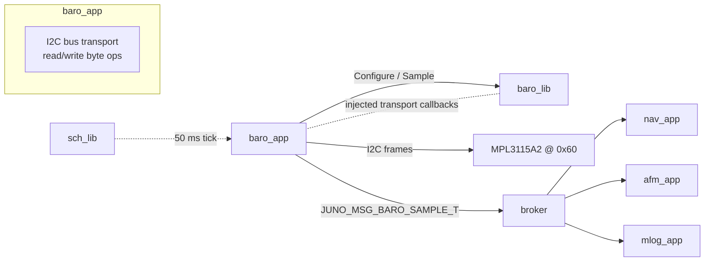
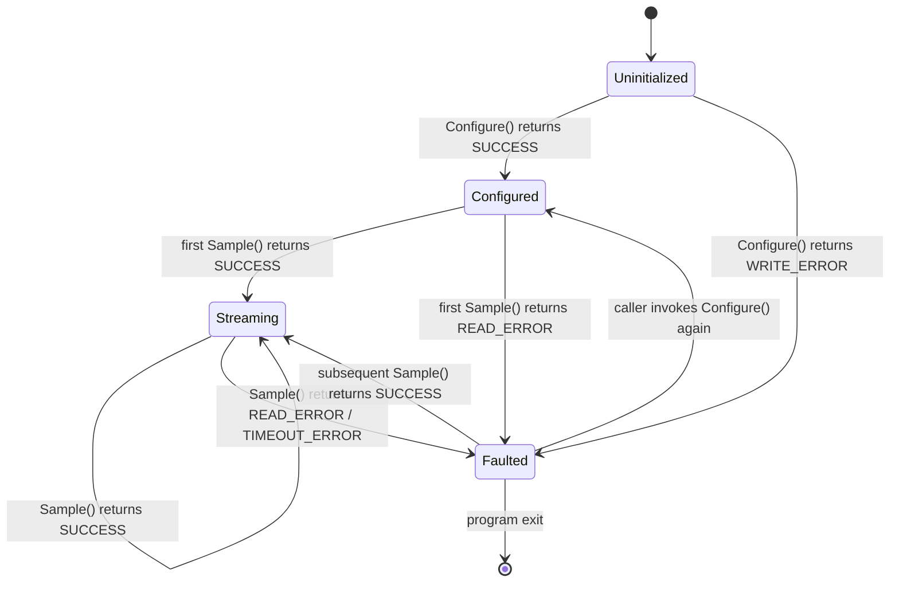
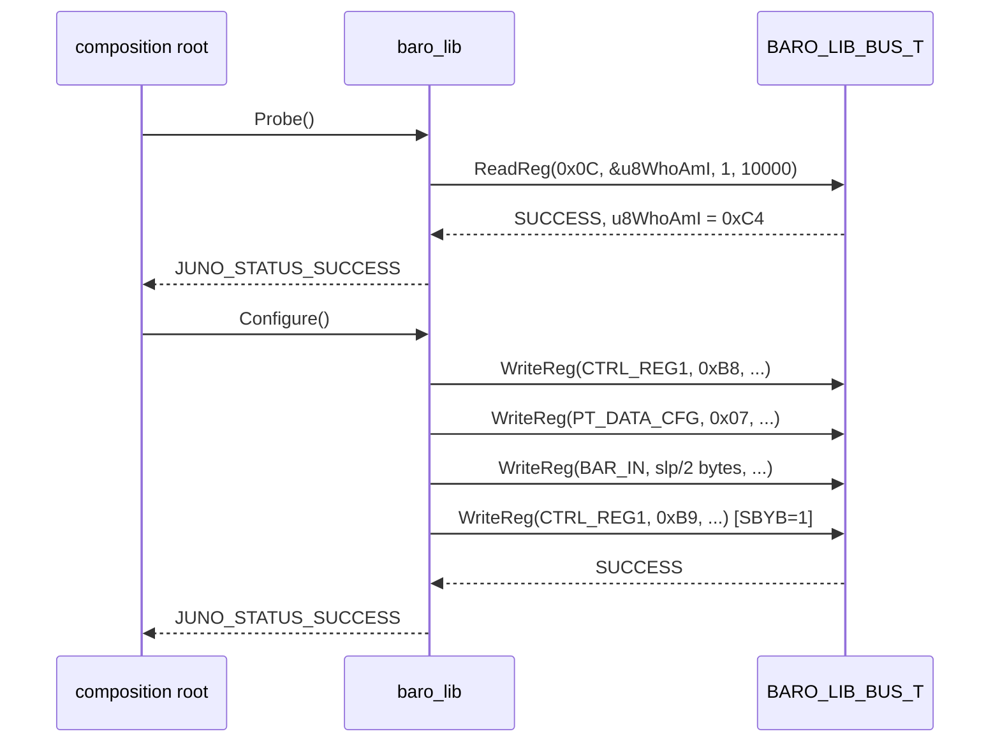

# Baro Library — Design (L2)

**Document type:** IEEE 1016 Software Design Description
**Module:** `baro_lib` (`libs/baro_lib/`)
**Scope:** MPL3115A2 barometric pressure / altitude sensor driver, POSIX + Pico2 implementations.
**Authoritative references (do not contradict):** `docs/design/conventions.md`, `docs/design/system/system_design.md`, `docs/requirements/baro/requirements.json`.

---

<!-- @{"design": ["SW-REQ-BARO-001", "SW-REQ-BARO-002", "SW-REQ-BARO-003", "SW-REQ-BARO-004", "SW-REQ-BARO-005", "SW-REQ-BARO-006", "SW-REQ-BARO-007", "SW-REQ-BARO-008", "SW-REQ-BARO-009", "SW-REQ-BARO-010"]} -->
## 1. Purpose and Scope

This L2 design specifies `baro_lib`, the barometric altimeter driver library. It addresses every requirement in `docs/requirements/baro/requirements.json`: `SW-REQ-BARO-001` through `SW-REQ-BARO-010` inclusive. The library wraps a single hardware part (NXP **MPL3115A2**, I2C address `0x60`) and exposes a uniform LibJuno C++ vtable to the consuming app `baro_app` (Controller-layer per `architecture.md`; see `system_design.md` §3.1).

In scope: public `BARO_LIB_API_T` surface; `BARO_LIB_ROOT_T` shape; POSIX impl (Trick simulated values via `sim_sensors`); Pico2 impl (RP2350 I2C master to MPL3115A2); state machine; sample data layout; error reporting; memory ownership; traceability.

Out of scope: I2C bus device driver itself (resides in `device_lib`; `baro_lib` is a peripheral driver and **does not touch the I2C bus directly** — the **composition root** owns bus access and injects the byte transport into `baro_lib` at `BARO_LIB_IMPL_T::New()`; the bus transport surface is a `BARO_LIB_BUS_T` `WriteReg`/`ReadReg` callback pair populated by `apps/main.cpp` for flight or by `sim_harness` for sim per `sim_harness/interfaces.md` §4.4.1 — `baro_app` itself never holds an I2C handle); software-bus publication of `JUNO_MSG_BARO_SAMPLE_T` (resides in `baro_app`); altitude conversion of sea-level reference to MSL; long-term calibration drift compensation.

---

## 2. Definitions and Abbreviations

Cross-module vocabulary (time base, frames, status semantics, memory ownership) is defined in `docs/design/conventions.md` §4 and §5 and is **not** redefined here. Module-local terms only:

| Term | Meaning |
|------|---------|
| MPL3115A2 | NXP barometric pressure / altitude / temperature I2C sensor; address `0x60`. |
| HAE | Height Above Ellipsoid (WGS-84) — the canonical altitude reference (`SW-REQ-SYS-039`, `conventions.md` §4.6). |
| SLP | Sea-Level reference Pressure (configurable in MPL3115A2 BAR_IN register); used by the part's onboard altitude derivation. |
| OSR | Over-Sampling Ratio (CTRL_REG1 OSR field on MPL3115A2). |
| `sim_sensors` | Trick simulation module that exposes simulated pressure / altitude / temperature for the POSIX impl (`SW-REQ-SYS-045`). |
| Bus transport | The byte-level I2C read/write callback set, owned by `baro_app` and injected to `baro_lib` at `New()`; the lib never names a specific HAL. |

`JUNO_TIME_US_T` (monotonic µs since startup) per `conventions.md` §4.2.

---

<!-- @{"design": ["SW-REQ-BARO-001", "SW-REQ-BARO-009", "SW-REQ-BARO-010"]} -->
## 3. System Overview

### 3.1 MVC layer mapping

| Layer | Realization | This module |
|-------|-------------|-------------|
| View (App) | `baro_app` — TDM-scheduled, owns state, performs all I2C bus calls, publishes `JUNO_MSG_BARO_SAMPLE_T`. | NOT this module. |
| Controller (Lib) | `baro_lib` — register-level driver: register layout, sample decoding, unit conversion, health flag. | **This module.** |
| Model (Bus) | `JUNO_MSG_BARO_SAMPLE_T` (catalog in `system_design.md` §4). | Type **defined** in `libs/baro_lib/include/baro_lib/baro_msg.hpp`; **published** by `baro_app`. |

### 3.2 Module context



`baro_lib` has **no** I2C peripheral handle, no file descriptor, no `clock_gettime` call. It is a pure decoder/encoder around `BARO_LIB_API_T`. The POSIX impl reads from a `sim_sensors`-backed transport callback set; the Pico2 impl reads from a callback set wired to RP2350 I2C0/I2C1 in `baro_app`'s composition. Both impls reach the **same** `BARO_LIB_ROOT_T` API (`SW-REQ-BARO-009`, `SW-REQ-BARO-010`, `SW-REQ-SYS-043`).

### 3.3 Sample-rate provenance

`SW-REQ-BARO-001` mandates 20 Hz throughput. The schedule period that satisfies this is `kBaroAppPeriodMs = 50` (`conventions.md` §4.5; `system_design.md` §3.3). The lib does not contain timing logic; it produces one decoded sample per `Sample()` invocation and the app paces calls.

---

<!-- @{"design": ["SW-REQ-BARO-002", "SW-REQ-BARO-003", "SW-REQ-BARO-004", "SW-REQ-BARO-005", "SW-REQ-BARO-007", "SW-REQ-BARO-008"]} -->
## 4. Interface Definitions

The header path is **`libs/baro_lib/include/baro_lib/baro_api.hpp`** (`system_design.md` §3.3). Namespace `juno::baro` (`conventions.md` §1.1).

### 4.1 Module structs (header skeleton)

```cpp
// MIT License header
#pragma once
#include "juno/module.h"
#include "juno/module.hpp"
#include "juno/status.h"
#include "juno/time/time_api.hpp"   // JUNO_TIME_US_T
#include <cstddef>
#include <cstdint>

namespace juno::baro
{

static constexpr uint8_t  kMpl3115a2I2cAddr = 0x60;     // SW-REQ-BARO-010
static constexpr uint32_t kSampleRateHz     = 20;       // SW-REQ-BARO-001
static constexpr float    kDefaultSlpPa     = 101325.0f; // sea-level pressure default

struct BARO_LIB_ROOT_T;

// Caller-supplied byte transport (no I2C peripheral inside baro_lib).
struct BARO_LIB_BUS_T
{
    // Function POINTERS (not references) — implementation amendment 2026-05-06
    // (SPRINT-IMPL-08 Phase 3): reference-typed members make BARO_LIB_BUS_T
    // non-default-constructible and non-copy-assignable, breaking the
    // BARO_LIB_*_T factory's `tImpl = {}` + field-assignment pattern. Pointers
    // match the LibJuno-canonical callback shape (e.g., JUNO_FAILURE_HANDLER_T).
    JUNO_STATUS_T (*WriteReg)(uint8_t u8Reg, const uint8_t *pcBuf,
                              size_t zLen, JUNO_TIME_US_T tTimeoutUs) noexcept;
    JUNO_STATUS_T (*ReadReg) (uint8_t u8Reg, uint8_t *pcBuf,
                              size_t zLen, JUNO_TIME_US_T tTimeoutUs) noexcept;
};

struct BARO_SAMPLE_T
{
    JUNO_TIME_US_T tTimestampUs;   // monotonic µs (conventions.md §4.2)
    float fPressurePa;             // SW-REQ-BARO-002
    float fTempC;                  // SW-REQ-BARO-003
    float fAltMHae;                // SW-REQ-BARO-004 (HAE per SW-REQ-SYS-039)
    bool  bValid;                  // false on read fail (SW-REQ-BARO-007)
};

struct BARO_LIB_API_T
{
    JUNO_STATUS_T          (&Configure)(BARO_LIB_ROOT_T &tRoot) noexcept;
    JUNO_STATUS_T          (&Probe)    (BARO_LIB_ROOT_T &tRoot) noexcept;
    RESULT_T<BARO_SAMPLE_T>(&Sample)   (BARO_LIB_ROOT_T &tRoot,
                                        JUNO_TIME_US_T tNowUs,
                                        JUNO_TIME_US_T tTimeoutUs) noexcept;
    JUNO_STATUS_T          (&SetSlp)   (BARO_LIB_ROOT_T &tRoot,
                                        float fSlpPa) noexcept;
    OPTION_T<bool>         (&IsHealthy)(const BARO_LIB_ROOT_T &tRoot) noexcept;
};

struct BARO_LIB_ROOT_T JUNO_MODULE_ROOT(BARO_LIB_API_T,
    BARO_LIB_BUS_T tBus;        // injected; never null after New()
    float          fSlpPa;       // current sea-level reference (configurable)
    bool           bHealthy;     // last-read flowing? (SW-REQ-BARO-006)
    bool           bConfigured;  // Configure() succeeded
);

} // namespace juno::baro
```

### 4.2 Function contracts

<!-- @{"design": ["SW-REQ-BARO-005"]} -->
#### 4.2.1 `Probe(BARO_LIB_ROOT_T&)`

| Attribute | Value |
|-----------|-------|
| Signature | `JUNO_STATUS_T (&Probe)(BARO_LIB_ROOT_T &tRoot) noexcept` |
| Preconditions | `tRoot` initialized via `New()`; bus transport callbacks valid; **not** required to be `Configure`-d. |
| Behavior | Reads MPL3115A2 `WHO_AM_I` (reg `0x0C`) once; verifies value `== 0xC4`. POSIX impl returns the value `sim_sensors` advertises. |
| Postconditions | On success, sensor identity confirmed; `bHealthy = true`. On failure, `bHealthy = false`. |
| Error conditions | `JUNO_STATUS_READ_ERROR` (transport returned error on WHO_AM_I read); `JUNO_STATUS_DNE_ERROR` (WHO_AM_I mismatch). |
| Thread safety | Not thread-safe; single-threaded TDM caller only. |

Used by POST (`SW-REQ-BARO-005`, parent `SW-REQ-SYS-029`). Verification method: Demonstration (per requirement).

#### 4.2.2 `Configure(BARO_LIB_ROOT_T&)`

| Attribute | Value |
|-----------|-------|
| Signature | `JUNO_STATUS_T (&Configure)(BARO_LIB_ROOT_T &tRoot) noexcept` |
| Preconditions | `tRoot` initialized via `New()`; `Probe()` succeeded. |
| Behavior | Writes `CTRL_REG1 = 0xB8` (OSR=128, altimeter mode, standby); writes `PT_DATA_CFG = 0x07` (DREADY enable for P/T); writes BAR_IN MSB/LSB from `tRoot.fSlpPa / 2.0`; sets `CTRL_REG1.SBYB = 1` to begin sampling. |
| Postconditions | Sensor in active 20 Hz mode; `bConfigured = true`. |
| Error conditions | `JUNO_STATUS_WRITE_ERROR` on any transport failure (Configure issues register writes); `bConfigured` left false. |
| Thread safety | Not thread-safe. |

#### 4.2.3 `Sample(BARO_LIB_ROOT_T&, JUNO_TIME_US_T, JUNO_TIME_US_T)`

| Attribute | Value |
|-----------|-------|
| Signature | `RESULT_T<BARO_SAMPLE_T> (&Sample)(BARO_LIB_ROOT_T &tRoot, JUNO_TIME_US_T tNowUs, JUNO_TIME_US_T tTimeoutUs) noexcept` |
| Preconditions | `bConfigured == true`. `tTimeoutUs > 0`. **Caller (`baro_app`) provides the current monotonic timestamp `tNowUs`** by calling `tTime.ptApi->Now(tTime)` and then `tTime.TimestampToMicros(tNow.tOk).tOk` immediately before invoking `Sample()` (per `conventions.md` §4.2; LibJuno's canonical `juno::time::TIME_API_T::Now` returns a `RESULT_T<JUNO_TIMESTAMP_T>` and `TIME_ROOT_T::TimestampToMicros` is a non-static member function). |
| Behavior | Reads `STATUS` (`0x00`) + `OUT_P_MSB..OUT_T_LSB` (`0x01..0x05`) in one block. Decodes Q18.2 pressure (Pa), Q12.4 temperature (°C), and Q18.2 altitude (m, MPL3115A2 onboard derivation referenced to `fSlpPa` set in `Configure`). Copies `tNowUs` into the result's `tTimestampUs` verbatim — the lib does not read any clock itself. |
| Postconditions | On success: `RESULT_T{SUCCESS, BARO_SAMPLE_T{...,bValid=true}}` with `tTimestampUs == tNowUs`; `bHealthy = true`. On error: `bValid = false` (with `tTimestampUs == tNowUs` still set); `bHealthy = false`. |
| Error conditions | `JUNO_STATUS_READ_ERROR` (transport read fail on STATUS / OUT_P/T registers); `JUNO_STATUS_TIMEOUT_ERROR` (`tTimeoutUs` elapsed without DREADY). Non-blocking guarantee: `Sample` returns within `tTimeoutUs` (`SW-REQ-BARO-008`). |
| Thread safety | Not thread-safe. |

The lib does **not** call any clock — `tNowUs` is sourced by `baro_app` from the canonical LibJuno time API (`tTime.ptApi->Now(tTime)` followed by `tTime.TimestampToMicros(...)`) and passed in by value; the lib places that value in `tTimestampUs`. This keeps `baro_lib` freestanding-pure (no time-source dependency in the driver) and ensures the timestamp reflects the caller's TDM tick boundary, not an internal sample-completion time.

#### 4.2.4 `SetSlp(BARO_LIB_ROOT_T&, float)`

| Attribute | Value |
|-----------|-------|
| Signature | `JUNO_STATUS_T (&SetSlp)(BARO_LIB_ROOT_T &tRoot, float fSlpPa) noexcept` |
| Preconditions | `tRoot` initialized; `fSlpPa` in `[80000.0f, 110000.0f]`. |
| Behavior | Writes BAR_IN MSB/LSB (regs `0x14..0x15`) with `fSlpPa / 2.0` in 2 Pa units (per MPL3115A2 datasheet). Updates `tRoot.fSlpPa`. |
| Postconditions | Onboard altitude derivation now references the new SLP. |
| Error conditions | `JUNO_STATUS_INVALID_DATA_ERROR` if out of range; `JUNO_STATUS_WRITE_ERROR` on transport fail. |
| Thread safety | Not thread-safe. |

#### 4.2.5 `IsHealthy(const BARO_LIB_ROOT_T&)`

| Attribute | Value |
|-----------|-------|
| Signature | `OPTION_T<bool> (&IsHealthy)(const BARO_LIB_ROOT_T &tRoot) noexcept` |
| Preconditions | `tRoot` initialized. |
| Behavior | Returns `OPTION_T{Some(true)}` if last read succeeded, `Some(false)` if last read failed; `None` if never read. |
| Postconditions | None (const). |
| Error conditions | None. |
| Thread safety | Read-only; safe to call from the single-threaded TDM caller. |

Surfaces the per-sensor health flag that `baro_app` ORs into the system bitmap (`SW-REQ-BARO-006`, parent `SW-REQ-SYS-031`).

### 4.3 IMPL skeleton (per-platform split — `BARO_LIB_POSIX_T` and `BARO_LIB_PICO2_T`)

**Amendment 2026-05-06 (SPRINT-IMPL-08 PM Q1):** This module follows the SPRINT-IMPL-05-retro-A canonical per-platform DERIVE pattern (matching the imu_lib precedent established in SPRINT-IMPL-07). Two distinct IMPL types are declared — `BARO_LIB_POSIX_T` and `BARO_LIB_PICO2_T` — each `JUNO_MODULE_DERIVE`-d from `BARO_LIB_ROOT_T`. Both IMPLs delegate the five register-decode static methods (Configure/Probe/Sample/SetSlp/IsHealthy) to a single common-source translation unit (`src/common/baro_common.cpp`); only the `New()` factory body is platform-specific (it wires the vtable once and returns the platform IMPL value).

```cpp
// libs/baro_lib/include/baro_lib/baro_posix.hpp
namespace juno::baro
{
struct BARO_LIB_POSIX_T JUNO_MODULE_DERIVE(BARO_LIB_ROOT_T,
    static JUNO_STATUS_T          Configure(BARO_LIB_ROOT_T &tRoot) noexcept;
    static JUNO_STATUS_T          Probe    (BARO_LIB_ROOT_T &tRoot) noexcept;
    static RESULT_T<BARO_SAMPLE_T>Sample   (BARO_LIB_ROOT_T &tRoot,
                                            JUNO_TIME_US_T tNowUs,
                                            JUNO_TIME_US_T tTimeoutUs) noexcept;
    static JUNO_STATUS_T          SetSlp   (BARO_LIB_ROOT_T &tRoot,
                                            float fSlpPa) noexcept;
    static OPTION_T<bool>         IsHealthy(const BARO_LIB_ROOT_T &tRoot) noexcept;

    static RESULT_T<BARO_LIB_POSIX_T> New(
        const BARO_LIB_BUS_T  &tBus,
        float                  fSlpPa,
        JUNO_FAILURE_HANDLER_T pfcnFailureHandler,
        JUNO_USER_DATA_T      *pvUserData
    ) noexcept;
);
}

// libs/baro_lib/include/baro_lib/baro_pico2.hpp
namespace juno::baro
{
struct BARO_LIB_PICO2_T JUNO_MODULE_DERIVE(BARO_LIB_ROOT_T,
    static JUNO_STATUS_T          Configure(BARO_LIB_ROOT_T &tRoot) noexcept;
    static JUNO_STATUS_T          Probe    (BARO_LIB_ROOT_T &tRoot) noexcept;
    static RESULT_T<BARO_SAMPLE_T>Sample   (BARO_LIB_ROOT_T &tRoot,
                                            JUNO_TIME_US_T tNowUs,
                                            JUNO_TIME_US_T tTimeoutUs) noexcept;
    static JUNO_STATUS_T          SetSlp   (BARO_LIB_ROOT_T &tRoot,
                                            float fSlpPa) noexcept;
    static OPTION_T<bool>         IsHealthy(const BARO_LIB_ROOT_T &tRoot) noexcept;

    static RESULT_T<BARO_LIB_PICO2_T> New(
        const BARO_LIB_BUS_T  &tBus,
        float                  fSlpPa,
        JUNO_FAILURE_HANDLER_T pfcnFailureHandler,
        JUNO_USER_DATA_T      *pvUserData
    ) noexcept;
);
}
```

Each `New()` wires the vtable once via a `static const BARO_LIB_API_T tApi{ ... }` local. No constructors / destructors, no allocation (`conventions.md` §1.3). Because `baro_lib` does not own any I2C peripheral handle (transport is callback-injected — §3.2), the two IMPLs differ only in the lifetime context of the bus callbacks they accept (POSIX: sim_sensors-backed; Pico2: I2C-backed via baro_app composition); the static methods themselves are platform-agnostic and live in `src/common/baro_common.cpp`. This split keeps the IMPL types greppable per platform and avoids the "single-IMPL-with-`void*`-handle" anti-pattern that SPRINT-IMPL-05-retro-A retired across the foundation libs.

---

## 5. State Machines



Mandated states (per brief AC-9): `Uninitialized → Configured → Streaming → Faulted`. State is encoded in the two `bool` members `bConfigured` and `bHealthy`:

| State | `bConfigured` | `bHealthy` | Last `Sample()` outcome |
|-------|---------------|------------|------------------------|
| Uninitialized | false | (unread) | n/a |
| Configured | true | (unread) | n/a (no Sample yet) |
| Streaming | true | true | last call SUCCESS |
| Faulted | true | false | last call READ_ERROR or TIMEOUT_ERROR |

Recovery from `Faulted` is automatic on the next successful `Sample()`. Re-`Configure()` is permitted but not required (the MPL3115A2 active mode persists across transient I2C errors).

---

<!-- @{"design": ["SW-REQ-BARO-002", "SW-REQ-BARO-003", "SW-REQ-BARO-004", "SW-REQ-BARO-006"]} -->
## 6. Data Flow

`baro_lib` itself does not publish to the broker; it only fills `BARO_SAMPLE_T` for `baro_app`. `baro_app` is the publisher of `JUNO_MSG_BARO_SAMPLE_T` (catalog row in `system_design.md` §4).

```
                     Sample()       Publish
+------------+     <------------+   +------------+      +-------+
| baro_lib   | ---fill BARO----| --| baro_app   |----->| broker|
| (decoder)  |    SAMPLE_T     |   | (View)     |      +-------+
+------------+                 |   +------------+
       ^                       |          |
       | injected transport    |          | I2C frames (Pico2)
       +-----------------------+          v
                                   +------------+
                                   | MPL3115A2  |
                                   |   0x60     |
                                   +------------+
```

**Critical design rule (AC-10):** `baro_lib` has zero direct hardware coupling. Every byte that crosses the I2C bus does so through a `BARO_LIB_BUS_T` callback that lives in `baro_app` (Pico2: hooks RP2350 I2C HAL via `device_lib`; POSIX: hooks `sim_sensors` shim that returns Trick-driven values). This keeps the driver freestanding-portable and unit-testable with a faked transport.

| Direction | Datum | Format | Source / Sink |
|-----------|-------|--------|---------------|
| Out (lib→app) | `BARO_SAMPLE_T.fPressurePa` | float32, Pa | derived from MPL3115A2 OUT_P_MSB..LSB |
| Out (lib→app) | `BARO_SAMPLE_T.fTempC` | float32, °C | derived from MPL3115A2 OUT_T_MSB..LSB |
| Out (lib→app) | `BARO_SAMPLE_T.fAltMHae` | float32, m HAE | onboard altitude (referenced to `fSlpPa`) |
| Out (lib→app) | `BARO_SAMPLE_T.tTimestampUs` | uint64_t µs | caller-supplied `tNowUs` (from `tTime.ptApi->Now(tTime)` + `tTime.TimestampToMicros(...)`); copied verbatim |
| Out (lib→app) | `BARO_SAMPLE_T.bValid` | bool | true iff transport SUCCESS |
| Out (app→broker) | `JUNO_MSG_BARO_SAMPLE_T` | POD | published by `baro_app` (not `baro_lib`) |

Buffer ownership: every `BARO_SAMPLE_T` is filled in a caller-supplied output (`RESULT_T<BARO_SAMPLE_T>`); the lib holds no rolling buffer.

---

<!-- @{"design": ["SW-REQ-BARO-001", "SW-REQ-BARO-005", "SW-REQ-BARO-007", "SW-REQ-BARO-008"]} -->
## 7. Sequence Diagrams

### 7.1 Nominal 50 ms cycle (TDM tick → Sample → publish)

```mermaid
sequenceDiagram
    participant sch as sch_lib
    participant baro_app
    participant baro_lib
    participant bus as BARO_LIB_BUS_T (in baro_app)
    participant hw as MPL3115A2
    participant broker

    sch->>baro_app: Execute() at t = k * 50 ms
    Note over baro_app: tNow = tTime.ptApi->Now(tTime).tOk;<br/>tNowUs = tTime.TimestampToMicros(tNow).tOk
    baro_app->>baro_lib: Sample(tNowUs, tTimeoutUs = 5000)
    baro_lib->>bus: ReadReg(0x00, buf[6], 5000)
    bus->>hw: I2C read STATUS..OUT_T_LSB
    hw-->>bus: 6 bytes
    bus-->>baro_lib: SUCCESS
    Note over baro_lib: decode P/T/Alt;<br/>tTimestampUs := tNowUs; bHealthy = true
    baro_lib-->>baro_app: RESULT_T{SUCCESS, BARO_SAMPLE_T{bValid=true}}
    baro_app->>broker: Publish(JUNO_MSG_BARO_SAMPLE_T)
```

### 7.2 Read failure → unhealthy → continued operation

```mermaid
sequenceDiagram
    participant sch as sch_lib
    participant baro_app
    participant baro_lib
    participant bus as BARO_LIB_BUS_T
    participant sys_app

    sch->>baro_app: Execute()
    Note over baro_app: tNow = tTime.ptApi->Now(tTime).tOk;<br/>tNowUs = tTime.TimestampToMicros(tNow).tOk
    baro_app->>baro_lib: Sample(tNowUs, 5000)
    baro_lib->>bus: ReadReg(0x00, buf[6], 5000)
    bus-->>baro_lib: JUNO_STATUS_READ_ERROR
    Note over baro_lib: bHealthy = false<br/>Failure handler diagnostic-only<br/>(SW-REQ-SYS-037, conventions §4.3)
    baro_lib-->>baro_app: RESULT_T{READ_ERROR, BARO_SAMPLE_T{bValid=false}}
    baro_app->>baro_app: tHealthBitLocal |= kBaroBit (SW-REQ-SYS-058)
    baro_app->>broker: Publish(BARO_SAMPLE_T{bValid=false})
    sch->>sys_app: Execute() at next 100 ms boundary
    sys_app->>broker: Publish(SYS_HEALTH_T{bitmap |= BARO})
```

### 7.3 POST probe at boot



---

<!-- @{"design": ["SW-REQ-BARO-001", "SW-REQ-BARO-008"]} -->
## 8. Timing and Scheduling Analysis

| Quantity | Value | Source |
|----------|-------|--------|
| App TDM period | `kBaroAppPeriodMs = 50` (20 Hz) | `system_design.md` §3.3, `conventions.md` §4.5 |
| Lib `Sample()` worst-case budget | < 1.5 ms (6-byte I2C burst @ 400 kHz ≈ 0.18 ms transport + decode) | datasheet + RP2350 I2C HAL |
| Lib `Probe()` worst-case budget | < 1.0 ms (1-byte I2C read) | datasheet |
| Lib `Configure()` worst-case budget | < 2.0 ms (4 register writes) | datasheet |
| Caller-supplied `tTimeoutUs` | recommended `5000` µs nominal | bounded < 50 ms slot |
| Non-blocking guarantee | `Sample()` returns within `tTimeoutUs` (`SW-REQ-BARO-008`) | enforced by the bus transport's per-call timeout |

The library performs no sleeps and no spin-loops without a timeout. The 5 ms ceiling on a single TDM tick (`system_design.md` §8.2) is preserved: `baro_app`'s 50 ms slot is far larger than the worst-case `Sample()` cost and any retry budget the app chooses.

Downstream consumers and their cadences (informational; subscriber wiring is in `system_design.md` §4):

| Consumer | Period | Use of `JUNO_MSG_BARO_SAMPLE_T` |
|----------|--------|--------------------------------|
| `nav_app` | 10 ms | EKF altitude / pressure measurement update |
| `afm_app` | 10 ms | Apogee detection input |
| `mlog_app` | 10 ms | Persists every sample (no downsampling — `SW-REQ-SYS-011`) |

---

<!-- @{"design": ["SW-REQ-BARO-006", "SW-REQ-BARO-007"]} -->
## 9. Error Handling Strategy

The library follows the system-wide error idiom (`system_design.md` §9, `conventions.md` §4.3). Specific points:

1. **Status propagation.** Every `BARO_LIB_API_T` member returns `JUNO_STATUS_T`, `RESULT_T<T>`, or `OPTION_T<T>`. Callers use `JUNO_ASSERT_OK(tResult, return tResult.tStatus);` etc.; bare `if`-return is forbidden.
2. **Failure handler.** `pfcnFailureHandler` injected at `New()` is invoked with a context string (`"baro:probe"`, `"baro:configure"`, `"baro:sample"`) on every IO error. **Diagnostic only — never alters control flow** (`SW-REQ-SYS-037`).
3. **Per-sensor health flag.** `bHealthy` is the lib's local mirror of the system health bit. `IsHealthy()` is the read accessor; `baro_app` ORs the inverted value into `kBaroBit` of `JUNO_MSG_SYS_HEALTH_T.u32HealthBitmap` (`SW-REQ-BARO-006`, parent `SW-REQ-SYS-031`; satisfies `SW-REQ-SYS-058`).
4. **Read-failure status (`SW-REQ-BARO-007`).** A transport read failure surfaces as `RESULT_T<BARO_SAMPLE_T>{ READ_ERROR | TIMEOUT_ERROR, sample{bValid=false} }`. The caller observes both `tStatus != SUCCESS` and `sample.bValid == false`. Two redundant signals satisfy the parent `SW-REQ-SYS-058` continuation requirement (the app continues; the bit is set).
5. **Non-blocking timeout (`SW-REQ-BARO-008`).** Every transport call carries a caller-supplied `tTimeoutUs`. The library never spin-waits without it. On timeout, `JUNO_STATUS_TIMEOUT_ERROR` is returned and `bHealthy = false`.
6. **No exceptions / RTTI / heap.** Every function `noexcept`; structs trivially constructible (`conventions.md` §1.3, `SW-REQ-SYS-053`).
7. **Configuration validity.** `SetSlp()` rejects out-of-range SLP values without touching the wire — `JUNO_STATUS_INVALID_DATA_ERROR`, no I2C transaction.

---

## 10. Memory Ownership

Per `conventions.md` §5 and `system_design.md` §10.1: **caller owns every byte; the library allocates nothing.**

| Buffer / facility | Owner | Lifetime | Allocation |
|-------------------|-------|----------|------------|
| `BARO_LIB_IMPL_T` instance | composition root (`apps/main.cpp`) | program lifetime | Static / `.bss` |
| `BARO_LIB_ROOT_T` (embedded in IMPL) | composition root | program lifetime | Static |
| `BARO_LIB_BUS_T` callback set | `baro_app` (composes its own transport) | program lifetime | Static; passed to `New()` by reference, copied into `tRoot.tBus` once |
| `BARO_SAMPLE_T` returned from `Sample()` | caller (`baro_app`) — POD value, returned by value inside `RESULT_T<>` | one call | Stack |
| `tNowUs` argument to `Sample()` | caller (`baro_app`) — passed by value (8-byte scalar) derived from `tTime.ptApi->Now(tTime)` + `tTime.TimestampToMicros(...)` | one call | Stack (register on Pico2 / POSIX ABI) |
| Vtable `tApi` | `New()` factory's file-scope `static` local | program lifetime | Read-only after construction |

Asserted invariants:

- **No `new`, `delete`, `malloc`, `calloc`, `realloc`, `free`, no heap-backed STL containers** (`SW-REQ-SYS-050`).
- **No global mutable state** in the library — only the `static` vtable inside `New()`, which is read-only after construction.
- **No constructors / destructors** on `BARO_LIB_ROOT_T`, `BARO_LIB_IMPL_T`, or `BARO_SAMPLE_T` (`conventions.md` §1.3).
- **No I2C peripheral handle** stored in either `ROOT_T` or `IMPL_T` — the library does not touch the bus.

---

## 11. Traceability

Per-section `<!-- @{"design": [...]} -->` tags above are authoritative; this table consolidates them.

| Req ID | Title | Section(s) |
|--------|-------|-----------|
| SW-REQ-BARO-001 | Support 20 Hz Altimeter Sampling | §1, §3, §7.1, §8 |
| SW-REQ-BARO-002 | Report Pressure in Pascals | §1, §4.1, §4.2.3, §6 |
| SW-REQ-BARO-003 | Report Temperature in Degrees Celsius | §1, §4.1, §4.2.3, §6 |
| SW-REQ-BARO-004 | Report Derived Altitude in Meters | §1, §4.1, §4.2.3, §6 |
| SW-REQ-BARO-005 | Power-On Self-Test Device Probe | §1, §4.2.1, §7.3 |
| SW-REQ-BARO-006 | Continuous Altimeter Health Reporting | §1, §4.2.5, §6, §9 |
| SW-REQ-BARO-007 | Read Failure Status Reporting | §1, §4.2.3, §7.2, §9 |
| SW-REQ-BARO-008 | Non-Blocking Read Interface | §1, §4.2.3, §8, §9 |
| SW-REQ-BARO-009 | POSIX Implementation Functional Equivalence | §1, §3, §4.3 |
| SW-REQ-BARO-010 | Pico2 Implementation for Flight Hardware | §1, §3, §4.3 |

**POSIX/Pico2 functional equivalence statement (`SW-REQ-SYS-043`).** The composition graph is identical across both targets; only `libs/baro_lib/src/posix/baro_posix.cpp` and `libs/baro_lib/src/pico2/baro_pico2.cpp` differ. Both impls reach the same `BARO_LIB_ROOT_T` API and produce identically formatted `BARO_SAMPLE_T` outputs (`SW-REQ-BARO-009`, `SW-REQ-BARO-010`). Trick SITL exercises the POSIX impl through `sim_sensors`-backed transport callbacks (`SW-REQ-SYS-045`).

**Altitude reference — canonical name with documented divergence.** `SW-REQ-BARO-004` requires "altitude in meters" but does not pin a reference frame; it defers to the design. The cross-module catalog in `system_design.md` §4 **locks the field name `fAltMHae`** for every `BARO_SAMPLE_T` / `JUNO_MSG_BARO_SAMPLE_T` instance — the canonical name is fixed and **must not be renamed at the `baro_lib` boundary**. This design therefore retains `fAltMHae` as the field identifier and explicitly documents the semantic divergence here, following `conventions.md` §6 ("canonical name with documented divergence" path):

- The MPL3115A2 produces a barometric-pressure altitude computed from its onboard standard-atmosphere model referenced to the configured SLP register (set via `SetSlp()` / `Configure()`). It is **not** WGS-84 ellipsoidal height.
- `BARO_SAMPLE_T.fAltMHae` shall therefore be read as: *"barometric-pressure altitude reported in HAE-equivalent canonical units (meters), where the actual reference is barometric and pinned to the configured SLP."* The unit is meters; the canonical name is preserved; the semantic difference from true WGS-84 HAE is the responsibility of the downstream consumer to reconcile.
- **`nav_lib` is responsible for any HAE correction.** Specifically, `nav_lib` performs the geoid / SLP / standard-atmosphere reconciliation before producing `JUNO_MSG_NAV_STATE_T.fAltMHae`, which is the system-level position-frame altitude that satisfies `SW-REQ-SYS-039`. `baro_lib` does **not** perform this correction and does **not** depend on geoid data.
- Consumers of `JUNO_MSG_BARO_SAMPLE_T` other than `nav_app` (e.g., `afm_app` apogee detection, `mlog_app` raw logging) operate on the barometric-altitude semantics directly and do not require HAE reconciliation, so the divergence is benign at those subscribers.

**Sea-level reference pressure (calibration source).** Configurable via `SetSlp()` at runtime; default `kDefaultSlpPa = 101325.0f`. `SetSlp()` is not directly mandated by any `SW-REQ-BARO-*` requirement but is required to make `fAltMHae` meaningful per `SW-REQ-BARO-004`. The composition root (or a future ground-segment uplink) supplies the launch-day SLP. See FLAG below.

---

## FLAGs Raised

**FLAG-1: SLP calibration source not pinned by requirements.** `SW-REQ-BARO-004` requires altitude reporting in meters but does not specify how the sea-level reference pressure is obtained at startup. This design exposes `SetSlp()` and a compile-time default `kDefaultSlpPa = 101325.0f`. Software Lead / PM confirmation requested: is the launch-day SLP (a) hardcoded, (b) compiled in per-mission, (c) injected via composition root from a config header, or (d) accepted via uplink? Option (c) is recommended for FT1 simplicity. No requirement currently mandates any of these, so the design is permissive.

**FLAG-2 (resolved — recorded as documented divergence, no PM action required).** The MPL3115A2's onboard altitude is computed against the standard atmosphere referenced to the SLP register and is **not** WGS-84 ellipsoidal height. `SW-REQ-SYS-039` mandates HAE for the **system-level** position frame (`JUNO_MSG_NAV_STATE_T`), which `nav_app` produces — not for `BARO_SAMPLE_T`. The catalog in `system_design.md` §4 locks the field name `fAltMHae` at the `baro_lib` boundary; renaming would violate the cross-module convention. Per `conventions.md` §6 ("canonical name with documented divergence"), this design retains the canonical name and documents the divergence in §11 above, delegating HAE reconciliation to `nav_lib`. No `SW-REQ-BARO-*` requirement is in conflict, and no Software Lead / PM action is required.

**FLAG-3: `Probe()` is not explicitly required by `SW-REQ-BARO-*` to live in `BARO_LIB_API_T`.** `SW-REQ-BARO-005` requires the lib to "report at startup whether the altimeter device is present and responsive" — this design realizes that as a dedicated `Probe()` API entry called from POST. An alternative realization is a pass/fail flag returned by `Configure()`. Either is consistent with the requirement; this design chose the explicit `Probe()` for clean POST orchestration in `sys_app` (`SW-REQ-SYS-029`).
