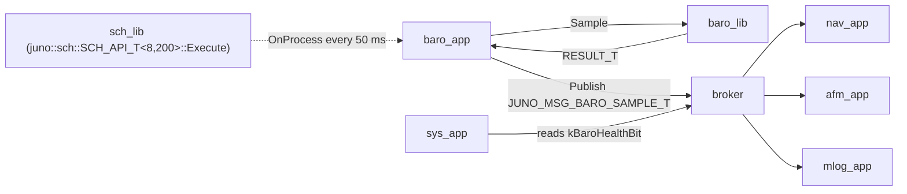
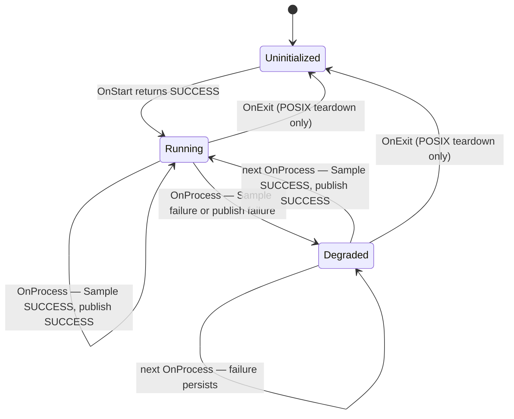
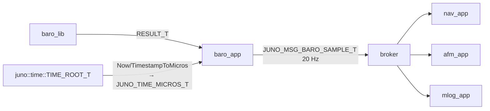

# Juno FSW — `baro_app` Design (L2)

**Document type:** IEEE 1016 SDD
**Module:** `baro_app` (App / View)
**Requirements covered:** `SW-REQ-BARO-APP-001` through `SW-REQ-BARO-APP-010`
**Authoritative refs:** `docs/design/conventions.md` (§1.4 app lifecycle, §4.5 period table), `docs/design/system/system_design.md` (§3.3, §8.1)
**LibJuno header (canonical):** `libjuno/include/juno/app/app_api.hpp`
**Sibling refs:** `docs/design/baro/design.md`, `docs/requirements/baro_app/requirements.json`

---

<!-- @{"design": ["SW-REQ-BARO-APP-001", "SW-REQ-BARO-APP-002", "SW-REQ-BARO-APP-003", "SW-REQ-BARO-APP-004"]} -->
## 1. Purpose and Scope

L2 design for the FT1 barometric altimeter application (`baro_app`). Addresses every requirement in `docs/requirements/baro_app/requirements.json` (`SW-REQ-BARO-APP-001` through `SW-REQ-BARO-APP-010`).

`baro_app` is a thin, view-layer scheduler-driven adapter that, on each TDM tick, acquires one barometer sample from `baro_lib` and publishes a `JUNO_MSG_BARO_SAMPLE_T` on the LibJuno software broker. **No filtering, no smoothing, no unit conversion, no business logic** (`SW-REQ-BARO-APP-004`); all sampling, decoding, and unit-correct production is delegated to `baro_lib`.

In scope: realization of LibJuno's canonical `juno::app::APP_API_T { OnStart, OnProcess, OnExit }` lifecycle (`libjuno/include/juno/app/app_api.hpp`; `conventions.md` §1.4); the free composition-root setup function `juno::baro_app::BaroAppInit`; per-tick data-flow contract; published message type and timestamping; Uninitialized → Running → Degraded state machine; timing budget at `kBaroAppPeriodMs = 50` (20 Hz, `conventions.md` §4.5); failure-to-health-bit mapping; traceability for all 10 BARO-APP requirements.

Out of scope: register-level baro driver (`baro_lib`); altitude derivation (`baro_lib`); broker implementation (`libjuno/sb`); system health bitmap aggregation (`sys_app`); the cyclic-executive loop itself — `juno::sch::SCH_API_T<8, 200>::Execute`, owned at the composition root (`system_design.md` §8.1).

---

## 2. Definitions and Abbreviations

Cross-module vocabulary (time base, frames, units, status semantics, message naming, scheduler period units, MVC layering, **app lifecycle hooks**) is defined in `conventions.md` §4 and §1.4 and inherited verbatim. Module-local terms only:

| Term | Meaning |
|------|---------|
| `BARO_APP_T` | The `baro_app` aggregate; first member is `juno::app::APP_ROOT_T tRoot;` per `conventions.md` §1.4 (caller-owned, trivially constructible) |
| `juno::app::APP_ROOT_T` / `APP_API_T` | Canonical LibJuno application lifecycle ROOT and vtable (`libjuno/include/juno/app/app_api.hpp`); fields `OnStart`, `OnProcess`, `OnExit` |
| `juno::app::AppInit` | LibJuno helper that wires the `APP_API_T` reference, `JUNO_FAILURE_HANDLER_T`, and `JUNO_USER_DATA_T*` into an `APP_ROOT_T` |
| `BARO_LIB_ROOT_T` | The `baro_lib` LibJuno root struct injected at `BaroAppInit` |
| `BROKER_ROOT_T<JUNO_MSG_BUS_VARIANT_T, 8, 64>` | LibJuno templated software-bus broker root (`libjuno/include/juno/sb/broker_api.hpp`) |
| `juno::time::TIME_ROOT_T` | LibJuno canonical time root (`libjuno/include/juno/time/time_api.hpp`); supplies `Now` and `TimestampToMicros` |
| `JUNO_MSG_BARO_SAMPLE_T` | Bus message type from `libs/baro_lib/include/baro_lib/baro_msg.hpp` |
| `kBaroAppPeriodMs` | `static constexpr uint32_t = 50` — 20 Hz TDM period (`SW-REQ-SYS-008`, `conventions.md` §4.5) |
| HAE | Height Above Ellipsoid (WGS-84) (`SW-REQ-SYS-039`, `conventions.md` §4.6) |
| `kBaroHealthBit` | Per-sensor bit set on a baro read failure and surfaced in `JUNO_MSG_SYS_HEALTH_T.u32HealthBitmap` (`SW-REQ-SYS-031`, `-058`) |

---

<!-- @{"design": ["SW-REQ-BARO-APP-001", "SW-REQ-BARO-APP-003", "SW-REQ-BARO-APP-006", "SW-REQ-BARO-APP-009"]} -->
## 3. System Overview

### 3.1 MVC layer mapping

`baro_app` is an **App (View)** per `conventions.md` §3 and `system_design.md` §3.1. It owns no business logic — only TDM scheduling state and references to its dependencies.

| Layer | Realization |
|-------|-------------|
| View (App) | `juno::baro_app::BARO_APP_T` whose first member is `juno::app::APP_ROOT_T tRoot;` (canonical; `conventions.md` §1.4) |
| Controller (Lib) | `juno::baro::BARO_LIB_ROOT_T` (designed in `docs/design/baro/design.md`) |
| Model (Bus) | `JUNO_MSG_BARO_SAMPLE_T` published via `juno::sb::BROKER_ROOT_T<JUNO_MSG_BUS_VARIANT_T, 8, 64>` |

### 3.2 Module in context



### 3.3 Source layout and aggregate shape

| Artifact | Path |
|----------|------|
| Public header | `apps/baro_app/include/baro_app/baro_app.hpp` |
| Implementation | `apps/baro_app/src/baro_app.cpp` |
| Bus message header | `libs/baro_lib/include/baro_lib/baro_msg.hpp` (`conventions.md` §4.4) |
| Unit tests | `apps/baro_app/test/baro_app_test.cpp` |

`baro_app` has **one** implementation file shared across POSIX and Pico2 (`SW-REQ-BARO-APP-009`); platform divergence lives in `baro_lib`. The app contains no platform-specific code, no I²C/SPI, no peripheral handles.

The `BARO_APP_T` aggregate **is** the per-app concrete struct mandated by `conventions.md` §1.4. Its first member is `juno::app::APP_ROOT_T tRoot;`. There is **no parallel `BARO_APP_API_T` type** — the canonical `juno::app::APP_API_T` vtable is the sole API surface, instantiated as a single `static const` file-scope datum inside `BaroAppInit` and wired into `tRoot` via `juno::app::AppInit` (see §4, §10).

---

<!-- @{"design": ["SW-REQ-BARO-APP-001", "SW-REQ-BARO-APP-002", "SW-REQ-BARO-APP-003", "SW-REQ-BARO-APP-004", "SW-REQ-BARO-APP-005", "SW-REQ-BARO-APP-006", "SW-REQ-BARO-APP-009", "SW-REQ-BARO-APP-010"]} -->
## 4. Interface Definitions

### 4.1 Header sketch (`apps/baro_app/include/baro_app/baro_app.hpp`)

```cpp
// SPDX-License-Identifier: MIT
#pragma once
#include "juno/module.h"
#include "juno/module.hpp"
#include "juno/status.h"
#include "juno/app/app_api.hpp"      // canonical APP_ROOT_T / APP_API_T / AppInit
#include "juno/sb/broker_api.hpp"
#include "juno/time/time_api.hpp"
#include "baro_lib/baro_api.hpp"
#include "baro_lib/baro_msg.hpp"
#include <cstdint>

namespace juno::baro_app
{

static constexpr uint32_t       kBaroAppPeriodMs       = 50;   // 20 Hz, SW-REQ-SYS-008
static constexpr JUNO_TIME_MICROS_T kBaroSampleTimeoutUs   = 5000; // bounded < 5 ms slot

enum class BARO_APP_STATE_T : uint8_t
{
    UNINITIALIZED = 0,
    RUNNING       = 1,
    DEGRADED      = 2,
};

// First member is APP_ROOT_T per conventions.md §1.4.
// Trivially constructible; .bss zero-init yields _eState == UNINITIALIZED.
struct BARO_APP_T
{
    juno::app::APP_ROOT_T tRoot;            // canonical; first member

    // Injected at BaroAppInit; caller-owned, program-lifetime references.
    juno::baro::BARO_LIB_ROOT_T                                                *_ptBaroLib;
    juno::sb::BROKER_ROOT_T<JUNO_MSG_BUS_VARIANT_T, /*NPipes=*/8, /*NReg=*/64> *_ptBus;
    juno::time::TIME_ROOT_T                                                    *_ptTime;

    BARO_APP_STATE_T _eState;        // zero-init = UNINITIALIZED
    uint32_t         _u32CycleCount; // monotonic; for determinism check
    uint32_t         _u32FailCount;  // consecutive failure counter
};

// Free composition-root setup function (conventions.md §1.4).
JUNO_STATUS_T BaroAppInit(
    BARO_APP_T &tApp,
    juno::baro::BARO_LIB_ROOT_T &tBaroLib,
    juno::sb::BROKER_ROOT_T<JUNO_MSG_BUS_VARIANT_T, 8, 64> &tBus,
    juno::time::TIME_ROOT_T &tTime,
    JUNO_FAILURE_HANDLER_T pfcnFailureHandler,
    JUNO_USER_DATA_T *pvUserData
) noexcept;

} // namespace juno::baro_app
```

`BARO_APP_T` is a trivially constructible POD (no constructor/destructor — `conventions.md` §1.3). Subscriber wiring (broker advertise / topic registration) is performed inside `OnStart`, **not** inside `BaroAppInit` (see §4.3).

### 4.2 `BaroAppInit` contract (free composition-root setup function)

<!-- @{"design": ["SW-REQ-BARO-APP-001", "SW-REQ-BARO-APP-009"]} -->

| Attribute | Value |
|-----------|-------|
| Signature | See §4.1 header sketch (5 references + 1 failure-handler + 1 user-data, all `noexcept`) |
| Preconditions | `tBaroLib` constructed via `BARO_LIB_IMPL_T::New()`; `tBus` constructed; `tTime` initialized via `juno::time::TimeInit`; `tApp._eState == UNINITIALIZED` (`.bss` zero-init) |
| Postconditions | `_ptBaroLib`/`_ptBus`/`_ptTime` set; `tApp.tRoot` wired with the static `APP_API_T` referencing `BaroApp_OnStart`/`OnProcess`/`OnExit`; `tApp.tRoot.pfcnFailureHandler == pfcnFailureHandler`; `tApp.tRoot.pvUserData == pvUserData`. `_eState` unchanged (transition to `RUNNING` happens in `OnStart`). |
| Error conditions | Returns whatever `juno::app::AppInit` returns. |
| Thread safety | Not thread-safe; called once before scheduler `Execute()` |
| Allocation | None |

Reference implementation (canonical aggregate-init pattern from `conventions.md` §1.4 and `libjuno/include/juno/app/app_api.hpp`):

```cpp
namespace juno::baro_app
{
// Forward declarations of static hooks (defined in baro_app.cpp).
static JUNO_STATUS_T BaroApp_OnStart  (juno::app::APP_ROOT_T &tApp) noexcept;
static JUNO_STATUS_T BaroApp_OnProcess(juno::app::APP_ROOT_T &tApp) noexcept;
static JUNO_STATUS_T BaroApp_OnExit   (juno::app::APP_ROOT_T &tApp) noexcept;

JUNO_STATUS_T BaroAppInit(
    BARO_APP_T &tApp,
    juno::baro::BARO_LIB_ROOT_T &tBaroLib,
    juno::sb::BROKER_ROOT_T<JUNO_MSG_BUS_VARIANT_T, 8, 64> &tBus,
    juno::time::TIME_ROOT_T &tTime,
    JUNO_FAILURE_HANDLER_T pfcnFailureHandler,
    JUNO_USER_DATA_T *pvUserData
) noexcept
{
    tApp._ptBaroLib = &tBaroLib;
    tApp._ptBus     = &tBus;
    tApp._ptTime    = &tTime;
    // SOLE file-scope datum for this translation unit (conventions.md §1.3, §10):
    static const juno::app::APP_API_T tApi {
        &BaroApp_OnStart, &BaroApp_OnProcess, &BaroApp_OnExit
    };
    return juno::app::AppInit(tApp.tRoot, tApi, pfcnFailureHandler, pvUserData);
}
} // namespace juno::baro_app
```

The static `juno::app::APP_API_T tApi` instance is the **only** file-scope datum of the `baro_app` translation unit. It is `const` and read-only for the program's lifetime (`conventions.md` §5 rule 3).

### 4.3 `BaroApp_OnStart` contract (called once before the first `OnProcess`)

<!-- @{"design": ["SW-REQ-BARO-APP-003", "SW-REQ-BARO-APP-006"]} -->

| Attribute | Value |
|-----------|-------|
| Signature | `static JUNO_STATUS_T BaroApp_OnStart(juno::app::APP_ROOT_T &tApp) noexcept` |
| Preconditions | `BaroAppInit` returned `SUCCESS`; broker constructed; scheduler not yet entered `Execute` |
| Behavior | Downcast `tApp` to `BARO_APP_T &` via `JUNO_MODULE_DERIVE` (`conventions.md` §1.2). Advertise / register `JUNO_MSG_BARO_SAMPLE_T` with `_ptBus`. Reset counters. Set `_eState = RUNNING`. |
| Postconditions | `_eState == RUNNING`; broker advertise complete; counters cleared |
| Error conditions | Broker `JUNO_STATUS_T` (e.g., `JUNO_STATUS_TABLE_FULL_ERROR`) on advertise failure; on non-success leaves `_eState == UNINITIALIZED`; failure handler invoked (diagnostic only) |
| Thread safety | Not thread-safe; invoked once by composition root |
| Allocation | None |

`OnStart` is the sole place broker subscriptions / advertisements happen; `OnProcess` assumes the advertise is in place. This is the canonical lifecycle split documented in `conventions.md` §1.4.

### 4.4 `BaroApp_OnProcess` contract (per-tick body)

<!-- @{"design": ["SW-REQ-BARO-APP-002", "SW-REQ-BARO-APP-003", "SW-REQ-BARO-APP-004", "SW-REQ-BARO-APP-005", "SW-REQ-BARO-APP-006", "SW-REQ-BARO-APP-010"]} -->

| Attribute | Value |
|-----------|-------|
| Signature | `static JUNO_STATUS_T BaroApp_OnProcess(juno::app::APP_ROOT_T &tApp) noexcept` |
| Preconditions | `OnStart` returned `SUCCESS`; called by `juno::sch::SCH_API_T<8, 200>::Execute` at every `kBaroAppPeriodMs` boundary |
| Behavior | Downcast to `BARO_APP_T &`. Capture `tNowUs` via `tNow = _ptTime->ptApi->Now(*_ptTime).tOk;` then `tNowUs = _ptTime->TimestampToMicros(tNow).tOk;` (canonical per `conventions.md` §4.2; LibJuno publishes `TimestampToMicros` as a non-static member of `TIME_ROOT_T`). Invoke `_ptBaroLib->ptApi->Sample(*_ptBaroLib, tNowUs, kBaroSampleTimeoutUs)`. Copy returned fields verbatim into a stack `JUNO_MSG_BARO_SAMPLE_T` (`SW-REQ-BARO-APP-004`); set `tTimestampUs = tNowUs` (`SW-REQ-BARO-APP-005`); set `bValid` from call status. Publish via `_ptBus`. Update `_eState`/`_u32CycleCount`/`_u32FailCount`. |
| Postconditions | Exactly one `Sample` and one `Publish` per cycle; `tTimestampUs == tNowUs`; on success `_eState == RUNNING`, on failure `_eState == DEGRADED`; `_u32CycleCount` incremented |
| Error conditions | Propagated `baro_lib` status on `Sample` failure; broker status on publish failure. Non-success **does not** halt the schedule (`SW-REQ-SYS-033`). |
| Thread safety | Not thread-safe |
| Determinism | Identical inputs yield identical published bytes (`SW-REQ-BARO-APP-010`) — no allocation, no branching on time, no global mutable state |
| Allocation | None — message buffer is a stack temporary; broker copies on `Publish` (`conventions.md` §5 rule 6) |

### 4.5 `BaroApp_OnExit` contract (POSIX teardown only; flight never invokes)

| Attribute | Value |
|-----------|-------|
| Signature | `static JUNO_STATUS_T BaroApp_OnExit(juno::app::APP_ROOT_T &tApp) noexcept` |
| Preconditions | Scheduler `Execute` has returned (POSIX hosted test path only). Pico2 flight never invokes (`SW-REQ-SYS-047`; `conventions.md` §1.4). |
| Behavior | Downcast to `BARO_APP_T &`. Set `_eState = UNINITIALIZED`. No I/O — broker un-advertise is the broker's responsibility. Exists primarily so POSIX unit tests can clean up between cases. |
| Postconditions | `_eState == UNINITIALIZED`; counters retained for inspection |
| Error conditions | None expected; returns `JUNO_STATUS_SUCCESS` |
| Thread safety | Not thread-safe |
| Allocation | None |

### 4.6 Bus message contract (referenced)

`JUNO_MSG_BARO_SAMPLE_T` is owned by `baro_lib` (`conventions.md` §4.4). The app uses the type verbatim; field meanings come from `system_design.md` §4:

| Field | Type | Source | Notes |
|-------|------|--------|-------|
| `tTimestampUs` | `JUNO_TIME_MICROS_T` | `_ptTime->ptApi->Now(*_ptTime)` + `_ptTime->TimestampToMicros(...)` | `SW-REQ-BARO-APP-005`, `SW-REQ-SYS-027` |
| `fPressurePa` | `float` (Pa) | `baro_lib` | `SW-REQ-BARO-APP-008`, `SW-REQ-BARO-002` |
| `fAltMHae` | `float` (m, canonical name; barometric onboard derivation) | `baro_lib` | `SW-REQ-BARO-APP-007`; HAE reconciliation is `nav_lib`'s responsibility (`docs/design/baro/design.md` §11) |
| `fTempC` | `float` (°C) | `baro_lib` | `SW-REQ-BARO-003` |
| `bValid` | `bool` | `baro_app` (false on read failure) | `SW-REQ-BARO-APP-006` health surfacing |

The app does **not** mutate the numeric fields after `baro_lib` returns (`SW-REQ-BARO-APP-004`); it only sets `tTimestampUs` and forces `bValid = false` on failure paths.

---

<!-- @{"design": ["SW-REQ-BARO-APP-001", "SW-REQ-BARO-APP-002", "SW-REQ-BARO-APP-006"]} -->
## 5. State Machines

`baro_app` has a small three-state machine governing per-cycle behavior. It is **not** the system lifecycle (owned by `sys_app`) and **not** a vehicle phase (owned by `afm_app`).



| State | Behavior | Health bit |
|-------|----------|------------|
| `UNINITIALIZED` | `.bss` zero-init or post-`OnExit`; `OnProcess` is a precondition violation | `kBaroHealthBit` set (sensor not yet proven good) |
| `RUNNING` | Each tick: read sample, stamp, publish with `bValid = true` | `kBaroHealthBit` clear |
| `DEGRADED` | Each tick: still publish with `bValid = false` and zeroed numeric fields; `_u32FailCount` increments | `kBaroHealthBit` set |

Recovery is automatic: a single successful `Sample` → `Publish` cycle returns the app to `RUNNING` and clears the health bit (`SW-REQ-SYS-033`, `SW-REQ-BARO-APP-006`). The app never halts the schedule, never triggers a reboot (`SW-REQ-SYS-037`), and never invokes `sys_app` directly. `_eState` is observable to unit tests (white-box); aggregate health visibility is via `JUNO_MSG_SYS_HEALTH_T` published by `sys_app`.

---

<!-- @{"design": ["SW-REQ-BARO-APP-003", "SW-REQ-BARO-APP-005", "SW-REQ-BARO-APP-006", "SW-REQ-BARO-APP-007", "SW-REQ-BARO-APP-008"]} -->
## 6. Data Flow



| Direction | Type | Period | Subscribers |
|-----------|------|--------|-------------|
| Publish | `JUNO_MSG_BARO_SAMPLE_T` | 50 ms (20 Hz) | `nav_app`, `afm_app`, `mlog_app` |
| Subscribe | (none) | — | — |

`baro_app` is a pure publisher. The published payload is byte-for-byte the value returned by `baro_lib::Sample`, augmented only with the monotonic-µs timestamp (from `Now` + `TimestampToMicros`) and the `bValid` flag derived from the call status (`SW-REQ-BARO-APP-004`). Pressure remains in pascals and altitude remains in meters per `SW-REQ-BARO-APP-007` and `SW-REQ-BARO-APP-008`. `fAltMHae` is forwarded as advertised — no transform applied here; see `docs/design/baro/design.md` §11 for HAE-derivation caveats.

Buffer ownership (`conventions.md` §5 rule 6): `baro_app` owns the message struct on the stack inside `OnProcess` until `Publish` returns. The broker copies the message into subscriber inboxes; `baro_app` does not retain the buffer beyond the call.

---

<!-- @{"design": ["SW-REQ-BARO-APP-001", "SW-REQ-BARO-APP-002", "SW-REQ-BARO-APP-003", "SW-REQ-BARO-APP-004", "SW-REQ-BARO-APP-005", "SW-REQ-BARO-APP-006"]} -->
## 7. Sequence Diagrams

### 7.1 `OnStart` once-only (composition root → app start-up)

```mermaid
sequenceDiagram
    participant main as composition root
    participant app as baro_app (BARO_APP_T)
    participant bus as broker

    main->>app: BaroAppInit(tApp, tBaroLib, tBus, tTime, pfcn, pv)
    Note over app: tApp.tRoot wired with static APP_API_T<br/>(OnStart/OnProcess/OnExit refs)
    app-->>main: JUNO_STATUS_SUCCESS
    main->>app: tApp.tRoot.ptApi->OnStart(tApp.tRoot)
    Note over app: Downcast APP_ROOT_T& -> BARO_APP_T&<br/>via JUNO_MODULE_DERIVE
    app->>bus: Advertise(JUNO_MSG_BARO_SAMPLE_T)
    bus-->>app: JUNO_STATUS_SUCCESS
    Note over app: _eState <- RUNNING; counters = 0
    app-->>main: JUNO_STATUS_SUCCESS
    Note over main: After all apps' OnStart succeed,<br/>call juno::sch::SCH_API_T<8,200>::Execute(tSch)
```

### 7.2 Nominal cycle (TDM 50 ms tick → `OnProcess` → Sample → Publish)

```mermaid
sequenceDiagram
    participant sch as "sch_lib (SCH_API_T<8,200>::Execute)"
    participant app as baro_app
    participant lib as baro_lib
    participant time as "juno::time::TIME_ROOT_T"
    participant bus as broker

    sch->>app: tApi->OnProcess(tApp.tRoot) at t=k*50ms
    Note over app: Downcast to BARO_APP_T&
    app->>time: tApi->Now(*_ptTime)
    time-->>app: RESULT_T<JUNO_TIMESTAMP_T>{SUCCESS, tNow}
    Note over app: tNowUs = _ptTime->TimestampToMicros(tNow).tOk
    app->>lib: tApi->Sample(*_ptBaroLib, tNowUs, kBaroSampleTimeoutUs)
    lib-->>app: RESULT_T<BARO_SAMPLE_T>{SUCCESS, fPressurePa, fAltMHae, fTempC}
    Note over app: Pass-through (SW-REQ-BARO-APP-004): copy fields verbatim;<br/>set tTimestampUs=tNowUs (SW-REQ-BARO-APP-005); bValid=true.<br/>_eState <- RUNNING; clear kBaroHealthBit.
    app->>bus: Publish(JUNO_MSG_BARO_SAMPLE_T)
    bus-->>app: JUNO_STATUS_SUCCESS
    Note over app: _u32CycleCount++; return SUCCESS.
```

### 7.3 Sensor read failure (degraded path; health bit asserted)

```mermaid
sequenceDiagram
    participant sch as "sch_lib (SCH_API_T<8,200>::Execute)"
    participant app as baro_app
    participant lib as baro_lib
    participant time as "juno::time::TIME_ROOT_T"
    participant bus as broker

    sch->>app: tApi->OnProcess(tApp.tRoot)
    Note over app: Downcast to BARO_APP_T&
    app->>time: tApi->Now(*_ptTime)
    time-->>app: RESULT_T<JUNO_TIMESTAMP_T>{SUCCESS, tNow}
    Note over app: tNowUs = _ptTime->TimestampToMicros(tNow).tOk
    app->>lib: tApi->Sample(*_ptBaroLib, tNowUs, kBaroSampleTimeoutUs)
    lib-->>app: RESULT_T<BARO_SAMPLE_T>{READ_ERROR, ...}
    Note over app: SW-REQ-SYS-058: assert kBaroHealthBit.<br/>_eState <- DEGRADED; _u32FailCount++.<br/>Failure handler invoked (diagnostic only).
    app->>bus: Publish(JUNO_MSG_BARO_SAMPLE_T{bValid=false, tTimestampUs=tNowUs, zeroed nums})
    bus-->>app: JUNO_STATUS_SUCCESS
    Note over app: SW-REQ-BARO-APP-006: health publish each cycle.<br/>Return propagated baro_lib status. Schedule unaffected.
```

The next tick re-attempts `Sample`. A successful read returns the app to `RUNNING` and clears the health bit.

---

<!-- @{"design": ["SW-REQ-BARO-APP-001", "SW-REQ-BARO-APP-002", "SW-REQ-BARO-APP-010"]} -->
## 8. Timing and Scheduling Analysis

| Item | Value | Source |
|------|-------|--------|
| TDM dispatch period | `kBaroAppPeriodMs = 50` ms (20 Hz) | `SW-REQ-BARO-APP-001`, `SW-REQ-SYS-008`, `conventions.md` §4.5 |
| Tick offset | `0 mod 50 ms` (aligned with IMU/Nav cadence) | `system_design.md` §8.2 |
| Per-cycle work | 1 × `Now` + `TimestampToMicros`, 1 × `baro_lib::Sample`, 1 × `broker.Publish` | this design §4.4, §7.2 |
| Worst-case execution budget | < 5 ms — must complete within a single 5 ms TDM minor frame when co-scheduled with imu/nav/afm/mlog/sys at t=0 | `system_design.md` §8.2 |
| Hard deadline | < 50 ms — next baro tick at `t + 50 ms` | `SW-REQ-BARO-APP-001` |
| Determinism | Compile-time period; no allocation; no virtual dispatch; no exceptions | `SW-REQ-BARO-APP-010`, `SW-REQ-SYS-044` |

The cyclic-executive loop is `juno::sch::SCH_API_T<8, 200>::Execute(tSch)` running over the canonical 8-app × 200-minor-frame table at 5 ms minor period (`system_design.md` §3.3, §8.1). `baro_app` occupies one column in every minor-frame index `i` where `i % 10 == 0` (50 ms / 5 ms = 10).

Downstream consumers (`system_design.md` §4):

| Subscriber | Period | Notes |
|------------|--------|-------|
| `nav_app` | 10 ms | Picks up most recent BARO sample on each 10 ms cycle |
| `afm_app` | 10 ms | Same |
| `mlog_app` | 5 ms | Logs every published BARO sample (no downsampling, `SW-REQ-SYS-011`) |

Because `baro_app` runs at 50 ms and consumers at 5/10 ms, the same baro sample is read by multiple downstream cycles before replacement — intentional (baro is slow relative to nav cadence). `mlog_app` keys on each published instance via the broker and never logs duplicates. Empirical timing measurement is the responsibility of unit/HIL test cases.

---

<!-- @{"design": ["SW-REQ-BARO-APP-002", "SW-REQ-BARO-APP-003", "SW-REQ-BARO-APP-006"]} -->
## 9. Error Handling Strategy

`baro_app` follows the system error-handling baseline (`system_design.md` §9, `conventions.md` §4.3):

1. **Status propagation.** Internal call sites use `JUNO_ASSERT_OK` / `JUNO_ASSERT_SUCCESS`; bare `if`-return forbidden. Example shape inside `BaroApp_OnProcess`:

   ```cpp
   BARO_APP_T &tApp = JUNO_MODULE_DERIVE_REF(BARO_APP_T, tRoot);
   RESULT_T<JUNO_TIMESTAMP_T> tNow = tApp._ptTime->ptApi->Now(*tApp._ptTime);
   JUNO_ASSERT_OK(tNow, return tNow.tStatus);
   RESULT_T<JUNO_TIME_MICROS_T> tNowUsR = tApp._ptTime->TimestampToMicros(tNow.tOk);
   JUNO_ASSERT_OK(tNowUsR, return tNowUsR.tStatus);
   JUNO_TIME_MICROS_T tNowUs = tNowUsR.tOk;
   RESULT_T<juno::baro::BARO_SAMPLE_T> tRes =
       tApp._ptBaroLib->ptApi->Sample(*tApp._ptBaroLib, tNowUs, kBaroSampleTimeoutUs);
   // On failure: still publish bValid=false so SW-REQ-BARO-APP-006 holds.
   ```

2. **Failure handler chain.** `baro_lib`'s injection carries `pfcnFailureHandler` from the composition root, and `BaroAppInit` forwards another into `tApp.tRoot.pfcnFailureHandler`. Failures invoke the relevant handler with a context string (`"baro_app::OnProcess Sample"` / `"baro_app::OnProcess Publish"`). **Diagnostic only — never alters control flow** (`SW-REQ-SYS-037`, `conventions.md` §4.3).

3. **Per-sensor health bit.** On any `Sample` non-success: set `_eState = DEGRADED`; publish `JUNO_MSG_BARO_SAMPLE_T{ bValid=false, tTimestampUs=tNowUs }` (`SW-REQ-BARO-APP-006`); return propagated `JUNO_STATUS_T`. `sys_app` ORs `bValid==false` into `kBaroHealthBit` for the next `JUNO_MSG_SYS_HEALTH_T` publish (`SW-REQ-SYS-031`, `-058`). Bit clears on the next cycle where `bValid==true`.

4. **Publish failure.** If `Publish` returns non-success (queue full, broker un-init), increment `_u32FailCount` and return broker status. Broker's failure handler logs; schedule unaffected (`SW-REQ-SYS-035`-style continuation).

5. **No exceptions.** All hooks (`OnStart`/`OnProcess`/`OnExit`) and `BaroAppInit` are `noexcept` (`SW-REQ-SYS-053`, `conventions.md` §1.3); `-fno-exceptions` makes this a structural invariant.

6. **No reboot, no actuation.** `baro_app` never resets, powers down, or triggers any actuator (`SW-REQ-SYS-004`, `SW-REQ-SYS-037`). Only side effects: bus publish + diagnostic failure-handler call.

7. **Validity flag drives downstream.** Subscribers gate on `bValid`, not on `OnProcess` return value (the scheduler does not propagate it). Decouples downstream from `baro_app` internals.

8. **Status code catalog.** App uses only canonical `juno/status.h` codes (`conventions.md` §4.8); propagates whatever `baro_lib` and the broker return. No fabricated status codes introduced at the app layer.

---

## 10. Memory Ownership

Per `conventions.md` §5 and `system_design.md` §10.1:

| Buffer / facility | Owner | Lifetime | Allocation |
|-------------------|-------|----------|------------|
| `BARO_APP_T` instance | composition root (`apps/main.cpp`) | program lifetime | Static, `.bss` zero-init |
| `juno::app::APP_ROOT_T tRoot` (first member of `BARO_APP_T`) | composition root | program lifetime | Static — wired by `BaroAppInit` via `juno::app::AppInit` |
| `BARO_LIB_ROOT_T` (referenced) | composition root | program lifetime | Static — caller-owned, injected at `BaroAppInit` |
| `BROKER_ROOT_T<JUNO_MSG_BUS_VARIANT_T, 8, 64>` (referenced) | composition root | program lifetime | Static — caller-owned, injected at `BaroAppInit` |
| `juno::time::TIME_ROOT_T` (referenced) | composition root | program lifetime | Static — caller-owned, injected at `BaroAppInit` |
| `static const juno::app::APP_API_T tApi` | `BaroAppInit` (file-scope `static const` local) | program lifetime | **Sole** file-scope datum of the `baro_app` translation unit |
| `JUNO_MSG_BARO_SAMPLE_T` | `baro_app` (stack temporary inside `OnProcess`) | one `OnProcess` call | Stack — broker copies on publish |
| Subscriber inboxes | broker / each subscriber app | program lifetime | Static, owned outside `baro_app` |

Asserted invariants:

- **Caller owns all storage.** `baro_app` never allocates.
- **No `new`/`delete`/`malloc`/`calloc`/`realloc`/`free`, no heap-backed STL containers** (`SW-REQ-SYS-050`).
- **Sole file-scope datum.** The `static const juno::app::APP_API_T tApi` inside `BaroAppInit` is the only file-scope variable in `apps/baro_app/src/baro_app.cpp`. `const`, read-only after construction (`conventions.md` §5 rule 3).
- **No global mutable state.** All mutable fields (`_eState`/`_u32CycleCount`/`_u32FailCount`) live inside the caller-provided `BARO_APP_T`.
- **No constructors/destructors** on `BARO_APP_T` or `juno::app::APP_ROOT_T` — trivially constructible, `.bss` zero-init (`conventions.md` §1.3).
- **No virtual dispatch, no RTTI** (`SW-REQ-SYS-051`, `SW-REQ-SYS-052`); all cross-module dispatch via `baro_lib`, broker, time, and **app** function-reference vtables wired in their respective factories / composition-root setup functions.

---

## 11. Traceability

Per-section `<!-- @{"design": [...]} -->` tags above are authoritative; this table consolidates them.

| Req ID | Title | Section(s) |
|--------|-------|-----------|
| SW-REQ-BARO-APP-001 | Execute Barometer App at 20 Hz | §1, §3, §4.2, §5, §8 |
| SW-REQ-BARO-APP-002 | Acquire One Sample Each Cycle | §1, §4.4, §5, §7.2, §8, §9 |
| SW-REQ-BARO-APP-003 | Publish Barometer Message on Software Bus | §1, §3, §4.3, §4.4, §6, §7.2, §9 |
| SW-REQ-BARO-APP-004 | Pure Pass-Through Without Filtering | §1, §4.4, §4.6, §6, §7.2 |
| SW-REQ-BARO-APP-005 | Timestamp Each Published Baro Message | §4.4, §4.6, §6, §7.2 |
| SW-REQ-BARO-APP-006 | Publish Baro Health on Software Bus | §3, §4.3, §4.4, §5, §6, §7.3, §9 |
| SW-REQ-BARO-APP-007 | Report Altitude Referenced to WGS-84 Ellipsoid | §4.6, §6 |
| SW-REQ-BARO-APP-008 | Publish Baro Quantities in SI Units | §4.6, §6 |
| SW-REQ-BARO-APP-009 | POSIX Build Functional Equivalence | §3.3, §4.2 |
| SW-REQ-BARO-APP-010 | Deterministic Baro Message Output | §4.4, §8 |

POSIX/Pico2 functional equivalence (`SW-REQ-SYS-043`, `SW-REQ-BARO-APP-009`): `baro_app` has a single, platform-agnostic implementation (`apps/baro_app/src/baro_app.cpp`) shared across both targets. `BaroApp_OnStart`, `BaroApp_OnProcess`, and `BaroApp_OnExit` are byte-identical across builds. All platform divergence (I²C bus access, simulated sensor inputs from Trick) is encapsulated behind `BARO_LIB_ROOT_T` per `conventions.md` §6 and `system_design.md` §10.2; the app's `OnProcess` body is byte-identical across builds, satisfying the equivalence requirement and supporting Trick SITL exercising the same software path as flight (`SW-REQ-SYS-045`). Trick supplies its own `juno::time::TIME_API_T` impl (`conventions.md` §4.2); the app's `Now` + `TimestampToMicros` calls resolve to whichever platform vtable was wired at the composition root.
