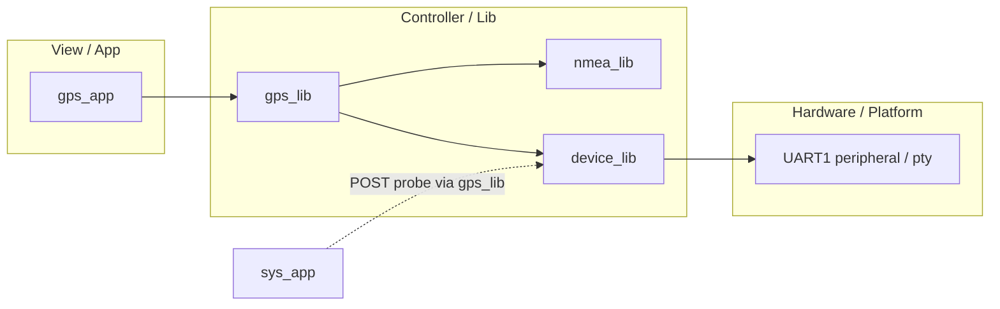
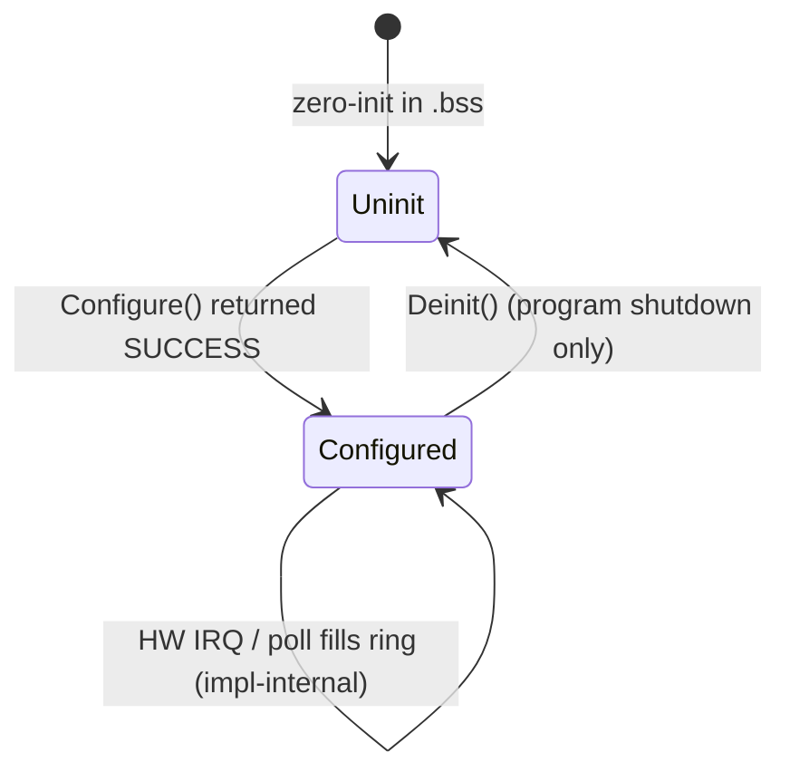
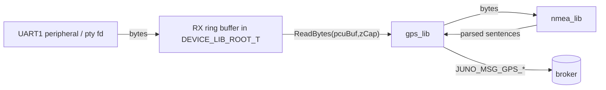
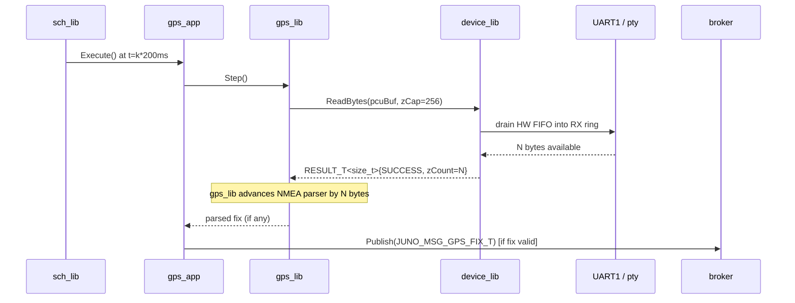
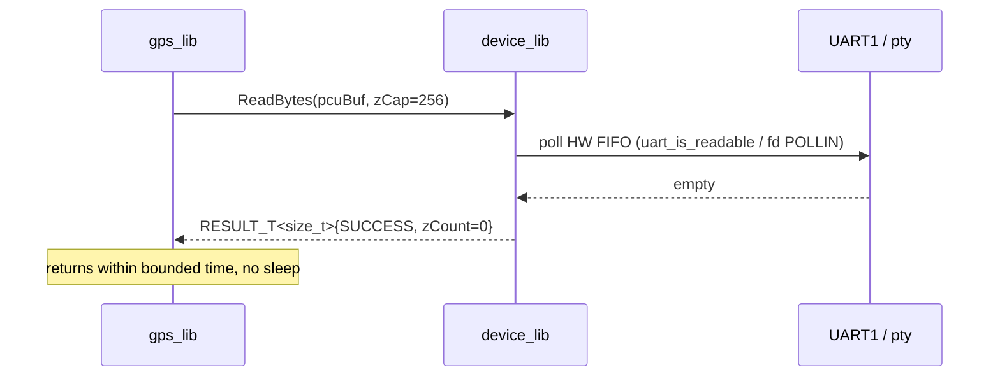
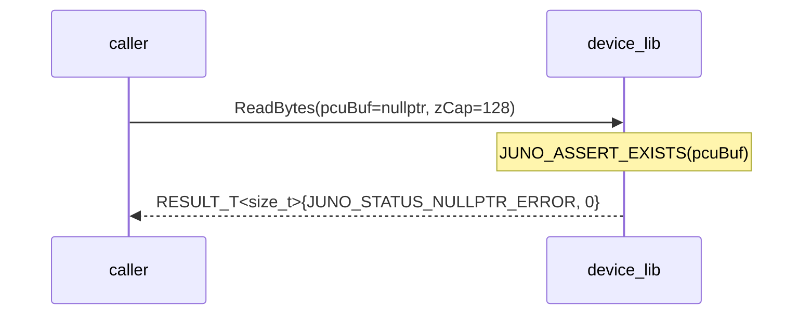

# Juno FSW — Device Library (UART1) Design (L2)

**Document type:** IEEE 1016 Software Design Description
**Module:** `device_lib`
**Scope:** Pico2 UART1 hardware abstraction for serial peripherals (primary consumer: `gps_lib` for NMEA reception).
**Authoritative cross-references:** `docs/design/conventions.md` (cross-module names, idioms, MVC layering), `docs/design/system/system_design.md` (composition root, scheduler, error model).
**Requirement coverage:** `SW-REQ-DEVICE-001` through `SW-REQ-DEVICE-007`.

---

<!-- @{"design": ["SW-REQ-DEVICE-001", "SW-REQ-DEVICE-002", "SW-REQ-DEVICE-003", "SW-REQ-DEVICE-004", "SW-REQ-DEVICE-005", "SW-REQ-DEVICE-006", "SW-REQ-DEVICE-007"]} -->
## 1. Purpose and Scope

The `device_lib` library provides the **UART1 hardware abstraction** used by upper-layer libraries — primarily `gps_lib` for NMEA byte ingest and `lora_lib` for AT-command transmit — to read and write a serial peripheral without depending on platform-specific peripheral APIs. It addresses every requirement in `docs/requirements/device/requirements.json` (`SW-REQ-DEVICE-001` through `SW-REQ-DEVICE-007`): configurable baud-rate initialization, status reporting, non-blocking reads, between-call buffering with overflow status, null-pointer rejection, byte-count reporting, and caller-buffered writes.

In scope: the public `juno::device::DEVICE_LIB_API_T` vtable surface; per-platform `DEVICE_LIB_IMPL_T` derivations for POSIX (host tests + Trick) and Pico2 (flight); RX between-call buffering semantics; non-blocking read contract; configuration parameters (baud, stop bits); error propagation via `JUNO_STATUS_T` / `RESULT_T<size_t>`.

Out of scope: NMEA framing/parsing (lives in `nmea_lib`); GPS protocol semantics (lives in `gps_lib`); other serial peripherals (UART0, SPI, I2C — future modules); flow control (CTS/RTS — not required by FT1); DMA (not required for 9600 baud × 5 Hz GPS).

---

## 2. Definitions and Abbreviations

Cross-module vocabulary (status semantics, time base, naming conventions, POSIX/Pico2 split, memory ownership) is defined in `docs/design/conventions.md` §3, §4, §5, §6 and is **not** redefined here.

| Term | Meaning |
|------|---------|
| UART1 | RP2350's second UART peripheral (`uart_inst_t* UART1` in pico-sdk); the canonical bus for the GPS receiver in FT1 |
| Baud rate | Symbol rate of the UART line, in bits/second (e.g., 9600 for u-blox NEO-M9N default) |
| 8N1 | UART framing: 8 data bits, no parity, 1 stop bit (FT1 baseline) |
| RX FIFO | Hardware UART receive FIFO inside RP2350 (capacity 32 bytes per pico-sdk) |
| RX ring buffer | Caller-owned `uint8_t` ring buffer that the impl drains the hardware FIFO into between scheduled reads (POSIX impl: backed by an `int` file descriptor read; Pico2 impl: backed by `uart_is_readable`/`uart_getc`) |
| Pseudo-tty | POSIX pseudo-terminal pair (`openpty(3)`) used in unit tests to inject bytes into the POSIX impl as if they came from a real serial port |
| Non-blocking read | A read call that returns immediately with whatever bytes are currently available (possibly zero), never sleeping or busy-waiting |

---

<!-- @{"design": ["SW-REQ-DEVICE-001", "SW-REQ-DEVICE-002"]} -->
## 3. System Overview

### 3.1 MVC layer mapping

`device_lib` is a **Controller-layer** library (per `conventions.md` §3.1 / `architecture.md`). It has no app counterpart; it is consumed directly by other Controller-layer libraries (notably `gps_lib`) and never publishes or subscribes to bus messages itself. There is no associated `device_app` — devices are wrapped by their domain libraries.

### 3.2 Module placement



`gps_lib` is the only FT1 caller of `device_lib`. Other future libs (e.g., a second LoRa serial path) would consume the same API; no architectural changes are anticipated for FT1.

### 3.3 Composition root wiring

Per `system_design.md` §8.1, `device_lib::New()` is constructed in foundational-libs phase (step 1) and the resulting `DEVICE_LIB_ROOT_T&` is passed by reference into `gps_lib::New(...)` at step 2. No globals; the composition root in `apps/main.cpp` holds the `DEVICE_LIB_IMPL_T` instance in `.bss` (caller-owned, per `conventions.md` §5).

---

<!-- @{"design": ["SW-REQ-DEVICE-001", "SW-REQ-DEVICE-002", "SW-REQ-DEVICE-003", "SW-REQ-DEVICE-004", "SW-REQ-DEVICE-005", "SW-REQ-DEVICE-006", "SW-REQ-DEVICE-007"]} -->
## 4. Interface Definitions

Public header: `libs/device_lib/include/device_lib/device_api.hpp`. Namespace: `juno::device`. Pattern follows `libjuno/templates/template_cpp/include/temp_api.hpp` (LibJuno C++ module pattern, `conventions.md` §1).

### 4.1 Types

The module is **templated on RX ring-buffer capacity `N`** (AC-8, AC-10) so each consumer chooses the buffer size at compile time. FT1 GPS instantiates `N = 2048` (≥1 second of NMEA at 9600 baud); future serial devices choose their own capacity.

```cpp
namespace juno::device
{

enum class DEVICE_STOP_BITS_T : uint8_t
{
    DEVICE_STOP_BITS_ONE = 1,
    DEVICE_STOP_BITS_TWO = 2,
};

template<const size_t N>
struct DEVICE_LIB_ROOT_T;       // forward declaration

template<const size_t N>
struct DEVICE_LIB_API_T
{
    JUNO_STATUS_T   (&Configure)(DEVICE_LIB_ROOT_T<N> &tRoot,
                                 uint32_t u32BaudRate,
                                 DEVICE_STOP_BITS_T eStopBits) noexcept;
    JUNO_STATUS_T   (&WriteBytes)(DEVICE_LIB_ROOT_T<N> &tRoot,
                                  const uint8_t *pcuData,
                                  size_t zLen) noexcept;
    RESULT_T<size_t>(&ReadBytes) (DEVICE_LIB_ROOT_T<N> &tRoot,
                                  uint8_t *pcuBuf,
                                  size_t zCap) noexcept;
    RESULT_T<size_t>(&Available) (DEVICE_LIB_ROOT_T<N> &tRoot) noexcept;
};

template<const size_t N>
struct DEVICE_LIB_ROOT_T JUNO_MODULE_ROOT(JUNO_MODULE_ARG(DEVICE_LIB_API_T<N>),
    static_assert(N >= 256,
        "device_lib RX ring buffer capacity must hold at least one NMEA epoch");
    uint8_t  _au8RxRing[N];      // caller-owned RX ring (fixed by template param N)
    size_t   _zHead;             // producer index
    size_t   _zTail;             // consumer index
    size_t   _zCount;            // bytes currently buffered
);

} // namespace juno::device
```

The `_au8RxRing[N]` array lives **inside** `DEVICE_LIB_ROOT_T<N>` so its lifetime equals the ROOT instance owned by the composition root (AC-10, `conventions.md` §5). The ring capacity is fixed at compile time by the template parameter `N`; there is no separate `kRxRingCap` constant. Platform handle members (`int iFd` POSIX / `uart_inst_t* ptUart` Pico2) live on `DEVICE_LIB_IMPL_T<N>` in the per-platform source file (`conventions.md` §6) — the ROOT keeps the platform-neutral state (ring storage + indices) only.

### 4.2 Function contracts

<!-- @{"design": ["SW-REQ-DEVICE-001", "SW-REQ-DEVICE-002"]} -->
#### 4.2.1 `DeviceLib_Configure`

| Attribute | Value |
|-----------|-------|
| Signature | `JUNO_STATUS_T (&Configure)(DEVICE_LIB_ROOT_T<N> &tRoot, uint32_t u32BaudRate, DEVICE_STOP_BITS_T eStopBits) noexcept` |
| Preconditions | `tRoot` initialized via `DEVICE_LIB_IMPL_T<N>::New(...)`; UART1 hardware powered (Pico2) or pty/file fixture opened (POSIX) |
| Postconditions | UART1 line set to `(u32BaudRate, 8N1)` with the requested stop-bit count; RX ring buffer cleared; ready for `ReadBytes` / `WriteBytes` |
| Returns | `JUNO_STATUS_SUCCESS` on success; non-zero `JUNO_STATUS_T` on hardware failure |
| Error conditions | Hardware init returned an error / file descriptor invalid → status reflects the failure (caller may set the unhealthy bit per `SW-REQ-SYS-058`) |
| Thread safety | Not thread-safe; single-threaded TDM caller only |
| Blocking | Bounded init only — must complete within the foundational-libs slot of the composition root, before scheduler `Run()` |
| Requirements | `SW-REQ-DEVICE-001`, `SW-REQ-DEVICE-002` |

Doxygen block to appear in the header:

```cpp
/**
 * @brief Configure UART1 baud rate and stop bits (8N1 framing).
 * @param tRoot Device-lib root instance, previously initialized via New().
 * @param u32BaudRate Line rate in bits/second (e.g., 9600 for u-blox default).
 * @param eStopBits ONE or TWO; FT1 baseline is ONE.
 * @return JUNO_STATUS_SUCCESS on success; non-zero on hardware failure.
 */
```

<!-- @{"design": ["SW-REQ-DEVICE-007"]} -->
#### 4.2.2 `DeviceLib_WriteBytes`

| Attribute | Value |
|-----------|-------|
| Signature | `JUNO_STATUS_T (&WriteBytes)(DEVICE_LIB_ROOT_T<N> &tRoot, const uint8_t *pcuData, size_t zLen) noexcept` |
| Preconditions | `tRoot` configured via `Configure`; `pcuData` non-null when `zLen > 0` |
| Postconditions | Up to `zLen` bytes pushed into the UART1 TX FIFO / pty fd (best effort, never blocking past the FIFO depth) |
| Returns | `JUNO_STATUS_SUCCESS` on success; `JUNO_STATUS_NULLPTR_ERROR` when `pcuData == nullptr && zLen > 0`; non-zero on hardware error |
| Error conditions | Null buffer with non-zero length → `JUNO_STATUS_NULLPTR_ERROR`; FIFO full beyond a bounded retry → status reflects the failure |
| Thread safety | Not thread-safe |
| Blocking | Non-blocking semantics: must return within the TDM tick budget; partial writes are acceptable when the TX FIFO is full |
| Requirements | `SW-REQ-DEVICE-007` (caller-buffered transmit; LoRa AT-command path) |

<!-- @{"design": ["SW-REQ-DEVICE-003", "SW-REQ-DEVICE-004", "SW-REQ-DEVICE-005", "SW-REQ-DEVICE-006"]} -->
#### 4.2.3 `DeviceLib_ReadBytes`

| Attribute | Value |
|-----------|-------|
| Signature | `RESULT_T<size_t> (&ReadBytes)(DEVICE_LIB_ROOT_T<N> &tRoot, uint8_t *pcuBuf, size_t zCap) noexcept` |
| Preconditions | `tRoot` configured; `pcuBuf` non-null when `zCap > 0` |
| Postconditions | Up to `zCap` bytes copied from the internal RX ring buffer into `pcuBuf`; `tOk` reports the actual byte count copied (may be 0). When ring overflow has occurred since the previous call, the caller observes the loss via `tStatus == JUNO_STATUS_TABLE_FULL_ERROR` and the byte count of bytes still recoverable (`SW-REQ-DEVICE-004` amended). |
| Returns | `RESULT_T<size_t>{JUNO_STATUS_SUCCESS, zCount}` with `zCount ∈ [0, zCap]` on success; `{JUNO_STATUS_NULLPTR_ERROR, 0}` when `pcuBuf == nullptr && zCap > 0`; `{JUNO_STATUS_TABLE_FULL_ERROR, zCount}` when ring overflow dropped bytes since the previous read; `{<hw_status>, 0}` on hardware failure |
| Error conditions | Null buffer → `JUNO_STATUS_NULLPTR_ERROR` (`SW-REQ-DEVICE-005`); ring overflow since previous call → `JUNO_STATUS_TABLE_FULL_ERROR` (`SW-REQ-DEVICE-004` amended — caller observes the loss; ring is a fixed-capacity table that overran); zero bytes available is **not** an error (`SW-REQ-DEVICE-003`) — returns `{SUCCESS, 0}` |
| Thread safety | Not thread-safe |
| Blocking | **Non-blocking — the call always returns within bounded constant time regardless of data availability** (`SW-REQ-DEVICE-003`). When the hardware FIFO is empty and the ring buffer is empty, returns `{SUCCESS, 0}` immediately |
| Buffering | Bytes that arrive between calls accumulate in the RX ring buffer and are returned on subsequent calls. On overflow, the oldest bytes are evicted and the next `ReadBytes` reports `JUNO_STATUS_TABLE_FULL_ERROR` so the caller can resync (`SW-REQ-DEVICE-004` amended). |
| Reporting | The byte count copied is reported via `RESULT_T<size_t>::tOk` (`SW-REQ-DEVICE-006`) |
| Requirements | `SW-REQ-DEVICE-003`, `SW-REQ-DEVICE-004`, `SW-REQ-DEVICE-005`, `SW-REQ-DEVICE-006` |

Doxygen:

```cpp
/**
 * @brief Read up to zCap bytes that have arrived on UART1 since the last call.
 *        Non-blocking: returns immediately with whatever is available (0 OK).
 * @param tRoot Device-lib root instance.
 * @param pcuBuf Caller-owned destination buffer, capacity zCap.
 * @param zCap Maximum bytes the caller is willing to receive.
 * @return RESULT_T<size_t> — tOk is the count actually copied (0..zCap).
 *         tStatus is JUNO_STATUS_NULLPTR_ERROR if pcuBuf is null with zCap > 0,
 *         JUNO_STATUS_TABLE_FULL_ERROR if ring eviction dropped bytes since last read.
 */
```

<!-- @{"design": ["SW-REQ-DEVICE-004", "SW-REQ-DEVICE-006"]} -->
#### 4.2.4 `DeviceLib_Available`

| Attribute | Value |
|-----------|-------|
| Signature | `RESULT_T<size_t> (&Available)(DEVICE_LIB_ROOT_T<N> &tRoot) noexcept` |
| Preconditions | `tRoot` configured via `Configure` |
| Postconditions | `tOk` reports `_zCount` — the number of bytes currently buffered in the RX ring and immediately drainable by the next `ReadBytes`. Ring state is **not** modified. |
| Returns | `RESULT_T<size_t>{JUNO_STATUS_SUCCESS, zCount}` where `zCount ∈ [0, N]`. The hardware FIFO is **not** drained by this call; only the software ring count is reported (callers wanting an up-to-date count should call `ReadBytes` first if needed). |
| Error conditions | None under nominal operation; the function performs only an index read |
| Thread safety | Not thread-safe |
| Blocking | Non-blocking, O(1), no syscalls |
| Requirements | `SW-REQ-DEVICE-004` (allows callers to decide how much to drain), `SW-REQ-DEVICE-006` (count semantics) |

```cpp
/**
 * @brief Report bytes currently buffered in the RX ring (not yet read).
 * @param tRoot Device-lib root instance.
 * @return RESULT_T<size_t> — tOk is the buffered byte count.
 *         Does not poll hardware; reflects ring state at call time.
 */
```

### 4.3 Implementation pattern

```cpp
// libs/device_lib/src/<platform>/device_<platform>.cpp
namespace juno::device
{

template<const size_t N>
struct DEVICE_LIB_IMPL_T JUNO_MODULE_DERIVE(DEVICE_LIB_ROOT_T<N>,
    // POSIX:  int iFd;
    // Pico2: uart_inst_t *ptUart;
    // (RX ring _au8RxRing[N], _zHead, _zTail, _zCount live in DEVICE_LIB_ROOT_T<N>)

    static JUNO_STATUS_T    Configure (DEVICE_LIB_ROOT_T<N>&, uint32_t, DEVICE_STOP_BITS_T) noexcept;
    static JUNO_STATUS_T    WriteBytes(DEVICE_LIB_ROOT_T<N>&, const uint8_t*, size_t)      noexcept;
    static RESULT_T<size_t> ReadBytes (DEVICE_LIB_ROOT_T<N>&, uint8_t*, size_t)            noexcept;
    static RESULT_T<size_t> Available (DEVICE_LIB_ROOT_T<N>&)                              noexcept;

    static RESULT_T<DEVICE_LIB_IMPL_T<N>> New(
        JUNO_FAILURE_HANDLER_T pfcnFailureHandler,
        JUNO_USER_DATA_T      *pvUserData
    ) noexcept;
);

} // namespace juno::device
```

`New()` wires the vtable once via a `static` local (`conventions.md` §1.2) and never reassigns it. The RX ring (`_au8RxRing[N]`, `_zHead`, `_zTail`, `_zCount`) lives in `DEVICE_LIB_ROOT_T<N>` — the IMPL_T derivation only adds the platform handle. There is **no separate `kRxRingCap` constant**; the template parameter `N` is the single source of truth for capacity. FT1 GPS instantiates `DEVICE_LIB_IMPL_T<2048>` (≥1 second of NMEA at 9600 baud; power-of-two so head/tail wrap is a mask op); `lora_lib` instantiates a smaller capacity matching its expected RX bursts.

---

<!-- @{"design": ["SW-REQ-DEVICE-004"]} -->
## 5. State Machines

`device_lib` is **functionally pure given inputs from the caller's perspective** — the public API has no externally observable mode/state. Internally, the impl maintains a single piece of state: the **RX ring buffer** (head index, tail index, byte storage), which accumulates bytes received between `ReadBytes` calls (`SW-REQ-DEVICE-004`).



Notes:

- The `Configured` self-loops are the only externally observable transitions; from the caller's view the API is stateless modulo the ring fill level (which is reflected only in `ReadBytes::tOk`).
- The internal HW-fill transition (POSIX: `read(iFd, ...)`; Pico2: `uart_is_readable + uart_getc`) is performed **lazily inside `ReadBytes`** so there is no IRQ handler to schedule. This keeps the design freestanding-friendly and TDM-deterministic — every byte enters the ring and exits it in the same call chain.
- There is no error/recovery state: a hardware error from a single `ReadBytes`/`WriteBytes` is reported via the return status; the next call retries from the current ring state.

---

<!-- @{"design": ["SW-REQ-DEVICE-001", "SW-REQ-DEVICE-002", "SW-REQ-DEVICE-003"]} -->
## 6. Data Flow

`device_lib` does **not** publish or subscribe to any software-bus message (`conventions.md` §4.4). It exposes a synchronous in-process API only; bus traffic for GPS data is owned by `gps_app` (`JUNO_MSG_GPS_FIX_T`, `JUNO_MSG_GPS_NMEA_RAW_T`, `JUNO_MSG_GPS_UTC_T` per `system_design.md` §4) downstream.



Direction is strictly one-way at the boundary: the hardware/pty fills the ring, `gps_lib` drains it. `device_lib` itself **does not touch the LibJuno broker** (per the system architecture: only apps publish/subscribe, libraries are pure controllers).

Buffer ownership at the API boundary (see §10 for the full table):

- `pcuBuf` for `ReadBytes` is **caller-owned**; `device_lib` writes into it but never retains a pointer past the call.
- `pcuData` for `WriteBytes` is **caller-owned**; `device_lib` reads from it but never retains a pointer past the call.
- The RX ring is **owned by `DEVICE_LIB_ROOT_T<N>`** as `uint8_t _au8RxRing[N]`, statically sized at compile time by the template parameter.

---

<!-- @{"design": ["SW-REQ-DEVICE-003", "SW-REQ-DEVICE-004", "SW-REQ-DEVICE-006"]} -->
## 7. Sequence Diagrams

### 7.1 Nominal cycle: `gps_lib` calls `device_lib::ReadBytes` → bytes flow



### 7.2 No data available (non-blocking semantic, `SW-REQ-DEVICE-003`)



### 7.3 Null-buffer rejection (`SW-REQ-DEVICE-005`)



### 7.4 Buffered reception across two ticks (`SW-REQ-DEVICE-004`)

```mermaid
sequenceDiagram
    participant uart1 as UART1
    participant device_lib
    participant gps_lib

    uart1-->>device_lib: bytes arrive between ticks (HW FIFO + ring fill)
    Note over device_lib: ring head advances; no caller present
    gps_lib->>device_lib: ReadBytes(...) at next 200ms tick
    device_lib-->>gps_lib: {SUCCESS, all buffered bytes copied (no drops while ring has capacity)}
```

---

<!-- @{"design": ["SW-REQ-DEVICE-003"]} -->
## 8. Timing and Scheduling Analysis

`device_lib` has no TDM period of its own (it is a library, not an app — `system_design.md` §3.3 lists its period as n/a). Its timing budget is dictated by its caller, `gps_lib`, which runs inside `gps_app` at `kGpsAppPeriodMs = 200` (`conventions.md` §4.5).

Per-call budget (within the `gps_app` 5 ms slot share of the 200 ms period):

| Operation | POSIX cost | Pico2 cost | Notes |
|-----------|------------|------------|-------|
| `Configure` | one-time at composition root, <1 ms | one-time at composition root, <1 ms | not on a TDM tick |
| `ReadBytes` (FIFO empty) | 1 syscall (`read` non-blocking returns -1/EAGAIN) | a few `uart_is_readable` polls | O(1), µs scale |
| `ReadBytes` (FIFO full, 32 bytes) | one `read` syscall + memcpy | 32× `uart_getc` + memcpy | linear in bytes, dominated by memcpy |
| `WriteBytes` (TX FIFO has room) | one `write` syscall | n× `uart_putc` (FT1: not used by `gps_lib`) | linear in bytes |

Worst-case `ReadBytes` per call is bounded by `min(N, zCap)`. With `N = 2048` for FT1 GPS and the largest plausible NMEA burst at 200 ms × 9600 baud = ~240 bytes, the typical drain is 30–250 bytes. This fits well inside the GPS app's tick budget (`system_design.md` §8.2).

Determinism (`SW-REQ-SYS-044`): no allocation, no exception unwinding, no virtual dispatch, no syscalls that block beyond the bounded non-blocking semantics; the path through `ReadBytes` is straight-line code with one bounded loop.

Downstream consumers: only `gps_lib` (FT1). No bus message flows out of `device_lib`, so no app's period depends on it directly.

---

<!-- @{"design": ["SW-REQ-DEVICE-002", "SW-REQ-DEVICE-004", "SW-REQ-DEVICE-005", "SW-REQ-DEVICE-006", "SW-REQ-DEVICE-007"]} -->
## 9. Error Handling Strategy

Aligned with `conventions.md` §4.3 and `system_design.md` §9. Failure handlers are diagnostic-only and never alter control flow.

1. **Status propagation.** Every API function returns `JUNO_STATUS_T` or `RESULT_T<size_t>`. Callers (`gps_lib`) propagate via `JUNO_ASSERT_SUCCESS` / `JUNO_ASSERT_OK` (`coding-standards.md`) — bare `if`-return is a review failure.
2. **Null-pointer rejection (`SW-REQ-DEVICE-005`).** Inside both `ReadBytes` and `WriteBytes`, the impl guards the caller buffer with `JUNO_ASSERT_EXISTS(pcuBuf)` / `JUNO_ASSERT_EXISTS(pcuData)` and returns `JUNO_STATUS_NULLPTR_ERROR` (or `RESULT_T<size_t>{JUNO_STATUS_NULLPTR_ERROR, 0}`) without touching hardware.
3. **Configure failure (`SW-REQ-DEVICE-002`).** When the platform peripheral / fd cannot be brought up, `Configure` returns a non-zero `JUNO_STATUS_T`. The caller (composition root or `gps_lib::New`) records the failure in the POST bitmap (`SW-REQ-SYS-029`/`-030`) and proceeds — the GPS sensor's health bit is set and `gps_app` keeps running with `bValid=false` outputs (`SW-REQ-SYS-058`/`SW-REQ-SYS-033`).
4. **Read failure.** A hardware read error (Pico2: `uart_get_hw(uart1)->rsr` framing/overrun bit set; POSIX: `read` returns -1 with errno != EAGAIN) returns `RESULT_T<size_t>{<status>, 0}`; the ring is left unchanged. The caller marks GPS unhealthy (`SW-REQ-SYS-058`).
5. **Ring overflow (`SW-REQ-DEVICE-004` amended).** If the HW FIFO drains faster than the ring is consumed (would only occur if `gps_app` skipped many ticks), the impl evicts the **oldest** bytes in the ring to make room, sets an internal "overflow-since-last-read" sticky bit, and increments an overflow counter surfaced via the failure handler. The next `ReadBytes` returns `RESULT_T<size_t>{JUNO_STATUS_TABLE_FULL_ERROR, zCount}` — the caller observes the loss explicitly (per amended `SW-REQ-DEVICE-004`: "report a status when ring overflow drops bytes") rather than silently — and the sticky bit is cleared so subsequent reads resume returning `SUCCESS`. The ring is a fixed-capacity table; `JUNO_STATUS_TABLE_FULL_ERROR` (capacity exceeded) is the canonical signal per `conventions.md` §4.8. NMEA parsers naturally resync on the next `$` sentence start. The ring is sized so this path never occurs under nominal scheduling.
6. **Byte-count reporting (`SW-REQ-DEVICE-006`).** `RESULT_T<size_t>::tOk` always reflects exactly the number of bytes written to `pcuBuf`. Callers advance their parser state by that count.
7. **No exceptions.** All API functions are `noexcept` (`conventions.md` §1.3, `SW-REQ-SYS-053`); a stray throw from any platform API is converted to `std::terminate` by the compiler.
8. **Failure handler chain.** `pfcnFailureHandler` injected at `New()` is invoked with a context string (e.g., `"device_lib: uart_init failed"`) on hardware errors. It is **diagnostic-only**; the API still returns the appropriate status and execution proceeds.

---

## 10. Memory Ownership

Per `conventions.md` §5: caller owns all storage; libraries never allocate.

| Buffer / facility | Owner | Lifetime | Allocation strategy |
|-------------------|-------|----------|---------------------|
| `DEVICE_LIB_IMPL_T<N>` instance | composition root (`apps/main.cpp`) | program lifetime, `.bss` zero-init | Static — caller-owned (one instance per target; FT1: `DEVICE_LIB_IMPL_T<2048>` for GPS, separate instance for LoRa) |
| `_au8RxRing[N]` (RX ring) | `DEVICE_LIB_ROOT_T<N>` member | program lifetime | Static — `uint8_t _au8RxRing[N];` member of `DEVICE_LIB_ROOT_T<N>`. Capacity is fixed by the template parameter `N` at the call site (no separate `kRxRingCap` constant). Each consumer chooses `N` to match its expected RX burst size. |
| `pcuBuf` (read scratch) | caller (`gps_lib`) | per-call | Caller's stack/static; `device_lib` reads/writes within `[pcuBuf, pcuBuf+zCap)` and never retains the pointer past the call |
| `pcuData` (write source) | caller (`lora_lib`, etc.) | per-call | Same as `pcuBuf`; read-only inside `WriteBytes` |
| Vtable `tApi` | `New()` factory, file-scope `static` local | program lifetime | Read-only after `New()` returns (`conventions.md` §1.2) |
| Platform handles (`int iFd` POSIX / `uart_inst_t* ptUart` Pico2) | `DEVICE_LIB_IMPL_T<N>` member | program lifetime | Static; opened once in `Configure` |

Asserted invariants (from `conventions.md` §5):

- Caller-owned all storage.
- **No `new`, `delete`, `malloc`, `calloc`, `realloc`, `free`** — the RX ring is a fixed-size array member of `DEVICE_LIB_ROOT_T<N>` sized at compile time by the template parameter; the platform handle is a primitive type.
- **No heap-backed STL containers** — only raw `uint8_t[N]` and primitive integer types.
- **No global mutable state in the library** — the only file-scope datum is the `static` vtable inside `New()`, read-only after construction.
- No constructors / destructors on `DEVICE_LIB_ROOT_T` or `DEVICE_LIB_IMPL_T`; both are trivially constructible (`.bss` zero-init safe — `coding-standards.md`, `temp_api.hpp` §8).
- All public API functions are `noexcept` (`temp_api.hpp` §10).

---

## 11. Traceability

Per-section `<!-- @{"design": [...]} -->` tags above are authoritative; this table is descriptive consolidation.

| Req ID | Title | Section(s) |
|--------|-------|-----------|
| SW-REQ-DEVICE-001 | UART1 Hardware Initialization | §1, §3, §4.2.1 |
| SW-REQ-DEVICE-002 | UART1 Initialization Status Reporting | §1, §3, §4.2.1, §9 |
| SW-REQ-DEVICE-003 | Non-Blocking UART1 Read | §1, §4.2.3, §6, §7.2, §8 |
| SW-REQ-DEVICE-004 | UART1 Buffered Reception with Overflow Status | §1, §4.2.3, §4.2.4, §5, §7.4, §9 |
| SW-REQ-DEVICE-005 | UART1 Read Null-Pointer Rejection | §1, §4.2.3, §7.3, §9 |
| SW-REQ-DEVICE-006 | UART1 Read Byte Count Reporting | §1, §4.2.3, §4.2.4, §7.1, §9 |
| SW-REQ-DEVICE-007 | UART1 Caller-Buffered Write | §1, §4.2.2, §9 |

### POSIX/Pico2 functional equivalence (`SW-REQ-SYS-043`)

The `DEVICE_LIB_API_T` vtable shape is identical across both targets. Only the IMPL files differ:

| Build target | Source file | Backing primitive |
|--------------|-------------|-------------------|
| `PLATFORM=POSIX` (host tests + Trick SITL — `SW-REQ-SYS-045`) | `libs/device_lib/src/posix/device_posix.cpp` | `int iFd` opened on a pseudo-tty (`openpty`), file fixture, or scratch device path. Tests inject NMEA bytes by `write()` to the master end of the pty; the impl reads from the slave end exactly as it would from a real serial line. |
| `PLATFORM=PICO2` (flight) | `libs/device_lib/src/pico2/device_pico2.cpp` | `uart_inst_t* ptUart = uart1` from pico-sdk; `uart_init`, `uart_set_format(8, eStopBits, UART_PARITY_NONE)`, `uart_is_readable`/`uart_getc`, `uart_putc_raw`. |

Functional equivalence is enforced by: identical `DEVICE_LIB_API_T` signatures, identical RX ring semantics, identical non-blocking contract on `ReadBytes`, identical null-pointer rejection idiom. Trick SITL drives the POSIX impl with simulated NMEA streams produced by `sim_sensors`, exercising the same `*_ROOT_T` API the flight build uses (`SW-REQ-SYS-045`). The deliberate platform divergence (POSIX `read()` vs. Pico2 `uart_getc` polling) is documented here per `conventions.md` §6.
