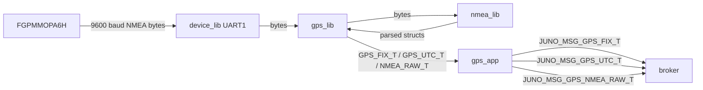

# gps_lib — Software Design Description (L2)

**Document type:** IEEE 1016 Software Design Description
**Module:** `gps_lib` (GPS receiver driver)
**Hardware:** GlobalTop FGPMMOPA6H (UART, 9600 baud, 5 Hz NMEA cadence)
**Authoritative cross-module references:** `docs/design/conventions.md`, `docs/design/system/system_design.md`

**Revision history:**
- A — initial L2 (PDR baseline)
- A.1 — minor amendment 2026-05-06 per SPRINT-IMPL-09 closure (PM-approved Q1 + Q5):
  - **Q1 (per-platform IMPL split):** §3.3 single `GPS_LIB_IMPL_T` form is superseded by per-platform `GPS_LIB_POSIX_T` / `GPS_LIB_PICO2_T` derivations (each `JUNO_MODULE_DERIVE`-d on `GPS_LIB_ROOT_T`). Mirrors SPRINT-IMPL-05-retro-A canonical pattern adopted by all Wave 3 dual-impl libs. The single `gps_impl.hpp` reference in §3.3 should be read as `gps_posix.hpp` + `gps_pico2.hpp`.
  - **Q5 (ptTime injection):** §4.1 `GPS_LIB_ROOT_T` body adds `juno::time::TIME_ROOT_T *ptTime;` member injected at `New()`. Resolves §4.1/§4.2.6/§5 staleness gap (no clock source = SW-TC-GPS-006/-007 unimplementable). `DoIsHealthy` queries `tRoot.ptTime->ptApi->Now(*tRoot.ptTime)` + `tRoot.ptTime->TimestampToMicros(...).tOk` to compute `(now - tLastByteUs) < kHealthStaleUs`. Mirrors imu_lib precedent.
  - **Timestamp type:** `JUNO_TIME_US_T` (not yet published in LibJuno) substituted with `JUNO_TIME_MICROS_T` (published in `juno/time/time_api.h`). Per imu_lib + baro_lib precedent.

---

<!-- @{"design": ["SW-REQ-GPS-001", "SW-REQ-GPS-002", "SW-REQ-GPS-003", "SW-REQ-GPS-010"]} -->
## 1. Purpose and Scope

This document is the L2 software design for `gps_lib`, the GPS receiver driver library for Juno FT1. It addresses every requirement in `docs/requirements/gps/requirements.json` (`SW-REQ-GPS-001` through `SW-REQ-GPS-010`).

`gps_lib` is the Controller layer of the GPS pipeline: it reads raw NMEA bytes from the UART abstraction provided by `device_lib`, delegates sentence framing/parsing to `juno::nmea`, and exposes typed C++ API calls (`Poll`, `GetFix`, `GetUtc`, `GetRawNmea`) to `gps_app`. The library does **not** itself publish to the LibJuno software broker — that is `gps_app`'s responsibility (`conventions.md` §3, §4.4). The library does not own a TDM slot; `gps_app` owns the 200 ms slot (`kGpsAppPeriodMs = 200`, `conventions.md` §4.5).

In scope: public API for fix retrieval, UTC retrieval, and verbatim raw NMEA forwarding; POSIX and Pico2 implementations; POST device probe; per-poll status reporting; data-flow indicator for the system health bitmap.

Out of scope: NMEA sentence parsing internals (delegated to `juno::nmea`, see `nmea/requirements.json`); UART register-level driver (delegated to `juno::device`, see `device/requirements.json`); broker publishing (`gps_app` L2 design); GPS UTC-to-monotonic-µs alignment policy (system level / `juno_time`); RF/antenna integration; almanac/ephemeris management.

---

## 2. Definitions and Abbreviations

Cross-module vocabulary (time base `JUNO_TIME_US_T`, geodetic + HAE position, status semantics, message naming, namespace casing, body axes) is defined in `docs/design/conventions.md` §4 and is not redefined here.

| Term | Meaning |
|------|---------|
| NMEA | National Marine Electronics Association sentence format; ASCII frames such as `$GPGGA,...,*hh<CR><LF>` |
| GGA | NMEA fix-data sentence (lat/lon/altitude/quality/satellites/HDOP/UTC) |
| RMC | NMEA recommended-minimum sentence (lat/lon/speed/course/UTC/date) |
| HAE | Height Above WGS-84 Ellipsoid (`SW-REQ-SYS-039`) |
| HDOP | Horizontal dilution of precision (unitless scalar from GGA field 8) |
| Poll | Library entry point that drains pending UART bytes and feeds them to the NMEA parser |
| Fix quality | Discriminated enum mirroring NMEA GGA field 6 (no fix / GPS fix / DGPS / etc.) |
| FGPMMOPA6H | GlobalTop GPS receiver part used on FT1 — emits NMEA over UART at 9600 baud, 5 Hz |

---

<!-- @{"design": ["SW-REQ-GPS-001", "SW-REQ-GPS-006", "SW-REQ-GPS-008", "SW-REQ-GPS-009"]} -->
## 3. System Overview

### 3.1 MVC layer mapping

| Layer | Realization |
|-------|-------------|
| View (App) | `gps_app` — owns the TDM `Execute()` cycle and broker publishing (out of scope here) |
| Controller (Lib) | **`gps_lib`** (this document) — drains bytes, hands to `juno::nmea`, caches the latest typed records |
| Model (Bus) | `JUNO_MSG_GPS_FIX_T`, `JUNO_MSG_GPS_UTC_T`, `JUNO_MSG_GPS_NMEA_RAW_T` (publisher: `gps_app`, see §6) |

`gps_lib` is delegation-heavy: it does not parse NMEA itself and does not touch UART registers. It composes `juno::device` (UART abstraction) with `juno::nmea` (parser) and exposes a typed cache the app reads each tick.

### 3.2 Module-in-context (Mermaid)



### 3.3 Header layout (LibJuno C++ pattern)

Public API headers live at:

- `libs/gps_lib/include/gps_lib/gps_api.hpp` — declares `juno::gps::GPS_LIB_ROOT_T`, `GPS_LIB_API_T`, POD record types (`GPS_FIX_T`, `GPS_UTC_T`, `NMEA_RAW_T`).
- `libs/gps_lib/include/gps_lib/gps_impl.hpp` — declares `juno::gps::GPS_LIB_IMPL_T` (platform-agnostic shape; the platform `.cpp` files supply the static method bodies and `New()` factory).

Source files (one IMPL per target, per `conventions.md` §6):

- `libs/gps_lib/src/posix/gps_posix.cpp` — POSIX impl (used in unit tests and Trick SITL).
- `libs/gps_lib/src/pico2/gps_pico2.cpp` — Pico2 impl (flight hardware).

Both implementations satisfy the same `GPS_LIB_ROOT_T` API; the composition root selects via `#if defined(PLATFORM_POSIX)` / `#if defined(PLATFORM_PICO2)` (`SW-REQ-GPS-008`, `SW-REQ-GPS-009`).

### 3.4 RX ring capacity constant

`device_lib`'s `DEVICE_LIB_ROOT_T<N>` is templated on the RX ring capacity and `static_assert(N >= 256)`. `gps_lib` pins this to `kGpsRxRingCap = 2048` in the `juno::gps` namespace:

```cpp
namespace juno::gps {
static constexpr size_t kGpsRxRingCap = 2048; // FGPMMOPA6H @ 9600 baud × 200 ms ≈ 240 B; 8× margin
}
```

This is the single capacity used by every `gps_lib` reference to a UART device root in this document and in the IMPL pointer member (§4.1).

---

<!-- @{"design": ["SW-REQ-GPS-001", "SW-REQ-GPS-002", "SW-REQ-GPS-003", "SW-REQ-GPS-004", "SW-REQ-GPS-005", "SW-REQ-GPS-007", "SW-REQ-GPS-010"]} -->
## 4. Interface Definitions

### 4.1 Module pattern skeleton (declaration only)

```cpp
// libs/gps_lib/include/gps_lib/gps_api.hpp
#pragma once
#include "juno/module.h"
#include "juno/module.hpp"
#include "juno/status.h"
#include "juno/time/time_api.hpp"    // canonical LibJuno time API (TIME_ROOT_T, JUNO_TIMESTAMP_T)
#include "device_lib/device_api.hpp" // juno::device::DEVICE_LIB_ROOT_T<N> (UART1, templated)
#include "nmea_lib/nmea_api.hpp"     // juno::nmea::NMEA_LIB_ROOT_T

namespace juno::gps
{
static constexpr size_t kGpsRxRingCap = 2048; // device_lib requires N >= 256

struct GPS_LIB_ROOT_T;                 // forward declaration

enum class GPS_FIX_QUALITY_T : uint8_t // mirrors NMEA GGA field 6
{
    JUNO_GPS_FIX_NONE        = 0,
    JUNO_GPS_FIX_GPS         = 1,
    JUNO_GPS_FIX_DGPS        = 2,
    JUNO_GPS_FIX_ESTIMATED   = 6
};

struct GPS_FIX_T
{
    JUNO_TIME_US_T   tTimestampUs;     // monotonic µs at byte arrival (SW-REQ-SYS-026/-027)
    double           dLatDeg;          // WGS-84 geodetic (SW-REQ-SYS-038)
    double           dLonDeg;          // WGS-84 geodetic
    float            fAltMHae;         // HAE meters (SW-REQ-SYS-039)
    GPS_FIX_QUALITY_T eFixQuality;
    uint8_t          u8SatellitesUsed;
    float            fHdop;
};

struct GPS_UTC_T
{
    JUNO_TIME_US_T tTimestampUs;       // monotonic µs at byte arrival
    uint16_t       u16Year;
    uint8_t        u8Month;
    uint8_t        u8Day;
    uint8_t        u8Hour;
    uint8_t        u8Minute;
    uint8_t        u8Second;
    uint32_t       u32Microseconds;
};

static constexpr size_t kNmeaRawMaxLen = 96;   // longest NMEA sentence + CRLF
struct NMEA_RAW_T
{
    JUNO_TIME_US_T tTimestampUs;
    char           acSentence[kNmeaRawMaxLen]; // verbatim bytes (SW-REQ-GPS-002)
    size_t         zLen;                       // bytes used in acSentence
};

struct GPS_LIB_API_T                    // function-reference vtable
{
    JUNO_STATUS_T      (&Poll)        (GPS_LIB_ROOT_T &tRoot)              noexcept;
    RESULT_T<GPS_FIX_T>(&GetFix)      (GPS_LIB_ROOT_T &tRoot)              noexcept;
    OPTION_T<GPS_UTC_T>(&GetUtc)      (const GPS_LIB_ROOT_T &tRoot)        noexcept;
    RESULT_T<NMEA_RAW_T>(&GetRawNmea) (GPS_LIB_ROOT_T &tRoot)              noexcept;
    JUNO_STATUS_T      (&Probe)       (GPS_LIB_ROOT_T &tRoot)              noexcept;
    RESULT_T<bool>     (&IsHealthy)   (const GPS_LIB_ROOT_T &tRoot)        noexcept;
};

struct GPS_LIB_ROOT_T JUNO_MODULE_ROOT(GPS_LIB_API_T,
    juno::device::DEVICE_LIB_ROOT_T<kGpsRxRingCap> *ptDevice; // injected at New(); UART1
    juno::nmea::NMEA_LIB_ROOT_T     *ptNmea;       // injected at New(); parser
    GPS_FIX_T                        tLastFix;     // cached (publisher-owned at fill)
    GPS_UTC_T                        tLastUtc;
    NMEA_RAW_T                       tLastRaw;
    bool                             bLastFixValid;
    bool                             bLastUtcValid;
    bool                             bLastRawValid;
    JUNO_TIME_US_T                   tLastByteUs;  // for IsHealthy() staleness check
);
} // namespace juno::gps
```

`GPS_LIB_IMPL_T` is declared in `gps_impl.hpp` and `JUNO_MODULE_DERIVE`s `GPS_LIB_ROOT_T`; each platform `.cpp` provides its `static` method bodies and a `New()` factory that wires the vtable once via `static GPS_LIB_API_T tApi{...}` (per `conventions.md` §1.2). No constructors / destructors on `GPS_LIB_ROOT_T` or `GPS_LIB_IMPL_T`.

### 4.2 Public API contracts

<!-- @{"design": ["SW-REQ-GPS-001", "SW-REQ-GPS-002", "SW-REQ-GPS-003", "SW-REQ-GPS-004", "SW-REQ-GPS-007", "SW-REQ-GPS-010"]} -->
#### 4.2.1 `GpsLib_Poll`

| Attribute | Value |
|-----------|-------|
| Signature | `JUNO_STATUS_T GpsLib_Poll(GPS_LIB_ROOT_T &tRoot) noexcept` |
| Preconditions | `tRoot` initialized via `New()`; `ptDevice`, `ptNmea` non-null |
| Postconditions | All currently-buffered UART bytes drained; verbatim bytes copied into `tLastRaw`; complete sentences fed to `juno::nmea`; on parse success `tLastFix` / `tLastUtc` updated and validity flags set |
| Error conditions | `JUNO_STATUS_READ_ERROR` or `JUNO_STATUS_TABLE_FULL_ERROR` (RX ring overflow) from `device_lib::ReadBytes`; `JUNO_STATUS_ERR` from `juno::nmea` (verbatim bytes still preserved in `tLastRaw` from the parser's `au8RawBytes`) |
| Return semantics | Success means "drain attempted and completed within timeout"; absence of new sentences is **not** an error |
| Thread safety | Not thread-safe; single-threaded TDM caller (`gps_app::Execute()`) |
| Blocking | Non-blocking — bounded by `device_lib`'s non-blocking read (`SW-REQ-DEVICE-003`, `SW-REQ-GPS-004`) |

<!-- @{"design": ["SW-REQ-GPS-007", "SW-REQ-GPS-010"]} -->
#### 4.2.2 `GpsLib_GetFix`

| Attribute | Value |
|-----------|-------|
| Signature | `RESULT_T<GPS_FIX_T> GpsLib_GetFix(GPS_LIB_ROOT_T &tRoot) noexcept` |
| Preconditions | `tRoot` initialized; `Poll()` previously called at least once this cycle |
| Postconditions | `tOk` populated with `tLastFix` (verbatim WGS-84 geodetic + HAE per `SW-REQ-GPS-010`) when `tStatus == JUNO_STATUS_SUCCESS` |
| Error conditions | `JUNO_STATUS_DNE_ERROR` if no fix has been received since `New()` (`bLastFixValid == false`) |
| Side effects | None — cache is read-only on the GetFix path |
| Thread safety | Not thread-safe |

<!-- @{"design": ["SW-REQ-GPS-007"]} -->
#### 4.2.3 `GpsLib_GetUtc`

| Attribute | Value |
|-----------|-------|
| Signature | `OPTION_T<GPS_UTC_T> GpsLib_GetUtc(const GPS_LIB_ROOT_T &tRoot) noexcept` |
| Preconditions | `tRoot` initialized |
| Postconditions | `bIsSome == true` and `tSome == tLastUtc` when a UTC sentence has been received since `New()` |
| Error conditions | None — absence of UTC is modeled as `bIsSome == false`, not as a status |
| Thread safety | Not thread-safe |

<!-- @{"design": ["SW-REQ-GPS-001", "SW-REQ-GPS-002"]} -->
#### 4.2.4 `GpsLib_GetRawNmea`

| Attribute | Value |
|-----------|-------|
| Signature | `RESULT_T<NMEA_RAW_T> GpsLib_GetRawNmea(GPS_LIB_ROOT_T &tRoot) noexcept` |
| Preconditions | `tRoot` initialized |
| Postconditions | `tOk.acSentence` holds the bytes of the most recent complete sentence verbatim, including framing `$..*hh<CR><LF>`; `tOk.zLen` is the byte count |
| Error conditions | `JUNO_STATUS_DNE_ERROR` if no complete sentence has arrived since `New()` |
| Mutability | The library never mutates received bytes (`SW-REQ-GPS-002`) |
| Thread safety | Not thread-safe |

<!-- @{"design": ["SW-REQ-GPS-005"]} -->
#### 4.2.5 `GpsLib_Probe`

| Attribute | Value |
|-----------|-------|
| Signature | `JUNO_STATUS_T GpsLib_Probe(GPS_LIB_ROOT_T &tRoot) noexcept` |
| Preconditions | `tRoot` initialized; called by `sys_app` POST sequence (`SW-REQ-SYS-029`) |
| Postconditions | Returns `JUNO_STATUS_SUCCESS` iff the receiver is present and at least one byte was observed within the probe window; sets `tLastByteUs` on success |
| Error conditions | `JUNO_STATUS_DNE_ERROR` (no bytes observed) — `gps_app` translates this into the GPS bit of `JUNO_MSG_SYS_POST_T` |
| Thread safety | Called only from POST (single-threaded init) |

<!-- @{"design": ["SW-REQ-GPS-006"]} -->
#### 4.2.6 `GpsLib_IsHealthy`

| Attribute | Value |
|-----------|-------|
| Signature | `RESULT_T<bool> GpsLib_IsHealthy(const GPS_LIB_ROOT_T &tRoot) noexcept` |
| Preconditions | `tRoot` initialized |
| Postconditions | `tOk == true` iff `(now - tLastByteUs) < kHealthStaleUs` (data is flowing) |
| Error conditions | `JUNO_STATUS_SUCCESS` always — the boolean carries the answer |
| Thread safety | Not thread-safe |

`kHealthStaleUs = 600'000` (3 × the 200 ms `gps_app` period; tolerates a missed sentence). Defined as `static constexpr` in the namespace; not on the public API.

---

<!-- @{"design": ["SW-REQ-GPS-001", "SW-REQ-GPS-005", "SW-REQ-GPS-006", "SW-REQ-GPS-007"]} -->
## 5. State Machines — Fix-Acquisition Lifecycle

`gps_lib` is mostly stateless — its only persistent state is the cached last-fix / last-UTC / last-raw record and the `tLastByteUs` watchdog timestamp. The observable fix-acquisition state, derived from the cache and the receiver itself, is:

```mermaid
stateDiagram-v2
    [*] --> NoFix: New() returns; bLastFixValid=false
    NoFix --> AcquiringFix: bytes flowing (Probe success or first NMEA byte)
    AcquiringFix --> NoFix: kHealthStaleUs elapsed without bytes
    AcquiringFix --> FixValid: GGA with eFixQuality != JUNO_GPS_FIX_NONE
    FixValid --> FixDegraded: GGA with eFixQuality == JUNO_GPS_FIX_NONE OR HDOP > kHdopBound
    FixDegraded --> FixValid: GGA with quality restored
    FixValid --> AcquiringFix: bytes flowing but no GGA for kFixStaleUs
    FixDegraded --> AcquiringFix: same staleness rule
    AcquiringFix --> [*]: shutdown
    FixValid --> [*]: shutdown
    FixDegraded --> [*]: shutdown
```



State is **inferred**, not stored as an enum: `GpsLib_GetFix` returns the cached fix with its `eFixQuality` and the caller (`gps_app`) interprets quality + staleness to set `JUNO_MSG_GPS_FIX_T.bValid`. `gps_lib` itself only tracks whether bytes are flowing (`tLastByteUs`) and whether a fix has ever been latched (`bLastFixValid`). This keeps the library functionally pure with respect to the single mutable cache and avoids hidden control flow.

`kFixStaleUs = 600'000` and `kHdopBound = 5.0f` are policy constants documented here for traceability; the numeric values are owned by `gps_app` configuration in its L2 design and may be revised without changing this library's API.

---

<!-- @{"design": ["SW-REQ-GPS-001", "SW-REQ-GPS-002", "SW-REQ-GPS-003", "SW-REQ-GPS-007", "SW-REQ-GPS-010"]} -->
## 6. Data Flow

**Important clarification: `gps_lib` does NOT publish to the LibJuno broker.** Per `conventions.md` §3 and the system design §3.1, only Apps publish to / subscribe from the broker. `gps_lib` is the Controller layer that produces the typed records (`GPS_FIX_T`, `GPS_UTC_T`, `NMEA_RAW_T`) consumed by `gps_app::Execute()`. `gps_app` then wraps these records into the bus messages enumerated below and calls `broker->Publish(...)`. This division of labor is what allows the library to remain freestanding, testable in pure POSIX without a broker, and reusable from a Trick harness.

### 6.1 Bus messages produced by `gps_app` from `gps_lib` outputs

Verbatim from `system_design.md` §4. `gps_lib` provides the data; `gps_app` is the publisher.

| Bus type (verbatim) | Source field in `gps_lib` | Period (`gps_app`) | Notes |
|---------------------|---------------------------|---------------------|-------|
| `JUNO_MSG_GPS_FIX_T` | `GpsLib_GetFix() -> GPS_FIX_T` | 200 ms (`SW-REQ-SYS-009`) | Geodetic + HAE (`SW-REQ-GPS-010`, `SW-REQ-SYS-038/-039`) |
| `JUNO_MSG_GPS_UTC_T` | `GpsLib_GetUtc() -> GPS_UTC_T` | aperiodic — published when `bIsSome` flips true on a tick | Decoupled from monotonic time base (`SW-REQ-SYS-028`) |
| `JUNO_MSG_GPS_NMEA_RAW_T` | `GpsLib_GetRawNmea() -> NMEA_RAW_T` | per sentence (5 Hz nominal) | Verbatim bytes (`SW-REQ-GPS-002`, `SW-REQ-SYS-024`) |

### 6.2 Library-internal data flow

`nmea_lib`'s public contract is a byte-streaming state machine, not a sentence-Parse call. `gps_lib` feeds bytes one at a time and harvests the typed sentence when the parser flags completion.

```
device_lib::ReadBytes(buf, kCap)  ──▶  RESULT_T<size_t>{SUCCESS, zRead} bytes in IMPL scratch
       (bytes)                              │
                                            ▼
                          for u8 in buf[0 .. zRead):
                            juno::nmea::FeedByte(*ptNmea, u8) -> RESULT_T<bool>
                                            │
                                  if {SUCCESS, true} (sentence complete):
                                            ▼
                          juno::nmea::GetParsed(*ptNmea) -> RESULT_T<NMEA_SENTENCE_T>
                                            │
                          ┌─────────────────┼──────────────────┐
                          ▼                 ▼                  ▼
                  AsGga -> tLastFix   AsRmc -> tLastUtc   AsGsa / AsVtg (telemetry-only)
                                            │
                                            ▼
                          tLastRaw <- {sentence.au8RawBytes, sentence.u16RawLen}
                          tLastByteUs = now()
```

`tLastRaw` is sourced from the parsed sentence's `au8RawBytes` / `u16RawLen` (which `nmea_lib` already preserves verbatim per its design §4.1) — `gps_lib` never accumulates a sentence buffer of its own. All scratch buffers (the `ReadBytes` byte buffer) are statically sized members of `GPS_LIB_IMPL_T`. No heap (`SW-REQ-SYS-050`).

---

<!-- @{"design": ["SW-REQ-GPS-001", "SW-REQ-GPS-003", "SW-REQ-GPS-004", "SW-REQ-GPS-006", "SW-REQ-GPS-007"]} -->
## 7. Sequence Diagrams

### 7.1 Nominal cycle — `gps_app::Execute()` at 5 Hz tick

```mermaid
sequenceDiagram
    participant sch as sch_lib
    participant gps_app
    participant gps_lib
    participant device_lib
    participant nmea_lib
    participant broker

    sch->>gps_app: Execute() at t = k * 200 ms
    gps_app->>gps_lib: Poll(tRoot)
    gps_lib->>device_lib: ReadBytes(buf, kCap)
    device_lib-->>gps_lib: RESULT_T<size_t>{SUCCESS, zRead}
    loop for each byte u8 in buf[0 .. zRead)
        gps_lib->>nmea_lib: FeedByte(*ptNmea, u8)
        nmea_lib-->>gps_lib: RESULT_T<bool>{SUCCESS, bComplete}
        alt bComplete == true
            gps_lib->>nmea_lib: GetParsed(*ptNmea)
            nmea_lib-->>gps_lib: RESULT_T<NMEA_SENTENCE_T>{SUCCESS, tSentence}
            gps_lib->>gps_lib: AsGga -> tLastFix / AsRmc -> tLastUtc; copy au8RawBytes -> tLastRaw; tLastByteUs = now
        end
    end
    gps_lib-->>gps_app: JUNO_STATUS_SUCCESS
    gps_app->>gps_lib: GetFix(tRoot)
    gps_lib-->>gps_app: RESULT_T<GPS_FIX_T>{SUCCESS, tLastFix}
    gps_app->>gps_lib: GetRawNmea(tRoot)
    gps_lib-->>gps_app: RESULT_T<NMEA_RAW_T>{SUCCESS, tLastRaw}
    gps_app->>broker: Publish(JUNO_MSG_GPS_FIX_T)
    gps_app->>broker: Publish(JUNO_MSG_GPS_NMEA_RAW_T)
```

### 7.2 Error path — UART read failure → unhealthy

```mermaid
sequenceDiagram
    participant sch as sch_lib
    participant gps_app
    participant gps_lib
    participant device_lib
    participant broker

    sch->>gps_app: Execute()
    gps_app->>gps_lib: Poll(tRoot)
    gps_lib->>device_lib: ReadBytes(buf, kCap)
    device_lib-->>gps_lib: RESULT_T<size_t>{READ_ERROR, 0}
    Note over gps_lib: failure handler invoked (diagnostic only — SW-REQ-SYS-037; conventions.md §4.3)
    gps_lib-->>gps_app: JUNO_STATUS_READ_ERROR
    Note over gps_app: SW-REQ-SYS-058: gps_app sets GPS bit in u32HealthBitmap
    gps_app->>broker: Publish(JUNO_MSG_GPS_FIX_T{bValid=false})
    gps_app->>gps_lib: IsHealthy(tRoot)
    gps_lib-->>gps_app: RESULT_T<bool>{SUCCESS, false}
```

The library returns the failed status verbatim; `gps_app` is the agent that owns the health bit and the bus publish.

---

<!-- @{"design": ["SW-REQ-GPS-003", "SW-REQ-GPS-004"]} -->
## 8. Timing and Scheduling Analysis

`gps_lib` is invoked from `gps_app::Execute()`, which the static schedule dispatches at `kGpsAppPeriodMs = 200` (`conventions.md` §4.5, `SW-REQ-SYS-009`). Per `system_design.md` §8.2, all apps share the IMU-aligned 5 ms tick base; the GPS app runs on every 40th tick.

Worst-case work in one `Poll()`:

- Bytes available in the UART ring: ≤ 9600 / 8 × 0.2 s ≈ 240 bytes between calls; the ring capacity is `kGpsRxRingCap = 2048` (≈ 8× margin).
- Sentences per cycle: nominally 5 Hz × 4 sentence types × 0.2 s ≈ 4 sentences.
- Per-byte cost: bounded by `juno::nmea::FeedByte()` (specified in `nmea_lib` L2); per completed sentence: one `juno::nmea::GetParsed()` call plus one `memcpy` of `au8RawBytes` into `tLastRaw`.

The library never blocks: `device_lib::ReadBytes` is non-blocking (`SW-REQ-DEVICE-003`) and returns the bytes currently buffered as a `RESULT_T<size_t>` whose `tOk` is the byte count drained from the ring. `gps_lib` calls `ReadBytes` exactly once per `Poll` and feeds each returned byte through `FeedByte`; partial-sentence state lives entirely inside `nmea_lib` (no GPS-side carry-over buffer).

Downstream consumers of the bus messages produced by `gps_app` (per `system_design.md` §4):

| Consumer | Period | Message |
|----------|--------|---------|
| `nav_app` | 10 ms | `JUNO_MSG_GPS_FIX_T` |
| `mlog_app` | 10 ms | all three GPS messages |
| `telem_app` | 500 ms | `JUNO_MSG_GPS_FIX_T`, `JUNO_MSG_GPS_UTC_T` |

`gps_app`'s 200 ms period satisfies these consumers; the library does not impose additional timing constraints.

---

<!-- @{"design": ["SW-REQ-GPS-005", "SW-REQ-GPS-006", "SW-REQ-GPS-007", "SW-REQ-GPS-008", "SW-REQ-GPS-009"]} -->
## 9. Error Handling Strategy

1. **Status propagation.** Every API function returns `JUNO_STATUS_T`, `RESULT_T<T>`, or `OPTION_T<T>`. Callers use `JUNO_ASSERT_SUCCESS` / `JUNO_ASSERT_OK` / `JUNO_ASSERT_SOME` / `JUNO_ASSERT_EXISTS` (`conventions.md` §4.3) — no bare `if`-return.
2. **Failure handler chain.** `JUNO_FAILURE_HANDLER_T pfcnFailureHandler` is injected at `New()` and stored in `GPS_LIB_IMPL_T`. It is invoked on `JUNO_STATUS_READ_ERROR` or `JUNO_STATUS_TABLE_FULL_ERROR` from `device_lib::ReadBytes` (the latter is the amended DEVICE-004 behavior — see item 9), and on `JUNO_STATUS_ERR` from `juno::nmea`. **Failure handlers are diagnostic-only and do not alter control flow** (`conventions.md` §4.3, `SW-REQ-SYS-037`).
3. **Read failure surfacing.** A failed UART read causes `Poll` to return `JUNO_STATUS_READ_ERROR` (`SW-REQ-GPS-007`). The library does not retry within the same `Poll` — `gps_app` will call `Poll` again on the next tick.
4. **Parse failure surfacing.** A checksum or field error from `juno::nmea::FeedByte` / `GetParsed` causes `Poll` to return `JUNO_STATUS_ERR`; the verbatim bytes for the offending sentence are still preserved in `tLastRaw` (sourced from the parser's `au8RawBytes`, `SW-REQ-GPS-002`) so `mlog_app` retains a forensic record.
5. **Health bit.** `gps_lib` does not directly mutate `JUNO_MSG_SYS_HEALTH_T`. `gps_app` reads `IsHealthy()` and a failed `Poll` status, then sets the GPS bit in the bitmap published by `sys_app` (`SW-REQ-SYS-058`, `SW-REQ-SYS-031`). This split keeps the library free of cross-module bus dependencies.
6. **POST.** `Probe()` runs once during composition-root POST and sets the GPS bit in `JUNO_MSG_SYS_POST_T` if no bytes are observed (`SW-REQ-SYS-029`, `SW-REQ-SYS-030`, `SW-REQ-GPS-005`).
7. **No exceptions.** Every API function is `noexcept`; `-fno-exceptions` is enforced (`SW-REQ-SYS-053`, `coding-standards.md`).
8. **POSIX/Pico2 equivalence.** Both impls return identical status codes for identical input traces (`SW-REQ-GPS-008`, `SW-REQ-GPS-009`, `SW-REQ-SYS-043`); platform-specific differences are confined to the `device_lib` UART transport.
9. **RX ring overflow (DEVICE-004 amended, PM Decision 2026-05-02).** When `device_lib::ReadBytes` returns `JUNO_STATUS_TABLE_FULL_ERROR` (the canonical capacity-exceeded code per `conventions.md` §4.8), the ring dropped one or more bytes before they could be drained. `Poll` invokes the failure handler (item 2) and returns `JUNO_STATUS_TABLE_FULL_ERROR`; `gps_app` flags the GPS bit in `u32HealthBitmap` (`SW-REQ-SYS-058`, `SW-REQ-GPS-006`). The library does **not** treat overflow as success-with-silent-drop. Any partial bytes returned alongside the overflow status are still fed to `nmea_lib` so the parser can resync at the next sentence boundary.

---

<!-- @{"design": ["SW-REQ-GPS-002", "SW-REQ-GPS-008", "SW-REQ-GPS-009"]} -->
## 10. Memory Ownership

Per `conventions.md` §5 (caller-owned, no dynamic allocation, no global mutable state): every buffer is owned by the composition root or by the `GPS_LIB_IMPL_T` struct itself, which is statically allocated in `apps/main.cpp`.

| Buffer / facility | Owner | Lifetime | Allocation |
|-------------------|-------|----------|------------|
| `GPS_LIB_IMPL_T` instance | composition root (`apps/main.cpp`) | program lifetime, `.bss` zero-init | Static — caller-owned |
| `ReadBytes` byte buffer (256 B) | member of `GPS_LIB_IMPL_T` | program lifetime | Static |
| Partial-sentence carry-over | owned by `nmea_lib` (not by gps_lib) | program lifetime | Static, in NMEA_LIB_IMPL |
| `tLastFix`, `tLastUtc`, `tLastRaw` cache | member of `GPS_LIB_ROOT_T` | program lifetime | Static |
| `juno::device::DEVICE_LIB_ROOT_T<kGpsRxRingCap>*` | composition root | program lifetime | Caller-owned, injected via `New()` |
| `juno::nmea::NMEA_LIB_ROOT_T*` | composition root | program lifetime | Caller-owned, injected via `New()` |
| `tApi` vtable | `New()` factory, file-scope `static` local | program lifetime | Read-only after construction |

Asserted invariants (mirroring `conventions.md` §5 and `constraints.md`): caller owns all storage; **no `new`, `delete`, `malloc`, `calloc`, `realloc`, `free`, no heap-backed STL containers**; no global mutable state in the library; no constructors or destructors on `GPS_LIB_ROOT_T` / `GPS_LIB_IMPL_T`; no virtual / RTTI; no `throw`. The single file-scope datum is the `static GPS_LIB_API_T tApi{...}` inside `New()`, which is read-only after construction.

---

## 11. Traceability

Per-section `<!-- @{"design": [...]} -->` tags above are authoritative; this table is descriptive consolidation. Every `SW-REQ-GPS-NNN` is mapped to at least one section.

| Req ID | Title | Section(s) |
|--------|-------|-----------|
| SW-REQ-GPS-001 | Receive Raw NMEA Bytes from GPS Receiver | §1, §3, §4 (`Poll`/`GetRawNmea`), §6, §7.1, §9 |
| SW-REQ-GPS-002 | Verbatim Pass-Through of NMEA Sentences | §1, §4 (`GetRawNmea`), §6, §9, §10 |
| SW-REQ-GPS-003 | Support 5 Hz GPS Sampling | §1, §4 (`Poll`), §7.1, §8 |
| SW-REQ-GPS-004 | Non-Blocking Read Interface | §4 (`Poll`), §7.1, §8 |
| SW-REQ-GPS-005 | Power-On Self-Test Device Probe | §4 (`Probe`), §5, §9 |
| SW-REQ-GPS-006 | Continuous GPS Health Reporting | §3, §4 (`IsHealthy`), §5, §7.2, §9 |
| SW-REQ-GPS-007 | Read Failure Status Reporting | §4 (`Poll`/`GetFix`), §5, §7.2, §9 |
| SW-REQ-GPS-008 | POSIX Implementation Functional Equivalence | §3.3, §9, §10 |
| SW-REQ-GPS-009 | Pico2 Implementation for Flight Hardware | §3.3, §9, §10 |
| SW-REQ-GPS-010 | Preserve Geodetic Position and HAE Altitude | §1, §4 (`GetFix`), §6 |

Cross-cited (non-GPS) requirements covered in the body and used for traceability narrative only: `SW-REQ-NMEA-001`/`-002`/`-003`/`-004` (parsing delegation, §3, §6, §9), `SW-REQ-DEVICE-001`/`-003`/`-004` (UART abstraction, §3, §7, §8), `SW-REQ-SYS-009` (5 Hz period), `SW-REQ-SYS-024` (verbatim NMEA), `SW-REQ-SYS-026`/`-027` (time base), `SW-REQ-SYS-029`/`-030` (POST), `SW-REQ-SYS-031`/`-058` (health bitmap), `SW-REQ-SYS-038`/`-039` (geodetic + HAE), `SW-REQ-SYS-043` (POSIX/Pico2 equivalence), `SW-REQ-SYS-044` (determinism), `SW-REQ-SYS-050` (no heap), `SW-REQ-SYS-053` (no exceptions).

POSIX/Pico2 functional equivalence statement (`SW-REQ-SYS-043`, `SW-REQ-GPS-008`, `SW-REQ-GPS-009`): the public `GPS_LIB_ROOT_T` API is identical across both targets; only `libs/gps_lib/src/<platform>/gps_<platform>.cpp` differs, and divergence is confined to the underlying `device_lib` UART transport. Trick SITL exercises the POSIX impl through the same API the flight build calls (`SW-REQ-SYS-045`).
