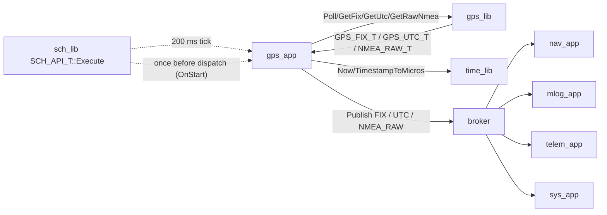

# GPS App — L2 Software Design

**Document type:** IEEE 1016 Software Design Description. **Module:** `gps_app` (View layer).
**Header:** `apps/gps_app/include/gps_app/gps_app.hpp`. **Source:** `apps/gps_app/src/gps_app.cpp`.
**Authoritative refs:** `docs/design/conventions.md`, `docs/design/system/system_design.md`, `libjuno/include/juno/app/app_api.hpp`.
**Requirements:** `docs/requirements/gps_app/requirements.json` (`SW-REQ-GPS-APP-001` .. `-010`).

---

<!-- @{"design": ["SW-REQ-GPS-APP-001", "SW-REQ-GPS-APP-002", "SW-REQ-GPS-APP-003", "SW-REQ-GPS-APP-004", "SW-REQ-GPS-APP-005", "SW-REQ-GPS-APP-006", "SW-REQ-GPS-APP-007", "SW-REQ-GPS-APP-008", "SW-REQ-GPS-APP-009", "SW-REQ-GPS-APP-010"]} -->
## 1. Purpose and Scope

`gps_app` is the View-layer application that schedules `gps_lib` at the system-mandated 5 Hz cadence and publishes the resulting GPS observations onto the LibJuno software bus for downstream consumers (`nav_app`, `mlog_app`, `telem_app`, `sys_app`). Addresses `SW-REQ-GPS-APP-001` through `SW-REQ-GPS-APP-010`.

In scope: `GPS_APP_T` struct embedding canonical `juno::app::APP_ROOT_T tRoot;` (`conventions.md` §1.4); canonical `juno::app::APP_API_T { OnStart, OnProcess, OnExit }` hooks; free composition-root setup function `GpsAppInit`; per-tick data flow (poll → retrieve typed records → publish); bus message catalog; local state machine; timing budget; error handling; memory ownership; POSIX/Pico2 equivalence.

Out of scope: NMEA byte acquisition (owned by `gps_lib`); NMEA sentence parsing (owned by `nmea_lib`, invoked **transitively** by `gps_lib` — `gps_app` never calls `nmea_lib` and sees only typed `GPS_FIX_T`/`GPS_UTC_T`/`NMEA_RAW_T` records; this is how `SW-REQ-GPS-APP-003` is satisfied — see §11); UART/peripheral programming; system health bitmap aggregation (owned by `sys_app`); SD log record framing (owned by `mlog_app`).

---

## 2. Definitions and Abbreviations

Cross-module vocabulary (time base, geodetic / HAE, NED, status semantics, message naming, scheduler period units, app lifecycle) is defined in `conventions.md` §4 / §1.4 and is **not** redefined here.

| Term | Meaning (module-local) |
|------|------------------------|
| Tick | One 200 ms TDM dispatch of `APP_API_T::OnProcess` (`kGpsAppPeriodMs = 200`). |
| Fix | One `JUNO_MSG_GPS_FIX_T` derived from a parsed NMEA triple (RMC + GGA primarily). |
| Sentence | One verbatim raw NMEA byte sequence from `gps_lib`. |
| Stale | `gps_lib` returns no new sentences for one or more consecutive ticks. |
| `OnStart` / `OnProcess` / `OnExit` | Canonical `APP_API_T` hooks (init / per-tick / graceful-shutdown). `OnExit` is POSIX-only per `SW-REQ-SYS-047`. |
| `GpsAppInit` | Free composition-root setup function (NOT in `APP_API_T`); seats DI pointers and calls `juno::app::AppInit`. |
| `JUNO_MSG_GPS_FIX_T` / `_UTC_T` / `_NMEA_RAW_T` | Bus messages published by gps_app (verbatim from `system_design.md` §4). |

---

<!-- @{"design": ["SW-REQ-GPS-APP-001", "SW-REQ-GPS-APP-003", "SW-REQ-GPS-APP-004", "SW-REQ-GPS-APP-005", "SW-REQ-GPS-APP-006"]} -->
## 3. System Overview

### 3.1 MVC layer mapping

| Layer | Module | Realization |
|-------|--------|-------------|
| View (App) | `gps_app` | `juno::gps_app::GPS_APP_T` with `juno::app::APP_ROOT_T tRoot;` as **first member** (`conventions.md` §1.4). |
| Controller (Lib) | `gps_lib` | `juno::gps::GPS_LIB_ROOT_T` — UART poll + internal NMEA parse delegation; exposes `Poll`/`GetFix`/`GetUtc`/`GetRawNmea`/`Probe`/`IsHealthy`. |
| Model (Bus) | `juno::sb::BROKER_ROOT_T<JUNO_MSG_BUS_VARIANT_T, 8, 64>` | LibJuno templated broker root; routes the three published types. |
| Time base | `juno::time::TIME_ROOT_T` | Canonical LibJuno time root — supplies `JUNO_TIME_MICROS_T` for every message timestamp. |
| Scheduler | `juno::sch::SCH_ROOT_T<8, 200>` | Cyclic-executive scheduler dispatches `tApp.tRoot.ptApi->OnProcess(tApp.tRoot)` every 200 ms. |

### 3.2 Module context diagram



`gps_lib` delegates internally to `nmea_lib`; `gps_app` has no direct `nmea_lib` dependency. `gps_app` does **not** subscribe to any bus message in FT1 — pure publisher. Health flows through `JUNO_MSG_GPS_FIX_T.bValid` and `_bGpsHealthy`, both aggregated by `sys_app`.

### 3.3 Header layout (canonical Option A app pattern)

- Header: `apps/gps_app/include/gps_app/gps_app.hpp`
- Source: `apps/gps_app/src/gps_app.cpp` (hooks); `main_posix.cpp` / `main_pico2.cpp` (composition-root scheduler binding).
- Namespace: `juno::gps_app`; type name `GPS_APP_T` per `conventions.md` §3 SCREAMING_SNAKE_CASE_T rule (consistent with peer apps `IMU_APP_T`, `BARO_APP_T`, `NAV_APP_T`, `AFM_APP_T`, `TELEM_APP_T`, `MLOG_APP_T`, `SYS_APP_T`).
- Period constant: `static constexpr uint32_t kGpsAppPeriodMs = 200;` in the public header (`conventions.md` §4.5; matches `system_design.md` §4.5; `SW-REQ-SYS-009`).

The struct embeds `juno::app::APP_ROOT_T tRoot;` as **first member** (`conventions.md` §1.4). The legacy bespoke `GPS_APP_API_T` is **dropped** — apps consume the canonical `juno::app::APP_API_T` from `libjuno/include/juno/app/app_api.hpp`.

```cpp
// apps/gps_app/include/gps_app/gps_app.hpp
#pragma once
#include "juno/module.h"
#include "juno/module.hpp"
#include "juno/status.h"
#include "juno/app/app_api.hpp"      // canonical APP_ROOT_T / APP_API_T / AppInit
#include "juno/sb/broker_api.hpp"    // juno::sb::BROKER_ROOT_T<MsgVariantT, NPipes, NRegCap>
#include "juno/time/time_api.hpp"    // juno::time::TIME_ROOT_T
#include "gps_lib/gps_api.hpp"       // juno::gps::GPS_LIB_ROOT_T
#include "juno_msg_bus_variant.hpp"  // JUNO_MSG_BUS_VARIANT_T (project-wide message variant)
#include <cstddef>
#include <cstdint>

namespace juno::gps_app
{

static constexpr uint32_t kGpsAppPeriodMs  = 200;  // SW-REQ-GPS-APP-001 / SW-REQ-SYS-009
static constexpr size_t   kNmeaSentenceMax = 128;

// `juno::JUNO_BROKER_ROOT_T` alias is a pending composition-root TODO.
struct GPS_APP_T
{
    juno::app::APP_ROOT_T tRoot;                                              // FIRST MEMBER (canonical)
    juno::gps::GPS_LIB_ROOT_T                                  *_ptGpsLib;    // DI; seated by GpsAppInit
    juno::sb::BROKER_ROOT_T<JUNO_MSG_BUS_VARIANT_T, 8, 64>     *_ptBus;
    juno::time::TIME_ROOT_T                                    *_ptTime;
    JUNO_MSG_GPS_FIX_T       _tFixScratch;                                    // publisher-owned scratch
    JUNO_MSG_GPS_UTC_T       _tUtcScratch;
    JUNO_MSG_GPS_NMEA_RAW_T  _tRawScratch;
    enum class STATE_E : uint8_t { Uninitialized = 0, Running = 1, Degraded = 2 };
    STATE_E  _eState;
    bool     _bGpsHealthy;
    uint32_t _u32MissedTickCount;
};

JUNO_STATUS_T GpsAppInit(
    GPS_APP_T                                                    &tApp,
    juno::gps::GPS_LIB_ROOT_T                                  &tGpsLib,
    juno::sb::BROKER_ROOT_T<JUNO_MSG_BUS_VARIANT_T, 8, 64>     &tBus,
    juno::time::TIME_ROOT_T                                    &tTime,
    JUNO_FAILURE_HANDLER_T                                      pfcnFailureHandler,
    JUNO_USER_DATA_T                                           *pvUserData
) noexcept;

} // namespace juno::gps_app
```

`GPS_APP_T` is trivially constructible (no ctor/dtor — `conventions.md` §1.3) and is `.bss` zero-init in the composition root before `main()` runs.

---

<!-- @{"design": ["SW-REQ-GPS-APP-001", "SW-REQ-GPS-APP-002", "SW-REQ-GPS-APP-003", "SW-REQ-GPS-APP-004", "SW-REQ-GPS-APP-005", "SW-REQ-GPS-APP-006", "SW-REQ-GPS-APP-008"]} -->
## 4. Interface Definitions

`gps_app` exposes **four** entry points: the composition-root setup function `GpsAppInit` (free function, not on `APP_API_T`), and the three canonical lifecycle hooks `OnStart` / `OnProcess` / `OnExit` (function references inside `juno::app::APP_API_T`). All are `noexcept`.

### 4.1 Composition-root setup — `GpsAppInit` (free function, NOT in APP_API_T)

<!-- @{"design": ["SW-REQ-GPS-APP-001", "SW-REQ-GPS-APP-008"]} -->

| Attribute | Value |
|-----------|-------|
| Signature | `JUNO_STATUS_T GpsAppInit(GPS_APP_T &tApp, juno::gps::GPS_LIB_ROOT_T &tGpsLib, juno::sb::BROKER_ROOT_T<JUNO_MSG_BUS_VARIANT_T, 8, 64> &tBus, juno::time::TIME_ROOT_T &tTime, JUNO_FAILURE_HANDLER_T pfcnFailureHandler, JUNO_USER_DATA_T *pvUserData) noexcept` |
| Preconditions | All three root dependencies have been initialized; `tApp` is `.bss` zero-init; broker is constructed before any app's `GpsAppInit` call (`system_design.md` §8.1). |
| Postconditions | `_ptGpsLib`/`_ptBus`/`_ptTime` seated by reference (no reseat thereafter); `tApp.tRoot` initialized via `juno::app::AppInit(tApp.tRoot, tApi, pfcnFailureHandler, pvUserData)`, where `tApi` is the file-scope `static const juno::app::APP_API_T` aggregate-initialized with `&GpsApp_OnStart`, `&GpsApp_OnProcess`, `&GpsApp_OnExit`; `_eState = Uninitialized`; `_bGpsHealthy = false`; `_u32MissedTickCount = 0`. |
| Error conditions | `JUNO_STATUS_NULLPTR_ERROR` from `JUNO_ASSERT_EXISTS`; otherwise the status returned by `juno::app::AppInit`. |
| Thread safety / side effects | Not thread-safe; called once from the composition root before `juno::sch::SCH_API_T<8, 200>::Execute()`. No bus/lib calls — those happen in `OnStart`. |

**Why a free function and not a hook:** `juno::app::APP_API_T` hooks take only `APP_ROOT_T &` (per the LibJuno header), so DI references to `gps_lib`, broker, and time root cannot pass through. `GpsAppInit` seats them on `_pt*` members *before* the scheduler ever calls a hook. `tApi` must be aggregate-initialized with three function references — no constructors, no virtuals (lessons 2026-05-03).

### 4.2 Lifecycle hook — `OnStart` (canonical APP_API_T member)

<!-- @{"design": ["SW-REQ-GPS-APP-001", "SW-REQ-GPS-APP-002", "SW-REQ-GPS-APP-006", "SW-REQ-GPS-APP-008"]} -->

| Attribute | Value |
|-----------|-------|
| Signature | `static JUNO_STATUS_T GpsApp_OnStart(juno::app::APP_ROOT_T &tApp) noexcept` (file-scope static in `gps_app.cpp`; address taken in `tApi{...}`). |
| Caller | Composition root, exactly once after `GpsAppInit` returns and the broker is live, **before** `juno::sch::SCH_API_T<8, 200>::Execute()` is invoked (`system_design.md` §8.1 step 7). |
| Preconditions | `GpsAppInit` returned `SUCCESS`; bus broker constructed; `_pt*` pointers non-null. Recovers `GPS_APP_T` via the embedded `tRoot` first-member offset (containerof-style; `conventions.md` §1.1). |
| Postconditions | (a) bus subscriptions established (gps_app subscribes to nothing in FT1 — see §6.2 — but this is the canonical place for future subscriptions); (b) `gps_lib::Probe` invoked (`SW-REQ-GPS-005`), result translated into GPS bit of `JUNO_MSG_SYS_POST_T`; (c) `_eState = Running` on success; (d) on `Probe` failure, failure handler invoked diagnostically; `_eState = Uninitialized`, `_bGpsHealthy = false`; the app continues to be dispatched (`SW-REQ-SYS-029`/`-058`). |
| Error conditions | `JUNO_STATUS_DNE_ERROR` from `gps_lib::Probe` is **not** a hard failure: returned upward as the OnStart status; composition root logs it into POST bitmap and proceeds (`SW-REQ-SYS-029`/`-030`/`-058`). |
| Thread safety / side effects | Not thread-safe; single-threaded. Up to one `gps_lib::Probe`; no bus publishes (first publish is the first `OnProcess` tick). |

### 4.3 Lifecycle hook — `OnProcess` (canonical APP_API_T member)

<!-- @{"design": ["SW-REQ-GPS-APP-001", "SW-REQ-GPS-APP-002", "SW-REQ-GPS-APP-003", "SW-REQ-GPS-APP-004", "SW-REQ-GPS-APP-005", "SW-REQ-GPS-APP-006", "SW-REQ-GPS-APP-007", "SW-REQ-GPS-APP-009", "SW-REQ-GPS-APP-010"]} -->

| Attribute | Value |
|-----------|-------|
| Signature | `static JUNO_STATUS_T GpsApp_OnProcess(juno::app::APP_ROOT_T &tApp) noexcept` |
| Caller | `juno::sch::SCH_API_T<8, 200>::Execute()` once every 200 ms minor-frame slot containing `&tApp.tRoot` (per `system_design.md` §8.2, every 40th of 200 minor frames). |
| Preconditions | `tApp._eState != Uninitialized` (i.e., `OnStart` returned `SUCCESS`). Recovers concrete `GPS_APP_T` from embedded `tRoot` first-member offset. |
| Postconditions | Per-tick call sequence: `Poll` → `GetRawNmea` → `GetFix` → `GetUtc`. **(a) success** — all `SUCCESS`: `JUNO_MSG_GPS_NMEA_RAW_T` published verbatim (`SW-REQ-GPS-APP-005`/`-009`); fresh `JUNO_MSG_GPS_FIX_T` with HAE altitude (`SW-REQ-GPS-APP-004`/`-010`); `JUNO_MSG_GPS_UTC_T` if `GetUtc` `OPTION_T` populated; `_bGpsHealthy=true`; `_u32MissedTickCount=0`. **(b) stale** — `Poll` `SUCCESS` (Poll returns `SUCCESS` even with no new data per `gps_lib` §4.2.1) but `GetFix`/`GetRawNmea` `DNE_ERROR`: `JUNO_MSG_GPS_FIX_T{bValid=false}` heartbeat published (`SW-REQ-GPS-APP-006`); `_u32MissedTickCount++`; `_eState=Degraded`. **(c) failure** — `Poll`/retrieval returned non-success, non-`DNE_ERROR` (e.g., `READ_ERROR`, `TABLE_FULL_ERROR`): `_bGpsHealthy=false`; heartbeat published (`SW-REQ-GPS-APP-007`); failure handler invoked diagnostically. |
| Error conditions | Always returns `JUNO_STATUS_SUCCESS` to the scheduler — `OnProcess` never aborts the cyclic-executive loop. Internal sub-call failures absorbed via the failure-handler chain and the health flag (`conventions.md` §4.3, `SW-REQ-SYS-037`). |
| Thread safety | Not thread-safe; called only from `juno::sch::SCH_API_T<8, 200>::Execute()` inside the cooperative TDM loop. |
| Side effects | Up to three bus publishes per tick (`FIX`, `RAW`, `UTC`); one timestamp read from `juno::time::TIME_ROOT_T::TimestampToMicros(now)`; one `Poll` plus up to three retrieval calls into `gps_lib`; writes to `_eState` / `_bGpsHealthy` / `_u32MissedTickCount`. |

### 4.4 Lifecycle hook — `OnExit` (canonical APP_API_T member)

<!-- @{"design": ["SW-REQ-GPS-APP-001", "SW-REQ-GPS-APP-008"]} -->

| Attribute | Value |
|-----------|-------|
| Signature | `static JUNO_STATUS_T GpsApp_OnExit(juno::app::APP_ROOT_T &tApp) noexcept` |
| Caller | POSIX graceful-shutdown only (e.g., SIGINT in unit-test or Trick harness). **Never invoked on Pico2 flight** — system runs until external power is removed (`SW-REQ-SYS-047` / `system_design.md` §5, §8.1). |
| Preconditions | `tApp.tRoot` was initialized via `GpsAppInit`; scheduler has stopped dispatching. |
| Postconditions | FT1 `GPS_APP_T` owns no POSIX file descriptors directly (UART fd lives in `gps_lib::GPS_LIB_IMPL_T`), so the body is a structurally complete **no-op** that returns `JUNO_STATUS_SUCCESS` — required by `conventions.md` §1.4 (lessons: "OnExit is required even if no-op"). On Pico2 the function is linked but never invoked. A future revision adding an app-owned POSIX descriptor would `close()` it here. |
| Error conditions / thread safety / side effects | None expected; returns `SUCCESS` unconditionally in FT1. Not thread-safe; called from composition root after scheduler returns. |

### 4.5 Composition-root aggregate-init pattern (informative)

```cpp
// apps/gps_app/src/gps_app.cpp — file-scope hook declarations and wiring
namespace juno::gps_app
{
static JUNO_STATUS_T GpsApp_OnStart  (juno::app::APP_ROOT_T &tApp) noexcept;
static JUNO_STATUS_T GpsApp_OnProcess(juno::app::APP_ROOT_T &tApp) noexcept;
static JUNO_STATUS_T GpsApp_OnExit   (juno::app::APP_ROOT_T &tApp) noexcept;

JUNO_STATUS_T GpsAppInit(
    GPS_APP_T                                                &tApp,
    juno::gps::GPS_LIB_ROOT_T                              &tGpsLib,
    juno::sb::BROKER_ROOT_T<JUNO_MSG_BUS_VARIANT_T, 8, 64> &tBus,
    juno::time::TIME_ROOT_T                                &tTime,
    JUNO_FAILURE_HANDLER_T                                  pfcnFailureHandler,
    JUNO_USER_DATA_T                                       *pvUserData) noexcept
{
    tApp._ptGpsLib = &tGpsLib; tApp._ptBus = &tBus; tApp._ptTime = &tTime;
    // The static APP_API_T is the ONLY file-scope datum (read-only after construction; §10).
    static const juno::app::APP_API_T tApi { &GpsApp_OnStart, &GpsApp_OnProcess, &GpsApp_OnExit };
    return juno::app::AppInit(tApp.tRoot, tApi, pfcnFailureHandler, pvUserData);
}
} // namespace juno::gps_app
```

The composition root places `&tApp.tRoot` into `juno::sch::SCH_ROOT_T<8, 200>::tArrSchTable[…]` at indices `i % 40 == 0` (since `kGpsAppPeriodMs / kMinorFrameMs == 200 / 5 == 40`):

```cpp
juno::gps_app::GPS_APP_T tGpsApp; // .bss zero-init
juno::gps_app::GpsAppInit(tGpsApp, tGpsLib.tRoot, tBus, tTime, &fh, /*pv=*/ nullptr);
// ... SCH_ROOT_T<8,200> aggregate-init then:
for (size_t i = 0; i < 200; ++i)
    if (i % 40 == 0) tSch.tArrSchTable[i][6] = &tGpsApp.tRoot; // 200 ms slot, col 6
JUNO_ASSERT_SUCCESS(tGpsApp.tRoot.ptApi->OnStart(tGpsApp.tRoot), /*mark POST*/);
tSch.ptApi->Execute(tSch); // Cyclic-executive entry point (replaces legacy sch_lib::Run()).
```

---

<!-- @{"design": ["SW-REQ-GPS-APP-001", "SW-REQ-GPS-APP-006", "SW-REQ-GPS-APP-007"]} -->
## 5. State Machines

Minimal lifecycle state machine — **not** a phase machine; governs only this app's local execution mode, observable via `bValid` and `_bGpsHealthy`.

```mermaid
stateDiagram-v2
    [*] --> Uninitialized: power-on (.bss zero-init)
    Uninitialized --> Running: OnStart returns SUCCESS (Probe SUCCESS)
    Uninitialized --> Degraded: OnStart returns DNE_ERROR (Probe found no bytes)
    Running --> Degraded: OnProcess: Poll/Get* failure OR DNE_ERROR (stale)
    Degraded --> Running: subsequent successful Poll + GetFix
    Running --> Running: nominal 200 ms tick (OnProcess SUCCESS)
    Degraded --> Degraded: continued failure / staleness
    Running --> [*]: external power removal (Pico2; SW-REQ-SYS-047) or OnExit (POSIX)
    Degraded --> [*]: same
```

| From | To | Trigger | Hook | Observable side effect |
|------|----|---------|------|------------------------|
| Uninitialized | Running | `Probe` SUCCESS | `OnStart` | None on the bus |
| Uninitialized | Degraded | `Probe` DNE_ERROR | `OnStart` | POST bit set in `JUNO_MSG_SYS_POST_T` (sys_app aggregates) |
| Running | Running | `Poll` + `GetFix`/`GetRawNmea` SUCCESS | `OnProcess` | `FIX{bValid=true}`, `RAW`, optional `UTC` published |
| Running | Degraded | `Poll` non-success **or** `GetFix`/`GetRawNmea` `DNE_ERROR` | `OnProcess` | `FIX{bValid=false}` heartbeat; `_bGpsHealthy=false` |
| Degraded | Running | `Poll` + `GetFix`/`GetRawNmea` SUCCESS | `OnProcess` | `FIX{bValid=true}`, `RAW`, optional `UTC` published; `_bGpsHealthy=true` |
| Degraded | Degraded | Continued failure or `DNE_ERROR` | `OnProcess` | `FIX{bValid=false}` heartbeat |

The app **never** halts itself or alters the schedule (`SW-REQ-SYS-033`/`-037`). `Degraded` is purely an observable label.

---

<!-- @{"design": ["SW-REQ-GPS-APP-004", "SW-REQ-GPS-APP-005", "SW-REQ-GPS-APP-006", "SW-REQ-GPS-APP-009", "SW-REQ-GPS-APP-010"]} -->
## 6. Data Flow

### 6.1 Published bus messages

| Type | Cadence | Purpose | Subscribers |
|------|---------|---------|-------------|
| `JUNO_MSG_GPS_FIX_T` | every 200 ms tick (heartbeat; `bValid` reflects `GetFix` outcome) | Geodetic position + HAE altitude + NED velocity + fix quality (`SW-REQ-GPS-APP-004`/`-010`) | `nav_app`, `mlog_app`, `telem_app` |
| `JUNO_MSG_GPS_NMEA_RAW_T` | per sentence — only when `GetRawNmea` returns `SUCCESS` (verbatim) | Raw NMEA for SD-card replay (`SW-REQ-GPS-APP-005`/`-009`) | `mlog_app` |
| `JUNO_MSG_GPS_UTC_T` | aperiodic — only when `GetUtc` returns a populated `OPTION_T` | UTC wall-clock record (`SW-REQ-SYS-028`) | `mlog_app`, `telem_app` |

### 6.1.1 Per-tick call sequence (text flow inside `OnProcess`)

```
GpsApp_OnProcess(tApp.tRoot):
  1. _ptGpsLib->ptApi->Poll(*_ptGpsLib)   → SUCCESS even if no new bytes
  2. tNowUs = _ptTime->TimestampToMicros(_ptTime->ptApi->Now(*_ptTime).tOk).tOk
  3. GetRawNmea(_tRawScratch) → SUCCESS publish RAW; DNE_ERROR mark stale
  4. GetFix(_tFixScratch)     → SUCCESS publish FIX{bValid=true}; DNE_ERROR publish FIX{bValid=false} heartbeat
  5. GetUtc(_tUtcScratch)     → OPTION populated publish UTC; else skip
  6. return JUNO_STATUS_SUCCESS (always)
```

### 6.2 Subscribed bus messages

None. `gps_app` is a pure publisher in FT1. GPS health is published via `JUNO_MSG_GPS_FIX_T.bValid` and `_bGpsHealthy`, aggregated by `sys_app` into `JUNO_MSG_SYS_HEALTH_T` (`SW-REQ-GPS-APP-006`/`-007`, `SW-REQ-SYS-031`). `OnStart` is the canonical place to register subscriptions in any future revision.

### 6.3 Type names (verbatim from `system_design.md` §4)

```cpp
struct JUNO_MSG_GPS_FIX_T { // libs/gps_lib/include/gps_lib/gps_msg.hpp
    JUNO_TIME_MICROS_T tTimestampUs;  // monotonic-µs (SW-REQ-SYS-026/-027)
    double         dLatDeg;       // WGS-84 geodetic (SW-REQ-SYS-038)
    double         dLonDeg;
    float          fAltMHae;      // HAE meters (SW-REQ-SYS-039 / SW-REQ-GPS-APP-010)
    float          tVelNed[3];    // m/s, NED  (SW-REQ-SYS-040)
    uint8_t        eFixQuality;
    bool           bValid;        // parse + health summary
};
struct JUNO_MSG_GPS_UTC_T { JUNO_TIME_MICROS_T tTimestampUs; struct { uint16_t year; uint8_t mon, day, hr, min, sec; uint32_t us; } tUtc; };
struct JUNO_MSG_GPS_NMEA_RAW_T { JUNO_TIME_MICROS_T tTimestampUs; char acSentence[kNmeaSentenceMax]; size_t zLen; };
```

Per `conventions.md` §4.4, every published type is a POD aggregate with leading `JUNO_TIME_MICROS_T tTimestampUs` and zero constructors.

### 6.4 Buffer ownership

`gps_app` owns `_tFixScratch`, `_tRawScratch`, `_tUtcScratch` for the duration of the tick. The broker copies bytes into subscriber-side storage on `Publish()`; after that returns, scratch is free for reuse. Subscribers never mutate received messages (`conventions.md` §5 rule 6).

---

<!-- @{"design": ["SW-REQ-GPS-APP-001", "SW-REQ-GPS-APP-002", "SW-REQ-GPS-APP-003", "SW-REQ-GPS-APP-004", "SW-REQ-GPS-APP-005", "SW-REQ-GPS-APP-007", "SW-REQ-GPS-APP-010"]} -->
## 7. Sequence Diagrams

### 7.1 Once-only init (composition root → GpsAppInit → OnStart → Probe)

```mermaid
sequenceDiagram
    participant cr as composition_root
    participant app as gps_app
    participant lib as gps_lib

    cr->>app: GpsAppInit(tApp, tGpsLib, tBus, tTime, &fh, pv)
    Note over app: Seat _ptGpsLib/_ptBus/_ptTime;<br/>static const APP_API_T tApi{&OnStart,&OnProcess,&OnExit};<br/>juno::app::AppInit(tApp.tRoot, tApi, fh, pv)
    app-->>cr: JUNO_STATUS_SUCCESS
    Note over cr: composition root finishes wiring every app + SCH_ROOT_T<8,200>
    cr->>app: tApp.tRoot.ptApi->OnStart(tApp.tRoot)
    app->>lib: Probe(*_ptGpsLib)
    alt Probe SUCCESS
      lib-->>app: SUCCESS — _eState = Running
    else Probe DNE_ERROR
      lib-->>app: DNE_ERROR — _eState = Degraded; POST bit set
    end
    app-->>cr: status (composition root logs to POST bitmap)
    Note over cr: After every app's OnStart returns: tSch.ptApi->Execute(tSch)
```

### 7.2 Nominal tick (TDM @5 Hz → OnProcess → Poll → GetRawNmea → GetFix → GetUtc → publish)

```mermaid
sequenceDiagram
    participant sch as SCH_API_T::Execute
    participant app as GpsApp_OnProcess
    participant lib as gps_lib
    participant time as juno::time::TIME_ROOT_T
    participant bus as broker

    sch->>app: OnProcess(tApp.tRoot) at t = k * 200 ms
    app->>lib: Poll(*_ptGpsLib)
    lib-->>app: JUNO_STATUS_SUCCESS (UART drained, parsed via nmea_lib internally)
    app->>time: Now(tTime); TimestampToMicros(tTs)
    time-->>app: RESULT_T<JUNO_TIME_MICROS_T>{SUCCESS, tNowUs}
    app->>lib: GetRawNmea(*_ptGpsLib)
    lib-->>app: RESULT_T<NMEA_RAW_T>{SUCCESS}
    app->>bus: Publish(JUNO_MSG_GPS_NMEA_RAW_T)
    app->>lib: GetFix(*_ptGpsLib)
    lib-->>app: RESULT_T<GPS_FIX_T>{SUCCESS}
    Note over app: _tFixScratch.bValid=true; _bGpsHealthy=true; _u32MissedTickCount=0
    app->>bus: Publish(JUNO_MSG_GPS_FIX_T)
    app->>lib: GetUtc(*_ptGpsLib)
    lib-->>app: OPTION_T{populated}
    alt UTC populated
      app->>bus: Publish(JUNO_MSG_GPS_UTC_T)
    end
    app-->>sch: JUNO_STATUS_SUCCESS
```

### 7.3 Poll/retrieval failure (gps_lib I/O error → unhealthy heartbeat, schedule unaffected)

```mermaid
sequenceDiagram
    participant sch as SCH_API_T::Execute
    participant app as GpsApp_OnProcess
    participant lib as gps_lib
    participant bus as broker
    participant fh as failure_handler

    sch->>app: OnProcess(tApp.tRoot)
    app->>lib: Poll(*_ptGpsLib)
    lib-->>app: JUNO_STATUS_READ_ERROR
    app->>fh: Log("gps_app::OnProcess Poll failed")
    Note over fh: Diagnostic only (SW-REQ-SYS-037)
    Note over app: _bGpsHealthy=false; _eState=Degraded; _tFixScratch.bValid=false
    app->>bus: Publish(JUNO_MSG_GPS_FIX_T{bValid=false})
    app-->>sch: JUNO_STATUS_SUCCESS
```

### 7.4 Stale tick (Poll OK but no fresh fix/raw sentence)

```mermaid
sequenceDiagram
    participant sch as SCH_API_T::Execute
    participant app as GpsApp_OnProcess
    participant lib as gps_lib
    participant bus as broker

    sch->>app: OnProcess(tApp.tRoot)
    app->>lib: Poll(*_ptGpsLib)
    lib-->>app: SUCCESS (no new bytes — Poll still SUCCESS per gps_lib §4.2.1)
    app->>lib: GetRawNmea / GetFix
    lib-->>app: JUNO_STATUS_DNE_ERROR (both)
    Note over app: _u32MissedTickCount++; _eState=Degraded; _bGpsHealthy=false
    app->>bus: Publish(JUNO_MSG_GPS_FIX_T{bValid=false})
    app-->>sch: JUNO_STATUS_SUCCESS
```

---

<!-- @{"design": ["SW-REQ-GPS-APP-001", "SW-REQ-GPS-APP-008"]} -->
## 8. Timing and Scheduling Analysis

### 8.1 Period

`kGpsAppPeriodMs = 200` (5 Hz) — declared in `apps/gps_app/include/gps_app/gps_app.hpp`. Identical to `system_design.md` §4.5; matches `SW-REQ-SYS-009` and `SW-REQ-GPS-APP-001`. The constant is `static constexpr uint32_t` (compile-time, satisfying `SW-REQ-SYS-010`). The cyclic-executive scheduler `juno::sch::SCH_ROOT_T<8, 200>` runs at a 5 ms minor-frame base; `gps_app`'s `&tApp.tRoot` is placed in `tArrSchTable[i][6]` for every `i % 40 == 0` (every 40th minor frame).

### 8.2 Per-tick budget

| Step | Bound | Notes |
|------|-------|-------|
| `gps_lib::Poll` | ≤ 1 ms (POSIX), ≤ 2 ms (Pico2) | Non-blocking per `SW-REQ-GPS-004`; includes internal `nmea_lib` parse delegation. SUCCESS even with no new bytes. |
| `juno::time::TIME_ROOT_T::tApi->Now` + `TimestampToMicros` | ≤ 5 µs | Single syscall (POSIX) / single timer read (Pico2). |
| `gps_lib::GetRawNmea` | ≤ 50 µs | POD copy of cached `NMEA_RAW_T`. |
| `gps_lib::GetFix` | ≤ 50 µs | POD copy of cached `GPS_FIX_T`. |
| `gps_lib::GetUtc` | ≤ 50 µs | `OPTION_T<GPS_UTC_T>` trivial copy when populated. |
| Three `broker::Publish` calls | ≤ 100 µs | POD memcpy into broker storage. |
| Total worst case | **≤ 3 ms** | Comfortably inside the 200 ms slot. |

`gps_app` runs only every 40th 5 ms tick. On the t=0 hyperperiod-aligned tick (worst-case stack `imu + nav + afm + mlog + baro + sys + gps + telem`) the 3 ms gps budget fits within the 5 ms aggregate (per `system_design.md` §8.2). `nmea_lib::Parse` cost is folded into `gps_lib::Poll`.

### 8.3 Downstream consumers

| Consumer | Period | Message it cares about |
|----------|--------|-------------------------|
| `nav_app` | 10 ms (`kNavAppPeriodMs`) | `JUNO_MSG_GPS_FIX_T` (most-recent latched) |
| `mlog_app` | 5 ms (`kMlogAppPeriodMs`) | All three (`FIX`, `RAW`, `UTC`) |
| `telem_app` | 500 ms (`kTelemAppPeriodMs`) | `JUNO_MSG_GPS_FIX_T`, `JUNO_MSG_GPS_UTC_T` |
| `sys_app` | 100 ms (`kSysAppPeriodMs`) | Observes `bValid` to update its bitmap |

Determinism (`SW-REQ-SYS-044`) follows from compile-time period, fixed call sequence, no dynamic memory, no virtual dispatch, no exceptions (`SW-REQ-SYS-053`).

---

<!-- @{"design": ["SW-REQ-GPS-APP-006", "SW-REQ-GPS-APP-007"]} -->
## 9. Error Handling Strategy

`gps_app` follows the system-wide error-handling idiom (`system_design.md` §9, `conventions.md` §4.3):

1. **Status propagation.** Internal calls inside `OnProcess` use `JUNO_ASSERT_OK` / `JUNO_ASSERT_SUCCESS`; bare `if (status != SUCCESS) return;` is forbidden. When an assertion would otherwise propagate failure to the scheduler, `OnProcess` instead **catches the local status**, marks GPS unhealthy, publishes a `bValid=false` heartbeat, and returns `JUNO_STATUS_SUCCESS` — `OnProcess` is the policy boundary converting library faults into health-bitmap observations (`SW-REQ-GPS-APP-007`).
2. **`Poll` failure → unhealthy.** Any non-success from `Poll` (e.g., `READ_ERROR`, `TABLE_FULL_ERROR`) sets `_bGpsHealthy = false`, `_eState = Degraded`, `_tFixScratch.bValid = false`; failure handler invoked diagnostically; heartbeat published (`SW-REQ-GPS-APP-007`).
3. **`GetFix`/`GetRawNmea` `DNE_ERROR` → stale, not failure.** Routine staleness: `_bGpsHealthy = false`, heartbeat published, failure handler **not** invoked. Parse correctness is owned by `gps_lib`/`nmea_lib`; `gps_app` infers parse health from `GetFix` outcome only.
4. **`OnStart` failure → POST bit, continue.** Non-success from `gps_lib::Probe` is returned to the composition root, which records the GPS bit in `JUNO_MSG_SYS_POST_T` (`SW-REQ-SYS-029`/`-030`/`-058`) and calls `juno::sch::SCH_API_T<8, 200>::Execute()` regardless.
5. **Failure handler is diagnostic-only.** `JUNO_FAILURE_HANDLER_T` (injected via `GpsAppInit`, stored in `APP_ROOT_T` by `juno::app::AppInit`) writes a severity-tagged log record; **never alters control flow** (`SW-REQ-SYS-037`).
6. **No exceptions, no actuation, no auto-reboot.** Every API function is `noexcept` (`SW-REQ-SYS-053`); `gps_app` performs no hardware actuation and never initiates a reboot (`SW-REQ-SYS-004`, `SW-REQ-SYS-037`).
7. **Continuous health publishing.** The `bValid` flag on every published `JUNO_MSG_GPS_FIX_T` (valid or heartbeat) gives `sys_app` a continuous observation surface (`SW-REQ-GPS-APP-006`, `SW-REQ-SYS-031`); the app never silently skips a tick. `OnProcess` always returns `JUNO_STATUS_SUCCESS` to the scheduler.

---

## 10. Memory Ownership

Per `conventions.md` §5: caller-owns-everything; zero dynamic allocation; no global mutable state.

| Buffer / facility | Owner | Lifetime | Allocation |
|-------------------|-------|----------|------------|
| `GPS_APP_T tGpsApp` instance | composition root (`apps/main.cpp`) | program | Static `.bss` zero-init — caller-owned |
| `tGpsApp.tRoot` (`APP_ROOT_T`, first member) | embedded inside `GPS_APP_T` | program | `.bss` — initialized by `juno::app::AppInit` inside `GpsAppInit` |
| `_ptGpsLib`, `_ptBus`, `_ptTime` | composition root (refs to its statics) | program | None — pointers seated by `GpsAppInit` |
| `_tFixScratch`, `_tUtcScratch`, `_tRawScratch` | `GPS_APP_T` POD members | program | Static — embedded |
| `_eState`, `_bGpsHealthy`, `_u32MissedTickCount` | `GPS_APP_T` POD members | program | Static — embedded |
| `static const juno::app::APP_API_T tApi` | file-scope local in `GpsAppInit` | program | Read-only after construction |
| Subscriber-side message storage | `juno::sb::BROKER_ROOT_T<JUNO_MSG_BUS_VARIANT_T, 8, 64>` | program | Caller-owned (broker pre-sized statically) |

Asserted invariants:

- **`static const juno::app::APP_API_T tApi{...}` inside `GpsAppInit` is the ONLY file-scope datum** in `gps_app.cpp` — read-only after construction, aggregate-initialized with three function references (`&GpsApp_OnStart`, `&GpsApp_OnProcess`, `&GpsApp_OnExit`); no constructor, no virtuals (`conventions.md` §1.4; lessons 2026-05-03).
- **`GPS_APP_T` instance is `.bss` zero-init in the composition root.** Before `main()` every byte of `tGpsApp` is `0`; `GpsAppInit` then seats DI pointers and forwards to `juno::app::AppInit`.
- **No `new`/`delete`/`malloc`/`calloc`/`realloc`/`free`** anywhere in `gps_app` source (`SW-REQ-SYS-050`); no heap-backed STL containers.
- **No global mutable state.** Only file-scope statics in `gps_app.cpp` are `static constexpr` constants (`kGpsAppPeriodMs`, `kNmeaSentenceMax`) and the read-only `tApi`. None mutate after init.
- **No constructors / destructors** on `GPS_APP_T` or `juno::app::APP_ROOT_T` (`conventions.md` §1.3).
- **Composition root holds the instance.** `apps/main.cpp` declares `juno::gps_app::GPS_APP_T tGpsApp;` alongside `juno::gps::GPS_LIB_IMPL_T tGpsLib;`, the broker, and the LibJuno time root, then calls `GpsAppInit(tGpsApp, tGpsLib.tRoot, tBus, tTime, &fh, pv);` exactly once before `juno::sch::SCH_API_T<8, 200>::Execute()`. (`nmea_lib` is wired into `gps_lib`'s composition, not into `gps_app`.)

---

## 11. Traceability

Per-section `<!-- @{"design": [...]} -->` tags above are authoritative; this table is descriptive. **Every requirement traced in the legacy design is preserved**; tags previously attached to `Init`/`Execute` are reattached to (`GpsAppInit`/`OnStart`/`OnProcess`/`OnExit`).

| Req ID | Title | Section(s) |
|--------|-------|-----------|
| SW-REQ-GPS-APP-001 | GPS App Scheduled at 5 Hz | §1, §3, §4.1 (`GpsAppInit`), §4.2 (`OnStart`), §4.3 (`OnProcess`), §4.4 (`OnExit`), §5, §7, §8.1 |
| SW-REQ-GPS-APP-002 | Read NMEA Messages from GPS Library | §1, §4.2 (`OnStart` Probe), §4.3 (`OnProcess` Poll/GetRawNmea), §7.2 |
| SW-REQ-GPS-APP-003 | Delegate NMEA Parsing to NMEA Library (satisfied **transitively** — `gps_app` calls `gps_lib`, which delegates parsing to `nmea_lib` internally; `gps_app` has no direct `nmea_lib` dependency) | §1, §3.1, §3.2, §4.3 (`OnProcess` call sequence), §7.2 (Poll delegates parse), §11 (this row) |
| SW-REQ-GPS-APP-004 | Publish Structured GPS Fix on Software Bus | §1, §4.3 (`OnProcess`), §6, §7.2 |
| SW-REQ-GPS-APP-005 | Publish Raw NMEA Bytes on Software Bus | §1, §4.3 (`OnProcess`), §6, §7.2 |
| SW-REQ-GPS-APP-006 | Publish GPS Health Status | §1, §4.2 (`OnStart` POST), §4.3 (`OnProcess`), §5, §6.2, §7.3, §7.4, §9 |
| SW-REQ-GPS-APP-007 | Report GPS Unhealthy on Read Failure | §1, §4.3 (`OnProcess` failure path), §5, §7.3, §9 |
| SW-REQ-GPS-APP-008 | POSIX and Pico2 Functional Equivalence | §1, §4.1 (`GpsAppInit`), §4.4 (`OnExit` POSIX-only), §8 (and equivalence statement below) |
| SW-REQ-GPS-APP-009 | Raw GPS Bytes Available for Logging | §1, §4.3 (`OnProcess`), §6, §7.2 |
| SW-REQ-GPS-APP-010 | HAE Altitude in Published GPS Fix | §1, §4.3 (`OnProcess`), §6.3, §7.2 |

### POSIX / Pico2 functional equivalence (`SW-REQ-GPS-APP-008` / `SW-REQ-SYS-043`)

`gps_app` carries **no platform-specific code** — `GpsAppInit`, `OnStart`, `OnProcess`, `OnExit` bodies are identical across POSIX and Pico2. Platform divergence lives in `gps_lib::GPS_LIB_IMPL_T` (POSIX in `libs/gps_lib/src/posix/gps_posix.cpp`, Pico2 in `libs/gps_lib/src/pico2/gps_pico2.cpp`) and in the `juno::time::TIME_API_T` impl selected by the composition root. Given identical NMEA byte streams to `gps_lib::Poll`, `OnProcess` produces identical `JUNO_MSG_GPS_FIX_T`/`_NMEA_RAW_T`/`_UTC_T` bytes on both targets. `OnExit` is reachable only on POSIX (`SW-REQ-SYS-047`); the Pico2 build links it but never invokes it. Trick SITL exercises the POSIX path through the same `GPS_LIB_ROOT_T` API as flight (`SW-REQ-SYS-045`).
