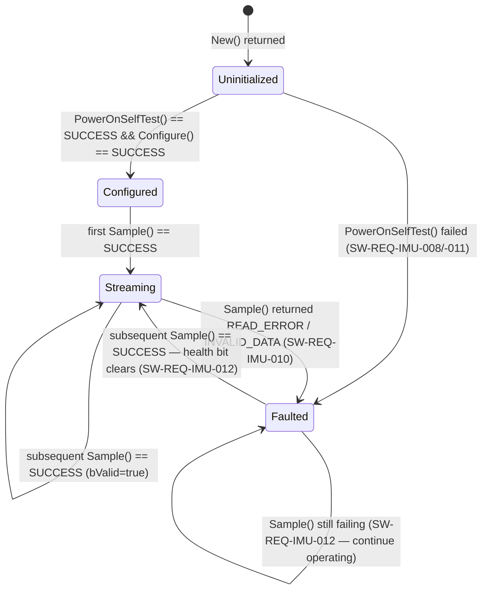
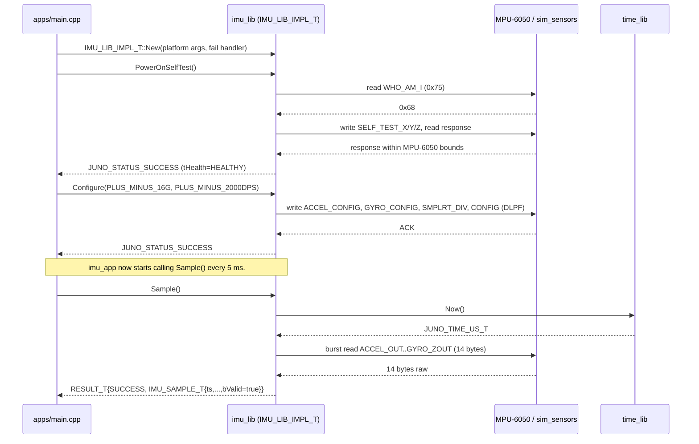
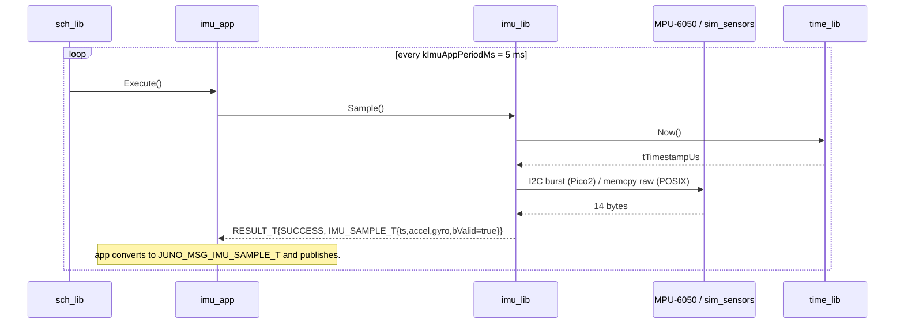

# IMU Library — Design (L2)

**Document type:** IEEE 1016 Software Design Description
**Module:** `imu_lib` (MPU-6050 inertial measurement unit driver)
**Header path:** `libs/imu_lib/include/imu_lib/imu_api.hpp`
**POSIX impl:** `libs/imu_lib/src/posix/imu_posix.cpp`
**Pico2 impl:** `libs/imu_lib/src/pico2/imu_pico2.cpp`
**References (do not contradict):** `docs/design/conventions.md`, `docs/design/system/system_design.md`.

---

<!-- @{"design": ["SW-REQ-IMU-001", "SW-REQ-IMU-002", "SW-REQ-IMU-003", "SW-REQ-IMU-004", "SW-REQ-IMU-005", "SW-REQ-IMU-006", "SW-REQ-IMU-007", "SW-REQ-IMU-008", "SW-REQ-IMU-009", "SW-REQ-IMU-010", "SW-REQ-IMU-011", "SW-REQ-IMU-012", "SW-REQ-IMU-013", "SW-REQ-IMU-014"]} -->
## 1. Purpose and Scope

This L2 design specifies the IMU library (`imu_lib`) — the driver-layer (MVC Controller) component that owns all interaction with the MPU-6050 6-DoF inertial sensor on the Juno FT1 vehicle. It addresses every requirement in `docs/requirements/imu/requirements.json` (`SW-REQ-IMU-001` through `SW-REQ-IMU-014`).

**In scope.** The public C++ API on `IMU_LIB_ROOT_T`, the device-side state machine (`Uninitialized → Configured → Streaming → Faulted`), the POSIX implementation that reads simulated raw register values from the `sim_sensors` Trick module, the Pico2 implementation that talks to the MPU-6050 over I2C (i2c0 or i2c1, address `0x68` or `0x69` per AD0 strapping), the POST self-test procedure, the per-sample unit conversion (raw counts → m/s² and rad/s in body frame), and the health/error contract.

**Out of scope.** Bus publication of `JUNO_MSG_IMU_SAMPLE_T` — that is owned by `imu_app` (per `system_design.md` §4) and is **not** performed inside `imu_lib`. Scheduler dispatch, telemetry packing, mlog persistence, navigation filtering, and any control over the AFM phase machine are likewise out of scope. The numeric content of `JUNO_MSG_IMU_SAMPLE_T` is consumed verbatim from this library's `IMU_SAMPLE_T` value type.

---

## 2. Definitions and Abbreviations

Cross-module vocabulary (time base, status semantics, frames, units, message naming) is defined in `docs/design/conventions.md` §4 and is **not** redefined here. Specifically: `SW-REQ-SYS-026` (monotonic µs time base, `JUNO_TIME_US_T`), `SW-REQ-SYS-042` (SI units), `SW-REQ-SYS-057` (body axes X-fwd/Y-right/Z-down) are inherited verbatim from the conventions doc §4.2 and §4.6.

| Term | Meaning |
|------|---------|
| MPU-6050 | InvenSense 6-DoF IMU (3-axis accelerometer + 3-axis gyroscope), I2C-attached |
| AD0 | MPU-6050 address-select pin (low = 0x68, high = 0x69) |
| WHO_AM_I | MPU-6050 ID register (`0x75`); reads `0x68` on a healthy part |
| `ACCEL_FS_SEL` | MPU-6050 accelerometer full-scale select bits in `ACCEL_CONFIG` (0x1C); `3` = ±16 g |
| `GYRO_FS_SEL` | MPU-6050 gyroscope full-scale select bits in `GYRO_CONFIG` (0x1B); `3` = ±2000 dps |
| `SMPLRT_DIV` | MPU-6050 sample-rate divider register (0x19); `(gyro_out_rate)/(1 + SMPLRT_DIV)` |
| Body frame | X-forward, Y-right, Z-down (per `SW-REQ-SYS-057`) |
| POST | Power-On Self-Test; here, MPU-6050 WHO_AM_I + built-in self-test |
| Trick seam | The POSIX-only file-scope variables in `sim_sensors` that supply raw register values to the POSIX impl |

---

<!-- @{"design": ["SW-REQ-IMU-001", "SW-REQ-IMU-007", "SW-REQ-IMU-009", "SW-REQ-IMU-013"]} -->
## 3. System Overview

### 3.1 MVC layer mapping

| Layer | Realization | This module |
|-------|-------------|-------------|
| View (App) | `imu_app` (separate L2) | not this design |
| Controller (Lib) | `imu_lib` — MPU-6050 driver | **this design** |
| Model (Bus) | `JUNO_MSG_IMU_SAMPLE_T` (published by `imu_app`) | catalog only — `imu_lib` does **not** touch the broker |

`imu_lib` is a pure Controller: it produces `IMU_SAMPLE_T` values on demand from the MPU-6050. It owns no scheduler hooks, no broker handle, no bus subscriptions. The 200 Hz cadence (`SW-REQ-IMU-001`) is enforced by `imu_app` calling `Sample()` once per `kImuAppPeriodMs = 5` tick (per `conventions.md` §4.5 and `system_design.md` §8); the library itself is stateless w.r.t. wall time and is functionally pure given its register-read inputs (`SW-REQ-IMU-014`).

### 3.2 Module context

```mermaid
flowchart LR
    sim_sensors[sim_sensors\n(Trick)] -- raw counts --> imu_posix[imu_lib\nPOSIX impl]
    mpu6050[MPU-6050\n(I2C device)] -- I2C reads --> imu_pico2[imu_lib\nPico2 impl]
    imu_posix --> root[IMU_LIB_ROOT_T]
    imu_pico2 --> root
    root -- IMU_SAMPLE_T --> imu_app
    imu_app -- JUNO_MSG_IMU_SAMPLE_T --> broker[(broker)]
    broker --> nav_app & afm_app & mlog_app
```

`imu_lib` exposes one `IMU_LIB_ROOT_T` that two implementations derive (`SW-REQ-IMU-013`); both produce identical `IMU_SAMPLE_T` values for the same simulated/real raw inputs (`SW-REQ-IMU-014`).

---

<!-- @{"design": ["SW-REQ-IMU-001", "SW-REQ-IMU-002", "SW-REQ-IMU-003", "SW-REQ-IMU-004", "SW-REQ-IMU-005", "SW-REQ-IMU-006", "SW-REQ-IMU-007", "SW-REQ-IMU-008", "SW-REQ-IMU-009", "SW-REQ-IMU-010", "SW-REQ-IMU-013", "SW-REQ-IMU-014"]} -->
## 4. Interface Definitions

### 4.1 Header sketch (`libs/imu_lib/include/imu_lib/imu_api.hpp`)

```cpp
#pragma once
#include "juno/module.h"
#include "juno/module.hpp"
#include "juno/status.h"
#include "juno/time/time_api.hpp"   // JUNO_TIME_US_T
#include <cstddef>
#include <cstdint>

namespace juno::imu
{

enum class IMU_ACCEL_RANGE_T : uint8_t { PLUS_MINUS_2G = 0, PLUS_MINUS_4G = 1,
                                         PLUS_MINUS_8G = 2, PLUS_MINUS_16G = 3 };
enum class IMU_GYRO_RANGE_T  : uint8_t { PLUS_MINUS_250DPS  = 0, PLUS_MINUS_500DPS  = 1,
                                         PLUS_MINUS_1000DPS = 2, PLUS_MINUS_2000DPS = 3 };
enum class IMU_HEALTH_T      : uint8_t { HEALTHY = 0, FAULTED = 1 };

struct IMU_SAMPLE_T
{
    JUNO_TIME_US_T tTimestampUs;   // monotonic µs at sample acquisition (SW-REQ-IMU-006)
    float          tAccel[3];      // body frame, m/s²   (SW-REQ-IMU-004, -007)
    float          tGyro[3];       // body frame, rad/s  (SW-REQ-IMU-005, -007)
    bool           bValid;         // false if read failed (SW-REQ-IMU-010)
};

struct IMU_LIB_ROOT_T;

struct IMU_LIB_API_T
{
    JUNO_STATUS_T (&PowerOnSelfTest)(IMU_LIB_ROOT_T &tRoot) noexcept;
    JUNO_STATUS_T (&Configure)(IMU_LIB_ROOT_T &tRoot,
                               IMU_ACCEL_RANGE_T tAccelRange,
                               IMU_GYRO_RANGE_T  tGyroRange) noexcept;
    RESULT_T<IMU_SAMPLE_T> (&Sample)(IMU_LIB_ROOT_T &tRoot) noexcept;
    OPTION_T<IMU_HEALTH_T> (&Health)(const IMU_LIB_ROOT_T &tRoot) noexcept;
};

struct IMU_LIB_ROOT_T JUNO_MODULE_ROOT(IMU_LIB_API_T,
    IMU_HEALTH_T tHealth;            // updated by impl, read by Health()
    uint64_t     u64SampleCount;     // monotonic counter — observable for SW-REQ-IMU-009
);

} // namespace juno::imu
```

No constructors / destructors on `IMU_LIB_ROOT_T` (per `conventions.md` §1.3); zero-init in `.bss` is safe. All four vtable function references are `noexcept`.

### 4.2 Contracts

#### `PowerOnSelfTest`

| Attribute | Value |
|-----------|-------|
| Signature | `JUNO_STATUS_T (&PowerOnSelfTest)(IMU_LIB_ROOT_T &tRoot) noexcept` |
| Preconditions | `tRoot` initialized via `IMU_LIB_IMPL_T::New(...)`. |
| Postconditions | On success: `tRoot.tHealth == HEALTHY`, MPU-6050 self-test bits cleared, device returned to normal-operation register state. On failure: `tRoot.tHealth == FAULTED`, status describes the cause. |
| Error conditions | `JUNO_STATUS_READ_ERROR` (I2C / Trick read failed); `JUNO_STATUS_INVALID_DATA_ERROR` (WHO_AM_I != `0x68` or self-test response out of MPU-6050 datasheet bounds). |
| Thread safety | Not thread-safe; single-threaded TDM caller only. |
| Requirements | `SW-REQ-IMU-008`, `SW-REQ-IMU-011`. |

#### `Configure`

| Attribute | Value |
|-----------|-------|
| Signature | `JUNO_STATUS_T (&Configure)(IMU_LIB_ROOT_T &, IMU_ACCEL_RANGE_T, IMU_GYRO_RANGE_T) noexcept` |
| Preconditions | `PowerOnSelfTest` already returned `JUNO_STATUS_SUCCESS`. |
| Postconditions | MPU-6050 `ACCEL_CONFIG` `ACCEL_FS_SEL` and `GYRO_CONFIG` `GYRO_FS_SEL` written; `SMPLRT_DIV` programmed for 200 Hz output (`SW-REQ-IMU-001`); DLPF set to a bandwidth ≤ Nyquist of 200 Hz; impl caches the chosen ranges so `Sample()` can scale raw counts. |
| Error conditions | `JUNO_STATUS_WRITE_ERROR` (config writes to MPU-6050 control regs failed); `JUNO_STATUS_INVALID_DATA_ERROR` if range enums out of domain. |
| Thread safety | Not thread-safe. |
| Requirements | `SW-REQ-IMU-001`, `SW-REQ-IMU-002`, `SW-REQ-IMU-003`. The composition root passes `PLUS_MINUS_16G` and `PLUS_MINUS_2000DPS` for FT1. |

#### `Sample`

| Attribute | Value |
|-----------|-------|
| Signature | `RESULT_T<IMU_SAMPLE_T> (&Sample)(IMU_LIB_ROOT_T &tRoot) noexcept` |
| Preconditions | `Configure(...)` returned `JUNO_STATUS_SUCCESS`. |
| Postconditions | On success: `tOk.tTimestampUs` set to `time_lib::Now()` taken **immediately before** the register burst-read; `tOk.tAccel[]` and `tOk.tGyro[]` populated in body frame X-fwd/Y-right/Z-down (`SW-REQ-IMU-007`) in m/s² and rad/s respectively (`SW-REQ-IMU-004`, `-005`); `tOk.bValid == true`; `tRoot.u64SampleCount += 1`; `tRoot.tHealth == HEALTHY`. On failure: `tOk.bValid == false`, `tRoot.tHealth == FAULTED`, `tStatus != SUCCESS`; `u64SampleCount` is **not** incremented. |
| Error conditions | `JUNO_STATUS_READ_ERROR` (I2C ACK failure / Trick read failure on burst read); `JUNO_STATUS_INVALID_DATA_ERROR` (length-checked response shorter than 14 bytes). |
| Thread safety | Not thread-safe. |
| Requirements | `SW-REQ-IMU-001`, `-004`, `-005`, `-006`, `-007`, `-010`, `-012`, `-014`. |

#### `Health`

| Attribute | Value |
|-----------|-------|
| Signature | `OPTION_T<IMU_HEALTH_T> (&Health)(const IMU_LIB_ROOT_T &tRoot) noexcept` |
| Preconditions | `tRoot` initialized. |
| Postconditions | `OPTION_T::tSome` carries the latest `tRoot.tHealth`; `bIsSome == true` always (the health value is always defined post-`New()`). |
| Error conditions | None. |
| Thread safety | Read-only; safe across the cooperative TDM caller. |
| Requirements | `SW-REQ-IMU-009`, `SW-REQ-IMU-010`, `SW-REQ-IMU-011`. |

### 4.3 Implementation seam (POSIX vs Pico2) — per-platform IMPL pattern

> **Amendment 2026-05-06 (SPRINT-IMPL-07 PM-approved).** The original sketch
> here showed a single `IMU_LIB_IMPL_T` with `void *pvPlatform`. That pattern
> was superseded by the canonical per-platform IMPL pattern established in
> SPRINT-IMPL-05-retro-A (2026-05-05) and applied to `log_lib` in
> SPRINT-IMPL-05-retro-B. `imu_lib` follows the same pattern from initial
> implementation: one `JUNO_MODULE_ROOT` in `imu_api.hpp`, one
> `JUNO_MODULE_DERIVE` per deployment platform, each in its own header file.
> See `libjuno/templates/template_cpp/include/{temp_posix.hpp,temp_pico.hpp}`
> for the canonical pattern. Platform handles are stored as their **native
> typed fields** — never as `void *`.

The type topology:

```
IMU_LIB_POSIX_T  (libs/imu_lib/include/imu_lib/imu_posix.hpp)
  └── IMU_LIB_ROOT_T  (libs/imu_lib/include/imu_lib/imu_api.hpp)  ← embedded as tRoot
        └── IMU_LIB_API_T  vtable pointer  ← ptApi

IMU_LIB_PICO2_T  (libs/imu_lib/include/imu_lib/imu_pico2.hpp)
  └── IMU_LIB_ROOT_T                                             ← embedded as tRoot
        └── IMU_LIB_API_T  vtable pointer  ← ptApi
```

POSIX-platform IMPL (`libs/imu_lib/include/imu_lib/imu_posix.hpp`):

```cpp
namespace juno::imu
{
struct IMU_LIB_POSIX_T JUNO_MODULE_DERIVE(IMU_LIB_ROOT_T,
    const SIM_SENSORS_RAW_T *ptSimSensors;  // Option D injection seam (§4.4)
    IMU_ACCEL_RANGE_T        tAccelRange;
    IMU_GYRO_RANGE_T         tGyroRange;

    static JUNO_STATUS_T          PowerOnSelfTest(IMU_LIB_ROOT_T &tRoot) noexcept;
    static JUNO_STATUS_T          Configure(IMU_LIB_ROOT_T &tRoot,
                                            IMU_ACCEL_RANGE_T, IMU_GYRO_RANGE_T) noexcept;
    static RESULT_T<IMU_SAMPLE_T> Sample(IMU_LIB_ROOT_T &tRoot) noexcept;
    static OPTION_T<IMU_HEALTH_T> Health(const IMU_LIB_ROOT_T &tRoot) noexcept;

    static juno::RESULT_T<IMU_LIB_POSIX_T> New(
        const SIM_SENSORS_RAW_T *ptSimSensors,
        juno::time::TIME_ROOT_T &tTime,
        JUNO_FAILURE_HANDLER_T   pfcnFailureHandler,
        JUNO_USER_DATA_T        *pvUserData) noexcept;
);
}
```

Pico2-platform IMPL (`libs/imu_lib/include/imu_lib/imu_pico2.hpp`):

```cpp
namespace juno::imu
{
struct IMU_LIB_PICO2_T JUNO_MODULE_DERIVE(IMU_LIB_ROOT_T,
    i2c_inst_t        *ptI2C;          // i2c0 or i2c1 — typed, never void*
    uint8_t            u8DevAddr;       // 0x68 (AD0=GND) or 0x69 (AD0=VCC)
    IMU_ACCEL_RANGE_T  tAccelRange;
    IMU_GYRO_RANGE_T   tGyroRange;

    static JUNO_STATUS_T          PowerOnSelfTest(IMU_LIB_ROOT_T &tRoot) noexcept;
    static JUNO_STATUS_T          Configure(IMU_LIB_ROOT_T &tRoot,
                                            IMU_ACCEL_RANGE_T, IMU_GYRO_RANGE_T) noexcept;
    static RESULT_T<IMU_SAMPLE_T> Sample(IMU_LIB_ROOT_T &tRoot) noexcept;
    static OPTION_T<IMU_HEALTH_T> Health(const IMU_LIB_ROOT_T &tRoot) noexcept;

    static juno::RESULT_T<IMU_LIB_PICO2_T> New(
        i2c_inst_t              *ptI2C,
        uint8_t                  u8DevAddr,
        juno::time::TIME_ROOT_T &tTime,
        JUNO_FAILURE_HANDLER_T   pfcnFailureHandler,
        JUNO_USER_DATA_T        *pvUserData) noexcept;
);
}
```

The vtable is wired **once** as a `static const IMU_LIB_API_T tApi{...}`
function-local static inside each platform `New()` and never reassigned (per
`conventions.md` §1.2). Each platform's hooks recover their typed IMPL inside
the static methods via `reinterpret_cast<IMU_LIB_POSIX_T &>(tRoot)` /
`reinterpret_cast<IMU_LIB_PICO2_T &>(tRoot)`; the cast is safe because
`JUNO_MODULE_DERIVE` guarantees `tRoot` is the first member at offset zero.

Shared helpers (raw → SI conversion + body-axis permutation, per §4.5) live
in `libs/imu_lib/src/common/imu_common.cpp` and are consumed by both platform
TUs so output values are bit-identical between builds (`SW-REQ-IMU-013` /
`SW-REQ-IMU-014`).

The composition root (`apps/main.cpp`) includes the appropriate platform
header and calls the platform `New()`. Consumer callers (e.g., `imu_app`)
hold `IMU_LIB_ROOT_T &` only — they never include the platform header
directly.

### 4.4 Trick seam (POSIX only)

The POSIX impl does **not** open a file descriptor or drive a real bus. `sim_sensors` exposes a struct of raw register fields kept in sync with the Trick scenario:

```cpp
// sim/sim_sensors/include/sim_sensors/sim_sensors.hpp (referenced, not authored here)
struct SIM_SENSORS_RAW_T {
    int16_t i16AccelXYZ[3];   // raw counts at the active accel FS
    int16_t i16GyroXYZ[3];    // raw counts at the active gyro FS
    int16_t i16TempRaw;       // raw temperature register (read but unused)
    uint8_t u8WhoAmI;         // expected 0x68
    bool    bIoOk;            // when false, POSIX impl returns JUNO_STATUS_READ_ERROR
    bool    bSelfTestPass;    // POST result the simulator wants to inject
};
```

POSIX `Sample()` performs a memcpy-equivalent read of `SIM_SENSORS_RAW_T`, applies the **same** scale/sign/permutation pipeline as the Pico2 impl (§4.5), and returns the populated `IMU_SAMPLE_T`. Identical pipeline + identical inputs → bit-identical outputs (`SW-REQ-IMU-013`, `SW-REQ-IMU-014`).

### 4.5 Raw → SI conversion (both impls share this logic)

Per the MPU-6050 datasheet §6.2, with `ACCEL_FS_SEL = 3` (±16 g) the accel LSB is `2048 LSB/g`; with `GYRO_FS_SEL = 3` (±2000 dps) the gyro LSB is `16.4 LSB/(dps)`. Conversions to SI:

| Quantity | Formula (per axis) | Units |
|---|---|---|
| `tAccel[i]` | `raw_accel[i] / 2048.0f * 9.80665f` | m/s² |
| `tGyro[i]`  | `raw_gyro[i]  / 16.4f   * (π/180.0f)` | rad/s |

Body-axis permutation (MPU-6050 chip axes → vehicle body axes X-fwd/Y-right/Z-down per `SW-REQ-IMU-007` and `SW-REQ-SYS-057`) is fixed at compile time as a `static constexpr` 3×3 sign/permutation matrix; the matrix is part of the module so both impls share it (deterministic, `SW-REQ-IMU-014`). The exact entries are board-mounting-dependent and locked at integration; the design contract is that the matrix is **identical** between POSIX and Pico2 builds.

### 4.6 Doxygen header excerpt

```cpp
/**
 * @brief Acquire one IMU sample from the MPU-6050.
 * @param tRoot Initialized IMU library root.
 * @return RESULT_T<IMU_SAMPLE_T>: tStatus is JUNO_STATUS_SUCCESS on a valid
 *         sample with bValid=true; on read failure, tStatus carries the
 *         I2C / sim error and tOk.bValid is false. Body frame X-fwd/Y-right/
 *         Z-down per SW-REQ-SYS-057. Units: m/s² and rad/s per SW-REQ-SYS-042.
 */
RESULT_T<IMU_SAMPLE_T> (&Sample)(IMU_LIB_ROOT_T &tRoot) noexcept;
```

---

<!-- @{"design": ["SW-REQ-IMU-008", "SW-REQ-IMU-009", "SW-REQ-IMU-010", "SW-REQ-IMU-011", "SW-REQ-IMU-012"]} -->
## 5. State Machines

The MPU-6050 device interaction is the only stateful surface. The state belongs to the impl (not the bus, not `imu_app`). All transitions are observable through `Health()` and the `Sample()` return status.



Rules:

- `Faulted` is **not** a terminal state. The library always answers a `Sample()` call (returning `bValid=false` on failure) — it never refuses to be called (`SW-REQ-IMU-012`).
- A subsequent successful `Sample()` clears `tHealth` to `HEALTHY`; a transient I2C glitch resolves itself on the next 5 ms tick without app intervention.
- `Configure()` may be re-invoked at any time except from inside `Sample()`; the brief expected lifecycle is `New() → PowerOnSelfTest() → Configure() → Sample() (200 Hz forever)`.
- POST failure (`SW-REQ-IMU-011`) drives `tHealth = FAULTED` immediately, observable via `Health()` so `imu_app` can OR the IMU bit into the system health bitmap (`SW-REQ-IMU-009`).

---

<!-- @{"design": ["SW-REQ-IMU-009"]} -->
## 6. Data Flow

`imu_lib` does **not** publish to or subscribe from the broker. The library has zero coupling to `juno/sb/broker_api.h`. All bus interaction for IMU samples is the responsibility of `imu_app` (see `system_design.md` §4 — `JUNO_MSG_IMU_SAMPLE_T` publisher = `imu_app`).

```
sim_sensors / MPU-6050 ──► imu_lib::Sample() ──► IMU_SAMPLE_T (return value) ──► imu_app
                                                                                 │
                                                                                 ▼
                                                                              broker
                                                                                 │
                                                                  ┌─────────────┼──────────────┐
                                                                  ▼             ▼              ▼
                                                                nav_app      afm_app       mlog_app
```

Boundary contract: the call-site value `IMU_SAMPLE_T` is owned by the caller (`imu_app`). `imu_lib` never retains a pointer to caller storage; `Sample()` returns by value via `RESULT_T<IMU_SAMPLE_T>`. No bus header is included by `imu_lib`. This satisfies the architectural rule that drivers (Controllers) never touch the bus directly.

The `tHealth` value inside `IMU_LIB_ROOT_T` is the only continuously observable state (`SW-REQ-IMU-009`); `imu_app` reads it on every cycle via `Health()` and surfaces it to `sys_app` (which owns the `JUNO_MSG_SYS_HEALTH_T` bitmap, per `system_design.md` §4).

---

<!-- @{"design": ["SW-REQ-IMU-001", "SW-REQ-IMU-006", "SW-REQ-IMU-008", "SW-REQ-IMU-010", "SW-REQ-IMU-011", "SW-REQ-IMU-012"]} -->
## 7. Sequence Diagrams

### 7.1 Boot — POST → Configure → first sample



### 7.2 Steady state — 200 Hz sampling cycle



### 7.3 Read failure path — Faulted, then recovery

```mermaid
sequenceDiagram
    participant sch as sch_lib
    participant app as imu_app
    participant lib as imu_lib
    participant dev as MPU-6050 / sim_sensors

    sch->>app: Execute() at t=k·5ms
    app->>lib: Sample()
    lib->>dev: I2C burst
    dev--xlib: NACK / bIoOk=false
    Note over lib: tHealth = FAULTED (SW-REQ-IMU-010); failure handler invoked (diagnostic-only).
    lib-->>app: RESULT_T{READ_ERROR, IMU_SAMPLE_T{bValid=false}}
    Note over app: app publishes IMU_SAMPLE_T{bValid=false}; cycle continues (SW-REQ-IMU-012).

    sch->>app: Execute() at t=(k+1)·5ms
    app->>lib: Sample()
    lib->>dev: I2C burst
    dev-->>lib: 14 bytes (recovered)
    Note over lib: tHealth = HEALTHY (clears).
    lib-->>app: RESULT_T{SUCCESS, IMU_SAMPLE_T{...,bValid=true}}
```

---

<!-- @{"design": ["SW-REQ-IMU-001"]} -->
## 8. Timing and Scheduling Analysis

`imu_lib` itself is **not** scheduled — it is invoked by `imu_app`, which runs at `kImuAppPeriodMs = 5 ms` (200 Hz, per `SW-REQ-IMU-001` ↦ `SW-REQ-SYS-005`, `system_design.md` §8.2). One `Sample()` call must complete well within the 5 ms slot, and must not crowd out the remaining work in tick offsets where `imu_app` co-runs with nav/afm/mlog.

| Step | Pico2 budget | POSIX budget | Notes |
|------|--------------|--------------|-------|
| `time_lib::Now()` | < 5 µs | < 1 µs | Single timer register read / `clock_gettime` |
| 14-byte I2C burst @ 400 kHz | ≈ 350 µs | n/a | 14 × 9 bits ≈ 0.32 ms; we budget 400 µs with start/stop overhead |
| Trick `memcpy` (POSIX) | n/a | < 5 µs | Field-by-field copy of `SIM_SENSORS_RAW_T` |
| Raw → SI conversion + permutation | < 20 µs | < 5 µs | 6 multiplies + 3 sign flips, branchless |
| Total `Sample()` budget | **≤ 500 µs** | **≤ 50 µs** | Leaves ≥ 4.5 ms for `imu_app` plus any co-tick apps |

`PowerOnSelfTest()` and `Configure()` run once at boot inside the composition root; they are **not** scheduled and do not contend with the 5 ms TDM slot. Determinism of the 200 Hz cadence (`SW-REQ-IMU-014`) follows from: compile-time `kImuAppPeriodMs`, no dynamic memory in `Sample()`, no exceptions, no virtual dispatch.

Downstream consumers and their periods (from `system_design.md` §4): `nav_app` (10 ms), `afm_app` (10 ms), `mlog_app` (10 ms). Every IMU sample is consumed at least once before the next nav tick.

---

<!-- @{"design": ["SW-REQ-IMU-009", "SW-REQ-IMU-010", "SW-REQ-IMU-011", "SW-REQ-IMU-012"]} -->
## 9. Error Handling Strategy

1. **Status propagation.** `Sample()` returns `RESULT_T<IMU_SAMPLE_T>`; `Configure()` and `PowerOnSelfTest()` return `JUNO_STATUS_T`; `Health()` returns `OPTION_T<IMU_HEALTH_T>`. All callers use `JUNO_ASSERT_OK` / `JUNO_ASSERT_SUCCESS` / `JUNO_ASSERT_SOME` / `JUNO_ASSERT_EXISTS` (`conventions.md` §4.3); bare `if`-return is forbidden.
2. **Failure handler.** `JUNO_FAILURE_HANDLER_T pfcnFailureHandler` is injected at `New()`. On any I2C / Trick read failure or POST failure, the handler is called with a context string and the originating status. **The handler is diagnostic-only and never alters control flow** (`conventions.md` §4.3, `SW-REQ-SYS-037`). The default chain logs to `log_lib`.
3. **Health bit (continuous).** `tRoot.tHealth` reflects the most recent operation: `HEALTHY` after success, `FAULTED` after any read or POST failure. `imu_app` polls `Health()` every cycle and ORs the IMU bit into `JUNO_MSG_SYS_HEALTH_T.u32HealthBitmap` (`SW-REQ-IMU-009`, `SW-REQ-IMU-010`, `SW-REQ-IMU-011`).
4. **POST.** `PowerOnSelfTest()` runs the MPU-6050 built-in self-test sequence: read `WHO_AM_I` (expect `0x68`); enable self-test bits in `GYRO_CONFIG`/`ACCEL_CONFIG` (high 3 bits = 0xE0); read the 4 SELF_TEST_X..A response bytes (registers 0x0D..0x10); validate at least one response byte is non-zero (FT1 weak-check approximation of factory trim — confirms self-test mode is reachable and the chip is producing real responses; the full % change vs factory trim formula per MPU-6050 datasheet §4.21 is deferred to CDR per PM Q2(b) disposition 2026-05-06); clear self-test bits (restore configured ranges). Failure of any step → `tHealth = FAULTED`, status returned (`SW-REQ-IMU-008`, `-011`). The status is logged into the POST bitmap by `sys_app` (`SW-REQ-SYS-029`/`-030`). The POSIX impl satisfies the same contract via `bSelfTestPass` from `SIM_SENSORS_RAW_T` (sim-injected).
5. **Continuation policy.** `Sample()` failures never throw, never abort, never call `exit`/`reset`. The library always returns control to `imu_app` (`SW-REQ-IMU-012`), which proceeds with `bValid=false` per `system_design.md` §7.2.
6. **Exceptions banned.** `-fno-exceptions`; every API call is `noexcept` (`SW-REQ-SYS-053`). A stray throw would invoke `std::terminate`.
7. **No actuation.** No FSW-initiated power cycle, no I2C bus reset beyond per-transaction stop conditions, no scheduler manipulation (`SW-REQ-SYS-004`/`-037`).

---

<!-- @{"design": ["SW-REQ-IMU-013"]} -->
## 10. Memory Ownership

Per `conventions.md` §5: caller owns all storage; library never allocates.

| Buffer / facility | Owner | Lifetime | Allocation | Notes |
|-------------------|-------|----------|------------|-------|
| `IMU_LIB_IMPL_T` instance | composition root (`apps/main.cpp`) | program lifetime | static — `.bss` zero-init | one per build |
| `IMU_LIB_API_T tApi` vtable | `IMU_LIB_IMPL_T::New()` (file-scope `static` local) | program lifetime | read-only after `New()` returns | wired once, never reassigned |
| `IMU_SAMPLE_T` returned from `Sample()` | caller (`imu_app`) | caller stack / member | by-value return through `RESULT_T<>` | library retains no pointer |
| MPU-6050 register read buffer (Pico2) | impl, `uint8_t au8RegBuf[14]` on `Sample()` stack | call duration | stack | no heap, fixed size |
| Trick `SIM_SENSORS_RAW_T` (POSIX) | `sim_sensors` module | program lifetime | static | impl holds a `const T*`, reads only |
| `pvUserData` failure-handler context | composition root | program lifetime | caller-owned | passed through unmodified |
| Range/permutation tables | namespace `juno::imu` `static constexpr` | program lifetime | rodata | identical across POSIX/Pico2 (`SW-REQ-IMU-014`) |

Asserted invariants: no `new`, `delete`, `malloc`, `calloc`, `realloc`, `free`; no heap-backed STL container; no global mutable state in `imu_lib` (only the immutable `tApi` static local); no constructors / destructors on `IMU_LIB_ROOT_T` or `IMU_LIB_IMPL_T`; trivially constructible (`SW-REQ-SYS-050`, `conventions.md` §5).

---

## 11. Traceability

Per-section `<!-- @{"design": [...]} -->` tags above are authoritative; this table is descriptive consolidation. Every `SW-REQ-IMU-NNN` is mapped to at least one section.

| Req ID | Title | Section(s) |
|--------|-------|-----------|
| SW-REQ-IMU-001 | IMU Sample Rate (200 Hz) | §1, §3, §4.2 (`Configure`, `Sample`), §7, §8 |
| SW-REQ-IMU-002 | Accel Range ±16 G | §1, §4.1, §4.2 (`Configure`) |
| SW-REQ-IMU-003 | Gyro Range ±2000 dps | §1, §4.1, §4.2 (`Configure`) |
| SW-REQ-IMU-004 | Accel Output m/s² | §1, §4.1, §4.2 (`Sample`), §4.5 |
| SW-REQ-IMU-005 | Gyro Output rad/s | §1, §4.1, §4.2 (`Sample`), §4.5 |
| SW-REQ-IMU-006 | Per-Sample Timestamp | §4.1, §4.2 (`Sample`), §7.2 |
| SW-REQ-IMU-007 | Body Frame X-fwd/Y-right/Z-down | §1, §2, §4.1, §4.2 (`Sample`), §4.5 |
| SW-REQ-IMU-008 | POST Probe | §4.2 (`PowerOnSelfTest`), §5, §7.1, §9 |
| SW-REQ-IMU-009 | Continuous Health Reporting | §3, §4.2 (`Health`), §6, §9 |
| SW-REQ-IMU-010 | Unhealthy on Read Failure | §4.2 (`Sample`), §5, §7.3, §9 |
| SW-REQ-IMU-011 | Unhealthy on POST Failure | §4.2 (`PowerOnSelfTest`), §5, §9 |
| SW-REQ-IMU-012 | Continuation After Read Failure | §5, §7.3, §9 |
| SW-REQ-IMU-013 | POSIX/Pico2 Equivalence | §3, §4.3, §4.4, §10 |
| SW-REQ-IMU-014 | Deterministic Outputs | §3, §4.4, §4.5, §8, §10 |

**POSIX/Pico2 functional equivalence (`SW-REQ-SYS-043` ↦ `SW-REQ-IMU-013`).** One `IMU_LIB_ROOT_T` header; two impls — `libs/imu_lib/src/posix/imu_posix.cpp` (used in unit tests and Trick SITL per `SW-REQ-SYS-045`) and `libs/imu_lib/src/pico2/imu_pico2.cpp` (flight). The conversion pipeline (§4.5) and body-axis permutation matrix are identical across builds, so given identical raw inputs the outputs are bit-identical (`SW-REQ-IMU-014`). The deliberate platform divergence is the **input transport only**: Pico2 uses I2C burst reads against MPU-6050 at `0x68`/`0x69`; POSIX dereferences a `const SIM_SENSORS_RAW_T*` populated by Trick (`SW-REQ-SYS-045`). No other behavior diverges.
