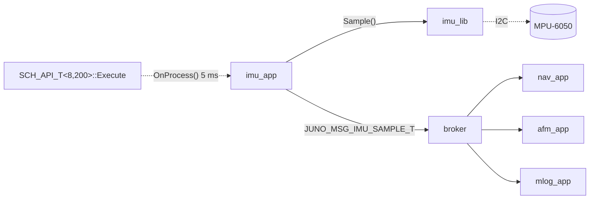
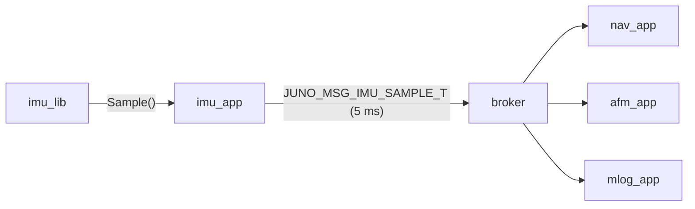
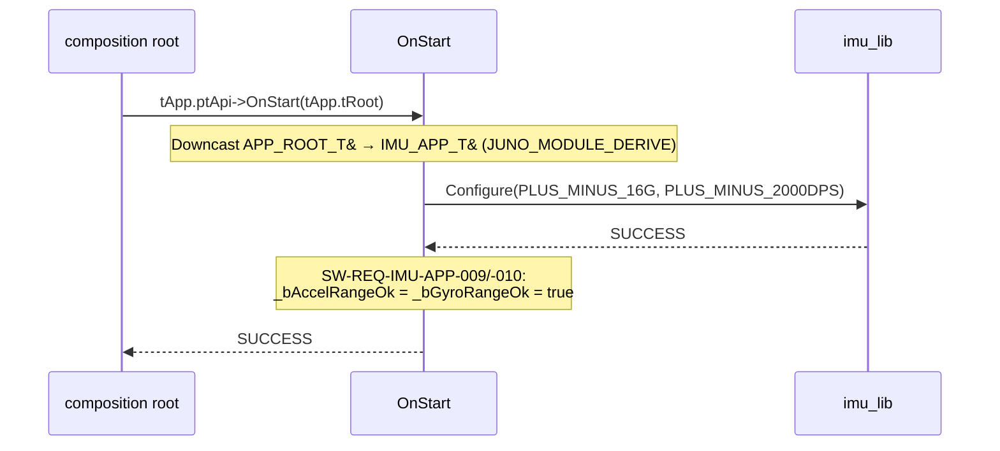
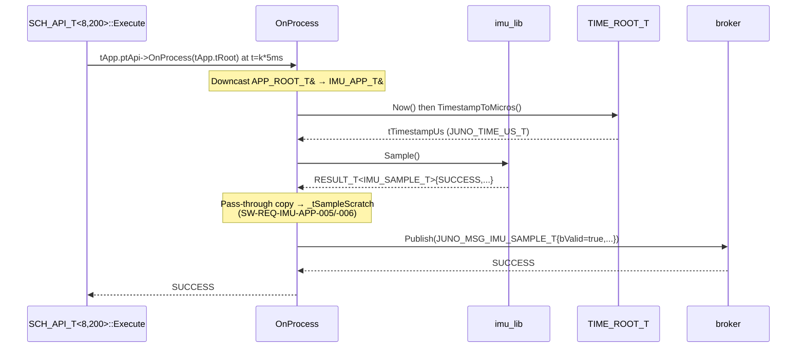

# IMU App — Software Design Description (L2)

**Document type:** IEEE 1016 Software Design Description
**Module:** `imu_app` (View / App layer)
**Header path:** `apps/imu_app/include/imu_app/imu_app.hpp`
**Source path:** `apps/imu_app/src/imu_app.cpp`
**Authoritative references:** `docs/design/conventions.md`, `docs/design/system/system_design.md`, `libjuno/include/juno/app/app_api.hpp`.
**Requirements covered:** `SW-REQ-IMU-APP-001` through `SW-REQ-IMU-APP-010`.

---

<!-- @{"design": ["SW-REQ-IMU-APP-001", "SW-REQ-IMU-APP-002", "SW-REQ-IMU-APP-003", "SW-REQ-IMU-APP-005"]} -->
## 1. Purpose and Scope

L2 design for the `imu_app` View-layer application. Addresses every
requirement in `docs/requirements/imu_app/requirements.json`
(`SW-REQ-IMU-APP-001` through `-010`). `imu_app` is a thin, deterministic,
pass-through adapter that, on every TDM tick at 200 Hz, requests one IMU
sample from `imu_lib`, attaches a monotonic-µs timestamp, and publishes a
`JUNO_MSG_IMU_SAMPLE_T` on the LibJuno bus.

`imu_app` exposes the canonical LibJuno lifecycle from
`libjuno/include/juno/app/app_api.hpp`: `APP_API_T { OnStart, OnProcess,
OnExit }` with a `APP_ROOT_T` aggregate at the public boundary. There is
**no** parallel `IMU_APP_ROOT_T` and **no** bespoke `IMU_APP_API_T`; the
only first-party type at this seam is `IMU_APP_T`, with
`juno::app::APP_ROOT_T tRoot;` as its first member (`conventions.md` §1.4).

**In scope:** the `IMU_APP_T` aggregate, its three lifecycle hooks, the
free `ImuAppInit()` setup function, the published bus messages, per-tick
timing within the system's tightest 5 ms slot, error handling, memory
ownership.

**Out of scope:** I2C register sequences and MPU-6050 register-level details
(`imu_lib`, FLAG-4 closure 2026-05-03); nav-state (`nav_app`/`nav_lib`);
AFM phase (`afm_app`/`afm_lib`). The app has **no business logic**; per-cycle
work delegates to `imu_lib` (`SW-REQ-IMU-APP-005`).

---

## 2. Definitions and Abbreviations

Cross-module vocabulary (time base, body axes, status semantics, message
naming, scheduler period units, app lifecycle) is defined in
`conventions.md` §4 and §1.4 and **not redefined here**.

| Term | Meaning |
|------|---------|
| `imu_app` | View-layer app at `apps/imu_app/`. |
| `imu_lib` | Controller-layer MPU-6050 driver (`docs/design/imu/design.md`). |
| `IMU_APP_T` | First-party app aggregate in `juno::imu_app`; first member is `APP_ROOT_T tRoot`. |
| `APP_ROOT_T` / `APP_API_T` | Canonical LibJuno application types (`libjuno/include/juno/app/app_api.hpp`). |
| `IMU_LIB_ROOT_T` | Public root of `imu_lib`, injected at `ImuAppInit`. |
| `BROKER_ROOT_T<...>` | LibJuno templated broker root. **TODO (alias):** FT1 instantiation `juno::sb::BROKER_ROOT_T<JUNO_MSG_BUS_VARIANT_T, 8, 64>` should receive a project alias (e.g., `FT1_BROKER_ROOT_T`) pending a Lead-approved type-alias workstream. |
| `JUNO_MSG_IMU_SAMPLE_T` | Per-cycle bus message; `libs/imu_lib/include/imu_lib/imu_msg.hpp`. |
| `kImuAppPeriodMs` | `5` ms (200 Hz) compile-time constant (`conventions.md` §4.5). |

---

<!-- @{"design": ["SW-REQ-IMU-APP-001", "SW-REQ-IMU-APP-002", "SW-REQ-IMU-APP-003", "SW-REQ-IMU-APP-007"]} -->
## 3. System Overview

### 3.1 MVC layer mapping

| Layer | Realization |
|-------|-------------|
| View (App) | `juno::imu_app::IMU_APP_T` (embeds `juno::app::APP_ROOT_T tRoot`); exposes `OnStart`/`OnProcess`/`OnExit` via canonical `APP_API_T`; no business logic. |
| Controller (Lib) | `juno::imu::IMU_LIB_ROOT_T` — provides `PowerOnSelfTest`, `Configure`, `Sample`, `Health`. |
| Model (Bus) | `juno::sb::BROKER_ROOT_T<JUNO_MSG_BUS_VARIANT_T, 8, 64>` — routes `JUNO_MSG_IMU_SAMPLE_T`. |

### 3.2 Module-in-context



Scheduler dispatches via `tRoot.ptApi->OnProcess(tRoot)` through the
`APP_ROOT_T` reference at `SCH_ROOT_T<8, 200>::tArrSchTable[i][0]` for every
`i ∈ [0, 200)` (`system_design.md` §8.1).

### 3.3 Header layout (LibJuno canonical app pattern)

Per `conventions.md` §1.4, `juno::app::APP_ROOT_T` is the **first member**
of `IMU_APP_T`. The three lifecycle functions (`ImuApp_OnStart`,
`ImuApp_OnProcess`, `ImuApp_OnExit`) are static functions in `juno::imu_app`
taking `juno::app::APP_ROOT_T &` and returning `JUNO_STATUS_T`; they are
wired into a function-scope `static const APP_API_T tApi { ... }` inside
`ImuAppInit()` — the only file-scope datum (§10). `IMU_APP_T` is trivially
constructible (`conventions.md` §1.3); all functions `noexcept`; no
`virtual`, no `new`/`delete`/`malloc`, no exceptions, no RTTI.

```cpp
// apps/imu_app/include/imu_app/imu_app.hpp (sketch)
namespace juno::imu_app
{
static constexpr uint32_t kImuAppPeriodMs = 5;   // 200 Hz

struct IMU_APP_T
{
    juno::app::APP_ROOT_T                                      tRoot;            // canonical first member
    juno::imu::IMU_LIB_ROOT_T                                 *_ptImuLib;        // injected at ImuAppInit
    juno::sb::BROKER_ROOT_T<JUNO_MSG_BUS_VARIANT_T, 8, 64>    *_ptBus;
    juno::time::TIME_ROOT_T                                   *_ptTime;
    JUNO_MSG_IMU_SAMPLE_T                                      _tSampleScratch;  // per-tick scratch (§6)
    bool                                                       _bAccelRangeOk;   // SW-REQ-IMU-APP-009
    bool                                                       _bGyroRangeOk;    // SW-REQ-IMU-APP-010
};

JUNO_STATUS_T ImuAppInit(
    IMU_APP_T &tApp,
    juno::imu::IMU_LIB_ROOT_T &tImuLib,
    juno::sb::BROKER_ROOT_T<JUNO_MSG_BUS_VARIANT_T, 8, 64> &tBus,
    juno::time::TIME_ROOT_T &tTime,
    JUNO_FAILURE_HANDLER_T pfcnFailureHandler,
    JUNO_USER_DATA_T *pvUserData
) noexcept;
} // namespace juno::imu_app
```

---

<!-- @{"design": ["SW-REQ-IMU-APP-001", "SW-REQ-IMU-APP-002", "SW-REQ-IMU-APP-003", "SW-REQ-IMU-APP-004", "SW-REQ-IMU-APP-005", "SW-REQ-IMU-APP-007", "SW-REQ-IMU-APP-009", "SW-REQ-IMU-APP-010"]} -->
## 4. Interface Definitions

`imu_app` exposes one free function (`ImuAppInit`) plus three canonical
lifecycle hooks dispatched by `juno::sch::SCH_API_T<8, 200>::Execute()`
through the `APP_API_T` vtable wired by `ImuAppInit`. Hooks are static
functions taking `juno::app::APP_ROOT_T &` (the **canonical** LibJuno type)
— never `IMU_APP_T &`. Each hook recovers the enclosing `IMU_APP_T` via
`JUNO_MODULE_DERIVE` downcast (`conventions.md` §1.2). All hooks are
`noexcept` and return `JUNO_STATUS_T`.

### 4.1 `ImuAppInit` — free function (composition-root setup)

<!-- @{"design": ["SW-REQ-IMU-APP-009", "SW-REQ-IMU-APP-010"]} -->

| Attribute | Value |
|-----------|-------|
| Signature | `JUNO_STATUS_T ImuAppInit(IMU_APP_T &tApp, juno::imu::IMU_LIB_ROOT_T &tImuLib, juno::sb::BROKER_ROOT_T<JUNO_MSG_BUS_VARIANT_T, 8, 64> &tBus, juno::time::TIME_ROOT_T &tTime, JUNO_FAILURE_HANDLER_T pfcnFailureHandler, JUNO_USER_DATA_T *pvUserData) noexcept` |
| Preconditions | `tImuLib` constructed via `imu_lib::IMU_LIB_IMPL_T::New()`; `tBus` (broker) constructed; `tTime` initialized via `juno::time::TimeInit(...)`. Called once before scheduler `Execute()`. |
| Postconditions | `tApp._ptImuLib`, `tApp._ptBus`, `tApp._ptTime` populated; function-scope `static const juno::app::APP_API_T tApi { &ImuApp_OnStart, &ImuApp_OnProcess, &ImuApp_OnExit }` wired into `tApp.tRoot` via `juno::app::AppInit(tApp.tRoot, tApi, pfcnFailureHandler, pvUserData)`. Range configuration is performed in `OnStart` (§4.2), not here. |
| Error conditions | Returns `JUNO_STATUS_NULLPTR_ERROR` via `JUNO_ASSERT_EXISTS` on `tApp.tRoot.ptApi` after `AppInit` if wiring fails; otherwise `JUNO_STATUS_SUCCESS`. |
| Side effects | None on the bus. |

The composition root then places `&tApp.tRoot` into every
`juno::sch::SCH_ROOT_T<8, 200>::tArrSchTable[i][0]` slot for `i ∈ [0, 200)`
(every 5 ms minor frame), giving `kImuAppPeriodMs = 5` cadence
(`system_design.md` §8.1, `conventions.md` §4.5).

### 4.2 `ImuApp_OnStart` contract — `SW-REQ-IMU-APP-009`, `SW-REQ-IMU-APP-010`

<!-- @{"design": ["SW-REQ-IMU-APP-009", "SW-REQ-IMU-APP-010"]} -->

| Attribute | Value |
|-----------|-------|
| Signature | `static JUNO_STATUS_T ImuApp_OnStart(juno::app::APP_ROOT_T &tApp) noexcept` |
| Dispatch | Called once by the composition root via `tApp.ptApi->OnStart(tApp)` after `ImuAppInit` returns, before scheduler `Execute()` (`system_design.md` §8.1, step 6). |
| Preconditions | `ImuAppInit()` returned `SUCCESS`; `tApp` is the `APP_ROOT_T` embedded in an `IMU_APP_T`. |
| Postconditions | Function recovers enclosing `IMU_APP_T` via `JUNO_MODULE_DERIVE` downcast, then calls `imu_lib::Configure(*_ptImuLib, IMU_ACCEL_RANGE_T::PLUS_MINUS_16G, IMU_GYRO_RANGE_T::PLUS_MINUS_2000DPS)` once. On `SUCCESS`: `_bAccelRangeOk = _bGyroRangeOk = true`. Successful return is the per-spec acceptance evidence for `SW-REQ-IMU-APP-009` (±16 G) and `SW-REQ-IMU-APP-010` (±2000 dps). |
| Error conditions | If `Configure` returns non-`SUCCESS`, `OnStart` propagates the status; `_bAccelRangeOk` / `_bGyroRangeOk` remain `false`; composition root marks IMU unhealthy in the POST bitmap (`SW-REQ-SYS-029`/`-030`). |

`imu_lib` has no range accessors. `OnStart` **verifies** ranges through the
success-of-`Configure` contract (`imu_lib` design §4.2). `PowerOnSelfTest`
is invoked at POST time by the composition root before `ImuAppInit`
(`system_design.md` §8.1).

### 4.3 `ImuApp_OnProcess` contract — `SW-REQ-IMU-APP-001` through `-008`

<!-- @{"design": ["SW-REQ-IMU-APP-001", "SW-REQ-IMU-APP-002", "SW-REQ-IMU-APP-003", "SW-REQ-IMU-APP-004", "SW-REQ-IMU-APP-005", "SW-REQ-IMU-APP-006", "SW-REQ-IMU-APP-007", "SW-REQ-IMU-APP-008"]} -->

| Attribute | Value |
|-----------|-------|
| Signature | `static JUNO_STATUS_T ImuApp_OnProcess(juno::app::APP_ROOT_T &tApp) noexcept` |
| Dispatch | Called by `juno::sch::SCH_API_T<8, 200>::Execute()` every 5 ms minor frame via `tApp.ptApi->OnProcess(tApp)`. |
| Preconditions | `OnStart` returned `SUCCESS`; `tApp` is the `APP_ROOT_T` embedded in an `IMU_APP_T`. |
| Postconditions | After downcast: exactly one `imu_lib::Sample` call; one `JUNO_MSG_IMU_SAMPLE_T` published with monotonic-µs timestamp from `_ptTime->TimestampToMicros(_ptTime->ptApi->Now(*_ptTime).tOk).tOk` (`SW-REQ-IMU-APP-004`, `conventions.md` §4.2 lessons-learned 2026-05-03), accel/gyro in body X-fwd/Y-right/Z-down (`SW-REQ-IMU-APP-006`), `bValid` (`SW-REQ-IMU-APP-007`). On success `bValid=true`; on read failure `bValid=false`. Payload is the unmodified library sample — no filtering, no integration (`SW-REQ-IMU-APP-005`). |
| Error conditions | Returns `SUCCESS` even on sample failure; failure observable via `bValid=false`. Failure handler invoked by `imu_lib` is **diagnostic only** (`conventions.md` §4.3). Schedule never altered. |
| Determinism | Identical library inputs → identical published bytes (`SW-REQ-IMU-APP-008`); no FP reduction, no time-dependent branching. |

### 4.4 `ImuApp_OnExit` contract

<!-- @{"design": ["SW-REQ-IMU-APP-002"]} -->

`static JUNO_STATUS_T ImuApp_OnExit(juno::app::APP_ROOT_T &tApp) noexcept`
— called on graceful shutdown (POSIX unit tests and Trick SITL only); on
Pico2 flight FSW never returns from `Execute()` (`SW-REQ-SYS-047`) so this
hook never executes. No bus side effects; no library teardown (memory is
caller-owned, §10). Returns `SUCCESS`.

### 4.5 Composition-root aggregate-init pattern

```cpp
namespace juno::imu_app
{
static JUNO_STATUS_T ImuApp_OnStart  (juno::app::APP_ROOT_T &tApp) noexcept;
static JUNO_STATUS_T ImuApp_OnProcess(juno::app::APP_ROOT_T &tApp) noexcept;
static JUNO_STATUS_T ImuApp_OnExit   (juno::app::APP_ROOT_T &tApp) noexcept;

JUNO_STATUS_T ImuAppInit(
    IMU_APP_T &tApp,
    juno::imu::IMU_LIB_ROOT_T &tImuLib,
    juno::sb::BROKER_ROOT_T<JUNO_MSG_BUS_VARIANT_T, 8, 64> &tBus,
    juno::time::TIME_ROOT_T &tTime,
    JUNO_FAILURE_HANDLER_T pfcnFailureHandler,
    JUNO_USER_DATA_T *pvUserData
) noexcept
{
    tApp._ptImuLib = &tImuLib;
    tApp._ptBus    = &tBus;
    tApp._ptTime   = &tTime;
    static const juno::app::APP_API_T tApi {
        &ImuApp_OnStart, &ImuApp_OnProcess, &ImuApp_OnExit
    };
    return juno::app::AppInit(tApp.tRoot, tApi, pfcnFailureHandler, pvUserData);
}
} // namespace juno::imu_app
```

`&tApp.tRoot` (an `APP_ROOT_T*`) slots into
`juno::sch::SCH_ROOT_T<8, 200>::tArrSchTable[i][0]` for every `i ∈ [0, 200)`
(`system_design.md` §8.1). The static `tApi` is the translation unit's only
file-scope datum (§10).

### 4.6 Trick integration

The composition root selects `IMU_LIB_IMPL_T` POSIX impl under Trick
(`conventions.md` §6); the `imu_app` API surface is identical across
POSIX, Trick SITL, and Pico2. No Trick-specific code lives in the app.

---

<!-- @{"design": ["SW-REQ-IMU-APP-001", "SW-REQ-IMU-APP-002", "SW-REQ-IMU-APP-007"]} -->
## 5. State Machines

Minimal three-state machine driven by the lifecycle hooks. `OnStart` is the
Uninitialized→Running edge; `OnProcess` is the per-tick body; `OnExit` is a
no-op terminal edge (never fires on Pico2 flight, `SW-REQ-SYS-047`).

```mermaid
stateDiagram-v2
    [*] --> Uninitialized: .bss zero-init at power-on
    Uninitialized --> Running: OnStart — Configure() SUCCESS (SW-REQ-IMU-APP-009/-010)
    Uninitialized --> Degraded: OnStart — Configure() returns non-SUCCESS
    Running --> Running: OnProcess — Sample SUCCESS, publish bValid=true
    Running --> Degraded: OnProcess — Sample read failure (SW-REQ-IMU-APP-007)
    Degraded --> Running: OnProcess — Sample SUCCESS, publish bValid=true
    Degraded --> Degraded: OnProcess — Sample read failure, publish bValid=false
    Running --> [*]: OnExit (POSIX/Trick only; never on Pico2)
    Degraded --> [*]: OnExit (POSIX/Trick only; never on Pico2)
```



State semantics: **Uninitialized** is the `.bss` zero state before
`ImuAppInit` + `OnStart` (`OnProcess` must not be called here).
**Running** is steady state — each tick samples, timestamps, publishes
`bValid=true` (current-tick outcome, not latched). **Degraded** means the
latest sample read failed; published `bValid=false` (`SW-REQ-IMU-APP-007`,
`SW-REQ-SYS-058`); schedule **not altered** (`SW-REQ-SYS-033`); next tick
attempts recovery. The state is not exposed as an enum — it is fully
recoverable from per-message `bValid` and `imu_lib::Health()` (consumed by
`sys_app`).

---

<!-- @{"design": ["SW-REQ-IMU-APP-002", "SW-REQ-IMU-APP-003", "SW-REQ-IMU-APP-005", "SW-REQ-IMU-APP-006", "SW-REQ-IMU-APP-007"]} -->
## 6. Data Flow

### 6.1 Topology and published messages



| Type | Period | Subscribers | Notes |
|------|--------|-------------|-------|
| `JUNO_MSG_IMU_SAMPLE_T` | 5 ms | `nav_app`, `afm_app`, `mlog_app` | POD; `tTimestampUs` first; `tAccel[3]` (m/s²) and `tGyro[3]` (rad/s) in X-fwd/Y-right/Z-down (`SW-REQ-IMU-APP-006`); `bValid` reflects per-cycle outcome (`SW-REQ-IMU-APP-007`). |

**Per-cycle health (`SW-REQ-IMU-APP-007`).** `bValid` IS the per-cycle
health observable, published every 5 ms. No separate health message, no
internal accumulator. `sys_app` folds `bValid` into
`JUNO_MSG_SYS_HEALTH_T.u32HealthBitmap` (`SW-REQ-SYS-031`).

### 6.2 Subscribed messages

**None.** Pure publisher (`system_design.md` §4 catalog).

### 6.3 Pass-through guarantee

Per `SW-REQ-IMU-APP-005`, `tAccel`/`tGyro` are the **unmodified** library
sample — no filtering, scaling, integration, or unit conversion. Units
(m/s², rad/s, `SW-REQ-IMU-004`/`-005`) and frame (`SW-REQ-IMU-007`) come
from `imu_lib`.

### 6.4 Buffer ownership

Payload built into `_tSampleScratch` (POD member); broker copies on
`Publish()`; subscribers receive an immutable view (`conventions.md` §5
rule 6). Scratch reused next tick.

---

<!-- @{"design": ["SW-REQ-IMU-APP-001", "SW-REQ-IMU-APP-002", "SW-REQ-IMU-APP-003", "SW-REQ-IMU-APP-004", "SW-REQ-IMU-APP-007", "SW-REQ-IMU-APP-009", "SW-REQ-IMU-APP-010"]} -->
## 7. Sequence Diagrams

### 7.1 `OnStart` once-only sequence (range configuration)



### 7.2 Nominal `OnProcess` cycle (TDM tick → Sample → Publish)



### 7.3 `OnProcess` sample-read-failure cycle

```mermaid
sequenceDiagram
    participant sch as SCH_API_T<8,200>::Execute
    participant imu_app as OnProcess
    participant imu_lib
    participant broker

    sch->>imu_app: tApp.ptApi->OnProcess(tApp.tRoot)
    imu_app->>imu_lib: Sample()
    imu_lib-->>imu_app: RESULT_T<...>{READ_ERROR, bValid=false}
    Note over imu_app: SW-REQ-IMU-APP-007: bValid=false IS<br/>per-cycle health; handler is diagnostic-only.
    imu_app->>broker: Publish(JUNO_MSG_IMU_SAMPLE_T{bValid=false,...})
    broker-->>imu_app: SUCCESS
    imu_app-->>sch: SUCCESS
```

---

<!-- @{"design": ["SW-REQ-IMU-APP-001", "SW-REQ-IMU-APP-008"]} -->
## 8. Timing and Scheduling Analysis

### 8.1 Period and budget

| Parameter | Value | Source |
|-----------|-------|--------|
| Period | `kImuAppPeriodMs = 5` ms (200 Hz) | `conventions.md` §4.5; `SW-REQ-SYS-005` |
| Slot membership | every minor frame `i ∈ [0, 200)` of `SCH_ROOT_T<8, 200>` (offsets `0, 5, ..., 995` ms) | `system_design.md` §8.2 |
| Worst-case `OnProcess` | < 1.0 ms (target ≤ 500 µs) | `system_design.md` §8.2 |
| Hard deadline | Must complete within 5 ms or the next tick is missed | `SW-REQ-SYS-010`, `SW-REQ-SYS-044` |

5 ms is **the tightest period in the system**. On t=0 hyperperiod ticks
all eight apps may co-dispatch (`system_design.md` §8.2); `OnProcess` must
complete well under 5 ms.

### 8.2 Per-cycle work

| Step | Operation | Cost |
|------|-----------|------|
| 1 | `Now()` + `TimestampToMicros()` | O(1) syscall (POSIX) / HW timer (Pico2) |
| 2 | `imu_lib::Sample()` (single I2C burst) | O(1); dominates on Pico2 |
| 3 | Memcpy sample → `_tSampleScratch` | O(1), < 64 bytes |
| 4 | `broker::Publish()` | O(1) per subscriber (≤ 3) |

No loops, no allocation, no exception unwinding, no virtual dispatch.

### 8.3 Downstream consumers

| Consumer | Period | Effect of overrun |
|----------|--------|--------------------|
| `nav_app` | 10 ms | Misses one IMU sample → degraded nav rate |
| `afm_app` | 10 ms | Degraded phase classifier inputs |
| `mlog_app` | 5 ms | Drops one SD-log sample (violates `SW-REQ-SYS-011`) |

A missed tick impacts three downstream apps at once; 5 ms is a hard
deadline.

### 8.4 Determinism

Per `SW-REQ-IMU-APP-008` / `SW-REQ-SYS-044`: identical library samples →
identical published bytes. No FP reduction, no time-dependent branching
beyond the timestamp, no dynamic dispatch.

---

<!-- @{"design": ["SW-REQ-IMU-APP-007", "SW-REQ-IMU-APP-009", "SW-REQ-IMU-APP-010"]} -->
## 9. Error Handling Strategy

System-wide error pattern (`conventions.md` §4.3, `system_design.md` §9).
No exceptions (`-fno-exceptions`); every function `noexcept`.

| Condition | Detection | Observable side effect | Schedule impact |
|-----------|-----------|------------------------|-----------------|
| `Sample()` read failure | `RESULT_T<...>{!= SUCCESS}` from `imu_lib` | Published `bValid=false` (`SW-REQ-IMU-APP-007`); `imu_lib` failure handler writes a diagnostic log. | None — `OnProcess` returns SUCCESS (`SW-REQ-SYS-033`). |
| `Sample()` recovery | First successful `Sample()` after a failure | `bValid=true` resumes. | None. |
| `Configure()` failure at `OnStart` | non-`SUCCESS` from `imu_lib::Configure` | `OnStart` propagates status; `_bAccelRangeOk`/`_bGyroRangeOk` remain `false`; composition root marks POST bit (`SW-REQ-SYS-029`/`-030`). | Composition continues; subscribers see `SYS_HEALTH` bit. |
| `Publish()` failure | non-`SUCCESS` from broker | Diagnostic log via failure handler; `OnProcess` still SUCCESS. | None. |
| Missing dep at `ImuAppInit` | `JUNO_ASSERT_EXISTS` on `_ptImuLib`/`_ptBus`/`_ptTime` | Returns `JUNO_STATUS_NULLPTR_ERROR`; composition root halts. | n/a — caught at boot. |

**Idiom.** `JUNO_ASSERT_EXISTS` / `JUNO_ASSERT_OK` / `JUNO_ASSERT_SUCCESS`
(`conventions.md` §4.3); bare `if`-return forbidden. **Failure handlers
diagnostic-only:** `imu_lib`'s handler (injected at `New()` time, points at
`log_lib`) never alters control flow (`SW-REQ-SYS-037`/`-053`); `imu_app`
installs no handler of its own. **Health bitmap:** `sys_app` aggregates
`bValid` + `imu_lib::Health()` into
`JUNO_MSG_SYS_HEALTH_T.u32HealthBitmap` (`SW-REQ-SYS-031`); the per-cycle
`bValid` flag satisfies `SW-REQ-IMU-APP-007` (§6.1).

---

<!-- @{"design": ["SW-REQ-IMU-APP-002", "SW-REQ-IMU-APP-003"]} -->
## 10. Memory Ownership

Per `conventions.md` §5: caller-owned; no heap; no global mutable state.

| Buffer / facility | Owner | Storage |
|-------------------|-------|---------|
| `IMU_APP_T` (embeds `APP_ROOT_T tRoot`) | Composition root (`apps/main.cpp`) | Static `.bss`, program lifetime |
| `_ptImuLib`, `_ptBus`, `_ptTime` | Composition root (refs) | POD members of `IMU_APP_T` |
| `_tSampleScratch` (`JUNO_MSG_IMU_SAMPLE_T`) | `imu_app` | POD member, reused every tick |
| `_bAccelRangeOk`, `_bGyroRangeOk` | `imu_app` | POD members |
| `static const APP_API_T tApi` | `ImuAppInit()` function-scope `static` | Read-only after wiring; program lifetime |
| Published `JUNO_MSG_IMU_SAMPLE_T` | Broker (copies on publish; immutable subscriber view) | Broker's static pool |

Invariants:

- **`static const APP_API_T tApi` inside `ImuAppInit` is the only
  file-scope datum** in `apps/imu_app/src/imu_app.cpp`
  (`conventions.md` §5 rule 3); read-only after construction.
- **No `new`/`delete`/`malloc`/`calloc`/`realloc`/`free`** (`SW-REQ-SYS-050`).
- **No ctor/dtor** on `IMU_APP_T` or embedded `APP_ROOT_T`
  (`conventions.md` §1.3); `.bss` zero-init safe.
- **No heap-backed STL containers**.
- **All deps injected at `ImuAppInit` by reference** — lifetime to power-off
  (`SW-REQ-SYS-047`).
- **POSIX/Pico2 equivalence** (`SW-REQ-SYS-043`): only injected
  `IMU_LIB_ROOT_T &` impl differs.

---

## 11. Traceability

Per-section `<!-- @{"design": [...]} -->` tags above are authoritative;
this table is descriptive consolidation.

| Req ID | Title | Section(s) |
|--------|-------|-----------|
| SW-REQ-IMU-APP-001 | IMU App Execution Rate (200 Hz) | §1, §3, §4.3, §5, §7.2, §8.1 |
| SW-REQ-IMU-APP-002 | IMU Sample Read Per Cycle | §1, §3, §4.3, §4.4, §5, §7.2, §10 |
| SW-REQ-IMU-APP-003 | IMU Message Publication | §1, §3, §4.3, §6.1, §7.2, §10 |
| SW-REQ-IMU-APP-004 | Monotonic Timestamp on IMU Message | §4.3, §7.2 |
| SW-REQ-IMU-APP-005 | Pass-Through Sample Content | §1, §4.3, §6.3, §7.2 |
| SW-REQ-IMU-APP-006 | Body-Frame Axis Convention | §4.3, §6.1, §6.3, §7.2 |
| SW-REQ-IMU-APP-007 | IMU Health Publication | §3, §4.3, §5, §6.1, §7.3, §9 |
| SW-REQ-IMU-APP-008 | Deterministic IMU App Behavior | §4.3, §8.4 |
| SW-REQ-IMU-APP-009 | Accelerometer Range Verification | §4.1, §4.2, §7.1, §9 |
| SW-REQ-IMU-APP-010 | Gyroscope Range Verification | §4.1, §4.2, §7.1, §9 |

**POSIX/Pico2 equivalence (`SW-REQ-SYS-043`):** source identical; only the
`IMU_LIB_ROOT_T` impl differs (POSIX/Pico2 under `libs/imu_lib/src/`); Trick
SITL (`SW-REQ-SYS-045`) uses POSIX. `APP_API_T` wired by `ImuAppInit` is
identical across builds.

**Cross-module:** `kImuAppPeriodMs` (`conventions.md` §4.5);
`APP_ROOT_T`/`APP_API_T`/`AppInit` (`libjuno/include/juno/app/app_api.hpp`,
`conventions.md` §1.4); `SCH_ROOT_T<8, 200>` / `SCH_API_T<8, 200>::Execute`
(`system_design.md` §3.3, §8.1); `BROKER_ROOT_T<JUNO_MSG_BUS_VARIANT_T, 8, 64>`
(alias TODO, §2); `JUNO_MSG_IMU_SAMPLE_T` (`system_design.md` §4); body axes
(`SW-REQ-SYS-057`); µs via `tTime.TimestampToMicros(tTime.ptApi->Now(tTime).tOk).tOk`
(`conventions.md` §4.2, lessons-learned 2026-05-03); health bitmap
(`SW-REQ-SYS-031`); composition root (`system_design.md` §8.1).
