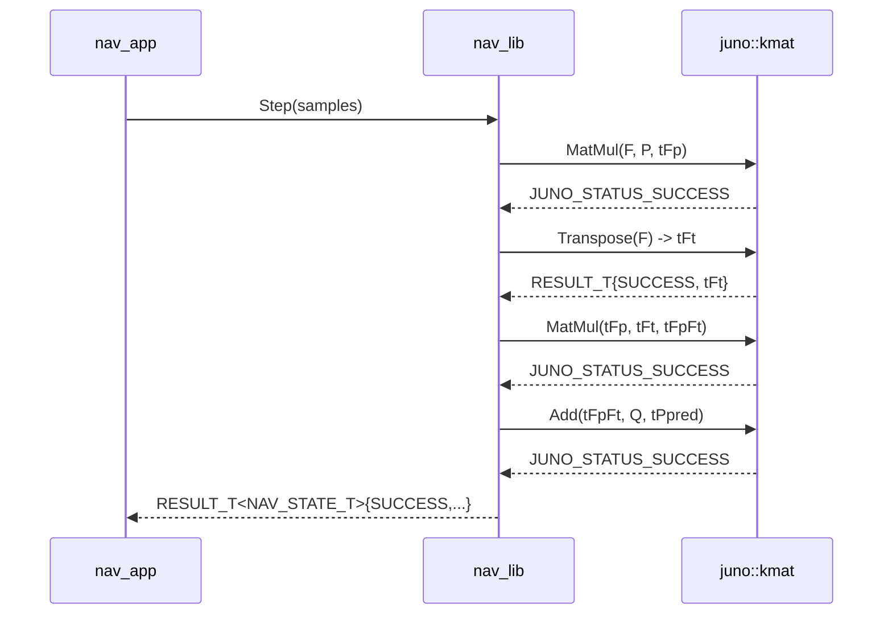

# kmat_lib — §5–§11 (State Machines through Traceability)

**Parent:** [`index.md`](./index.md)
**Module:** `kmat_lib`
**Namespace:** `juno::kmat`
**Revision:** B (2026-05-04 — `MAT_T` storage member renamed `tData` → `arr` and `kPivotEpsilon<T>` function-template note in §10, aligned with `04_interface.md` REV B layering on `juno::math`)

This file holds sections §5 through §11 of the IEEE 1016 design. Sections
§1–§3 are in [`index.md`](./index.md); section §4 is in
[`04_interface.md`](./04_interface.md).

---

## 5. State Machines

**No internal state machine; module is functionally pure given inputs.**

Every operation is a function of its arguments only (`SW-REQ-KMAT-009`
deterministic numeric results). No member of any `MAT_T<R,C>` instance
persists across calls beyond the caller's own storage. There is no `New()`
factory, no `Init()`, no `Deinit()` — the library has no lifecycle.

---

<!-- @{"design": ["SW-REQ-KMAT-001", "SW-REQ-KMAT-008"]} -->
## 6. Data Flow

`kmat_lib` does **not** touch the software bus. It publishes no messages,
subscribes to no messages, and is unknown to the broker
(`docs/design/conventions.md` §4.4). Data flows in and out of `kmat_lib`
exclusively through function parameters and return values, owned by the
caller's stack or static storage.

```
caller-owned MAT_T<T,R,C> tA       ──┐
caller-owned MAT_T<T,R,C> tB       ──┼─► juno::kmat::Op(...) ──► caller-owned tOut / RESULT_T<MAT_T<...>>
                                      │
                                  (no globals,
                                   no bus,
                                   no I/O)
```

There is no message catalog entry for `kmat_lib`. `system_design.md` §4
correctly omits it.

---

<!-- @{"design": ["SW-REQ-KMAT-002", "SW-REQ-KMAT-006", "SW-REQ-KMAT-007", "SW-REQ-KMAT-009"]} -->
## 7. Sequence Diagrams

### 7.1 Nominal — nav covariance update (success path)



### 7.2 Error path — singular innovation covariance during Kalman gain

```mermaid
sequenceDiagram
    participant nav_lib
    participant kmat as juno::kmat

    nav_lib->>kmat: Invert(tS)
    Note over kmat: LU partial pivoting<br/>pivot < kPivotEpsilon
    kmat-->>nav_lib: RESULT_T{JUNO_FSW_STATUS_NUMERIC_ERROR, undef}
    Note over nav_lib: SW-REQ-KMAT-007: caller<br/>uses JUNO_ASSERT_OK to skip<br/>this update step;<br/>NAV_STATE.bValid=false<br/>per SW-REQ-NAV-012.
```

The singular-matrix path returns to the caller as a normal status; no
exception is thrown (`SW-REQ-KMAT-015`), no global state is set, no failure
handler is invoked from inside `kmat_lib` (the caller decides whether the
condition is fatal — `kmat_lib` has no failure-handler injection because
it has no `New()`).

---

<!-- @{"design": ["SW-REQ-KMAT-002", "SW-REQ-KMAT-009"]} -->
## 8. Timing and Scheduling Analysis

`kmat_lib` is not scheduled. It has no TDM period (`system_design.md` §3.3
lists `kmat_lib` with period `n/a`). Worst-case execution cost is bounded
by the cost of the operation invoked by the caller; the dominant case in
nav is:

| Operation | Worst-case shape (FT1 nav) | Approx flops |
|-----------|----------------------------|---------------|
| `MatMul<16,16,16,16>` | 16×16 by 16×16 | 8192 (2·R·C·K) |
| `Transpose<16,16>` | 16×16 in place / out-of-place | 256 (R·C reads + writes) |
| `Add<16,16>` / `Sub<16,16>` | 16×16 elementwise | 256 |
| `Scale<16,16>` | 16×16 elementwise | 256 |
| `Invert<6,6>` | 6×6 measurement covariance (LU) | ≈ 2·N³/3 ≈ 144 |

Total nav covariance update per 10 ms tick is dominated by a small constant
number of `MatMul<16,16,16,16>` calls (≈ tens of thousands of multiply-adds);
this fits well inside the 5 ms budget reserved for `nav_app` per
`system_design.md` §8.2 — kmat is not the bottleneck.

Determinism (`SW-REQ-KMAT-009`): every operation is straight-line code over
fixed array indices with no data-dependent branching except in `Invert`
(LU pivot selection — deterministic given input bytes). Compile-time
dimensions guarantee identical instruction sequences across runs.

Downstream consumers: only `nav_lib` (called from `nav_app::Execute()`
at 100 Hz, `system_design.md` §4 and §8). `afm_lib` does not consume
`kmat_lib` at FT1.

---

<!-- @{"design": ["SW-REQ-KMAT-007", "SW-REQ-KMAT-009", "SW-REQ-KMAT-011", "SW-REQ-KMAT-014", "SW-REQ-KMAT-015"]} -->
## 9. Error Handling Strategy

1. **Status propagation.** Every fallible op returns `RESULT_T<MAT_T<...>>`
   or `JUNO_STATUS_T`. Currently only `Invert` is fallible. Callers use
   `JUNO_ASSERT_OK(tResult, ...)` per `docs/design/conventions.md` §4.3.
2. **Singular matrix → `JUNO_FSW_STATUS_NUMERIC_ERROR`** (`SW-REQ-KMAT-007`).
   `Invert` does LU with partial pivoting; if pivot magnitude
   `< kPivotEpsilon<T>`, the function returns
   `juno::kmat::JUNO_FSW_STATUS_NUMERIC_ERROR` (FSW extension declared in
   §4.7 of [`04_interface.md`](./04_interface.md); offset
   `JUNO_STATUS_CUSTOM_ERROR + 1` per `conventions.md` §4.8) with `tOk`
   undefined. `kPivotEpsilon<float>` / `<double>` are `static constexpr`
   in `juno::kmat` (defaults `1e-12f` / `1e-30`; tuned in nav L2).
3. **No `throw`** (`SW-REQ-KMAT-015`). Every function `noexcept`;
   `-fno-exceptions` (project-wide `SW-REQ-SYS-053`) catches accidents
   at link time.
4. **No failure-handler injection.** No `New()`, no `JUNO_FAILURE_HANDLER_T`
   member. Diagnostic logging on numeric failure is the caller's job
   (`nav_lib` forwards via its own failure handler).
5. **No control-flow change beyond return value.** Per
   `docs/design/conventions.md` §4.3, failure handlers are diagnostic-only;
   `kmat_lib` has none — the returned status is the sole observable effect.
6. **No runtime polymorphism** (`SW-REQ-KMAT-011`). Every dispatch is a
   templated free function resolved at compile time; no `virtual`, no
   function-reference vtable.
7. **No RTTI** (`SW-REQ-KMAT-014`). No `dynamic_cast`, no `typeid`. Type
   info lives in template parameters at instantiation time.
8. **`static_assert` enforces structural invariants.** Dimension mismatches
   are **build errors**, not runtime errors — the C++ replacement for the
   C-pattern runtime length check (`docs/design/conventions.md` §2).
9. **Bare `if`-return forbidden** in implementations; the discipline
   applies primarily inside `Invert`'s pivot loop. Example asserts:
   `static_assert(C1 == R2, "MatMul: inner dimensions must match");`,
   `static_assert(R > 0, "MAT_T row count must be non-zero");`,
   `static_assert(std::is_floating_point<T>::value, "Invert requires float");`.

---

<!-- @{"design": ["SW-REQ-KMAT-008"]} -->
## 10. Memory Ownership

`kmat_lib` reaffirms `docs/design/conventions.md` §5 and `constraints.md`
("ZERO dynamic memory allocation"). The full ownership table:

| Buffer / facility | Owner | Lifetime | Allocation |
|-------------------|-------|----------|------------|
| `MAT_T<T,R,C>::arr[R*C]` | The caller declaring the `MAT_T` (nav_lib stack / static / member) | Caller-controlled scope | Static / stack — **no heap** |
| `RESULT_T<MAT_T<...>>` returned by value | Caller (RVO target) | Statement scope | Stack — by-value return into caller storage |
| Internal scratch in `Invert` | Local automatic `MAT_T<T,N,N>` for LU + permutation array | Function scope | Stack — no heap |
| Pivot epsilon constants | Namespace-scope `static constexpr T kPivotEpsilon<T>()` function template (REV B: function-template form for C++11 compatibility) | Program lifetime | Constant-folded at compile time; not mutable global state |

Asserted invariants (`SW-REQ-KMAT-008`):

1. **Caller owns all storage.** No allocator injected, none used
   internally. No `New()` — no state to own.
2. **No `new`/`delete`/`malloc`/`calloc`/`realloc`/`free`.** Verified by
   inspection (`SW-REQ-KMAT-008` is `Inspection`).
3. **No heap-backed STL containers** (`std::vector`, `std::valarray`,
   `std::array<T>` of variable extent, `std::string`). Storage is plain
   `T arr[R*C]` C-arrays per `docs/design/conventions.md` §1.3.
4. **No global mutable state** — only `static constexpr` numeric thresholds.
5. **No constructors / destructors on `MAT_T`.** Trivially constructible
   and destructible — safe in `.bss` zero-init.
6. **`Invert` scratch is on the stack.** Worst-case (6×6 nav measurement
   covariance) ≈ 336 B — well within budget.

---

## 11. Traceability

Per-section `<!-- @{"design": [...]} -->` tags above are authoritative; this
table is descriptive consolidation. Every `SW-REQ-KMAT-NNN` is mapped to at
least one section.

| Req ID | Title | Section(s) |
|--------|-------|-----------|
| SW-REQ-KMAT-001 | Fixed-Size Compile-Time Matrix Container | §1, §3, §4.1, §6 |
| SW-REQ-KMAT-002 | Matrix Multiplication | §1, §4.2.1, §7.1, §8 |
| SW-REQ-KMAT-003 | Matrix Transpose | §1, §4.2.2 |
| SW-REQ-KMAT-004 | Matrix Addition | §1, §4.2.3 |
| SW-REQ-KMAT-005 | Scalar Multiplication | §1, §4.2.5 |
| SW-REQ-KMAT-006 | Matrix Inversion | §1, §4.2.6, §7.1 |
| SW-REQ-KMAT-007 | Status Code on Non-Invertible Input | §1, §4.2.6, §7.2, §9 |
| SW-REQ-KMAT-008 | No Dynamic Memory Allocation | §1, §3, §6, §10 |
| SW-REQ-KMAT-009 | Deterministic Numeric Results | §5, §7, §8, §9 |
| SW-REQ-KMAT-010 | POSIX and Pico2 Numeric Equivalence | §1, §3.3, §11 (below) |
| SW-REQ-KMAT-011 | No Runtime Polymorphism | §1, §3, §9 |
| SW-REQ-KMAT-012 | Unit Test Line Coverage | §1 (out-of-scope for design; tests live with verification engineer) |
| SW-REQ-KMAT-013 | Matrix Subtraction | §1, §4.2.4 |
| SW-REQ-KMAT-014 | No Runtime Type Information | §1, §9 |
| SW-REQ-KMAT-015 | No Thrown Exceptions | §1, §4, §9 |

<!-- @{"design": ["SW-REQ-KMAT-010"]} -->
### POSIX / Pico2 equivalence statement (`SW-REQ-SYS-043`, `SW-REQ-KMAT-010`)

`kmat_lib` is header-only (§3.3); identical templates are compiled by
POSIX (x86_64) and Pico2 (ARM Cortex-M33) under matching
`-std=c++11 -fno-exceptions -fno-rtti -ffreestanding -fno-fast-math` flags.
Bit-identical numeric output is the design intent — strictly stronger than
`SW-REQ-SYS-043`'s functional-equivalence requirement.

### Consumer cross-references

| Consuming requirement | How kmat satisfies it |
|-----------------------|-----------------------|
| `SW-REQ-NAV-004` (16-state) | `MAT_T<T,16,16>` covariance, `MAT_T<T,16,1>` state |
| `SW-REQ-NAV-005` (100 Hz) | Straight-line ops; per-tick budget §8 |
| `SW-REQ-NAV-012` (bValid false) | Numeric-error status surfaces to `nav_lib` |
| `SW-REQ-NAV-013` (degraded inputs) | Stateless — caller skips update steps |
| `SW-REQ-NAV-015` (deterministic nav) | Inherits `SW-REQ-KMAT-009` |
| `SW-REQ-NAV-016` (POSIX/Pico2) | Inherits `SW-REQ-KMAT-010` |

---

## FLAGs raised

None. The brief, the requirements, and `docs/design/conventions.md` are
mutually consistent for this module.
