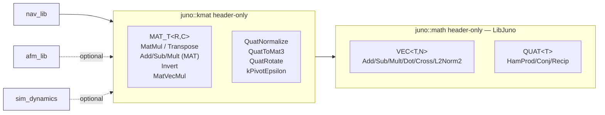

# kmat_lib — L2 Design

**Document type:** IEEE 1016 Software Design Description
**Module:** `kmat_lib` (kinematics layer of the FSW math stack)
**Header:** `libs/kmat_lib/include/kmat_lib/kmat_api.hpp` (+ `kmat_impl.hpp`)
**Namespace:** `juno::kmat`
**Authoritative cross-module reference:** `docs/design/conventions.md`
**Layered on:** `juno::math` (LibJuno) — `libjuno/include/juno/math/juno_math.hpp`
**Coverage:** `SW-REQ-KMAT-001` through `SW-REQ-KMAT-015`
**Revision:** B
**Effective date:** 2026-05-04
**Predecessor:** PDR Closure 2026-05-03 (Delta-PDR Remediation Sprint CE GO)

> **REV B 2026-05-04 amendment.** kmat is re-layered on `juno::math` for
> VEC/QUAT/primitive ops; kmat retains the kinematics-specific `MAT_T<T, R, C>`
> + matrix algebra + `QuatToMat3` / `QuatRotate` / `QuatNormalize` /
> `MatVecMul` + `kPivotEpsilon` + `juno::kmat::JUNO_FSW_STATUS_NUMERIC_ERROR`.
> Requirements (`SW-REQ-KMAT-001`..`-015`) are unchanged — they describe
> observable behaviors satisfied by the kmat-on-juno::math composition.

---

## Table of Contents

This design exceeds 500 lines and is split per `constraints.md` and
`docs/design/conventions.md` §7. The eleven IEEE 1016 sections are
distributed across the following files; section numbers and headings are
preserved verbatim.

| Section | File |
|---------|------|
| §1 Purpose and Scope | this file (below) |
| §2 Definitions and Abbreviations | this file (below) |
| §3 System Overview | this file (below) |
| §4 Interface Definitions | [`04_interface.md`](./04_interface.md) |
| §5 State Machines | [`05_through_11.md`](./05_through_11.md) |
| §6 Data Flow | [`05_through_11.md`](./05_through_11.md) |
| §7 Sequence Diagrams | [`05_through_11.md`](./05_through_11.md) |
| §8 Timing and Scheduling Analysis | [`05_through_11.md`](./05_through_11.md) |
| §9 Error Handling Strategy | [`05_through_11.md`](./05_through_11.md) |
| §10 Memory Ownership | [`05_through_11.md`](./05_through_11.md) |
| §11 Traceability | [`05_through_11.md`](./05_through_11.md) |

---

<!-- @{"design": ["SW-REQ-KMAT-001", "SW-REQ-KMAT-002", "SW-REQ-KMAT-003", "SW-REQ-KMAT-004", "SW-REQ-KMAT-005", "SW-REQ-KMAT-006", "SW-REQ-KMAT-007", "SW-REQ-KMAT-008", "SW-REQ-KMAT-009", "SW-REQ-KMAT-010", "SW-REQ-KMAT-011", "SW-REQ-KMAT-012", "SW-REQ-KMAT-013", "SW-REQ-KMAT-014", "SW-REQ-KMAT-015"]} -->
## 1. Purpose and Scope

`kmat_lib` is the **kinematics layer** of the FSW math stack. It layers on
top of LibJuno's primitive math module
(`libjuno/include/juno/math/juno_math.hpp`, namespace `juno::math`) for
N-D vector and quaternion primitive types and their core arithmetic, and
adds the matrix algebra and quaternion-attitude operations specific to
nav and control. The library addresses every requirement in
`docs/requirements/kmat/requirements.json` (`SW-REQ-KMAT-001` through
`SW-REQ-KMAT-015`); the requirements describe observable behaviors of the
kmat-on-juno::math composition.

**In scope (kmat-original additions):**

- `MAT_T<T, R, C>` — fixed-size, compile-time-dimensioned 2D matrix
  container (kmat-original; `juno::math` provides only N-D vectors).
- Matrix algebra over `MAT_T`:
  - `Add`, `Sub`, `Mult` (scalar) — separate `MAT_T` overloads, **not**
    collapsing the `juno::math` `VEC`/`QUAT` overloads (`SW-REQ-KMAT-004`,
    `SW-REQ-KMAT-013`, `SW-REQ-KMAT-005`).
  - `MatMul` — matrix-matrix product (`SW-REQ-KMAT-002`).
  - `Transpose` (`SW-REQ-KMAT-003`).
  - `MatVecMul` — `MAT_T<T,R,C>` × `juno::math::VEC<T,C>` →
    `juno::math::VEC<T,R>`.
- `Invert` — square-matrix inversion via LU partial pivoting; returns
  `juno::kmat::JUNO_FSW_STATUS_NUMERIC_ERROR` on a zero / underflow-bounded
  pivot (`SW-REQ-KMAT-006`, `SW-REQ-KMAT-007`).
- Quaternion-attitude kinematics:
  - `QuatNormalize` — unit-normalisation with status on near-zero
    magnitude (the helper `juno::math::Recip` does not provide).
  - `QuatToMat3` — Hamilton body→NED rotation matrix per
    `SW-REQ-SYS-041` (`docs/design/conventions.md` §4.6).
  - `QuatRotate` — rotates `juno::math::VEC<T, 3>` by
    `juno::math::QUAT<T>`.
- `kPivotEpsilon<T>()` — pivot / normalisation magnitude threshold,
  declared as a function template (C++11-compatible; avoids variable
  templates) with `<float>` and `<double>` specialisations.
- `juno::kmat::JUNO_FSW_STATUS_NUMERIC_ERROR` — FSW status extension
  (`JUNO_STATUS_CUSTOM_ERROR + 1`) per `docs/design/conventions.md`
  §4.8; the only fallible-mode code returned by this library.

**Re-exported from `juno::math` (kmat surface; see §3.4):**

- Types: `juno::math::VEC<T, N>`, `juno::math::QUAT<T>`, plus the aliases
  `Vec2f64`, `Vec3f64`, `Vec2f32`, `Vec3f32`, `Vec2i32`, `Vec3i32`,
  `Quatf64`, `Quatf32`.
- Vector ops: `Add`, `Sub`, `Mult` (vector × scalar), `Dot`, `Cross` (2D
  pseudoscalar + 3D vector), `L2Norm2`.
- Quaternion ops: `Add`, `Sub`, `Mult` (quaternion × scalar), `HamProd`,
  `Conj`, `L2Norm2`, `Recip`.
- Operator overloads `+`, `-`, `*` (scalar both sides) on `VEC<T, N>`;
  operators `+`, `-`, `*` (scalar both sides + Hamilton product) on
  `QUAT<T>`.

The single `juno::kmat` namespace exposes both the re-exports and the
kmat-original additions; `nav_lib` and `afm_lib` consumers `#include
"kmat_lib/kmat_api.hpp"` and call qualified or unqualified names without
needing to remember which layer publishes which symbol. C++11 overload
resolution selects the correct body — for example,
`juno::kmat::Add(tA, tB)` resolves to the `juno::math` body when `tA`,
`tB` are `VEC`s and to the `juno::kmat` body when they are `MAT_T`s.

**Out of scope:**

- **Re-implementation of any LibJuno math primitive** — strictly
  forbidden; if `juno::math` publishes a symbol, kmat re-exports it,
  never duplicates it. `nav_lib` and `afm_lib` consume one canonical
  implementation.
- Runtime-sized matrices; sparse storage; SIMD intrinsics; BLAS;
  decompositions (Cholesky, QR, SVD) — none required by FT1 nav and
  deferred until a `SW-REQ-NAV-*` introduces them.
- JPL-convention quaternions (Hamilton only, per `juno::math` and
  `SW-REQ-SYS-041`); Euler-angle helpers (apps consume quaternion form
  directly).
- Exhaustive numerical correctness over the input domain — the
  verification engineer's concern (`SW-REQ-KMAT-012`).

---

## 2. Definitions and Abbreviations

Cross-module vocabulary (status semantics, time base, frames) is defined
in `docs/design/conventions.md` §4 and is **not** redefined here.
Module-local terms only:

| Term | Meaning |
|------|---------|
| `R`, `C`, `N` | Compile-time `size_t` template parameters for rows, columns, vector length |
| `MAT_T<T, R, C>` | kmat-original fixed-size matrix container (R rows × C columns, row-major, storage `T arr[R*C]`) |
| `VEC<T, N>` | Re-exported `juno::math::VEC<T, N>` (storage `T arr[N]`) |
| `QUAT<T>` | Re-exported `juno::math::QUAT<T>` (storage `T arr[4]`, scalar-first per Hamilton: `arr[0]=w/s`, `arr[1]=x/i`, `arr[2]=y/j`, `arr[3]=z/k`) |
| Header-only | All kmat code lives in `kmat_api.hpp` + `kmat_impl.hpp`; no `.cpp` |
| Layered | kmat re-exports `juno::math` primitives and adds kinematics-specific types / ops on top |
| Singular | Square matrix whose pivot magnitude underflows `kPivotEpsilon<T>()` |
| Element type | `T` — restricted to `float` or `double` for FT1 (see [`04_interface.md`](./04_interface.md) §4.5) |

---

<!-- @{"design": ["SW-REQ-KMAT-001", "SW-REQ-KMAT-008", "SW-REQ-KMAT-011"]} -->
## 3. System Overview

### 3.1 MVC layer mapping

`kmat_lib` is the **kinematics utility library**; `juno::math` is the
**primitive math utility library**. Both are pure utilities in the
Controller layer of MVC (`docs/design/conventions.md` §3,
`system_design.md` §3.1). Neither has an app counterpart; neither has a
scheduled `Execute()`; neither interacts with the bus (see §6 in
[`05_through_11.md`](./05_through_11.md)). `kmat_lib` is consumed by
other libraries (primarily `nav_lib`) which themselves sit behind app
`Execute()` entry points.

| Layer | Realization |
|-------|-------------|
| View (App) | n/a — `kmat_lib` is not an app |
| Controller (Lib) | `kmat_lib` (kinematics) layered on `juno::math` (primitive math) — both header-only |
| Model (Bus) | n/a — neither library publishes nor subscribes |

### 3.2 Module context



`nav_lib` consumes from `juno::kmat` directly and from `juno::math`
**transitively** through `juno::kmat`'s re-exports (`SW-REQ-NAV-001`..
`-017` collectively require a 16-state estimator that propagates and
updates via matrix and quaternion math). This means nav code can write
`juno::kmat::Add(tA, tB)` for both `VEC` and `MAT_T` operands — overload
resolution selects the correct body (the `VEC` body lives in
`juno::math`; the `MAT_T` body lives in `juno::kmat`). Other modules may
consume `juno::kmat` if their requirements introduce linear-algebra needs;
`afm_lib` and `sim_dynamics` are the optional consumers at FT1.

### 3.3 Header-only justification — no IMPL / POSIX-Pico2 split

`kmat_lib` is **header-only inside
`libs/kmat_lib/include/kmat_lib/kmat_api.hpp`** (with implementation
templates in `kmat_impl.hpp` co-located in the same include directory)
and has no `src/` directory, deliberately deviating from
`docs/design/conventions.md` §6 (which mandates POSIX + Pico2 source
files; the deviation is documented at `conventions.md` §6.1). Rationale:

1. **No platform-specific behavior.** Pure compute over IEEE-754
   floating-point storage; no file descriptors, peripherals, clocks, or
   I/O.
2. **Templates require visible definitions.** Moving them into a `.cpp`
   would force explicit instantiations for every `(R, C, T)` combination
   used by every consumer, defeating the templated pattern.
3. **POSIX/Pico2 equivalence trivially satisfied** (`SW-REQ-KMAT-010`):
   identical headers compiled by both toolchains under matching IEEE-754
   flags (`-fno-fast-math`) yield bit-identical results for normal-range
   inputs — strictly stronger than `SW-REQ-SYS-043`'s
   functional-equivalence demand. See
   [`05_through_11.md`](./05_through_11.md) §11.
4. **No vtable dispatch needed.** With one implementation, the
   `<MODULE>_API_T` indirection adds only cost (`SW-REQ-KMAT-011`).
   `kmat_lib` uses **namespace-scoped templated free functions** —
   permitted by `docs/design/conventions.md` §1.1 ("templated form …
   common for utility containers").
5. **Layering on `juno::math` (also header-only) preserves the
   header-only property end-to-end.** No link-time dependency on a
   `juno_math` static library is needed; both libraries compose by
   inclusion only.

### 3.4 Layering on `juno::math`

This subsection enumerates (a) what kmat re-exports from `juno::math`,
(b) what kmat adds, (c) the re-export mechanism, and (d) the rationale.
The split obeys the lessons-learned 2026-05-03 LibJuno-header-authority
rule: every symbol below was lifted verbatim from
`libjuno/include/juno/math/juno_math.hpp`.

#### 3.4.1 Re-exported primitives

| LibJuno symbol | LibJuno location | kmat re-export form | Rationale |
|---|---|---|---|
| `juno::math::VEC<T, N>` | `juno_math.hpp` lines 83–88 | `using juno::math::VEC;` (alias visible as `juno::kmat::VEC`) | Single source of truth for N-D vector storage |
| `juno::math::Vec2f64`, `Vec3f64`, `Vec2f32`, `Vec3f32`, `Vec2i32`, `Vec3i32` | `juno_math.hpp` lines 92–103 | `using Vec2f64 = juno::math::Vec2f64;` (and equivalents) | Common-case FT1 nav uses `Vec3f64` for NED position / velocity |
| `juno::math::QUAT<T>` | `juno_math.hpp` lines 120–124 | `using juno::math::QUAT;` | Single source of truth for the quaternion aggregate |
| `juno::math::Quatf64`, `Quatf32` | `juno_math.hpp` lines 126–129 | `using Quatf64 = juno::math::Quatf64;` (and equivalent) | FT1 nav uses `Quatf64` for body→NED attitude |
| `juno::math::Add` (overloaded for `VEC<T,N>`, `<2/3/4>`, `QUAT<T>`) | lines 145–180, 486–494 | `using juno::math::Add;` | Single overload set across `VEC`, `QUAT`, and `MAT_T` (kmat adds the `MAT_T` overload — see §3.4.2) |
| `juno::math::Sub` (overloaded for `VEC<T,N>`, `<2/3/4>`, `QUAT<T>`) | lines 192–227, 505–513 | `using juno::math::Sub;` | Single overload set across `VEC`, `QUAT`, and `MAT_T` |
| `juno::math::Mult` (overloaded for `VEC<T,N>×scalar`, `<2/3/4>`, `QUAT<T>×scalar`) | lines 239–274, 524–532 | `using juno::math::Mult;` | Scalar-multiply overload set; kmat adds the `MAT_T × scalar` overload |
| `juno::math::Dot` (overloaded for `VEC<T,N>`, `<2/3/4>`) | lines 286–319 | `using juno::math::Dot;` | Inner product; FT1 nav uses on `Vec3f64` |
| `juno::math::Cross` (2D pseudoscalar; 3D vector) | lines 334–338, 356–364 | `using juno::math::Cross;` | 3D cross product feeds gyro × position-arm corrections |
| `juno::math::L2Norm2` (overloaded for `VEC<T,N>`, `<2/3/4>`, `QUAT<T>`) | lines 378–411, 610–617 | `using juno::math::L2Norm2;` | Squared L2 norm; basis for kmat's `QuatNormalize` magnitude check |
| `juno::math::HamProd` | lines 554–575 | `using juno::math::HamProd;` | Hamilton product of two `QUAT<T>` |
| `juno::math::Conj` | lines 589–596 | `using juno::math::Conj;` | Quaternion conjugate (inverse rotation for unit quat) |
| `juno::math::Recip` | lines 631–635 | `using juno::math::Recip;` | Multiplicative inverse of a quaternion (caller-checked non-zero norm) |
| `operator+`, `operator-`, `operator*(VEC, T)`, `operator*(T, VEC)` on `VEC<T, N>` | lines 425–471 | Visible via `using-declarations`; resolved by ADL on `juno::math::VEC` | Ergonomic infix syntax for inner loops |
| `operator+`, `operator-`, `operator*(QUAT, T)`, `operator*(T, QUAT)`, `operator*(QUAT, QUAT)` on `QUAT<T>` | lines 648–704 | Visible via `using-declarations`; resolved by ADL on `juno::math::QUAT` | Ergonomic infix syntax incl. Hamilton product |
| `juno::math::kPi`, `kDeg2Rad`, `kRad2Deg` | lines 55–65 | Not re-exported (consumers reference `juno::math::kPi` directly when needed) | Constants; kmat does not paraphrase |

#### 3.4.2 kmat-original additions

| kmat symbol | Rationale | SW-REQ tag(s) |
|---|---|---|
| `MAT_T<T, R, C>` aggregate (storage `T arr[R*C]`, row-major) | LibJuno publishes only N-D vectors; nav needs 2D matrices | `SW-REQ-KMAT-001` |
| `MatMul` (matrix-matrix); both `RESULT_T<MAT_T<T,R1,C2>>` and reference-output overloads | Matrix-matrix product is the dominant nav cost | `SW-REQ-KMAT-002` |
| `Transpose<R, C>` | Required by 16-state Kalman covariance update | `SW-REQ-KMAT-003` |
| `Add` overload on `MAT_T<T, R, C>` | Matrix elementwise add (separate from VEC overload) | `SW-REQ-KMAT-004` |
| `Sub` overload on `MAT_T<T, R, C>` | Matrix elementwise sub (separate from VEC overload; atomicity per 2026-05-02 lesson) | `SW-REQ-KMAT-013` |
| `Mult` overload on `MAT_T<T, R, C>` × scalar (and scalar × `MAT_T`) | Matrix-scalar product (separate from VEC overload) | `SW-REQ-KMAT-005` |
| `operator+`, `operator-`, `operator*(MAT, MAT)`, `operator*(MAT, T)` on `MAT_T<T, R, C>` | Ergonomic infix for nav inner loops; wraps named functions | `SW-REQ-KMAT-002`, `SW-REQ-KMAT-004`, `SW-REQ-KMAT-005`, `SW-REQ-KMAT-013` |
| `Invert<N>` (returns `RESULT_T<MAT_T<T,N,N>>`) — LU with partial pivoting | Square inversion is the gain-computation primitive | `SW-REQ-KMAT-006`, `SW-REQ-KMAT-007` |
| `MatVecMul` — `MAT_T<T,R,C>` × `juno::math::VEC<T,C>` → `juno::math::VEC<T,R>` | Bridges the kmat matrix layer to the LibJuno vector layer | `SW-REQ-KMAT-002` |
| `QuatNormalize` — returns `RESULT_T<juno::math::QUAT<T>>`, status `JUNO_FSW_STATUS_NUMERIC_ERROR` if `L2Norm2(q) < kPivotEpsilon<T>()` | LibJuno's `Recip` does not provide unit-normalisation with a magnitude check | `SW-REQ-KMAT-007`, `SW-REQ-KMAT-015` |
| `QuatToMat3` — Hamilton body→NED rotation matrix (`MAT_T<T, 3, 3>`) | Required by `SW-REQ-SYS-041`; bridges quaternion attitude to 3×3 matrix form | `SW-REQ-KMAT-002`, `SW-REQ-KMAT-009` |
| `QuatRotate` — rotates `juno::math::VEC<T, 3>` by `juno::math::QUAT<T>` | Body→NED vector rotation without materialising the full 3×3 | `SW-REQ-KMAT-009` |
| `kPivotEpsilon<T>()` function template + `<float>` and `<double>` specialisations | Pivot / normalisation threshold; function-template form is C++11-compatible (avoids C++14 variable templates) | `SW-REQ-KMAT-007`, `SW-REQ-KMAT-009` |
| `juno::kmat::JUNO_FSW_STATUS_NUMERIC_ERROR` `static constexpr` (`JUNO_STATUS_CUSTOM_ERROR + 1`) | FSW status extension per `conventions.md` §4.8; consumed by `Invert` and `QuatNormalize` | `SW-REQ-KMAT-007`, `SW-REQ-KMAT-015` |

#### 3.4.3 Re-export mechanism

`kmat_api.hpp` opens `namespace juno { namespace kmat { ... } }` and
inserts the following `using`-declarations at the top of the namespace
block, before the kmat-original declarations:

```cpp
namespace juno
{
namespace kmat
{
    using juno::math::VEC;
    using juno::math::QUAT;
    using juno::math::Add;
    using juno::math::Sub;
    using juno::math::Mult;
    using juno::math::Dot;
    using juno::math::Cross;
    using juno::math::L2Norm2;
    using juno::math::HamProd;
    using juno::math::Conj;
    using juno::math::Recip;

    using Vec2f64 = juno::math::Vec2f64;
    using Vec3f64 = juno::math::Vec3f64;
    using Vec2f32 = juno::math::Vec2f32;
    using Vec3f32 = juno::math::Vec3f32;
    using Vec2i32 = juno::math::Vec2i32;
    using Vec3i32 = juno::math::Vec3i32;
    using Quatf64 = juno::math::Quatf64;
    using Quatf32 = juno::math::Quatf32;

    // ... kmat-original declarations: MAT_T, MatMul, Transpose, Add(MAT,MAT),
    // Sub(MAT,MAT), Mult(MAT, scalar), Invert, MatVecMul,
    // QuatNormalize, QuatToMat3, QuatRotate, kPivotEpsilon,
    // JUNO_FSW_STATUS_NUMERIC_ERROR, operator+ / operator- / operator*
    // for MAT_T.
}
}
```

Consumers of `juno::kmat` see both the re-exports and the kmat-original
additions through the same name. C++11 overload resolution selects the
correct body — `juno::kmat::Add(tVecA, tVecB)` resolves to the
`juno::math` body; `juno::kmat::Add(tMatA, tMatB)` resolves to the
`juno::kmat` body. Operator overloads on `VEC<T, N>` and `QUAT<T>` are
found by argument-dependent lookup on the original `juno::math` types
(the `using`-declaration of the type itself does not move the type to a
new namespace; ADL still finds the operators co-located in
`juno::math`). The kmat-side operators on `MAT_T` are co-located in
`juno::kmat` and likewise found by ADL.

The exact contracts for every kmat-original symbol live in
[`04_interface.md`](./04_interface.md) §4.

#### 3.4.4 Rationale

1. **Single source of truth.** `juno::math` is the canonical home for
   primitive `VEC<T, N>` and `QUAT<T>` types and their core arithmetic.
   kmat does not duplicate any of these symbols (the lessons-learned
   2026-05-03 rule: never approximate or re-implement what LibJuno
   already publishes).
2. **kmat's value is the kinematics layer.** Matrix algebra (`MAT_T`,
   `MatMul`, `Transpose`, `Invert`, `MatVecMul`) and attitude transforms
   (`QuatToMat3`, `QuatRotate`, `QuatNormalize`) are kmat-specific —
   they belong with the FSW-side kinematics, not with the LibJuno
   primitive math module.
3. **One namespace, one include for consumers.** `nav_lib` and `afm_lib`
   `#include "kmat_lib/kmat_api.hpp"` and call qualified or unqualified
   names without needing to remember which layer publishes which
   symbol. Compile-time overload resolution picks the right body.
4. **Header-only on both sides preserves zero-link-cost composition**
   and enables full POSIX/Pico2 numeric equivalence
   (`SW-REQ-KMAT-010`) — both layers compile from the same headers
   under the same `-fno-fast-math` flags on both toolchains.

---

Continue to [`04_interface.md`](./04_interface.md) for §4 Interface
Definitions, then [`05_through_11.md`](./05_through_11.md) for §5–§11.
