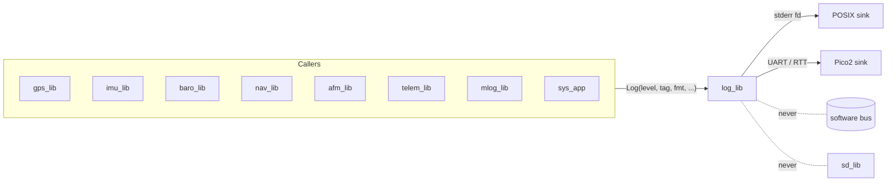
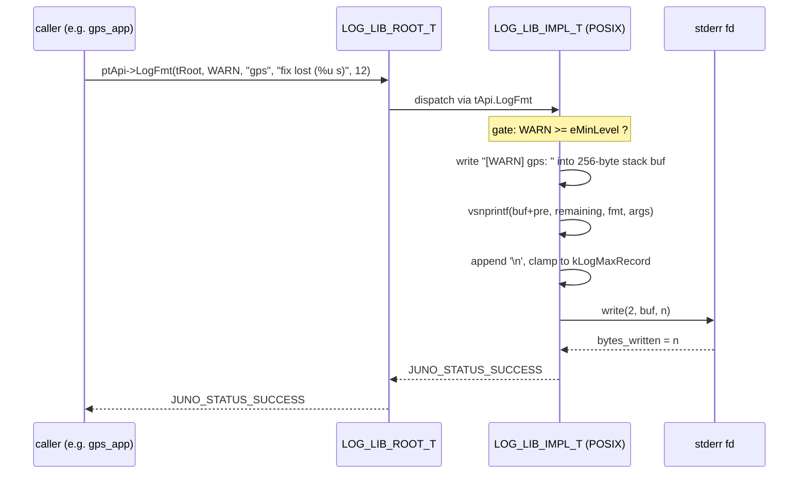
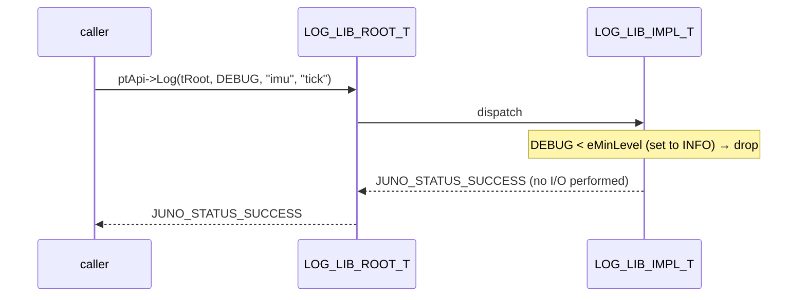

# Juno FSW — log_lib Design (L2)

**Document type:** IEEE 1016 Software Design Description
**Module:** `log_lib` (diagnostic logger)
**Header path:** `libs/log_lib/include/log_lib/log_api.hpp`
**POSIX impl:** `libs/log_lib/src/posix/log_posix.cpp`
**Pico2 impl:** `libs/log_lib/src/pico2/log_pico2.cpp`
**Authoritative references:** `docs/design/conventions.md` (cross-module names, idioms); `docs/design/system/system_design.md` (L1 system context).

This design addresses every requirement in `docs/requirements/log/requirements.json` (`SW-REQ-LOG-001` through `SW-REQ-LOG-008`).

---

<!-- @{"design": ["SW-REQ-LOG-001", "SW-REQ-LOG-008"]} -->
## 1. Purpose and Scope

`log_lib` is the project-wide **diagnostic logger** for Juno FSW. It provides a lightweight, severity-tagged logging API (`SW-REQ-LOG-001`) consumed by every module's failure handler and by ad-hoc developer instrumentation. It is the default sink for `JUNO_FAILURE_HANDLER_T` callbacks injected at every `New()` (per `conventions.md` §4.3 and L1 system design §9 step 2).

`log_lib` is explicitly **not** the SD card mission logger (`SW-REQ-LOG-008`). Mission-data logging (sensor samples, nav state, AFM phase events, raw NMEA, POST records) is the responsibility of `mlog_lib` / `mlog_app` per `SW-REQ-SYS-022`/`-023`/`-024` and is out of scope here. `log_lib` records may be embedded inside an `mlog_app` diagnostic record kind for telemetry visibility, but `log_lib` itself never writes to SD.

In scope: severity-tagged emission, severity prefix, format-string composition into a fixed-size buffer, status return on every call, identical public API across POSIX and Pico2, platform-configurable sink.

Out of scope: persistent storage, SD writes, software-bus publish (`log_lib` does not touch the broker — see §6), runtime severity reconfiguration after `New()`, multi-threaded reentrancy (FSW is single-threaded — `system_design.md` §3).

---

## 2. Definitions and Abbreviations

Cross-module vocabulary (status semantics, time base, naming) is defined in `conventions.md` §3 and §4 and is **not** redefined here.

| Term | Meaning |
|------|---------|
| Diagnostic record | One severity-tagged human-readable line emitted by `log_lib`. Distinct from a mission-log `MLOG_RECORD_T`. |
| Severity | One of four discrete levels: `DEBUG`, `INFO`, `WARN`, `ERROR` (`SW-REQ-LOG-001`). |
| Sink | The platform-specific output channel: POSIX `stderr` file descriptor; Pico2 UART (or RTT when configured at build time). |
| Severity prefix | The fixed-form label written at the start of every diagnostic record (`SW-REQ-LOG-002`). Format: `[DEBUG]`, `[INFO]`, `[WARN]`, `[ERROR]`. |
| `kLogMaxRecord` | Compile-time bound on a single formatted record's byte length (`SW-REQ-LOG-004`). |
| `JUNO_LOG_LEVEL_T` | The C++11 `enum class : uint8_t` declaring the four severities. |

The four severity values used in this design are exactly those enumerated in `SW-REQ-LOG-001` ("debug, info, warning, and error"). No `TRACE`, `FATAL`, or `OFF` value is introduced — those would be unsupported by requirements.

---

<!-- @{"design": ["SW-REQ-LOG-006", "SW-REQ-LOG-007"]} -->
## 3. System Overview

`log_lib` is a Controller in the MVC layering (`system_design.md` §3.1) — it is a library, not an app, and has no TDM period. Every module's `New()` factory accepts a `JUNO_FAILURE_HANDLER_T` per `conventions.md` §4.3; the composition root (`apps/main.cpp`) wires those handlers to a thin shim that forwards into `log_lib`.

### 3.1 Module-in-context



Identical public API on both build targets is mandated by `SW-REQ-LOG-006` (parent `SW-REQ-SYS-043`); only the `LOG_LIB_IMPL_T` and the static `tApi` vtable contents differ between platforms (`conventions.md` §6). `SW-REQ-LOG-007` (parent `SW-REQ-SYS-043`) anchors the platform-configurable sink: POSIX → `stderr`; Pico2 → UART (or RTT toggled by `LOG_LIB_PICO2_USE_RTT` build-time macro).

### 3.2 LibJuno C++ pattern adoption

`log_lib` follows the LibJuno C++ template (`libjuno/templates/template_cpp/include/temp_api.hpp`, `conventions.md` §1):

- Namespace `juno::log` (lowercase, `conventions.md` §3 row "Namespaces").
- `LOG_LIB_ROOT_T` declared via `JUNO_MODULE_ROOT(LOG_LIB_API_T, ...)`; trivially constructible (`.bss`-safe).
- `LOG_LIB_API_T` is a function-reference vtable; every reference is `noexcept`.
- `LOG_LIB_IMPL_T` derives from `LOG_LIB_ROOT_T` via `JUNO_MODULE_DERIVE`; one impl per platform.
- Static `New()` factory wires `tApi` once as a file-scope `static` local (read-only thereafter).
- No constructors, destructors, virtual, RTTI, throw, new, delete, malloc, std::string, std::ostream, std::vector (`conventions.md` §1.3, `constraints.md`).

---

<!-- @{"design": ["SW-REQ-LOG-001", "SW-REQ-LOG-002", "SW-REQ-LOG-003", "SW-REQ-LOG-004", "SW-REQ-LOG-005", "SW-REQ-LOG-006"]} -->
## 4. Interface Definitions

### 4.1 Severity enum

```cpp
namespace juno::log
{
enum class JUNO_LOG_LEVEL_T : uint8_t
{
    JUNO_LOG_LEVEL_DEBUG = 0,   //< verbose developer instrumentation
    JUNO_LOG_LEVEL_INFO  = 1,   //< nominal lifecycle events
    JUNO_LOG_LEVEL_WARN  = 2,   //< degraded but continuing
    JUNO_LOG_LEVEL_ERROR = 3,   //< failure path; diagnostic-only
};
}  // namespace juno::log
```

Values are stable, contiguous, and `uint8_t`-backed for compact embedding inside an `mlog_app` record kind. Numeric ordering reflects severity ascending.

### 4.2 Compile-time bounds

```cpp
namespace juno::log
{
static constexpr size_t kLogMaxRecord     = 256;  //< total bytes per record incl. prefix + '\n'
static constexpr size_t kLogPrefixMax     = 8;    //< "[ERROR] "
static constexpr size_t kLogTagMax        = 32;   //< caller-supplied module tag
static constexpr size_t kLogPayloadMax    = kLogMaxRecord - kLogPrefixMax - kLogTagMax - 4;
static constexpr JUNO_LOG_LEVEL_T kLogMinLevel = JUNO_LOG_LEVEL_T::JUNO_LOG_LEVEL_DEBUG;
}  // namespace juno::log
```

The minimum level is a compile-time constant (no runtime mutability after `New()` — see §9 step 4). `kLogMaxRecord = 256` is the bound mandated by `SW-REQ-LOG-004`; truncation policy is in §9.

### 4.3 Vtable

```cpp
struct LOG_LIB_API_T
{
    JUNO_STATUS_T (&Log)(
        LOG_LIB_ROOT_T &tRoot,
        JUNO_LOG_LEVEL_T eLevel,
        const char *pcTag,
        const char *pcMessage
    ) noexcept;

    JUNO_STATUS_T (&LogFmt)(
        LOG_LIB_ROOT_T &tRoot,
        JUNO_LOG_LEVEL_T eLevel,
        const char *pcTag,
        const char *pcFormat,
        ...
    ) noexcept;
};

struct LOG_LIB_ROOT_T JUNO_MODULE_ROOT(LOG_LIB_API_T,
    JUNO_LOG_LEVEL_T eMinLevel;
);
```

### 4.4 `LogLib_Log` — fixed-message emission

| Attribute | Value |
|-----------|-------|
| Signature | `JUNO_STATUS_T LogLib_Log(LOG_LIB_ROOT_T &tRoot, JUNO_LOG_LEVEL_T eLevel, const char *pcTag, const char *pcMessage) noexcept` |
| Preconditions | `tRoot` initialized via `New()`; `pcTag` and `pcMessage` non-null, NUL-terminated |
| Postconditions | One severity-prefixed line written to the configured sink iff `eLevel >= tRoot.eMinLevel` |
| Error conditions | `JUNO_STATUS_NULLPTR_ERROR` if `pcTag` or `pcMessage` is null; `JUNO_STATUS_WRITE_ERROR` if sink write fails; `JUNO_STATUS_INVALID_DATA_ERROR` if `eLevel` is outside the enum range |
| Thread safety | Not thread-safe; single-threaded TDM caller only (`system_design.md` §3) |
| Requirements | `SW-REQ-LOG-001`, `SW-REQ-LOG-002`, `SW-REQ-LOG-005` |

### 4.5 `LogLib_LogFmt` — formatted emission

| Attribute | Value |
|-----------|-------|
| Signature | `JUNO_STATUS_T LogLib_LogFmt(LOG_LIB_ROOT_T &tRoot, JUNO_LOG_LEVEL_T eLevel, const char *pcTag, const char *pcFormat, ...) noexcept` |
| Preconditions | `tRoot` initialized via `New()`; `pcTag` and `pcFormat` non-null, NUL-terminated |
| Postconditions | One severity-prefixed, formatted line written to the configured sink iff `eLevel >= tRoot.eMinLevel`. Output is bounded to `kLogMaxRecord` bytes; excess is truncated (no heap, no realloc) |
| Error conditions | `JUNO_STATUS_NULLPTR_ERROR` if `pcTag` or `pcFormat` is null; `JUNO_STATUS_WRITE_ERROR` if sink write fails; truncation is not an error — it is a successful, bounded emission |
| Thread safety | Not thread-safe; single-threaded TDM caller only |
| Requirements | `SW-REQ-LOG-001`, `SW-REQ-LOG-002`, `SW-REQ-LOG-003`, `SW-REQ-LOG-004`, `SW-REQ-LOG-005` |

`LogLib_LogFmt` formats into a **fixed-size stack buffer** of `kLogMaxRecord` bytes inside the function; `vsnprintf` writes to this buffer (caller-owned, stack-only, no heap). The buffer never escapes the function — the sink consumes it before return. This pattern satisfies `SW-REQ-LOG-003` (printf-style format support) while honoring the no-heap mandate (`SW-REQ-LOG-004`, `SW-REQ-SYS-050`, `constraints.md`).

> **Note.** The C++ template wrapper `LogLib_LogFmt(...)` is the only place a C-style variadic surface appears. It is **not** propagated through any other API. The vtable holds a typed function reference; the implementation uses `<cstdarg>` `va_list` internally.

### 4.6 `New()` factory (per platform)

```cpp
struct LOG_LIB_IMPL_T JUNO_MODULE_DERIVE(LOG_LIB_ROOT_T,
    int iSinkFd;                           //< POSIX: stderr fd; Pico2: unused (UART instance held elsewhere)

    static JUNO_STATUS_T Log(...) noexcept;
    static JUNO_STATUS_T LogFmt(...) noexcept;

    static RESULT_T<LOG_LIB_IMPL_T> New(
        JUNO_LOG_LEVEL_T eMinLevel,
        JUNO_FAILURE_HANDLER_T pfcnFailureHandler,
        JUNO_USER_DATA_T *pvUserData
    ) noexcept;
);
```

`New()` wires the static `tApi` vtable once and returns a `RESULT_T<LOG_LIB_IMPL_T>` (`conventions.md` §1.2). The vtable is **never reassigned**.

---

<!-- @{"design": ["SW-REQ-LOG-001"]} -->
## 5. State Machines

**No internal state machine.** `log_lib` is functionally pure given inputs: `(eMinLevel, eLevel, pcTag, pcMessage|pcFormat[+args])` map deterministically to either (a) one severity-prefixed sink write returning `JUNO_STATUS_SUCCESS` or `JUNO_STATUS_WRITE_ERROR`, or (b) a no-op returning `JUNO_STATUS_SUCCESS` when `eLevel < eMinLevel`.

The minimum severity `eMinLevel` is fixed at `New()` time and not mutated afterwards; there is no "open / closed / draining" lifecycle.

---

<!-- @{"design": ["SW-REQ-LOG-007", "SW-REQ-LOG-008"]} -->
## 6. Data Flow

`log_lib` does **not** touch the LibJuno software bus directly. It does not subscribe to any `JUNO_MSG_*_T` and does not publish any. Its sole output channel is the platform sink configured at build time per `SW-REQ-LOG-007`.

```text
   caller ──Log/LogFmt──▶ log_lib ──▶ sink
                                       └── POSIX:  write(stderr_fd, buf, n)
                                       └── Pico2:  uart_write_blocking(uart, buf, n)   (or RTT)
```

`log_lib` does not write to SD (`SW-REQ-LOG-008`); SD logging belongs to `mlog_lib` / `mlog_app` per `SW-REQ-SYS-022`. A future enhancement may allow `mlog_app` to subscribe to a diagnostic-record kind that *embeds* `log_lib` output — that subscription would be implemented in `mlog_app`, not in `log_lib`. As of this design no such bus message exists, and `log_lib` remains bus-free.

Buffer ownership for every emission is **caller-stack-only**: the formatted bytes live in a `kLogMaxRecord`-byte buffer on `LogLib_LogFmt`'s frame and are consumed (written to the sink) before the function returns. See §10.

---

<!-- @{"design": ["SW-REQ-LOG-001", "SW-REQ-LOG-002", "SW-REQ-LOG-003", "SW-REQ-LOG-005"]} -->
## 7. Sequence Diagrams

### 7.1 Nominal: app calls `LogLib_LogFmt` → POSIX sink writes to stderr



### 7.2 Gated: severity below threshold (no sink write)



`SW-REQ-LOG-005` is honored: every call returns a status code, even when gated and even on truncation.

### 7.3 Sink write failure → diagnostic-only failure handler

```mermaid
sequenceDiagram
    participant app as caller
    participant impl as LOG_LIB_IMPL_T
    participant sink as sink fd / UART
    participant fh as failure handler (diagnostic only)

    app->>impl: LogFmt(...)
    impl->>sink: write(...)
    sink-->>impl: -1 / errno = EIO
    impl->>fh: notify("log sink write failed", JUNO_STATUS_WRITE_ERROR)
    Note over fh: SW-REQ-SYS-037 / conventions §4.3:<br/>diagnostic-only; never alters control flow
    impl-->>app: JUNO_STATUS_WRITE_ERROR
```

The failure handler is the same `JUNO_FAILURE_HANDLER_T pfcnFailureHandler` injected at `New()` (`conventions.md` §4.3); it receives the message and the originating status. Per `SW-REQ-SYS-037` and `conventions.md` §4.3, it never alters control flow.

---

<!-- @{"design": ["SW-REQ-LOG-001", "SW-REQ-LOG-004"]} -->
## 8. Timing and Scheduling Analysis

`log_lib` has **no TDM period** — it is not an app and is not registered with `sch_lib`. Each call is a synchronous, bounded-cost operation made from inside another module's TDM-scheduled `Execute()` slot.

Per-call cost upper bound:

| Step | Bound |
|------|-------|
| Severity gate compare | O(1) |
| Prefix copy (≤ `kLogPrefixMax = 8` bytes) | O(1) |
| Tag copy (≤ `kLogTagMax = 32` bytes) | O(`kLogTagMax`) |
| `vsnprintf` into 256-byte stack buf | O(`kLogPayloadMax`) |
| Single `write()` / `uart_write_blocking()` of ≤ 256 bytes | platform-bounded |

The implementation must **not block** the TDM tick (`SW-REQ-SYS-044` determinism, `constraints.md` Safety & Security: "Telemetry and logging must not block the TDM scheduler loop"). Concrete obligations:

- **POSIX:** `stderr` is opened with `O_NONBLOCK` cleared at process start (default); the tick-blocking risk is negligible on a dev workstation but is the documented platform limitation. The POSIX impl is exercised under unit test and Trick SITL only — never on flight hardware.
- **Pico2:** the UART sink uses a build-time-configured driver write that returns immediately on FIFO-full with `JUNO_STATUS_WRITE_ERROR` (no blocking spin). RTT, when enabled, is non-blocking by construction. **Drop-newest** is the truncation policy: if the FIFO is full, the current record is dropped and the call returns `JUNO_STATUS_WRITE_ERROR`; no in-library queue is buffered (no heap, no global mutable state — `conventions.md` §5).

Downstream apps that call into `log_lib` (every app, indirectly via failure handlers): no fan-out latency is added, because `log_lib` does not publish on the bus (§6). The cost is local to the calling app's slot.

---

<!-- @{"design": ["SW-REQ-LOG-002", "SW-REQ-LOG-004", "SW-REQ-LOG-005"]} -->
## 9. Error Handling Strategy

`log_lib` is the canonical *target* of the LibJuno failure-handler chain (`conventions.md` §4.3). It also reports its own failures in the same idiom.

1. **Status propagation.** Every `LogLib_*` call returns `JUNO_STATUS_T`. Callers use `JUNO_ASSERT_SUCCESS` (`conventions.md` §4.3); bare `if`-return is forbidden (`conventions.md` §9 self-check).
2. **Null checks.** `pcTag`, `pcMessage`, `pcFormat` are checked with `JUNO_ASSERT_EXISTS` at function entry; failure returns `JUNO_STATUS_NULLPTR_ERROR`.
3. **Severity gating.** A call with `eLevel < tRoot.eMinLevel` returns `JUNO_STATUS_SUCCESS` without performing I/O (a "successful no-op"). This satisfies `SW-REQ-LOG-005` (status returned on every call) without inflating the sink.
4. **Compile-time minimum level.** `tRoot.eMinLevel` is set once at `New()` and never mutated afterwards; there is no `SetLevel()` API. This avoids global mutable state (`conventions.md` §5 rule 3) and keeps cost predictable.
5. **Severity prefix.** `SW-REQ-LOG-002` is satisfied by writing the fixed prefix (`[DEBUG]`, `[INFO]`, `[WARN]`, `[ERROR]`) before any tag or payload bytes. The prefix is selected by a `static constexpr` lookup table indexed by `JUNO_LOG_LEVEL_T`.
6. **Bounded format.** `LogLib_LogFmt` calls `vsnprintf(buf, kLogMaxRecord - used, fmt, args)`. `vsnprintf` is the only standard-library function used here; it operates exclusively on the caller-stack buffer and **never allocates** (this is the C99/C++11 contract for `vsnprintf`, distinct from the `vasprintf`/`asprintf` family which are heap-allocating and **forbidden** here per `SW-REQ-LOG-004` and `constraints.md`). If `vsnprintf` reports a return value ≥ remaining capacity, output is **truncated**; the call still returns `JUNO_STATUS_SUCCESS`. Truncation is not an error — it is a documented, bounded behavior.
7. **Sink I/O failure.** A `write()` returning `-1` (POSIX) or a UART write reporting FIFO-full beyond a single retry (Pico2) yields `JUNO_STATUS_WRITE_ERROR` (sink is a write path per `conventions.md` §4.8). The injected `pfcnFailureHandler` is invoked for diagnostics only (`SW-REQ-SYS-037`, `conventions.md` §4.3).
8. **No exceptions.** Every API function is `noexcept` (`SW-REQ-SYS-053`, `coding-standards.md`). A stray throw would invoke `std::terminate`; designs treat this as a structural invariant.
9. **Scope boundary.** `log_lib` never writes to SD (`SW-REQ-LOG-008`); a sink-write failure here does **not** affect the SD mission log. `mlog_lib` failures are an independent path with their own per-sensor health bit (`SW-REQ-SYS-060`).

---

<!-- @{"design": ["SW-REQ-LOG-004"]} -->
## 10. Memory Ownership

Every per-module design must reaffirm `conventions.md` §5; below is the `log_lib`-specific table.

| Buffer / facility | Owner | Lifetime | Allocation |
|-------------------|-------|----------|------------|
| `LOG_LIB_IMPL_T` instance | composition root (`apps/main.cpp`) | program lifetime, `.bss` zero-init | Static — caller-owned |
| `tApi` vtable | file-scope `static` local in `New()` | program lifetime | Read-only after construction |
| Format scratch buffer (`char acRec[kLogMaxRecord]`) | `LogLib_LogFmt` stack frame | the call only | **Stack** — never escapes the function, never persists |
| Caller's `pcTag` / `pcMessage` / `pcFormat` | the calling module | caller-owned, must outlive the call | Caller — typically string literal in `.rodata` |
| Sink handle (`stderr` fd / UART instance) | platform / composition root | program lifetime | OS-owned (POSIX) or peripheral register (Pico2) |

Asserted invariants (`SW-REQ-LOG-004`, `SW-REQ-SYS-050`, `constraints.md`):

- **No `new`, `delete`, `malloc`, `calloc`, `realloc`, `free`** anywhere in `log_lib`.
- **No `std::string`, `std::ostream`, `std::stringstream`, `std::vector`** — these are `constraints.md` Forbidden.
- **No `vasprintf`, `asprintf`, `open_memstream`** — these allocate on the heap.
- **No global mutable state** — the only file-scope datum is the `static const` `tApi` vtable inside `New()`.
- **No dynamic dispatch** beyond the LibJuno function-reference vtable.
- **`vsnprintf` is the only stdlib formatting routine used**, and it operates strictly on the caller-supplied stack buffer.

The `kLogMaxRecord` stack frame size is bounded at **256 bytes** (compile-time, `static constexpr`), which is well within the FSW's per-app stack budget on both POSIX and Pico2.

---

## 11. Traceability

Per-section `<!-- @{"design": [...]} -->` tags above are authoritative; this table is descriptive consolidation. Every `SW-REQ-LOG-NNN` is mapped to at least one section.

| Req ID | Title | Section(s) |
|--------|-------|-----------|
| SW-REQ-LOG-001 | Severity-Tagged Diagnostic Logging API | §1, §3, §4.1, §4.4, §4.5, §5, §7, §8 |
| SW-REQ-LOG-002 | Severity Prefix in Output | §4.4, §4.5, §7.1, §9.5 |
| SW-REQ-LOG-003 | Formatted Diagnostic Message Support | §4.5, §7 |
| SW-REQ-LOG-004 | Bounded Output Buffer | §4.2, §4.5, §9.6, §10 |
| SW-REQ-LOG-005 | Status Return on Each Call | §4.4, §4.5, §7.2, §9 |
| SW-REQ-LOG-006 | Identical API Across Platforms | §3, §4 |
| SW-REQ-LOG-007 | Platform-Configurable Diagnostic Sink | §3, §6, §8 |
| SW-REQ-LOG-008 | Separation From Mission Logging | §1, §6, §9.9 |

POSIX/Pico2 functional equivalence statement (`SW-REQ-SYS-043`, parent of `SW-REQ-LOG-006` and `SW-REQ-LOG-007`): the public header `libs/log_lib/include/log_lib/log_api.hpp` is identical across both targets; only `libs/log_lib/src/posix/log_posix.cpp` and `libs/log_lib/src/pico2/log_pico2.cpp` differ. Trick SITL (`SW-REQ-SYS-045`) consumes the POSIX impl through the same `LOG_LIB_ROOT_T` API the flight build uses.

---

## FLAGs Raised

**FLAG-1: Brief AC-5 specifies POSIX → `stderr`; `SW-REQ-LOG-007` rationale states "POSIX sink is stdout".**
This design adopts the brief's AC-5 (stderr) as authoritative for the design content because `stderr` is conventional for diagnostic-only output (separate from any program data on stdout) and is the unbuffered channel by default — which better fits a non-blocking diagnostic logger. The requirement description itself ("platform-specific sink configured at build time") is satisfied either way; only the rationale prose mentions "stdout". **PM action:** confirm stderr (recommended) and update the `SW-REQ-LOG-007` rationale prose to read "stderr" rather than "stdout"; no description change is needed.

**FLAG-2: Brief AC-6 lists `TRACE/DEBUG/INFO/WARN/ERROR` (5 levels) with the qualifier "confirm against requirements; do not invent".**
`SW-REQ-LOG-001` enumerates only four levels: "debug, info, warning, and error". This design implements exactly those four (`DEBUG`, `INFO`, `WARN`, `ERROR`) and does **not** introduce `TRACE`. The brief's parenthetical "do not invent" is honored over the brief's example list. **PM action:** none required; if a `TRACE` level is desired in the future, file a new requirement first.

**FLAG-3: `SW-REQ-LOG-003` mandates printf-style variadic format support; brief AC-7 says "no `printf` variadics in the C++ API surface".**
This design resolves the tension by exposing exactly one variadic entry point (`LogLib_LogFmt`) that formats into a caller-stack `kLogMaxRecord`-byte buffer via `vsnprintf` (stack-only, no heap). All other API and message-flow surfaces are typed (`Log` accepts `const char *pcMessage` only). The fixed-size stack buffer is documented in §4.2 and §10 per AC-7's permitted exception ("If formatting is required, use a fixed-size stack buffer documented in the design"). No heap-backed `printf` family function (`vasprintf`, `asprintf`, `open_memstream`) is used. **PM action:** none required if this resolution is acceptable; otherwise, propose a change to `SW-REQ-LOG-003` to remove the variadic mandate.

**FLAG-4: Brief AC-5 example mentions "Pico2 → UART/RTT".**
RTT (Real-Time Transfer) is included as a build-time-toggleable secondary sink on Pico2 via the macro `LOG_LIB_PICO2_USE_RTT`. The default Pico2 sink is UART; RTT is opt-in. No requirement currently mandates RTT, so it is documented as an implementation detail under `SW-REQ-LOG-007`'s "platform-specific sink configured at build time" umbrella. **PM action:** none required unless RTT support should be required (in which case file a child requirement under `SW-REQ-LOG-007`).
