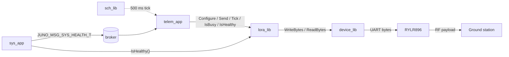
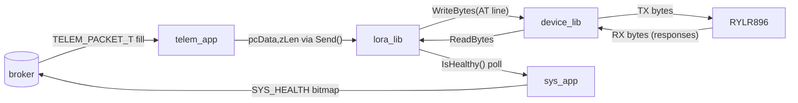

# lora_lib — L2 Design

**Document type:** IEEE 1016 Software Design Description
**Module:** `lora_lib` (RYLR896 LoRa radio driver, downlink-only for FT1)
**Header:** `libs/lora_lib/include/lora_lib/lora_api.hpp`
**Refs:** `docs/design/conventions.md`, `docs/design/system/system_design.md`
**Coverage:** `SW-REQ-LORA-001` .. `SW-REQ-LORA-012`

---

<!-- @{"design": ["SW-REQ-LORA-001", "SW-REQ-LORA-002", "SW-REQ-LORA-003", "SW-REQ-LORA-004", "SW-REQ-LORA-005", "SW-REQ-LORA-006", "SW-REQ-LORA-007", "SW-REQ-LORA-008", "SW-REQ-LORA-009", "SW-REQ-LORA-010", "SW-REQ-LORA-011", "SW-REQ-LORA-012"]} -->
## 1. Purpose and Scope

`lora_lib` is the LoRa radio driver consumed by `telem_app` to push the
`JUNO_MSG_TELEM_PACKET_T` payload (system L1 §4) onto the air at the 2 Hz
cadence locked by `SW-REQ-SYS-019`. The module wraps the REYAX RYLR896
LoRa transceiver, which is controlled exclusively over UART using a small
subset of AT commands. This document addresses every requirement in
`docs/requirements/lora/requirements.json` (`SW-REQ-LORA-001` .. `-012`).

**In scope:** transmit-only operation; AT-command-driven configuration of
address, network ID, frequency, spreading factor, bandwidth, coding rate;
non-blocking send progressed across multiple TDM ticks; module health
observation; POSIX stub / pseudo-tty impl; Pico2 impl using `device_lib`.

**Out of scope:** receive path (FT1 is downlink-only); transmit retries
(fire-and-forget for FT1, see §9); link encryption; duty-cycle enforcement
(handled at `telem_app` period); hardware reset pin sequencing.

---

## 2. Definitions and Abbreviations

Cross-module vocabulary (status semantics, time base, message naming, period
units) is in `docs/design/conventions.md` §4 and not redefined here.

| Term | Meaning |
|------|---------|
| RYLR896 | REYAX LoRa transceiver, AT-command UART interface |
| AT command | ASCII line `AT+<verb>=<args>\r\n` accepted by RYLR896 |
| AT response | ASCII `\r\n`-terminated line; `+OK` on success, `+ERR=<n>` on failure |
| SF | Spreading factor (RYLR896 7..12) |
| BW | Bandwidth code (RYLR896 0..9; 7 = 125 kHz) |
| CR | Coding rate (RYLR896 1..4) |
| Payload | Caller-supplied opaque byte sequence (`SW-REQ-LORA-002`) |
| Send cycle | Multi-step AT exchange to deliver one payload |

---

<!-- @{"design": ["SW-REQ-LORA-001", "SW-REQ-LORA-002", "SW-REQ-LORA-003", "SW-REQ-LORA-006", "SW-REQ-LORA-010"]} -->
## 3. System Overview

### 3.1 MVC layer mapping

| Layer | Realization |
|-------|-------------|
| View (App) | `telem_app` — 500 ms cadence; subscribes `JUNO_MSG_NAV_STATE_T`, `JUNO_MSG_AFM_PHASE_T`, `JUNO_MSG_GPS_FIX_T`, `JUNO_MSG_SYS_HEALTH_T`; publishes `JUNO_MSG_TELEM_PACKET_T` |
| Controller (Lib) | `lora_lib` — transport-only driver behind `LORA_LIB_API_T` vtable; consumes `device_lib` UART API |
| Model (Bus) | not directly used; `sys_app` queries `IsHealthy()` and publishes the bit in `JUNO_MSG_SYS_HEALTH_T` (`SW-REQ-SYS-031`, `-061`) |

### 3.2 Module-in-context



`lora_lib` sits below `telem_app` and above `device_lib`; UART byte access is asserted in §6.

---

<!-- @{"design": ["SW-REQ-LORA-001", "SW-REQ-LORA-002", "SW-REQ-LORA-003", "SW-REQ-LORA-004", "SW-REQ-LORA-005", "SW-REQ-LORA-006", "SW-REQ-LORA-007", "SW-REQ-LORA-008", "SW-REQ-LORA-009", "SW-REQ-LORA-012", "SW-REQ-DEVICE-007"]} -->
## 4. Interface Definitions

### 4.1 Header skeleton (`libs/lora_lib/include/lora_lib/lora_api.hpp`)

```cpp
// MIT License header
#pragma once
#include "juno/module.h"
#include "juno/module.hpp"
#include "juno/status.h"
#include "juno/time.h"
#include "device_lib/device_api.hpp"
#include <cstddef>
#include <cstdint>

namespace juno::lora
{

static constexpr size_t   kMaxPayloadBytes = 240;  // RYLR896 AT+SEND payload cap
static constexpr size_t   kMaxAtLineBytes  = 512;  // command + response scratch
static constexpr size_t   kLoraUartRxCap   = 256;  // device_lib RX buffer cap (>=256)
static constexpr uint32_t kDefaultBaud     = 115200;

struct LORA_LIB_CONFIG_T
{
    uint16_t u16Address;        // AT+ADDRESS
    uint16_t u16NetworkId;      // AT+NETWORKID
    uint32_t u32FreqHz;         // AT+BAND
    uint8_t  u8SpreadingFactor; // 7..12
    uint8_t  u8BandwidthCode;   // 0..9
    uint8_t  u8CodingRate;      // 1..4
    uint8_t  u8Preamble;        // 4..25
    uint32_t u32BaudRate;       // SW-REQ-LORA-012
    uint16_t u16PeerAddress;    // dest in AT+SEND
};

struct LORA_LIB_ROOT_T;

struct LORA_LIB_API_T
{
    JUNO_STATUS_T (&Configure)(LORA_LIB_ROOT_T &tRoot,
                               const LORA_LIB_CONFIG_T &tCfg) noexcept;
    JUNO_STATUS_T (&Send)     (LORA_LIB_ROOT_T &tRoot,
                               const uint8_t *pcData, size_t zLen) noexcept;
    JUNO_STATUS_T (&Tick)     (LORA_LIB_ROOT_T &tRoot) noexcept;
    RESULT_T<bool>(&IsBusy)   (const LORA_LIB_ROOT_T &tRoot) noexcept;
    RESULT_T<bool>(&IsHealthy)(const LORA_LIB_ROOT_T &tRoot) noexcept;
    JUNO_STATUS_T (&Probe)    (LORA_LIB_ROOT_T &tRoot) noexcept;
};

enum class LORA_TX_STATE_T : uint8_t
{
    UNINITIALIZED = 0, CONFIGURED = 1, IDLE = 2,
    TRANSMITTING  = 3, TX_COMPLETE = 4, FAILED = 5,
};

struct LORA_LIB_ROOT_T JUNO_MODULE_ROOT(LORA_LIB_API_T,
    juno::device::DEVICE_LIB_ROOT_T<kLoraUartRxCap> *ptUart;  // injected at New()
    LORA_TX_STATE_T  eState;
    bool             bHealthy;
    uint16_t         u16PeerAddress;
    uint8_t          tTxScratch[kMaxAtLineBytes];
    uint8_t          tRxScratch[kMaxAtLineBytes];
    size_t           zRxLen;
    JUNO_TIME_US_T   tSendStartUs;
);

} // namespace juno::lora
```

### 4.2 API contracts

#### 4.2.1 LoraLib_Configure
<!-- @{"design": ["SW-REQ-LORA-004", "SW-REQ-LORA-008", "SW-REQ-LORA-012"]} -->

| Attribute | Value |
|-----------|-------|
| Signature | `JUNO_STATUS_T LoraLib_Configure(LORA_LIB_ROOT_T &tRoot, const LORA_LIB_CONFIG_T &tCfg) noexcept` |
| Pre | `tRoot` initialized via `New()`; `eState` ∈ {UNINITIALIZED, IDLE}; UART up |
| Post | RYLR896 accepted `AT+ADDRESS`, `AT+NETWORKID`, `AT+BAND`, `AT+PARAMETER` and replied `+OK`; `eState = CONFIGURED → IDLE`; `bHealthy = true` |
| Errors | `INVALID_INPUT_ERROR` on out-of-range SF/BW/CR; `TIMEOUT_ERROR` on missing reply (`SW-REQ-LORA-008`); `IO_ERROR` on UART fault; `bHealthy = false` on any failure |
| Thread | Single-threaded TDM caller only |

#### 4.2.2 LoraLib_Send
<!-- @{"design": ["SW-REQ-LORA-001", "SW-REQ-LORA-002", "SW-REQ-LORA-003", "SW-REQ-LORA-007", "SW-REQ-LORA-009"]} -->

| Attribute | Value |
|-----------|-------|
| Signature | `JUNO_STATUS_T LoraLib_Send(LORA_LIB_ROOT_T &tRoot, const uint8_t *pcData, size_t zLen) noexcept` |
| Pre | `eState == IDLE`; `pcData != nullptr`; `0 < zLen <= kMaxPayloadBytes`; `IsBusy()` false |
| Post | `eState = TRANSMITTING`; `AT+SEND=<peer>,<zLen>,<bytes>\r\n` queued to UART; payload bytes copied byte-for-byte without interpretation (`SW-REQ-LORA-002`) |
| Errors | `NULLPTR_ERROR` (`pcData == nullptr`); `INVALID_INPUT_ERROR` (`zLen == 0` or `> kMaxPayloadBytes`); `BUSY_ERROR` (`eState != IDLE`); `IO_ERROR` on UART write fail (`SW-REQ-LORA-009`); on fault `eState = FAILED`, `bHealthy = false` (`SW-REQ-LORA-007`) |
| Thread | Single-threaded TDM caller |
| Notes | Non-blocking — see §5 / §7. Caller buffer must remain valid only until `Send()` returns; bytes are copied into `tTxScratch`. |

#### 4.2.3 LoraLib_Tick
<!-- @{"design": ["SW-REQ-LORA-003", "SW-REQ-LORA-007", "SW-REQ-LORA-008"]} -->

| Attribute | Value |
|-----------|-------|
| Signature | `JUNO_STATUS_T LoraLib_Tick(LORA_LIB_ROOT_T &tRoot) noexcept` |
| Post | Drains pending RX bytes via `device_lib`; on `+OK\r\n`: `TRANSMITTING → TX_COMPLETE → IDLE`; on `+ERR=<n>` or per-step timeout: `→ FAILED → IDLE` and clears `bHealthy` |
| Errors | Returns `SUCCESS` even when state is FAILED — failure is observable via `IsHealthy()` |
| Notes | Called by `telem_app::Execute()` every 500 ms regardless of fresh `Send()` so long-tail responses do not dangle. |

#### 4.2.4 LoraLib_IsBusy — `RESULT_T<bool> LoraLib_IsBusy(const LORA_LIB_ROOT_T &tRoot) noexcept`

`tOk == (eState == TRANSMITTING)`; status `SUCCESS`.

#### 4.2.5 LoraLib_IsHealthy
<!-- @{"design": ["SW-REQ-LORA-006", "SW-REQ-LORA-007", "SW-REQ-LORA-008"]} -->

| Attribute | Value |
|-----------|-------|
| Signature | `RESULT_T<bool> LoraLib_IsHealthy(const LORA_LIB_ROOT_T &tRoot) noexcept` |
| Post | `tOk == bHealthy`. Reflects most recent transmit + module-response outcome (`SW-REQ-LORA-006`); cleared on send failure (`-007`) and missing module response (`-008`); re-asserted true after a successful subsequent `Tick()` `TX_COMPLETE`. |

#### 4.2.6 LoraLib_Probe
<!-- @{"design": ["SW-REQ-LORA-005"]} -->

| Attribute | Value |
|-----------|-------|
| Signature | `JUNO_STATUS_T LoraLib_Probe(LORA_LIB_ROOT_T &tRoot) noexcept` |
| Pre | UART up; called once at POST by `sys_app` (`SW-REQ-SYS-029`) |
| Post | Issues bare `AT\r\n`; on `+OK\r\n`: returns `SUCCESS`, `bHealthy = true`; otherwise non-success and `bHealthy = false` |
| Errors | `TIMEOUT_ERROR` on missing reply; `IO_ERROR` on UART fault |

All vtable function references are `noexcept` (`conventions.md` §1.3).

---

<!-- @{"design": ["SW-REQ-LORA-003", "SW-REQ-LORA-005", "SW-REQ-LORA-007", "SW-REQ-LORA-008", "SW-REQ-LORA-009"]} -->
## 5. State Machines

One transmit FSM per `LORA_LIB_ROOT_T`. Canonical state set locked by AC-9.

```mermaid
stateDiagram-v2
    [*] --> Uninitialized: New() returns
    Uninitialized --> Configured: Configure() succeeds (AT+ADDRESS, +NETWORKID, +BAND, +PARAMETER all +OK)
    Configured --> Idle: Probe() +OK observed (POST pass) — SW-REQ-LORA-005
    Idle --> Transmitting: Send() queues AT+SEND
    Transmitting --> TxComplete: Tick() observes +OK\r\n
    Transmitting --> Failed: Tick() observes +ERR or per-step timeout
    TxComplete --> Idle: same Tick() — buffer reusable
    Failed --> Idle: same Tick() — caller drops packet, retries next 500 ms slot
    Uninitialized --> Failed: Configure() or Probe() fails
    Failed --> Configured: Configure() retry succeeds (operator path; not flight)
```



Invariants:

- `Idle ↔ Transmitting` is the only steady-state loop in flight. `TxComplete`
  and `Failed` are transient — both leave the FSM in `Idle` within the same
  `Tick()`.
- Both transient terminals are observable via `IsHealthy()` (true after
  `TxComplete`, false after `Failed`) — `SW-REQ-LORA-006`/`-007`/`-008`.
- `Send()` is rejected with `BUSY_ERROR` while in `Transmitting`
  (`SW-REQ-LORA-009`); caller drops the packet (fire-and-forget).
- No retry initiated by the FSM — failed transmit is logged, marked
  unhealthy, discarded; the next `telem_app::Execute()` issues a fresh
  packet (see §9).

---

<!-- @{"design": ["SW-REQ-LORA-001", "SW-REQ-LORA-002", "SW-REQ-LORA-006"]} -->
## 6. Data Flow

`lora_lib` does **not** publish or subscribe to broker messages directly.
All bus traffic is owned by `telem_app` and `sys_app`.



Buffer flow:

1. `telem_app` fills the `JUNO_MSG_TELEM_PACKET_T` it owns and passes
   `const uint8_t* + size_t` into `LoraLib_Send`.
2. `lora_lib` formats the AT line into `tTxScratch` (its own root member);
   caller bytes are copied verbatim into the AT-SEND payload region without
   interpretation (`SW-REQ-LORA-002`).
3. `device_lib::WriteBytes` consumes `tTxScratch` (`SW-REQ-DEVICE-007`); ownership does not change.
4. `device_lib::ReadBytes` (non-blocking, `SW-REQ-DEVICE-003`) returns
   buffered bytes; `lora_lib` accumulates into `tRxScratch` until a
   `\r\n`-terminated response line is detected.

**Per AC-10: `lora_lib` does not touch the UART bus directly.** Every wire
byte flows through the `device_lib` API.

---

<!-- @{"design": ["SW-REQ-LORA-001", "SW-REQ-LORA-003", "SW-REQ-LORA-005", "SW-REQ-LORA-006", "SW-REQ-LORA-007", "SW-REQ-LORA-008", "SW-REQ-LORA-009", "SW-REQ-DEVICE-007"]} -->
## 7. Sequence Diagrams

### 7.1 Nominal downlink (multi-tick send + response wait)

```mermaid
sequenceDiagram
    participant sch as sch_lib
    participant telem as telem_app
    participant lora as lora_lib
    participant uart as device_lib
    participant rylr as RYLR896
    participant gnd as Ground
    sch->>telem: Execute() at t = N*500ms
    telem->>lora: IsBusy() -> false
    telem->>lora: Send(pcData, zLen)
    lora->>lora: format "AT+SEND=peer,zLen,...\r\n" into tTxScratch
    lora->>uart: WriteBytes(tTxScratch, zCmdLen)
    uart->>rylr: TX AT line bytes
    lora-->>telem: SUCCESS (eState=TRANSMITTING)
    rylr->>gnd: RF payload
    sch->>telem: Execute() at t = (N+1)*500ms
    telem->>lora: Tick()
    lora->>uart: ReadBytes(tRxScratch)
    uart-->>lora: bytes "+OK\r\n"
    lora->>lora: TRANSMITTING -> TX_COMPLETE -> IDLE; bHealthy=true
    lora-->>telem: SUCCESS
```

Protocol details (slot bound by UART-write enqueue, not RYLR896 turnaround) are in §8; satisfies `SW-REQ-LORA-003`.

### 7.2 Send failure (UART error → unhealthy)

```mermaid
sequenceDiagram
    participant telem as telem_app
    participant lora as lora_lib
    participant uart as device_lib
    participant sys as sys_app
    telem->>lora: Send(pcData, zLen)
    lora->>uart: WriteBytes(tTxScratch, zCmdLen)
    uart-->>lora: IO_ERROR
    lora->>lora: eState=FAILED -> IDLE; bHealthy=false
    lora-->>telem: IO_ERROR  (SW-REQ-LORA-009)
    sys->>lora: IsHealthy() -> {SUCCESS, false}
    sys->>sys: Publish(SYS_HEALTH_T{ |= LORA_BIT})  (SW-REQ-SYS-061)
```

### 7.3 Missing module response (silent RYLR896 → timeout → unhealthy)

```mermaid
sequenceDiagram
    participant telem as telem_app
    participant lora as lora_lib
    participant uart as device_lib
    telem->>lora: Send(pcData, zLen)
    lora->>uart: WriteBytes(AT+SEND ...)
    telem->>lora: Tick()
    lora->>uart: ReadBytes -> 0 bytes
    telem->>lora: Tick() (next 500 ms)
    lora->>uart: ReadBytes -> 0 bytes; timeout exceeded (monotonic µs)
    lora->>lora: TRANSMITTING -> FAILED -> IDLE; bHealthy=false (SW-REQ-LORA-008)
    lora-->>telem: SUCCESS (Tick non-fatal; failure via IsHealthy)
```

---

<!-- @{"design": ["SW-REQ-LORA-003", "SW-REQ-LORA-011"]} -->
## 8. Timing and Scheduling Analysis

`telem_app`'s TDM period is `kTelemAppPeriodMs = 500` (system L1 §4.5,
`SW-REQ-SYS-019`). `lora_lib` is invoked from inside that 500 ms slot.

| Operation | Worst-case work in slot |
|-----------|-------------------------|
| `Configure()` | one-shot at boot; bounded by 4 × (AT line write + reply wait) |
| `Probe()` | one-shot at POST; one `AT\r\n` write + reply wait |
| `Send()` | format AT line into `tTxScratch` (≤ kMaxAtLineBytes), one non-blocking `device_lib` UART write — bounded by enqueue, not wire time (~30 ms wire at 115200 baud for 240-byte payload) |
| `Tick()` | one non-blocking UART read (`SW-REQ-DEVICE-003`), state transition; O(zRxBytes) on buffered RX, ≤ kMaxAtLineBytes |
| `IsBusy` / `IsHealthy` | const member read; constant time |

**Non-blocking send protocol.** The AT command + module response cycle
can exceed the 5 ms Pico2 minor tick. The design splits the protocol:

1. Tick *N* — `telem_app::Execute()` calls `Send()`: write AT line to
   UART TX FIFO via `device_lib`, return immediately. State =
   `TRANSMITTING`.
2. Tick *N+1*..: each `Tick()` non-blockingly drains the UART RX FIFO.
   On `\r\n`-terminated response, exit `TRANSMITTING`. If a per-step
   timeout (default 1500 ms = three 500 ms slots) elapses, FSM →
   `Failed`.
3. Next `telem_app::Execute()` issues fresh `Send()` only when
   `IsBusy()` is false. Otherwise `telem_app` drops the new packet —
   fire-and-forget.

**Determinism (`SW-REQ-LORA-011`).** Given identical inputs (same UART RX
trace across the same number of ticks, same monotonic-µs clock, same
`LORA_LIB_CONFIG_T`), the FSM produces identical state transitions and
identical status returns — no random delay, no backoff, no implicit retry.

**Downstream consumers in FSW.** None on the bus — radio output is the
air interface. `sys_app` is the only in-FSW consumer of `IsHealthy()`
(100 ms cadence, `kSysAppPeriodMs = 100`).

---

<!-- @{"design": ["SW-REQ-LORA-006", "SW-REQ-LORA-007", "SW-REQ-LORA-008", "SW-REQ-LORA-009", "SW-REQ-LORA-011"]} -->
## 9. Error Handling Strategy

System-level idiom (system L1 §9 / `conventions.md` §4.3) applies
unchanged. Module-specific points:

- **Status propagation.** `Configure`, `Send`, `Tick`, `Probe` return
  `JUNO_STATUS_T`; `IsBusy`/`IsHealthy` return `RESULT_T<bool>`. Callers
  use `JUNO_ASSERT_SUCCESS` / `_OK` / `_EXISTS` — never bare `if`-return.
- **Failure handler diagnostic-only.** `pfcnFailureHandler` injected at
  `New()` is invoked on `IO_ERROR`, `TIMEOUT_ERROR`, parameter-validation
  failure; per `conventions.md` §4.3 it never alters control flow.
- **Health bit semantics.** `bHealthy = true` after `Probe()` and after
  `TX_COMPLETE`. `bHealthy = false` on send failure (`SW-REQ-LORA-007`),
  missing module response / per-step timeout (`SW-REQ-LORA-008`),
  `Configure()` failure, `Probe()` failure. Bit reflects most recent
  outcome (`SW-REQ-LORA-006`); a successful subsequent `Tick()` re-asserts
  true. `sys_app` mirrors this into `LORA_BIT` of
  `JUNO_MSG_SYS_HEALTH_T.u32HealthBitmap` (`SW-REQ-SYS-061`).
- **No retry policy in this lib (FT1).** Telemetry is fire-and-forget per
  `SW-REQ-SYS-021`/`-036`/`-061`. A failed transmit is logged, `bHealthy`
  cleared, packet dropped. Next 500 ms slot issues a *new* packet — no
  replay, no backoff. Future missions layer retry on top by changing
  `telem_app`, **not** `lora_lib`.
- **No actuation, no auto-reboot** (`SW-REQ-SYS-037`); a radio fault
  never alters the schedule or restarts the FSW.
- **Exceptions banned** (`-fno-exceptions`, `SW-REQ-SYS-053`); every API
  function is `noexcept`.
- **Continuation policy.** Per `SW-REQ-SYS-036`, `telem_app` continues
  building packets at 2 Hz even while `bHealthy` is false; only the LED
  (via `sys_app`) and downlinked health bitmap reflect degraded state.
- **Deterministic timeouts** (`SW-REQ-LORA-011`). Per-step timer uses
  monotonic-µs from `juno_time` (`SW-REQ-SYS-026`); identical stub UART
  traces produce identical status sequences.

### 9.1 RYLR896 AT command subset used

`lora_lib` issues **only** the following commands (REYAX RYLR896 datasheet):

| Command | Purpose | When |
|---------|---------|------|
| `AT\r\n` | Probe; expect `+OK\r\n` | POST (`SW-REQ-LORA-005`) |
| `AT+ADDRESS=<n>\r\n` | Set local address | `Configure()` (`SW-REQ-LORA-004`) |
| `AT+NETWORKID=<n>\r\n` | Set network id | `Configure()` (`SW-REQ-LORA-004`) |
| `AT+BAND=<freqHz>\r\n` | Set RF frequency | `Configure()` (`SW-REQ-LORA-004`) |
| `AT+PARAMETER=<sf>,<bw>,<cr>,<pre>\r\n` | Set SF/BW/CR/preamble | `Configure()` (`SW-REQ-LORA-004`) |
| `AT+SEND=<peer>,<len>,<bytes>\r\n` | Transmit raw payload | `Send()` (`SW-REQ-LORA-001`/`-002`) |

No other RYLR896 commands are issued (no `AT+RESET`, `AT+UART`, etc.); baud matches the module's pre-flashed setting via `LORA_LIB_CONFIG_T.u32BaudRate` (`SW-REQ-LORA-012`).

---

<!-- @{"design": ["SW-REQ-LORA-001", "SW-REQ-LORA-002", "SW-REQ-LORA-010"]} -->
## 10. Memory Ownership

Conformant with `conventions.md` §5 / `constraints.md` (no heap, no global
mutable state, caller owns all storage).

| Buffer / facility | Owner | Lifetime / Allocation |
|-------------------|-------|-----------------------|
| `LORA_LIB_IMPL_T` instance | composition root (`apps/main.cpp`) | program lifetime, `.bss` zero-init; static — caller-owned |
| `LORA_LIB_CONFIG_T` (passed to `Configure()`) | composition root or `telem_app` | call duration only — values copied into root members |
| `pcData` (passed to `Send()`) | caller (`telem_app` static packet buffer) | call duration only — copied byte-for-byte into `tTxScratch` before `Send()` returns; max ≤ `kMaxPayloadBytes` = 240 bytes (AC-7) |
| `tTxScratch[kMaxAtLineBytes]` | `lora_lib` (root member) | program lifetime; static, embedded in caller-owned root |
| `tRxScratch[kMaxAtLineBytes]` | `lora_lib` (root member) | program lifetime; static, embedded in caller-owned root |
| `device_lib::DEVICE_LIB_ROOT_T<kLoraUartRxCap> *ptUart` | composition root | program lifetime; injected by reference at `New()`; non-owning pointer |
| Vtable `tApi` | `LORA_LIB_IMPL_T::New()` static local | program lifetime; read-only after construction |

Asserted invariants:

- **Caller owns all storage.** No `new`, `delete`, `malloc`, `calloc`,
  `realloc`, `free`, no heap-backed STL containers (`SW-REQ-SYS-050`).
- **No global mutable state.** Only the static `tApi` vtable inside `New()`
  is file-scope, read-only after construction.
- **No constructors / destructors** on `LORA_LIB_ROOT_T` or
  `LORA_LIB_IMPL_T` — both trivially constructible (`conventions.md` §1.3).
- **Fixed payload cap.** `kMaxPayloadBytes = 240` enforced by `static_assert`
  and runtime check in `Send()` (`SW-REQ-LORA-001`/`-002`, AC-7).
- **Caller buffer not retained.** `pcData` is copied into `tTxScratch`
  inside `Send()`; caller buffer reusable on return.

### 10.1 POSIX vs Pico2 split (per `conventions.md` §6)

| Build target | Source file | Backing UART |
|--------------|-------------|--------------|
| `PLATFORM=POSIX` (host unit tests) | `libs/lora_lib/src/posix/lora_posix.cpp` | `device_lib` POSIX impl backed by stub or pseudo-tty (`pty(7)`); test harness drives `+OK`/`+ERR` strings into the slave side |
| `PLATFORM=POSIX` (Trick SITL) | same as above | pseudo-tty driven by `sim_harness`; deterministic per `SW-REQ-LORA-011` and `SW-REQ-SYS-045` |
| `PLATFORM=PICO2` (flight) | `libs/lora_lib/src/pico2/lora_pico2.cpp` | `device_lib` Pico2 impl using RP2350 UART peripheral routed to RYLR896 |

Both impls share the same `LORA_LIB_ROOT_T` / `LORA_LIB_API_T`; only the per-platform `device_lib` `IMPL_T` and `New()` factory differ. `lora_lib` itself contains no peripheral access. Satisfies `SW-REQ-LORA-010` / `SW-REQ-SYS-043`.

---

## 11. Traceability

Per-section `<!-- @{"design": [...]} -->` tags above are authoritative;
this table consolidates them.

| Req ID | Title | Section(s) |
|--------|-------|-----------|
| SW-REQ-LORA-001 | Transmit Raw Byte Payload | §1, §3, §4.2.2, §6, §7.1, §10 |
| SW-REQ-LORA-002 | Payload Content Opacity | §1, §3, §4.2.2, §6, §10 |
| SW-REQ-LORA-003 | Sustain 2 Hz Send Cadence | §1, §3, §4.2.2/4.2.3, §5, §7.1, §8 |
| SW-REQ-LORA-004 | AT-Command Configuration Interface | §1, §4.1, §4.2.1, §9.1 |
| SW-REQ-LORA-005 | Power-On Self-Test Probe | §1, §4.2.6, §5, §7, §9.1 |
| SW-REQ-LORA-006 | Continuous Health Reporting | §1, §3, §4.2.5, §6, §9 |
| SW-REQ-LORA-007 | Unhealthy on Send Failure | §1, §4.2.2, §5, §7.2, §9 |
| SW-REQ-LORA-008 | Unhealthy on Missing Module Response | §1, §4.2.1, §5, §7.3, §9 |
| SW-REQ-LORA-009 | Return Status on Send Failure | §1, §4.2.2, §5, §7.2, §9 |
| SW-REQ-LORA-010 | POSIX and Pico2 Implementations | §1, §3, §10.1 |
| SW-REQ-LORA-011 | Deterministic Behavior | §1, §8, §9, §10.1 |
| SW-REQ-LORA-012 | Configurable UART Baud Rate | §1, §4.1, §4.2.1, §9.1 |

POSIX/Pico2 functional equivalence (`SW-REQ-SYS-043` / `SW-REQ-LORA-010`) and Trick SITL coverage (`SW-REQ-SYS-045`) are detailed in §10.1.
