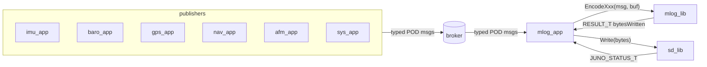
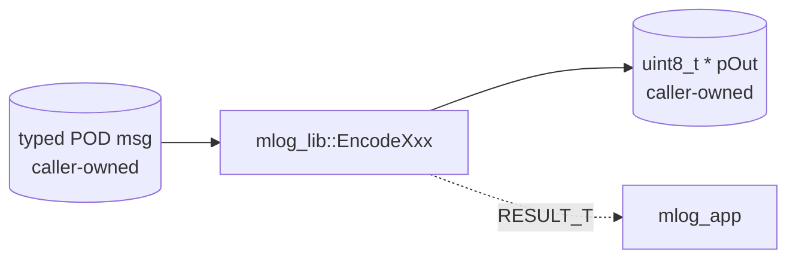
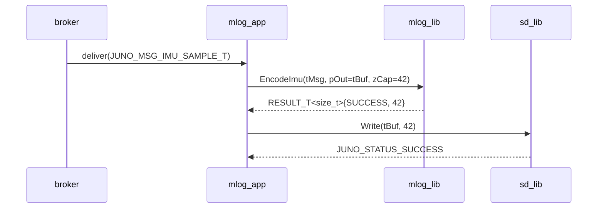
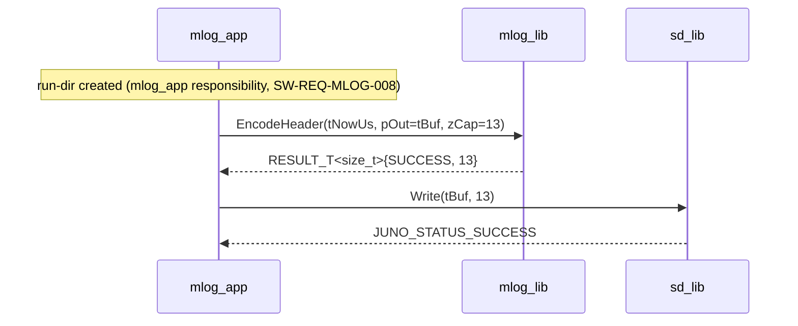

# Mission Log Library (`mlog_lib`) — Design (L2)

**Document type:** IEEE 1016 Software Design Description
**Module:** `mlog_lib` (mission-log binary record encoder)
**Header path:** `libs/mlog_lib/include/mlog_lib/mlog_api.hpp`
**Namespace:** `juno::mlog`
**Reference (do not contradict):** `docs/design/conventions.md` (cross-module names, idioms), `docs/design/system/system_design.md` (composition, `JUNO_MSG_MLOG_RECORD_T`).
**Coverage:** `SW-REQ-MLOG-001` through `SW-REQ-MLOG-014`.

---

<!-- @{"design": ["SW-REQ-MLOG-001", "SW-REQ-MLOG-002", "SW-REQ-MLOG-003", "SW-REQ-MLOG-004", "SW-REQ-MLOG-005", "SW-REQ-MLOG-006", "SW-REQ-MLOG-009", "SW-REQ-MLOG-010", "SW-REQ-MLOG-014"]} -->
## 1. Purpose and Scope

`mlog_lib` is the pure-compute encoder that serializes Juno FSW mission-log records into a compact, self-describing binary wire format. It is the single source of truth for log record byte layout. `mlog_app` (a separate L2 design) owns the bus subscriptions, the SD-write loop, the SD `sd_lib` handle, and the run directory; `mlog_lib` owns **only** the byte layout — it converts in-memory POD message structs (`JUNO_MSG_IMU_SAMPLE_T`, `JUNO_MSG_BARO_SAMPLE_T`, `JUNO_MSG_GPS_NMEA_RAW_T`, `JUNO_MSG_GPS_UTC_T`, `JUNO_MSG_NAV_STATE_T`, `JUNO_MSG_AFM_PHASE_T`, `JUNO_MSG_SYS_HEALTH_T`, `JUNO_MSG_SYS_POST_T`) into caller-supplied byte buffers.

The library addresses `SW-REQ-MLOG-001` through `SW-REQ-MLOG-014`.

In scope: record-kind enumeration, common record header (kind tag + monotonic-µs timestamp), per-kind payload layout, endianness fixation, deterministic byte production, schema version (record-0 of each run), POSIX/Pico2 functional equivalence of the encoder, status propagation when caller-buffer capacity is insufficient.

Out of scope: SD card I/O (delegated to `sd_lib`), bus subscription / cycle scheduling (owned by `mlog_app`), run-directory creation policy and prior-run preservation enforcement (owned by `mlog_app` over `sd_lib`), in-flight decoding (offline parser tool is mentioned only — not designed here), CRC / integrity sealing (deferred; FT1 relies on SD filesystem journaling). `mlog_lib` does not touch the bus directly.

---

## 2. Definitions and Abbreviations

Cross-module vocabulary (phase enum, time base, frames, status semantics, message naming) is defined in `docs/design/conventions.md` §4 and inherited verbatim. Module-local terms only:

| Term | Meaning |
|------|---------|
| Record | One self-describing serialized log entry: `[kind:1][tTimestampUs:8][payload:variable]` |
| Record kind | `MLOG_KIND_T` enum tag identifying the payload schema (1 byte) |
| Wire byte | Output byte in the caller-supplied buffer; little-endian for all multi-byte scalars |
| Header | Common 9-byte prefix (`kind` + `tTimestampUs`) on every record |
| Schema version | `kMlogSchemaVersion` constexpr; emitted as record-0 (`MLOG_KIND_HEADER`) of each new run |
| Pure compute | Encoding only; no side effects, no I/O, no internal mutable state |

`JUNO_TIME_US_T = uint64_t` (`docs/design/conventions.md` §4.2 / `SW-REQ-SYS-026`); identical type used as the per-record timestamp (`SW-REQ-MLOG-007`).

---

<!-- @{"design": ["SW-REQ-MLOG-010", "SW-REQ-MLOG-013", "SW-REQ-MLOG-014"]} -->
## 3. System Overview

### 3.1 MVC layer mapping

| Layer | Realization | Notes |
|-------|-------------|-------|
| View (App) | `mlog_app` (separate L2) | Subscribes to bus, calls `mlog_lib` encoders, hands bytes to `sd_lib` |
| Controller (Lib) | `mlog_lib` | Pure compute encoder; no bus, no SD |
| Model (Bus) | `libjuno/sb/broker_api.h` (used by `mlog_app`, **not** `mlog_lib`) | `JUNO_MSG_MLOG_RECORD_T` is published only as a sink confirmation — see `docs/design/system/system_design.md` §4 |

`mlog_lib` is **pure compute**: caller passes in a typed message struct and a writable byte span; `mlog_lib` returns bytes-written or a status. There is no platform split (no POSIX vs Pico2 IMPL divergence) because the encoder uses no peripherals and no platform headers — the same `MLOG_LIB_IMPL_T` source builds for both targets (`SW-REQ-MLOG-013`, `docs/design/conventions.md` §6 deliberate-divergence-with-rationale clause).

### 3.2 Module in context



`mlog_lib` has exactly two callers in the FSW: `mlog_app` (production path) and the Google Test fixtures for `SW-REQ-MLOG-014` determinism verification. It has zero subscribers and zero downstream calls; it never touches `broker`, `sd_lib`, `time_lib`, or any peripheral.

### 3.3 LibJuno C++ pattern

Per `docs/design/conventions.md` §1.1–§1.3 (C++ template), `mlog_lib` follows the standard `ROOT_T` / `API_T` / `IMPL_T` triple. There is **one** `MLOG_LIB_IMPL_T` (no `posix/` or `pico2/` subfolder) because the encoder is pure compute (`SW-REQ-MLOG-013`).

```cpp
namespace juno::mlog
{

struct MLOG_LIB_ROOT_T;

struct MLOG_LIB_API_T
{
    RESULT_T<size_t> (&EncodeImu)   (MLOG_LIB_ROOT_T &tRoot, const JUNO_MSG_IMU_SAMPLE_T  &tMsg, uint8_t *pOut, size_t zCap) noexcept;
    RESULT_T<size_t> (&EncodeBaro)  (MLOG_LIB_ROOT_T &tRoot, const JUNO_MSG_BARO_SAMPLE_T &tMsg, uint8_t *pOut, size_t zCap) noexcept;
    RESULT_T<size_t> (&EncodeGpsNmea)(MLOG_LIB_ROOT_T &tRoot, const JUNO_MSG_GPS_NMEA_RAW_T &tMsg, uint8_t *pOut, size_t zCap) noexcept;
    RESULT_T<size_t> (&EncodeGpsUtc)(MLOG_LIB_ROOT_T &tRoot, const JUNO_MSG_GPS_UTC_T     &tMsg, uint8_t *pOut, size_t zCap) noexcept;
    RESULT_T<size_t> (&EncodeNav)   (MLOG_LIB_ROOT_T &tRoot, const JUNO_MSG_NAV_STATE_T   &tMsg, uint8_t *pOut, size_t zCap) noexcept;
    RESULT_T<size_t> (&EncodePhase) (MLOG_LIB_ROOT_T &tRoot, const JUNO_MSG_AFM_PHASE_T   &tMsg, uint8_t *pOut, size_t zCap) noexcept;
    RESULT_T<size_t> (&EncodeHealth)(MLOG_LIB_ROOT_T &tRoot, const JUNO_MSG_SYS_HEALTH_T  &tMsg, uint8_t *pOut, size_t zCap) noexcept;
    RESULT_T<size_t> (&EncodePost)  (MLOG_LIB_ROOT_T &tRoot, const JUNO_MSG_SYS_POST_T    &tMsg, uint8_t *pOut, size_t zCap) noexcept;
    RESULT_T<size_t> (&EncodeHeader)(MLOG_LIB_ROOT_T &tRoot, JUNO_TIME_US_T tTimestampUs,         uint8_t *pOut, size_t zCap) noexcept;
};

struct MLOG_LIB_ROOT_T JUNO_MODULE_ROOT(MLOG_LIB_API_T,
    /* no shared mutable state — encoder is purely functional */
);

struct MLOG_LIB_IMPL_T JUNO_MODULE_DERIVE(MLOG_LIB_ROOT_T,
    static RESULT_T<size_t> EncodeImu   (MLOG_LIB_ROOT_T &, const JUNO_MSG_IMU_SAMPLE_T &,   uint8_t *, size_t) noexcept;
    /* ... one static per Encode* ... */
    static RESULT_T<MLOG_LIB_IMPL_T> New(
        JUNO_FAILURE_HANDLER_T pfcnFailureHandler,
        JUNO_USER_DATA_T      *pvUserData
    ) noexcept;
);

} // namespace juno::mlog
```

The vtable `tApi` is wired once inside `New()` as a `static` local and never reassigned (`docs/design/conventions.md` §1.2). No constructors / destructors on `MLOG_LIB_ROOT_T` or `MLOG_LIB_IMPL_T`.

---

<!-- @{"design": ["SW-REQ-MLOG-001", "SW-REQ-MLOG-002", "SW-REQ-MLOG-003", "SW-REQ-MLOG-004", "SW-REQ-MLOG-005", "SW-REQ-MLOG-006", "SW-REQ-MLOG-007", "SW-REQ-MLOG-010", "SW-REQ-MLOG-011"]} -->
## 4. Interface Definitions

All public API functions live in `MLOG_LIB_API_T`. Every function reference is `noexcept` (`docs/design/conventions.md` §1.3, §10 of `temp_api.hpp`). Common contract: caller owns `pOut`, supplies its capacity in `zCap`, receives `RESULT_T<size_t>` carrying bytes-written on success.

### 4.1 Common contract template

Each Encode* shares this contract; per-kind specifics in §4.2 table and §6 layout.

| Attribute | Value |
|-----------|-------|
| Signature | `RESULT_T<size_t> Encode<Kind>(MLOG_LIB_ROOT_T &tRoot, const <MsgT> &tMsg, uint8_t *pOut, size_t zCap) noexcept` |
| Preconditions | `pOut != nullptr`; `zCap >= <kindBytes>` (per §4.2). Phase: `tMsg.ePhase ∈ {PRE_LAUNCH, BOOST, APOGEE, DESCENT, LANDING}` (`docs/design/conventions.md` §4.1). NMEA: `tMsg.zLen <= kMlogNmeaMaxBytes` (=120) |
| Postconditions | `pOut[0..n-1]` filled per §6 layout; `tResult.tOk == n` |
| Error conditions | `JUNO_STATUS_NULLPTR_ERROR` (`pOut==nullptr`); `JUNO_STATUS_INVALID_SIZE_ERROR` (`zCap` too small for the chosen kind's record); `JUNO_STATUS_INVALID_DATA_ERROR` (NMEA `tMsg.zLen > kMlogNmeaMaxBytes` — caller violated the documented input bound) |
| Thread safety | Pure / reentrant; no shared mutable state |

Doxygen header preview (representative):

```cpp
/**
 * @brief Encode an IMU sample record (MLOG_KIND_IMU) to the caller buffer.
 * @param tRoot Module root (unused; carried for API uniformity).
 * @param tMsg Caller-owned IMU sample message (immutable from lib's view).
 * @param pOut Caller-owned destination buffer (>= 42 bytes).
 * @param zCap Capacity of pOut in bytes.
 * @return RESULT_T<size_t> with tOk=42 on success.
 */
RESULT_T<size_t> EncodeImu(MLOG_LIB_ROOT_T &tRoot,
    const JUNO_MSG_IMU_SAMPLE_T &tMsg, uint8_t *pOut, size_t zCap) noexcept;
```

### 4.2 Per-kind size summary

| Function | Kind tag | Required `zCap` | Source message | Req |
|----------|----------|-----------------|----------------|-----|
| `EncodeHeader` | `MLOG_KIND_HEADER=0x00` | 13 | (none; `tTimestampUs` + `kMlogSchemaVersion`) | `MLOG-008`, `MLOG-010` |
| `EncodeImu` | `MLOG_KIND_IMU=0x01` | 42 (`kMlogImuRecordBytes`) | `JUNO_MSG_IMU_SAMPLE_T` | `MLOG-001` |
| `EncodeBaro` | `MLOG_KIND_BARO=0x02` | 22 | `JUNO_MSG_BARO_SAMPLE_T` | `MLOG-002` |
| `EncodeGpsNmea` | `MLOG_KIND_GPS_NMEA=0x03` | `11 + tMsg.zLen` (≤131) | `JUNO_MSG_GPS_NMEA_RAW_T` | `MLOG-003` |
| `EncodeGpsUtc` | `MLOG_KIND_GPS_UTC=0x04` | 21 | `JUNO_MSG_GPS_UTC_T` | `MLOG-006` |
| `EncodeNav` | `MLOG_KIND_NAV=0x05` | 82 | `JUNO_MSG_NAV_STATE_T` | `MLOG-004` |
| `EncodePhase` | `MLOG_KIND_PHASE=0x06` | 18 | `JUNO_MSG_AFM_PHASE_T` | `MLOG-005` |
| `EncodeHealth` | `MLOG_KIND_HEALTH=0x07` | 13 | `JUNO_MSG_SYS_HEALTH_T` | `MLOG-010` |
| `EncodePost` | `MLOG_KIND_POST=0x08` | 13 | `JUNO_MSG_SYS_POST_T` | `MLOG-010` |

### 4.3 Status code mapping (`SW-REQ-MLOG-011` boundary)

`mlog_lib` returns the encoder-side error only (capacity / nullptr). SD-write failures originate inside `sd_lib` and are propagated through `mlog_app` to the caller of `mlog_app` (`SW-REQ-MLOG-011`); `mlog_lib` itself never owns the SD result. The chain: `sd_lib` → `mlog_app` → caller; `mlog_lib`'s contribution is the encoder status only.

---

<!-- @{"design": ["SW-REQ-MLOG-014"]} -->
## 5. State Machines

No internal state machine; module is functionally pure given inputs.

`mlog_lib` carries no mutable members in `MLOG_LIB_ROOT_T`; every Encode* call is a pure function of its arguments and `kMlogSchemaVersion` (a `static constexpr`). This is the structural precondition for `SW-REQ-MLOG-014` (deterministic byte output): identical inputs unconditionally produce identical bytes because there is no hidden state to vary across calls or across builds.

---

<!-- @{"design": ["SW-REQ-MLOG-001", "SW-REQ-MLOG-002", "SW-REQ-MLOG-003", "SW-REQ-MLOG-004", "SW-REQ-MLOG-005", "SW-REQ-MLOG-006", "SW-REQ-MLOG-007", "SW-REQ-MLOG-010"]} -->
## 6. Data Flow — Wire Format

`mlog_lib` does not touch the bus directly. The library is invoked by `mlog_app` after `mlog_app` has dequeued a typed POD message from the broker. `mlog_lib` reads the input message struct (caller-owned, immutable from its perspective) and writes bytes into the caller-owned `pOut` buffer.



### 6.1 Common record header (every kind)

All multi-byte scalars are **little-endian** (LE). LE was chosen because both target platforms (POSIX x86-64 host, RP2350 ARM Cortex-M33) are LE natively, eliminating any byte-swap on either build (`SW-REQ-MLOG-013`, `SW-REQ-MLOG-014`).

| Offset | Size | Field | Type | Notes |
|-------:|-----:|-------|------|-------|
| 0 | 1 | `eKind` | `MLOG_KIND_T` (uint8_t) | Record kind tag (per §6.10) |
| 1 | 8 | `tTimestampUs` | `JUNO_TIME_US_T` (uint64_t LE) | Monotonic µs (`SW-REQ-MLOG-007`) |
| 9 | … | payload | per kind | (sections 6.2–6.9) |

Common header size = **9 bytes**. Per-record total size = 9 + per-kind payload size (table §6.10).

### 6.2 IMU sample record — `MLOG_KIND_IMU = 0x01` (42 bytes)

`SW-REQ-MLOG-001`. Source struct: `JUNO_MSG_IMU_SAMPLE_T` (`docs/design/system/system_design.md` §4: `tTimestampUs`, `tAccel[3]` m/s², `tGyro[3]` rad/s, `bValid`).

| Offset | Size | Field | Type | Notes |
|-------:|-----:|-------|------|-------|
| 0 | 9 | header | — | `eKind=0x01`, `tTimestampUs` |
| 9 | 4 | `fAccelX` | float LE (IEEE-754 binary32) | m/s² |
| 13 | 4 | `fAccelY` | float LE | m/s² |
| 17 | 4 | `fAccelZ` | float LE | m/s² |
| 21 | 4 | `fGyroX` | float LE | rad/s |
| 25 | 4 | `fGyroY` | float LE | rad/s |
| 29 | 4 | `fGyroZ` | float LE | rad/s |
| 33 | 8 | `tSensorTimeUs` | uint64_t LE | sensor-side timestamp (if available; else 0) |
| 41 | 1 | `u8Flags` | uint8_t | bit0 = `bValid` |

### 6.3 Baro sample record — `MLOG_KIND_BARO = 0x02` (22 bytes)

`SW-REQ-MLOG-002`. Source: `JUNO_MSG_BARO_SAMPLE_T`.

| Offset | Size | Field | Type | Notes |
|-------:|-----:|-------|------|-------|
| 0 | 9 | header | — | `eKind=0x02` |
| 9 | 4 | `fPressurePa` | float LE | Pa |
| 13 | 4 | `fAltMHae` | float LE | m HAE (`SW-REQ-SYS-039`) |
| 17 | 4 | `fTempC` | float LE | °C |
| 21 | 1 | `u8Flags` | uint8_t | bit0 = `bValid` |

### 6.4 GPS NMEA record — `MLOG_KIND_GPS_NMEA = 0x03` (variable, 11 + N)

`SW-REQ-MLOG-003`. Verbatim copy of NMEA sentence bytes (`SW-REQ-SYS-024`).

| Offset | Size | Field | Type | Notes |
|-------:|-----:|-------|------|-------|
| 0 | 9 | header | — | `eKind=0x03` |
| 9 | 2 | `u16Len` | uint16_t LE | Sentence byte length, `1..120` |
| 11 | N | `acSentence[N]` | uint8_t[] | Verbatim NMEA bytes including `$` and CR/LF as received |

`kMlogNmeaMaxBytes = 120` (NMEA-0183 max sentence length 82 chars + slack).

### 6.5 GPS UTC record — `MLOG_KIND_GPS_UTC = 0x04` (21 bytes)

`SW-REQ-MLOG-006`. Source: `JUNO_MSG_GPS_UTC_T`.

| Offset | Size | Field | Type | Notes |
|-------:|-----:|-------|------|-------|
| 0 | 9 | header | — | `eKind=0x04` |
| 9 | 2 | `u16Year` | uint16_t LE | e.g., 2026 |
| 11 | 1 | `u8Mon` | uint8_t | 1..12 |
| 12 | 1 | `u8Day` | uint8_t | 1..31 |
| 13 | 1 | `u8Hr` | uint8_t | 0..23 |
| 14 | 1 | `u8Min` | uint8_t | 0..59 |
| 15 | 1 | `u8Sec` | uint8_t | 0..60 (leap second) |
| 16 | 4 | `u32Us` | uint32_t LE | sub-second µs |
| 20 | 1 | `u8Flags` | uint8_t | reserved |

### 6.6 Navigation state record — `MLOG_KIND_NAV = 0x05` (82 bytes)

`SW-REQ-MLOG-004`. Source: `JUNO_MSG_NAV_STATE_T` (16-state nav per `SW-REQ-SYS-013`; geodetic position per `SW-REQ-SYS-038`/`-039`; NED velocity per `SW-REQ-SYS-040`; quaternion per `SW-REQ-SYS-041`).

| Offset | Size | Field | Type | Notes |
|-------:|-----:|-------|------|-------|
| 0 | 9 | header | — | `eKind=0x05` |
| 9 | 8 | `dLatDeg` | double LE | WGS-84 lat (deg) |
| 17 | 8 | `dLonDeg` | double LE | WGS-84 lon (deg) |
| 25 | 4 | `fAltMHae` | float LE | HAE (m); narrowed from `tNav.tPosLla[2]` (`double`) — intentional precision reduction for record compactness per `SW-REQ-SYS-042` wire-format precision contract; ~4 cm resolution at 600 m apogee, adequate for FT1 mission log |
| 29 | 12 | `tVelNed[3]` | float LE × 3 | N, E, D (m/s) |
| 41 | 16 | `tQuatBodyToNed` | float LE × 4 | w, x, y, z |
| 57 | 12 | `tAccelBias[3]` | float LE × 3 | m/s² |
| 69 | 12 | `tGyroBias[3]` | float LE × 3 | rad/s |
| 81 | 1 | `u8Flags` | uint8_t | bit0 = `bValid` (`SW-REQ-SYS-015`) |

### 6.7 AFM phase event record — `MLOG_KIND_PHASE = 0x06` (18 bytes)

`SW-REQ-MLOG-005`. Source: `JUNO_MSG_AFM_PHASE_T`.

| Offset | Size | Field | Type | Notes |
|-------:|-----:|-------|------|-------|
| 0 | 9 | header | — | `eKind=0x06` |
| 9 | 1 | `ePhase` | `JUNO_PHASE_T` (uint8_t) | Canonical enum (`docs/design/conventions.md` §4.1) |
| 10 | 8 | `tTransitionUs` | uint64_t LE | µs of transition (`SW-REQ-SYS-018`) |

### 6.8 System health record — `MLOG_KIND_HEALTH = 0x07` (13 bytes)

| Offset | Size | Field | Type | Notes |
|-------:|-----:|-------|------|-------|
| 0 | 9 | header | — | `eKind=0x07` |
| 9 | 4 | `u32HealthBitmap` | uint32_t LE | per-sensor flags (`SW-REQ-SYS-031`) |

### 6.9 POST result record — `MLOG_KIND_POST = 0x08` (13 bytes)

| Offset | Size | Field | Type | Notes |
|-------:|-----:|-------|------|-------|
| 0 | 9 | header | — | `eKind=0x08` |
| 9 | 4 | `u32PostBitmap` | uint32_t LE | per-sensor pass/fail (`SW-REQ-SYS-030`) |

### 6.10 Record kind table

```cpp
namespace juno::mlog {
enum class MLOG_KIND_T : uint8_t {
    MLOG_KIND_HEADER   = 0x00,  // schema version, record-0
    MLOG_KIND_IMU      = 0x01,
    MLOG_KIND_BARO     = 0x02,
    MLOG_KIND_GPS_NMEA = 0x03,
    MLOG_KIND_GPS_UTC  = 0x04,
    MLOG_KIND_NAV      = 0x05,
    MLOG_KIND_PHASE    = 0x06,
    MLOG_KIND_HEALTH   = 0x07,
    MLOG_KIND_POST     = 0x08,
};
static constexpr uint32_t kMlogSchemaVersion = 1u; // record-0 payload
}
```

The log is **append-only**; `mlog_lib` has no concept of seek or random access. Records are written in the order `mlog_app` produces them; the offline parser tool (out of scope for this design — referenced for completeness only) reconstructs streams by scanning kind tags sequentially.

---

<!-- @{"design": ["SW-REQ-MLOG-001", "SW-REQ-MLOG-007", "SW-REQ-MLOG-008", "SW-REQ-MLOG-010", "SW-REQ-MLOG-011", "SW-REQ-MLOG-012"]} -->
## 7. Sequence Diagrams

### 7.1 Nominal IMU record encode and write



### 7.2 New run open — emit schema-version header



### 7.3 Buffer too small — capacity error path

```mermaid
sequenceDiagram
    participant mlog_app
    participant mlog_lib

    mlog_app->>mlog_lib: EncodeNav(tMsg, pOut, zCap=10)
    Note over mlog_lib: zCap < kMlogNavRecordBytes (82)
    mlog_lib-->>mlog_app: RESULT_T<size_t>{INVALID_SIZE_ERROR, 0}
    Note over mlog_app: SW-REQ-MLOG-012 — continue<br/>(do not halt; try next record)
```

### 7.4 SD write failure — error propagated through `mlog_app`

```mermaid
sequenceDiagram
    participant mlog_app
    participant mlog_lib
    participant sd_lib

    mlog_app->>mlog_lib: EncodeImu(tMsg, pOut, zCap)
    mlog_lib-->>mlog_app: RESULT_T<size_t>{SUCCESS, 42}
    mlog_app->>sd_lib: Write(pOut, 42)
    sd_lib-->>mlog_app: JUNO_STATUS_WRITE_ERROR
    Note over mlog_app: SW-REQ-MLOG-011: surface failure;<br/>SW-REQ-MLOG-012: accept next record;<br/>sys_app sets SD health bit (SW-REQ-SYS-060)
```

`mlog_lib` itself never sees the SD result — its encoder calls remain pure / successful even when a subsequent SD write fails.

---

## 8. Timing and Scheduling Analysis

`mlog_lib` is invoked from `mlog_app::OnProcess()` at `kMlogAppPeriodMs = 5` ms (`docs/design/conventions.md` §4.5; matches `kImuAppPeriodMs` to satisfy `SW-REQ-SYS-011` no-downsampling for full-rate IMU logging). Per 5 ms tick the worst case is one of each kind dequeued from the broker:

| Kind | Worst-case calls / 5 ms | Bytes / call |
|------|-------------------------|--------------|
| IMU | 1 (200 Hz; one sample per 5 ms tick) | 42 |
| BARO | 1 (20 Hz, 1-of-10 ticks) | 22 |
| GPS_NMEA | 1 (≤5 Hz, 1-of-40 ticks) | up to 131 |
| GPS_UTC | aperiodic | 21 |
| NAV | 1 (100 Hz, 1-of-2 ticks) | 82 |
| PHASE | on-change only | 18 |
| HEALTH | 1 (10 Hz, 1-of-20 ticks) | 13 |
| POST | one-shot at boot | 13 |

Per-call cost is bounded: each Encode* is a fixed straight-line write of ≤82 named bytes (NMEA path is `memcpy(zLen ≤ 120)`); no loops with data-dependent bounds, no floats parsed, no recursion. On RP2350 @ 150 MHz the largest encode (NAV, 82 B) is well under 5 µs; total `mlog_lib` time per 5 ms tick is <50 µs and fits comfortably even in the halved slot budget (was 10 ms; now 5 ms per S1-AI-005). `mlog_app` must complete its slot within 5 ms; `mlog_lib` is a small fraction of that budget. Actual measured WCET numbers (when collected from the unit-perf bench) are unaffected by the budget change — only the slot ceiling halves.

Downstream consumers of `mlog_lib` output: `mlog_app` only, then `sd_lib`. There are no further consumers in flight; the byte stream is consumed offline by the parser tool (out of scope).

Determinism (`SW-REQ-MLOG-014`) is guaranteed by: no internal state, no allocation, no platform-specific code paths, fixed LE byte order, and `static constexpr kMlogSchemaVersion` (no env vars, no time injected at encode time except via the explicit argument).

---

<!-- @{"design": ["SW-REQ-MLOG-011", "SW-REQ-MLOG-012", "SW-REQ-MLOG-013"]} -->
## 9. Error Handling Strategy

1. **Status propagation.** Every Encode* returns `RESULT_T<size_t>`. Callers (i.e., `mlog_app`) must use `JUNO_ASSERT_OK(tRes, ...)` (`docs/design/conventions.md` §4.3); bare `if`-return is a review failure.
2. **Failure handlers.** `pfcnFailureHandler` injected via `New()` is called with a context string on `JUNO_STATUS_NULLPTR_ERROR` / `JUNO_STATUS_INVALID_SIZE_ERROR` / `JUNO_STATUS_INVALID_DATA_ERROR`. **Failure handlers are diagnostic-only and do not alter control flow** (`docs/design/conventions.md` §4.3).
3. **Encoder error codes.** `JUNO_STATUS_SUCCESS` (bytes written; `tOk == record size`); `JUNO_STATUS_NULLPTR_ERROR` (`pOut == nullptr`); `JUNO_STATUS_INVALID_SIZE_ERROR` (`zCap < required record size` per `conventions.md` §4.8 — caller-provided buffer capacity invalid); `JUNO_STATUS_INVALID_DATA_ERROR` (NMEA path: `tMsg.zLen > kMlogNmeaMaxBytes` — input data violates documented contract).
4. **No SD-write coupling.** `mlog_lib` does not call `sd_lib` and does not see SD errors; `SW-REQ-MLOG-011`'s SD-write failure status is propagated by `mlog_app` from the `sd_lib` return value, after `mlog_lib`'s encoder has already returned successfully (§7.4). The system-level SD-unhealthy bit is set by `sys_app` from the `mlog_app`-published health input (`SW-REQ-SYS-060`). `mlog_lib` itself contributes zero to the health bitmap.
5. **Continue-after-failure (`SW-REQ-MLOG-012`).** Pure functions cannot "halt"; a failed Encode* return value is simply observed by `mlog_app`, which proceeds to the next dequeued message on its next slot (or even within the same slot). `mlog_lib` carries no per-call latch state that a prior failure could corrupt.
6. **Exceptions banned.** `-fno-exceptions` (`SW-REQ-SYS-053`); every Encode* is `noexcept`. No `try`, `throw`, `catch`. No `std::sprintf` or any heap-allocating formatter — encoding uses only direct `memcpy` of fixed-size scalars and the verbatim NMEA blob.

---

<!-- @{"design": ["SW-REQ-MLOG-013", "SW-REQ-MLOG-014"]} -->
## 10. Memory Ownership

`mlog_lib` allocates **zero** bytes at runtime. All buffers are caller-owned (`docs/design/conventions.md` §5).

| Buffer / facility | Owner | Lifetime | Allocation |
|-------------------|-------|----------|------------|
| `pOut` byte buffer | caller (`mlog_app`'s static `tRecordBuf[kRecordBufBytes]`) | program lifetime | Static |
| Input message struct (`tMsg`) | caller (delivered by broker into `mlog_app` static slot) | per-cycle | Static, immutable from `mlog_lib`'s view |
| `MLOG_LIB_IMPL_T` | composition root (`apps/main.cpp`) | program lifetime | Static, `.bss` zero-init |
| Vtable `tApi` | `New()` factory, file-scope `static` local | program lifetime | Read-only after construction |
| (none) | — | — | No internal pools, no scratch buffers |

Asserted invariants (per `docs/design/conventions.md` §5 and `ai/memory/constraints.md`):

- Caller owns all storage; no allocation inside `mlog_lib`.
- No `new`, `delete`, `malloc`, `calloc`, `realloc`, `free`, no heap-backed STL containers (`SW-REQ-SYS-050`).
- No global mutable state; no constructors / destructors on `MLOG_LIB_ROOT_T` or `MLOG_LIB_IMPL_T`.
- No virtual, no RTTI, no exceptions.
- No `std::sprintf` or any heap-allocating formatter; encoding uses `memcpy` of fixed-size scalars and the verbatim NMEA payload.
- `kMlogSchemaVersion` is `static constexpr`; the only file-scope datum is the read-only `tApi` vtable.

---

## 11. Traceability

Per-section `<!-- @{"design": [...]} -->` tags above are authoritative; this table is descriptive consolidation. Every `SW-REQ-MLOG-NNN` is mapped to at least one section.

| Req ID | Title | Section(s) |
|--------|-------|-----------|
| SW-REQ-MLOG-001 | Raw IMU Record API | §1, §4.1, §4.2, §6.2, §7.1 |
| SW-REQ-MLOG-002 | Raw Barometer Record API | §1, §4.2, §6.3 |
| SW-REQ-MLOG-003 | Raw GPS NMEA Record API | §1, §4.2, §6.4 |
| SW-REQ-MLOG-004 | Navigation State Record API | §1, §4.2, §6.6 |
| SW-REQ-MLOG-005 | AFM Phase Event Record API | §1, §4.2, §6.7 |
| SW-REQ-MLOG-006 | GPS UTC Time Record API | §1, §4.2, §6.5 |
| SW-REQ-MLOG-007 | Per-Record Monotonic Microsecond Timestamp | §4.1 (all kinds), §6.1 |
| SW-REQ-MLOG-008 | New Run Created at Initialization | §4.2 (EncodeHeader), §7.2 (mlog_app calls EncodeHeader) |
| SW-REQ-MLOG-009 | Prior Run Preservation | §1 (out-of-scope delegation note); enforced by `mlog_app` over `sd_lib` |
| SW-REQ-MLOG-010 | Machine-Parseable Record Format | §1, §4.2, §6, §6.10 |
| SW-REQ-MLOG-011 | Write Failure Status Propagation | §4.3, §7.4, §9 |
| SW-REQ-MLOG-012 | Continue After Write Failure | §7.3, §7.4, §9 |
| SW-REQ-MLOG-013 | POSIX/Pico2 Functional Equivalence | §3.3, §6.1 (LE for both targets), §10 |
| SW-REQ-MLOG-014 | Deterministic Record Output | §5, §6.1, §8, §10 |

POSIX/Pico2 functional equivalence (`SW-REQ-SYS-043` → `SW-REQ-MLOG-013`): the encoder is pure compute with no platform-specific code paths; a single `MLOG_LIB_IMPL_T` source file builds for both `PLATFORM=POSIX` and `PLATFORM=PICO2`. Both targets are little-endian natively; output byte sequences are bit-identical for identical inputs. This is the deliberate-no-platform-split documented per `docs/design/conventions.md` §6.

`SW-REQ-MLOG-008` (new run at init) and `SW-REQ-MLOG-009` (prior run preservation) describe the `mlog_app`/`sd_lib` interaction — `mlog_lib`'s contribution is providing the `EncodeHeader` entry point for the run-open sequence (§7.2). Filesystem-level enforcement (`-009`) is fully delegated to `sd_lib` semantics and `mlog_app` policy and is outside `mlog_lib`'s API surface.
