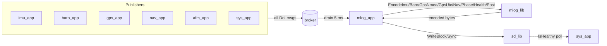
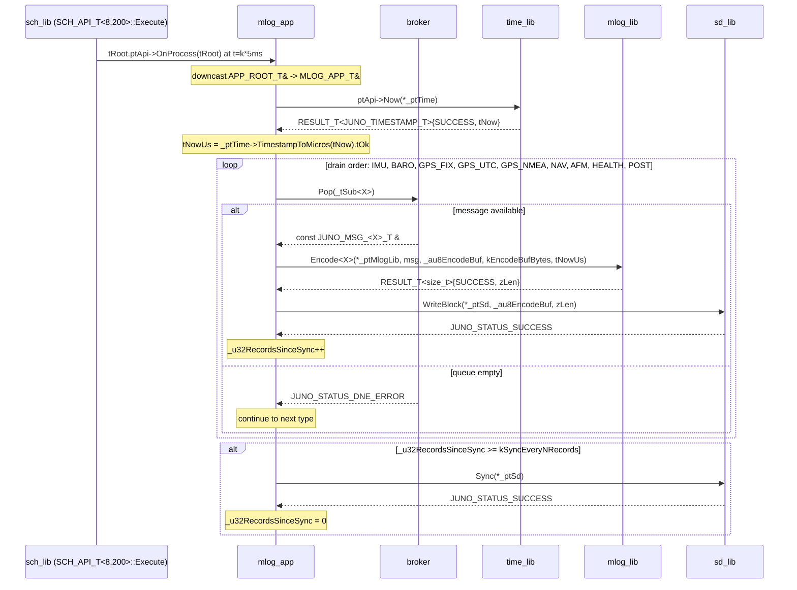

# mlog_app — Software Design Description (L2)

**Document type:** IEEE 1016 Software Design Description
**Module:** `mlog_app` (View / scheduled application)
**Authoritative for:** Mission-log persistence path from the software bus to the SD card.
**Reference (do not contradict):** `docs/design/conventions.md`, `docs/design/system/system_design.md`, `libjuno/include/juno/app/app_api.hpp`.

---

<!-- @{"design": ["SW-REQ-MLOG-APP-001", "SW-REQ-MLOG-APP-002", "SW-REQ-MLOG-APP-011"]} -->
## 1. Purpose and Scope

`mlog_app` is the View-layer application that drains every data-of-interest software-bus message each TDM tick, hands each drained message to `mlog_lib` for record encoding, and forwards the encoded bytes to `sd_lib` for non-volatile persistence. It addresses every requirement in `docs/requirements/mlog_app/requirements.json` — `SW-REQ-MLOG-APP-001` through `SW-REQ-MLOG-APP-012` — and is the system-side terminus of `SW-REQ-SYS-001` (raw sensor logging) and `SW-REQ-SYS-022` (SD log content).

In scope: software-bus subscription set, per-tick drain order, delegation contracts to `mlog_lib::Encode*` and `sd_lib::WriteBlock` / `sd_lib::Sync`, monotonic-µs timestamping at forward time, SD-write failure continuation, and (per PM Decision 3) zero bus publication — SD health is exposed via `sd_lib::IsHealthy()` polled by `sys_app`.

Out of scope: record byte format (owned by `mlog_lib` per `SW-REQ-MLOG-010`); SD filesystem layout, run-directory creation, transient retry, and capacity reporting (owned by `sd_lib` per `SW-REQ-SD-003` / `SW-REQ-SD-004` / `SW-REQ-SD-008`); SD health bitmap aggregation (owned by `sys_app` per `SW-REQ-SYS-060`); broker implementation; LoRa telemetry; nav, AFM, IMU, baro, GPS, telem, and sys app internals.

---

## 2. Definitions and Abbreviations

Cross-module vocabulary (phase enum, time base, frames, status semantics, message naming, scheduler period units, app lifecycle hooks) is defined in `docs/design/conventions.md` §4 and `libjuno/include/juno/app/app_api.hpp`, and is **not** redefined here. Module-local terms only:

| Term | Meaning |
|------|---------|
| Drain | One pass over each subscribed broker queue, popping every available message of that type during the current 5 ms slot |
| Forward | Encode (via `mlog_lib`) plus write (via `sd_lib::WriteBlock`) — the unit of work per drained message |
| Record | An encoded byte sequence emitted by `mlog_lib::Encode*`; opaque to `mlog_app` |
| Sync cadence | Periodic `sd_lib::Sync` invocation interval, expressed as records-since-last-sync |
| `JUNO_TIME_US_T` | `uint64_t` monotonic microseconds since startup (`conventions.md` §4.2) |
| `APP_ROOT_T` | `juno::app::APP_ROOT_T` aggregate from `libjuno/include/juno/app/app_api.hpp` carrying the `APP_API_T` vtable |
| `APP_API_T` | `juno::app::APP_API_T { OnStart, OnProcess, OnExit }` vtable (LibJuno canonical) |
| SD-health query | `sd_lib::IsHealthy()` — pull-mode boolean polled by `sys_app` (no `mlog_app` push publication; PM Decision 3) |

---

<!-- @{"design": ["SW-REQ-MLOG-APP-001", "SW-REQ-MLOG-APP-002", "SW-REQ-MLOG-APP-007", "SW-REQ-MLOG-APP-008", "SW-REQ-MLOG-APP-010"]} -->
## 3. System Overview

### 3.1 MVC layer mapping

| Layer | Realization |
|-------|-------------|
| View (App) | `juno::mlog_app::MLOG_APP_T` — embeds `juno::app::APP_ROOT_T tRoot` as first member; **publishes no bus messages** (PM Decision 3) |
| Controller (Lib) | `juno::mlog::MLOG_LIB_ROOT_T` (encoding); `juno::sd::SD_LIB_ROOT_T<juno::sd::kDefaultWriteBufBlocks>` (storage I/O, health query — templated per `sd/design.md`) |
| Model (Bus) | LibJuno templated `juno::sb::BROKER_ROOT_T<JUNO_MSG_BUS_VARIANT_T, /*PipeN=*/8, /*RegCapacity=*/64>`; `mlog_app` is purely a subscriber on the input side and emits no bus traffic on the output side |

`mlog_app` carries **no business logic**: every encoding decision is delegated to `mlog_lib`, every byte placement is delegated to `sd_lib`. The app is a deterministic forwarding glue layer (`SW-REQ-MLOG-APP-012`). SD health observability is now a pull-mode contract: `sys_app` calls `sd_lib::IsHealthy()` directly and aggregates the result into `JUNO_MSG_SYS_HEALTH_T` (see `system_design.md` §6 and `SW-REQ-SD-010`); `mlog_app` does not republish or mirror that signal.

### 3.2 Module context



### 3.3 Header / source layout and `MLOG_APP_T` aggregate

| File | Role |
|------|------|
| `apps/mlog_app/include/mlog_app/mlog_app.hpp` | Public header — `MLOG_APP_T` struct, `kMlogAppPeriodMs`, free `MlogAppInit()` factory |
| `apps/mlog_app/src/mlog_app.cpp` | Single TU; platform-agnostic (POSIX/Pico2 equivalence per `SW-REQ-MLOG-APP-011`) |

```cpp
namespace juno::mlog_app
{

struct MLOG_APP_T
{
    // First member: LibJuno-canonical app root (vtable + failure handler).
    // Hooks recover the outer aggregate via JUNO_MODULE_DERIVE downcast.
    juno::app::APP_ROOT_T tRoot;

    // Injected dependency pointers (caller-owned roots; lifetimes match
    // composition root, .bss zero-init).
    juno::mlog::MLOG_LIB_ROOT_T                                                *_ptMlogLib;
    juno::sd::SD_LIB_ROOT_T<juno::sd::kDefaultWriteBufBlocks>                  *_ptSd;
    juno::sb::BROKER_ROOT_T<JUNO_MSG_BUS_VARIANT_T, /*PipeN=*/8, /*NReg=*/64>  *_ptBus;
    juno::time::TIME_ROOT_T                                                    *_ptTime;

    // Subscription handles (one per subscribed message type) — opaque, broker-owned IDs
    juno::sb::SUB_HANDLE_T  _tSubImu;
    juno::sb::SUB_HANDLE_T  _tSubBaro;
    juno::sb::SUB_HANDLE_T  _tSubGpsFix;
    juno::sb::SUB_HANDLE_T  _tSubGpsUtc;
    juno::sb::SUB_HANDLE_T  _tSubGpsNmea;
    juno::sb::SUB_HANDLE_T  _tSubNav;
    juno::sb::SUB_HANDLE_T  _tSubAfm;
    juno::sb::SUB_HANDLE_T  _tSubHealth;
    juno::sb::SUB_HANDLE_T  _tSubPost;

    // Per-tick scratch (caller-owned, no heap)
    uint8_t                 _au8EncodeBuf[kEncodeBufBytes];

    // Counters
    uint32_t                _u32RecordsSinceSync;
    uint32_t                _u32ConsecutiveWriteFails;
};

} // namespace juno::mlog_app
```

`MLOG_APP_T` is trivially constructible (`.bss` zero-init); no constructors, no destructors (`conventions.md` §1.3). It exposes **no** public methods of its own — all per-tick work flows through the `OnStart`/`OnProcess`/`OnExit` static hooks (§4.3–§4.5) that the scheduler dispatches via `tRoot.tApi`.

### 3.4 LibJuno C++ pattern — canonical app lifecycle

`mlog_app` follows the LibJuno-canonical app pattern (`conventions.md` §1.4; `libjuno/include/juno/app/app_api.hpp`): it embeds `juno::app::APP_ROOT_T tRoot` as the **first** member of `MLOG_APP_T` and provides three static `noexcept` hook implementations wired into a file-scope `static const juno::app::APP_API_T tApi{}`. The composition root populates `juno::sch::SCH_ROOT_T<8, 200>::tArrSchTable` with `&tMlogApp.tRoot` at every minor-frame index (5 ms cadence; `SW-REQ-SYS-011`); the cyclic-executive scheduler (`juno::sch::SCH_API_T<8, 200>::Execute`) dispatches each app via `tRoot.ptApi->OnProcess(tRoot)` without knowing the concrete `MLOG_APP_T` derivation. The hooks recover the outer `MLOG_APP_T` from the inner `APP_ROOT_T &` reference via `JUNO_MODULE_DERIVE` downcast (the same idiom used by every other LibJuno IMPL/derived struct).

The mandatory rules of `conventions.md` §1.3 are observed: trivially constructible aggregate, no constructors / destructors, all hooks `noexcept`, no virtuals, no heap, no RTTI. The ROOT/API/IMPL triple remains mandatory for `mlog_lib` and `sd_lib`.

---

<!-- @{"design": ["SW-REQ-MLOG-APP-001", "SW-REQ-MLOG-APP-002", "SW-REQ-MLOG-APP-003", "SW-REQ-MLOG-APP-004", "SW-REQ-MLOG-APP-005", "SW-REQ-MLOG-APP-006", "SW-REQ-MLOG-APP-009", "SW-REQ-MLOG-APP-011"]} -->
## 4. Interface Definitions

### 4.1 Compile-time constants

```cpp
namespace juno::mlog_app
{
    static constexpr uint32_t kMlogAppPeriodMs   = 5;    // 200 Hz; SW-REQ-SYS-010, SW-REQ-SYS-011 (matches kImuAppPeriodMs)
    static constexpr size_t   kDrainBudgetPerMsg = 8;    // upper bound on pops per type per tick
    static constexpr size_t   kSyncEveryNRecords = 256;  // periodic Sync cadence
    static constexpr size_t   kEncodeBufBytes    = 256;  // per mlog_lib §4.2 max record = 131 B + margin
}
```

`kMlogAppPeriodMs = 5` matches `kImuAppPeriodMs` so every IMU sample (200 Hz) is logged on the same 5 ms boundary it is published, with no batching delay (`SW-REQ-SYS-011`). `kDrainBudgetPerMsg` is sized so that the worst-case drain (IMU at 200 Hz feeding a 5 ms slot = exactly 1 record nominal, with margin for transient bus latency) cannot exhaust the slot. `kSyncEveryNRecords` bounds data-loss exposure on power loss (`sd_lib::Sync` is invoked at most once per tick). `kEncodeBufBytes = 256` is sized as ~2x the largest encoded record from `mlog_lib` design §4.2 (131 bytes); it is re-used every record (single per-tick scratch).

### 4.2 Free `MlogAppInit` factory

```cpp
namespace juno::mlog_app
{

static JUNO_STATUS_T MlogApp_OnStart  (juno::app::APP_ROOT_T &tApp) noexcept;
static JUNO_STATUS_T MlogApp_OnProcess(juno::app::APP_ROOT_T &tApp) noexcept;
static JUNO_STATUS_T MlogApp_OnExit   (juno::app::APP_ROOT_T &tApp) noexcept;

JUNO_STATUS_T MlogAppInit(
    MLOG_APP_T &tApp,
    juno::mlog::MLOG_LIB_ROOT_T                                              &tMlogLib,
    juno::sd::SD_LIB_ROOT_T<juno::sd::kDefaultWriteBufBlocks>                 &tSd,
    juno::sb::BROKER_ROOT_T<JUNO_MSG_BUS_VARIANT_T, /*PipeN=*/8, /*NReg=*/64> &tBus,
    juno::time::TIME_ROOT_T                                                   &tTime,
    JUNO_FAILURE_HANDLER_T pfcnFailureHandler,
    JUNO_USER_DATA_T      *pvUserData
) noexcept
{
    tApp._ptMlogLib = &tMlogLib;
    tApp._ptSd      = &tSd;
    tApp._ptBus     = &tBus;
    tApp._ptTime    = &tTime;
    static const juno::app::APP_API_T tApi {
        &MlogApp_OnStart, &MlogApp_OnProcess, &MlogApp_OnExit
    };
    return juno::app::AppInit(tApp.tRoot, tApi, pfcnFailureHandler, pvUserData);
}

} // namespace juno::mlog_app
```

| Attribute | Value |
|-----------|-------|
| Signature | `JUNO_STATUS_T MlogAppInit(MLOG_APP_T&, MLOG_LIB_ROOT_T&, SD_LIB_ROOT_T<kDefaultWriteBufBlocks>&, BROKER_ROOT_T<JUNO_MSG_BUS_VARIANT_T,8,64>&, TIME_ROOT_T&, JUNO_FAILURE_HANDLER_T, JUNO_USER_DATA_T*) noexcept` |
| Preconditions | `mlog_lib` and `sd_lib` constructed (each `New()` returned `SUCCESS`); broker constructed; `time_lib` `TIME_ROOT_T` initialized via `juno::time::TimeInit`. `tApp` storage provided by composition root, `.bss` zero-init |
| Postconditions | `tApp._pt*` injected dependency pointers wired to the four passed roots; `tApp.tRoot.tApi` points at the file-scope `tApi{}` carrying the three static hooks; `tApp.tRoot._pfcnFailureHandler` and `_pvUserData` set by `juno::app::AppInit`. **No** broker subscriptions, **no** SD calls performed here — those happen inside `OnStart`. |
| Error conditions | Any non-`SUCCESS` return from `juno::app::AppInit` is propagated; the failure handler is invoked diagnostically (control flow unchanged). |
| Thread safety | Single-threaded; called once from composition root before scheduler `Execute()` |
| Tag | `SW-REQ-MLOG-APP-011` (composition equivalence) |

The static `APP_API_T tApi{}` is the **sole file-scope datum** in `mlog_app.cpp` (`conventions.md` §5 rule 3). It is read-only after construction and is shared across all `MLOG_APP_T` instances (FT1 has exactly one).

### 4.3 `MlogApp_OnStart`

| Attribute | Value |
|-----------|-------|
| Signature | `static JUNO_STATUS_T MlogApp_OnStart(juno::app::APP_ROOT_T &tApp) noexcept` |
| Preconditions | `MlogAppInit` has returned `SUCCESS`; the four dependency roots referenced by `MLOG_APP_T._pt*` are reachable; broker constructed; `sd_lib::SD_LIB_IMPL_T::New` has returned `SUCCESS` |
| Postconditions | `sd_lib::Mount` has created the new run directory; `mlog_lib::EncodeHeader` has produced the schema-version header record; `sd_lib::WriteBlock` has persisted that header; all nine subscription handles bound on `_ptBus`; `_u32RecordsSinceSync = 0`; `_u32ConsecutiveWriteFails = 0` |
| Error conditions | Any `Subscribe`, `Mount`, `EncodeHeader`, or `WriteBlock` failure → status propagated; failure handler invoked diagnostically; control flow does not change |
| Thread safety | Single-threaded; called once by composition root after `MlogAppInit`, before the scheduler enters `Execute()` |
| Tag | `SW-REQ-MLOG-APP-001`, `SW-REQ-MLOG-APP-003`, `SW-REQ-MLOG-APP-004` |

`OnStart` recovers the outer `MLOG_APP_T` via `JUNO_MODULE_DERIVE` downcast on `tApp` and orchestrates new-run setup using only real APIs of the dependencies (no fabricated `BeginRun` call):

1. Recover `MLOG_APP_T &tSelf` from `tApp` via `JUNO_MODULE_DERIVE` downcast.
2. Validate refs (`JUNO_ASSERT_EXISTS` on each of the four `_pt*` pointers).
3. `_ptSd->ptApi->Mount(*_ptSd)` — `sd_lib` creates the new run directory (`SW-REQ-SD-003`) and **does not** delete or overwrite prior runs (`SW-REQ-SD-004`). This satisfies the storage-side coverage of `SW-REQ-MLOG-APP-003` and `SW-REQ-MLOG-APP-004` by delegation.
4. `_ptMlogLib->ptApi->EncodeHeader(*_ptMlogLib, tNowUs, _au8EncodeBuf, kEncodeBufBytes)` — `mlog_lib` (per its §7.2) produces the record-0 schema-version / run-identifier header bytes. `tNowUs` comes from one `_ptTime->ptApi->Now(*_ptTime)` + `_ptTime->TimestampToMicros(...)` pair.
5. `_ptSd->ptApi->WriteBlock(*_ptSd, _au8EncodeBuf, zHeaderLen)` — persists the header as the first bytes of the new run.
6. Subscribe to each of the nine message types listed in §6.1 via the broker handle API; counters were already zeroed by `.bss`.

Because both `Mount` (creating the run dir) and `EncodeHeader` (writing the schema-version marker that uniquely tags this run) run before any `OnProcess` tick, the combined sequence is the observable effect that satisfies "initiate a new log run on startup" (`SW-REQ-MLOG-APP-003`); the no-overwrite guarantee is satisfied entirely by `sd_lib`'s contract (`SW-REQ-SD-004`, hence `SW-REQ-MLOG-APP-004`).

### 4.4 `MlogApp_OnProcess`

| Attribute | Value |
|-----------|-------|
| Signature | `static JUNO_STATUS_T MlogApp_OnProcess(juno::app::APP_ROOT_T &tApp) noexcept` |
| Preconditions | `OnStart` returned `SUCCESS`; current call is at a `kMlogAppPeriodMs` minor-frame tick from `juno::sch::SCH_API_T<8, 200>::Execute()` |
| Postconditions | Every drained message is encoded by the kind-specific `mlog_lib::Encode*` and submitted to `sd_lib::WriteBlock`; `_u32RecordsSinceSync` advanced; `Sync` called when the threshold is reached |
| Error conditions | `mlog_lib::Encode*` failure → record dropped, failure handler invoked diagnostically, drain continues; `sd_lib::WriteBlock` failure → `_u32ConsecutiveWriteFails++`, drain continues (`SW-REQ-MLOG-APP-009`); SD-health surfacing is `sys_app`'s responsibility via `sd_lib::IsHealthy()` |
| Thread safety | Single-threaded; called only by `juno::sch::SCH_API_T<8, 200>::Execute` |
| Tag | `SW-REQ-MLOG-APP-002`, `SW-REQ-MLOG-APP-005`, `SW-REQ-MLOG-APP-006`, `SW-REQ-MLOG-APP-007`, `SW-REQ-MLOG-APP-008`, `SW-REQ-MLOG-APP-009`, `SW-REQ-MLOG-APP-012` |

`OnProcess` recovers `MLOG_APP_T &tSelf` from `tApp` via `JUNO_MODULE_DERIVE` downcast, runs the static drain order (§7.1), reads a fresh `JUNO_TIME_US_T` from `time_lib` exactly **once** at slot entry (`SW-REQ-MLOG-APP-005` / `-006`) via `tSelf._ptTime->ptApi->Now(*tSelf._ptTime)` followed by `tSelf._ptTime->TimestampToMicros(...)`, and passes that value to every kind-specific `mlog_lib::Encode*` call for this tick — which in turn writes it as the per-record timestamp. Determinism is preserved by fixed drain order, fixed encode buffer, and fixed sync cadence (`SW-REQ-MLOG-APP-012`).

### 4.5 `MlogApp_OnExit`

| Attribute | Value |
|-----------|-------|
| Signature | `static JUNO_STATUS_T MlogApp_OnExit(juno::app::APP_ROOT_T &tApp) noexcept` |
| Preconditions | None (callable whether or not `OnStart` succeeded; idempotent) |
| Postconditions | `_ptSd->ptApi->Sync(*_ptSd)` and `_ptSd->ptApi->Deinit(*_ptSd)` invoked (best-effort); broker subscription handles released; `_u32RecordsSinceSync = 0` |
| Error conditions | Any failure from `Sync` / `Deinit` propagated diagnostically via the failure handler; control flow unchanged. The hook returns the first non-success status it observed, but the FSW never observes the return on Pico2 because flight runs until power-loss (`SW-REQ-SYS-047`); only POSIX unit-tests and Trick exercise `OnExit`. |
| Thread safety | Single-threaded; called only by composition root on graceful shutdown (POSIX/Trick) |
| Tag | `SW-REQ-MLOG-APP-009` (continuation discipline persists into shutdown) |

Per `conventions.md` §1.4: Pico2 flight never invokes `OnExit` (`SW-REQ-SYS-047`). Implementing the hook is mandatory because `juno::app::APP_API_T` requires three non-null function references (`libjuno/include/juno/app/app_api.hpp`); the body is reachable only on POSIX builds (unit tests and Trick).

---

<!-- @{"design": ["SW-REQ-MLOG-APP-009"]} -->
## 5. State Machines

`mlog_app` itself has minimal observable state — it never publishes health, never latches sticky modes, and re-enters the drain loop every tick. The only mutable state inside the app is two counters (`_u32RecordsSinceSync`, `_u32ConsecutiveWriteFails`) plus the broker-owned subscription handles. The "state" relevant to logging continuity is owned by `sd_lib` and observable to `sys_app` via `sd_lib::IsHealthy()` (PM Decision 3).

```mermaid
stateDiagram-v2
    [*] --> Uninitialized
    Uninitialized --> ReadyToLog: MlogAppInit() returns SUCCESS
    ReadyToLog --> Logging: OnStart() returns SUCCESS<br/>(Mount + EncodeHeader + WriteBlock + Subscribe)
    Logging --> Logging: OnProcess: WriteBlock SUCCESS;<br/>_u32ConsecutiveWriteFails -> 0
    Logging --> Logging: OnProcess: WriteBlock failure;<br/>_u32ConsecutiveWriteFails++<br/>(continue drain per SW-REQ-MLOG-APP-009)
    Logging --> Drained: OnExit() invoked (POSIX/Trick only)
    Drained --> [*]: process termination
    Logging --> [*]: external power removed (Pico2 flight)
```

Key rules:
- Every `OnProcess` tick re-enters `Logging` regardless of outcome — there is no `Faulted` or `SdFull` mode in `mlog_app`. Continuation across write failures honors `SW-REQ-MLOG-APP-009`; transient retry policy is owned by `sd_lib` (`SW-REQ-SD-008`).
- No FSW-initiated reset (`SW-REQ-SYS-037`).
- No edge-triggered or periodic health publication: `mlog_app` does not call `Publish` for any health-related message. `sys_app` polls `sd_lib::IsHealthy()` per `system_design.md` §6 and aggregates the result into `JUNO_MSG_SYS_HEALTH_T` (`SW-REQ-SYS-031`, `SW-REQ-SD-010`).

---

<!-- @{"design": ["SW-REQ-MLOG-APP-001", "SW-REQ-MLOG-APP-002", "SW-REQ-MLOG-APP-007", "SW-REQ-MLOG-APP-008", "SW-REQ-MLOG-APP-010"]} -->
## 6. Data Flow

### 6.1 Subscribed messages (inputs)

Nine data-of-interest message types — every type in `system_design.md` §4 (`SW-REQ-SYS-022`) for which `mlog_lib` defines a kind-specific encoder. Each row's "Encoded by" column names a real `mlog_lib` API entry (see `mlog_lib` design §7):

| Message type | Publisher | Period | Encoded by |
|--------------|-----------|--------|------------|
| `JUNO_MSG_IMU_SAMPLE_T` | `imu_app` | 5 ms (200 Hz) | `mlog_lib::EncodeImu` |
| `JUNO_MSG_BARO_SAMPLE_T` | `baro_app` | 50 ms (20 Hz) | `mlog_lib::EncodeBaro` |
| `JUNO_MSG_GPS_FIX_T` | `gps_app` | 200 ms (5 Hz) | `mlog_lib::EncodeGpsNmea` (fix is captured upstream of NMEA emission; encoded under the GPS-NMEA record kind) |
| `JUNO_MSG_GPS_UTC_T` | `gps_app` | aperiodic | `mlog_lib::EncodeGpsUtc` |
| `JUNO_MSG_GPS_NMEA_RAW_T` | `gps_app` | per sentence | `mlog_lib::EncodeGpsNmea` (verbatim payload, `SW-REQ-MLOG-APP-007`) |
| `JUNO_MSG_NAV_STATE_T` | `nav_app` | 10 ms (100 Hz) | `mlog_lib::EncodeNav` |
| `JUNO_MSG_AFM_PHASE_T` | `afm_app` | on-change | `mlog_lib::EncodePhase` |
| `JUNO_MSG_SYS_HEALTH_T` | `sys_app` | 100 ms (10 Hz) | `mlog_lib::EncodeHealth` |
| `JUNO_MSG_SYS_POST_T` | `sys_app` | one-shot | `mlog_lib::EncodePost` |

`JUNO_MSG_TELEM_PACKET_T` is **not** subscribed: `mlog_lib` exposes no telem encoder (see `mlog_lib` design §7). The omission is documented in §11 with a follow-on requirement note.

### 6.2 Published messages (outputs)

`mlog_app` publishes **no** bus messages (PM Decision 3, sprint 2026-05-02). SD health observability is now a pull-mode contract (`sd_lib::IsHealthy()` polled by `sys_app`, `SW-REQ-SD-010` / `SW-REQ-MLOG-APP-010` / `SW-REQ-SYS-060`).

`mlog_app` does **not** publish `JUNO_MSG_MLOG_RECORD_T` either — that type is reserved for internal description in the system message catalog and is not emitted to the bus (see `system_design.md` §4: "mlog is a terminal sink").

### 6.3 Buffer ownership for forwarded data

Subscriber side: the broker hands `mlog_app` a const reference to its own immutable copy (`conventions.md` §5 rule 6). `mlog_app` reads, never mutates. The encode scratch (`_au8EncodeBuf`) is owned by `MLOG_APP_T` and re-used every record; `mlog_lib::Encode*` writes into it; `sd_lib::WriteBlock` consumes the bytes synchronously before the next `Encode*` call. No buffer outlives `OnProcess()`.

---

<!-- @{"design": ["SW-REQ-MLOG-APP-002", "SW-REQ-MLOG-APP-003", "SW-REQ-MLOG-APP-005", "SW-REQ-MLOG-APP-006", "SW-REQ-MLOG-APP-007", "SW-REQ-MLOG-APP-009"]} -->
## 7. Sequence Diagrams

### 7.1 Startup (once-only) — `OnStart` runs Mount + EncodeHeader + Subscribe

```mermaid
sequenceDiagram
    participant root as composition root
    participant app as mlog_app
    participant time as time_lib
    participant mlog as mlog_lib
    participant sd as sd_lib
    participant broker

    root->>app: MlogAppInit(tApp, tMlogLib, tSd, tBus, tTime, ...)
    Note over app: AppInit wires tApi { OnStart, OnProcess, OnExit }
    root->>app: tRoot.ptApi->OnStart(tRoot)
    Note over app: downcast APP_ROOT_T& -> MLOG_APP_T&<br/>(JUNO_MODULE_DERIVE)
    app->>time: ptApi->Now(*_ptTime) + TimestampToMicros(...)
    time-->>app: tNowUs (JUNO_TIME_US_T)
    app->>sd: tApi->Mount(*_ptSd)
    sd-->>app: JUNO_STATUS_SUCCESS (run dir created; SW-REQ-SD-003/-004)
    app->>mlog: tApi->EncodeHeader(*_ptMlogLib, tNowUs, _au8EncodeBuf, kEncodeBufBytes)
    mlog-->>app: RESULT_T<size_t>{SUCCESS, 13}
    app->>sd: tApi->WriteBlock(*_ptSd, _au8EncodeBuf, 13)
    sd-->>app: JUNO_STATUS_SUCCESS
    loop nine message types
        app->>broker: Subscribe(_tSub<X>)
    end
    app-->>root: JUNO_STATUS_SUCCESS
    Note over root: scheduler now ready to Execute
```

### 7.2 Nominal 5 ms tick — `OnProcess` drain → encode → write



### 7.3 SD write failure → continue drain (no bus publish)

```mermaid
sequenceDiagram
    participant sch as sch_lib
    participant app as mlog_app
    participant mlog as mlog_lib
    participant sd as sd_lib

    sch->>app: tRoot.ptApi->OnProcess(tRoot)
    app->>mlog: EncodeImu(...)
    mlog-->>app: RESULT_T<size_t>{SUCCESS, zLen}
    app->>sd: WriteBlock(*_ptSd, ...)
    sd-->>app: JUNO_STATUS_WRITE_ERROR
    Note over app: _u32ConsecutiveWriteFails++<br/>(no bus publish; SD health surfaces<br/>via sd_lib::IsHealthy() poll by sys_app)
    Note over app: continue drain (SW-REQ-MLOG-APP-009)
    app->>mlog: EncodeBaro(...)
    app->>sd: WriteBlock(*_ptSd, ...)
    sd-->>app: JUNO_STATUS_SUCCESS
    Note over app: _u32ConsecutiveWriteFails = 0
```

---

<!-- @{"design": ["SW-REQ-MLOG-APP-002", "SW-REQ-MLOG-APP-011", "SW-REQ-MLOG-APP-012"]} -->
## 8. Timing and Scheduling Analysis

| Property | Value | Source |
|----------|-------|--------|
| TDM period | `kMlogAppPeriodMs = 5` (200 Hz) | `conventions.md` §4.5; `SW-REQ-SYS-011` no-downsampling cascade (S1-AI-005) |
| Slot budget | < 5 ms wall time per `OnProcess()` (was 10 ms; halved per S1-AI-005) | `system_design.md` §8.2 |
| Tick offset | 0 ms (co-runs with `imu_app` on every 5 ms minor-frame boundary; nav and afm run on every other 5 ms tick) | `system_design.md` §8.1 |
| Worst-case drain count per tick | ≤ `kDrainBudgetPerMsg * 9` = 72 records | §4.1 |
| Nominal drain count per tick | 1 IMU + ~0.1 BARO + ~0.025 GPS_FIX + ~0.025 GPS_NMEA + ~0.5 NAV + ~0 AFM + ~0.05 HEALTH ≈ 1.7 records | derived from publisher periods (1 IMU per 5 ms tick) |
| Typical SD throughput | ~5 KB/s (1.7 records × ~150 B avg × 200 Hz) | brief AC-4 |
| Peak SD throughput | ≤ 72 records × ~150 B × 200 Hz = ~2.2 MB/s burst, capped by broker queue depths (well within `SW-REQ-SD-007`) | `SW-REQ-SD-007` |
| Sync cadence | every `kSyncEveryNRecords = 256` records ≈ ~750 ms typical | §4.1 |
| Determinism source | static drain order, fixed `kDrainBudgetPerMsg`, fixed `kSyncEveryNRecords`, no heap, single timestamp read per tick | `SW-REQ-SYS-044`, `SW-REQ-MLOG-APP-012` |

`mlog_app` is the highest-frequency consumer in the system (it now shares the 5 ms cadence with `imu_app` so every IMU sample is logged in the same minor-frame it is published — `SW-REQ-SYS-011`). The 5 ms slot accommodates the worst-case drain plus one optional `Sync` call with margin; sustained throughput is bounded by `sd_lib`'s SDIO bandwidth, not by `mlog_app`'s logic. **Halved-budget note (S1-AI-005):** the per-tick wall budget shrunk from 10 ms to 5 ms; per-tick nominal record count also halved (1 IMU + 0.5 NAV vs. prior 2 IMU + 1 NAV) so the work-per-budget ratio is unchanged. WCET measurements collected on the original 10 ms cadence remain valid in absolute time but should be re-validated on the 5 ms slot to confirm the smaller per-tick batch fits the smaller wall budget. See §11 follow-on note.

`mlog_app` has **no downstream bus consumers** (it publishes nothing). SD health observability flows out-of-band: `sys_app` polls `sd_lib::IsHealthy()` at its own 100 ms cadence and aggregates the result into `JUNO_MSG_SYS_HEALTH_T`.

POSIX vs Pico2 (`SW-REQ-MLOG-APP-011`): `mlog_app` is a single platform-agnostic translation unit; behavior differs only through the `mlog_lib` and `sd_lib` IMPL choices (`conventions.md` §6). The same `juno::app::APP_API_T tApi{}` is wired in both builds.

---

<!-- @{"design": ["SW-REQ-MLOG-APP-009", "SW-REQ-MLOG-APP-010"]} -->
## 9. Error Handling Strategy

1. **Status propagation.** Every fallible call (`broker::Pop`, `mlog_lib::Encode*`, `sd_lib::WriteBlock`, `sd_lib::Sync`, `sd_lib::Mount`, `tTime.ptApi->Now`, `tTime.TimestampToMicros`, `juno::app::AppInit`) returns `JUNO_STATUS_T` or `RESULT_T<T>`. Callers use `JUNO_ASSERT_OK` / `JUNO_ASSERT_SOME` / `JUNO_ASSERT_EXISTS` (`conventions.md` §4.3); bare `if`-return is forbidden.
2. **Empty broker queue is not an error.** `JUNO_STATUS_DNE_ERROR` from `Pop` is the loop exit condition for that type; not propagated to the failure handler.
3. **Encode failure.** `mlog_lib::Encode*` returning a non-success status drops that one record (it cannot be persisted), invokes the failure handler diagnostically, increments an internal encode-fail counter, and continues to the next drained message.
4. **Write failure (`SW-REQ-MLOG-APP-009`).** `sd_lib::WriteBlock` returning a non-success status increments `_u32ConsecutiveWriteFails` and continues the drain. The next successful write clears the counter. `mlog_app` does **not** publish anything in response — `sys_app` will observe the same condition next cycle through `sd_lib::IsHealthy()`.
5. **Sync failure.** Treated identically to a write failure; does not abort `OnProcess()`; no bus publish.
6. **No actuation, no auto-reboot (`SW-REQ-SYS-004` / `-037`).** A persistently-failing SD card produces a stuck red LED via `sys_app`'s aggregated health bitmap; the FSW continues all other work.
7. **Failure handler is diagnostic-only (`conventions.md` §4.3).** Calls into the injected `JUNO_FAILURE_HANDLER_T` (passed through `MlogAppInit` → `juno::app::AppInit`) from `mlog_lib` / `sd_lib` log a tagged record but never alter `mlog_app`'s control flow.
8. **SD health surfacing.** `mlog_app` does not own a health bit and does not publish a health message. `sys_app` polls `sd_lib::IsHealthy()` and aggregates the result into `JUNO_MSG_SYS_HEALTH_T.u32HealthBitmap` (`SW-REQ-SYS-031`, `SW-REQ-SYS-060`, `SW-REQ-SD-010`).
9. **Exceptions banned (`SW-REQ-SYS-053`).** Every hook is `noexcept`; a stray throw in any dependency invokes `std::terminate`.

**FLAG-A (record-drop policy):** `SW-REQ-MLOG-APP-009` mandates "continue forwarding subsequent records" but is silent on the policy for the record that just failed. This design adopts **silent drop of the failing record** (the broker has already advanced past it via `Pop`, and re-encoding without the source message is impossible). No fixed-size retry queue is introduced because (a) no requirement asks for one, (b) the dropped record is logged via the failure handler, and (c) the broker's per-publisher queue absorbs upstream burstiness already. PM confirmation requested if a retry buffer is desired.

---

<!-- @{"design": ["SW-REQ-MLOG-APP-011", "SW-REQ-MLOG-APP-012"]} -->
## 10. Memory Ownership

| Buffer / facility | Owner | Lifetime | Allocation |
|-------------------|-------|----------|------------|
| `MLOG_APP_T` instance (incl. `tRoot`) | composition root (`apps/main.cpp`) | program lifetime | Static — `.bss` zero-init |
| `_ptMlogLib`, `_ptSd`, `_ptBus`, `_ptTime` | composition root (caller-owned roots) | program lifetime | Static; injected by reference at `MlogAppInit()` |
| `juno::app::APP_API_T tApi{}` (file-scope) | `MlogAppInit()` factory, single `static const` local | program lifetime | Read-only after construction; sole file-scope datum (`conventions.md` §5 rule 3) |
| Subscription handles `_tSub*` | broker | program lifetime | Pre-allocated handle indices owned by the broker; `mlog_app` holds opaque values |
| `_au8EncodeBuf[kEncodeBufBytes]` | `MLOG_APP_T` (member) | program lifetime | Static — caller-owned encode scratch (256 B; sized to `mlog_lib`'s 131-byte max record + margin); re-used per record per tick |
| Counters | `MLOG_APP_T` (members) | program lifetime | Static |
| Records popped from broker | broker (immutable view exposed to subscriber) | duration of `Pop`/`Encode*` call | Static (broker pool) |
| Encoded record bytes | `MLOG_APP_T._au8EncodeBuf` | duration of `WriteBlock` call | Static |

Asserted invariants (`conventions.md` §5; `constraints.md`):
- Caller owns all storage; `mlog_app` allocates nothing.
- **No `new`, `delete`, `malloc`, `calloc`, `realloc`, `free`, no heap-backed STL containers** (`SW-REQ-SYS-050`).
- The static `juno::app::APP_API_T tApi{}` is the **sole file-scope datum**; it is read-only after construction and is shared across all `MLOG_APP_T` instances.
- No constructors / destructors on `MLOG_APP_T` (trivially constructible; `.bss` zero-init).
- No runtime polymorphism after init (`SW-REQ-SYS-051`); no RTTI (`SW-REQ-SYS-052`).
- Encoding logic is **not** in `mlog_app` (delegated to `mlog_lib`); SD I/O is **not** in `mlog_app` (delegated to `sd_lib`) — strict prohibition from the brief honored.

---

## 11. Traceability

Per-section `<!-- @{"design": [...]} -->` tags above are authoritative; this table is descriptive consolidation. Every `SW-REQ-MLOG-APP-NNN` is mapped to at least one section.

| Req ID | Title | Section(s) | Coverage notes |
|--------|-------|-----------|----------------|
| SW-REQ-MLOG-APP-001 | Subscribe to Data-of-Interest Bus Messages | §1, §3, §4.3, §6.1 | Nine subscriptions in `OnStart`; telem omitted (see below). |
| SW-REQ-MLOG-APP-002 | Forward Records at Full Sample Rate | §1, §3, §4.4, §6.1, §7.2, §8 | No downsampling; `kDrainBudgetPerMsg` covers worst-case rate. |
| SW-REQ-MLOG-APP-003 | Initiate New Log Run on Startup | §4.3, §7.1 | `OnStart` calls `sd_lib::Mount` (creates run dir, `SW-REQ-SD-003`) → `mlog_lib::EncodeHeader` (record-0 schema-version) → `sd_lib::WriteBlock` (persist header). No `BeginRun` call exists. |
| SW-REQ-MLOG-APP-004 | Preserve Prior Log Runs on Startup | §4.3 | Satisfied by delegation: `sd_lib::Mount` does not delete or overwrite prior runs (`SW-REQ-SD-004`); `mlog_app` performs no deletion of any kind. |
| SW-REQ-MLOG-APP-005 | Stamp Forwarded Records With Monotonic µs | §3, §4.4, §6.1, §7.2 | One `_ptTime->ptApi->Now(*_ptTime)` + `_ptTime->TimestampToMicros(...)` pair per `OnProcess` tick; resulting `JUNO_TIME_US_T` passed to every `Encode*` call. |
| SW-REQ-MLOG-APP-006 | Per-Sample Timestamping | §4.4, §7.2 | Each kind-specific encoder receives `tNowUs`; `mlog_lib` writes it into the record. |
| SW-REQ-MLOG-APP-007 | Forward Verbatim NMEA Sentences | §3, §6.1, §7 | `mlog_lib::EncodeGpsNmea` handles the verbatim NMEA payload. |
| SW-REQ-MLOG-APP-008 | Forward GPS UTC Records | §3, §6.1, §7 | `mlog_lib::EncodeGpsUtc` per UTC message. |
| SW-REQ-MLOG-APP-009 | Continue After SD Write Failure | §4.4, §5, §7.3, §9 | Counter incremented; loop continues; no abort, no publish. |
| SW-REQ-MLOG-APP-010 | Expose SD Card Health to System Aggregator | §3.1, §6.2, §9 | `mlog_app` makes no internal change; `sys_app` polls `sd_lib::IsHealthy()` per `system_design.md` §6 and `SW-REQ-SD-010`. PM Decision 3 amended this requirement away from a bus publication. |
| SW-REQ-MLOG-APP-011 | POSIX Build Functional Equivalence | §1, §4 (single-TU app), §8, §10 | Single platform-agnostic TU; impl split lives in `mlog_lib` / `sd_lib`. Same `APP_API_T tApi{}` wired on both builds. |
| SW-REQ-MLOG-APP-012 | Deterministic Forwarding | §3, §4.4, §7.2, §8, §10 | Static drain order, fixed buffer, fixed sync cadence, single timestamp read. |

POSIX/Pico2 functional equivalence (`SW-REQ-SYS-043` via `SW-REQ-MLOG-APP-011`): `mlog_app` is a single platform-agnostic translation unit; cross-platform behavior is delegated to `mlog_lib` and `sd_lib` POSIX/Pico2 IMPLs (`conventions.md` §6). No deliberate platform divergence is introduced by `mlog_app`. The `juno::app::APP_API_T` vtable is identical on both builds — the scheduler dispatches the same hook function pointers via `juno::sch::SCH_API_T<8, 200>::Execute()`.

**Telem subscription omission (brief AC-8).** Brief AC-8 originally listed `JUNO_MSG_TELEM_PACKET_T` among the subscribed types, but `mlog_lib`'s public encoder list (`EncodeImu`, `EncodeBaro`, `EncodeGpsNmea`, `EncodeGpsUtc`, `EncodeNav`, `EncodePhase`, `EncodeHealth`, `EncodePost`, `EncodeHeader`) contains no telem encoder. Subscribing without an encoder would only allow drop-on-pop, which provides no value. The subscription is **dropped from this iteration** of `mlog_app`. Adding a telem record kind to `mlog_lib` (and re-introducing the subscription here) is captured as a future-requirement candidate for the Software Lead / PM to confirm.

---

## FLAGs Raised

- **FLAG-A (§9):** Record-drop policy on `sd_lib::WriteBlock` failure. `SW-REQ-MLOG-APP-009` mandates continuation but is silent on whether the failing record should be retried from a fixed-size buffer. This design adopts silent-drop with failure-handler logging (no retry queue). PM confirmation requested.
- **FLAG-B (§4.1):** `kSyncEveryNRecords = 256` chosen to bound power-loss exposure (~750 ms typical). No explicit `SW-REQ-MLOG-APP-*` constrains the value; if PM has a specific durability target it should be pinned in a follow-on requirement.
- **FLAG-C (§6.1, §11):** Telem packet logging dropped this iteration because `mlog_lib` exposes no telem encoder. PM should confirm whether a follow-on `SW-REQ-MLOG-NNN` is desired to add `mlog_lib::EncodeTelem` (which would in turn re-add the `mlog_app` subscription).
