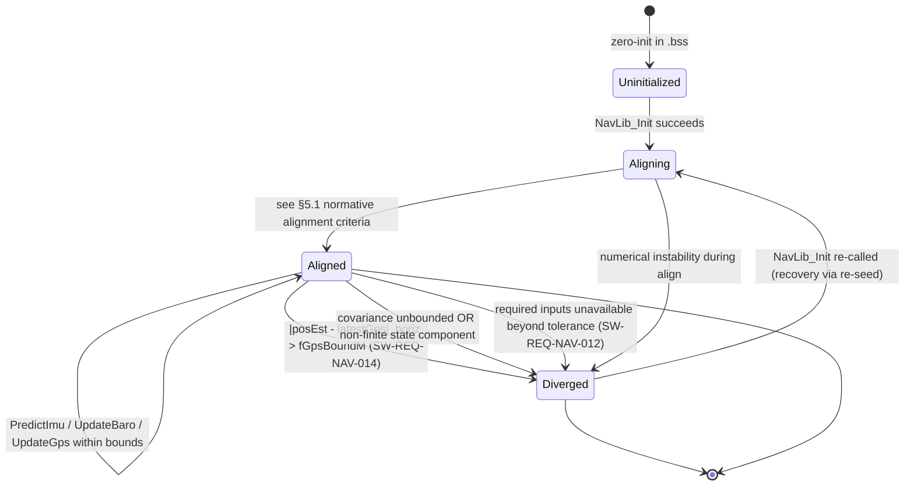
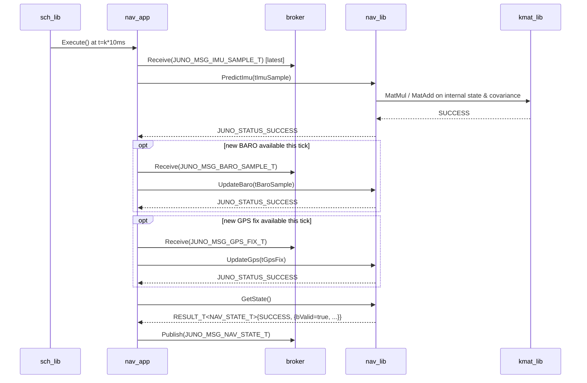
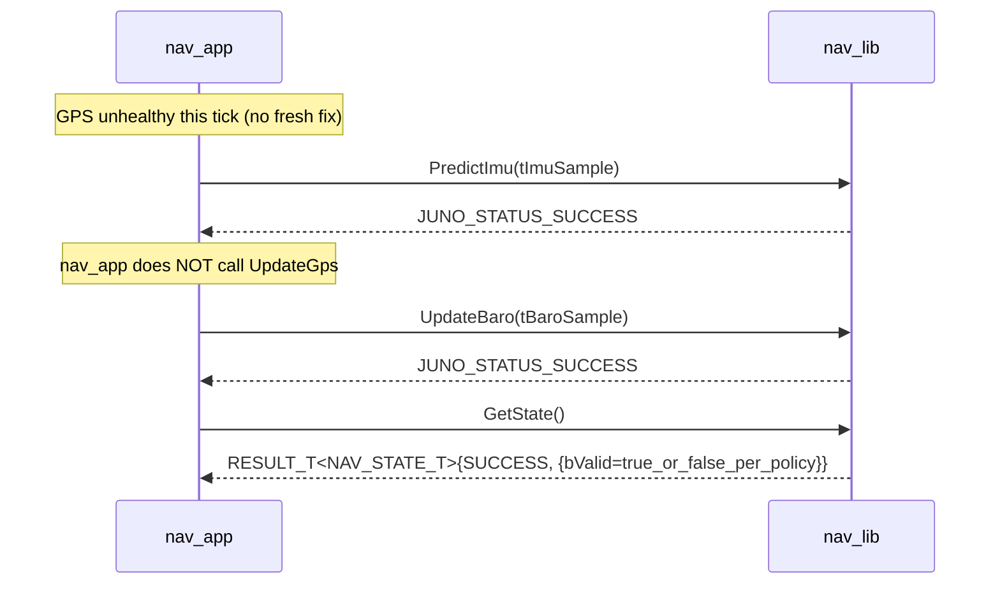

# nav_lib — Contracts (L2 sister to design.md)

This file is a sister document to [`design.md`](design.md). It contains the
state machine, data flow, sequence diagrams, timing analysis, error handling,
memory ownership, and per-requirement traceability for `nav_lib`. The
companion file governs the public API contract, types, vtable, per-call
contracts, FSW-extension status codes, and module context.

The split was performed per `NAV-A3` carry-forward (sprint
`SPRINT-IMPL-NAV-HOUSEKEEPING`, 2026-05-08): pre-split `design.md` was 608
lines, exceeding the 500-line file-size cap from `ai/memory/constraints.md`.
Splitting follows the precedent of `algorithm.md` (sister of design.md for
EKF algorithm specification) and `kmat/04_interface.md` + `05_through_11.md`.

## How to read

- **Caller of `nav_lib`** (e.g., `nav_app` author): read `design.md` §1-§4
  for the public surface; refer here for state machine and error-handling
  contracts.
- **Implementer of `nav_lib`**: read `design.md` §1-§4 for API contract,
  `algorithm.md` for the EKF algorithm, and this file for the state machine
  and runtime behavior contracts.

---

<!-- @{"design": ["SW-REQ-NAV-011", "SW-REQ-NAV-012", "SW-REQ-NAV-014", "SW-REQ-NAV-015"]} -->
## 5. State Machines

The nav library carries one internal state machine per the convention `Uninitialized → Aligning → Aligned → Diverged` (`SW-REQ-SYS-015`). The state is private to the IMPL; it surfaces only through `bValid` in `NAV_STATE_T`.



`bValid` mapping (`SW-REQ-NAV-011`):

| Internal state | `NAV_STATE_T.bValid` |
|----------------|----------------------|
| `Uninitialized` | `false` |
| `Aligning` | `false` |
| `Aligned` | `true` |
| `Diverged` | `false` |

`Diverged` is observable but never alters control flow inside the lib — `nav_app` continues calling `PredictImu` (`SW-REQ-NAV-013`/`SW-REQ-SYS-034`); the lib continues to propagate so logging captures the divergence trail. The numeric value of `fGpsBoundM` is set in `NAV_INIT_T` (configuration-owned, not exposed in API symbol) per `SW-REQ-NAV-014`. Determinism (`SW-REQ-NAV-015`) follows from the closed-form transition rules above plus deterministic kmat math (`SW-REQ-KMAT-009`).

### 5.1 Normative alignment criteria (`Aligning → Aligned`)

The `Aligning → Aligned` transition shall fire when **all** of the following conditions are simultaneously true (closes implementation-readiness gap G3 from 2026-05-03 SSE-R re-review; replaces the prior non-normative "e.g." wording):

1. **At least one valid GPS fix has been consumed** via `UpdateGps` since the most recent `Init` call. ("Valid" means `tFix.bValid == true` AND the fix was not rejected by the divergence-bound check in §4.3.) GPS is mandatory for the first transition into `Aligned` because the seed `tInitialState` has no observable horizontal-position truth without GPS.
2. **At least 50 IMU samples have been consumed** via `PredictImu` since the most recent `Init` call (≥ 250 ms at the canonical 200 Hz IMU cadence). This buffers the gyro-bias estimate enough that the attitude is observable when the first GPS fix arrives.
3. **If `tInit.bUseBaroAlt == true`, at least one valid baro sample has been consumed** via `UpdateBaro` since the most recent `Init` call. (The `bUseBaroAlt` flag indicates the caller wants altitude anchored to baro at align; without a baro sample the altitude state remains at the seed value, defeating the flag's intent.) If `tInit.bUseBaroAlt == false`, baro is not required.

The IMPL maintains internal counters for IMU-samples-consumed-since-Init and a boolean for first-valid-GPS-fix-consumed; these are reset by every successful `Init` call. `|q| ≈ 1` (unit-norm attitude quaternion) is **not** an alignment criterion — it is enforced by `juno::kmat::QuatNormalize` after every `PredictImu` step (per algorithm.md §6) and is therefore trivially always true after the first prediction. `Aligning → Diverged` (numerical instability during align) takes precedence over `Aligning → Aligned` if both fire on the same call.

---

<!-- @{"design": ["SW-REQ-NAV-001", "SW-REQ-NAV-002", "SW-REQ-NAV-003", "SW-REQ-NAV-004"]} -->
## 6. Data Flow

`nav_lib` **does not touch the bus directly.** All bus interaction happens in `nav_app`, which subscribes to `JUNO_MSG_IMU_SAMPLE_T`, `JUNO_MSG_BARO_SAMPLE_T`, `JUNO_MSG_GPS_FIX_T` and publishes `JUNO_MSG_NAV_STATE_T` (`docs/design/conventions.md` §4.4; `system_design.md` §4). The lib sees only typed-value records passed by reference.

```
                +---------------------------+
   IMU_SAMPLE   |                           |
   (5 ms)  --→  |                           |
                |                           |   PredictImu(tSample)
   BARO_SAMPLE  |                           |  -------------------→
   (50 ms) --→  |        nav_app            |   UpdateBaro(tSample)   +-----------+
                |   (View / TDM scheduled)  |  -------------------→   |  nav_lib  |
   GPS_FIX      |                           |   UpdateGps(tFix)       |  (pure    |
   (200 ms)--→  |                           |  -------------------→   |  compute) |
                |                           |                          +-----------+
                |                           |   GetState() ←─ NAV_STATE
                |                           |  ←-------------------
                |        publishes          |
                |   JUNO_MSG_NAV_STATE_T    |
                +---------------------------+
                        | 100 Hz
                        ↓
                      broker → afm_app, telem_app, mlog_app
```

Buffer ownership for nav lib I/O: every record (`IMU_SAMPLE_T`, `BARO_SAMPLE_T`, `GPS_FIX_T`, `NAV_STATE_T`, `NAV_INIT_T`) is **caller-owned** at the call site (passed by `const&` or returned by value in `RESULT_T`). The lib has no buffers spanning calls beyond its `NAV_LIB_IMPL_T` storage (§10). Single shared impl (no POSIX/Pico2 split per §3.3) so no platform-specific data flow exists.

---

<!-- @{"design": ["SW-REQ-NAV-001", "SW-REQ-NAV-002", "SW-REQ-NAV-003", "SW-REQ-NAV-005", "SW-REQ-NAV-013", "SW-REQ-NAV-014"]} -->
## 7. Sequence Diagrams

### 7.1 Nominal 10 ms nav cycle (predict + occasional update)



### 7.2 GPS-divergence path (SW-REQ-NAV-014 → bValid=false)

```mermaid
sequenceDiagram
    participant nav_app
    participant nav_lib
    participant broker

    nav_app->>nav_lib: UpdateGps(tFix)
    Note over nav_lib: |posEst - tFix|_horiz > fGpsBoundM
    nav_lib-->>nav_app: JUNO_FSW_STATUS_DIVERGED_ERROR
    Note over nav_lib: state machine: Aligned → Diverged;<br/>internal bValid := false
    nav_app->>nav_lib: GetState()
    nav_lib-->>nav_app: RESULT_T<NAV_STATE_T>{SUCCESS, {bValid=false, ...}}
    nav_app->>broker: Publish(JUNO_MSG_NAV_STATE_T{bValid=false})
    Note over nav_app,broker: continuation: SW-REQ-NAV-013 / SW-REQ-SYS-034<br/>nav_lib keeps propagating; nav_app keeps publishing
```

### 7.3 Degraded inputs path (SW-REQ-NAV-012 / -013)



---

<!-- @{"design": ["SW-REQ-NAV-005", "SW-REQ-NAV-015", "SW-REQ-NAV-016"]} -->
## 8. Timing and Scheduling Analysis

`nav_app` runs on the 10 ms TDM slot (`kNavAppPeriodMs = 10`, `system_design.md` §3.3 / §8.2). Within a single 10 ms tick, the worst-case nav_lib call sequence is:

| Step | Calls | Notes |
|------|-------|-------|
| 1 | `PredictImu` × 1 | One IMU sample dequeued per nav tick (200 Hz IMU vs 100 Hz nav: nav_app may consume up to 2 IMU samples; design budgets 2× for headroom). |
| 2 | `UpdateBaro` × 0–1 | 50 ms cadence → ~1 of every 5 nav ticks. |
| 3 | `UpdateGps` × 0–1 | 200 ms cadence → ~1 of every 20 nav ticks. |
| 4 | `GetState` × 1 | Always; populates publish buffer. |

The lib must complete the worst-case sequence within the nav_app slot budget (defined by `nav_app`'s L2 design, bounded by 10 ms minus the slot allocation for other 10 ms-aligned apps — `afm_app`, `mlog_app`). The IMPL holds the budget by:

- Compile-time-fixed matrix dimensions (`SW-REQ-KMAT-001`) — no allocation, no resizing.
- No exception unwinding (`-fno-exceptions`).
- No virtual dispatch (`-fno-rtti`, no `virtual` per `docs/design/conventions.md` §1.3).
- Deterministic kmat math (`SW-REQ-KMAT-009`).

Determinism (`SW-REQ-NAV-015`) is structural: identical inputs → identical outputs because (a) all storage is caller-owned and pre-zeroed, (b) kmat operations are deterministic, (c) no floating-point flags are altered, (d) no global mutable state. POSIX/Pico2 equivalence (`SW-REQ-NAV-016`) follows from `SW-REQ-KMAT-010` plus the single-impl construction (§3.3).

Downstream consumers of the published `JUNO_MSG_NAV_STATE_T` and their periods (from `system_design.md` §4 and `conventions.md` §4.5): `afm_app` (10 ms), `telem_app` (500 ms), `mlog_app` (5 ms — runs at IMU cadence per `SW-REQ-SYS-011`; sees a fresh nav state every other tick since `nav_app` publishes at 10 ms).

---

<!-- @{"design": ["SW-REQ-NAV-011", "SW-REQ-NAV-012", "SW-REQ-NAV-013", "SW-REQ-NAV-014"]} -->
## 9. Error Handling Strategy

1. **Status propagation.** All five API calls return `JUNO_STATUS_T` or `RESULT_T<NAV_STATE_T>`. `nav_app` consumes them via `JUNO_ASSERT_SUCCESS` / `JUNO_ASSERT_OK` (`docs/design/conventions.md` §4.3); bare `if`-return is forbidden.

2. **Failure handler.** `JUNO_FAILURE_HANDLER_T pfcnFailureHandler` is injected at `NAV_LIB_IMPL_T::New()`. It is invoked with a context string on `JUNO_STATUS_INVALID_DATA_ERROR`, `juno::nav::JUNO_FSW_STATUS_OUT_OF_ORDER_ERROR`, `juno::nav::JUNO_FSW_STATUS_DIVERGED_ERROR`, and on internal kmat failures (e.g., singular matrix during inversion → `juno::kmat::JUNO_FSW_STATUS_NUMERIC_ERROR`, `SW-REQ-KMAT-007`). **The handler is diagnostic-only and never alters control flow** (`docs/design/conventions.md` §4.3; `SW-REQ-SYS-037`).

3. **`bValid` policy (the canonical observable side effect).** `bValid=false` is set when:
   - State machine is `Uninitialized` or `Aligning` (no trustworthy estimate yet), or
   - Horizontal position has diverged from the latest GPS fix beyond `fGpsBoundM` (`SW-REQ-NAV-014`), or
   - Covariance becomes unbounded / state component becomes non-finite (numerical instability), or
   - Required inputs have been unavailable beyond a normative tolerance (`SW-REQ-NAV-012` / `SW-REQ-SYS-059`).

   **Normative tolerance for dead-reckoning (closes implementation-readiness gap G5 from 2026-05-03 SSE-R re-review).** During pure IMU-only dead-reckoning (e.g., the BOOST + 1-second settling window enforced by `nav_app` per `SW-REQ-NAV-APP-014`/`-015`, or any other interval where `UpdateBaro`/`UpdateGps` are not called), `bValid` shall remain `true` as long as **all** of the following hold:
   - Cumulative time since the last accepted measurement update (`UpdateBaro` or `UpdateGps`) is less than **5 seconds**. The 5-second budget covers the worst-case ~1.5 s boost+settling window with a ~3.3× safety margin against scheduler jitter or transient measurement gaps.
   - No state component is non-finite (`std::isfinite` check on every state element).
   - The trace of `P` (the EKF covariance matrix) is finite.

   When the 5-second dead-reckoning budget is exceeded, the IMPL transitions the state machine to `Diverged` and sets `bValid=false`; the failure handler is invoked diagnostically with context "dead-reckoning timeout exceeded". Recovery requires a fresh `Init` call (per §5 `Diverged → Aligning`). The 5-second value is the canonical FT1 budget; FT2 may revise via a future `NAV_INIT_T` extension (carry-forward action, not in FT1 scope).

   The specific bound (`fGpsBoundM`) lives in `NAV_INIT_T` (caller-supplied per `SW-REQ-NAV-014`); the dead-reckoning timeout (5 s) is normative-pinned in this design and not currently caller-configurable.

   **Numeric default (closes S1-AI-023, `SW-REQ-SYS-014`).** The `nav_app` composition root populates `NAV_INIT_T.fGpsBoundM` from a project-wide `static constexpr double kNavGpsBoundM_default = 200.0;` declared in `libs/nav_lib/include/nav_lib/nav_api.hpp` in `juno::nav`. Rationale: FT1 ground-track is dominated by vertical motion (boost to ~600 m apogee with negligible cross-range under nominal G-motor conditions); 200 m horizontal threshold gives margin against transient GPS multipath without masking a genuinely diverged filter. The bound is configurable per-build via `NAV_INIT_T.fGpsBoundM`; FT2 may revise. Determinism (`SW-REQ-NAV-015`) is preserved because the default is a compile-time constant.

4. **Continuation contract.** All error paths leave the lib in a state where the next `PredictImu`/`UpdateBaro`/`UpdateGps` call is well-defined (`SW-REQ-NAV-013` / `SW-REQ-SYS-034`). The lib never halts, never loops indefinitely, never reboots. `Diverged → Aligning` recovery requires explicit `NavLib_Init` re-call by `nav_app` (the lib does not auto-recover, by design — operator/post-flight visibility is preferred).

5. **Exceptions banned.** Every API function is `noexcept` (`SW-REQ-SYS-053`); a stray throw would invoke `std::terminate`. Treated as a structural invariant. No `try`/`catch`/`throw` anywhere in the IMPL.

6. **Health bit.** `nav_app` (not `nav_lib`) sets the nav health bit in `JUNO_MSG_SYS_HEALTH_T` based on observed `bValid`/`JUNO_STATUS_*` values — kept in `nav_app`'s L2 design.

---

<!-- @{"design": ["SW-REQ-NAV-004", "SW-REQ-NAV-013", "SW-REQ-NAV-016"]} -->
## 10. Memory Ownership

Per `docs/design/conventions.md` §5: caller owns all storage; `nav_lib` allocates nothing.

| Buffer / facility | Owner | Lifetime | Allocation |
|-------------------|-------|----------|------------|
| `NAV_LIB_IMPL_T tNavImpl` | composition root (`apps/main.cpp`) | program lifetime, `.bss` zero-init | Static — caller-owned |
| Internal filter state vector (`juno::kmat::VEC_T<double, kInternalDim>`) | `NAV_LIB_IMPL_T` member | program lifetime | **Inside `IMPL_T`** — `.bss` zero-init |
| Internal covariance matrix (`juno::kmat::MAT_T<double, kInternalDim, kInternalDim>`) | `NAV_LIB_IMPL_T` member | program lifetime | **Inside `IMPL_T`** — `.bss` zero-init |
| Process-noise / measurement-noise matrices | `NAV_LIB_IMPL_T` members | program lifetime | Inside `IMPL_T` |
| Latest-GPS-fix cache (used for `SW-REQ-NAV-014` bound check) | `NAV_LIB_IMPL_T` member | program lifetime | Inside `IMPL_T` |
| `tApi` vtable | `NAV_LIB_IMPL_T::New()`, file-scope `static` local | program lifetime | Read-only after construction |
| Sample inputs (`IMU_SAMPLE_T`, `BARO_SAMPLE_T`, `GPS_FIX_T`) | caller (`nav_app`) | call duration | Stack — by `const&` |
| `NAV_STATE_T` output | caller | call duration | Returned by value in `RESULT_T<NAV_STATE_T>` |

Asserted invariants:

- **No `new`, `delete`, `malloc`, `calloc`, `realloc`, `free`, no heap-backed STL containers** anywhere in `nav_lib` (`SW-REQ-SYS-050`).
- **No constructors / destructors on `NAV_LIB_ROOT_T` / `NAV_LIB_IMPL_T`** (`docs/design/conventions.md` §1.3 rule 7).
- **No global mutable state.** The static `tApi` vtable inside `NAV_LIB_IMPL_T::New()` is the only file-scope datum and is read-only after construction.
- **No runtime polymorphism after init** (`SW-REQ-SYS-051`); vtable wired once.
- **Single shared impl** (§3.3) — no POSIX/Pico2 file split; no platform-specific buffers.

### 10.1 Example: kmat usage inside the IMPL (illustrative)

```cpp
// libs/nav_lib/src/nav_impl.cpp (IMPL-private; never appears in the public header)
namespace juno::nav
{

static constexpr size_t kInternalDim = 16;   // IMPL-private; may differ per algorithm

struct NAV_LIB_IMPL_T JUNO_MODULE_DERIVE(NAV_LIB_ROOT_T,
    juno::kmat::VEC_T<double, kInternalDim>                 tStateVec;     // x
    juno::kmat::MAT_T<double, kInternalDim, kInternalDim>   tCovariance;   // P
    juno::kmat::MAT_T<double, kInternalDim, kInternalDim>   tProcNoise;    // Q (IMPL-private)
    GPS_FIX_T                                               tLatestGps;    // for SW-REQ-NAV-014
    double                                                  fGpsBoundM;
    // ... private state-machine enum, last-timestamp cache ...

    static JUNO_STATUS_T Init       (NAV_LIB_ROOT_T &tRoot, const NAV_INIT_T &tInit) noexcept;
    static JUNO_STATUS_T PredictImu (NAV_LIB_ROOT_T &tRoot, const IMU_SAMPLE_T &tSample) noexcept;
    // ... etc ...

    static RESULT_T<NAV_LIB_IMPL_T> New(
        JUNO_FAILURE_HANDLER_T pfcnFailureHandler,
        JUNO_USER_DATA_T      *pvUserData
    ) noexcept;
);

} // namespace juno::nav
```

The internal symbol names (`tStateVec`, `tCovariance`, `tProcNoise`) live in the IMPL TU only. The public header contains no algorithm-specific symbols (no `tCov`, no `Q`, no `K`, no innovation vector) — preserving the **algorithm-stable** API seam (§3.2; `docs/design/conventions.md` §1).

---

## 11. Traceability

Per-section `<!-- @{"design": [...]} -->` tags above are authoritative; this table is descriptive consolidation.

| Req ID | Title | Section(s) |
|--------|-------|-----------|
| SW-REQ-NAV-001 | Accept IMU Samples | §1, §3, §4.3 (PredictImu), §6, §7.1 |
| SW-REQ-NAV-002 | Accept GPS Measurements | §1, §3, §4.3 (UpdateGps), §6, §7.1 |
| SW-REQ-NAV-003 | Accept Barometric Altimeter Measurements | §1, §3, §4.3 (UpdateBaro), §6, §7.1 |
| SW-REQ-NAV-004 | Sixteen-State Nav Estimate Output | §1, §2, §3, §4.1, §10 |
| SW-REQ-NAV-005 | Nav Estimate Available at 100 Hz | §1, §3, §4.3 (GetState), §7.1, §8 |
| SW-REQ-NAV-006 | Geodetic Position Output | §2, §4.1, §4.3 (UpdateGps) |
| SW-REQ-NAV-007 | HAE Altitude Reference | §2, §4.1, §4.3 (UpdateBaro) |
| SW-REQ-NAV-008 | NED Velocity Output | §2, §4.1, §4.3 (UpdateGps) |
| SW-REQ-NAV-009 | Body-to-NED Quaternion Output | §2, §4.1 |
| SW-REQ-NAV-010 | SI Units for Nav Outputs | §2, §4.1 |
| SW-REQ-NAV-011 | Nav Validity Flag Output | §4.1, §4.3 (GetState), §5, §9 |
| SW-REQ-NAV-012 | Validity False on Missing Inputs | §5, §7.3, §9 |
| SW-REQ-NAV-013 | Continued Propagation With Reduced Inputs | §3.4, §4.3, §7.3, §9, §10 |
| SW-REQ-NAV-014 | Bounded Position Divergence From GPS | §1, §4.3 (UpdateGps), §5, §7.2, §9 |
| SW-REQ-NAV-015 | Deterministic Nav Output | §5, §8 |
| SW-REQ-NAV-016 | POSIX and Pico2 Functional Equivalence | §3.3, §8, §10 |
| SW-REQ-NAV-017 | Body Axes Convention for IMU Inputs | §2, §4.1, §4.3 (PredictImu) |
| SW-REQ-NAV-018 | EKF Filter Algorithm | §1 (algorithm pin), §2 (footnote), §3.2; full spec in [algorithm.md](algorithm.md) §1, §3, §4, §6 |
| SW-REQ-NAV-019 | Configurable Noise Covariance Loading | §4.1 (NAV_INIT_T fields); full spec in [algorithm.md](algorithm.md) §5.1, §5.2 |
| SW-REQ-NAV-020 | Configurable Initial State Covariance Loading | §4.1 (NAV_INIT_T `fInitialCovDiag[16]` field); full spec in [algorithm.md](algorithm.md) §5.1 |

POSIX/Pico2 functional equivalence statement (`SW-REQ-SYS-043` / `SW-REQ-NAV-016`): `nav_lib` is pure compute with a **single shared impl** at `libs/nav_lib/src/nav_impl.cpp` (no POSIX/Pico2 file split, §3.3). Functional equivalence is therefore structural; numeric equivalence inherits from `SW-REQ-KMAT-010`. Trick SITL (`SW-REQ-SYS-045`) feeds the same `NAV_LIB_API_T` calls the flight build uses.
