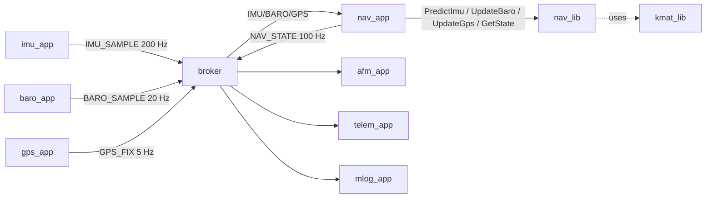

# Nav Library — L2 Design (IEEE 1016)

**Document type:** IEEE 1016 Software Design Description
**Module:** `nav_lib` (libs/nav_lib)
**Header:** `libs/nav_lib/include/nav_lib/nav_api.hpp`
**Authoritative reference (do not contradict):** `docs/design/conventions.md`
**Reference (parent design):** `docs/design/system/system_design.md`

---

<!-- @{"design": ["SW-REQ-NAV-001", "SW-REQ-NAV-002", "SW-REQ-NAV-003", "SW-REQ-NAV-004", "SW-REQ-NAV-005"]} -->
## 1. Purpose and Scope

`nav_lib` is the navigation filter library; the algorithm is pinned to **Extended Kalman Filter (EKF)** per `SW-REQ-NAV-018` (full specification in [algorithm.md](algorithm.md)) and the public API is **algorithm-stable** so EKF tuning can change without API changes (§3.2). It addresses every requirement in `docs/requirements/nav/requirements.json` (`SW-REQ-NAV-001` through `SW-REQ-NAV-019`) and decomposes the system-level nav requirements `SW-REQ-SYS-002`, `SW-REQ-SYS-012`, `SW-REQ-SYS-013`, `SW-REQ-SYS-014`, `SW-REQ-SYS-015`, `SW-REQ-SYS-034`, `SW-REQ-SYS-038`–`SW-REQ-SYS-042`, `SW-REQ-SYS-043`, `SW-REQ-SYS-044`, `SW-REQ-SYS-057`, and `SW-REQ-SYS-059`.

The library accepts IMU, baro, and GPS measurements through a public C++ API (`SW-REQ-NAV-001`/`-002`/`-003`) and produces a 16-state nav estimate (`SW-REQ-NAV-004`) made available at 100 Hz (`SW-REQ-NAV-005`) for `nav_app` to publish on the bus as `JUNO_MSG_NAV_STATE_T`.

**In scope.** Public API surface (vtable shape, contract per call), state machine (`Uninitialized → Aligning → Aligned → Diverged`), measurement-to-state plumbing, validity flag policy, kmat-backed state and covariance storage, error handling using `JUNO_STATUS_T`/`RESULT_T<T>`, memory ownership.

**Algorithm specification.** The filter algorithm is pinned to **Extended Kalman Filter (EKF)** per `SW-REQ-NAV-018`; the algorithm specification — state vector composition, process model, measurement models, and noise/covariance load-time configuration surface — lives in [algorithm.md](algorithm.md) (sister document). This file (design.md) governs the public API contract and message catalog; algorithm.md governs what happens inside the filter. Replacing `NAV_LIB_IMPL_T` with a different EKF tuning is supported by the API; replacing the algorithm itself (e.g., to UKF) would require an algorithm.md amendment plus the inevitable validation pass — out of FT1 scope.

**Out of scope.** Bus interaction (`nav_app` performs all `Subscribe`/`Publish` calls — `nav_lib` is platform-free pure compute, see §6). Numeric tuning of the nav-vs-GPS divergence bound (`SW-REQ-NAV-014`) lives in IMPL/configuration, not on the API. POSIX/Pico2 driver split (no platform code in this lib — single shared impl). Phase-aware sensor fusion (boost-phase IMU-only dead-reckoning per `SW-REQ-NAV-APP-014`/`-015`) is enforced by `nav_app`'s decision of when to call `UpdateBaro`/`UpdateGps`, not by `nav_lib` — see [algorithm.md](algorithm.md) §8 and `nav_app/design.md` §4.4.

---

<!-- @{"design": ["SW-REQ-NAV-004", "SW-REQ-NAV-006", "SW-REQ-NAV-007", "SW-REQ-NAV-008", "SW-REQ-NAV-009", "SW-REQ-NAV-010", "SW-REQ-NAV-017"]} -->
## 2. Definitions and Abbreviations

Cross-module vocabulary (frames, time base, status semantics, message naming) is defined in `docs/design/conventions.md` §4 and **not** redefined here. Specifically: `SW-REQ-SYS-038`/`-039` (geodetic position + HAE altitude), `SW-REQ-SYS-040` (NED velocity), `SW-REQ-SYS-041` (body→NED quaternion), `SW-REQ-SYS-042` (SI units), `SW-REQ-SYS-057` (body axes X-fwd/Y-right/Z-down) are inherited verbatim and apply to nav inputs (`SW-REQ-NAV-017`) and outputs (`SW-REQ-NAV-006`–`-010`).

Module-local terms (16-state composition is locked here):

| Term | Meaning |
|------|---------|
| 16-state | The full nav state vector; composition pinned by `SW-REQ-SYS-013` and `SW-REQ-NAV-004` |
| `tPosLla` | Position triple `[dLatDeg, dLonDeg, fAltMHae]` (deg, deg, m HAE) — 3 elements |
| `tVelNed` | Velocity triple `[fVnMps, fVeMps, fVdMps]` in NED — 3 elements (m/s) |
| `tAttQuat` | Attitude unit quaternion `[fQw, fQx, fQy, fQz]` body→NED — 4 elements |
| `tAccelBias` | Accelerometer bias `[fBaxMps2, fBayMps2, fBazMps2]` in body — 3 elements (m/s²) |
| `tGyroBias` | Gyroscope bias `[fBgxRps, fBgyRps, fBgzRps]` in body — 3 elements (rad/s) |
| `kNavStateDim` | `static constexpr size_t kNavStateDim = 16;` (3+3+4+3+3) |
| `bValid` | Validity flag in `NAV_STATE_T`; semantics owned by the IMPL — see §5 |
| Aligning | Initial state in which alignment criteria (e.g., GPS-fix-acquired, gravity-aligned attitude) are not yet met |
| Aligned | Steady-state operation; `bValid=true` |
| Diverged | Numerical instability or GPS bound exceeded; `bValid=false` |
| `kmat::MAT_T` | Compile-time-fixed-dimension matrix from `juno::kmat`; storage is caller-owned (see `SW-REQ-KMAT-001`/`-008`) |
| `kmat::VEC_T` | Compile-time-fixed-dimension column vector from `juno::kmat` |

Note: while `kNavStateDim = 16` is the public composition, the IMPL may internally use an error-state representation of any dimension; the public API never exposes the internal dimension. The pinned algorithm is **Extended Kalman Filter (EKF)** per `SW-REQ-NAV-018`; full specification in [algorithm.md](algorithm.md).

---

<!-- @{"design": ["SW-REQ-NAV-001", "SW-REQ-NAV-002", "SW-REQ-NAV-003", "SW-REQ-NAV-004", "SW-REQ-NAV-005", "SW-REQ-NAV-013", "SW-REQ-NAV-016"]} -->
## 3. System Overview

### 3.1 MVC layer mapping

| Layer | Realization | Detail |
|-------|-------------|--------|
| Controller (Lib) | `juno::nav::NAV_LIB_ROOT_T` + `NAV_LIB_IMPL_T` | This document (API contract); EKF algorithm specified in [algorithm.md](algorithm.md). Pure compute. |
| View (App) | `juno::nav_app::NAV_APP` | Owns broker subscriptions, calls into `nav_lib` once per 10 ms tick, and publishes `JUNO_MSG_NAV_STATE_T`. Designed in `docs/design/nav_app/` (separate L2). |
| Model (Bus) | `juno::sb::BROKER` | Routes `JUNO_MSG_IMU_SAMPLE_T`, `JUNO_MSG_BARO_SAMPLE_T`, `JUNO_MSG_GPS_FIX_T` to `nav_app`; `nav_app` publishes `JUNO_MSG_NAV_STATE_T` (`docs/design/conventions.md` §4.4). |

### 3.2 Algorithm-stable API seam

The pinned algorithm is **EKF** per `SW-REQ-NAV-018` (see [algorithm.md](algorithm.md)). The public surface (`NAV_LIB_API_T`) is intentionally **algorithm-stable**: it accepts measurement records by value and produces a 16-state estimate by value, so EKF tuning (covariances, alignment thresholds, divergence bounds) can change between builds without altering `nav_app`, the bus catalog, or the public header. Algorithm-specific symbols (covariance matrix names, Kalman gain matrices, innovation vectors) are private to the IMPL translation unit and never appear in `nav_api.hpp`. Future migration to a different algorithm (e.g., UKF) is supported by this seam but would require an `algorithm.md` revision and validation pass — out of FT1 scope.



### 3.3 Single shared impl

Per `docs/design/conventions.md` §6, most modules carry POSIX and Pico2 IMPLs. `nav_lib` is **pure compute** — no file descriptors, no peripheral handles, no timers — so it has a **single** impl translation unit at `libs/nav_lib/src/nav_impl.cpp` shared by both targets. `SW-REQ-NAV-016` (POSIX/Pico2 functional equivalence) is satisfied trivially by this construction; bit-identical results follow from `SW-REQ-KMAT-009`/`-010` deterministic kmat math.

### 3.4 Degraded-input continuation

`SW-REQ-NAV-013` requires the library to keep producing an estimate when GPS or baro are unavailable. The IMPL achieves this by skipping the corresponding `Update*` call (no implicit timeouts inside the lib — `nav_app` decides when a measurement is "missing" and simply does not call `UpdateGps`/`UpdateBaro`). `PredictImu` continues to run at the IMU cadence so the propagation loop never stalls. `bValid` policy (§5, §9) reflects the degraded-input state without halting computation.

---

<!-- @{"design": ["SW-REQ-NAV-001", "SW-REQ-NAV-002", "SW-REQ-NAV-003", "SW-REQ-NAV-004", "SW-REQ-NAV-005", "SW-REQ-NAV-006", "SW-REQ-NAV-007", "SW-REQ-NAV-008", "SW-REQ-NAV-009", "SW-REQ-NAV-010", "SW-REQ-NAV-011", "SW-REQ-NAV-013", "SW-REQ-NAV-017"]} -->
## 4. Interface Definitions

### 4.1 Public types

```cpp
namespace juno::nav
{

static constexpr size_t kNavStateDim       = 16;   // 3 pos + 3 vel + 4 quat + 3 ba + 3 bg
static constexpr size_t kPosDim            = 3;
static constexpr size_t kVelDim            = 3;
static constexpr size_t kQuatDim           = 4;
static constexpr size_t kBiasDim           = 3;

struct IMU_SAMPLE_T   { JUNO_TIME_US_T tTimestampUs; double tAccelBodyMps2[3]; double tGyroBodyRps[3]; bool bValid; };
struct BARO_SAMPLE_T  { JUNO_TIME_US_T tTimestampUs; double fPressurePa; double fAltMHae; double fTempC; bool bValid; };
struct GPS_FIX_T      { JUNO_TIME_US_T tTimestampUs; double dLatDeg; double dLonDeg; double fAltMHae; double tVelNedMps[3]; bool bValid; };

struct NAV_STATE_T
{
    JUNO_TIME_US_T tTimestampUs;
    double tPosLla[kPosDim];        // [dLatDeg, dLonDeg, fAltMHae]
    double tVelNed[kVelDim];        // [Vn, Ve, Vd] m/s
    double tAttQuat[kQuatDim];      // [w, x, y, z], body→NED, unit norm
    double tAccelBias[kBiasDim];    // body frame, m/s^2
    double tGyroBias[kBiasDim];     // body frame, rad/s
    bool   bValid;
};

struct NAV_INIT_T
{
    NAV_STATE_T  tInitialState;     // caller-supplied seed (all 16 components)
    double       fGpsBoundM;        // configured horizontal divergence bound (SW-REQ-NAV-014)
    bool         bUseBaroAlt;       // optional: anchor altitude to baro at align

    // Load-time configurable noise/covariance values per SW-REQ-NAV-019.
    // Full spec + reference values: docs/design/nav/algorithm.md §5.
    // All fields caller-supplied at Init() time; no API to mutate mid-flight.
    double       fImuAccelNoiseSigmaMps2[3];               // per-axis IMU accel noise (1-sigma)
    double       fImuGyroNoiseSigmaRps[3];                 // per-axis IMU gyro noise (1-sigma)
    double       fImuAccelBiasRandomWalkMps2PerSqrtS[3];   // accel bias random-walk rate
    double       fImuGyroBiasRandomWalkRpsPerSqrtS[3];     // gyro bias random-walk rate
    double       fBaroNoiseSigmaM;                         // baro altitude noise (1-sigma)
    double       fGpsHorizNoiseSigmaM;                     // GPS horizontal position noise
    double       fGpsVertNoiseSigmaM;                      // GPS vertical position noise
    double       fGpsVelNoiseSigmaMps;                     // GPS velocity noise

    // Initial state covariance diagonal P_0 per SW-REQ-NAV-020 (added 2026-05-03
    // to close implementation-readiness gap G2). Each element is the variance
    // (1-sigma squared) of the corresponding state in tInitialState. Caller
    // chooses values based on seed confidence: small values (e.g., 1e-6) lock
    // the filter near the seed; large values (e.g., 1e2) accept measurements
    // aggressively at startup. Indexing matches NAV_STATE_T component order:
    // [0..2] tPosLla variance (deg^2 / deg^2 / m^2);
    // [3..5] tVelNed variance (m^2/s^2);
    // [6..9] tAttQuat variance (unit quaternion component^2);
    // [10..12] tAccelBias variance (m^2/s^4);
    // [13..15] tGyroBias variance (rad^2/s^2).
    // Reference values for FT1 are installation guidance only — see
    // docs/design/nav/algorithm.md §5.2.
    double       fInitialCovDiag[kNavStateDim];
};

} // namespace juno::nav
```

`IMU_SAMPLE_T`, `BARO_SAMPLE_T`, `GPS_FIX_T`, and `NAV_STATE_T` are PODs with no constructors/destructors; they share field shapes with the bus message types `JUNO_MSG_IMU_SAMPLE_T`, `JUNO_MSG_BARO_SAMPLE_T`, `JUNO_MSG_GPS_FIX_T`, `JUNO_MSG_NAV_STATE_T` (`system_design.md` §4) and `nav_app` performs the conversion.

**Authoritative `JUNO_MSG_NAV_STATE_T` field shape (closes telem ↔ nav field-precision RID; `system_design.md` §4 references back here).** Per-field types and units below are the single canonical reference for all consumers (`afm_app`, `telem_app`, `mlog_app`):

| Field | Type | Units / Frame | Source / Notes |
|-------|------|---------------|----------------|
| `tTimestampUs` | `JUNO_TIME_US_T` (`uint64_t`) | µs since startup, monotonic | `conventions.md` §4.2; `SW-REQ-SYS-026/-027` |
| `tPosLla[0]` | `double` | latitude, degrees, WGS-84 geodetic | `SW-REQ-SYS-038`, `SW-REQ-NAV-006` |
| `tPosLla[1]` | `double` | longitude, degrees, WGS-84 geodetic | `SW-REQ-SYS-038`, `SW-REQ-NAV-006` |
| `tPosLla[2]` | `double` | altitude, meters, WGS-84 ellipsoid (HAE) | `SW-REQ-SYS-039`, `SW-REQ-NAV-007` |
| `tVelNed[0]` | `double` | Vn, m/s | `SW-REQ-SYS-040`, `SW-REQ-NAV-008` |
| `tVelNed[1]` | `double` | Ve, m/s | `SW-REQ-SYS-040`, `SW-REQ-NAV-008` |
| `tVelNed[2]` | `double` | Vd, m/s | `SW-REQ-SYS-040`, `SW-REQ-NAV-008` |
| `tAttQuat[0..3]` | `double[4]` | unit quaternion `(w, x, y, z)` body→NED | `SW-REQ-SYS-041`, `SW-REQ-NAV-009` |
| `tAccelBias[0..2]` | `double[3]` | body frame, m/s² | `SW-REQ-NAV-004` |
| `tGyroBias[0..2]` | `double[3]` | body frame, rad/s | `SW-REQ-NAV-004` |
| `bValid` | `bool` | true ⇒ trustworthy estimate | `SW-REQ-NAV-011`, `SW-REQ-SYS-015` |

All floating-point fields use `double` (8-byte IEEE-754) — no `float` substitution permitted on this message. `telem_lib` packing converts to wire-format precision (configurable per packet schema); the bus message itself is doubles throughout. Per-build POD layout of `JUNO_MSG_NAV_STATE_T` matches `juno::nav::NAV_STATE_T` byte-for-byte (POSIX/Pico2 equivalence, `SW-REQ-SYS-043`).

### 4.2 Vtable shape

```cpp
struct NAV_LIB_ROOT_T;

struct NAV_LIB_API_T
{
    JUNO_STATUS_T          (&Init)       (NAV_LIB_ROOT_T &tRoot, const NAV_INIT_T  &tInit)   noexcept;
    JUNO_STATUS_T          (&PredictImu) (NAV_LIB_ROOT_T &tRoot, const IMU_SAMPLE_T  &tSample) noexcept;
    JUNO_STATUS_T          (&UpdateBaro) (NAV_LIB_ROOT_T &tRoot, const BARO_SAMPLE_T &tSample) noexcept;
    JUNO_STATUS_T          (&UpdateGps)  (NAV_LIB_ROOT_T &tRoot, const GPS_FIX_T     &tFix)    noexcept;
    RESULT_T<NAV_STATE_T>  (&GetState)   (const NAV_LIB_ROOT_T &tRoot)                        noexcept;
};

struct NAV_LIB_ROOT_T JUNO_MODULE_ROOT(NAV_LIB_API_T,
    // No mutable user-data members at the ROOT level beyond what
    // JUNO_MODULE_ROOT injects (ptApi, pfcnFailureHandler, pvUserData).
);
```

Every API function is `noexcept` (`docs/design/conventions.md` §1.3; `SW-REQ-SYS-053`). No `virtual`, no `new`/`delete`, no `throw`.

### 4.3 Per-call contracts

#### NavLib_Init

| Attribute | Value |
|-----------|-------|
| Signature | `JUNO_STATUS_T NavLib_Init(NAV_LIB_ROOT_T &tRoot, const NAV_INIT_T &tInit) noexcept` |
| Preconditions | `tRoot` constructed by `NAV_LIB_IMPL_T::New()`; `tInit.tInitialState` populated; `tInit.fGpsBoundM > 0`. |
| Postconditions | Internal state, covariance, and biases zero-or-seed-initialized; state machine in `Aligning` (§5); subsequent `GetState` returns the seed with `bValid=false`. |
| Error conditions | `JUNO_STATUS_INVALID_DATA_ERROR` on non-finite seed components or non-positive bound; `JUNO_STATUS_NULLPTR_ERROR` if `tRoot.ptApi` is null (asserted, diagnostic only). |
| Thread safety | Not thread-safe. Single TDM caller (`nav_app`) only. |
| Requirements | `SW-REQ-NAV-004`, `-006`–`-010`, `-014` (bound configured here), `-017`. |

#### NavLib_PredictImu

| Attribute | Value |
|-----------|-------|
| Signature | `JUNO_STATUS_T NavLib_PredictImu(NAV_LIB_ROOT_T &tRoot, const IMU_SAMPLE_T &tSample) noexcept` |
| Preconditions | `Init` called; `tSample.tTimestampUs` monotonically non-decreasing relative to prior calls; body axes interpreted X-fwd/Y-right/Z-down (`SW-REQ-NAV-017`). |
| Postconditions | State propagated forward to `tSample.tTimestampUs` using the IMU sample as the propagation input; biases applied internally. State machine may transition `Aligning → Aligned` (§5). |
| Error conditions | `JUNO_STATUS_INVALID_DATA_ERROR` if any IMU component is non-finite; `juno::nav::JUNO_FSW_STATUS_OUT_OF_ORDER_ERROR` (FSW extension; see §4.5) if timestamp regresses; on numerical instability, returns `juno::nav::JUNO_FSW_STATUS_DIVERGED_ERROR` (FSW extension; see §4.5) and transitions state to `Diverged` with `bValid=false`. Failure handler is diagnostic-only (`docs/design/conventions.md` §4.3). |
| Thread safety | Single-caller. |
| Requirements | `SW-REQ-NAV-001`, `-005`, `-013`, `-015`, `-017`. |

#### NavLib_UpdateBaro

| Attribute | Value |
|-----------|-------|
| Signature | `JUNO_STATUS_T NavLib_UpdateBaro(NAV_LIB_ROOT_T &tRoot, const BARO_SAMPLE_T &tSample) noexcept` |
| Preconditions | `Init` called; sample is in HAE meters (`SW-REQ-NAV-007`); `tSample.bValid` consulted by IMPL. |
| Postconditions | Vertical sub-state corrected against the baro measurement; estimate timestamp advanced or held per IMPL policy. |
| Error conditions | `JUNO_STATUS_INVALID_DATA_ERROR` on non-finite altitude; numerical instability → `juno::nav::JUNO_FSW_STATUS_DIVERGED_ERROR` (FSW extension; see §4.5) and `Diverged`. |
| Thread safety | Single-caller. |
| Requirements | `SW-REQ-NAV-003`, `-007`, `-013`. |

#### NavLib_UpdateGps

| Attribute | Value |
|-----------|-------|
| Signature | `JUNO_STATUS_T NavLib_UpdateGps(NAV_LIB_ROOT_T &tRoot, const GPS_FIX_T &tFix) noexcept` |
| Preconditions | `Init` called; `tFix.dLatDeg ∈ [-90, 90]`, `tFix.dLonDeg ∈ [-180, 180]`; SI/HAE per §2. |
| Postconditions | Horizontal position and (optionally) NED velocity sub-states corrected against the GPS fix. If horizontal position estimate exceeds `tInit.fGpsBoundM` away from the latest fix, IMPL transitions state to `Diverged` and sets `bValid=false` (`SW-REQ-NAV-014`). |
| Error conditions | `JUNO_STATUS_INVALID_DATA_ERROR` on out-of-range lat/lon or non-finite values; `juno::nav::JUNO_FSW_STATUS_DIVERGED_ERROR` (FSW extension; see §4.5) on bound violation. |
| Thread safety | Single-caller. |
| Requirements | `SW-REQ-NAV-002`, `-006`, `-008`, `-014`. |

#### NavLib_GetState

| Attribute | Value |
|-----------|-------|
| Signature | `RESULT_T<NAV_STATE_T> NavLib_GetState(const NAV_LIB_ROOT_T &tRoot) noexcept` |
| Preconditions | `Init` called. |
| Postconditions | `tOk` carries the latest 16-state estimate composed per `SW-REQ-NAV-004` and frame contracts `SW-REQ-NAV-006`–`-010`; `tStatus = SUCCESS` whenever a current estimate is available even if `bValid=false` (caller inspects `bValid` to gate use, `SW-REQ-NAV-011`/`-012`). |
| Error conditions | `JUNO_STATUS_INVALID_DATA_ERROR` if called before `Init` (state-machine precondition violated; per `conventions.md` §4.8 this is the canonical "bad-state precondition" code). |
| Thread safety | Single-caller; `const` does not imply re-entrancy. |
| Requirements | `SW-REQ-NAV-004`, `-005`, `-011`, `-012`. |

### 4.4 Doxygen comment block (header excerpt)

```cpp
/**
 * @brief Step the nav filter forward using a single IMU sample.
 * @param tRoot Nav library root constructed by NAV_LIB_IMPL_T::New().
 * @param tSample IMU sample; body axes X-fwd/Y-right/Z-down (SW-REQ-NAV-017).
 * @return JUNO_STATUS_SUCCESS on nominal propagation,
 *         juno::nav::JUNO_FSW_STATUS_DIVERGED_ERROR on numerical instability,
 *         JUNO_STATUS_INVALID_DATA_ERROR on non-finite inputs,
 *         juno::nav::JUNO_FSW_STATUS_OUT_OF_ORDER_ERROR on timestamp regression.
 * @note  Algorithm-stable API: filter algorithm pinned to EKF per SW-REQ-NAV-018 (see algorithm.md); the API surface survives EKF tuning changes.
 */
JUNO_STATUS_T (&PredictImu)(NAV_LIB_ROOT_T &tRoot, const IMU_SAMPLE_T &tSample) noexcept;
```

<!-- @{"design": ["SW-REQ-NAV-013", "SW-REQ-NAV-014", "SW-REQ-NAV-015"]} -->
### 4.5 FSW-extension status codes (`juno::nav` namespace)

`juno/status.h` does not define codes for nav-specific failure modes
(filter divergence, timestamp regression). `nav_lib` declares two FSW
extensions per `docs/design/conventions.md` §4.8 ("FSW-specific
extensions" — offsets from `JUNO_STATUS_CUSTOM_ERROR`). The declarations
live in the public API header `libs/nav_lib/include/nav_lib/nav_api.hpp`
in `namespace juno::nav` so callers (`nav_app`) can match against them
in their `JUNO_ASSERT_OK` switches:

```cpp
namespace juno::nav
{
    // Per docs/design/conventions.md §4.8.
    // Offset +3 from JUNO_STATUS_CUSTOM_ERROR.
    // Returned by PredictImu/UpdateBaro/UpdateGps when the filter
    // is numerically unstable or has exceeded the GPS divergence bound
    // (SW-REQ-NAV-014). State machine transitions Aligned -> Diverged.
    static constexpr JUNO_STATUS_T JUNO_FSW_STATUS_DIVERGED_ERROR =
        JUNO_STATUS_CUSTOM_ERROR + 3;

    // Per docs/design/conventions.md §4.8.
    // Offset +4 from JUNO_STATUS_CUSTOM_ERROR.
    // Returned by PredictImu when the input sample's tTimestampUs
    // regresses relative to the prior accepted sample.
    static constexpr JUNO_STATUS_T JUNO_FSW_STATUS_OUT_OF_ORDER_ERROR =
        JUNO_STATUS_CUSTOM_ERROR + 4;

    // Offsets +0, +1, +2 are reserved in juno::nav for future
    // nav-specific failure modes (e.g., GPS staleness, alignment
    // failure, IMU saturation). Per conventions.md §4.8 each
    // namespace's extension counter is independent — nav's gap at
    // +0..+2 does not conflict with juno::kmat::JUNO_FSW_STATUS_NUMERIC_ERROR
    // (CUSTOM_ERROR + 1), which lives in a different namespace.
    // Future nav extensions should populate +0..+2 before claiming
    // offsets beyond +4 to keep the catalog dense.
}
```

Both constants are `static constexpr`, internal-linkage, read-only after
translation; they introduce no global mutable state (`conventions.md`
§5). `JUNO_STATUS_INVALID_DATA_ERROR` (canonical code) is reused for
"bad-state precondition" cases (e.g., `GetState` called before `Init`)
per `conventions.md` §4.8 — no FSW extension is required for that case.

---

## See also

- [`contracts.md`](contracts.md) — state machine (§5), data flow (§6), sequence diagrams (§7), timing analysis (§8), error handling (§9), memory ownership (§10), and traceability (§11) for `SW-REQ-NAV-001..016`. Relocated 2026-05-08 per the `NAV-A3` carry-forward (sprint `SPRINT-IMPL-NAV-HOUSEKEEPING`).
- [`algorithm.md`](algorithm.md) — EKF algorithm specification, state vector composition, process and measurement models, noise/covariance configuration, traceability for `SW-REQ-NAV-018..020`.
