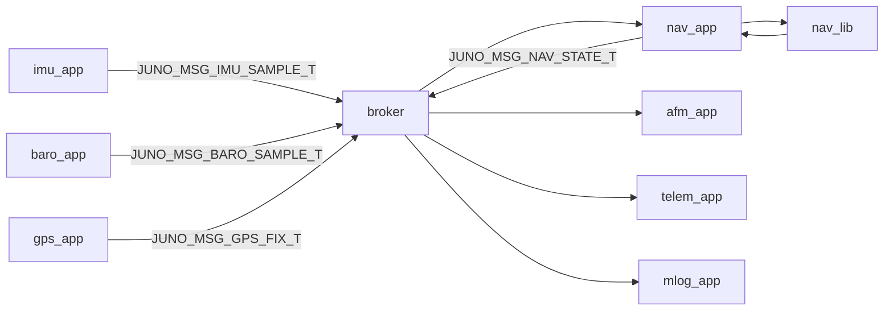
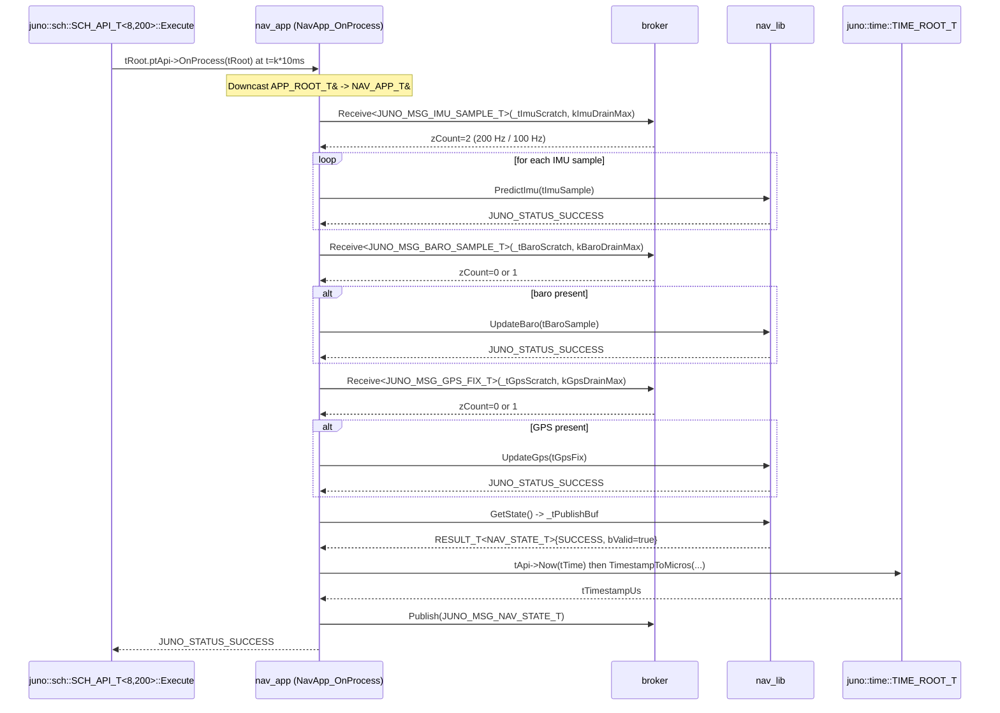

# nav_app — Software Design Description (L2)

**Document type:** IEEE 1016 Software Design Description
**Module:** `nav_app` (View / App layer in MVC)
**Scope:** L2 design for the navigation application that drives `nav_lib` at 100 Hz.
**Authoritative ancestors (do not contradict):** `docs/design/conventions.md`, `docs/design/system/system_design.md`, `libjuno/include/juno/app/app_api.hpp`.
**Requirement coverage:** `SW-REQ-NAV-APP-001` through `SW-REQ-NAV-APP-015`.

---

<!-- @{"design": ["SW-REQ-NAV-APP-001", "SW-REQ-NAV-APP-002", "SW-REQ-NAV-APP-003", "SW-REQ-NAV-APP-004", "SW-REQ-NAV-APP-005"]} -->
## 1. Purpose and Scope

This document specifies the L2 design of `nav_app`, the View-layer application that schedules and drains nav inputs, drives the `nav_lib` Controller at 100 Hz, and publishes `JUNO_MSG_NAV_STATE_T` on the software bus. It addresses every requirement in `docs/requirements/nav_app/requirements.json` (`SW-REQ-NAV-APP-001` … `SW-REQ-NAV-APP-015`). The app is the only writer of `JUNO_MSG_NAV_STATE_T` on the bus and the only direct caller of the `nav_lib` API at runtime.

**In scope:** the `OnStart` / `OnProcess` / `OnExit` lifecycle hooks (canonical from `juno::app::APP_API_T`, `conventions.md` §1.4), the free `NavAppInit` setup function called at the composition root, bus subscriptions and publication contract, per-tick orchestration of `nav_lib::PredictImu` / `UpdateBaro` / `UpdateGps` / `GetState`, the 10 ms timing budget, and ownership of the published message buffer.

**Out of scope:** all nav math, EKF state composition, divergence-bound enforcement, validity-flag derivation, deterministic numeric reproduction, and POSIX/Pico2 numeric equivalence — these are owned by `nav_lib` and designed in `docs/design/nav/design.md` (parents `SW-REQ-NAV-001` … `SW-REQ-NAV-017`). `nav_app` contains no business logic; it is a thin orchestrator over `nav_lib` plus the broker.

---

## 2. Definitions and Abbreviations

Cross-module vocabulary (phase enum, time base, frames, status semantics, message naming, scheduler-period units, body axes) is defined in `docs/design/conventions.md` §4 and inherited verbatim. Terms below are local to this design.

| Term | Meaning |
|------|---------|
| `nav_app` | The View-layer application designed by this document; lives in `apps/nav_app/`. |
| `nav_lib` | The Controller-layer library (`libs/nav_lib/`) that owns nav state and math. |
| `Drain` | The act of pulling all queued bus messages of a given type into the app's local POD buffer in a single tick. |
| `Predict step` | A call into `nav_lib::PredictImu(…)` advancing nav state by one IMU sample interval (5 ms). |
| `Update step` | A call into `nav_lib::UpdateBaro(…)` or `nav_lib::UpdateGps(…)` applying a measurement correction. |
| `bValid` | The boolean validity flag carried by `JUNO_MSG_NAV_STATE_T` and forwarded directly from `nav_lib::GetState`. |
| `OnStart` / `OnProcess` / `OnExit` | Canonical app lifecycle hooks (see `juno::app::APP_API_T`, `libjuno/include/juno/app/app_api.hpp`). |
| `NavAppInit` | Free composition-root setup function that wires DI references, calls `nav_lib::Init`, and aggregate-initializes the static `APP_API_T` vtable. |

Abbreviations: TDM = Time-Division Multiplexed; DI = Dependency Injection; POD = Plain Old Data; NED = North-East-Down (`conventions.md` §4.6).

---

<!-- @{"design": ["SW-REQ-NAV-APP-002", "SW-REQ-NAV-APP-003", "SW-REQ-NAV-APP-004", "SW-REQ-NAV-APP-005", "SW-REQ-NAV-APP-006"]} -->
## 3. System Overview

`nav_app` is a View-layer Juno FSW application following the LibJuno C++ module pattern (`conventions.md` §1) and the canonical `juno::app::APP_API_T` lifecycle (`conventions.md` §1.4, `libjuno/include/juno/app/app_api.hpp`). It is a thin orchestrator: every `OnProcess` tick it drains the broker for IMU/baro/GPS messages, hands each measurement to `nav_lib`, asks `nav_lib` for the latest state, and publishes one `JUNO_MSG_NAV_STATE_T`. It contains **no nav math** — all algorithmic behavior lives in `nav_lib` (per `architecture.md` separation: View ↔ Controller ↔ Model).

### 3.1 MVC layer mapping

| Layer | Realization in this module |
|-------|----------------------------|
| View (App) | `juno::nav_app::NAV_APP_T` — owns scheduling slot, the publish buffer, and DI references; embeds `juno::app::APP_ROOT_T tRoot` as its first member. |
| Controller (Lib) | `juno::nav::NAV_LIB_ROOT_T` — injected by reference at `NavAppInit`. Owned by `apps/main.cpp`. |
| Model (Bus) | `juno::sb::BROKER_ROOT_T<JUNO_MSG_BUS_VARIANT_T, 8, 64>` — injected by reference at `NavAppInit`. Routes IMU/BARO/GPS in, NAV_STATE out. |

### 3.2 Module context



### 3.3 Source layout, struct shape, and lifecycle hooks

There is **no parallel `NAV_APP_ROOT_T` ROOT type and no bespoke `NAV_APP_API_T` vtable** — `nav_app` consumes the canonical `juno::app::APP_ROOT_T` and `juno::app::APP_API_T` published by LibJuno (`libjuno/include/juno/app/app_api.hpp`). Per `conventions.md` §1.4, modules that consume already-published LibJuno interfaces do not redefine the ROOT/API types; they provide platform/algorithm-specific function implementations and aggregate-initialize the LibJuno-published ROOT.

| Artifact | Path |
|----------|------|
| Public header | `apps/nav_app/include/nav_app/nav_app.hpp` |
| Implementation | `apps/nav_app/src/nav_app.cpp` (single shared file; no POSIX/Pico2 split — app is platform-independent) |
| Period constant | `static constexpr uint32_t kNavAppPeriodMs = 10;` in `juno::nav_app` namespace |
| Composition-root setup | Free function `juno::nav_app::NavAppInit(NAV_APP_T &tApp, ...) noexcept` |
| Lifecycle hooks | Static `NavApp_OnStart`, `NavApp_OnProcess`, `NavApp_OnExit` (file-scope in `nav_app.cpp`); take `juno::app::APP_ROOT_T &` and downcast via `JUNO_MODULE_DERIVE` to `NAV_APP_T &`. |
| Subscriber/publish buffers | POD members of `NAV_APP_T` struct (no heap) |

The struct `NAV_APP_T` is a `JUNO_MODULE_DERIVE(juno::app::APP_ROOT_T, …)` aggregate whose first member is `juno::app::APP_ROOT_T tRoot;`. The macro layout guarantees `&tApp.tRoot` is a usable upcast and `JUNO_MODULE_DERIVE` provides the inverse downcast inside the static hook bodies. There are no member functions; `OnStart`/`OnProcess`/`OnExit` are static free functions wired into a file-scope `static const juno::app::APP_API_T tApi{}` (the sole file-scope datum, §10).

---

<!-- @{"design": ["SW-REQ-NAV-APP-001", "SW-REQ-NAV-APP-002", "SW-REQ-NAV-APP-003", "SW-REQ-NAV-APP-004", "SW-REQ-NAV-APP-005", "SW-REQ-NAV-APP-006", "SW-REQ-NAV-APP-007", "SW-REQ-NAV-APP-008", "SW-REQ-NAV-APP-009", "SW-REQ-NAV-APP-010"]} -->
## 4. Interface Definitions

The app does **not** expose a function-reference vtable to other apps (cross-app coupling is forbidden by `architecture.md` and `constraints.md`). It exposes two surfaces: (1) a free `NavAppInit` to the composition root, and (2) the canonical `juno::app::APP_API_T` vtable to `juno::sch::SCH_API_T<8, 200>::Execute()`. All public functions are `noexcept`; the struct is trivially constructible (`conventions.md` §1.3).

### 4.1 Header sketch

```cpp
// apps/nav_app/include/nav_app/nav_app.hpp
#pragma once
#include "juno/module.h"
#include "juno/module.hpp"
#include "juno/status.h"
#include "juno/app/app_api.hpp"
#include "juno/sb/broker_api.hpp"
#include "juno/time/time_api.hpp"
#include "nav_lib/nav_api.hpp"
#include "afm_lib/afm_api.hpp"   // juno::afm::JUNO_PHASE_T (for boost-phase gating per SW-REQ-NAV-APP-014)
#include "imu_lib/imu_msg.hpp"
#include "baro_lib/baro_msg.hpp"
#include "gps_lib/gps_msg.hpp"
#include "nav_lib/nav_msg.hpp"
#include "afm_lib/afm_msg.hpp"   // JUNO_MSG_AFM_PHASE_T subscription
#include <cstddef>
#include <cstdint>

namespace juno::nav_app
{

static constexpr uint32_t kNavAppPeriodMs = 10;     // 100 Hz, per SW-REQ-NAV-APP-001
static constexpr size_t   kImuDrainMax    = 4;      // 200 Hz / 100 Hz = 2; 2x slack
static constexpr size_t   kBaroDrainMax   = 2;      // 20 Hz / 100 Hz < 1; 2x slack
static constexpr size_t   kGpsDrainMax    = 2;      // 5 Hz / 100 Hz < 1; 2x slack

struct NAV_APP_T JUNO_MODULE_DERIVE(juno::app::APP_ROOT_T,
    // Non-owning DI references (set by NavAppInit, valid for program lifetime).
    juno::nav::NAV_LIB_ROOT_T                                           *_ptNavLib;
    juno::sb::BROKER_ROOT_T<JUNO_MSG_BUS_VARIANT_T, 8, 64>              *_ptBus;
    juno::time::TIME_ROOT_T                                             *_ptTime;
    // Caller-owned, statically sized scratch buffers for one tick's drained messages.
    JUNO_MSG_IMU_SAMPLE_T                                                _tImuScratch[kImuDrainMax];
    JUNO_MSG_BARO_SAMPLE_T                                               _tBaroScratch[kBaroDrainMax];
    JUNO_MSG_GPS_FIX_T                                                   _tGpsScratch[kGpsDrainMax];
    JUNO_MSG_NAV_STATE_T                                                 _tPublishBuf;
    // Phase-aware gating state (SW-REQ-NAV-APP-014, SW-REQ-NAV-APP-015).
    // Latest phase observed from JUNO_MSG_AFM_PHASE_T subscription; initial value
    // JUNO_PHASE_PRE_LAUNCH; updated whenever a new AFM_PHASE message is drained.
    juno::afm::JUNO_PHASE_T                                              _ePhase;
    // Monotonic-µs timestamp of the most recent BOOST→non-BOOST transition.
    // Set to 0 while in or before BOOST; populated when BOOST exits.
    // Used to enforce the 1-second settling window per SW-REQ-NAV-APP-015.
    JUNO_TIME_US_T                                                       _tBoostExitUs;
);

// Settling window after boost exit before re-enabling baro/GPS updates.
// Per SW-REQ-NAV-APP-015. Caller may override at composition-root via
// NAV_APP_INIT_T (future amendment) but the default is canonical for FT1.
static constexpr JUNO_TIME_US_T kNavAppBoostSettlingUs = 1000000;  // 1.0 s

// Composition-root setup. Wires DI references and aggregate-initializes the
// canonical juno::app::APP_API_T vtable into tApp.tRoot via juno::app::AppInit.
JUNO_STATUS_T NavAppInit(
    NAV_APP_T                                                &tApp,
    juno::nav::NAV_LIB_ROOT_T                                &tNavLib,
    juno::sb::BROKER_ROOT_T<JUNO_MSG_BUS_VARIANT_T, 8, 64>   &tBus,
    juno::time::TIME_ROOT_T                                  &tTime,
    JUNO_FAILURE_HANDLER_T                                    pfcnFailureHandler,
    JUNO_USER_DATA_T                                         *pvUserData
) noexcept;

} // namespace juno::nav_app
```

`NAV_APP_T` is a POD aggregate via `JUNO_MODULE_DERIVE(juno::app::APP_ROOT_T, …)` — first member is `juno::app::APP_ROOT_T tRoot;` (provided by the macro), no constructor, no destructor, no virtual. The lifecycle hooks (`NavApp_OnStart`, `NavApp_OnProcess`, `NavApp_OnExit`) are static functions in the implementation TU and never appear in the public header; they reach `NAV_APP_T` members by downcasting `APP_ROOT_T &` via `JUNO_MODULE_DERIVE`.

### 4.2 NavAppInit contract (composition-root setup)

<!-- @{"design": ["SW-REQ-NAV-APP-002", "SW-REQ-NAV-APP-003", "SW-REQ-NAV-APP-004"]} -->

| Attribute | Value |
|-----------|-------|
| Signature | `JUNO_STATUS_T NavAppInit(NAV_APP_T&, NAV_LIB_ROOT_T&, BROKER_ROOT_T<JUNO_MSG_BUS_VARIANT_T, 8, 64>&, TIME_ROOT_T&, JUNO_FAILURE_HANDLER_T, JUNO_USER_DATA_T*) noexcept` |
| Preconditions | `tNavLib`, `tBus`, `tTime` previously constructed via their respective `New()` factories (see `system_design.md` §8.1). Called from `apps/main.cpp` before any scheduler dispatch. |
| Postconditions | `_ptNavLib`, `_ptBus`, `_ptTime` set to the addresses of the injected references. The static file-scope `juno::app::APP_API_T tApi{ &NavApp_OnStart, &NavApp_OnProcess, &NavApp_OnExit }` is wired into `tApp.tRoot` via `juno::app::AppInit(tApp.tRoot, tApi, pfcnFailureHandler, pvUserData)`. Subscriptions to `JUNO_MSG_IMU_SAMPLE_T`/`JUNO_MSG_BARO_SAMPLE_T`/`JUNO_MSG_GPS_FIX_T` and the call to `nav_lib::Init(NAV_INIT_T)` are deferred to `OnStart` (per `conventions.md` §1.4: subscribe at `OnStart`, not at composition). |
| Error conditions | Propagates the status from `juno::app::AppInit`; `JUNO_STATUS_NULLPTR_ERROR` is asserted by `JUNO_ASSERT_EXISTS` on the references (diagnostic only). |
| Thread safety | Single-threaded composition root; called once per app instance. |

### 4.3 NavApp_OnStart contract

<!-- @{"design": ["SW-REQ-NAV-APP-002", "SW-REQ-NAV-APP-003", "SW-REQ-NAV-APP-004"]} -->

| Attribute | Value |
|-----------|-------|
| Signature | `static JUNO_STATUS_T NavApp_OnStart(juno::app::APP_ROOT_T &tApp) noexcept` |
| Preconditions | `NavAppInit` previously returned `SUCCESS`; the composition root has constructed every DI dependency. Called once per app instance before `juno::sch::SCH_API_T<8, 200>::Execute()` enters the cyclic-executive loop (see `system_design.md` §8.1 step 7). |
| Postconditions | (1) Downcast `APP_ROOT_T&` to `NAV_APP_T&` via `JUNO_MODULE_DERIVE`. (2) Calls `_ptNavLib->ptApi->Init(*_ptNavLib, NAV_INIT_T{ … , .fGpsBoundM = juno::nav::kNavGpsBoundM_default, … // plus all configurable noise/covariance fields per nav/design.md §4.1 NAV_INIT_T extended schema and nav/algorithm.md §5.1 — caller-supplied at composition root, no pinned defaults … })` to seed the filter. (3) Subscribes the broker channels for `JUNO_MSG_IMU_SAMPLE_T`, `JUNO_MSG_BARO_SAMPLE_T`, `JUNO_MSG_GPS_FIX_T`, **and `JUNO_MSG_AFM_PHASE_T`** (added per `SW-REQ-NAV-APP-014`). (4) Initializes phase-tracker state: `_ePhase = JUNO_PHASE_PRE_LAUNCH`; `_tBoostExitUs = 0`. (5) Returns `JUNO_STATUS_SUCCESS` on success. |
| Error conditions | Subscription failure or `nav_lib::Init` failure propagated via `JUNO_ASSERT_SUCCESS`. The composition root logs the status and (per `system_design.md` §8.1 step 6) marks the corresponding POST bit; `nav_app` does not auto-recover. |
| Thread safety | Single-threaded composition root caller only; called once per app instance. |

### 4.4 NavApp_OnProcess contract

<!-- @{"design": ["SW-REQ-NAV-APP-001", "SW-REQ-NAV-APP-005", "SW-REQ-NAV-APP-006", "SW-REQ-NAV-APP-007", "SW-REQ-NAV-APP-008", "SW-REQ-NAV-APP-009", "SW-REQ-NAV-APP-010", "SW-REQ-NAV-APP-014", "SW-REQ-NAV-APP-015"]} -->

| Attribute | Value |
|-----------|-------|
| Signature | `static JUNO_STATUS_T NavApp_OnProcess(juno::app::APP_ROOT_T &tApp) noexcept` |
| Preconditions | `NavApp_OnStart` previously returned `SUCCESS`. Called by `juno::sch::SCH_API_T<8, 200>::Execute()` on each 10 ms minor-frame boundary in which the schedule table places this app's `APP_ROOT_T*`. |
| Postconditions | One per-tick body: downcast → drain `JUNO_MSG_AFM_PHASE_T` (latest message updates `_ePhase`; on transition out of `JUNO_PHASE_BOOST` set `_tBoostExitUs = _ptTime->TimestampToMicros(_ptTime->ptApi->Now(*_ptTime).tOk).tOk`) → drain IMU (≤`kImuDrainMax`) → predict×n (always; PredictImu is unconditional per `SW-REQ-NAV-APP-014`'s scope which excludes IMU) → drain baro → **conditional UpdateBaro**: skip if `_ePhase == JUNO_PHASE_BOOST` OR if `(_tBoostExitUs > 0 && (tNowUs - _tBoostExitUs) < kNavAppBoostSettlingUs)` — note the guard `_tBoostExitUs > 0` is the LEFT operand of `&&` so short-circuit evaluation prevents the unsigned subtraction from running when `_tBoostExitUs == 0` (pre-boost startup) (`SW-REQ-NAV-APP-014`/`-015`); else call → drain GPS → **conditional UpdateGps**: same gating predicate as UpdateBaro → `nav_lib::GetState(_tPublishBuf)` → fill `_tPublishBuf.tTimestampUs` from `_ptTime->TimestampToMicros(_ptTime->ptApi->Now(*_ptTime).tOk).tOk` (canonical member-function form per `libjuno/include/juno/time/time_api.hpp`; matches the pattern used in baro_app/imu_app/gps_app/afm_app) → `_ptBus->ptApi->Publish(JUNO_MSG_NAV_STATE_T)`. Always publishes one `JUNO_MSG_NAV_STATE_T` per tick (`SW-REQ-NAV-APP-005`/`-010`); `bValid` forwarded verbatim from `nav_lib` (`SW-REQ-NAV-APP-008`/`-009`). During boost + settling the filter dead-reckons via repeated PredictImu calls; nav_lib has no phase awareness — the gating decision is exclusively `nav_app`'s (cross-reference `nav/algorithm.md` §8). |
| Error conditions | Drain or publish failure does not break the schedule (see §9); status returned for diagnostic use only. The hook returns `SUCCESS` whenever a publish was attempted, even if `bValid=false`. |
| Thread safety | TDM caller only; never concurrent with itself. |

### 4.5 NavApp_OnExit contract

| Attribute | Value |
|-----------|-------|
| Signature | `static JUNO_STATUS_T NavApp_OnExit(juno::app::APP_ROOT_T &tApp) noexcept` |
| Preconditions | None. |
| Postconditions | No-op for FT1 — returns `JUNO_STATUS_SUCCESS`. POSIX test harnesses may invoke this as a graceful shutdown hook; flight (Pico2) never invokes it (`SW-REQ-SYS-047`, `conventions.md` §1.4). The static `APP_API_T tApi{}` and `NAV_APP_T` storage are caller-owned and outlive the call. |
| Notes | Provided to satisfy the canonical three-hook API (`juno::app::APP_API_T`, `libjuno/include/juno/app/app_api.hpp`); FT1 never relies on its side effects. |

### 4.6 Aggregate-init template (composition root)

```cpp
namespace juno::nav_app
{
static JUNO_STATUS_T NavApp_OnStart  (juno::app::APP_ROOT_T &tApp) noexcept;
static JUNO_STATUS_T NavApp_OnProcess(juno::app::APP_ROOT_T &tApp) noexcept;
static JUNO_STATUS_T NavApp_OnExit   (juno::app::APP_ROOT_T &tApp) noexcept;

JUNO_STATUS_T NavAppInit(
    NAV_APP_T &tApp,
    juno::nav::NAV_LIB_ROOT_T &tNavLib,
    juno::sb::BROKER_ROOT_T<JUNO_MSG_BUS_VARIANT_T, 8, 64> &tBus,
    juno::time::TIME_ROOT_T &tTime,
    JUNO_FAILURE_HANDLER_T pfcnFailureHandler,
    JUNO_USER_DATA_T *pvUserData
) noexcept
{
    tApp._ptNavLib = &tNavLib;
    tApp._ptBus    = &tBus;
    tApp._ptTime   = &tTime;
    static const juno::app::APP_API_T tApi {
        &NavApp_OnStart, &NavApp_OnProcess, &NavApp_OnExit
    };
    return juno::app::AppInit(tApp.tRoot, tApi, pfcnFailureHandler, pvUserData);
}
}
```

---

<!-- @{"design": ["SW-REQ-NAV-APP-008", "SW-REQ-NAV-APP-009", "SW-REQ-NAV-APP-010", "SW-REQ-NAV-APP-011"]} -->
## 5. State Machines

The app's published validity flag mirrors `nav_lib`'s internal state machine (a one-to-one forwarding of `bValid`). This section documents the **observable** state of `nav_app` as seen via `JUNO_MSG_NAV_STATE_T.bValid` over the bus; the underlying numeric machine lives in `nav_lib`.

```mermaid
stateDiagram-v2
    [*] --> Uninitialized
    Uninitialized --> Aligning: NavApp_OnStart returned SUCCESS, first OnProcess tick
    Aligning --> Running: nav_lib reports bValid=true (alignment converged)
    Running --> Diverged: nav_lib reports bValid=false (e.g., GPS divergence bound exceeded, SW-REQ-NAV-APP-011)
    Diverged --> Running: nav_lib reports bValid=true again
    Aligning --> Aligning: nav_lib still aligning; publish with bValid=false
    Running --> Aligning: required inputs unavailable (SW-REQ-NAV-APP-009 / SW-REQ-SYS-059)
    Diverged --> Diverged: bound still violated; publish with bValid=false
```



Rules (all observable on the bus):

- In every state, `nav_app` publishes one `JUNO_MSG_NAV_STATE_T` per `OnProcess` tick at 10 ms cadence (`SW-REQ-NAV-APP-005`, `SW-REQ-NAV-APP-010`). The published `bValid` is forwarded verbatim from `nav_lib::GetState` (`SW-REQ-NAV-APP-008`).
- `bValid = false` is published when required nav inputs are unavailable (`SW-REQ-NAV-APP-009`, parent `SW-REQ-SYS-059`); the app does **not** stop publishing (`SW-REQ-NAV-APP-010`, parent `SW-REQ-SYS-034`).
- The `nav_app` does not own the divergence-bound logic (`SW-REQ-NAV-APP-011` is satisfied at the lib boundary by `SW-REQ-NAV-014` with `juno::nav::kNavGpsBoundM_default = 200.0` configured at `OnStart`); it only forwards the resulting `bValid`.
- `nav_app` itself has no internal mutable state beyond the scratch buffers, the `_tPublishBuf`, and DI pointers; the state machine above is a projection of `nav_lib`'s state onto observable bus messages.

---

<!-- @{"design": ["SW-REQ-NAV-APP-002", "SW-REQ-NAV-APP-003", "SW-REQ-NAV-APP-004", "SW-REQ-NAV-APP-005", "SW-REQ-NAV-APP-006"]} -->
## 6. Data Flow

### 6.1 Subscriptions (inputs)

| Type | Publisher | Period | Per-tick drain count (nominal) | Buffer field |
|------|-----------|--------|--------------------------------|--------------|
| `JUNO_MSG_IMU_SAMPLE_T` | `imu_app` | 5 ms (200 Hz) | 2 samples / 10 ms tick | `_tImuScratch[kImuDrainMax]` |
| `JUNO_MSG_BARO_SAMPLE_T` | `baro_app` | 50 ms (20 Hz) | ~0.2 / tick (0 or 1; 1 every 5th tick) | `_tBaroScratch[kBaroDrainMax]` |
| `JUNO_MSG_GPS_FIX_T` | `gps_app` | 200 ms (5 Hz) | ~0.05 / tick (0 or 1; 1 every 20th tick) | `_tGpsScratch[kGpsDrainMax]` |
| `JUNO_MSG_AFM_PHASE_T` | `afm_app` | 10 ms (100 Hz) | 1 / tick (publish-on-every-tick — see below) | `_ePhase` (latest-value retention) |

Subscription is performed in `NavApp_OnStart` (per `conventions.md` §1.4: "Called once per app before the first `OnProcess` (init resources, subscribe to bus messages)").

**AFM_PHASE delivery semantics (closes implementation-readiness gap G4 from 2026-05-03 SSE-R re-review).** `afm_app` publishes `JUNO_MSG_AFM_PHASE_T` on **every** 10 ms tick, not only on phase transitions, per `docs/design/afm_app/design.md` §6 and §11.2 ("Publish-on-every-tick. SW-REQ-AFM-APP-005 requires publishing the current phase each scheduled cycle"). `nav_app` therefore has at least one phase message available per tick in steady state; transitions are detected by consumers via the message's `tTransitionUs` field which only updates on strict-increase phase changes (`SW-REQ-AFM-APP-006`). `nav_app`'s drain pattern is "consume all queued; retain the latest `ePhase` in `_ePhase`": even if the broker delivers ≥1 message per tick, only the most recent is kept, so the `_ePhase` member always reflects the latest published phase. On the very first tick where `nav_app` runs, `_ePhase` defaults to `JUNO_PHASE_PRE_LAUNCH` (set in `OnStart` per §4.3) — this matches `afm_app`'s own initial state, so a missed first phase message does not change `nav_app`'s gating decision. Boost-exit detection requires `nav_app` to compare `_ePhase` between successive ticks (it transitions away from `JUNO_PHASE_BOOST` exactly once); the previous-tick comparison is implicit in the `OnProcess` body (§4.4).

**Bus arrival semantics:**

- IMU at 200 Hz produces **2 IMU samples per 10 ms nav tick** in steady state. The app drains both via successive `nav_lib::PredictImu(…)` calls; both are consumed before any `Update` step (so corrections apply to the freshest propagated state).
- Baro at 20 Hz produces **~0.2 samples per nav tick** — i.e., a sample arrives on roughly every 5th tick. When present, the app drains it and calls `nav_lib::UpdateBaro(…)`. When absent, no update step is taken; this is normal and does not gate publishing (`SW-REQ-NAV-APP-010`).
- GPS at 5 Hz produces **~0.05 samples per nav tick**. The drain caps (`kImuDrainMax = 4`, `kBaroDrainMax = 2`, `kGpsDrainMax = 2`) provide 2x slack to absorb scheduler jitter or a missed prior tick.

### 6.2 Publications (outputs)

| Type | Subscribers | Period | Buffer field |
|------|-------------|--------|--------------|
| `JUNO_MSG_NAV_STATE_T` | `afm_app`, `telem_app`, `mlog_app` | 10 ms (100 Hz, `SW-REQ-NAV-APP-005`) | `_tPublishBuf` |

The published `_tPublishBuf` of type `JUNO_MSG_NAV_STATE_T` matches the canonical field-shape table 1:1 (doubles for all numeric fields). Per `conventions.md` §4.4 single-source-of-truth rule, the field-shape table lives in `docs/design/nav/design.md` §4.1 and is **not redefined here**; `nav_app` writes the buffer with the byte-equivalent layout shared between `juno::nav::NAV_STATE_T` and `JUNO_MSG_NAV_STATE_T`. `nav_app` populates `tTimestampUs` (monotonic µs from `juno::time::TimestampToMicros`, `SW-REQ-NAV-APP-007`) immediately before publish; every other field is the verbatim `nav_lib::GetState` payload (`SW-REQ-NAV-APP-006`/`-008`).

### 6.3 Buffer ownership recap

```
imu_app/baro_app/gps_app  ── publish ──▶  broker (copies into channel buffers)
broker  ── Receive ──▶  nav_app._t*Scratch[]  (caller-owned, statically sized)
nav_app  ── Predict/Update/GetState ──▶  nav_lib (no allocation)
nav_app._tPublishBuf  ── Publish ──▶  broker (copies to subscribers)
```

---

<!-- @{"design": ["SW-REQ-NAV-APP-001", "SW-REQ-NAV-APP-002", "SW-REQ-NAV-APP-003", "SW-REQ-NAV-APP-004", "SW-REQ-NAV-APP-005", "SW-REQ-NAV-APP-006", "SW-REQ-NAV-APP-007", "SW-REQ-NAV-APP-008", "SW-REQ-NAV-APP-009", "SW-REQ-NAV-APP-010", "SW-REQ-NAV-APP-013"]} -->
## 7. Sequence Diagrams

### 7.1 OnStart — initial subscriptions and `nav_lib::Init`

```mermaid
sequenceDiagram
    participant main as apps/main.cpp
    participant nav_app as nav_app (NavApp_OnStart)
    participant broker
    participant nav_lib

    Note over main: Composition root: NavAppInit returned SUCCESS;<br/>about to enter SCH_API_T<8,200>::Execute()
    main->>nav_app: tApp.tRoot.ptApi->OnStart(tApp.tRoot)
    Note over nav_app: Downcast APP_ROOT_T& -> NAV_APP_T&<br/>via JUNO_MODULE_DERIVE
    nav_app->>nav_lib: Init(NAV_INIT_T{ fGpsBoundM=kNavGpsBoundM_default=200.0, ... })
    nav_lib-->>nav_app: JUNO_STATUS_SUCCESS
    nav_app->>broker: Subscribe(kJunoMsgImuSampleId)
    broker-->>nav_app: SUCCESS
    nav_app->>broker: Subscribe(kJunoMsgBaroSampleId)
    broker-->>nav_app: SUCCESS
    nav_app->>broker: Subscribe(kJunoMsgGpsFixId)
    broker-->>nav_app: SUCCESS
    nav_app->>broker: Subscribe(kJunoMsgAfmPhaseId)
    broker-->>nav_app: SUCCESS
    Note over nav_app: _ePhase = JUNO_PHASE_PRE_LAUNCH<br/>_tBoostExitUs = 0
    nav_app-->>main: JUNO_STATUS_SUCCESS
```

### 7.2 OnProcess — nominal 10 ms tick (drain → predict ×2 → optional update → publish)



### 7.3 OnProcess — error / divergence path (`OnProcess` returns with `bValid=false`)

```mermaid
sequenceDiagram
    participant sch as juno::sch::SCH_API_T<8,200>::Execute
    participant nav_app as nav_app (NavApp_OnProcess)
    participant broker
    participant nav_lib

    sch->>nav_app: tRoot.ptApi->OnProcess(tRoot)
    nav_app->>broker: Receive<JUNO_MSG_IMU_SAMPLE_T>(...)
    broker-->>nav_app: zCount=0  (imu_app unhealthy or scheduler jitter)
    Note over nav_app: SW-REQ-NAV-APP-010: continue publishing.<br/>No PredictImu calls this tick.
    nav_app->>broker: Receive<JUNO_MSG_BARO_SAMPLE_T>(...)
    broker-->>nav_app: zCount=0
    nav_app->>broker: Receive<JUNO_MSG_GPS_FIX_T>(...)
    broker-->>nav_app: zCount=1 (stale fix beyond fGpsBoundM)
    nav_app->>nav_lib: UpdateGps(tStaleFix)
    nav_lib-->>nav_app: juno::nav::JUNO_FSW_STATUS_DIVERGED_ERROR
    Note over nav_lib: state machine Aligned -> Diverged
    nav_app->>nav_lib: GetState() -> _tPublishBuf
    nav_lib-->>nav_app: RESULT_T<NAV_STATE_T>{SUCCESS, bValid=false}<br/>(SW-REQ-NAV-APP-009 / SW-REQ-NAV-012)
    nav_app->>broker: Publish(JUNO_MSG_NAV_STATE_T{bValid=false})
    nav_app-->>sch: JUNO_STATUS_SUCCESS  (publish attempted; failure handler logged divergence)
```

---

<!-- @{"design": ["SW-REQ-NAV-APP-001", "SW-REQ-NAV-APP-005", "SW-REQ-NAV-APP-012", "SW-REQ-NAV-APP-013"]} -->
## 8. Timing and Scheduling Analysis

- **TDM period:** `kNavAppPeriodMs = 10` (100 Hz). Source: `conventions.md` §4.5; parents `SW-REQ-SYS-012`, `SW-REQ-NAV-APP-001`, `SW-REQ-NAV-APP-005`.
- **Slot budget:** Every `NavApp_OnProcess` invocation must complete within the 10 ms TDM slot. The system-level hyperperiod schedule (`system_design.md` §8.2) co-runs `nav_app`, `afm_app`, and `mlog_app` on the 10 ms boundary; the system-level analysis confirms the combined budget fits.
- **Per-tick worst-case work:**
  1. Downcast `APP_ROOT_T&` to `NAV_APP_T&` via `JUNO_MODULE_DERIVE` (compile-time pointer arithmetic).
  2. Drain up to 4 IMU messages (worst case under jitter): 4 × broker read.
  3. Up to 2 calls to `nav_lib::PredictImu` (nominal — extra two are reserved for catch-up).
  4. Drain up to 2 baro messages; ≤1 `nav_lib::UpdateBaro` call.
  5. Drain up to 2 GPS messages; ≤1 `nav_lib::UpdateGps` call.
  6. One `nav_lib::GetState` call.
  7. One `juno::time::TimestampToMicros` read (`Now` + conversion).
  8. One broker publish.
- **Determinism (`SW-REQ-NAV-APP-013`, parent `SW-REQ-SYS-044`):** The drain order is fixed (IMU → baro → GPS → GetState → publish), per-message work is constant-time, and `nav_lib` is itself deterministic (`SW-REQ-NAV-015`). With static buffers and no heap, the schedule is reproducible bit-for-bit on repeated input sequences in the POSIX/Trick build (validated downstream by `SW-REQ-NAV-APP-012` / `SW-REQ-NAV-016`).
- **Downstream consumers** of `JUNO_MSG_NAV_STATE_T`: `afm_app` (10 ms, `kAfmAppPeriodMs = 10`), `telem_app` (500 ms, `kTelemAppPeriodMs = 500`), `mlog_app` (5 ms, `kMlogAppPeriodMs = 5` — runs at IMU cadence per `SW-REQ-SYS-011`; sees a fresh `JUNO_MSG_NAV_STATE_T` once every other tick). All consumers either match or run slower than this app's 100 Hz publish rate.
- **Slot ordering rationale:** `nav_app` runs after `imu_app` (5 ms boundary, has just emitted at most one IMU sample for this 10 ms window — combined with the prior 5 ms tick's sample, two are queued). `afm_app` runs after `nav_app` on the same 10 ms boundary so it consumes the freshly published `JUNO_MSG_NAV_STATE_T`. `mlog_app` runs at every 5 ms boundary alongside `imu_app`; on the boundary that coincides with a `nav_app` tick, `mlog_app` sees the freshly published NAV state if `nav_app` precedes `mlog_app` in the minor-frame slot order (per `system_design.md` §8.1).
- **Replacement of legacy `sch_lib::Run()`:** The cyclic-executive entry from the composition root is `juno::sch::SCH_API_T<8, 200>::Execute(tSch)` per `conventions.md` §1.2/§1.4; there is no `sch_lib::Run()` symbol. The scheduler dispatches each app via `tArrSchTable[i][j]->ptApi->OnProcess(*tArrSchTable[i][j])`.

---

<!-- @{"design": ["SW-REQ-NAV-APP-008", "SW-REQ-NAV-APP-009", "SW-REQ-NAV-APP-010"]} -->
## 9. Error Handling Strategy

`nav_app` follows the system-wide error-handling idiom (`system_design.md` §9; `conventions.md` §4.3). The app's own behavior:

1. **Status propagation.** Every internal call (`broker.Receive`, `nav_lib::PredictImu`, `nav_lib::UpdateBaro`, `nav_lib::UpdateGps`, `nav_lib::GetState`, `broker.Publish`, `juno::time::TimestampToMicros`) is guarded by `JUNO_ASSERT_SUCCESS` / `JUNO_ASSERT_OK`. Bare `if`-return is forbidden (`coding-standards.md`).
2. **No control-flow alteration on failure handler.** A `JUNO_FAILURE_HANDLER_T` is captured at `NavAppInit` and stored in `tApp.tRoot._pfcnFailureHandler` by `juno::app::AppInit`; per `conventions.md` §4.3, **failure handlers are diagnostic-only and never alter control flow**. A failed update step does not halt the tick.
3. **Drain failure.** If `broker.Receive<…>` returns an error or `zCount == 0`, the app skips the corresponding step set (no `Predict` / `Update` calls made for that sensor on that tick). It still calls `nav_lib::GetState` and publishes (`SW-REQ-NAV-APP-010`, parent `SW-REQ-SYS-034`). The published `bValid` is whatever `nav_lib` reports — typically `false` after sustained input loss (`SW-REQ-NAV-APP-009`, parent `SW-REQ-SYS-059`).
4. **`nav_lib` step failure.** A non-success status from `PredictImu` / `UpdateBaro` / `UpdateGps` (including `juno::nav::JUNO_FSW_STATUS_DIVERGED_ERROR`) is logged via the failure handler; the tick continues to `GetState` and publishes — `bValid` will reflect the lib's view. The app does not retry, does not buffer, and does not insert synthetic samples.
5. **Publish failure.** A failed `broker.Publish` is logged via the failure handler. The app does **not** retry within the tick; the next tick's publish is independent.
6. **`OnStart` failure.** A non-success return from `nav_lib::Init` or any subscription propagates from `NavApp_OnStart` to the composition root, which logs the status and marks the corresponding POST bit (`system_design.md` §8.1 step 6). The cyclic-executive loop still starts; subsequent `OnProcess` ticks observe `bValid=false` from `nav_lib::GetState` until external power-cycle.
7. **No exceptions.** Every function is `noexcept` (`coding-standards.md`, `SW-REQ-SYS-053`). A stray throw would invoke `std::terminate`; the design treats this as a structural invariant.
8. **Health bit.** `nav_app` itself does **not** own a per-sensor health bit — sensor health is owned by the publishing apps (`imu_app`, `baro_app`, `gps_app`) per `system_design.md` §9. `nav_app`'s `bValid = false` publication is the observable signal that nav is degraded.

---

## 10. Memory Ownership

Per `conventions.md` §5; reaffirmed here for `nav_app`. The single file-scope datum in `apps/nav_app/src/nav_app.cpp` is:

```cpp
static const juno::app::APP_API_T tApi{ &NavApp_OnStart, &NavApp_OnProcess, &NavApp_OnExit };
```

declared at function scope inside `NavAppInit` so it is constructed once on first call and read-only thereafter.

| Buffer / facility | Owner | Lifetime | Allocation |
|-------------------|-------|----------|------------|
| `NAV_APP_T` instance (`tNavApp`) | composition root (`apps/main.cpp`) | program lifetime | Static `.bss` — caller-owned |
| `tNavApp.tRoot` (`juno::app::APP_ROOT_T`, first member of `NAV_APP_T`) | composition root | program lifetime | Static `.bss`; wired by `juno::app::AppInit` |
| `static const juno::app::APP_API_T tApi` (in `NavAppInit`) | `NavAppInit` function-scope `static`, file-scope datum | program lifetime | Read-only after construction (sole file-scope datum) |
| `_tImuScratch[kImuDrainMax]` | `NAV_APP_T` member | program lifetime | Static, fixed-capacity, in `.bss` |
| `_tBaroScratch[kBaroDrainMax]` | `NAV_APP_T` member | program lifetime | Static |
| `_tGpsScratch[kGpsDrainMax]` | `NAV_APP_T` member | program lifetime | Static |
| `_tPublishBuf` (`JUNO_MSG_NAV_STATE_T`) | `NAV_APP_T` member | program lifetime | Static |
| References `_ptNavLib`, `_ptBus`, `_ptTime` | non-owning pointers (DI) | injected by composition root, valid for program lifetime | n/a |
| `JUNO_FAILURE_HANDLER_T` chain | composition root (typically `log_lib`) | program lifetime | Static |

Asserted invariants (verbatim from `conventions.md` §5):

1. **Caller owns all storage.** `nav_app` allocates nothing; the composition root constructs `NAV_APP_T` as a static-storage-duration object.
2. **No `new`, `delete`, `malloc`, `calloc`, `realloc`, `free`, no heap-backed STL containers** (`SW-REQ-SYS-050`, `constraints.md`).
3. **No global mutable state.** The `static const juno::app::APP_API_T tApi` in `NavAppInit` is the only file-scope datum; it is read-only after construction.
4. **Apps own published messages until the broker copies them.** `_tPublishBuf` is filled in-place each tick and handed to the broker by reference; the broker copies into channel storage before returning.
5. **No constructors / destructors.** `NAV_APP_T` is trivially constructible (zero-initialized in `.bss`); `NavAppInit`, `NavApp_OnStart`, `NavApp_OnProcess`, `NavApp_OnExit` are explicit free/static functions.
6. **No virtual dispatch, no RTTI** (`SW-REQ-SYS-051`, `SW-REQ-SYS-052`).

---

## 11. Traceability

Per-section `<!-- @{"design": [...]} -->` tags above are authoritative; this table is descriptive consolidation. Every `SW-REQ-NAV-APP-NNN` tag from the prior revision of this document is preserved and re-attached to the equivalent rewritten section.

| Req ID | Title | Section(s) |
|--------|-------|-----------|
| SW-REQ-NAV-APP-001 | Nav App Scheduled at 100 Hz | §1, §3.3, §4.1, §4.4, §7.2, §8 |
| SW-REQ-NAV-APP-002 | IMU Message Subscription | §1, §3.1, §3.2, §4.2, §4.3, §6.1, §7.1 |
| SW-REQ-NAV-APP-003 | Barometer Message Subscription | §1, §3.1, §3.2, §4.2, §4.3, §6.1, §7.1 |
| SW-REQ-NAV-APP-004 | GPS Message Subscription | §1, §3.1, §3.2, §4.2, §4.3, §6.1, §7.1 |
| SW-REQ-NAV-APP-005 | Nav State Published at 100 Hz | §1, §3.1, §4.4, §6.2, §7.2, §8 |
| SW-REQ-NAV-APP-006 | Sixteen-State Composition Published | §3, §4.4, §6.2, §7.2 |
| SW-REQ-NAV-APP-007 | Nav State Timestamp | §4.4, §6.2, §7.2 |
| SW-REQ-NAV-APP-008 | Validity Flag Published | §4.4, §5, §6.2, §9 |
| SW-REQ-NAV-APP-009 | Validity False on Missing Inputs | §4.4, §5, §7.3, §9 |
| SW-REQ-NAV-APP-010 | Continue Publishing on Missing Inputs | §4.4, §5, §6, §7.3, §9 |
| SW-REQ-NAV-APP-011 | Position Bound to Latest GPS Fix | §5 (forwarded `bValid` from `nav_lib`; numerics owned by `SW-REQ-NAV-014`; `kNavGpsBoundM_default = 200.0` configured at `OnStart`) |
| SW-REQ-NAV-APP-012 | POSIX Build Functional Equivalence | §3.3 (single-shared-impl), §10 (no platform-specific code), §11 equivalence note |
| SW-REQ-NAV-APP-013 | Deterministic Navigation Output | §8 (fixed drain order, static buffers, deterministic `nav_lib`) |
| SW-REQ-NAV-APP-014 | Boost-Phase Sensor Update Skipping | §3.3 (NAV_APP_T `_ePhase` member + AFM_PHASE subscription); §4.3 (OnStart subscription added); §4.4 (OnProcess gating predicate skips UpdateBaro/UpdateGps when `_ePhase == JUNO_PHASE_BOOST`) |
| SW-REQ-NAV-APP-015 | Post-Boost Settling Window | §3.3 (`_tBoostExitUs` member + `kNavAppBoostSettlingUs = 1000000` µs constant); §4.4 (OnProcess gating predicate extends skip while `_tBoostExitUs > 0 && (tNowUs - _tBoostExitUs) < kNavAppBoostSettlingUs` — guard ordered first to short-circuit the subtraction at startup) |

**POSIX/Pico2 functional equivalence (`SW-REQ-NAV-APP-012`, parent `SW-REQ-SYS-043`):** `nav_app` is platform-independent — there is no `src/posix/` or `src/pico2/` split for the app; the same `apps/nav_app/src/nav_app.cpp` is built for both targets. Functional equivalence is therefore inherited from the dependencies it injects (`nav_lib`, `juno::sb::BROKER_ROOT_T`, `juno::time::TIME_ROOT_T`), each of which carries its own POSIX/Pico2 equivalence requirement (`SW-REQ-NAV-016`, etc.).

**Determinism (`SW-REQ-NAV-APP-013`, parent `SW-REQ-SYS-044`):** Achieved by (1) fixed compile-time period (`kNavAppPeriodMs`); (2) fixed per-tick drain → predict → update → publish ordering inside `NavApp_OnProcess`; (3) static-only memory; (4) `noexcept` everywhere; (5) reliance on `nav_lib`'s deterministic output (`SW-REQ-NAV-015`). No runtime polymorphism after `NavAppInit` (`SW-REQ-SYS-051`).

**Cross-references for §11 completeness:** parent SYS requirements covered transitively — `SW-REQ-SYS-002` (live nav, via -002/-003/-004), `SW-REQ-SYS-012` (100 Hz, via -001/-005/-007), `SW-REQ-SYS-013` (16-state, via -006), `SW-REQ-SYS-014` (GPS bound, via -011), `SW-REQ-SYS-015` (validity, via -008), `SW-REQ-SYS-026` (µs time base, via -007), `SW-REQ-SYS-034` (degraded continuation, via -010), `SW-REQ-SYS-043` (POSIX equivalence, via -012), `SW-REQ-SYS-044` (determinism, via -013), `SW-REQ-SYS-059` (validity false on missing inputs, via -009).
