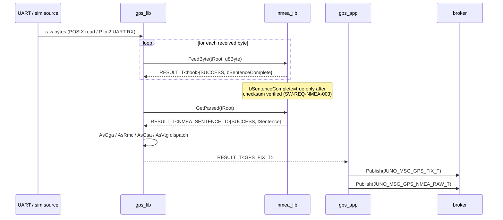
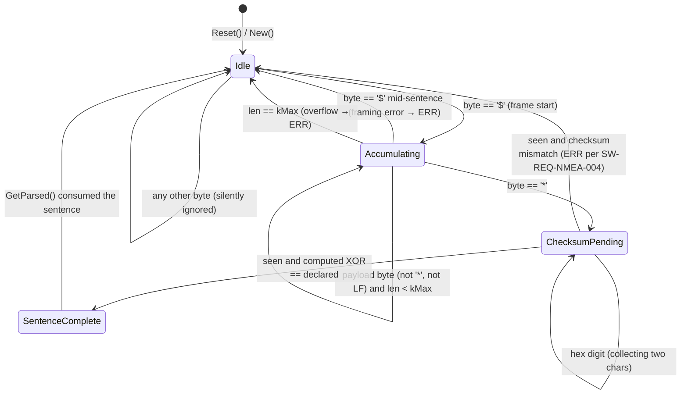
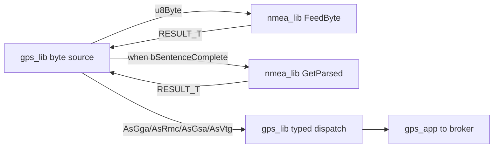
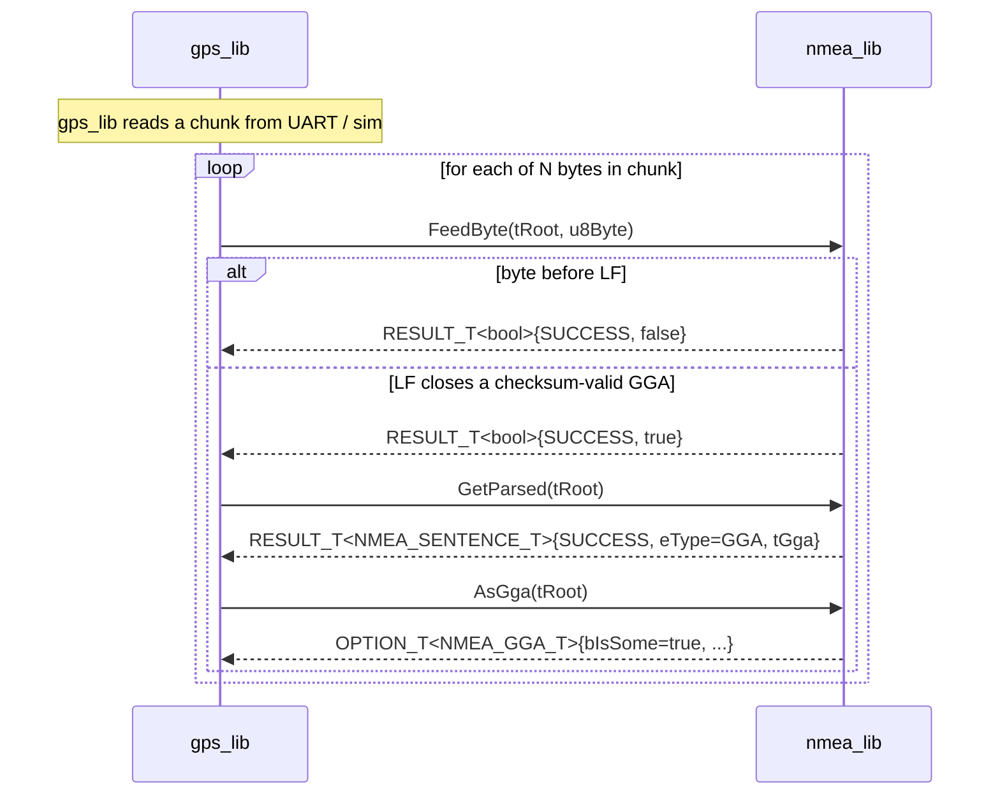

# NMEA Library — L2 Design (`nmea_lib`)

**Document type:** IEEE 1016 Software Design Description (L2, per-module)
**Module:** `libs/nmea_lib/` — namespace `juno::nmea`
**Layer:** Controller (Library) — pure compute, no hardware, no bus.
**References (do not contradict):** `docs/design/conventions.md` (authoritative for cross-module names), `docs/design/system/system_design.md` (L1 system context), `docs/requirements/nmea/requirements.json` (12 requirements).

---

<!-- @{"design": ["SW-REQ-NMEA-001", "SW-REQ-NMEA-002", "SW-REQ-NMEA-003", "SW-REQ-NMEA-004", "SW-REQ-NMEA-005", "SW-REQ-NMEA-006", "SW-REQ-NMEA-007", "SW-REQ-NMEA-008", "SW-REQ-NMEA-009", "SW-REQ-NMEA-010", "SW-REQ-NMEA-011", "SW-REQ-NMEA-012"]} -->
## 1. Purpose and Scope

The `nmea_lib` library is a pure, stateless-leaning NMEA-0183 sentence parser. It addresses every requirement in `docs/requirements/nmea/requirements.json` (`SW-REQ-NMEA-001` through `SW-REQ-NMEA-012`) and provides the byte-stream-to-typed-record transformation consumed by `gps_lib` / `gps_app`.

In scope:
- Streaming sentence accumulation from a byte stream (one byte per call) into a fixed-size internal buffer.
- Sentence-type identification (talker + type code, e.g., `$GPGGA`, `$GPRMC`, `$GPGSA`, `$GPVTG`) (`SW-REQ-NMEA-009`).
- Embedded `*HH` checksum verification before any field decoding (`SW-REQ-NMEA-003`, `SW-REQ-NMEA-004`).
- Field decoding of GGA, RMC, GSA, VTG into typed POD records (`SW-REQ-NMEA-001`, `-002`, `-008`).
- Unit/format conversion at the parser boundary: degrees-minutes → decimal degrees (`SW-REQ-NMEA-005`), altitude in meters (`SW-REQ-NMEA-006`), knots → m/s (`SW-REQ-NMEA-007`).
- Malformed-field rejection with explicit error status (`SW-REQ-NMEA-012`).
- Determinism and POSIX/Pico2 byte-equivalence (`SW-REQ-NMEA-010`, `SW-REQ-NMEA-011`).

Out of scope:
- UART / serial / hardware I/O — `gps_lib` owns the byte source (`SW-REQ-GPS-001`).
- Bus publishing — `gps_app` owns publication of `JUNO_MSG_GPS_FIX_T` / `JUNO_MSG_GPS_UTC_T` / `JUNO_MSG_GPS_NMEA_RAW_T`.
- WGS-84 / HAE semantic interpretation beyond unit preservation — owned by nav/gps consumers (`SW-REQ-GPS-010`, system L1 `SW-REQ-SYS-038`/`-039`).
- Sentence types beyond GGA/RMC/GSA/VTG — non-target sentences are identified, then either ignored or surfaced as type `UNKNOWN`; fields are not decoded.

---

## 2. Definitions and Abbreviations

Cross-module vocabulary (time base, frames, units, status semantics, message naming) is defined in `docs/design/conventions.md` §4 and **not** redefined here. This module is pure compute and does not publish bus messages, so §4.4 (message naming) does not apply directly; it does inherit `JUNO_TIME_US_T` (`conventions.md` §4.2) when surfacing UTC fix time records.

| Term | Meaning |
|------|---------|
| NMEA-0183 | NMEA standard for ASCII GPS sentences, lines `$<talker><type>,<fields>*HH<CR><LF>` |
| Sentence | One complete NMEA line, framing `$` ... `*HH<CR><LF>` |
| Talker ID | Two-letter prefix after `$` (e.g., `GP` for GPS, `GN` for multi-GNSS) — accepted, ignored downstream |
| Type code | Three-letter sentence type (e.g., `GGA`, `RMC`, `GSA`, `VTG`) |
| Checksum | Hex byte = XOR of every char between `$` and `*` exclusive; printed as two upper-case hex chars |
| Fix quality | NMEA GGA field-6 enum (0=no fix, 1=GPS fix, 2=DGPS, ...); preserved as raw `uint8_t` |
| ddmm.mmmm | NMEA latitude format: degrees × 100 + minutes; converted to decimal degrees per `SW-REQ-NMEA-005` |
| Pure compute | No I/O, no time queries, no allocation, no global state — same inputs always yield same outputs |
| `JUNO_TIME_US_T` | `uint64_t` monotonic microseconds (defined by `juno::time`, `conventions.md` §4.2) |

---

<!-- @{"design": ["SW-REQ-NMEA-001", "SW-REQ-NMEA-002", "SW-REQ-NMEA-009", "SW-REQ-NMEA-010"]} -->
## 3. System Overview

### 3.1 MVC mapping

| Layer | Realization |
|-------|-------------|
| View (App) | None — `nmea_lib` has no app. It is consumed by `gps_app` via `gps_lib`. |
| Controller (Lib) | `juno::nmea::NMEA_LIB_ROOT_T` — function-reference vtable + parser working state. |
| Model (Bus) | None — `nmea_lib` does not interact with the broker. Bus publication is `gps_app`'s responsibility (per system L1 §4 and `conventions.md` §4.4). |

### 3.2 Module composition (sequence: `gps_lib` feeds bytes → `nmea_lib` emits parsed struct)



The `nmea_lib` is purely a transformer: bytes in, typed records out. It exposes neither hardware handles nor bus handles. Its single platform-agnostic implementation (`src/nmea_impl.cpp`) is identical on POSIX and Pico2, satisfying `SW-REQ-NMEA-010` by construction.

### 3.3 File layout

| Artifact | Path |
|----------|------|
| Public API header | `libs/nmea_lib/include/nmea_lib/nmea_api.hpp` |
| Impl header | `libs/nmea_lib/include/nmea_lib/nmea_impl.hpp` |
| Shared impl source | `libs/nmea_lib/src/nmea_impl.cpp` |
| Public types header | `libs/nmea_lib/include/nmea_lib/nmea_types.hpp` |
| Unit test | `libs/nmea_lib/tests/nmea_test.cpp` (Google Test, POSIX build) |

There is **no** per-platform sub-directory under `src/` for `nmea_lib`. The single shared `nmea_impl.cpp` is linked by both POSIX and Pico2 composition roots. The `IMPL_T` pattern is preserved for cross-module consistency (`conventions.md` §1.2) — the impl simply has no platform-specific members.

---

<!-- @{"design": ["SW-REQ-NMEA-001", "SW-REQ-NMEA-002", "SW-REQ-NMEA-003", "SW-REQ-NMEA-004", "SW-REQ-NMEA-005", "SW-REQ-NMEA-006", "SW-REQ-NMEA-007", "SW-REQ-NMEA-008", "SW-REQ-NMEA-009", "SW-REQ-NMEA-012"]} -->
## 4. Interface Definitions

### 4.1 Constants and types

```cpp
namespace juno::nmea
{

static constexpr size_t kMaxSentenceLen = 128;  // NMEA-0183 max line length (82 spec + safety)

enum class NMEA_TYPE_T : uint8_t
{
    NMEA_TYPE_UNKNOWN = 0,
    NMEA_TYPE_GGA     = 1,
    NMEA_TYPE_RMC     = 2,
    NMEA_TYPE_GSA     = 3,
    NMEA_TYPE_VTG     = 4,
};

struct NMEA_UTC_T
{
    uint16_t u16Year;     // 0 if absent
    uint8_t  u8Month;     // 1..12, 0 if absent
    uint8_t  u8Day;       // 1..31, 0 if absent
    uint8_t  u8Hour;      // 0..23
    uint8_t  u8Minute;    // 0..59
    uint8_t  u8Second;    // 0..59
    uint32_t u32Microsec; // 0..999999
};

struct NMEA_GGA_T
{
    NMEA_UTC_T tUtc;            // SW-REQ-NMEA-008
    double     dLatDeg;         // decimal degrees, +N/-S (SW-REQ-NMEA-005)
    double     dLonDeg;         // decimal degrees, +E/-W (SW-REQ-NMEA-005)
    uint8_t    u8FixQuality;    // GGA field 6 raw enum
    uint8_t    u8NumSats;       // 0..99
    float      fHdop;           // unitless
    float      fAltMHae;        // meters above WGS-84 ellipsoid (SW-REQ-NMEA-006)
    float      fGeoidSepM;      // meters
};

struct NMEA_RMC_T
{
    NMEA_UTC_T tUtc;            // SW-REQ-NMEA-008
    bool       bDataValid;      // 'A' = true, 'V' = false
    double     dLatDeg;         // decimal degrees (SW-REQ-NMEA-005)
    double     dLonDeg;         // decimal degrees (SW-REQ-NMEA-005)
    float      fSpeedMps;       // m/s, converted from knots (SW-REQ-NMEA-007)
    float      fCourseDeg;      // true heading, degrees
};

struct NMEA_GSA_T
{
    uint8_t u8Mode;             // 'A'=0 auto, 'M'=1 manual
    uint8_t u8FixDim;           // 1=no fix, 2=2D, 3=3D
    uint8_t au8PrnUsed[12];     // PRNs of satellites used, 0 = empty slot
    float   fPdop;
    float   fHdop;
    float   fVdop;
};

struct NMEA_VTG_T
{
    float fCourseTrueDeg;       // true heading
    float fCourseMagDeg;        // magnetic heading (0 if absent)
    float fSpeedMps;            // m/s, converted from knots (SW-REQ-NMEA-007)
};

struct NMEA_SENTENCE_T
{
    NMEA_TYPE_T eType;
    union
    {
        NMEA_GGA_T tGga;
        NMEA_RMC_T tRmc;
        NMEA_GSA_T tGsa;
        NMEA_VTG_T tVtg;
    } tBody;
    uint8_t  au8RawBytes[kMaxSentenceLen]; // verbatim, including '$' and '*HH<CR><LF>'
    uint16_t u16RawLen;                    // 0..kMaxSentenceLen
};

struct NMEA_LIB_ROOT_T;

struct NMEA_LIB_API_T
{
    JUNO_STATUS_T          (&Reset)     (NMEA_LIB_ROOT_T &tRoot) noexcept;
    RESULT_T<bool>         (&FeedByte)  (NMEA_LIB_ROOT_T &tRoot, uint8_t u8Byte) noexcept;
    RESULT_T<NMEA_SENTENCE_T> (&GetParsed)(NMEA_LIB_ROOT_T &tRoot) noexcept;
    OPTION_T<NMEA_GGA_T>   (&AsGga)     (const NMEA_LIB_ROOT_T &tRoot) noexcept;
    OPTION_T<NMEA_RMC_T>   (&AsRmc)     (const NMEA_LIB_ROOT_T &tRoot) noexcept;
    OPTION_T<NMEA_GSA_T>   (&AsGsa)     (const NMEA_LIB_ROOT_T &tRoot) noexcept;
    OPTION_T<NMEA_VTG_T>   (&AsVtg)     (const NMEA_LIB_ROOT_T &tRoot) noexcept;
};

struct NMEA_LIB_ROOT_T JUNO_MODULE_ROOT(NMEA_LIB_API_T,
    uint8_t  _au8Buf[kMaxSentenceLen];   // accumulator buffer (caller-owned via ROOT_T storage)
    uint16_t _u16BufLen;                 // 0..kMaxSentenceLen
    uint8_t  _u8State;                   // §5 state machine
    NMEA_SENTENCE_T _tLastParsed;        // populated only when state == SentenceComplete & checksum-OK
    bool     _bLastValid;
);

} // namespace juno::nmea
```

The `IMPL_T` carries no extra members; it exists for pattern consistency:

```cpp
struct NMEA_LIB_IMPL_T JUNO_MODULE_DERIVE(NMEA_LIB_ROOT_T,
    static JUNO_STATUS_T          Reset    (NMEA_LIB_ROOT_T &tRoot) noexcept;
    static RESULT_T<bool>         FeedByte (NMEA_LIB_ROOT_T &tRoot, uint8_t u8Byte) noexcept;
    static RESULT_T<NMEA_SENTENCE_T> GetParsed(NMEA_LIB_ROOT_T &tRoot) noexcept;
    static OPTION_T<NMEA_GGA_T>   AsGga    (const NMEA_LIB_ROOT_T &tRoot) noexcept;
    static OPTION_T<NMEA_RMC_T>   AsRmc    (const NMEA_LIB_ROOT_T &tRoot) noexcept;
    static OPTION_T<NMEA_GSA_T>   AsGsa    (const NMEA_LIB_ROOT_T &tRoot) noexcept;
    static OPTION_T<NMEA_VTG_T>   AsVtg    (const NMEA_LIB_ROOT_T &tRoot) noexcept;

    static RESULT_T<NMEA_LIB_IMPL_T> New(
        JUNO_FAILURE_HANDLER_T pfcnFailureHandler,
        JUNO_USER_DATA_T      *pvUserData
    ) noexcept;
);
```

`New()` wires the static `tApi` once per `conventions.md` §1.2 and zero-initializes the accumulator state.

### 4.2 Function contracts

#### 4.2.1 `Reset`

| Attribute | Value |
|-----------|-------|
| Signature | `JUNO_STATUS_T Reset(NMEA_LIB_ROOT_T &tRoot) noexcept` |
| Preconditions | `tRoot` initialized via `New()` |
| Postconditions | `_u16BufLen=0`, `_u8State=Idle`, `_bLastValid=false` |
| Error conditions | None — returns `JUNO_STATUS_SUCCESS` |
| Thread safety | Not thread-safe; single TDM caller |

#### 4.2.2 `FeedByte`

<!-- @{"design": ["SW-REQ-NMEA-003", "SW-REQ-NMEA-004", "SW-REQ-NMEA-009"]} -->

| Attribute | Value |
|-----------|-------|
| Signature | `RESULT_T<bool> FeedByte(NMEA_LIB_ROOT_T &tRoot, uint8_t u8Byte) noexcept` |
| Preconditions | `tRoot` initialized via `New()` |
| Postconditions | Byte appended to accumulator; on `<LF>` the line is closed and checksum verified. Returns `tOk=true` only when a complete checksum-valid sentence is now available; `tOk=false` while accumulating. |
| Error conditions | `JUNO_STATUS_ERR` when checksum mismatch (`SW-REQ-NMEA-004`); `JUNO_STATUS_ERR` when buffer overflow (sentence > `kMaxSentenceLen`); `JUNO_STATUS_ERR` when framing error (e.g., `$` mid-sentence). On any error, state resets to `Idle`. |
| Thread safety | Not thread-safe |

#### 4.2.3 `GetParsed`

<!-- @{"design": ["SW-REQ-NMEA-001", "SW-REQ-NMEA-002", "SW-REQ-NMEA-009", "SW-REQ-NMEA-012"]} -->

| Attribute | Value |
|-----------|-------|
| Signature | `RESULT_T<NMEA_SENTENCE_T> GetParsed(NMEA_LIB_ROOT_T &tRoot) noexcept` |
| Preconditions | The most recent `FeedByte` returned `tOk=true` (sentence complete, checksum OK) |
| Postconditions | Returns a populated `NMEA_SENTENCE_T` with `eType` set per `SW-REQ-NMEA-009` and the corresponding union member populated. `au8RawBytes`/`u16RawLen` reflect the verbatim input line. State transitions back to `Idle`. |
| Error conditions | `JUNO_STATUS_DNE_ERROR` if no complete sentence is available; `JUNO_STATUS_ERR` if any field is malformed (`SW-REQ-NMEA-012`) — non-numeric where numeric expected, out-of-range, or wrong field count for the discriminated `eType`. |
| Thread safety | Not thread-safe |

#### 4.2.4 `AsGga` / `AsRmc` / `AsGsa` / `AsVtg`

<!-- @{"design": ["SW-REQ-NMEA-001", "SW-REQ-NMEA-002", "SW-REQ-NMEA-005", "SW-REQ-NMEA-006", "SW-REQ-NMEA-007", "SW-REQ-NMEA-008"]} -->

| Attribute | Value |
|-----------|-------|
| Signature | `OPTION_T<NMEA_GGA_T> AsGga(const NMEA_LIB_ROOT_T &tRoot) noexcept` (and likewise for RMC/GSA/VTG) |
| Preconditions | A successful `GetParsed` immediately preceded the call |
| Postconditions | Returns `bIsSome=true` with the typed body when `eType` matches the accessor; otherwise `bIsSome=false`. `dLatDeg`/`dLonDeg` are decimal degrees (`SW-REQ-NMEA-005`); `fAltMHae` is meters (`SW-REQ-NMEA-006`); `fSpeedMps` is m/s (`SW-REQ-NMEA-007`); `tUtc` is populated for sentences carrying time (`SW-REQ-NMEA-008`). |
| Error conditions | None — type-mismatch is signalled by `OPTION_T::bIsSome=false`, not an error |
| Thread safety | Not thread-safe; const-qualified read-only |

Doxygen comment blocks (the `/** @brief ... */` form per `coding-standards.md`) accompany each declaration in `nmea_api.hpp`.

---

<!-- @{"design": ["SW-REQ-NMEA-003", "SW-REQ-NMEA-004", "SW-REQ-NMEA-009", "SW-REQ-NMEA-011", "SW-REQ-NMEA-012"]} -->
## 5. State Machines

The library is **not** functionally pure across calls — `FeedByte` accumulates bytes — but each `(prior state, byte)` → `(new state, output)` transition is deterministic, satisfying `SW-REQ-NMEA-011`. The accumulator is therefore modelled as a small FSM owned by the `ROOT_T`:



State encoding (in `_u8State`): `0=Idle`, `1=Accumulating`, `2=ChecksumPending`, `3=SentenceComplete`.

Determinism rules (`SW-REQ-NMEA-011`):

- No floating-point inputs to the state transition logic; only ASCII byte values.
- No time queries inside `FeedByte`/`GetParsed`.
- No global mutable state; identical inputs against an identical `ROOT_T` snapshot always produce the identical state and `_tLastParsed`.
- Field decoding is a deterministic ASCII-to-numeric routine using only `JUNO_STATUS_T` propagation; rejection on malformed input (`SW-REQ-NMEA-012`) precedes any storage of partial values.

---

<!-- @{"design": ["SW-REQ-NMEA-010"]} -->
## 6. Data Flow

`nmea_lib` does **not** publish or subscribe to any bus message. The caller (`gps_lib`, in turn driven by `gps_app`) is the only data path.



Bus type names produced by `gps_app` (`JUNO_MSG_GPS_FIX_T`, `JUNO_MSG_GPS_UTC_T`, `JUNO_MSG_GPS_NMEA_RAW_T`) are owned by `gps_lib`/`gps_app` per `system_design.md` §4 and `conventions.md` §4.4. `nmea_lib` only exposes `NMEA_GGA_T` / `NMEA_RMC_T` / `NMEA_GSA_T` / `NMEA_VTG_T`; the mapping into bus messages is `gps_lib`'s responsibility.

POSIX/Pico2 byte-equivalence (`SW-REQ-NMEA-010`) follows from the single shared impl source: every conversion is integer or `static_cast<float|double>` from a scaled integer, with no `printf`/`scanf` and no platform `<math.h>` calls.

---

<!-- @{"design": ["SW-REQ-NMEA-001", "SW-REQ-NMEA-002", "SW-REQ-NMEA-003", "SW-REQ-NMEA-004", "SW-REQ-NMEA-009"]} -->
## 7. Sequence Diagrams

### 7.1 Nominal: GGA sentence accepted



### 7.2 Error path: bad checksum

```mermaid
sequenceDiagram
    participant gps_lib
    participant nmea_lib
    gps_lib->>nmea_lib: FeedByte(...) [stream of bytes]
    Note over nmea_lib: ChecksumPending: declared=*5A, computed=*5B
    gps_lib->>nmea_lib: FeedByte(tRoot, '\n')
    nmea_lib-->>gps_lib: RESULT_T<bool>{ERR, false}
    Note over nmea_lib: state → Idle (SW-REQ-NMEA-004)<br/>caller marks sentence rejected
    gps_lib->>gps_lib: discard; await next '$'
```

### 7.3 Error path: malformed numeric field

```mermaid
sequenceDiagram
    participant gps_lib
    participant nmea_lib
    gps_lib->>nmea_lib: FeedByte(...) [complete checksum-valid line]
    nmea_lib-->>gps_lib: RESULT_T<bool>{SUCCESS, true}
    gps_lib->>nmea_lib: GetParsed(tRoot)
    Note over nmea_lib: lat field "abcd.efgh" rejected by ASCII-to-number<br/>(SW-REQ-NMEA-012)
    nmea_lib-->>gps_lib: RESULT_T<NMEA_SENTENCE_T>{ERR, ...}
    Note over gps_lib: discard; do NOT publish a fix
```

---

<!-- @{"design": ["SW-REQ-NMEA-011"]} -->
## 8. Timing and Scheduling Analysis

`nmea_lib` is a library, not an app — it has no TDM period. Its callers are:

| Caller | Period (per `system_design.md` §3.3, `conventions.md` §4.5) | Worst-case `nmea_lib` work per period |
|--------|-------------------------------------------------------------|---------------------------------------|
| `gps_app` (via `gps_lib`) | `kGpsAppPeriodMs = 200` | One sentence per cycle at 5 Hz nominal (`SW-REQ-SYS-009`); typically 4–8 sentence types per UART frame burst (GGA + RMC + GSA + VTG). |

`FeedByte` is O(1) per call (single-byte append + occasional XOR update). `GetParsed` is O(L) where L ≤ `kMaxSentenceLen = 128`. With ≤ 8 sentences × ≤128 bytes = ≤ 1024 `FeedByte` calls plus 8 `GetParsed`/dispatch invocations per 200 ms slot, the parser's contribution to the `gps_app` slot budget is bounded by a small fixed constant of integer-arithmetic operations — well below the per-tick budget enforced by `system_design.md` §8.2.

The parser is fully synchronous and never blocks; `gps_lib` is responsible for non-blocking reads (`SW-REQ-GPS-004`) and for not feeding more bytes than its slot budget allows.

Determinism (`SW-REQ-NMEA-011`) is structural: identical input byte sequences against an identical `ROOT_T` produce identical `_tLastParsed` outputs across calls and across builds (`SW-REQ-NMEA-010`).

---

<!-- @{"design": ["SW-REQ-NMEA-003", "SW-REQ-NMEA-004", "SW-REQ-NMEA-012"]} -->
## 9. Error Handling Strategy

`nmea_lib` follows the system-wide error-handling idiom (`conventions.md` §4.3, `system_design.md` §9). Concretely:

1. **Status propagation.** Every fallible API uses `JUNO_STATUS_T` / `RESULT_T<T>` / `OPTION_T<T>`. Callers use `JUNO_ASSERT_OK(tResult, return tResult.tStatus)` and `JUNO_ASSERT_SOME(tOption, return JUNO_STATUS_DNE_ERROR)`; bare `if`-return is a review failure.
2. **Failure handler.** `JUNO_FAILURE_HANDLER_T pfcnFailureHandler` is injected at `New()` and invoked only for diagnostic logging — for example, on checksum mismatch the handler is called with a context string and `JUNO_STATUS_ERR`. **The handler is diagnostic-only and does not alter control flow.** State recovery (`Accumulating → Idle` after framing error) is internal to `FeedByte` regardless of whether a handler is wired.
3. **Checksum failure** (`SW-REQ-NMEA-004`). On `ChecksumPending → Idle (mismatch)`, `FeedByte` returns `RESULT_T<bool>{JUNO_STATUS_ERR, false}`. `_tLastParsed` is **not** populated. Caller discards the sentence; verbatim raw-bytes pass-through is `gps_lib`'s separate path (`SW-REQ-GPS-002`, `SW-REQ-SYS-024`) and is unaffected.
4. **Malformed field** (`SW-REQ-NMEA-012`). `GetParsed` returns `RESULT_T<NMEA_SENTENCE_T>{JUNO_STATUS_ERR, ...}` with `eType` left as the discriminated type but body undefined; the caller must not consume it. State transitions to `Idle`. The accessor `AsGga`/etc. is not called in this path.
5. **Buffer overflow.** Sentences exceeding `kMaxSentenceLen` are rejected with `JUNO_STATUS_ERR`; state resets to `Idle`. This is a defensive guard against a stuck UART; it is not expected in nominal operation.
6. **No exceptions.** `-fno-exceptions` (`SW-REQ-SYS-053`); every API function is `noexcept`.
7. **Health-bit linkage.** `nmea_lib` does not own a health bit. `gps_lib` decides how to translate parser errors into the GPS health bit (`SW-REQ-GPS-006`/`-007`, `SW-REQ-SYS-031`/`-058`); from `nmea_lib`'s perspective, the contract is "explicit error status surfaced; caller decides".

---

<!-- @{"design": ["SW-REQ-NMEA-010", "SW-REQ-NMEA-011"]} -->
## 10. Memory Ownership

Per `conventions.md` §5 and `constraints.md`:

| Buffer / facility | Owner | Lifetime | Allocation |
|-------------------|-------|----------|------------|
| `NMEA_LIB_IMPL_T` instance | composition root (`apps/main.cpp`) | program lifetime, `.bss` zero-init | Static — caller-owned |
| Accumulator buffer `_au8Buf[kMaxSentenceLen]` | inline member of `NMEA_LIB_ROOT_T` | program lifetime | Static — embedded in caller-owned `IMPL_T` |
| `_tLastParsed` (`NMEA_SENTENCE_T`) | inline member of `NMEA_LIB_ROOT_T` | program lifetime | Static — embedded |
| Caller's input byte | caller's stack/register | per-call | Caller-owned, copied into `_au8Buf` by value |
| `RESULT_T<NMEA_SENTENCE_T>` returned from `GetParsed` | caller's stack | per-call | Caller-owned, by value |
| Vtable (`tApi`) | `NMEA_LIB_IMPL_T::New()` factory, file-scope `static` local | program lifetime | Read-only after construction |

Asserted invariants:

- **Caller owns all storage.** `nmea_lib` never allocates.
- **No `new`, `delete`, `malloc`, `calloc`, `realloc`, `free`, no heap-backed STL containers** (`SW-REQ-SYS-050`, `constraints.md`).
- **No global mutable state.** The only file-scope datum is the read-only `tApi` table inside `New()` (`conventions.md` §5 rule 3).
- **No constructors / destructors** on `NMEA_LIB_ROOT_T` or `NMEA_LIB_IMPL_T` (`conventions.md` §1.3) — both are trivially constructible so that `.bss` zero-init is the equivalent of `Reset()`.
- **No platform headers** in lib code (`-ffreestanding`); the impl uses only `<cstddef>` / `<cstdint>` and LibJuno headers.
- **No buffers passed across the API boundary by pointer.** Callers feed bytes by value and receive `NMEA_SENTENCE_T` by value (it is ≤ ~200 B; copy is cheap and removes any aliasing hazard).

---

## 11. Traceability

Per-section `<!-- @{"design": [...]} -->` tags above are authoritative; this table is descriptive consolidation. Every `SW-REQ-NMEA-NNN` is mapped to at least one section.

| Req ID | Title | Section(s) |
|--------|-------|-----------|
| SW-REQ-NMEA-001 | GGA Sentence Parsing | §1, §3, §4.1, §4.2.3, §4.2.4, §7.1 |
| SW-REQ-NMEA-002 | RMC Sentence Parsing | §1, §3, §4.1, §4.2.3, §4.2.4, §7 |
| SW-REQ-NMEA-003 | Checksum Validation | §1, §4.2.2, §5, §7.2, §9 |
| SW-REQ-NMEA-004 | Reject Sentences with Invalid Checksum | §1, §4.2.2, §5, §7.2, §9 |
| SW-REQ-NMEA-005 | Decimal Geodetic Coordinate Output | §1, §4.1, §4.2.4 |
| SW-REQ-NMEA-006 | Altitude Reported in Meters | §1, §4.1, §4.2.4 |
| SW-REQ-NMEA-007 | Ground Speed Converted to SI Units | §1, §4.1, §4.2.4 |
| SW-REQ-NMEA-008 | UTC Time Extraction | §1, §4.1, §4.2.4 |
| SW-REQ-NMEA-009 | Sentence Type Identification | §1, §3, §4.1, §4.2.2, §4.2.3, §5 |
| SW-REQ-NMEA-010 | POSIX and Pico2 Parser Equivalence | §1, §3.3, §6, §10 |
| SW-REQ-NMEA-011 | Deterministic Parsing | §1, §5, §8, §10 |
| SW-REQ-NMEA-012 | Reject Malformed Fields | §1, §4.2.3, §5, §9 |

POSIX/Pico2 functional equivalence statement (`SW-REQ-SYS-043`, addressed locally by `SW-REQ-NMEA-010`): `nmea_lib` ships a single platform-agnostic `nmea_impl.cpp` linked unchanged by both POSIX and Pico2 composition roots. There is no platform-specific divergence; integer/float arithmetic and ASCII parsing are deterministic across both targets, satisfying byte-equivalence by construction.
