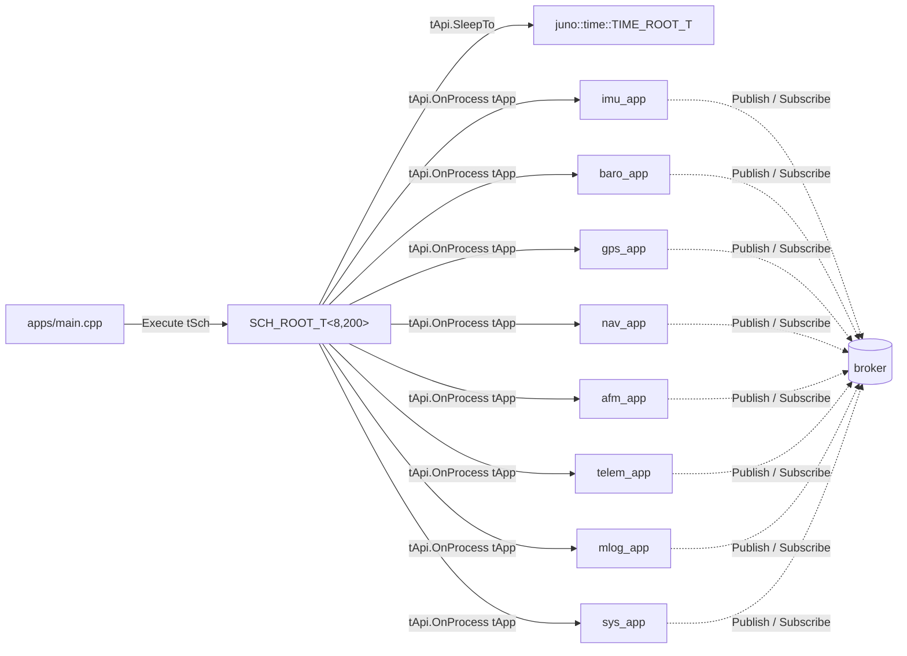

# sch — FT1 Cyclic-Executive Scheduler Platform Implementation — Design (L2)

**Document type:** IEEE 1016 Software Design Description
**Module:** FT1 platform implementations of `juno::sch::SCH_API_T<8, 200>`
**LibJuno header (canonical, do not redefine):** `libjuno/include/juno/sch/juno_sch_api.hpp`
**FT1 platform sources:** `libs/sch/src/posix/sch_posix.cpp`, `libs/sch/src/pico2/sch_pico2.cpp`
**Requirements addressed:** `SW-REQ-SCH-001` through `SW-REQ-SCH-010`
**References (do not contradict):** `docs/design/conventions.md`, `docs/design/system/system_design.md`, `libjuno/include/juno/app/app_api.hpp`, `libjuno/include/juno/time/time_api.hpp`, `libjuno/include/juno/status.h`

---

<!-- @{"design": ["SW-REQ-SCH-001", "SW-REQ-SCH-002", "SW-REQ-SCH-003", "SW-REQ-SCH-004", "SW-REQ-SCH-005", "SW-REQ-SCH-006", "SW-REQ-SCH-007", "SW-REQ-SCH-008", "SW-REQ-SCH-009", "SW-REQ-SCH-010"]} -->
## 1. Purpose and Scope

This L2 design specifies the FT1 platform implementations of LibJuno's cyclic-executive scheduler API `juno::sch::SCH_API_T<8, 200>::{Execute, GetMinorFramePeriod, GetMajorFramePeriod}` for the POSIX (host / Trick SITL) and Pico2 (RP2350 flight) targets, populating an `juno::sch::SCH_ROOT_T<8, 200>` whose embedded 2D schedule table `tArrSchTable[200][8]` realises the FT1 static schedule (8 application slots per minor frame, 200 minor frames per major frame, with a 5 ms minor-frame period, yielding a 1000 ms major frame). LibJuno already publishes the canonical `SCH_ROOT_T<NAppsPerFrame, NFrames>` aggregate, the `SCH_API_T<NAppsPerFrame, NFrames>` vtable shape with three function references (`Execute`, `GetMinorFramePeriod`, `GetMajorFramePeriod`), and the cyclic-executive contract; this design does **not** redefine or wrap those types. It addresses every requirement in `docs/requirements/sch/requirements.json` (`SW-REQ-SCH-001` through `SW-REQ-SCH-010`).

**In scope:** how the FT1 composition root constructs `SCH_ROOT_T<8, 200>` and populates `tArrSchTable[200][8]`; the per-platform `Execute` body that iterates the table, dispatches `juno::app::APP_API_T::OnProcess` on every non-null `juno::app::APP_ROOT_T*`, and paces minor-frame boundaries via the injected `juno::time::TIME_ROOT_T &tTime.ptApi->SleepTo`; the platform-shared `GetMinorFramePeriod` / `GetMajorFramePeriod` bodies; how `OnStart` is sequenced before the first `Execute()` invocation; error continuation policy; memory ownership; POSIX/Pico2 equivalence.

**Out of scope:** per-app `OnStart` / `OnProcess` / `OnExit` algorithms (each app's L2 design); concrete worst-case execution timing per app (each app's §8); preemption / interrupts beyond what the cyclic executive uses to pace ticks (no preemptive scheduling — `system_design.md` §8 mandates cooperative cyclic executive); FT2 capabilities; redefinition of `SCH_ROOT_T` or `SCH_API_T` (LibJuno owns those types).

---

## 2. Definitions and Abbreviations

Cross-module vocabulary (TDM period units `k<App>AppPeriodMs`, monotonic-µs time base, status semantics) is defined in `docs/design/conventions.md` §4 and inherited verbatim. Module-local terms only:

| Term | Meaning |
|------|---------|
| Minor frame | One row of the schedule table; period is `tSch.tMinorFramePeriod` (5 ms for FT1). The cyclic executive dispatches every non-null app slot in the row, then sleeps to the next minor-frame boundary. |
| Major frame | One full traversal of all `NFrames = 200` rows; equals 1000 ms for FT1 and is identical to the **hyperperiod** of every FT1 app period. Returned by `GetMajorFramePeriod` as `tMinorFramePeriod * NFrames`. |
| Hyperperiod | Synonym of major frame in this design — `lcm(5, 10, 50, 100, 200, 500) ms = 1000 ms` (`system_design.md` §8.2). |
| Schedule table | `tSch.tArrSchTable[NFrames][NAppsPerFrame]` — a 2D array of `JUNO_APP_ROOT_T*` pointers laid out as `[200][8]`, populated at composition root. A null slot is a no-op for that minor-frame column. |
| App slot | One column of the schedule table within a single minor-frame row. Up to `NAppsPerFrame = 8` apps may be dispatched in one minor frame. |
| Tick | A minor-frame boundary; equivalent to the wakeup target passed to `tTime.ptApi->SleepTo`. |

---

<!-- @{"design": ["SW-REQ-SCH-001", "SW-REQ-SCH-003", "SW-REQ-SCH-008", "SW-REQ-SCH-009", "SW-REQ-SCH-010"]} -->
## 3. System Overview

The cyclic-executive scheduler is a Controller (Library) in the MVC mapping (`conventions.md` §1, `system_design.md` §3.1); it has no app counterpart. It does **not** publish or subscribe on the software bus; it is the prime mover that calls `OnProcess()` on app roots, and those apps are what touch the broker. Apps are Views in the MVC layering; their polymorphic `juno::app::APP_ROOT_T` aggregates carry `juno::app::APP_API_T*` references that the cyclic executive dispatches.

```mermaid
flowchart LR
    main[apps/main.cpp composition root] -->|aggregate-init SCH_ROOT_T<8,200>| sch[SCH_ROOT_T<8,200>]
    main -->|populate tArrSchTable[200][8]| sch
    main -->|OnStart per app once| apps[(8 APP_ROOT_T instances)]
    main -->|Execute tSch| sch
    sch -->|iterate row i in 0..199| dispatch{{for each non-null<br/>APP_ROOT_T* in row}}
    dispatch -->|tApi.OnProcess tApp| imu_app & baro_app & gps_app & nav_app & afm_app & telem_app & mlog_app & sys_app
    sch -->|tTime.tApi.SleepTo tNextMinorFrame| time[juno::time::TIME_ROOT_T]
    imu_app & baro_app & gps_app & nav_app & afm_app & telem_app & mlog_app & sys_app -.Publish/Subscribe.-> broker[(broker)]
```

Per `conventions.md` §6, the FT1 scheduler ships **two** implementation files for the platform-specific bits, both bound to the same LibJuno-published `SCH_ROOT_T<8, 200>` / `SCH_API_T<8, 200>`:

| Source file | Platform | Pacing primitive used inside `Execute` |
|-------------|----------|----------------------------------------|
| `libs/sch/src/posix/sch_posix.cpp` | POSIX (host tests + Trick) | `tSch.tTime.ptApi->SleepTo` backed by `clock_nanosleep(CLOCK_MONOTONIC, TIMER_ABSTIME, ...)` |
| `libs/sch/src/pico2/sch_pico2.cpp` | Pico2 (RP2350 flight) | `tSch.tTime.ptApi->SleepTo` backed by RP2350 timer / `busy_wait_until` |

Both impls share **identical** schedule-table consumption logic, dispatch order, and modular-arithmetic gating (`SW-REQ-SCH-008`); the only deliberate platform divergence is which `TIME_API_T::SleepTo` body is wired into the injected `juno::time::TIME_ROOT_T` (justified per `conventions.md` §6 as a documented platform divergence on the timing source).

**Capacity is bound at compile time** (`SW-REQ-SCH-009`) by the template parameters `NAppsPerFrame = 8` and `NFrames = 200` on `SCH_ROOT_T<8, 200>`. There is no runtime capacity field; the embedded `tArrSchTable[200][8]` size is fixed by the template, and `static_assert(NAppsPerFrame > 0)` / `static_assert(NFrames > 0)` (defined in `juno_sch_api.hpp`) prevent zero-sized tables. No allocation is performed by the scheduler (`SW-REQ-SCH-010`).

---

<!-- @{"design": ["SW-REQ-SCH-001", "SW-REQ-SCH-002", "SW-REQ-SCH-003", "SW-REQ-SCH-004", "SW-REQ-SCH-005", "SW-REQ-SCH-006", "SW-REQ-SCH-007", "SW-REQ-SCH-009", "SW-REQ-SCH-010"]} -->
## 4. Interface Definitions

### 4.1 Canonical LibJuno types (do not redefine)

The design consumes the LibJuno-published declarations verbatim from `libjuno/include/juno/sch/juno_sch_api.hpp`:

```cpp
namespace juno::sch
{
template <size_t NAppsPerFrame, size_t NFrames>
struct SCH_API_T
{
    JUNO_STATUS_T (&Execute)(SCH_ROOT_T<NAppsPerFrame, NFrames> &tSch) noexcept;
    RESULT_T<JUNO_TIMESTAMP_T> (&GetMinorFramePeriod)(SCH_ROOT_T<NAppsPerFrame, NFrames> &tSch) noexcept;
    RESULT_T<JUNO_TIMESTAMP_T> (&GetMajorFramePeriod)(SCH_ROOT_T<NAppsPerFrame, NFrames> &tSch) noexcept;
};

template <size_t NAppsPerFrame, size_t NFrames>
struct SCH_ROOT_T JUNO_MODULE_ROOT(JUNO_MODULE_ARG(SCH_API_T<NAppsPerFrame, NFrames>),
    static_assert(NAppsPerFrame > 0, "NAppsPerFrame must be non-zero");
    static_assert(NFrames > 0, "NFrames must be non-zero");
    JUNO_TIMESTAMP_T             tMinorFramePeriod;
    juno::time::TIME_ROOT_T     &tTime;
    JUNO_APP_ROOT_T             *tArrSchTable[NFrames][NAppsPerFrame];
);
} // namespace juno::sch
```

FT1 instantiates `SCH_ROOT_T<8, 200>` and `SCH_API_T<8, 200>`. The 2D table layout is `[NFrames][NAppsPerFrame]` (row = minor-frame index, column = app slot within the frame). All slots are zero-initialised to `nullptr`.

App lifecycle is the LibJuno-canonical `juno::app::APP_API_T { OnStart, OnProcess, OnExit }` (`libjuno/include/juno/app/app_api.hpp`); `OnStart`, `OnProcess`, and `OnExit` each take a `juno::app::APP_ROOT_T &` and return `JUNO_STATUS_T`.

### 4.2 FT1 aggregate-initialization pattern (composition root)

Following the example in the LibJuno header comment, the composition root in `apps/main.cpp` constructs the scheduler root by aggregate initialisation; no `New()` factory is required because all members are caller-supplied:

```cpp
using FT1_SCH_T     = juno::sch::SCH_ROOT_T<8, 200>;
using FT1_SCH_API_T = juno::sch::SCH_API_T<8, 200>;

// Platform impl provides these three bodies (POSIX or Pico2 source file):
extern JUNO_STATUS_T              SchExecute(FT1_SCH_T &tSch) noexcept;
extern RESULT_T<JUNO_TIMESTAMP_T> SchGetMinorFramePeriod(FT1_SCH_T &tSch) noexcept;
extern RESULT_T<JUNO_TIMESTAMP_T> SchGetMajorFramePeriod(FT1_SCH_T &tSch) noexcept;

static const FT1_SCH_API_T tSchApi{ SchExecute, SchGetMinorFramePeriod, SchGetMajorFramePeriod };

// Caller-owned dependencies
juno::time::TIME_ROOT_T tTime;     // initialised separately via juno::time::TimeInit
juno::app::APP_ROOT_T  &rImuApp = ...;   // each app's polymorphic root, caller-owned
// (... 7 more apps; pointers to these are placed into tArrSchTable ...)

FT1_SCH_T tSch = {
    &tSchApi,                              // ptApi
    nullptr,                               // JUNO_FAILURE_HANDLER
    nullptr,                               // JUNO_FAILURE_USER_DATA
    {0U, kMinorFrameSubsecs5ms},           // tMinorFramePeriod = 5 ms
    tTime,                                 // tTime reference
    {{nullptr}}                            // tArrSchTable[200][8] zero-init
};

// Composition root populates the table per §8.2 below, then OnStarts every app once,
// then enters the cyclic-executive loop:
PopulateScheduleTable(tSch);
StartAllApps(/* the 8 APP_ROOT_T instances */);
JUNO_STATUS_T tStatus = tSch.ptApi->Execute(tSch);   // runs one major frame
// In flight, the composition root re-invokes Execute() in an infinite loop
// (or Execute() may itself loop indefinitely on Pico2 — see §4.3); on POSIX
// tests the loop bound is the test harness.
```

`tMinorFramePeriod` is the LibJuno-typed `JUNO_TIMESTAMP_T { iSeconds, iSubSeconds }`. For the FT1 5 ms minor frame the value is `{0, kMinorFrameSubsecs5ms}` where `kMinorFrameSubsecs5ms = (kiSUBSECS_MAX / 1000U) * 5U` (rounded conversion via `tTime.MillisToTimestamp(5).tOk` is the canonical computation; `conventions.md` §4.5 defines `kImuAppPeriodMs = 5` as the source of the 5 ms cadence — `SW-REQ-SYS-005`).

### 4.3 Per-platform contract — `Execute(SCH_ROOT_T<8,200> &tSch)`

<!-- @{"design": ["SW-REQ-SCH-003", "SW-REQ-SCH-004", "SW-REQ-SCH-005", "SW-REQ-SCH-006", "SW-REQ-SCH-008"]} -->

| Attribute | Value |
|-----------|-------|
| Signature | `JUNO_STATUS_T SchExecute(juno::sch::SCH_ROOT_T<8, 200> &tSch) noexcept` |
| Preconditions | `tSch.ptApi == &tSchApi` (non-null vtable); `tSch.tArrSchTable` populated by composition root; `tSch.tTime.ptApi != nullptr` and `tTime` initialised; every `tArrSchTable[i][j]` is either `nullptr` or points to a fully-initialised caller-owned `juno::app::APP_ROOT_T` whose `ptApi->OnProcess` is non-null and on which `OnStart` has already been invoked once; `tSch.tMinorFramePeriod` non-zero. |
| Behaviour | Iterates rows `i = 0 .. 199`. For each row: (1) for each column `j = 0 .. 7`, if `tSch.tArrSchTable[i][j] != nullptr`, calls `ptApp->ptApi->OnProcess(*ptApp)` in registration / column order; (2) computes `tNextMinorFrameAbsolute = tStartOfMajorFrame + (i + 1) * tMinorFramePeriod` using `tTime.AddTime` arithmetic; (3) calls `tSch.tTime.ptApi->SleepTo(tSch.tTime, tNextMinorFrameAbsolute)`. After the 200th row's sleep, returns `JUNO_STATUS_SUCCESS`. |
| Postconditions | Exactly one major frame's worth of minor-frame dispatches (200) has occurred in deterministic row-major / column-major order; the wall-clock has advanced by approximately `tMinorFramePeriod * NFrames = 1000 ms`. |
| Error conditions | Any app's `OnProcess` returning non-`JUNO_STATUS_SUCCESS` is forwarded to `tSch.JUNO_FAILURE_HANDLER` via `JUNO_FAIL_ROOT(tStatus, &tSch, "sch.OnProcess")` and the loop continues to the next column / next row (`SW-REQ-SCH-006`). A non-`SUCCESS` from `SleepTo` is forwarded the same way; the loop continues with a recomputed next-frame target (§9). The function itself returns `JUNO_STATUS_SUCCESS` upon completing one major frame regardless of intermediate app failures. |
| Thread safety | Not thread-safe; entered from `apps/main.cpp` in a single-threaded build. |
| Blocking | Blocks for one major frame (≈ 1000 ms) while sleeping between minor frames. |
| Determinism | Row order, column order, and modular-arithmetic minor-frame indexing are identical on POSIX and Pico2; only the underlying `SleepTo` primitive differs (`SW-REQ-SCH-005`, `SW-REQ-SCH-008`). |

Doxygen header (will appear in the platform `.cpp` source):
`@brief FT1 cyclic-executive Execute body. Iterates the 200×8 schedule table for one major frame, dispatching every non-null APP_ROOT_T* via OnProcess and pacing minor-frame boundaries with tTime.SleepTo. @return JUNO_STATUS_SUCCESS on completion of one major frame.`

### 4.4 Per-platform contract — `GetMinorFramePeriod`

<!-- @{"design": ["SW-REQ-SCH-004"]} -->

| Attribute | Value |
|-----------|-------|
| Signature | `RESULT_T<JUNO_TIMESTAMP_T> SchGetMinorFramePeriod(juno::sch::SCH_ROOT_T<8, 200> &tSch) noexcept` |
| Preconditions | `tSch.ptApi == &tSchApi`. |
| Behaviour | Returns `{ JUNO_STATUS_SUCCESS, tSch.tMinorFramePeriod }`. The minor-frame period is a runtime field of the root, set by the composition root to 5 ms for FT1. |
| Postconditions | None (read-only). |
| Error conditions | None beyond `JUNO_ASSERT_EXISTS(tSch.ptApi)`. |
| Thread safety | Read-only; safe to call from any context. |

The 5 ms value covers the highest-rate FT1 app cadence (`kImuAppPeriodMs = 5`, `kMlogAppPeriodMs = 5`); together with §4.5 it satisfies `SW-REQ-SCH-004` (the period range `[5, 500] ms` covers all FSW application rates).

### 4.5 Per-platform contract — `GetMajorFramePeriod`

<!-- @{"design": ["SW-REQ-SCH-004"]} -->

| Attribute | Value |
|-----------|-------|
| Signature | `RESULT_T<JUNO_TIMESTAMP_T> SchGetMajorFramePeriod(juno::sch::SCH_ROOT_T<8, 200> &tSch) noexcept` |
| Preconditions | `tSch.ptApi == &tSchApi`. |
| Behaviour | Computes `tMajor = tMinorFramePeriod * NFrames` using `tSch.tTime.AddTime` accumulation across `NFrames = 200` adds (or via `MillisToTimestamp` of the precomputed `kHyperperiodMs = 1000`). Returns `{ JUNO_STATUS_SUCCESS, tMajor }`. |
| Postconditions | None (read-only). |
| Error conditions | If accumulation overflows (cannot occur for the FT1 5 ms × 200 = 1000 ms case but the contract permits other instantiations), returns `{ JUNO_STATUS_INVALID_DATA_ERROR, {0,0} }`. |
| Thread safety | Read-only; safe to call from any context. |

For FT1 the returned value equals exactly 1000 ms (`{ iSeconds = 1, iSubSeconds = 0 }`).

### 4.6 OnStart sequencing (composition-root approach)

<!-- @{"design": ["SW-REQ-SCH-007"]} -->

The cyclic-executive convention is that `juno::app::APP_API_T::OnStart` is invoked exactly once per registered app **before** the first minor-frame dispatch. There are two valid placement options; this design **picks the composition-root approach** because it avoids any parallel "started" state on `SCH_ROOT_T` (LibJuno's `SCH_ROOT_T` does not carry a started bitset, and adding one would duplicate state outside LibJuno's published contract):

1. The composition root in `apps/main.cpp`, after populating `tArrSchTable[200][8]` and immediately before invoking `tSch.ptApi->Execute(tSch)` for the first time, iterates over each of the eight `juno::app::APP_ROOT_T` instances and calls `app.ptApi->OnStart(app)` once.
2. The return status from each `OnStart` is forwarded to the failure handler diagnostically; an error never blocks the subsequent `Execute()` call (consistent with `SW-REQ-SCH-006` continuation policy and `conventions.md` §4.3 diagnostic-only failure handlers).
3. On graceful shutdown (POSIX tests only), the composition root may invoke each `app.ptApi->OnExit(app)` once after `Execute()` returns. Pico2 flight never invokes `OnExit` (`SW-REQ-SYS-047` — FSW runs until external power removed).

This satisfies `SW-REQ-SCH-007` ("invoke each registered application's start hook once before its first periodic invocation") without modifying `SCH_ROOT_T` or `SCH_API_T`.

---

<!-- @{"design": ["SW-REQ-SCH-002", "SW-REQ-SCH-003", "SW-REQ-SCH-006", "SW-REQ-SCH-007"]} -->
## 5. State Machines

The scheduler exposes a single coarse lifecycle state diagram. The dispatch sub-step (cooperative iteration over minor frames) is the only behaviour inside `Running`.

```mermaid
stateDiagram-v2
    [*] --> Idle: SCH_ROOT_T<8,200> aggregate-initialised; tArrSchTable populated
    Idle --> Idle: composition root invokes OnStart per app once (SW-REQ-SCH-007)
    Idle --> Running: composition root calls tSch.ptApi->Execute(tSch) (SW-REQ-SCH-003)
    Running --> Running: minor-frame dispatch: row i, all non-null columns OnProcess; SleepTo next boundary
    Running --> Running: app OnProcess returned non-SUCCESS — diagnostic via failure handler; loop continues (SW-REQ-SCH-006)
    Running --> Halted: end of major frame on POSIX test harness; Execute returns SUCCESS
    Halted --> [*]: optional OnExit per app (POSIX only); never reached on Pico2 flight
    Running --> Running: Pico2 flight — composition root re-invokes Execute indefinitely until external power removed (SW-REQ-SYS-047)
```

Notes:
- Once `tArrSchTable[200][8]` is populated and `Execute` is entered, the table is **not** mutated — `SW-REQ-SCH-002` ("the SCH library shall reject application registration after scheduler initialization completes") is enforced **structurally** by absence of any registration API: there is no `Register()` entry on LibJuno's `SCH_API_T` and the table is only written at composition root before `Execute` is first called. Any attempt to mutate the table mid-execution would be a compile-time visible misuse in `apps/main.cpp` and is forbidden by inspection (`conventions.md` §9 review trap).
- `Halted` is unreachable on Pico2 in flight (`SW-REQ-SYS-047`).
- `Running → Running` failure-handler diagnostic emission does not change control flow (`conventions.md` §4.3, `SW-REQ-SYS-053`).

The dispatch sub-step inside `Running` (one minor-frame iteration of `Execute`):

| Sub-step | Action | Requirement |
|----------|--------|------------|
| (a) compute target | `tNextMinorFrameAbsolute = tStartOfMajorFrame + (i + 1) * tMinorFramePeriod` | `SW-REQ-SCH-003` |
| (b) dispatch row | for `j = 0 .. NAppsPerFrame-1`: if `tArrSchTable[i][j] != nullptr`, invoke `ptApp->ptApi->OnProcess(*ptApp)` | `SW-REQ-SCH-003`, `-005` |
| (c) tolerate | non-`SUCCESS` from `OnProcess` → `JUNO_FAIL_ROOT` diagnostic; continue to next column | `SW-REQ-SCH-006` |
| (d) sleep | `tTime.ptApi->SleepTo(tTime, tNextMinorFrameAbsolute)` | `SW-REQ-SCH-003` |
| (e) advance | `i += 1`; loop until `i == NFrames` | `SW-REQ-SCH-003` |

`OnStart` is **not** part of this loop — it is invoked once per app by the composition root before `Execute` is entered (§4.6).

---

<!-- @{"design": ["SW-REQ-SCH-003"]} -->
## 6. Data Flow

The scheduler does **not** publish or subscribe to the software bus directly; it is the prime mover for every app that does (`system_design.md` §3.2 / §6). Its data-flow surface is the inbound dependency on `juno::time::TIME_ROOT_T &tTime` (used solely for `SleepTo`) and the outbound function-reference call into each scheduled app's `OnProcess` (which then drives all bus traffic shown in `system_design.md` §6).



No bus messages are published or subscribed by the scheduler itself.

---

<!-- @{"design": ["SW-REQ-SCH-003", "SW-REQ-SCH-005", "SW-REQ-SCH-006", "SW-REQ-SCH-007"]} -->
## 7. Sequence Diagrams

### 7.1 Nominal cycle — first two minor frames of a major frame

The example shows the `t = 0 ms` minor frame (row 0, where every FT1 app is scheduled because every app's period is a multiple of 5 ms and offset 0) followed by the `t = 5 ms` minor frame (row 1, where only `imu_app` and `mlog_app` are scheduled because both have `kImuAppPeriodMs = kMlogAppPeriodMs = 5`). Composition-root column order is `imu, nav, afm, mlog, baro, sys, gps, telem` — an arbitrary but fixed deterministic dispatch order (`SW-REQ-SCH-005`).

```mermaid
sequenceDiagram
    participant main
    participant sch as SCH_ROOT_T<8,200>::Execute
    participant time as juno::time
    participant imu_app
    participant nav_app
    participant afm_app
    participant mlog_app
    participant baro_app
    participant sys_app
    participant gps_app
    participant telem_app

    Note over main: composition root has populated tArrSchTable[200][8] and OnStarted all 8 apps
    main->>sch: Execute(tSch)
    Note over sch: i = 0; row 0 has all 8 apps non-null
    sch->>imu_app: OnProcess() [period 5 ms]
    imu_app-->>sch: SUCCESS
    sch->>nav_app: OnProcess() [period 10 ms]
    nav_app-->>sch: SUCCESS
    sch->>afm_app: OnProcess() [period 10 ms]
    afm_app-->>sch: SUCCESS
    sch->>mlog_app: OnProcess() [period 5 ms — every minor frame]
    mlog_app-->>sch: SUCCESS
    sch->>baro_app: OnProcess() [period 50 ms]
    baro_app-->>sch: SUCCESS
    sch->>sys_app: OnProcess() [period 100 ms]
    sys_app-->>sch: SUCCESS
    sch->>gps_app: OnProcess() [period 200 ms]
    gps_app-->>sch: SUCCESS
    sch->>telem_app: OnProcess() [period 500 ms]
    telem_app-->>sch: SUCCESS
    sch->>time: tApi.SleepTo(tTime, t=5 ms)
    time-->>sch: SUCCESS
    Note over sch: i = 1; row 1 has imu_app and mlog_app non-null
    sch->>imu_app: OnProcess()
    imu_app-->>sch: SUCCESS
    sch->>mlog_app: OnProcess()
    mlog_app-->>sch: SUCCESS
    sch->>time: tApi.SleepTo(tTime, t=10 ms)
    time-->>sch: SUCCESS
    Note over sch: ...continues for rows 2..199, then Execute returns SUCCESS
```

The dispatch on row 1 reflects `kMlogAppPeriodMs = 5` (S1-AI-005 disposition): `mlog_app` runs every 5 ms (every minor frame), not every 10 ms.

### 7.2 App-failure path — scheduler continues

```mermaid
sequenceDiagram
    participant sch as SCH_ROOT_T<8,200>::Execute
    participant imu_app
    participant nav_app
    participant fail as JUNO_FAIL_ROOT
    participant time as juno::time

    Note over sch: i = 2 (t = 10 ms); row 2 has imu_app, nav_app, afm_app, mlog_app
    sch->>imu_app: OnProcess()
    imu_app-->>sch: JUNO_STATUS_READ_ERROR
    Note over sch: SW-REQ-SCH-006 — diagnose + continue
    sch->>fail: pfcnFailureHandler(READ_ERROR, "sch.OnProcess", pvUserData)
    sch->>nav_app: OnProcess()
    nav_app-->>sch: SUCCESS
    Note over sch: ... afm_app, mlog_app proceed normally
    sch->>time: tApi.SleepTo(tTime, t=15 ms)
    Note over sch: failure handler is diagnostic-only — conventions.md §4.3
```

---

<!-- @{"design": ["SW-REQ-SCH-003", "SW-REQ-SCH-004", "SW-REQ-SCH-005", "SW-REQ-SCH-008"]} -->
## 8. Timing and Scheduling Analysis

### 8.1 Base tick, supported periods, hyperperiod

- **Base tick (minor-frame period):** `tSch.tMinorFramePeriod = 5 ms` (matches IMU sample period; `SW-REQ-SYS-005` → `kImuAppPeriodMs = 5` from `conventions.md` §4.5 / `system_design.md` §3.3).
- **Supported app periods (FT1 canonical set):** `{5, 10, 50, 100, 200, 500} ms` — every value is a multiple of 5 ms and bounded above by the 1000 ms major frame, satisfying `SW-REQ-SCH-004` ("application periods spanning at least 5 milliseconds to 500 milliseconds"). The schedule-table population scheme below realises every period via row-index modular arithmetic; values outside this set are not introduced by any FT1 app.
- **Hyperperiod / major frame:** `tMinorFramePeriod * NFrames = 5 ms × 200 = 1000 ms` = `lcm(5, 10, 50, 100, 200, 500) ms` (`system_design.md` §8.2).

### 8.2 Schedule-table population rule

Each FT1 app placed at composition-root time according to its `k<App>AppPeriodMs`. The placement rule for an app with period `kPeriodMs` and offset `kOffsetMs = 0` is: place its `APP_ROOT_T*` in `tArrSchTable[i][col(app)]` for every minor-frame index `i` in `0 .. 199` such that `(i * 5) mod kPeriodMs == 0`. The column index `col(app)` is the app's fixed slot number assigned at composition root in the deterministic dispatch order (§7.1).

| App | `k<App>AppPeriodMs` | Stride (minor frames) | Indices populated in `tArrSchTable[i][col]` | Invocations / 1000 ms |
|-----|--------------------|------------------------|---------------------------------------------|----------------------|
| `imu_app`   | 5   | 1  | every `i ∈ 0..199` | 200 |
| `mlog_app`  | 5   | 1  | every `i ∈ 0..199` | 200 |
| `nav_app`   | 10  | 2  | every other `i` (0, 2, 4, ..., 198) | 100 |
| `afm_app`   | 10  | 2  | every other `i` (0, 2, 4, ..., 198) | 100 |
| `baro_app`  | 50  | 10 | `i ∈ {0, 10, 20, ..., 190}` | 20 |
| `sys_app`   | 100 | 20 | `i ∈ {0, 20, 40, ..., 180}` | 10 |
| `gps_app`   | 200 | 40 | `i ∈ {0, 40, 80, 120, 160}` | 5 |
| `telem_app` | 500 | 100 | `i ∈ {0, 100}` | 2 |

Sum check: `200 + 200 + 100 + 100 + 20 + 10 + 5 + 2 = 637 OnProcess invocations per 1000 ms`, matching `system_design.md` §8.2 (637 invocations / 1 s). Worst-case minor frame is `i = 0`, where all 8 apps are dispatched; `system_design.md` §8.2 mandates that the sum of per-app `OnProcess` execution times on this row stay ≤ 5 ms with margin (per-app budgets are defined in each app's L2 §8).

### 8.3 Determinism

Determinism (`SW-REQ-SCH-005` and parent `SW-REQ-SYS-044`) follows from:
- The schedule table is **populated at compile time / composition-root time** — column assignment, row population, and slot null-vs-non-null are fixed before `Execute` is entered.
- LibJuno's `Execute` contract specifies row-major iteration and column-order dispatch within a row; both impls (POSIX and Pico2) follow this identically.
- No dynamic memory, no exceptions, no virtual dispatch (`conventions.md` §1.3).
- Identical row / column iteration math on POSIX and Pico2 (`SW-REQ-SCH-008`); only the `SleepTo` primitive differs.

### 8.4 Cyclic-executive overrun contract

`sch_lib` does **not** preempt apps — the schedule is cooperative; an app overrun delays the `SleepTo` wakeup target. Per LibJuno's cyclic-executive contract, drift is detected only insofar as `tTime.ptApi->SleepTo` for a target already in the past returns immediately; any resulting late dispatch is logged via the injected failure handler diagnostically and the loop continues with the next minor-frame target. There is no FT1 requirement that mandates explicit overrun detection; the LibJuno contract treats drift as a logged-only event, which this design inherits without adding a parallel detector.

### 8.5 Downstream period consumers

The scheduler has no bus consumers; its outputs are app `OnProcess` calls. Indirectly, it drives the entire `system_design.md` §6 data flow at the periods locked in `system_design.md` §3.3.

---

<!-- @{"design": ["SW-REQ-SCH-002", "SW-REQ-SCH-006", "SW-REQ-SCH-009"]} -->
## 9. Error Handling Strategy

1. **Status propagation.** Every API entry returns `JUNO_STATUS_T` or `RESULT_T<JUNO_TIMESTAMP_T>`. Callers use `JUNO_ASSERT_EXISTS`, `JUNO_ASSERT_SUCCESS`, `JUNO_ASSERT_OK` (`coding-standards.md`, `conventions.md` §4.3). Bare `if`-return is a review failure.
2. **Static-schedule invariant (`SW-REQ-SCH-002`).** There is no registration API; the table is populated at composition root before `Execute` is first invoked, and is never written afterwards. The static-schedule property is structural (absence of mutator) rather than enforced via a runtime status code.
3. **Compile-time capacity bound (`SW-REQ-SCH-009`).** `NAppsPerFrame = 8` and `NFrames = 200` are template parameters on `SCH_ROOT_T`; LibJuno's `static_assert(NAppsPerFrame > 0)` / `static_assert(NFrames > 0)` block zero-sized instantiations at compile time. There is no runtime overflow path; the table size is fixed by the type.
4. **App `OnProcess` failure (`SW-REQ-SCH-006`).** A non-`JUNO_STATUS_SUCCESS` return from any app's `OnProcess` is forwarded verbatim to `tSch.JUNO_FAILURE_HANDLER` via `JUNO_FAIL_ROOT(tStatus, &tSch, "sch.OnProcess")`; the `Execute` loop then proceeds to the next column / next row. The handler **never** alters scheduler control flow (`conventions.md` §4.3 — failure handlers are diagnostic-only). Canonical status codes used by apps reaching the handler (e.g., `JUNO_STATUS_READ_ERROR`, `JUNO_STATUS_INVALID_DATA_ERROR`, `JUNO_STATUS_TIMEOUT_ERROR`) come exclusively from `juno/status.h`.
5. **`SleepTo` failure.** A non-`SUCCESS` return from `tSch.tTime.ptApi->SleepTo` is forwarded the same way; the loop continues with `tNextMinorFrameAbsolute` recomputed at the next iteration. The cyclic executive cannot cancel mid-major-frame.
6. **`OnStart` failure (composition root).** `OnStart` is invoked by the composition root before `Execute`; non-`SUCCESS` returns are forwarded via the per-app failure handler diagnostically. The composition root proceeds to invoke `Execute` regardless (`SW-REQ-SCH-006` continuation policy applied symmetrically to start).
7. **Exceptions banned.** `-fno-exceptions` (`SW-REQ-SYS-053`). Every API ref is `noexcept`; a stray throw from an app would invoke `std::terminate`. This is a structural invariant.
8. **No actuation, no auto-reboot.** The scheduler never resets, halts, or skips apps based on prior failure (`SW-REQ-SYS-037`, `SW-REQ-SYS-062`). On Pico2 flight there is no `Stop()` self-shutdown — `SW-REQ-SYS-047`. The composition root simply re-invokes `Execute` until external power is removed.
9. **Status-code domain.** All status codes used in this design are drawn from the canonical set declared in `libjuno/include/juno/status.h`: `JUNO_STATUS_SUCCESS`, `JUNO_STATUS_NULLPTR_ERROR`, `JUNO_STATUS_INVALID_DATA_ERROR`, `JUNO_STATUS_READ_ERROR`, `JUNO_STATUS_WRITE_ERROR`, `JUNO_STATUS_TIMEOUT_ERROR`, `JUNO_STATUS_OOB_ERROR`, `JUNO_STATUS_TABLE_FULL_ERROR`, `JUNO_STATUS_DNE_ERROR`. No fabricated codes are used.

Failure-handler invocations are the **only** observable side effect of an app failure inside `Execute`; downstream visibility (health bitmap, mlog records) is the responsibility of `sys_app` and `mlog_app`, not the scheduler.

---

<!-- @{"design": ["SW-REQ-SCH-009", "SW-REQ-SCH-010"]} -->
## 10. Memory Ownership

Per `conventions.md` §5: caller-owned all storage, no `new`/`delete`/`malloc`, no global mutable state.

| Buffer / object | Owner | Lifetime | Allocation | Notes |
|-----------------|-------|----------|------------|-------|
| `juno::sch::SCH_ROOT_T<8, 200>` instance | `apps/main.cpp` (composition root) | Program lifetime | Static (`.bss` zero-init) | Trivially constructible; aggregate-initialised by composition root; LibJuno's published type, no FT1 wrapper. |
| `tArrSchTable[200][8]` (the embedded 2D schedule table) | Embedded inside `SCH_ROOT_T<8, 200>` | Program lifetime | Static, fixed-size array | Size bound by template parameters `<8, 200>` (`SW-REQ-SCH-009`). On 64-bit pointer (POSIX host): `200 × 8 × 8 B = 12.8 KB`. On 32-bit pointer (RP2350 / Pico2): `200 × 8 × 4 B = 6.4 KB`. |
| `tMinorFramePeriod` (`JUNO_TIMESTAMP_T`) | Embedded inside `SCH_ROOT_T<8, 200>` | Program lifetime | Static, POD | 16 bytes (two integer fields). |
| `tTime` reference | Caller (`main.cpp`); points at `juno::time::TIME_ROOT_T` | Program lifetime | Reference captured at aggregate-init | Scheduler never mutates the time root. |
| `tArrSchTable[i][j]` slot pointers (`JUNO_APP_ROOT_T*`) | Caller (`main.cpp`) — point at apps' polymorphic roots | Program lifetime | Pointer to caller-owned `<APP>_APP` instance | Scheduler dereferences only to invoke `tApi->OnProcess`; never owns or mutates the storage. |
| `tSchApi` (`SCH_API_T<8, 200>` vtable instance) | Platform impl source file | Program lifetime | `static const` at file scope inside the platform `.cpp` | The single permitted file-scope datum (`conventions.md` §5 rule 3); read-only after construction. |

Asserted invariants:

- **No** dynamic memory (`SW-REQ-SCH-010`, `SW-REQ-SYS-050`); no `new`, `delete`, `malloc`, `calloc`, `realloc`, `free`, no heap-backed STL containers.
- **No** global mutable state in the scheduler; the `static const SCH_API_T<8,200> tSchApi` in the platform source is read-only after construction.
- **No** constructors / destructors on `SCH_ROOT_T<8, 200>` (LibJuno's published type is trivially constructible; aggregate initialisation is the only entry point).
- **No** runtime polymorphism beyond the function-reference vtable (`SW-REQ-SYS-051`); no `virtual`, no RTTI (`SW-REQ-SYS-052`).
- Capacity is enforced **at compile time** via the template parameters on `SCH_ROOT_T<NAppsPerFrame, NFrames>` and LibJuno's `static_assert(NAppsPerFrame > 0)` / `static_assert(NFrames > 0)`. No runtime registration overflow path exists.

---

## 11. Traceability

Per-section `<!-- @{"design": [...]} -->` tags above are authoritative; this table is the descriptive consolidation. Every `SW-REQ-SCH-NNN` is mapped to at least one section; titles are quoted verbatim from `docs/requirements/sch/requirements.json`.

| Req ID | Title (verbatim from requirements.json) | Section(s) |
|--------|------------------------------------------|-----------|
| SW-REQ-SCH-001 | Application Registration With Fixed Period | §1, §3, §4.1, §4.2, §5 |
| SW-REQ-SCH-002 | Static Schedule After Initialization | §1, §4.6, §5, §9 |
| SW-REQ-SCH-003 | Periodic Application Invocation | §1, §3, §4.3, §5, §6, §7.1, §8.1 |
| SW-REQ-SCH-004 | Period Range Covers FSW Application Rates | §1, §4.4, §4.5, §8.1, §8.2 |
| SW-REQ-SCH-005 | Deterministic Invocation Order | §1, §4.3, §7.1, §8.3 |
| SW-REQ-SCH-006 | Scheduler Continues After Application Failure | §1, §4.3, §5, §7.2, §9 |
| SW-REQ-SCH-007 | Application Lifecycle Start Invocation | §1, §4.6, §5, §7.1 |
| SW-REQ-SCH-008 | POSIX and Pico2 Functional Equivalence | §1, §3, §4.3, §8.3 |
| SW-REQ-SCH-009 | Scheduler Capacity Bounded At Compile Time | §1, §3, §4.1, §9, §10 |
| SW-REQ-SCH-010 | Caller-Owned Scheduler Storage | §1, §3, §4.2, §10 |

**POSIX/Pico2 functional equivalence statement (`SW-REQ-SCH-008` ⇒ `SW-REQ-SYS-043`).** The `juno::sch::SCH_ROOT_T<8, 200>` aggregate, the `juno::sch::SCH_API_T<8, 200>` vtable shape, the schedule-table layout `[200][8]`, the row-major iteration order inside `Execute`, the column-order dispatch within a row, and the modular-arithmetic schedule-table population scheme of §8.2 are bit-for-bit identical across both build targets. The only deliberate platform divergence is the `juno::time::TIME_API_T::SleepTo` body wired into the injected `juno::time::TIME_ROOT_T &tTime` (`clock_nanosleep(CLOCK_MONOTONIC, TIMER_ABSTIME, ...)` on POSIX vs. RP2350-timer / `busy_wait_until` on Pico2 — `conventions.md` §6 documented divergence on the timing source). Trick SITL exercises the same `SCH_ROOT_T<8, 200>` API the flight build uses, satisfying `SW-REQ-SYS-045` indirectly through the scheduler's reuse of the POSIX `TIME_API_T` impl.

---

## FLAGs Raised

- **FLAG-1 (informational):** No `SW-REQ-SCH-*` mandates explicit overrun detection. The cyclic-executive contract (§8.4) treats drift as a logged-only event via the failure handler. Software Lead may flag to PM whether explicit overrun handling should become a future SCH requirement.
- **FLAG-2 (informational):** This design picks the **composition-root approach** for `OnStart` sequencing (§4.6) so that `SCH_ROOT_T` is not extended with a parallel "started" bitset outside LibJuno's published contract. The alternative (adding a started bitset to `SCH_ROOT_T` and tracking first encounter inside `Execute`) was rejected to preserve the LibJuno-canonical `SCH_ROOT_T` shape verbatim. PM may revisit if a future requirement mandates that the scheduler itself own start ordering.
