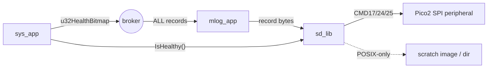

# Juno FSW — sd_lib L2 Design

**Document type:** IEEE 1016 Software Design Description (Level 2 — module).
**Module:** `sd_lib` — SD-card block storage and byte-stream write surface.
**Authoritative references:** `docs/design/conventions.md` (names, idioms, structure); `docs/design/system/system_design.md` (composition root, message catalog, lifecycle).
**Requirements covered:** `SW-REQ-SD-001` through `SW-REQ-SD-012` (all 12).

---

<!-- @{"design": ["SW-REQ-SD-001", "SW-REQ-SD-005", "SW-REQ-SD-006", "SW-REQ-SD-007", "SW-REQ-SD-011"]} -->
## 1. Purpose and Scope

`sd_lib` is the persistent-storage Controller for FT1. It owns the SD-card driver path and exposes a byte-stream write surface to its sole caller, `mlog_app`, which feeds it `JUNO_MSG_MLOG_RECORD_T` payloads (`system_design.md` §4). This design addresses every requirement in `docs/requirements/sd/requirements.json` (`SW-REQ-SD-001` through `SW-REQ-SD-012`) and locks the public API, the platform split (POSIX scratch image vs Pico2 SPI), the run-directory layout, the health-status surface, and the timing/error envelope.

In scope: `Mount`, `WriteBlock`/byte-stream append, `Sync`, `IsHealthy`, run-directory creation, raw-block append for Pico2, file-backed image for POSIX.

Out of scope: log record format (owned by `mlog_lib`); SD-card removal during flight (no requirement); FAT/filesystem semantics on the flight target (FT1 uses raw block append — see §3.4); wear-leveling beyond a single-flight write budget; encryption.

---

## 2. Definitions and Abbreviations

Cross-module vocabulary (status semantics, `JUNO_TIME_US_T`, message naming, POSIX/Pico2 split, frames, units) is defined in `docs/design/conventions.md` §4 and `system_design.md` §2 and is **not** redefined here.

| Term | Meaning |
|------|---------|
| Block | 512-byte SD-card sector; smallest atomic unit on the SPI command interface |
| Run | One power-on session; one run directory per power-on (`SW-REQ-SD-003`) |
| Append-only | All writes monotonically advance an internal byte cursor; no in-place rewrite |
| Scratch image | POSIX file (or directory) acting as the SD card surrogate for tests/sim |
| CMD17/CMD24/CMD25 | SD-card SPI single-block-read/single-block-write/multi-block-write commands |
| Health bit | The `SD` bit of `JUNO_MSG_SYS_HEALTH_T.u32HealthBitmap` (`system_design.md` §4) |

### 2.1 Naming crosswalk vs Phase-2 brief

The Phase-2 brief mandates four lifecycle operations using generic names (Init, Write, Flush, Close); `sd_lib` retains SD-domain-idiomatic names that read more naturally for storage code. The two vocabularies are equivalent and interchangeable in review:

| Phase-2 brief name | `sd_lib` API name | Section |
|--------------------|-------------------|---------|
| Init               | `Mount`           | §4.2.1  |
| Write              | `WriteBlock`      | §4.2.2  |
| Flush              | `Sync`            | §4.2.3  |
| Close              | `Deinit`          | §4.2.6  |

Decision: keep the SD-idiomatic names (`Mount`/`WriteBlock`/`Sync`/`Deinit`) — they are unambiguous to readers familiar with SD/SPI block storage, and the crosswalk above makes the AC-8 mapping auditable without renaming.

---

<!-- @{"design": ["SW-REQ-SD-005", "SW-REQ-SD-006", "SW-REQ-SD-011"]} -->
## 3. System Overview

### 3.1 MVC layer mapping

| Layer | Realization |
|-------|-------------|
| Controller (Lib) | `sd_lib` — this module. Owns SPI bus to the SD card on Pico2; owns the scratch image FD on POSIX. Two implementations behind one root. |
| View (App) | None directly. `mlog_app` is the only consumer (`system_design.md` §3.2, §6). `sd_lib` does **not** subscribe to broker messages (`AC-10`). |
| Model (Bus) | `sd_lib` does not publish bus messages. Health is exposed synchronously via `IsHealthy()` and consumed by `sys_app` per `SW-REQ-SD-010` / `SW-REQ-SYS-031`. |

### 3.2 Module composition (in context)



`mlog_app` calls `sd_lib` synchronously inside its TDM slot (`kMlogAppPeriodMs = 5` per `conventions.md` §4.5; matches `kImuAppPeriodMs` to satisfy `SW-REQ-SYS-011` no-downsampling for full-rate IMU logging). `sys_app` reads `IsHealthy()` synchronously inside its slot (`kSysAppPeriodMs = 100`). Both calls are `noexcept` and bounded; see §8.

### 3.3 Public header path

`libs/sd_lib/include/sd_lib/sd_api.hpp` (per `system_design.md` §3.3 module catalog row `sd_lib`).

### 3.4 Filesystem-vs-raw decision (FT1)

`SW-REQ-SD-005` requires "sequential byte writes into a file within the current run directory"; `SW-REQ-SD-006` requires verbatim byte-through. Neither requirement mandates FAT. **Decision:** the Pico2 build uses **raw 512 B block append** with a tiny in-flash directory header (one block per run) that records the run's starting LBA and length; no FAT. Rationale: keeps the flight build freestanding, predictable, and free of any third-party FS code (`SW-REQ-SYS-053`, `SW-REQ-SYS-050`); preserves prior runs by never rewriting older directory headers (`SW-REQ-SD-004`); deterministic byte order on disk (`SW-REQ-SD-012`). The POSIX build uses a **file-backed image or scratch directory** so unit tests and Trick can replay the same byte sequence (`SW-REQ-SD-011`). The word "file" in `SW-REQ-SD-005` is satisfied at the API layer (caller sees a single sequential write surface per run); the on-disk realization differs by platform but the observable byte sequence is identical (`SW-REQ-SD-011`, `SW-REQ-SD-012`).

> FLAG: see §12 — confirm with PM that no FAT is needed for FT1 ground-side analysis (raw-LBA reader script is required).

---

<!-- @{"design": ["SW-REQ-SD-001", "SW-REQ-SD-002", "SW-REQ-SD-003", "SW-REQ-SD-005", "SW-REQ-SD-006", "SW-REQ-SD-007", "SW-REQ-SD-008", "SW-REQ-SD-009", "SW-REQ-SD-010"]} -->
## 4. Interface Definitions

### 4.1 Header skeleton (`libs/sd_lib/include/sd_lib/sd_api.hpp`)

```cpp
// MIT License header
#pragma once
#include "juno/module.h"
#include "juno/module.hpp"
#include "juno/status.h"
#include "juno/time/time_api.hpp"
#include <cstddef>
#include <cstdint>

namespace juno::sd
{

static constexpr size_t   kBlockSizeBytes      = 512;
static constexpr size_t   kRunHeaderBlocks     = 1;
static constexpr uint32_t kMaxConsecFailures   = 8;     // before health bit latches
static constexpr size_t   kDefaultWriteBufBlocks = 4;   // default N: 4 * 512 = 2 KiB

template <size_t N = kDefaultWriteBufBlocks>
struct SD_LIB_ROOT_T;

template <size_t N = kDefaultWriteBufBlocks>
struct SD_LIB_API_T
{
    JUNO_STATUS_T (&Mount)        (SD_LIB_ROOT_T<N> &tRoot) noexcept;
    JUNO_STATUS_T (&WriteBlock)   (SD_LIB_ROOT_T<N> &tRoot,
                                   const uint8_t *pBlock, size_t zLen) noexcept;
    JUNO_STATUS_T (&Sync)         (SD_LIB_ROOT_T<N> &tRoot) noexcept;
    JUNO_STATUS_T (&Deinit)       (SD_LIB_ROOT_T<N> &tRoot) noexcept;
    RESULT_T<bool>(&IsHealthy)    (const SD_LIB_ROOT_T<N> &tRoot) noexcept;
    RESULT_T<uint64_t>(&Capacity) (const SD_LIB_ROOT_T<N> &tRoot) noexcept;
};

template <size_t N>
struct SD_LIB_ROOT_T JUNO_MODULE_ROOT(SD_LIB_API_T<N>,
    uint64_t        _u64BytesWritten;     // monotonic byte cursor for current run
    uint32_t        _u32ConsecFailures;   // resets to 0 on next successful write
    uint32_t        _u32RunIndex;         // 0-based; chosen by Mount()
    bool            _bMounted;
    bool            _bHealthy;
);

// Default-N alias used by the composition root; bespoke N is permitted
// by instantiating SD_LIB_ROOT_T<N>/SD_LIB_IMPL_T<N> directly.
using SD_LIB_ROOT_DEFAULT_T = SD_LIB_ROOT_T<kDefaultWriteBufBlocks>;

} // namespace juno::sd
```

### 4.2 API contracts

#### 4.2.1 `SdLib_Mount`
<!-- @{"design": ["SW-REQ-SD-001", "SW-REQ-SD-002", "SW-REQ-SD-003", "SW-REQ-SD-004"]} -->

| Attribute | Value |
|-----------|-------|
| Signature | `JUNO_STATUS_T (&Mount)(SD_LIB_ROOT_T<N> &tRoot) noexcept` |
| Preconditions | `tRoot` zero-initialized in `.bss` then wired by `New()`; SPI peripheral / image FD already opened by impl `New()`. |
| Postconditions | On success: `_bMounted=true`, `_u32RunIndex` set to next free run slot, `_u64BytesWritten=0`, run-header block written. Capacity is cached. On failure: `_bMounted=false`, `_bHealthy=false`. |
| Error conditions | `JUNO_STATUS_WRITE_ERROR` (SPI/FD failure during card init / run-dir creation; init writes the run-header block); `JUNO_STATUS_NULLPTR_ERROR` (impl missing). |
| Thread safety | Not thread-safe; called once during composition root `Init()` before scheduler start. |

#### 4.2.2 `SdLib_WriteBlock`
<!-- @{"design": ["SW-REQ-SD-005", "SW-REQ-SD-006", "SW-REQ-SD-007", "SW-REQ-SD-008", "SW-REQ-SD-009", "SW-REQ-SD-012"]} -->

| Attribute | Value |
|-----------|-------|
| Signature | `JUNO_STATUS_T (&WriteBlock)(SD_LIB_ROOT_T<N> &tRoot, const uint8_t *pBlock, size_t zLen) noexcept` |
| Preconditions | `Mount()` returned `SUCCESS`; `pBlock` non-null and points to caller-owned, immutable storage for the duration of the call; `zLen <= kBlockSizeBytes * N` (the staging-buffer capacity). |
| Postconditions | On success: `zLen` bytes appended verbatim to the current run's byte stream; `_u64BytesWritten += zLen`; `_u32ConsecFailures = 0`. On failure: byte cursor unchanged for that call; `_u32ConsecFailures += 1`; sticky `_bHealthy=false` once `kMaxConsecFailures` reached. |
| Error conditions | `JUNO_STATUS_WRITE_ERROR` (CMD24/25 ack timeout, FD write error); `JUNO_STATUS_INVALID_SIZE_ERROR` (`zLen > kBlockSizeBytes * N` — caller violated the documented capacity bound); `JUNO_STATUS_NULLPTR_ERROR` (`pBlock == nullptr`); `JUNO_STATUS_INVALID_DATA_ERROR` (`_bMounted == false` — bad-state precondition per `conventions.md` §4.8). |
| Determinism | Identical input bytes from `Mount` through any cycle yield identical on-disk byte sequence (`SW-REQ-SD-012`). |
| Continuation | A failing call **does not** halt; `mlog_app` continues to call on the next tick (`SW-REQ-SD-008`). |
| Thread safety | Not thread-safe; called only from `mlog_app` inside its 5 ms TDM slot. |

`WriteBlock` accepts arbitrary `zLen` from `mlog_app` up to `kBlockSizeBytes * N`; internal logic batches partial block-tails into the `N`-block staging buffer and flushes on full-block boundaries. `Sync()` flushes the tail and is called by `mlog_app` at end-of-tick or before phase boundary persists.

**Caller contract (mlog_app).** `mlog_app` records are bounded by the per-record worst case of the `mlog_lib` design (≤ 131 B per NMEA record per `mlog_lib` design §4.2 worst case), well below `kBlockSizeBytes * N = 2048 B` at the default `N = 4`. **Callers that wish to push `zLen > kBlockSizeBytes * N` must self-chunk** — `WriteBlock` does not loop over the staging buffer internally; oversized calls return `JUNO_STATUS_INVALID_SIZE_ERROR`. This contract is documented as a Doxygen `@warning` on every API entry (see §4.3).

#### 4.2.3 `SdLib_Sync`
<!-- @{"design": ["SW-REQ-SD-005", "SW-REQ-SD-006", "SW-REQ-SD-007"]} -->

| Attribute | Value |
|-----------|-------|
| Signature | `JUNO_STATUS_T (&Sync)(SD_LIB_ROOT_T<N> &tRoot) noexcept` |
| Preconditions | `_bMounted == true`. |
| Postconditions | All buffered tail bytes flushed to the SD card (Pico2: emit zero-padded final block + commit run-header length field; POSIX: `fdatasync` / `fflush`). |
| Error conditions | `JUNO_STATUS_WRITE_ERROR` (Sync issues the final block write / fdatasync). |
| Thread safety | Not thread-safe; `mlog_app` only. |

#### 4.2.4 `SdLib_IsHealthy`
<!-- @{"design": ["SW-REQ-SD-009", "SW-REQ-SD-010"]} -->

| Attribute | Value |
|-----------|-------|
| Signature | `RESULT_T<bool> (&IsHealthy)(const SD_LIB_ROOT_T<N> &tRoot) noexcept` |
| Preconditions | None (callable before `Mount` returns). |
| Postconditions | `tOk == _bHealthy`; clear (true) iff `_u32ConsecFailures < kMaxConsecFailures` **and** `_bMounted == true`. **Pre-Mount call returns `RESULT_T<bool>{JUNO_STATUS_SUCCESS, false}`** because `_bMounted` and `_bHealthy` are zero-initialized in `.bss` (per §10) — the call is well-defined and reports unhealthy without invoking IO. |
| Error conditions | `JUNO_STATUS_SUCCESS` always (the value carries the verdict; no IO). |
| Thread safety | Read-only; safe within `sys_app`'s slot. |

#### 4.2.5 `SdLib_Capacity`
<!-- @{"design": ["SW-REQ-SD-002"]} -->

| Attribute | Value |
|-----------|-------|
| Signature | `RESULT_T<uint64_t> (&Capacity)(const SD_LIB_ROOT_T<N> &tRoot) noexcept` |
| Preconditions | `Mount()` returned `SUCCESS`. |
| Postconditions | `tOk` = card capacity in bytes (Pico2: from CSD register; POSIX: from image file size). |
| Error conditions | `JUNO_STATUS_DNE_ERROR` if not mounted. |
| Thread safety | Read-only. |

#### 4.2.6 `SdLib_Deinit`
<!-- @{"design": ["SW-REQ-SD-005", "SW-REQ-SD-006", "SW-REQ-SD-007", "SW-REQ-SD-008"]} -->

Crosswalk: this is the brief's **Close** operation (see §2.1).

| Attribute | Value |
|-----------|-------|
| Signature | `JUNO_STATUS_T (&Deinit)(SD_LIB_ROOT_T<N> &tRoot) noexcept` |
| Preconditions | `tRoot` is reachable; safe to call whether or not `Mount()` previously succeeded. |
| Postconditions | All buffered tail bytes are flushed (equivalent to an internal `Sync()`); the run-header length field is committed; the lib is marked unmounted (`_bMounted=false`); subsequent `WriteBlock`/`Sync`/`Capacity` calls return `JUNO_STATUS_DNE_ERROR`; `IsHealthy()` returns `{SUCCESS, false}`. The underlying SPI handle (Pico2) or FD (POSIX) is owned by the impl and remains valid for re-`Mount()` if the host re-initializes — `Deinit` does not release platform handles. |
| Error conditions | `JUNO_STATUS_WRITE_ERROR` if the final flush fails; the lib still transitions to unmounted on return so a second call is idempotent. Calling `Deinit` on an already-unmounted root returns `JUNO_STATUS_SUCCESS` without IO. |
| Thread safety | Not thread-safe; called once during shutdown / phase tear-down by the composition root or by `mlog_app` at end-of-flight. |
| Continuation | A failing flush does **not** halt the FSW (`SW-REQ-SD-008`); the failure is reported to `pfcnFailureHandler` and the unmounted state is asserted regardless. |

`Deinit` exists to give the brief its mandatory four-operation lifecycle (Init/Write/Flush/Close → Mount/WriteBlock/Sync/Deinit, see §2.1) and to provide a clean shutdown path for the POSIX scratch image so unit tests can `Deinit`/re-`Mount` within a single process.

### 4.3 Doxygen header form (excerpt, applied to every API entry)

```cpp
/**
 * @brief Append caller-supplied bytes verbatim to the current run.
 * @tparam N      Staging-buffer size in 512 B blocks (compile-time).
 * @param tRoot   Module root, previously mounted via Mount().
 * @param pBlock  Caller-owned byte buffer (read-only during call).
 * @param zLen    Length in bytes; must satisfy zLen <= kBlockSizeBytes * N.
 * @warning Callers requiring more than `kBlockSizeBytes * N` bytes per call
 *          must self-chunk; this entry does not loop over the staging buffer
 *          and will return JUNO_STATUS_INVALID_DATA_ERROR for oversized zLen.
 *          The mlog_app contract (mlog_lib design §4.2 worst case ~131 B
 *          per NMEA record) is well below the default 2 KiB capacity at
 *          N = kDefaultWriteBufBlocks.
 * @return JUNO_STATUS_SUCCESS, JUNO_STATUS_WRITE_ERROR on transient SPI/FS write error,
 *         JUNO_STATUS_INVALID_SIZE_ERROR on oversized zLen,
 *         JUNO_STATUS_NULLPTR_ERROR on null pBlock,
 *         JUNO_STATUS_INVALID_DATA_ERROR if not mounted.
 */
template <size_t N>
JUNO_STATUS_T SdLib_WriteBlock(SD_LIB_ROOT_T<N> &tRoot,
                               const uint8_t *pBlock, size_t zLen) noexcept;
```

---

<!-- @{"design": ["SW-REQ-SD-001", "SW-REQ-SD-005", "SW-REQ-SD-008", "SW-REQ-SD-009", "SW-REQ-SD-010"]} -->
## 5. State Machine

`sd_lib` has one internal state machine governing card lifecycle and write health. Required by AC-9.

```mermaid
stateDiagram-v2
    [*] --> Uninitialized: power-on / .bss zero-init
    Uninitialized --> Mounted: Mount() success (SW-REQ-SD-001/-002/-003)
    Uninitialized --> Faulted: Mount() IO error
    Mounted --> Writing: first WriteBlock() invocation
    Writing --> Writing: WriteBlock() success (SW-REQ-SD-005/-006/-007)
    Writing --> Writing: WriteBlock() transient fail, _u32ConsecFailures++ (SW-REQ-SD-008)
    Writing --> Faulted: _u32ConsecFailures >= kMaxConsecFailures (SW-REQ-SD-009/-010)
    Faulted --> Writing: WriteBlock() returns SUCCESS (SW-REQ-SD-008)
    Mounted --> Uninitialized: Deinit() success
    Writing --> Uninitialized: Deinit() success
    Faulted --> Uninitialized: Deinit() (success or IO error; state forced)
```



State invariants:

- `Uninitialized`: `_bMounted=false`, `_bHealthy=false`. `IsHealthy()` returns `{SUCCESS, false}`.
- `Mounted`: `_bMounted=true`, `_bHealthy=true`, `_u64BytesWritten=0` immediately after `Mount()` (`SW-REQ-SD-003`).
- `Writing`: `_bMounted=true`. `_bHealthy` toggles by the `_u32ConsecFailures` window (`SW-REQ-SD-009`/`-010`).
- `Faulted`: `_bMounted=true`, `_bHealthy=false`. `WriteBlock()` continues to be called (`SW-REQ-SD-008`); a single success transitions back to `Writing` and clears the consecutive-failure counter.

`Deinit()` is callable from any non-`Uninitialized` state (see §4.2.6); it flushes the tail buffer, commits the run-header length field, sets `_bMounted=false`, and unconditionally drives the machine to `Uninitialized`. There is no terminal state during a flight; the FSW runs until external power is removed (`SW-REQ-SYS-047`), and `Deinit()` is reserved for shutdown / unit-test re-mount sequences.

---

<!-- @{"design": ["SW-REQ-SD-005", "SW-REQ-SD-006", "SW-REQ-SD-009", "SW-REQ-SD-010"]} -->
## 6. Data Flow

`sd_lib` does **not** subscribe to broker messages directly (AC-10). Its inputs are synchronous calls from `mlog_app` and `sys_app`; its outputs are SPI commands (Pico2) or POSIX file writes.

```
mlog_app  --(call)--> sd_lib::WriteBlock(pBlock, zLen)
mlog_app  --(call)--> sd_lib::Sync()
sys_app   --(call)--> sd_lib::IsHealthy()         --> bool
                                                       |
                                                       v
                                          sys_app aggregates u32HealthBitmap
                                          and publishes JUNO_MSG_SYS_HEALTH_T
                                          on broker (SW-REQ-SYS-031)
```

Inputs to `sd_lib` are `JUNO_MSG_MLOG_RECORD_T` payload bytes — but only as **opaque bytes** delivered through `WriteBlock`'s `pBlock`/`zLen` argument; `sd_lib` does not inspect, parse, or reformat them (`SW-REQ-SD-006`). The buffer ownership rule is: `mlog_app` owns the source buffer; `sd_lib` reads it before returning; no deferred reference is retained.

`sd_lib` produces no broker messages. The SD-card health bit reaches the bus solely via `sys_app` polling `IsHealthy()` and folding the result into `JUNO_MSG_SYS_HEALTH_T.u32HealthBitmap` (`system_design.md` §4, `SW-REQ-SYS-031`).

---

<!-- @{"design": ["SW-REQ-SD-005", "SW-REQ-SD-006", "SW-REQ-SD-007", "SW-REQ-SD-008", "SW-REQ-SD-009", "SW-REQ-SD-010"]} -->
## 7. Sequence Diagrams

### 7.1 Nominal write cycle (mlog_app → sd_lib → SPI)

```mermaid
sequenceDiagram
    participant sch as sch_lib
    participant mlog_app
    participant sd_lib
    participant spi as SPI peripheral
    participant card as SD card

    sch->>mlog_app: Execute() at t=k*5ms
    mlog_app->>sd_lib: WriteBlock(pBytes, zLen)
    Note over sd_lib: append to 4-block staging buffer; flush full blocks
    sd_lib->>spi: CMD25 (multi-block write start, LBA = run_base + cursor/512)
    spi->>card: bytes
    card-->>spi: data-accepted token
    spi-->>sd_lib: ack
    sd_lib-->>mlog_app: JUNO_STATUS_SUCCESS
    mlog_app->>sd_lib: Sync()           [end of tick]
    sd_lib->>spi: stop-tran token + idle wait
    spi-->>sd_lib: ready
    sd_lib-->>mlog_app: JUNO_STATUS_SUCCESS
```

### 7.2 Write-failure path (transient SPI error → continuation → health latch)

```mermaid
sequenceDiagram
    participant mlog_app
    participant sd_lib
    participant spi as SPI peripheral
    participant sys_app
    participant broker

    mlog_app->>sd_lib: WriteBlock(pBytes, zLen)
    sd_lib->>spi: CMD24 (single-block write)
    spi-->>sd_lib: timeout / write-error token
    Note over sd_lib: _u32ConsecFailures++; if >= kMaxConsecFailures, _bHealthy=false
    sd_lib-->>mlog_app: JUNO_STATUS_WRITE_ERROR (SW-REQ-SD-009)
    Note over mlog_app: SW-REQ-SD-008: continue calling next tick
    sys_app->>sd_lib: IsHealthy()
    sd_lib-->>sys_app: RESULT_T<bool>{SUCCESS, false}
    sys_app->>broker: Publish(SYS_HEALTH_T{u32HealthBitmap |= SD_BIT})
    Note over sd_lib: next successful WriteBlock clears _u32ConsecFailures<br/>and re-asserts _bHealthy=true (SW-REQ-SD-008/-010)
```

---

<!-- @{"design": ["SW-REQ-SD-007", "SW-REQ-SD-012"]} -->
## 8. Timing and Scheduling Analysis

`sd_lib` is **passive**: it has no TDM slot of its own. It is invoked from inside `mlog_app`'s 5 ms slot (`kMlogAppPeriodMs = 5`, `conventions.md` §4.5; `SW-REQ-SYS-011` no-downsampling cascade per S1-AI-005) and `sys_app`'s 100 ms slot (`kSysAppPeriodMs = 100`).

### 8.1 Per-call execution bound (Pico2)

| Call | Worst-case bound | Justification |
|------|------------------|---------------|
| `WriteBlock` (cached, no flush) | < 50 µs | Memcpy into 4-block staging buffer. |
| `WriteBlock` (one-block flush via CMD25) | < 1.5 ms | At 12.5 MHz SPI clock, a 512 B block transfers in ~330 µs; SD card busy window per spec is bounded; we cap waits at 1.0 ms before declaring `JUNO_STATUS_WRITE_ERROR`. |
| `Sync` | < 1.5 ms | Stop-tran + ready wait, same cap. |
| `IsHealthy`, `Capacity` | < 5 µs | Field reads. |

`mlog_app`'s 5 ms slot must complete `WriteBlock` calls for the bus drain (worst case: 1 IMU sample per 5 ms tick + occasional nav (every other tick) / AFM / GPS / baro / health records). The staging buffer (`kWriteBufBlocks = 4` × 512 B = 2 KiB) absorbs short bursts so most `WriteBlock` calls return within 50 µs; flushes are amortized. The bound established here is consistent with the per-tick budget asserted in `system_design.md` §8.2 (no single 5 ms tick exceeds budget; `mlog_app` runs at 5 ms — same cadence as `imu_app` per `SW-REQ-SYS-011` — has its own slot, and its worst-case cost is dominated by ≤ 1 SD flush per tick: ≤ 1.5 ms). **No call blocks beyond 1.5 ms.** **Halved-budget note (S1-AI-005):** the slot ceiling shrunk from 10 ms to 5 ms; per-tick record count also halved (1 IMU per tick instead of 2), so the nominal `WriteBlock` count per tick is roughly halved as well, leaving headroom for occasional NAV/BARO arrivals.

### 8.2 POSIX bound

POSIX `write` to a scratch image is bounded by the host filesystem; tests run with `O_DIRECT` disabled and target an image on tmpfs to keep latency below 100 µs and preserve determinism.

### 8.3 Wear and write budget (informational)

FT1 is a single-flight, single-power-on use of the SD card. At full-rate logging (system_design.md §6 fan-in: ~70 KB/s burst, 30 KB/s nominal across all records; ~300 s flight envelope), total write volume is < 30 MB/run — orders of magnitude below the wear floor of any modern industrial SD card. **Wear is not a flight concern for FT1.** Multi-flight reuse is acceptable until the card declares write failures, at which point the SD bit latches via §5 and the operator sees a red LED and a downlinked health bitmap.

### 8.4 Determinism

`SW-REQ-SD-012` requires identical bytes on disk for identical input streams. This is preserved by: (a) verbatim byte-through (`SW-REQ-SD-006`), (b) deterministic LBA assignment (run_base + cursor/512), (c) zero-padding on `Sync()` of the final partial block (always with `0x00`), and (d) no clock-derived bytes in the on-disk stream (timestamps come from the `mlog_lib` records, not from `sd_lib`).

---

<!-- @{"design": ["SW-REQ-SD-008", "SW-REQ-SD-009", "SW-REQ-SD-010"]} -->
## 9. Error Handling Strategy

System-wide policy from `system_design.md` §9 applies; `sd_lib` specializations:

1. **Status propagation.** Every API entry returns `JUNO_STATUS_T` or `RESULT_T<T>`; callers use `JUNO_ASSERT_SUCCESS` / `JUNO_ASSERT_OK`. No bare `if`-return inside `sd_lib`; internal helper failures propagate via `JUNO_ASSERT_*` macros.
2. **Failure handler.** `sd_lib::SD_LIB_IMPL_T::New()` accepts a `JUNO_FAILURE_HANDLER_T pfcnFailureHandler` and a `JUNO_USER_DATA_T *pvUserData`; on any internal IO error the handler is invoked with a context string (e.g., `"sd_lib::WriteBlock CMD24 timeout"`). **The handler is diagnostic-only and never alters control flow** (`conventions.md` §4.3, `SW-REQ-SYS-037`).
3. **Continuation policy.** A failed `WriteBlock` returns `JUNO_STATUS_WRITE_ERROR` (`SW-REQ-SD-009`); `mlog_app` continues to call on subsequent ticks (`SW-REQ-SD-008`/`SW-REQ-SYS-035`). No retry-loop inside `sd_lib` — the next-tick retry surface is the `mlog_app` cycle itself, which preserves the TDM bound.
4. **Health latch.** `_u32ConsecFailures` increments on each failure and resets to 0 on success. Once it reaches `kMaxConsecFailures = 8`, `_bHealthy=false` is sticky until a subsequent `WriteBlock` returns `SUCCESS`. `IsHealthy()` reflects this (`SW-REQ-SD-010`); `sys_app` aggregates into `u32HealthBitmap` (`SW-REQ-SYS-060`/`-031`).
5. **No exceptions.** All entries `noexcept` (`conventions.md` §1.3, `SW-REQ-SYS-053`).
6. **No allocation on the error path** — error handling reads/writes only the trivially-typed members of `SD_LIB_ROOT_T`.
7. **POST coupling.** `sys_app` calls `Mount()` during POST (`SW-REQ-SYS-029`); a `Mount()` failure marks the SD bit unhealthy in the POST bitmap (`SW-REQ-SD-001`/`SW-REQ-SYS-030`/`-058`). The FSW continues; logging is suppressed (`mlog_app` observes `IsHealthy() == false` and gates its writes — design owned by `mlog_app`).

---

<!-- @{"design": ["SW-REQ-SD-005", "SW-REQ-SD-006", "SW-REQ-SD-011"]} -->
## 10. Memory Ownership

Per `conventions.md` §5 and `constraints.md`. `sd_lib` allocates **nothing**; every buffer is caller-owned.

| Buffer / facility | Owner | Lifetime | Allocation |
|-------------------|-------|----------|------------|
| `SD_LIB_ROOT_T<N>` instance | composition root (`apps/main.cpp`) | program lifetime, `.bss` zero-init | Static |
| `SD_LIB_IMPL_T<N>` instance (Pico2 or POSIX) | composition root | program lifetime | Static |
| Caller's record buffer (`pBlock` arg) | `mlog_app` | duration of `WriteBlock` call | Caller-owned |
| Internal staging buffer (`N * kBlockSizeBytes`) | `SD_LIB_IMPL_T<N>` | program lifetime | Static `uint8_t _au8Stage[N * kBlockSizeBytes]` member |
| Run-header block (Pico2 raw) | `SD_LIB_IMPL_T<N>` | program lifetime | Static `uint8_t _au8RunHdr[kBlockSizeBytes]` member |
| Pico2 SPI handle | `SD_LIB_IMPL_T` | program lifetime | Static; opaque from RP2350 SDK init |
| POSIX FD or `DIR*` | `SD_LIB_IMPL_T` | program lifetime | Owned int / handle initialized by `New()` |
| Vtable (`tApi`) | `New()`, file-scope `static` local | program lifetime | Read-only after construction |

Asserted invariants:

- **No `new` / `delete` / `malloc` / `calloc` / `realloc` / `free` / heap-backed STL** anywhere in `sd_lib` (`SW-REQ-SYS-050`; `constraints.md`).
- **No `virtual`, no `dynamic_cast`, no `typeid`, no `throw` / `try` / `catch`** (`conventions.md` §1.3).
- **No constructors or destructors** on `SD_LIB_ROOT_T` or `SD_LIB_IMPL_T`; `.bss` zero-init is sufficient (`SW-REQ-SYS-050`).
- **No global mutable state** — all members live inside `SD_LIB_ROOT_T` or `SD_LIB_IMPL_T`; the only file-scope datum is the read-only `static SD_LIB_API_T tApi` inside `SD_LIB_IMPL_T::New()`.
- The internal staging buffer is the largest static allocation (`N * 512 B`; default `N = 4` → 2 KiB); flight-build BSS impact is bounded by the impl struct size and is statically asserted at compile time via `static_assert(sizeof(SD_LIB_IMPL_T<kDefaultWriteBufBlocks>) <= 8192, ...)` in the impl source. Bespoke `N` instantiations are responsible for their own size assertion.

### 10.1 POSIX vs Pico2 split (per `conventions.md` §6)

| Build target | Source | Implementation note |
|--------------|--------|---------------------|
| `PLATFORM=POSIX` | `libs/sd_lib/src/posix/sd_posix.cpp` | Backing store is a file (`scratch.img`) or a directory of per-run subdirectories; `WriteBlock` is `pwrite()` at LBA-aligned offsets; `Sync` is `fdatasync`. Capacity is derived from `fstat`. |
| `PLATFORM=PICO2` | `libs/sd_lib/src/pico2/sd_pico2.cpp` | Backing store is the SD card via SPI (`spi0` or `spi1` per board). `Mount` runs CMD0/CMD8/ACMD41/CMD58/CMD16 init; reads CSD for capacity (`SW-REQ-SD-002`); `WriteBlock` uses CMD24 for single blocks and CMD25 for multi-block streaming; raw-block append per §3.4. **No FAT.** |

Both impls present the same `SD_LIB_API_T` vtable; the same byte sequence is observable from each backing store given the same input call sequence (`SW-REQ-SD-011`, `SW-REQ-SD-012`).

### 10.2 IMPL `New()` factory shape

```cpp
namespace juno::sd
{

template <size_t N = kDefaultWriteBufBlocks>
struct SD_LIB_IMPL_T JUNO_MODULE_DERIVE(SD_LIB_ROOT_T<N>,
    uint8_t  _au8Stage[N * kBlockSizeBytes];
    uint8_t  _au8RunHdr[kBlockSizeBytes];
    /* platform-specific members go here in the .cpp:
       Pico2: spi_inst_t *_ptSpi; uint _u8CsPin; uint64_t _u64CapacityBytes;
       POSIX: int _iFd; uint64_t _u64CapacityBytes;                     */

    static JUNO_STATUS_T   Mount     (SD_LIB_ROOT_T<N> &tRoot) noexcept;
    static JUNO_STATUS_T   WriteBlock(SD_LIB_ROOT_T<N> &tRoot,
                                      const uint8_t *pBlock, size_t zLen) noexcept;
    static JUNO_STATUS_T   Sync      (SD_LIB_ROOT_T<N> &tRoot) noexcept;
    static JUNO_STATUS_T   Deinit    (SD_LIB_ROOT_T<N> &tRoot) noexcept;
    static RESULT_T<bool>  IsHealthy (const SD_LIB_ROOT_T<N> &tRoot) noexcept;
    static RESULT_T<uint64_t> Capacity(const SD_LIB_ROOT_T<N> &tRoot) noexcept;

    static RESULT_T<SD_LIB_IMPL_T<N>> New(
        JUNO_FAILURE_HANDLER_T pfcnFailureHandler,
        JUNO_USER_DATA_T      *pvUserData
    ) noexcept;
);

} // namespace juno::sd
```

`New()` wires the vtable once via a `static SD_LIB_API_T<N> tApi{ ... };` local and returns the impl by value (per `conventions.md` §1.2). No constructors, no destructors. Each distinct `N` produces a distinct vtable instance; the composition root pins one `N` for the flight build (default 4).

---

## 11. Traceability

Per-section `<!-- @{"design": [...]} -->` tags above are authoritative; this table is descriptive consolidation. Every `SW-REQ-SD-NNN` is mapped to ≥ 1 section.

| Req ID | Title | Section(s) |
|--------|-------|-----------|
| SW-REQ-SD-001 | SD Card Initialization at Startup | §1, §4.2.1, §5, §9 |
| SW-REQ-SD-002 | SD Card Capacity Reporting | §4.2.1, §4.2.5, §10.1 |
| SW-REQ-SD-003 | Run Directory Creation Per Power-On | §4.2.1, §5 |
| SW-REQ-SD-004 | Prior Run Preservation | §3.4, §4.2.1 |
| SW-REQ-SD-005 | Sequential Byte Write Surface | §1, §3.4, §4.2.2, §4.2.3, §4.2.6, §6, §10 |
| SW-REQ-SD-006 | Format-Agnostic Byte-Through Writes | §1, §3.4, §4.2.2, §4.2.3, §4.2.6, §6, §10 |
| SW-REQ-SD-007 | Sustain Full-Rate Logging Throughput | §1, §4.2.2, §4.2.3, §4.2.6, §8.1 |
| SW-REQ-SD-008 | Continue Writes After Transient Failure | §4.2.2, §4.2.6, §5, §7.2, §9 |
| SW-REQ-SD-009 | Write Failure Status Reporting | §4.2.2, §4.2.4, §5, §7.2, §9 |
| SW-REQ-SD-010 | Continuous Health Status | §4.2.4, §5, §6, §7.2, §9 |
| SW-REQ-SD-011 | POSIX Build Functional Equivalence | §1, §3.4, §10.1 |
| SW-REQ-SD-012 | Deterministic Write Behavior | §3.4, §4.2.2, §8.4 |

POSIX/Pico2 functional-equivalence statement (`SW-REQ-SYS-043` × `SW-REQ-SD-011`): the `SD_LIB_API_T` vtable is identical across both targets; only `libs/sd_lib/src/<platform>/*.cpp` differs. Both impls produce the same observable byte sequence given identical input call sequences (`SW-REQ-SD-012`). Trick SITL exercises the POSIX impl via the same `SD_LIB_ROOT_T &` reference the flight build uses (`SW-REQ-SYS-045`).

---

## 12. FLAGs

**FLAG-1: No-FAT decision needs PM confirmation for ground-side analysis.**
The Pico2 build appends raw 512 B blocks rather than writing through a FAT filesystem (§3.4). Ground-side analysis after FT1 must therefore read the SD card with a raw-LBA reader script (provided in `tools/` — to be authored under a separate ticket). If the PM expects the recovered SD card to mount on a normal OS as a FAT volume, this design needs revision. Recommend keeping raw-block append (smaller code, deterministic, no third-party FS), and producing a small `tools/sd_dump.py` Python utility that reads the run-header block and extracts each run as a `.bin` file.

**FLAG-2: SPI clock and bus assignment are board-specific.**
The 12.5 MHz SPI clock and `spi0`/`spi1` selection are not pinned by any FT1 requirement. The hardware engineer must publish the board pinout before the Pico2 impl can be coded. This design assumes 12.5 MHz to compute the §8.1 timing bound; the bound rescales linearly with the eventual clock. No PM action.

**FLAG-3: `kMaxConsecFailures = 8` is a design choice, not a requirement.**
`SW-REQ-SD-010` requires "health status reflecting recent write success" but does not specify the latch threshold. 8 consecutive failures (≈40 ms at 5 ms `mlog_app` cadence per `conventions.md` §4.5) is chosen so a single SD-card stall doesn't produce a spurious unhealthy bit but a sustained outage (> ~40 ms) does. PM may revise. (Was ≈80 ms at the prior 10 ms cadence; the cascade to 5 ms halves the time-to-latch but keeps the same robustness against single-block stalls.)
