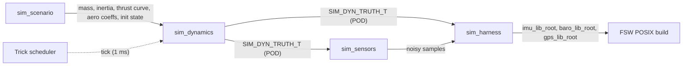
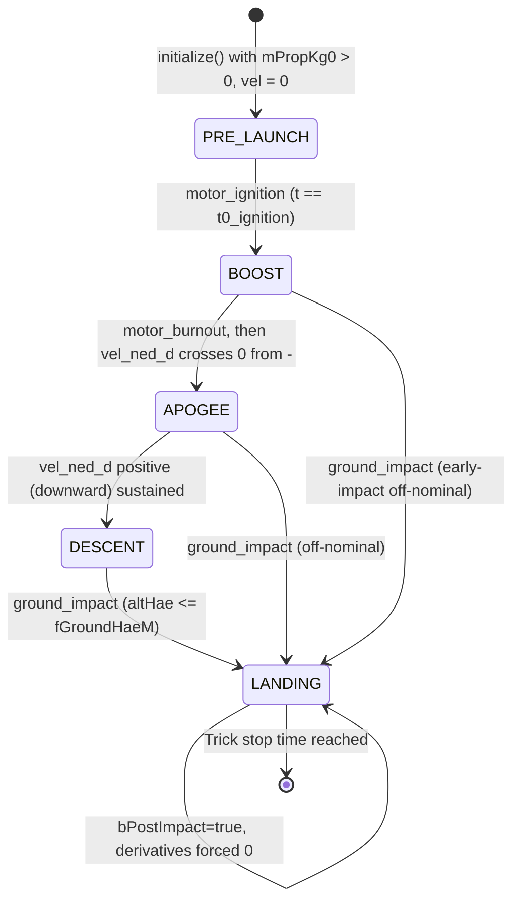

# sim_dynamics — Design (L2)

**Document type:** IEEE 1016 Software Design Description
**Module:** `sim_dynamics` (Trick 6-DOF rigid-body rocket dynamics)
**Scope:** Sim-only module that runs inside the NASA Trick simulator and produces vehicle truth state for `sim_sensors` and `sim_scenario`.
**References (do not contradict):** `docs/design/conventions.md` (cross-module vocabulary), `docs/design/system/system_design.md` §10 (Trick integration), `docs/requirements/sim_dynamics/requirements.json`.

---

<!-- @{"design": ["SW-REQ-SIM-DYN-001", "SW-REQ-SIM-DYN-002"]} -->
## 1. Purpose and Scope

This document is the L2 design for `sim_dynamics`, the 6-DOF rigid-body rocket dynamics model that runs inside NASA Trick during simulation. It addresses every requirement in `docs/requirements/sim_dynamics/requirements.json` (`SW-REQ-SIM-DYN-001` through `SW-REQ-SIM-DYN-014`). The module's role in the system is documented at L1 in `system_design.md` §10.2: `sim_dynamics` is the truth-state producer; `sim_sensors` converts truth to noisy sensor measurements; `sim_harness` wires the FSW POSIX build to the same `*_ROOT_T` APIs that the Pico2 flight build uses (`SW-REQ-SYS-045`).

In scope: 6-DOF rigid-body equations of motion (3 translational + 3 rotational DOF, `SW-REQ-SIM-DYN-001`); truth state structure with position, velocity, attitude quaternion, angular velocity (`SW-REQ-SIM-DYN-002`); applied forces — motor thrust, uniform gravity, aerodynamic drag (`SW-REQ-SIM-DYN-005`/`-006`/`-007`); configured mass and inertia inputs (`SW-REQ-SIM-DYN-008`); fixed-step deterministic integration (`SW-REQ-SIM-DYN-009`/`-010`); per-step truth publication (`SW-REQ-SIM-DYN-011`); ground-impact termination and post-impact pin-state (`SW-REQ-SIM-DYN-012`/`-013`); SI units throughout (`SW-REQ-SIM-DYN-014`); truth-event detection (motor ignition, burnout, apogee, ground impact) as integration outputs.

Out of scope: sensor noise, bias, latency, or quantization (owned by `sim_sensors`); scenario configuration, wind profiles, Mach-dependent aero, Monte-Carlo perturbations (owned by `sim_scenario`); FSW driver coupling (owned by `sim_harness`); Trick S_define authoring (owned by `sim_harness`); flight-phase logic in the FSW (owned by `afm_lib`/`afm_app` — `sim_dynamics` only emits truth events, it does not implement the FSW phase machine).

### 1.1 Module pattern (Trick-idiomatic)

`sim_dynamics` is **sim-only** and runs inside Trick's scheduler. Per the PM directive recorded in this worker brief, the LibJuno C++ rules (no constructors, no STL, freestanding) apply at the **FSW boundary** (`sim_sensors` → FSW driver inputs in `sim_harness`). Inside `sim_dynamics`, a lighter Trick-idiomatic C++ pattern is used:

- One `SIM_DYNAMICS` C++ class declared in `sim/sim_dynamics/include/sim_dynamics/sim_dynamics.hpp` and defined in `sim/sim_dynamics/src/sim_dynamics.cpp`.
- Trick lifecycle methods: `default_data()`, `initialize()`, `derivative()`, `integration()`, plus dynamic events `motor_ignition()`, `motor_burnout()`, `apogee_detected()`, `ground_impact()` (Trick `dyn_event` callbacks returning `double` — time of crossing).
- STL is permitted for non-real-time data (e.g., `std::vector<THRUST_SAMPLE_T>` for the motor thrust curve loaded once in `initialize()`).
- Constructors / destructors are permitted on the `SIM_DYNAMICS` class (Trick's S_define instantiates the class on heap via Trick's memory manager — heap is allowed inside the sim binary).
- The **truth state struct** `SIM_DYN_TRUTH_T` (§6) is a **C++-only POD aggregate** (no constructors, no STL members, no virtuals; trivially copyable, `static_assert`-checked) carried between Trick C++ translation units. It is **not** wrapped in `extern "C"` because it carries a `juno::afm::JUNO_PHASE_T` field — a C++ `enum class` in a C++ namespace per `conventions.md` §4.1. Exposing the same identifier to a C TU would not compile; the struct's audience is exclusively Trick's C++ sim-objects (`sim_sensors`, `sim_harness`) which are built as C++ and accept C++ types in their `S_define` `cpp` blocks (Trick User's Guide §3.5).

This split keeps the FSW boundary clean while letting the dynamics model use the natural Trick pattern documented in `Trick User's Guide` §3 (Sim-Object lifecycle). The dependency edge is `sim_dynamics → SIM_DYN_TRUTH_T (C++ POD) → sim_sensors → FSW *_ROOT_T APIs`. STL never crosses into the FSW link unit because `sim_harness` translates the POD to the freestanding `*_ROOT_T` driver-input shape before any FSW header is included.

---

## 2. Definitions and Abbreviations

Cross-module vocabulary (frames, units, time base) is defined in `docs/design/conventions.md` §4 and is **not** redefined here. Per `SW-REQ-SIM-DYN-003`, `-004`, `-014`: NED for velocity (`SW-REQ-SYS-040`), geodetic + HAE for position (`SW-REQ-SYS-038`/`-039`), body→NED unit quaternion for attitude (`SW-REQ-SYS-041`), body axes X-fwd/Y-right/Z-down (`SW-REQ-SYS-057`), SI units throughout (`SW-REQ-SYS-042`).

| Term | Meaning |
|------|---------|
| 6-DOF | Six degrees of freedom: translation (x,y,z) + rotation (roll,pitch,yaw) |
| EOM | Equations of motion |
| Truth state | The simulator's ground-truth vehicle state (no sensor noise applied) |
| Trick | NASA Johnson Space Center simulation framework (`SW-REQ-SYS-045`) |
| Sim-object | Trick's container of state + behavior; this module is one sim-object |
| `dyn_event` | Trick's mechanism for state-crossing detection (returns time-of-zero) |
| HAE | Height Above Ellipsoid (WGS-84) — same as FSW convention §4.6 |
| `q_b2n` | Unit quaternion rotating body frame → NED frame (`SW-REQ-SYS-041`) |
| ECEF | Earth-Centered Earth-Fixed (intermediate integration frame; not exposed) |
| RK4 | Classical 4th-order Runge–Kutta integrator (Trick `Integrator_type::Runge_Kutta_4`) |
| `THRUST_SAMPLE_T` | Thrust-curve sample point: `struct THRUST_SAMPLE_T { double dTimeS; double dForceN; };` (sim-side, STL-allowed) |
| `juno::afm::JUNO_PHASE_T` | Canonical FSW flight-phase enum from `conventions.md` §4.1: `{JUNO_PHASE_PRE_LAUNCH, JUNO_PHASE_BOOST, JUNO_PHASE_APOGEE, JUNO_PHASE_DESCENT, JUNO_PHASE_LANDING}` |

ECEF is used internally as the integration frame because its origin is inertial-stable and gravity is well-behaved; it is **not** exposed on any output struct or interface (`conventions.md` §4.6 prohibits ECEF in cross-module surfaces). The geodetic position fields in `SIM_DYN_TRUTH_T` are the externally-visible representation.

---

<!-- @{"design": ["SW-REQ-SIM-DYN-001", "SW-REQ-SIM-DYN-002", "SW-REQ-SIM-DYN-008"]} -->
## 3. System Overview

### 3.1 Layer placement

`sim_dynamics` is **not** an MVC layer of the FSW (apps/libs/bus). It is a Trick sim-object that lives **outside** the FSW under `sim/sim_dynamics/`. In `system_design.md` §3.3 it is listed as `sim_dynamics` (sim type, header `sim/sim_dynamics/include/sim_dynamics/sim_dynamics.hpp`).



### 3.2 Internal subsystems

| Subsystem | Responsibility | Requirements |
|-----------|---------------|--------------|
| State integrator | Holds 13-element state vector (pos[3], vel[3], quat[4], omega_b[3]); steps via RK4 | `SW-REQ-SIM-DYN-001`, `-009`, `-010` |
| Force model | Sums thrust + gravity + drag at current state, returns body-frame force + moment | `SW-REQ-SIM-DYN-005`, `-006`, `-007` |
| Mass properties | Holds vehicle mass `mDryKg`, propellant mass schedule `mPropKg(t)`, inertia tensor `tInertiaKgM2[3][3]` | `SW-REQ-SIM-DYN-008` |
| Truth publisher | Converts internal state → `SIM_DYN_TRUTH_T` (geodetic + NED + body→NED quat) once per integration step | `SW-REQ-SIM-DYN-002`, `-003`, `-004`, `-011`, `-014` |
| Event detector | Trick `dyn_event` callbacks for motor ignition (t=t0), burnout (mProp=0), apogee (vel_d crosses zero from negative), ground impact (alt_hae ≤ ground_hae) | `SW-REQ-SIM-DYN-005`, `-012`, `-013` |

---

<!-- @{"design": ["SW-REQ-SIM-DYN-001", "SW-REQ-SIM-DYN-005", "SW-REQ-SIM-DYN-006", "SW-REQ-SIM-DYN-007", "SW-REQ-SIM-DYN-008", "SW-REQ-SIM-DYN-009", "SW-REQ-SIM-DYN-011"]} -->
## 4. Interface Definitions

The Trick lifecycle methods constitute the public interface. Trick invokes them via the `S_define` job table authored by `sim_harness`.

### 4.1 SIM_DYNAMICS::default_data

| Attribute | Value |
|-----------|-------|
| Signature | `int SIM_DYNAMICS::default_data() noexcept` |
| Trick job class | `default_data` |
| Preconditions | Trick has constructed the sim-object instance |
| Postconditions | All scalar parameters set to safe defaults; thrust-curve `std::vector` empty; truth state zeroed |
| Error conditions | Always returns 0 (Trick convention: nonzero abort; unused here) |
| Thread safety | Trick is single-threaded for this sim-object |

### 4.2 SIM_DYNAMICS::initialize

| Attribute | Value |
|-----------|-------|
| Signature | `int SIM_DYNAMICS::initialize() noexcept` |
| Trick job class | `initialization` |
| Preconditions | `sim_scenario` has populated `mDryKg`, `mPropKg0`, `tInertiaKgM2`, `pcThrustCsvPath`, `fCdRef`, `fAreaRefM2`, initial `tPosLlaInit`, `tVelNedInit`, `tQuatB2nInit`, `tOmegaBodyInit`, `fGroundHaeM`, `tGravityNedMps2` (default `{0,0,9.80665}`) |
| Postconditions | Internal 13-element state vector initialized; thrust curve loaded from CSV into `std::vector<THRUST_SAMPLE_T> _vThrustCurve`; `bIntegrating=true`; `bPostImpact=false` |
| Error conditions | Returns 1 if thrust CSV missing/malformed (Trick logs and aborts sim) |
| Thread safety | Single-threaded |

### 4.3 SIM_DYNAMICS::derivative

| Attribute | Value |
|-----------|-------|
| Signature | `int SIM_DYNAMICS::derivative() noexcept` |
| Trick job class | `derivative` |
| Preconditions | `initialize()` completed; current state vector valid |
| Postconditions | `_dStateDt[13]` populated: position-dot from velocity, velocity-dot from total force / mass, quat-dot from body rates, omega-dot from inverse-inertia × (moment − ω × Iω) |
| Error conditions | Returns 0 always; if `bPostImpact==true`, all derivatives set to zero (`SW-REQ-SIM-DYN-013`) |
| Thread safety | Single-threaded |

### 4.4 SIM_DYNAMICS::integration

| Attribute | Value |
|-----------|-------|
| Signature | `int SIM_DYNAMICS::integration() noexcept` |
| Trick job class | `integration` (Trick built-in RK4 driver invokes `derivative()` 4× per step) |
| Preconditions | `derivative()` populates `_dStateDt`; integrator is `Runge_Kutta_4`; step is fixed `kIntegStepS = 1e-3` (1 ms) |
| Postconditions | State vector advanced one step; quaternion re-normalized to unit length; `tTruth` (`SIM_DYN_TRUTH_T`) refreshed for downstream consumers |
| Error conditions | Returns 0 (success) or 1 (Trick-scheduler retry — never used here) |
| Thread safety | Single-threaded |

### 4.5 SIM_DYNAMICS::ground_impact (dyn_event)

| Attribute | Value |
|-----------|-------|
| Signature | `double SIM_DYNAMICS::ground_impact() noexcept` |
| Trick job class | `dynamic_event` |
| Preconditions | Integration ongoing; `bPostImpact==false` |
| Postconditions | Returns `(altHaeM − fGroundHaeM)`; when this crosses zero negative, Trick freezes step at exact crossing, then `event_action` sets `bIntegrating=false`, `bPostImpact=true`, zeros velocity and angular rates, pins position/quat (`SW-REQ-SIM-DYN-012`/`-013`) |
| Error conditions | n/a |
| Thread safety | Single-threaded |

### 4.6 Other dyn_events

`motor_ignition` (returns `t − t0_ignition`), `motor_burnout` (returns `mPropKg`), `apogee_detected` (returns `vel_ned_d` so root-find catches sign change from negative to positive — descent begins) follow the same pattern; their `event_action` callbacks update `tTruth.ePhase` (a `juno::afm::JUNO_PHASE_T` field within `SIM_DYN_TRUTH_T`) for downstream consumers.

### 4.7 Doxygen header

```cpp
/**
 * @brief Trick sim-object: 6-DOF rigid-body rocket dynamics.
 *
 * Produces ground-truth vehicle state (position, velocity, attitude
 * quaternion, body angular velocity) at every Trick integration step.
 * Forces: motor thrust (from CSV), uniform gravity, aerodynamic drag.
 *
 * Outputs SIM_DYN_TRUTH_T (POD) consumed by sim_sensors and sim_harness.
 * Frames: NED (velocity), geodetic+HAE (position), body→NED quaternion
 * (attitude), body X-fwd/Y-right/Z-down. SI units throughout.
 *
 * @see SW-REQ-SIM-DYN-001..014
 */
class SIM_DYNAMICS { ... };
```

---

<!-- @{"design": ["SW-REQ-SIM-DYN-005", "SW-REQ-SIM-DYN-012", "SW-REQ-SIM-DYN-013"]} -->
## 5. State Machines — Truth Events

`sim_dynamics` integrates motion continuously and emits **truth events** when crossings occur. These are detected via Trick `dyn_event` callbacks (root-finding to machine precision at the actual crossing time, not just the nearest tick). The phase label written into `tTruth.ePhase` uses the canonical FSW `juno::afm::JUNO_PHASE_T` enum (`conventions.md` §4.1) so downstream regression tooling can compare the truth phase timeline against the FSW `afm_lib` phase timeline directly.



Phase semantics (canonical names per `conventions.md` §4.1):
- `JUNO_PHASE_PRE_LAUNCH` — at-power-on initial state (pre-ignition); vehicle on rail with propellant loaded.
- `JUNO_PHASE_BOOST` — motor ignition has occurred; thrust > 0 and propellant is being consumed.
- `JUNO_PHASE_APOGEE` — peak altitude reached (vertical velocity has crossed zero); replaces what older drafts called "Coast".
- `JUNO_PHASE_DESCENT` — vehicle is falling (vertical NED velocity > 0).
- `JUNO_PHASE_LANDING` — ground contact at low velocity; replaces what older drafts called "Impact".

Each transition records `tEventTimeS` and updates `tTruth.ePhase` to the corresponding `JUNO_PHASE_*` constant. The FSW phase machine in `afm_lib` is exercised independently from sensor measurements via `sim_harness`; comparing `tTruth.ePhase` with the FSW-reported phase from `afm_lib` is a `sim_scenario` regression activity that is now a direct enum-equality check (no name translation required).

Post-impact behavior (`SW-REQ-SIM-DYN-012`/`-013`):
- `derivative()` returns the all-zeros vector.
- `tTruth.tPosLla`, `tTruth.tQuatB2n` are pinned at the impact-instant values.
- `tTruth.tVelNedMps`, `tTruth.tOmegaBodyRadPerS` are pinned to zero.
- `tTruth.ePhase = JUNO_PHASE_LANDING` for the rest of the run.
- Trick continues advancing simulated time, but state is frozen.

---

<!-- @{"design": ["SW-REQ-SIM-DYN-002", "SW-REQ-SIM-DYN-003", "SW-REQ-SIM-DYN-004", "SW-REQ-SIM-DYN-011", "SW-REQ-SIM-DYN-014"]} -->
## 6. Data Flow — Truth State Struct

### 6.1 SIM_DYN_TRUTH_T (C++ POD aggregate)

The single externally-visible output. Every field uses SI units; frames per `conventions.md` §4.6.

**Language scope.** `SIM_DYN_TRUTH_T` is a **C++-only POD aggregate** declared in a C++ header. It is intentionally **not** wrapped in `extern "C"` because one of its fields is `juno::afm::JUNO_PHASE_T` — a C++ `enum class` declared inside a C++ namespace (`conventions.md` §4.1), which a C translation unit cannot name. The struct is exchanged exclusively between C++ translation units inside the Trick sim binary (`sim_dynamics` → `sim_sensors` → `sim_harness`), each of which is built as C++. Trick's `S_define` accepts C++ types directly via `cpp` job blocks (Trick User's Guide §3.5), so there is no need to expose a C-callable view. The struct remains a trivially-copyable aggregate (no constructor, no STL members, no virtual functions), which is asserted at compile time in §10.

```cpp
// sim/sim_dynamics/include/sim_dynamics/sim_dyn_truth.hpp
// C++-only POD aggregate — no constructors, no STL, no virtuals — readable
// by sim_sensors, sim_harness, and (indirectly via sim_harness's POD→FSW
// adapter) the FSW POSIX driver inputs. Exchanged exclusively between
// C++ translation units; not exposed to C.

#pragma once

#include "afm_lib/afm_api.hpp"   // canonical juno::afm::JUNO_PHASE_T
                                 // (conventions.md §4.1; see afm/design.md §3.3)

#include <cstdint>

namespace juno::sim_dynamics
{

struct SIM_DYN_TRUTH_T
{
    // Time base — sim seconds since epoch; sim_harness converts to
    // JUNO_TIME_US_T for FSW interfaces (conventions.md §4.2).
    double                    dSimTimeS;

    // Position — geodetic (SW-REQ-SYS-038) + HAE (SW-REQ-SYS-039).
    double                    dLatDeg;
    double                    dLonDeg;
    double                    dAltHaeM;

    // Velocity — NED (SW-REQ-SYS-040), m/s.
    double                    tVelNedMps[3];    // [0]=N, [1]=E, [2]=D

    // Attitude — body→NED unit quaternion (SW-REQ-SYS-041),
    // body axes X-fwd/Y-right/Z-down (SW-REQ-SYS-057).
    double                    tQuatB2n[4];      // [0]=w, [1]=x, [2]=y, [3]=z

    // Body angular velocity (rad/s) and body specific force (m/s²),
    // both in body axes. Body specific force = (Fthrust + Faero)/m,
    // gravity excluded — matches what the IMU truly senses.
    double                    tOmegaBodyRadPerS[3];
    double                    tSpecificForceBodyMps2[3];

    // Total instantaneous vehicle mass (kg) = dry mass + propellant
    // remaining. Sourced by sim_scenario's truth-CSV `mass_kg` column
    // (SW-REQ-SIM-DYN-008).
    double                    dMassKg;

    // Canonical FSW flight phase (conventions.md §4.1, sourced from
    // afm_lib's public header per afm/design.md §3.3). Updated by
    // dyn_event callbacks at motor_ignition, motor_burnout/apogee,
    // and ground_impact. Replaces the previous SIM_DYN_EVENT_T.
    juno::afm::JUNO_PHASE_T   ePhase;
    double                    dEventTimeS;

    // Validity flag — true once initialize() succeeds.
    bool                      bValid;
};

} // namespace juno::sim_dynamics
```

Field summary (SI throughout, `SW-REQ-SIM-DYN-014`):

| Field | Units | Frame / Notes | Trace |
|-------|-------|---------------|-------|
| `dSimTimeS` | s | sim seconds since epoch | `SW-REQ-SIM-DYN-011` |
| `dLatDeg` / `dLonDeg` | deg | geodetic, WGS-84 | `SW-REQ-SIM-DYN-002`, `-003` |
| `dAltHaeM` | m | HAE | `SW-REQ-SIM-DYN-002`, `-003` |
| `tVelNedMps[3]` | m/s | NED | `SW-REQ-SIM-DYN-002`, `-003` |
| `tQuatB2n[4]` | — | body→NED unit quaternion (w,x,y,z) | `SW-REQ-SIM-DYN-002`, `-004` |
| `tOmegaBodyRadPerS[3]` | rad/s | body axes X/Y/Z | `SW-REQ-SIM-DYN-002` |
| `tSpecificForceBodyMps2[3]` | m/s² | body axes; gravity-excluded | `SW-REQ-SIM-DYN-002`, `-005`, `-007` |
| `dMassKg` | kg | dry + propellant remaining | `SW-REQ-SIM-DYN-008` |
| `ePhase` | enum | canonical `juno::afm::JUNO_PHASE_T` | `SW-REQ-SIM-DYN-005`, `-012`, `-013` |
| `dEventTimeS` | s | sim time of last phase transition | `SW-REQ-SIM-DYN-005`, `-012` |
| `bValid` | bool | true after `initialize()` succeeds | `SW-REQ-SIM-DYN-009` |

Every quantity is SI (`SW-REQ-SIM-DYN-014`): m, m/s, rad/s, m/s², kg, dimensionless quaternion, degrees for lat/lon (the established geodetic convention; `conventions.md` §4.6 lists "deg" for lat/lon).

### 6.2 Update cadence

`SIM_DYNAMICS::integration()` refreshes `tTruth` at the end of every Trick integration step (`SW-REQ-SIM-DYN-011`). The fixed step is `kIntegStepS = 1e-3` s (1 ms) — finer than the IMU's 5 ms sample period (`SW-REQ-SYS-005`), which lets `sim_sensors` sub-sample without aliasing the boost-phase dynamics.

### 6.3 Direction of flow

```text
sim_scenario ──[mass, inertia, thrust curve, init state, ground HAE]──▶ sim_dynamics
sim_dynamics ──[SIM_DYN_TRUTH_T (POD, by-pointer)]──▶ sim_sensors  (1 kHz)
sim_dynamics ──[SIM_DYN_TRUTH_T (POD, by-pointer)]──▶ sim_harness  (1 kHz, for truth-log)
sim_sensors  ──[noisy IMU/baro/GPS samples]──▶ sim_harness ──[*_ROOT_T API]──▶ FSW
```

`sim_dynamics` does **not** publish on the LibJuno broker (it lives outside the FSW link unit). Truth flow is by direct pointer/reference inside the Trick sim-object graph.

---

<!-- @{"design": ["SW-REQ-SIM-DYN-009", "SW-REQ-SIM-DYN-010", "SW-REQ-SIM-DYN-011"]} -->
## 7. Sequence Diagram

```mermaid
sequenceDiagram
    participant trick_sched as Trick scheduler
    participant sim_dynamics
    participant rk4 as Trick RK4 integrator
    participant sim_sensors
    participant sim_harness
    participant fsw as FSW POSIX

    Note over trick_sched: tick t = k * 1 ms
    trick_sched->>sim_dynamics: derivative()
    sim_dynamics->>sim_dynamics: thrust(t) + gravity + drag(v_air)
    sim_dynamics-->>trick_sched: _dStateDt[13]
    trick_sched->>rk4: integrate(state, _dStateDt, 1 ms)
    rk4->>sim_dynamics: derivative() x3 (RK4 mid-points)
    sim_dynamics-->>rk4: _dStateDt
    rk4-->>trick_sched: state(t+1ms)
    trick_sched->>sim_dynamics: integration() (post-step)
    sim_dynamics->>sim_dynamics: normalize quat; refresh tTruth
    Note over sim_dynamics: SW-REQ-SIM-DYN-011: tTruth refreshed every step
    trick_sched->>sim_sensors: sample(tTruth)
    sim_sensors-->>sim_harness: noisy IMU/baro/GPS
    sim_harness->>fsw: imu_lib_root.Sample(...) etc.
    Note over trick_sched,sim_dynamics: at t == t_impact, ground_impact dyn_event<br/>fires; bPostImpact=true; tTruth.ePhase = JUNO_PHASE_LANDING;<br/>subsequent derivative() returns 0
```

The diagram is one nominal 1 ms tick; the RK4 driver (Trick built-in) calls `derivative()` four times per step at `t`, `t+Δ/2`, `t+Δ/2`, `t+Δ`, then `integration()` is the post-step hook that re-normalizes the quaternion and refreshes the published `SIM_DYN_TRUTH_T`.

---

<!-- @{"design": ["SW-REQ-SIM-DYN-009", "SW-REQ-SIM-DYN-010", "SW-REQ-SIM-DYN-011"]} -->
## 8. Timing and Scheduling Analysis

### 8.1 Step rate and rationale

| Parameter | Value | Rationale |
|-----------|-------|-----------|
| `kIntegStepS` | 1e-3 s (1 ms) | Finer than fastest FSW sample (IMU 5 ms, `SW-REQ-SYS-005`); captures boost-phase impulse without aliasing |
| Integrator | RK4 (Trick `Runge_Kutta_4`) | Fixed-step, deterministic, accurate enough for sub-G-class motor profiles |
| Trick scheduler base | `sys.exec.in.time_tic_value = 1_000_000` (µs) | 1 µs resolution; matches FSW `JUNO_TIME_US_T` granularity (`SW-REQ-SYS-026`) |

### 8.2 Determinism (`SW-REQ-SIM-DYN-010`)

Determinism follows from: fixed step (`SW-REQ-SIM-DYN-009`), fixed RK4 weights, IEEE-754 deterministic floating-point math (no compiler reorderings under `-fno-fast-math` — which Trick honors by default for sim-objects), no random-number generation inside `sim_dynamics` (noise lives in `sim_sensors`), and a fixed thrust-curve table loaded once in `initialize()`. Identical inputs produce bit-identical truth output across runs on the same host.

### 8.3 Worst-case execution

Per-step work is dominated by force computation: thrust LUT lookup (`O(log N)` over ~200 thrust samples for a G-class motor), drag (one `sqrt` for airspeed, one Cd lookup), gravity (constant), inertia tensor inverse (precomputed once in `initialize()`). Empirically <50 µs per `derivative()` call on a host CPU, ×4 RK4 calls + `integration()` ≈ <250 µs per 1 ms step → 25% of real time. Acceptable headroom for `sim_sensors` and `sim_harness` to share the same Trick frame.

---

<!-- @{"design": ["SW-REQ-SIM-DYN-009", "SW-REQ-SIM-DYN-010", "SW-REQ-SIM-DYN-012"]} -->
## 9. Error Handling Strategy

`sim_dynamics` is a sim-only module; it does **not** use `JUNO_STATUS_T` and does **not** participate in the FSW health-bitmap chain. Its error model:

1. **Initialization failures** (missing thrust CSV, malformed CSV, NaN in scenario inputs) cause `initialize()` to return 1, which Trick treats as a fatal sim-startup error. The sim aborts before any FSW driver is exercised — there is no ambiguous half-initialized state.
2. **Numerical robustness inside `derivative()`:** the quaternion is re-normalized at the end of every `integration()` step to absorb RK4 drift. Body-rate magnitudes are not clamped — extreme rates indicate a model defect, not a runtime fault, and should fail tests.
3. **Ground-impact handling** (`SW-REQ-SIM-DYN-012`/`-013`) is **not** an error path; it is a normal terminal state. The `dyn_event` mechanism freezes the state cleanly; subsequent `derivative()` returns the zero vector so the integrator advances time without changing state.
4. **No FSW failure handlers:** because `sim_dynamics` lives outside the FSW link unit, it has no `JUNO_FAILURE_HANDLER_T`. If the sim worker discovers a fault, it logs to Trick's standard message stream (`message_publish`) and (for fatal cases) calls `exec_terminate()`.
5. **No exceptions across the boundary:** even though STL and constructors are allowed inside `sim_dynamics`, the `SIM_DYN_TRUTH_T` POD struct contains no STL types, no virtuals, and no constructors (trivially copyable). It is a C++-only struct exchanged between Trick C++ TUs (`sim_dynamics`, `sim_sensors`, `sim_harness`); `sim_harness` is the single boundary that translates the POD into the FSW-shaped driver inputs before any `*_ROOT_T` API is called, so no STL allocator and no exception path reaches the FSW POSIX link unit (`SW-REQ-SYS-053`).

---

<!-- @{"design": ["SW-REQ-SIM-DYN-002", "SW-REQ-SIM-DYN-008", "SW-REQ-SIM-DYN-014"]} -->
## 10. Memory Ownership

`sim_dynamics` runs inside the Trick sim binary (host-side, hosted libstdc++); the FSW caller-owned-only rule (`conventions.md` §5) **does not** apply to this module's internals. STL containers and heap allocation are permitted inside the `SIM_DYNAMICS` class. The boundary rule is preserved on the **output** side: `SIM_DYN_TRUTH_T` is a POD aggregate with no STL members and no constructors, so consumers in `sim_sensors` / `sim_harness` (and ultimately the FSW link unit) never link against an STL allocation across the freestanding boundary.

| Buffer / facility | Owner | Lifetime | Allocation |
|-------------------|-------|----------|------------|
| `SIM_DYNAMICS` instance | Trick S_define (`sim_harness`) | sim run | Heap (Trick memory manager) — permitted inside sim-only binary |
| `_v13StateVec[13]` (`double`) | `SIM_DYNAMICS` member | sim run | Inline static array on the class |
| `_dStateDt[13]` (`double`) | `SIM_DYNAMICS` member | sim run | Inline static array |
| `_vThrustCurve` (`std::vector<THRUST_SAMPLE_T>`) | `SIM_DYNAMICS` member | sim run | Heap once at `initialize()` (STL allowed sim-side) |
| `_tInertiaInv[3][3]` | `SIM_DYNAMICS` member | sim run | Inline static array, precomputed in `initialize()` |
| `tTruth` (`SIM_DYN_TRUTH_T`) | `SIM_DYNAMICS` member | sim run | Inline POD aggregate; pointer published to consumers |
| Mass-properties inputs (`mDryKg`, `tInertiaKgM2`) | `sim_scenario` writes; `sim_dynamics` reads | sim run | Trick variables — caller-owned |

Asserted invariants for the FSW boundary: `SIM_DYN_TRUTH_T` is a trivially-copyable C++ aggregate (verified by `static_assert(std::is_trivially_copyable<juno::sim_dynamics::SIM_DYN_TRUTH_T>::value, "...");` and `static_assert(std::is_standard_layout<juno::sim_dynamics::SIM_DYN_TRUTH_T>::value, "...");` in the sim_dynamics .cpp); the struct lives in a C++ header and is consumed only by C++ TUs (no `extern "C"` wrapper — it cannot be wrapped because `juno::afm::JUNO_PHASE_T` is a C++ `enum class` in a C++ namespace, `conventions.md` §4.1). No STL types appear in the FSW link unit because `sim_harness` translates the POD into plain `*_ROOT_T` API calls before any FSW header is included. `SW-REQ-SIM-DYN-008` is satisfied by accepting mass and inertia as scenario-injected values — not hard-coded constants.

---

## 11. Traceability

Per-section `<!-- @{"design": [...]} -->` tags above are authoritative; this table is descriptive consolidation. Every `SW-REQ-SIM-DYN-NNN` is mapped to at least one section.

| Req ID | Title | Section(s) |
|--------|-------|-----------|
| SW-REQ-SIM-DYN-001 | Six-DOF Rigid-Body Truth State | §1, §3, §4 |
| SW-REQ-SIM-DYN-002 | Truth State Composition | §1, §3, §6, §10 |
| SW-REQ-SIM-DYN-003 | NED Position and Velocity Frame | §2, §6 |
| SW-REQ-SIM-DYN-004 | Body-to-NED Quaternion Attitude | §2, §6 |
| SW-REQ-SIM-DYN-005 | Motor Thrust Force | §3, §4, §5 |
| SW-REQ-SIM-DYN-006 | Gravitational Acceleration | §3, §4 |
| SW-REQ-SIM-DYN-007 | Aerodynamic Drag Force | §3, §4 |
| SW-REQ-SIM-DYN-008 | Configurable Mass and Inertia | §3, §4, §10 |
| SW-REQ-SIM-DYN-009 | Fixed-Step Time Integration | §4, §7, §8, §9 |
| SW-REQ-SIM-DYN-010 | Deterministic Truth Output | §4, §7, §8, §9 |
| SW-REQ-SIM-DYN-011 | Truth State Update Cadence | §4, §6, §7, §8 |
| SW-REQ-SIM-DYN-012 | Ground Impact Termination | §4.5, §5, §9 |
| SW-REQ-SIM-DYN-013 | Post-Impact Truth State Hold | §4, §5 |
| SW-REQ-SIM-DYN-014 | SI Units for Truth State | §2, §6, §10 |

POSIX/Pico2 functional equivalence (`SW-REQ-SYS-043`): `sim_dynamics` runs only on the POSIX/host build under Trick (`SW-REQ-SYS-045`); it is not present in the Pico2 flight binary. Equivalence at the FSW boundary is preserved because `sim_harness` exercises the same `*_ROOT_T` POSIX driver implementations the unit-test build uses (`system_design.md` §10.2). Truth state crossing the freestanding boundary is a POD aggregate (§6.1, §10) so no STL or heap reaches the flight-build link unit.
