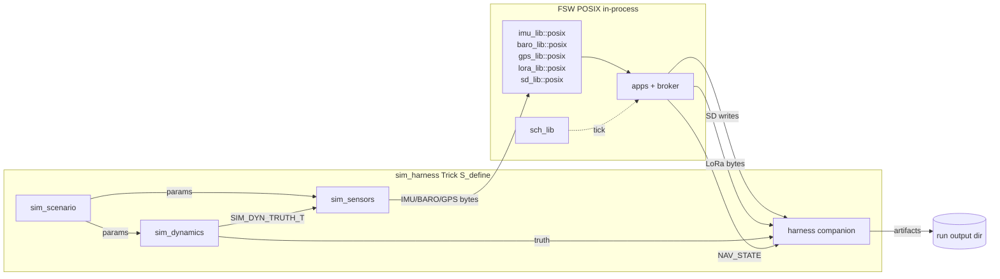
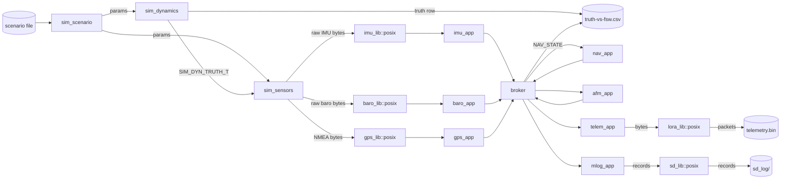
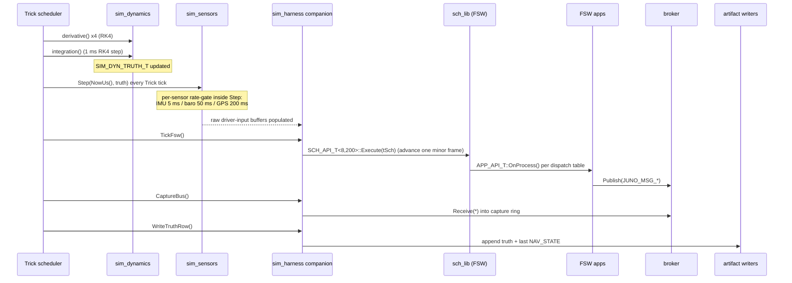
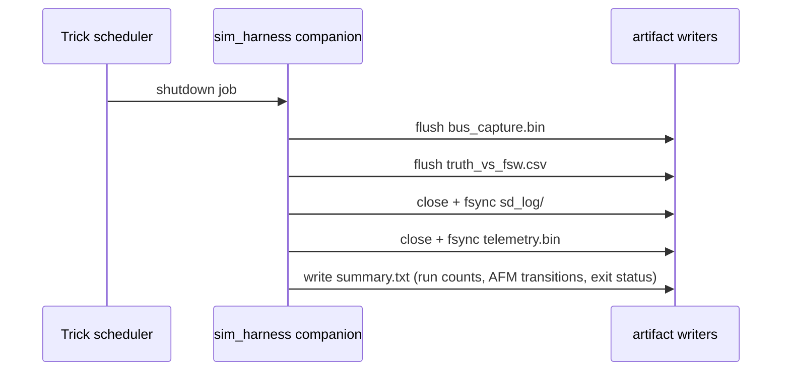

# sim_harness — Design (L2, IEEE 1016) — Index

**Document type:** IEEE 1016 Software Design Description
**Module:** `sim_harness` — top-level Trick S_define harness wiring FSW POSIX to dynamics/sensors/scenario.
**Authoritative references:** `docs/design/conventions.md` (vocabulary), `docs/design/system/system_design.md` §10 (Trick integration).
**Requirement coverage:** `SW-REQ-SIM-HARN-001` … `SW-REQ-SIM-HARN-010`.

## Document Structure

This design exceeds the 500-line per-file budget; the IEEE 1016 sections
are split across two files:

| File | Sections |
|------|----------|
| `design.md` (this file) | §§1–3, §5–11 — purpose, vocabulary, system overview, state machines, data flow, sequence diagrams, timing, error handling, memory ownership, traceability |
| [`interfaces.md`](./interfaces.md) | §4 — interface definitions: S_define skeleton, sim_jobs, instantiation order, variable bindings (incl. time-injection mechanism + per-driver buffer seams), `SIM_HARNESS_T` companion contract |

All `<!-- @{"design": [...]} -->` tags in both files are authoritative;
§11 below consolidates traceability across both files.

---

<!-- @{"design": ["SW-REQ-SIM-HARN-001", "SW-REQ-SIM-HARN-004", "SW-REQ-SIM-HARN-005", "SW-REQ-SIM-HARN-010"]} -->
## 1. Purpose and Scope

The `sim_harness` module is the top-level NASA-Trick integration that composes
the three sim modules (`sim_dynamics`, `sim_sensors`, `sim_scenario`) and the
FSW POSIX build into a single closed-loop SITL simulation. It addresses
`SW-REQ-SIM-HARN-001` through `SW-REQ-SIM-HARN-010` and is the elaboration of
`docs/design/system/system_design.md` §10.2 (POSIX/Pico2 split + Trick
integration) for the harness layer specifically.

The harness comprises **two artefacts**: (a) `sim/sim_harness/S_define` — the
NASA Trick simulation definition file declaring `sim_object` instances, jobs,
periods, and inter-object connections; and (b) `sim/sim_harness/src/main.cpp`
— a C++ companion exposing the FSW composition root, run-output artifact
writers, and a Trick-bound `juno::time::TIME_API_T` instance (`tTrickTimeApi`) aggregate-initialized
from sim-harness static functions and bound into the FSW's `juno::time::TIME_ROOT_T` via
`juno::time::TimeInit(tTime, tTrickTimeApi, ...)` at composition (§4.4). Trick is launched with a
scenario file selected by command-line
argument (`SW-REQ-SIM-HARN-005`); all run artifacts are written under one
configurable output directory (`SW-REQ-SIM-HARN-010`).

In scope: S_define structure; `sim_object` declarations and bindings;
companion C++ (composition root invocation, time-source injection, artifact
writers); run modes; hyperperiod alignment; cross-module data flow;
bus-message capture for offline analysis. Out of scope: dynamics integrator
design (`sim_dynamics` L2); sensor noise/quantization models (`sim_sensors`
L2); scenario file format (`sim_scenario` L2); FSW algorithm internals
(per-app L2s); FT2/FIDR.

### 1.1 File layout

```
sim/sim_harness/
├── S_define                     Trick simulation definition (§4)
├── include/sim_harness/sim_harness.hpp   Companion public header
├── src/
│   ├── main.cpp                 Trick main() — passes argc/argv to Trick
│   ├── sim_harness.cpp          Artifact writers + FSW composition wrapper
│   └── time_trick_source.cpp    Trick-side juno::time::TIME_API_T impl (§4.4)
└── CMakeLists.txt               Trick build target wiring
```

The S_define is the authoritative wiring contract; companion C++ exists only
because S_define cannot directly invoke the LibJuno composition-root sequence
that `apps/main_posix.cpp` uses (per-lib `New()` factories plus per-app free
`<App>AppInit(tApp, ...)` setup functions that aggregate-init each
`juno::app::APP_ROOT_T` with its `juno::app::APP_API_T { OnStart, OnProcess,
OnExit }` vtable). All Trick scheduling decisions (rates, offsets, integration
order) live in the S_define, not in the companion. App-lifecycle dispatch is
performed by the FSW's `juno::sch::SCH_ROOT_T` over the registered
`APP_ROOT_T*` pointers; the harness never calls `OnStart`/`OnProcess`/`OnExit`
directly.

---

<!-- @{"design": ["SW-REQ-SIM-HARN-001", "SW-REQ-SIM-HARN-002"]} -->
## 2. Definitions and Abbreviations

Cross-module vocabulary (phase enum, time base, frames, status semantics,
message naming, scheduler period units, body axes) is defined in
`docs/design/conventions.md` §4 and is **not** redefined here. Module-local
terms only:

| Term | Meaning |
|------|---------|
| Trick | NASA Trick simulation environment; provides scheduler, integrator, and S_define DSL. |
| S_define | Trick's simulation-definition source file declaring `sim_object`, `job`, and `connections`. |
| `sim_object` | Trick construct binding a C/C++ instance into the Trick scheduler. |
| Trick tick | Base scheduler step of the Trick run; locked to **1 ms** for this harness (see §8). |
| Hyperperiod | LCM of all FSW app periods = **1000 ms** (`system_design.md` §8.2). |
| Truth state | `SIM_DYN_TRUTH_T` produced by `sim_dynamics`; consumed by `sim_sensors` and the truth-vs-FSW comparison artifact. |
| FSW POSIX driver impls | `imu_lib::posix`, `baro_lib::posix`, `gps_lib::posix`, `lora_lib::posix`, `sd_lib::posix` impls used in lieu of flight hardware. |
| Run artifact | Any file produced under the run output directory (`SW-REQ-SIM-HARN-010`). |
| Run mode | Operator-selectable behavior bundle (nominal flight, fault-injected flight, regression suite). |

---

<!-- @{"design": ["SW-REQ-SIM-HARN-001", "SW-REQ-SIM-HARN-003", "SW-REQ-SIM-HARN-004"]} -->
## 3. System Overview

### 3.1 MVC layer mapping

`sim_harness` is **sim-only top-level integration** — it is not part of the
flight FSW MVC. It instantiates and connects:

| Layer | Realization in this module |
|-------|---------------------------|
| Trick scheduler | Drives jobs declared in S_define at the configured rate. |
| Truth model | `sim_dynamics::SIM_DYNAMICS` instance; produces `SIM_DYN_TRUTH_T` (POD). |
| Sensor models | `sim_sensors::SimSensors` instance; consumes truth, produces driver inputs. |
| Configuration | `juno::sim_scenario::SIM_SCENARIO_T` POD loaded once via `LoadScenario(path)` at run start. |
| FSW (View+Controller+Bus) | The full FSW POSIX composition graph (per `system_design.md` §8.1); the companion code invokes the same `apps/main_posix.cpp` composition sequence (per-lib `New()` + per-app free `<App>AppInit(tApp, ...)` setup that aggregate-inits `juno::app::APP_ROOT_T` with the canonical `APP_API_T { OnStart, OnProcess, OnExit }` vtable) inside Trick's `initialization` job. |
| Artifact sink | Companion-code writers for SD log, telemetry transcript, truth-vs-FSW comparison. |

### 3.2 Module composition diagram



The harness is the only place Trick-side and FSW-side graphs meet. No FSW
source is modified: the FSW POSIX build is linked unchanged
(`SW-REQ-SIM-HARN-004`); the only behavioural override is replacing the POSIX
`juno::time::TIME_API_T` instance (`tPosixTimeApi`) with the harness-supplied
`tTrickTimeApi` in the composition-root call to
`juno::time::TimeInit(tTime, tTrickTimeApi, ...)` (§4.4, §10.2) — itself a
documented `time_lib` injection seam (Option A, Chair 2026-05-03).

---

## 4. Interface Definitions

See **[`interfaces.md`](./interfaces.md)** for the full §4 content:

- §4.1 S_define structure (declarative skeleton with corrected declaration order, 1 ms RK4 integrate, `SIM_DYNAMICS` / `SimSensors` namespaces).
- §4.2 sim_jobs scheduler-wiring table.
- §4.3 Object instantiation order (harness declared first to own argv-populated `tArgs`).
- §4.4 Variable bindings — truth → sensor inputs → FSW POSIX drivers → artifacts; harness-supplied `juno::time::TIME_API_T` (`tTrickTimeApi`) bound into `juno::time::TIME_ROOT_T` via `juno::time::TimeInit(...)` (Option A — no provider callback).
  - §4.4.1 Per-driver `New()`-time buffer-injection seams (imu_lib, baro_lib, gps_lib, lora_lib, sd_lib).
- §4.5 Companion contract — `SIM_HARNESS_T` member signatures, contracts, and per-API thread-safety statements.

Section §4 carries the design tags
`SW-REQ-SIM-HARN-001..-005, -007..-010` (see the `<!-- @{"design": ...} -->`
block at the head of `interfaces.md`).

---

<!-- @{"design": ["SW-REQ-SIM-HARN-002"]} -->
## 5. State Machines

The harness has **one** lifecycle state machine, governing run progression.

```mermaid
stateDiagram-v2
    [*] --> ParsingArgs: trick main() entry
    ParsingArgs --> LoadingScenario: --scenario, --out, --seed parsed
    LoadingScenario --> ComposingFsw: scen.Load returned SUCCESS
    LoadingScenario --> Aborting: scenario file missing / parse error
    ComposingFsw --> Running: FSW composition root returned SUCCESS, all factories OK
    ComposingFsw --> Aborting: FSW factory returned non-SUCCESS
    Running --> Running: per-tick TickFsw + CaptureBus + WriteTruthRow
    Running --> Finalizing: dyn ground-impact + post-impact hold elapsed (SIM-DYN-012/013) OR Trick stop time reached
    Finalizing --> [*]: artifacts fsync'd, summary written
    Aborting --> [*]: non-zero exit; partial artifacts (if any) preserved
```



The harness never alters control flow on FSW failure — FSW failure handlers
are diagnostic-only (`conventions.md` §4.3); the harness simply records the
failure into the run summary and continues, just as the flight build would.

---

<!-- @{"design": ["SW-REQ-SIM-HARN-001", "SW-REQ-SIM-HARN-003", "SW-REQ-SIM-HARN-004", "SW-REQ-SIM-HARN-007", "SW-REQ-SIM-HARN-008", "SW-REQ-SIM-HARN-009"]} -->
## 6. Data Flow

End-to-end chain (scenario → dynamics → sensors → FSW POSIX drivers → FSW
apps → broker → captured for analysis):



**Bus-message capture:** the harness companion subscribes to **every**
`JUNO_MSG_*` type on the broker (the same set published per
`system_design.md` §4) and writes them into per-run capture files for offline
analysis. The capture path uses the broker's normal subscription API — no
additional broker-internal hooks. Subscribers are publisher-owned-fill →
broker-copy → subscriber-immutable (`conventions.md` §5 rule 6); the harness
captures by reading its own immutable subscriber view.

**Run output directory structure** (`SW-REQ-SIM-HARN-010`):

```
<out_dir>/
├── scenario.txt              loaded scenario copy (provenance)
├── seed.txt                  RNG seed (SW-REQ-SIM-HARN-006)
├── truth_vs_fsw.csv          truth + NAV_STATE per row (SW-REQ-SIM-HARN-009)
├── sd_log/<run-id>/...       FSW SD log image (SW-REQ-SIM-HARN-007)
├── telemetry.bin             FSW LoRa transcript (SW-REQ-SIM-HARN-008)
├── bus_capture.bin           every JUNO_MSG_* observed on the broker
└── summary.txt               counts, timestamps, AFM phase transitions
```

---

<!-- @{"design": ["SW-REQ-SIM-HARN-001", "SW-REQ-SIM-HARN-002", "SW-REQ-SIM-HARN-003", "SW-REQ-SIM-HARN-004"]} -->
## 7. Sequence Diagrams

### 7.1 One nominal Trick tick (1 ms)



### 7.2 Run shutdown (artifact finalisation)



---

<!-- @{"design": ["SW-REQ-SIM-HARN-002", "SW-REQ-SIM-HARN-006"]} -->
## 8. Timing and Scheduling Analysis

| Quantity | Value | Source |
|----------|-------|--------|
| Trick base tick | **1 ms** | This design — divisor of every FSW app period (5/10/50/100/200/500 ms) and the 1000 ms hyperperiod (`system_design.md` §8.2). |
| Dynamics integration step | **1 ms (RK4)** | `sim_dynamics` §4.4 — one RK4 step per Trick tick (4 derivative evaluations per step). Aligned with Trick base tick; no sub-step rate. |
| FSW IMU base tick | 5 ms | `SW-REQ-SYS-005`; multiple of Trick tick → IMU sample every 5th Trick tick. |
| Hyperperiod | 1000 ms | `system_design.md` §8.2; integer multiple of every period above. |
| Trick stop time (default) | **20 s** | Covers FT1 nominal flight (~600 m apogee) + descent + post-impact hold. Configurable per scenario. |

**Hyperperiod alignment check:**
`gcd(1, 5) = 1`, `gcd(1, 50) = 1`, `gcd(1, 200) = 1`, `gcd(1, 500) = 1` —
the 1 ms Trick tick is a divisor of every app period, so every FSW app
dispatches exactly on the same Trick ticks the flight build would dispatch on
across the 1000 ms hyperperiod. This is required for `SW-REQ-SIM-HARN-002`
(time-stepped orchestration) and `SW-REQ-SIM-HARN-006` (reproducible run
output — bit-identical schedule across runs).

**Reproducibility (`SW-REQ-SIM-HARN-006`):** identical scenario + identical
`--seed=<N>` + identical Trick stop time produce bit-identical artifacts
because (1) the FSW POSIX build is deterministic by construction
(`SW-REQ-SYS-044`/`-050`/`-051`), (2) `sim_dynamics` integration is
fixed-step deterministic (`SW-REQ-SIM-DYN-009`/`-010`), (3) `sim_sensors`
noise is seeded from `--seed` only (no `time(NULL)` / `random_device`
reads), (4) the Trick scheduler is invoked with fixed run-time and tick
rate, and (5) the FSW's `juno::time::TIME_ROOT_T` was initialized via
`juno::time::TimeInit(tTime, tTrickTimeApi, ...)` so `tTime.ptApi->Now(tTime)`
returns Trick sim time, not wall-clock time.

**Run modes:** the same harness binary supports three run modes by scenario
selection only — nominal flight (default `ft1_baseline.scen`), fault-injected
flight (e.g., `ft1_gps_dropout.scen` exercising `SW-REQ-SIM-SENS-012`), and
regression suite (a script-driven series of named scenarios). No code branch
distinguishes them.

**Downstream consumers:** the run artifacts are consumed by external
post-run analysis tooling (`tools/`), not by FSW or other sim modules; no
real-time latency budget applies between artifact emission and consumption.

---

<!-- @{"design": ["SW-REQ-SIM-HARN-001", "SW-REQ-SIM-HARN-004", "SW-REQ-SIM-HARN-007", "SW-REQ-SIM-HARN-008", "SW-REQ-SIM-HARN-010"]} -->
## 9. Error Handling Strategy

The harness inherits the FSW status-propagation idiom (`conventions.md`
§4.3): every fallible call returns `JUNO_STATUS_T` / `RESULT_T<T>` /
`OPTION_T<T>`; callers use `JUNO_ASSERT_*` macros, never bare `if`-return.

| Failure class | Handling |
|--------------|---------|
| Scenario file missing / parse error | `LoadingScenario → Aborting`. Non-zero Trick exit; summary.txt records the error string. No partial sim run. |
| FSW factory failure during composition | `ComposingFsw → Aborting`. Per-factory failure handler invoked diagnostically, error logged, harness aborts. (Same factory chain as flight build, so this path matches `apps/main_posix.cpp` semantics.) |
| Output directory not creatable / not writable | Init returns `JUNO_STATUS_WRITE_ERROR` (artifact-dir creation is a write path per `conventions.md` §4.8); harness aborts before scheduling jobs. |
| Per-tick FSW failure (sensor read, SD write, LoRa Tx) | **Inherited from FSW.** The harness performs no override: per-sensor health bits are set in `JUNO_MSG_SYS_HEALTH_T` (`SW-REQ-SYS-058`/`-060`/`-061`), bus_capture.bin records the bitmap change, and the run continues. Failure handlers stay diagnostic-only (`conventions.md` §4.3). |
| Sim-side artifact writer error | Logged; the failing artifact is marked `partial` in summary.txt; run continues. |
| Ground impact reached | Normal termination — `sim_dynamics` pins truth (`SW-REQ-SIM-DYN-012/013`), Trick run continues until stop time, then `Finalizing`. |

**Failure handlers are diagnostic only and do not alter control flow** —
this property is preserved end-to-end through the harness, exactly as in the
flight build (`conventions.md` §4.3).

The harness never injects faults into FSW directly; fault injection is
expressed only as scenario configuration consumed by `sim_sensors` (e.g.,
`SW-REQ-SIM-SENS-012` GPS dropout, `-006`/`-009`/`-011` noise/bias),
keeping the FSW path identical across nominal and fault-injected runs.

---

<!-- @{"design": ["SW-REQ-SIM-HARN-001", "SW-REQ-SIM-HARN-004", "SW-REQ-SIM-HARN-006", "SW-REQ-SIM-HARN-010"]} -->
## 10. Memory Ownership

### 10.1 Layered ownership rule

| Layer | Allocation rule |
|-------|----------------|
| Trick layer (S_define, companion artifact writers) | **Heap allowed** — Trick uses heap; artifact writers may use `std::ofstream` / `std::vector`. Permitted only on the Trick side. |
| FSW POSIX layer (linked unchanged) | **No heap.** Every constraint of `conventions.md` §5 holds: caller-owned storage, no `new`/`delete`/`malloc`, no global mutable state in libs, no heap-backed STL, no runtime polymorphism after init (`SW-REQ-SYS-050`/`-051`). |

Boundary is `juno::sim_harness::SIM_HARNESS_T`: anything reachable through
the FSW composition root remains caller-owned; harness-only state may heap.

### 10.2 Buffer ownership table

| Buffer / facility | Owner | Lifetime | Allocation |
|-------------------|-------|----------|------------|
| `SIM_HARNESS_T` instance | Trick `sim_object harness` | run lifetime | Trick-managed (Trick layer; heap-OK) |
| Driver-input pointers (`_ptImuDriverInput`, `_ptBaroDriverInput`) | `SIM_HARNESS_T` | run lifetime | Pointer-typed members on `SIM_HARNESS_T`; resolved by Trick `connect` blocks to the addresses of `SimSensors::ImuRaw()` (`SIM_SENSORS_RAW_T`) and `SimSensors::BaroRegs()` (`SIM_BARO_REGS_T` — MPL3115A2 register image) owned by `sens.tImpl`. FSW IMU/baro driver `New()` factories receive these pointers (or callbacks built around them) per §4.4.1. **GPS is not bound this way** — there is no `_ptGpsDriverInput`; instead the harness owns a pseudo-terminal (`openpty(3)`) pair: the **slave** fd is handed to the FSW `device_lib::posix::DEVICE_LIB_IMPL_T<2048>::New(...)` factory (the same factory the host-test build uses, per `device/design.md` §4.3 / "POSIX/Pico2 functional equivalence" table) and the **master** fd is retained on `SIM_HARNESS_T._iGpsPtyMasterFd`. `harness.Init` installs `SimSensors::SetGpsUartSink({pfnWrite = &SimHarness::WriteGpsMasterFd, pvCtx = this})` whose body simply calls `::write(_iGpsPtyMasterFd, pcBuf, zLen)`, so `gps_model` pushes NMEA bytes onto the master end at 5 Hz and the FSW POSIX UART RX path drains them on the slave end exactly as it would in the host-test pty fixture. No fabricated `device_lib::posix::Inject` symbol is needed. |
| GPS pty master fd (`_iGpsPtyMasterFd`) | `SIM_HARNESS_T` | run lifetime | Created by `openpty(3)` inside `harness.Init`; the slave fd is consumed by `device_lib::posix::DEVICE_LIB_IMPL_T<2048>::New(...)`. The master fd is closed in `FinalizeArtifacts`. The harness writes NMEA bytes via `::write(_iGpsPtyMasterFd, ...)` — no fabricated injection symbol on `device_lib`. |
| Bus capture ring | `SIM_HARNESS_T` | run lifetime | Heap (Trick layer); flushed every tick. |
| Artifact file streams (`truth_vs_fsw.csv`, `telemetry.bin`, `bus_capture.bin`, `sd_log/`) | `SIM_HARNESS_T` | run lifetime | `std::ofstream` (heap-OK in Trick layer). |
| FSW `*_IMPL_T` instances (libs / apps) | FSW composition root (invoked by `Init()`) | run lifetime | Static / `.bss` — caller-owned, **no heap** (`SW-REQ-SYS-050`). |
| FSW broker, scheduler | FSW composition root | run lifetime | Static — caller-owned, **no heap**. |
| FSW `time_lib` Trick API instance | `SIM_HARNESS_T` (the harness TU defines `static const juno::time::TIME_API_T tTrickTimeApi{TrickNow, TrickSleepTo, TrickSleep};` and the composition root binds it via `juno::time::TimeInit(tTime, tTrickTimeApi, /*pfcnFailureHandler=*/nullptr, /*pvUserData=*/nullptr)`) | run lifetime | `tTrickTimeApi` is a file-scope `static const` in the harness translation unit; the `juno::time::TIME_ROOT_T` aggregate it is bound into is caller-owned by the FSW composition root (no heap). No `JUNO_TIME_PROVIDER_T` callback exists (Option A — Chair 2026-05-03); the entire `TIME_API_T` vtable is replaced at composition time. |

### 10.3 POSIX/Pico2 split — Trick uses POSIX impls only

`SW-REQ-SYS-043` is exercised here: the FSW POSIX impls linked by the harness
are the same translation units used in the flight POSIX unit-test build. The
Pico2 build is not exercised by Trick (`conventions.md` §6,
`system_design.md` §10.2 row 3). Trick → FSW hand-off respects the FSW POSIX
driver contracts unchanged (no driver source modified). The single
deliberate platform divergence is the `juno::time::TIME_API_T` instance bound
into `juno::time::TIME_ROOT_T` at composition: the harness binary uses
`tTrickTimeApi` (Trick sim clock) instead of the POSIX `tPosixTimeApi`
(`clock_gettime(CLOCK_MONOTONIC)`) — Option A documented per
`conventions.md` §6 and `time_lib` §4.4.

---

## 11. Traceability

Per-section `<!-- @{"design": [...]} -->` tags above are authoritative; this
table is descriptive consolidation. Every `SW-REQ-SIM-HARN-NNN` is mapped to
at least one section.

| Req ID | Title | Section(s) |
|--------|-------|-----------|
| SW-REQ-SIM-HARN-001 | Trick S_define Integration | §1, §3, §4, §6, §7, §10 |
| SW-REQ-SIM-HARN-002 | Time-Stepped Sim Orchestration | §2, §4.2, §5, §8 |
| SW-REQ-SIM-HARN-003 | Sensor-to-FSW Boundary | §3, §4.4, §6, §7 |
| SW-REQ-SIM-HARN-004 | POSIX FSW Execution Inside Sim | §1, §3, §4.3, §6, §9, §10 |
| SW-REQ-SIM-HARN-005 | Scenario Configuration Selection | §1, §4.3 |
| SW-REQ-SIM-HARN-006 | Reproducible Run Output | §8, §10 |
| SW-REQ-SIM-HARN-007 | SD Log Artifact Emission | §1, §6, §9 |
| SW-REQ-SIM-HARN-008 | Telemetry Capture Artifact | §1, §6, §9 |
| SW-REQ-SIM-HARN-009 | Truth-vs-FSW Comparison Artifact | §4.2, §4.5, §6 |
| SW-REQ-SIM-HARN-010 | Run Artifact Output Directory | §1, §4.3, §6, §9 |

**POSIX/Pico2 equivalence (`SW-REQ-SYS-043`):** the harness uses FSW POSIX
impls unmodified; Pico2 equivalence is exercised through the flight build,
not through this harness (§10.3). The single deliberate divergence (the
harness-supplied `juno::time::TIME_API_T tTrickTimeApi` aggregate-initialized
in the harness translation unit and bound into `juno::time::TIME_ROOT_T` via
`juno::time::TimeInit` at composition — Option A) is documented in §4.4 and
§10.3. Every SIM-HARN req traces to `SW-REQ-SYS-045` or `SW-REQ-SYS-044`.
