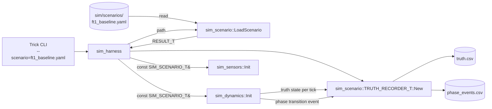
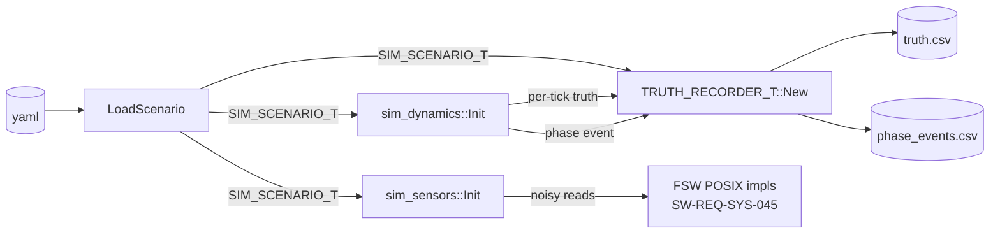
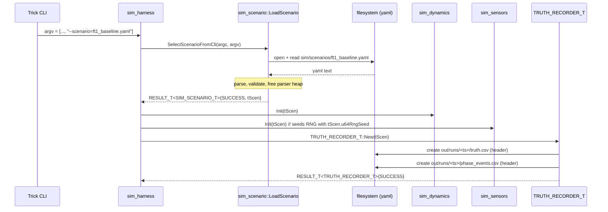
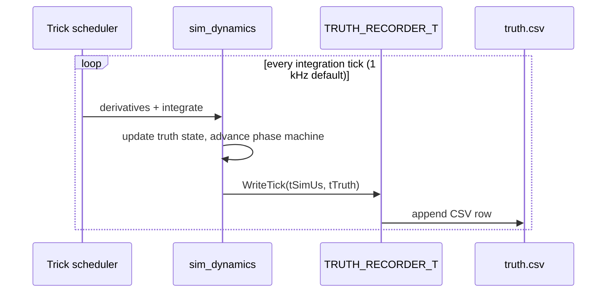
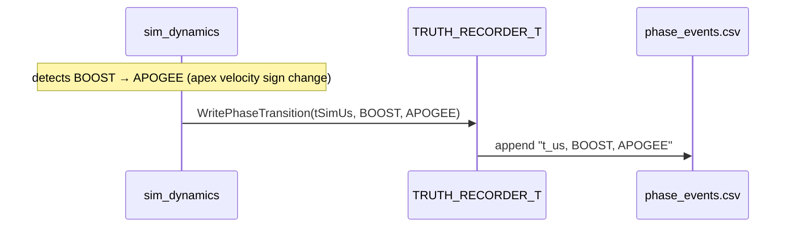

# sim_scenario — Design (L2)

**Document type:** IEEE 1016 Software Design Description
**Module:** `sim_scenario`
**Scope:** Trick scenario configuration — file format, parser API, parameter categories, truth recording, scenario selection, seeding `sim_dynamics` and `sim_sensors` at simulation startup.
**Reference (do not contradict):** `docs/design/conventions.md`, `docs/design/system/system_design.md`.

`sim_scenario` is a **simulation-only** module, built only under the POSIX/Trick target (`SW-REQ-SYS-045`); it is **never** linked into the Pico2 flight build. It is therefore exempt from the freestanding/no-heap rules that apply to FSW libs (`SW-REQ-SYS-050`) — heap use during file parse and STL containers in the parser are explicitly permitted by the worker brief and AC-9. The output struct it hands to consumers, however, is a **plain POD** (`SIM_SCENARIO_T`) that lives wherever the caller places it.

---

<!-- @{"design": ["SW-REQ-SIM-SCEN-001", "SW-REQ-SIM-SCEN-011"]} -->
## 1. Purpose and Scope

This document is the L2 design for `sim_scenario`, the Trick-side scenario configuration module. It addresses every requirement in `docs/requirements/sim_scenario/requirements.json` (`SW-REQ-SIM-SCEN-001` through `SW-REQ-SIM-SCEN-012`). The module's three responsibilities:

1. **Parse a human-editable scenario file** into an in-memory `SIM_SCENARIO_T` struct (`SW-REQ-SIM-SCEN-001`).
2. **Seed `sim_dynamics` and `sim_sensors`** with launch site, motor profile, vehicle properties, atmosphere, wind, and sensor noise parameters at sim startup (`SW-REQ-SIM-SCEN-002`..`-006`).
3. **Record truth state and phase transitions** to sidecar output files during the run (`SW-REQ-SIM-SCEN-007`..`-010`).

It also exposes a Trick command-line argument for scenario selection (`SW-REQ-SIM-SCEN-012`) and ships a default FT1 baseline scenario file (`SW-REQ-SIM-SCEN-011`).

**File format choice (locked, not TBD):** the scenario file is **YAML** — pinned by PM during sprint review 2026-05-02 (closes underspecification of `SW-REQ-SIM-SCEN-001`'s "human-editable text"). Trick-idiomatic for scenario authoring (block scalars, comments, diffability), single dependency (`yaml-cpp`). The truth state sidecar file is a separate **CSV** stream (one row per integration tick, header row first) for `pandas`/`numpy` ingest.

**In scope:** YAML schema, parser API (`LoadScenario`), `SIM_SCENARIO_T` POD layout, truth-CSV writer API, Trick CLI dispatch, FT1 baseline scenario content, error-on-load behaviour, deterministic-seed semantics.

**Out of scope:** `sim_dynamics` integration (separate module — receives `SIM_SCENARIO_T` by const-ref); sensor-noise math (`sim_sensors`); FSW behaviour (every FSW lib is unmodified); FT2 tooling.

---

## 2. Definitions and Abbreviations

Cross-module vocabulary (frames, time base, units, status semantics) is defined in `docs/design/conventions.md` §4 and is **not** redefined here: `SW-REQ-SYS-026` (`JUNO_TIME_US_T` monotonic µs), `SW-REQ-SYS-038`/`-039` (geodetic + HAE), `SW-REQ-SYS-040` (NED), `SW-REQ-SYS-042` (SI), `SW-REQ-SYS-057` (body X-fwd/Y-right/Z-down) inherited verbatim.

| Term | Meaning |
|------|---------|
| Trick | NASA sim framework; provides `S_define`, integration loop, CLI |
| `SIM_SCENARIO_T` | POD struct produced by the parser; consumed by `sim_dynamics`, `sim_sensors`, `sim_harness` |
| Truth state | Ground-truth vehicle state (pos, vel, att, mass, phase) from `sim_dynamics` — distinct from FSW-estimated nav state |
| Truth CSV | `<run_dir>/truth.csv` — written each integration tick |
| Phase event log | `<run_dir>/phase_events.csv` — true phase transition times |
| Scenario file | YAML input at `sim/scenarios/<name>.yaml` |
| RNG seed | Deterministic 64-bit seed used by `sim_sensors` for noise generation |
| Integration rate | `sim_dynamics` step rate (default 1 kHz, 1000 µs per truth row) |
| FT1 baseline | Default scenario `sim/scenarios/ft1_baseline.yaml` — G-class motor, ~600 m apogee, nominal noise |
| `juno::sim_scenario` | C++ namespace (lowercase per `conventions.md` §3) |

---

<!-- @{"design": ["SW-REQ-SIM-SCEN-001", "SW-REQ-SIM-SCEN-012"]} -->
## 3. System Overview

### 3.1 Layer mapping

`sim_scenario` is **not** an FSW MVC component (it never runs on flight hardware). It is a **sim harness component** that runs once at Trick startup and once per integration tick (truth recorder).

| Role | Realization |
|------|-------------|
| Loader (one-shot, startup) | `juno::sim_scenario::LoadScenario(path) -> RESULT_T<SIM_SCENARIO_T>` |
| Truth recorder (per-tick) | `juno::sim_scenario::TRUTH_RECORDER_T` instance owned by `sim_harness` |
| Phase event recorder | Method on `TRUTH_RECORDER_T`, called by `sim_dynamics` on phase change |

The **caller** in all cases is `sim_harness` (Trick `S_define` owner): it reads CLI, calls `LoadScenario`, hands the resulting `SIM_SCENARIO_T` to `sim_dynamics::Init` and `sim_sensors::Init`, and creates one `TRUTH_RECORDER_T` for the run.

### 3.2 Module-in-context diagram



`sim_scenario` is **upstream** of `sim_dynamics`/`sim_sensors` for configuration and **downstream** of `sim_dynamics` for truth recording. It is invisible to every FSW lib/app — those see the same `*_ROOT_T` API they would on Pico2 (`SW-REQ-SYS-043`).

---

<!-- @{"design": ["SW-REQ-SIM-SCEN-001", "SW-REQ-SIM-SCEN-002", "SW-REQ-SIM-SCEN-003", "SW-REQ-SIM-SCEN-004", "SW-REQ-SIM-SCEN-005", "SW-REQ-SIM-SCEN-006", "SW-REQ-SIM-SCEN-007", "SW-REQ-SIM-SCEN-009", "SW-REQ-SIM-SCEN-010", "SW-REQ-SIM-SCEN-012"]} -->
## 4. Interface Definitions

### 4.1 Scenario file format (YAML schema)

A scenario file is a single YAML document. All units SI (`SW-REQ-SYS-042`); altitudes HAE (`SW-REQ-SYS-039`); velocities NED (`SW-REQ-SYS-040`). Example below is `sim/scenarios/ft1_baseline.yaml` (`SW-REQ-SIM-SCEN-011`):

```yaml
schema_version: 1
name: "FT1 Baseline"
description: "G-class motor, nominal noise, calm wind, ~600 m apogee"

initial_conditions:                 # SW-REQ-SIM-SCEN-002
  launch_site: { latitude_deg: 32.9903, longitude_deg: -106.9747, elevation_m_hae: 1216.0 }
  launch_rail: { azimuth_deg: 0.0, elevation_deg: 87.0, length_m: 2.4 }
  initial_velocity_ned_mps: [0.0, 0.0, 0.0]
  initial_mass_kg: 1.250
  utc_launch_time: "2026-06-15T17:30:00Z"   # informational; FSW uses monotonic µs

motor:                              # SW-REQ-SIM-SCEN-003
  identifier: "AeroTech-G80"
  propellant_mass_kg: 0.062
  burn_time_s: 1.45
  thrust_curve:                     # time-indexed [s, N]
    - [0.000, 0.0]
    - [0.020, 95.0]
    - [1.400, 18.0]
    - [1.450, 0.0]

vehicle:                            # SW-REQ-SIM-SCEN-004
  dry_mass_kg: 1.188
  reference_area_m2: 0.00456
  drag_coefficient_table:           # mach -> Cd
    - [0.0, 0.55]
    - [0.9, 0.78]

atmosphere:                         # SW-REQ-SIM-SCEN-005
  model: "isa_offset"               # isa | isa_offset | custom_table
  sea_level_pressure_pa: 101325.0
  sea_level_temperature_k: 288.15
  temperature_offset_k: 0.0
  wind:
    model: "constant"               # zero | constant | scripted
    velocity_ned_mps: [0.0, 0.0, 0.0]

sensors:                            # SW-REQ-SIM-SCEN-006
  imu:
    accel_noise_sigma_mps2: 0.05
    gyro_noise_sigma_radps: 0.002
    accel_bias_mps2: [0.0, 0.0, 0.0]
    gyro_bias_radps: [0.0, 0.0, 0.0]
  baro: { pressure_noise_sigma_pa: 8.0 }
  gps:
    position_noise_sigma_m: 2.5
    velocity_noise_sigma_mps: 0.1
    fix_dropouts: [[5.0, 7.0]]      # (start_s, end_s) outage windows
  faults:                           # optional injection
    sd_card_full_at_s: null
    imu_saturate_at_s: null

rng_seed: 0xC0FFEE12345
integration_rate_hz: 1000           # truth rate (SW-REQ-SIM-SCEN-008)
sim_duration_s: 90.0
output_dir: "out/runs"
```

Schema documented in `sim/scenarios/README.md`; this design pins keys/types. Unknown keys cause load failure (§9.2).

### 4.2 Parser API

Exposed in `sim/sim_scenario/include/sim_scenario/sim_scenario.hpp`. Does **not** follow the LibJuno `<MODULE>_API_T` vtable pattern — `sim_scenario` is a one-shot startup utility, not a runtime LibJuno module. The brief authorises Trick-idiomatic C++ with STL.

#### LoadScenario

| Attribute | Value |
|-----------|-------|
| Signature | `juno::sim_scenario::RESULT_T<SIM_SCENARIO_T> LoadScenario(const char *pcPath) noexcept` |
| Preconditions | `pcPath` non-null and points to a readable YAML file on disk |
| Postconditions | On `JUNO_STATUS_SUCCESS`: returned struct fully populated, all heap allocated by parser is freed before return (AC-9). On failure: returned struct is zero-initialised and `tStatus != JUNO_STATUS_SUCCESS` |
| Error conditions | `JUNO_STATUS_DNE_ERROR` file not found; `JUNO_STATUS_INVALID_DATA_ERROR` YAML parse failure or schema violation (canonical "input data failed validation" code per `conventions.md` §4.8); `JUNO_STATUS_OOB_ERROR` value out of allowed range |
| Thread safety | Not thread-safe; called once at sim startup before any worker thread |
| Allocation | Parser uses heap (yaml-cpp std::vector/std::string) during parse; **all parser-side allocations are freed before return** — the returned `SIM_SCENARIO_T` is POD by value and contains only fixed-size arrays |

```cpp
/**
 * @brief Parse a scenario YAML file and return a populated SIM_SCENARIO_T.
 * @param pcPath Absolute or sim-relative path to a YAML scenario file.
 * @return RESULT_T with the scenario on success; status set on failure.
 *         All parser-side heap allocations are released before return.
 */
RESULT_T<SIM_SCENARIO_T> LoadScenario(const char *pcPath) noexcept;
```

#### SelectScenarioFromCli

| Attribute | Value |
|-----------|-------|
| Signature | `RESULT_T<SIM_SCENARIO_T> SelectScenarioFromCli(int iArgc, char *const *ppcArgv) noexcept` |
| Preconditions | argc/argv from Trick `main`. If `--scenario=<path>` not present, defaults to `sim/scenarios/ft1_baseline.yaml` |
| Postconditions | Returns the result of `LoadScenario` for the selected path |
| Error conditions | Same as `LoadScenario` |
| Trace | `SW-REQ-SIM-SCEN-012` (CLI selection), `SW-REQ-SIM-SCEN-011` (default baseline) |

### 4.3 SIM_SCENARIO_T POD layout

```cpp
struct SIM_SCENARIO_T {
    // Initial conditions (SW-REQ-SIM-SCEN-002)
    double   dLatDeg;                  double dLonDeg;
    double   dElevMHae;
    double   dRailAzDeg;               double dRailElDeg;
    double   dRailLenM;
    double   tInitVelNedMps[3];        double dInitMassKg;
    char     acUtcLaunch[24];          // ISO-8601, informational

    // Motor (SW-REQ-SIM-SCEN-003)
    char     acMotorId[32];
    double   dPropellantMassKg;        double dBurnTimeS;
    double   tThrustTimeS[kMaxThrustPts];
    double   tThrustForceN[kMaxThrustPts];
    size_t   zThrustPts;

    // Vehicle (SW-REQ-SIM-SCEN-004)
    double   dDryMassKg;               double dRefAreaM2;
    double   tCdMach[kMaxCdPts];       double tCdVal[kMaxCdPts];
    size_t   zCdPts;

    // Atmosphere + wind (SW-REQ-SIM-SCEN-005)
    enum class ATMOS_MODEL_T : uint8_t { ISA = 0, ISA_OFFSET = 1, CUSTOM = 2 };
    ATMOS_MODEL_T eAtmosModel;
    double   dSlpPa;                   double dSlTempK;
    double   dTempOffsetK;
    enum class WIND_MODEL_T : uint8_t { ZERO = 0, CONSTANT = 1, SCRIPTED = 2 };
    WIND_MODEL_T eWindModel;
    double   tWindVelNedMps[3];

    // Sensors (SW-REQ-SIM-SCEN-006)
    double   dImuAccelSigmaMps2;       double dImuGyroSigmaRadps;
    double   tImuAccelBiasMps2[3];     double tImuGyroBiasRadps[3];
    double   dBaroSigmaPa;
    double   dGpsPosSigmaM;            double dGpsVelSigmaMps;
    double   tGpsDropoutStartS[kMaxDropouts];
    double   tGpsDropoutEndS[kMaxDropouts];
    size_t   zGpsDropoutCnt;
    double   dSdFullAtS;               double dImuSatAtS;   // negative = disabled

    // Reproducibility / run control
    uint64_t u64RngSeed;
    uint32_t u32IntegRateHz;
    double   dDurationS;
    char     acOutputDir[128];
};
```

`kMaxThrustPts = 64`, `kMaxCdPts = 16`, `kMaxDropouts = 8` are `static constexpr size_t` in the namespace. Excess rows in the YAML cause `JUNO_STATUS_OOB_ERROR`.

### 4.4 Truth-recorder API

#### TRUTH_RECORDER_T::New

| Attribute | Value |
|-----------|-------|
| Signature | `RESULT_T<TRUTH_RECORDER_T> TRUTH_RECORDER_T::New(const SIM_SCENARIO_T &tScenario) noexcept` |
| Postconditions | Creates `<output_dir>/<timestamp>/truth.csv` with header row; opens `phase_events.csv`; stores `JUNO_TIME_US_T tT0Us = 0` |
| Error conditions | `JUNO_STATUS_WRITE_ERROR` if file open / create fails (recorder creates files for writing — write path per `conventions.md` §4.8) |
| Trace | `SW-REQ-SIM-SCEN-007` (sidecar output), `SW-REQ-SIM-SCEN-011` (default output_dir from FT1 scenario) |

#### TRUTH_RECORDER_T::WriteTick

| Attribute | Value |
|-----------|-------|
| Signature | `JUNO_STATUS_T WriteTick(JUNO_TIME_US_T tSimUs, const SIM_TRUTH_STATE_T &tTruth) noexcept` |
| Preconditions | called once per integration tick by `sim_dynamics` (`SW-REQ-SIM-SCEN-008`); `tSimUs` is monotonically non-decreasing (`SW-REQ-SIM-SCEN-009`) |
| Postconditions | One CSV row appended: `tSimUs, lat, lon, alt_hae, vN, vE, vD, qw, qx, qy, qz, mass_kg, phase` |
| Error conditions | `JUNO_STATUS_WRITE_ERROR` on write failure (sim aborts; this is the test artifact, not the FSW under test) |

#### TRUTH_RECORDER_T::WritePhaseTransition

| Attribute | Value |
|-----------|-------|
| Signature | `JUNO_STATUS_T WritePhaseTransition(JUNO_TIME_US_T tSimUs, juno::afm::JUNO_PHASE_T eFrom, juno::afm::JUNO_PHASE_T eTo) noexcept` |
| Preconditions | called by `sim_dynamics` exactly when its truth phase machine transitions |
| Postconditions | One CSV row appended to `phase_events.csv`: `tSimUs, ePhaseFrom, ePhaseTo` |
| Trace | `SW-REQ-SIM-SCEN-010` |

The phase enum values are the canonical `juno::afm::JUNO_PHASE_T = {JUNO_PHASE_PRE_LAUNCH, JUNO_PHASE_BOOST, JUNO_PHASE_APOGEE, JUNO_PHASE_DESCENT, JUNO_PHASE_LANDING}` from `conventions.md` §4.1. **No `COAST`, no `IMPACT`, no `PRE_IGNITION`, no `LANDED`.** Per PM Decision 1, `sim_dynamics` adopts the same canonical enum, so this signature is consistent across all sim modules (RESOLVED — was tracked as FLAG-3).

---

## 5. State Machines

`sim_scenario` itself has **no internal state machine**. The loader is a one-shot pure function (file path in, struct out, parser-heap freed). The truth recorder is a stateful append-only file writer (open at `New`, append on `WriteTick`/`WritePhaseTransition`, close at `Deinit`) but exposes no state choice.

The *truth phase machine* tracked in the recorded CSV is `sim_dynamics`'s machine, not `sim_scenario`'s; it follows the canonical `{PRE_LAUNCH→BOOST→APOGEE→DESCENT→LANDING}` ordering (`conventions.md` §4.1) so phase-event timestamps align across truth and FSW logs (`SW-REQ-SIM-SCEN-010` ↔ `SW-REQ-SYS-018`).

---

<!-- @{"design": ["SW-REQ-SIM-SCEN-002", "SW-REQ-SIM-SCEN-003", "SW-REQ-SIM-SCEN-004", "SW-REQ-SIM-SCEN-005", "SW-REQ-SIM-SCEN-006", "SW-REQ-SIM-SCEN-007", "SW-REQ-SIM-SCEN-009"]} -->
## 6. Data Flow

`sim_scenario` publishes **no** FSW software-bus message; it operates entirely sim-side via direct C++ pass-by-reference between sim modules.



**Key data paths produced by `SIM_SCENARIO_T`:**

| Field group | Consumer | Purpose |
|-------------|----------|---------|
| `dLatDeg/dLonDeg/dElevMHae`, `dRailAzDeg/dRailElDeg`, `tInitVelNedMps`, `dInitMassKg` | `sim_dynamics::Init` | Initial integrator state (`SW-REQ-SIM-SCEN-002`, `-004`) |
| `acMotorId`, `dPropellantMassKg`, `tThrustTimeS/tThrustForceN/zThrustPts`, `dBurnTimeS` | `sim_dynamics` thrust model | Time-indexed thrust curve (`SW-REQ-SIM-SCEN-003`) |
| `dDryMassKg`, `dRefAreaM2`, `tCdMach/tCdVal/zCdPts` | `sim_dynamics` aero model | Drag table (`SW-REQ-SIM-SCEN-004`) |
| `eAtmosModel`, `dSlpPa/dSlTempK/dTempOffsetK`, `eWindModel`, `tWindVelNedMps` | `sim_dynamics` atmosphere/wind | Atmosphere + wind (`SW-REQ-SIM-SCEN-005`) |
| `dImuAccelSigmaMps2`, `dImuGyroSigmaRadps`, `tImuAccelBiasMps2`, `tImuGyroBiasRadps`, `dBaroSigmaPa`, `dGpsPosSigmaM`, `dGpsVelSigmaMps`, dropouts, fault times | `sim_sensors::Init` | Noise + fault injection (`SW-REQ-SIM-SCEN-006`) |
| `u64RngSeed` | `sim_sensors` RNG | Deterministic noise stream |
| `u32IntegRateHz`, `dDurationS`, `acOutputDir` | `sim_harness`, `TRUTH_RECORDER_T` | Run control + sidecar location (`SW-REQ-SIM-SCEN-008`) |

**Outputs (sidecar files):**

| File | Producer | Schema | Trace |
|------|----------|--------|-------|
| `<run_dir>/truth.csv` | `TRUTH_RECORDER_T::WriteTick` | header + `t_us, lat_deg, lon_deg, alt_hae_m, vN, vE, vD, qw, qx, qy, qz, mass_kg, phase` per tick | `SW-REQ-SIM-SCEN-007`, `-008`, `-009` |
| `<run_dir>/phase_events.csv` | `TRUTH_RECORDER_T::WritePhaseTransition` | header + `t_us, phase_from, phase_to` per transition | `SW-REQ-SIM-SCEN-010` |

`t_us` in both files is `JUNO_TIME_US_T`-typed monotonic simulation microseconds (`SW-REQ-SIM-SCEN-009`, aligned with `SW-REQ-SYS-026`). Cross-correlation with FSW SD log (`SW-REQ-SYS-027`) is by matching this timestamp domain.

---

<!-- @{"design": ["SW-REQ-SIM-SCEN-007", "SW-REQ-SIM-SCEN-008", "SW-REQ-SIM-SCEN-009", "SW-REQ-SIM-SCEN-010", "SW-REQ-SIM-SCEN-012"]} -->
## 7. Sequence Diagrams

### 7.1 Sim startup (CLI → load → seed)



### 7.2 Per-tick truth recording



### 7.3 Phase transition event



### 7.4 Load failure → sim aborts

```mermaid
sequenceDiagram
    participant CLI as Trick CLI
    participant H as sim_harness
    participant L as sim_scenario::LoadScenario

    CLI->>H: argv = [..., "--scenario=missing.yaml"]
    H->>L: SelectScenarioFromCli(argc, argv)
    L-->>H: RESULT_T{tStatus=DNE_ERROR}
    Note over H: print "scenario load failed: <msg>"
    H->>H: return non-zero exit code; Trick aborts
```

---

## 8. Timing and Scheduling Analysis

`sim_scenario` runs entirely outside the FSW TDM scheduler. Three timing regimes:

| Regime | Trigger | Budget | Notes |
|--------|---------|--------|-------|
| Startup parse | once, before Trick integrates | seconds-class (no real-time SLA) | YAML parse + heap permitted; freed before `LoadScenario` returns |
| Per-tick truth write | every `sim_dynamics` tick (default 1 kHz) | well under one tick | Buffered ofstream append; Trick host-time decoupled |
| Phase event write | event-driven (≤5 events per run) | negligible | Synchronous append |

**FSW timing unaffected.** The FSW POSIX build still meets `SW-REQ-SYS-005` 200 Hz IMU and `SW-REQ-SYS-044` determinism — `sim_scenario` runs at startup and on the truth-side only, never in the FSW execution path.

`SW-REQ-SIM-SCEN-008` requires truth recording at the **simulation integration rate**. `u32IntegRateHz` carries this rate; `WriteTick` is called by `sim_dynamics` once per integrator step. No truth subsampling.

---

<!-- @{"design": ["SW-REQ-SIM-SCEN-001", "SW-REQ-SIM-SCEN-007", "SW-REQ-SIM-SCEN-012"]} -->
## 9. Error Handling Strategy

### 9.1 Status semantics

`sim_scenario` uses the same `JUNO_STATUS_T` / `RESULT_T<T>` types as FSW (`conventions.md` §4.3) for API consistency, but as a sim-only module it may use STL inside the parser. Public APIs (`LoadScenario`, `SelectScenarioFromCli`, `WriteTick`, `WritePhaseTransition`, `New`) are all `noexcept`.

Internal yaml-cpp throws are wrapped in a single `try/catch` translation layer **inside the .cpp implementation only** (the one permitted `try/catch` in the codebase, justified because `yaml-cpp` is a sim-side third-party lib without a `noexcept` interface). The catch converts to `JUNO_STATUS_INVALID_DATA_ERROR` (canonical "input data failed validation" code per `conventions.md` §4.8). **No exception crosses the public API boundary.**

### 9.2 Load-failure behaviour (sim aborts with clear error)

Scenario load failure aborts the sim with a clear stderr message:

| Condition | Status returned | Message printed to stderr |
|-----------|-----------------|---------------------------|
| File does not exist or unreadable | `JUNO_STATUS_DNE_ERROR` | `"sim_scenario: cannot open '<path>': <strerror>"` |
| YAML syntax error | `JUNO_STATUS_INVALID_DATA_ERROR` | `"sim_scenario: YAML parse error at line N: <msg>"` |
| Unknown top-level key | `JUNO_STATUS_INVALID_DATA_ERROR` | `"sim_scenario: unknown key '<key>' (schema_version=1)"` |
| Required key missing | `JUNO_STATUS_INVALID_DATA_ERROR` | `"sim_scenario: missing required key '<key>'"` |
| `zThrustPts > kMaxThrustPts` (or any array bound) | `JUNO_STATUS_OOB_ERROR` | `"sim_scenario: <key> exceeds compile-time max <N>"` |
| Numeric value out of physical range (e.g., `dInitMassKg <= 0`) | `JUNO_STATUS_OOB_ERROR` | `"sim_scenario: <key>=<v> not in (0, ...]"` |
| Truth CSV cannot be created | `JUNO_STATUS_WRITE_ERROR` (from `TRUTH_RECORDER_T::New`) | `"sim_scenario: cannot create '<path>': <strerror>"` |

`sim_harness` checks the status; on non-success it prints the message and returns a non-zero exit code, aborting Trick. No fallback to a "default" scenario from a load failure — the run does not proceed with a partially populated `SIM_SCENARIO_T`.

### 9.3 Truth-recorder write failures

A failed `WriteTick` (e.g., disk full) returns `JUNO_STATUS_WRITE_ERROR`; `sim_harness` aborts on first such failure. `sim_scenario` is the test apparatus, not the article under test — losing truth invalidates the run, so fail-fast is preferred to silent continuation.

### 9.4 No FSW interaction

`sim_scenario` never sets a health bit, never publishes on the FSW broker, never invokes `JUNO_FAILURE_HANDLER_T`. It is outside the FSW lifecycle (`SW-REQ-SYS-029`/`-031`/`-032`). FSW errors during the sim run (e.g., `imu_lib` POST failure under injected fault) still surface through the FSW health bitmap exactly as on hardware (`SW-REQ-SYS-058`); `sim_scenario` injects the *cause*, not the response.

### 9.5 Reproducibility

Scenario file + `u64RngSeed` deterministically reproduces a run: same seed → same `sim_sensors` noise stream → same FSW sample sequence → same FSW SD log + `truth.csv`. `JUNO_TIME_US_T` is sim-monotonic (not host-wall), so no wall-clock fields perturb the run. This supports `SW-REQ-SYS-044`-equivalent determinism on the sim side.

---

## 10. Memory Ownership

`sim_scenario` is **sim-only** and **not** subject to `SW-REQ-SYS-050` (no-heap) — see §1 and AC-9. Applicable rules:

| Buffer / facility | Owner | Lifetime | Allocation |
|-------------------|-------|----------|------------|
| `SIM_SCENARIO_T` (returned by `LoadScenario`) | **caller** (`sim_harness`) | program lifetime; static/stack in `sim_harness` | Caller storage; parser populates by value |
| Parser scratch (`yaml-cpp` Node, `std::string`, `std::vector`) | parser internal | **inside `LoadScenario` only** — released before return | Heap — **freed by RAII before return** (AC-9) |
| `TRUTH_RECORDER_T` instance | caller (`sim_harness`) | run lifetime | Caller storage |
| Truth/phase CSV file handles | `TRUTH_RECORDER_T` | run lifetime; closed at `Deinit` | OS file table |
| Truth-recorder line buffer | `TRUTH_RECORDER_T` | run lifetime | Fixed `char` array member of recorder |
| FSW POSIX module impls under test | composition root | program lifetime per `system_design.md` §10 | Static (unchanged from non-sim build) |

**Asserted invariants:**

- Caller owns the `SIM_SCENARIO_T` struct. Loader returns it inside `RESULT_T<>` which caller assigns to its own storage.
- Parser may heap-allocate during parse but **must free every parser-side allocation before `LoadScenario` returns** (AC-9). The returned `SIM_SCENARIO_T` is POD-by-value with only fixed-size arrays — no pointer fields, no STL members.
- `SIM_SCENARIO_T` has no ctor/dtor (POD aggregate, trivially constructible — `conventions.md` §1.3 preserved so `sim_dynamics`/`sim_sensors` can hold a `SIM_SCENARIO_T` member without breaking LibJuno conformance).
- No FSW lib/app sees a heap allocation as a side effect — the FSW process never observes the sim-side parser heap.
- No global mutable state. The parser is a pure function; the recorder owns its file handles in a caller-owned struct.

This boundary is why the brief permits STL/heap inside the parser without violating `SW-REQ-SYS-050`: the FSW process boundary is unaltered.

---

## 11. Traceability

Per-section `<!-- @{"design": [...]} -->` tags above are authoritative; this table consolidates them.

| Req ID | Title | Section(s) |
|--------|-------|-----------|
| SW-REQ-SIM-SCEN-001 | Human-Editable Scenario File Format | §1, §3, §4.1, §9 |
| SW-REQ-SIM-SCEN-002 | Launch Site Configuration | §3, §4.1, §4.3, §6 |
| SW-REQ-SIM-SCEN-003 | Motor Thrust Curve Configuration | §4.1, §4.3, §6 |
| SW-REQ-SIM-SCEN-004 | Vehicle Mass and Drag Configuration | §4.1, §4.3, §6 |
| SW-REQ-SIM-SCEN-005 | Atmospheric Conditions Configuration | §4.1, §4.3, §6 |
| SW-REQ-SIM-SCEN-006 | Sensor Noise Parameter Configuration | §4.1, §4.3, §6 |
| SW-REQ-SIM-SCEN-007 | Truth State Output File | §4.4, §6, §7.1, §9 |
| SW-REQ-SIM-SCEN-008 | Truth State Recording Rate | §4.4, §6, §8 |
| SW-REQ-SIM-SCEN-009 | Monotonic Simulation Time Stamping | §4.4, §6, §7.2 |
| SW-REQ-SIM-SCEN-010 | True Phase Transition Timestamps | §4.4, §6, §7.3 |
| SW-REQ-SIM-SCEN-011 | FT1 Default Baseline Scenario | §1, §4.1, §4.4 |
| SW-REQ-SIM-SCEN-012 | Scenario Selection via Command Line | §3, §4.2, §7.1, §9 |

**POSIX/Pico2 equivalence (`SW-REQ-SYS-043`):** `sim_scenario` is sim-only, not built into the Pico2 image. The FSW libs it stimulates (`imu_lib`, `baro_lib`, `gps_lib`) are **bit-identical** between the POSIX/Trick build and the Pico2 flight build at the `<MODULE>_ROOT_T` API surface (`SW-REQ-SYS-045`); only the `IMPL_T` source files (`libs/<module>_lib/src/posix/*.cpp` vs `…/pico2/*.cpp`) differ. `sim_scenario` does not perturb this equivalence.
**Cross-module vocabulary:** §2/§4/§6 use `JUNO_TIME_US_T` (`SW-REQ-SYS-026`), geodetic+HAE position (`SW-REQ-SYS-038`/`-039`), NED velocity (`SW-REQ-SYS-040`), body→NED quaternion (`SW-REQ-SYS-041`), SI units (`SW-REQ-SYS-042`), and canonical `JUNO_PHASE_T` (`SW-REQ-AFM-002`, `conventions.md` §4.1) verbatim — no paraphrase, no `COAST`, no `LANDED`, no `ECEF`.
