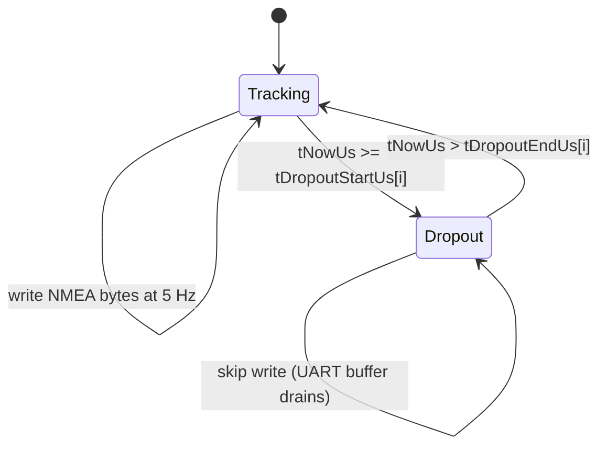

# sim_sensors — L2 Design (Trick Sensor Models)

**Document type:** IEEE 1016 Software Design Description
**Module:** `sim_sensors` (Trick simulation sensor models)
**Authoritative references:** `docs/design/conventions.md`, `docs/design/system/system_design.md` §10.
**Requirement coverage:** `SW-REQ-SIM-SENS-001` through `SW-REQ-SIM-SENS-014`.

---

<!-- @{"design": ["SW-REQ-SIM-SENS-001", "SW-REQ-SIM-SENS-013"]} -->
## 1. Purpose and Scope

`sim_sensors` is the Trick-side **synthetic sensor models** module. It consumes the truth-state vector published by `sim_dynamics` (`SIM_DYN_TRUTH_T`) at the dynamics tick rate and produces sensor-shaped outputs at each sensor's native rate (IMU 200 Hz, baro 20 Hz, GPS 5 Hz). Outputs match the exact ingestion contract of each FSW POSIX driver: `SIM_SENSORS_RAW_T` for `imu_lib::posix`, `SIM_BARO_REGS_T` (MPL3115A2 register image) for `baro_lib::posix` via a `BARO_LIB_BUS_T` shim, and an injected NMEA byte stream into the POSIX `device_lib` UART ring buffer for `gps_lib::posix`. The module addresses `SW-REQ-SIM-SENS-001` through `-014` and supports the system-level Trick integration requirement (`SW-REQ-SYS-045`).

In scope: per-sensor models (IMU, baro, GPS), noise/bias/quantization/saturation, native-rate scheduling, configuration loading from `sim_scenario`, deterministic seeded PRNG, frame/unit equivalence to real hardware.

Out of scope: vehicle dynamics (`sim_dynamics`), scenario timeline (`sim_scenario`), Trick S_define plumbing (`sim_harness`), the FSW POSIX driver impls (separate L2 designs). Sim-only — never compiled into Pico2 flight builds.

---

## 2. Definitions and Abbreviations

Cross-module vocabulary (frames, time base, units, body axes) is defined in `docs/design/conventions.md` §4 and **not** redefined here. Specifically: `SW-REQ-SYS-038` (geodetic position), `SW-REQ-SYS-039` (HAE altitude), `SW-REQ-SYS-040` (NED velocity), `SW-REQ-SYS-041` (body→NED quaternion), `SW-REQ-SYS-042` (SI), `SW-REQ-SYS-057` (body axes X-fwd/Y-right/Z-down), `SW-REQ-SYS-026` (`JUNO_TIME_US_T`).

| Term | Meaning |
|------|---------|
| Truth state | Ideal vehicle state vector from `sim_dynamics` (position, velocity, attitude, body specific force, body angular rate, time) |
| Native rate | Sensor's real-hardware sample cadence (IMU 200 Hz, baro 20 Hz, GPS 5 Hz) |
| Dynamics tick rate | Trick integrator step rate (≥ 200 Hz, typically 1 kHz; multiple of the highest native rate) |
| ISA | International Standard Atmosphere (1976) |
| HDOP / VDOP | Horizontal / Vertical Dilution of Precision (GPS quality figures) |
| PRNG | Pseudo-random number generator (seeded for reproducibility) |
| Sim-only | Compiled only under `PLATFORM=POSIX` Trick SITL build; never linked into Pico2 flight build |

---

<!-- @{"design": ["SW-REQ-SIM-SENS-001", "SW-REQ-SIM-SENS-013", "SW-REQ-SIM-SENS-014"]} -->
## 3. System Overview

### 3.1 Role in the Trick pipeline

`sim_sensors` sits between `sim_dynamics` (truth-state producer) and the FSW POSIX driver impls (truth-state consumers). It is **not** a `juno::*` LibJuno module — it is sim-only Trick-idiomatic C++ (per `conventions.md` §1, sim modules may use Trick C++ patterns and STL internally, but their **output structs** must be POD aggregates matching the FSW driver expected types).

```mermaid
flowchart LR
    subgraph Sim[sim host process]
      DYN[sim_dynamics<br/>SIM_DYN_TRUTH_T] -->|every dyn tick| SS[sim_sensors]
      SCEN[sim_scenario<br/>SIM_SCEN_CFG_T] -->|at init| SS
      SS -->|@200Hz| IMU_OUT[SIM_SENSORS_RAW_T]
      SS -->|@20Hz| BARO_OUT[SIM_BARO_REGS_T]
      SS -->|@5Hz NMEA bytes| GPS_OUT[device_lib UART buffer]
    end
    subgraph FSW[FSW POSIX build same process]
      IMU_OUT -.->|imu_lib::posix Sample| IMUL[imu_lib]
      BARO_OUT -.->|BARO_LIB_BUS_T ReadReg| BAROL[baro_lib]
      GPS_OUT -.->|device_lib ReadBytes -> gps_lib Poll| GPSL[gps_lib]
    end
```

### 3.2 MVC mapping (sim side)

Truth source = `sim_dynamics`; sensor models (this doc) = `imu_model` / `baro_model` / `gps_model`; output sinks = driver-facing POD structs + UART byte stream; configuration = `sim_scenario` (`SIM_SCEN_CFG_T` at init). No LibJuno `*_ROOT_T` / `*_API_T` pattern here — `sim_sensors` is a Trick C++ class hierarchy whose output side respects FSW driver struct contracts.

### 3.3 Module composition

```mermaid
flowchart TD
    A[SimSensors class] --> B[ImuModel]
    A --> C[BaroModel]
    A --> D[GpsModel]
    A --> E[Prng prng]
    B --> E
    C --> E
    D --> E
    F[SIM_SCEN_CFG_T] -->|Init()| A
    G[SIM_DYN_TRUTH_T] -->|Step(t,truth)| A
    A --> H[SIM_SENSORS_RAW_T<br/>SIM_BARO_REGS_T<br/>NMEA bytes -> UART]
```

---

<!-- @{"design": ["SW-REQ-SIM-SENS-001", "SW-REQ-SIM-SENS-002", "SW-REQ-SIM-SENS-003", "SW-REQ-SIM-SENS-004", "SW-REQ-SIM-SENS-005", "SW-REQ-SIM-SENS-006", "SW-REQ-SIM-SENS-007", "SW-REQ-SIM-SENS-008", "SW-REQ-SIM-SENS-009", "SW-REQ-SIM-SENS-010", "SW-REQ-SIM-SENS-011", "SW-REQ-SIM-SENS-012", "SW-REQ-SIM-SENS-013", "SW-REQ-SIM-SENS-014"]} -->
## 4. Interface Definitions

### 4.1 Input: truth state (consumed)

`SIM_DYN_TRUTH_T` is owned by `sim_dynamics` (separate L2). Field names below match sim_dynamics' canonical struct verbatim:

| Field | Type | Frame / units | Used by |
|-------|------|---------------|---------|
| `dSimTimeS` | `double` | seconds since sim start | all (converted to µs locally) |
| `dLatDeg` | `double` | WGS-84 deg | gps_model |
| `dLonDeg` | `double` | WGS-84 deg | gps_model |
| `dAltHaeM` | `double` | m above WGS-84 ellipsoid | gps_model, baro_model |
| `tVelNedMps[3]` | `double[3]` | m/s, NED | gps_model |
| `tQuatB2n[4]` | `double[4]` | unit quaternion w,x,y,z | (passthrough; not used by sensors directly) |
| `tSpecificForceBodyMps2[3]` | `double[3]` | m/s², body X-fwd/Y-right/Z-down (includes gravity reaction) | imu_model |
| `tOmegaBodyRadPerS[3]` | `double[3]` | rad/s, body | imu_model |
| `dMassKg` | `double` | kg | (informational; not used by sensors) |
| `ePhase` | `juno::afm::JUNO_PHASE_T` | enum | (informational) |

`SIM_DYN_TRUTH_T` does **not** carry an OAT field; baro temperature is derived from the ISA model at altitude (see §4.5 baro_model pipeline). `sim_sensors` converts `dSimTimeS` to a `JUNO_TIME_US_T` (`tNowUs = static_cast<JUNO_TIME_US_T>(dSimTimeS * 1e6)`) for its internal rate-gate comparisons and output timestamps.

### 4.2 Output structs (produced — match FSW driver expectations)

Each output struct is a POD aggregate (no constructors), zero-init safe, layout-stable so the FSW POSIX driver impl can copy/cast it directly. Field names use FSW conventions (Hungarian + frame/unit suffix per `conventions.md` §3). **Cross-module ownership (Option D):** `SIM_SENSORS_RAW_T` and `SIM_BARO_REGS_T` are declared in `sim_sensors`'s own public headers (`sim/sim_sensors/include/sim_sensors/sim_sensors_raw.hpp`, `.../sim_baro_regs.hpp`), matching `imu/design.md` §4.4 ("referenced, not authored here"). The POSIX impl `.cpp` files (`libs/imu_lib/src/posix/imu_posix.cpp`, `libs/baro_lib/src/posix/baro_posix.cpp` — `conventions.md` §6 POSIX/Pico2 split) `#include` these sim headers; Pico2 siblings do not. FSW public headers never pull a sim header. Each POSIX impl `.cpp` carries `static_assert`s on `std::is_trivially_copyable`, `std::is_standard_layout`, and `offsetof(...)==0` for the relevant struct, so any silent layout drift breaks the build. **Follow-up RFA (Lead):** worker brief preferred Option C (host these types in `imu_lib`/`baro_lib` public headers); that requires cross-section edits to `imu/design.md` §4.4 and `baro/design.md` §3.2 — out of scope here.

#### `SIM_SENSORS_RAW_T` (IMU output, read by `imu_lib::posix`)

Field names and order match the verbatim shape `imu/design.md` §4.4 references:

```cpp
struct SIM_SENSORS_RAW_T {
    int16_t  i16AccelXYZ[3];   // raw 16-bit counts, body X/Y/Z (SW-REQ-SIM-SENS-005)
    int16_t  i16GyroXYZ[3];    // raw 16-bit counts, body X/Y/Z
    int16_t  i16TempRaw;       // raw 16-bit temperature counts
    uint8_t  u8WhoAmI;         // device ID = 0x68 when present
    bool     bIoOk;            // true if the synthetic bus read succeeded
    bool     bSelfTestPass;    // true when self-test simulation passes
};
```

The driver-facing struct deliberately exposes raw 16-bit counts (no scale field, no timestamp, no seq), because `imu_lib::posix` derives SI conversion from compile-time constants per its §4.5 (`SW-REQ-IMU-004`, `SW-REQ-IMU-005`) and timestamps the sample on read. The sim hands the driver the same raw shape so the driver code path is exercised identically (`SW-REQ-SIM-SENS-005`, `SW-REQ-SYS-045`). `u8WhoAmI=0x68` simulates a present, healthy MPU-class device; setting `u8WhoAmI=0x00` and/or `bIoOk=false` simulates a bus fault. Body axes per `SW-REQ-SYS-057` and `SW-REQ-IMU-007`.

#### `SIM_BARO_REGS_T` (baro output, register-image read by `baro_lib::posix` via its bus shim)

`baro_lib` reads the MPL3115A2 over a `BARO_LIB_BUS_T` callback (I2C-style WriteReg/ReadReg) per `baro/design.md` §3.2. The sim must therefore present a register image, **not** pre-decoded floats:

```cpp
struct SIM_BARO_REGS_T {
    uint8_t u8Status;       // STATUS register (0x00) — bit0 PDR, bit1 TDR, bit2 PTDR
    uint8_t u8OutPMsb;      // OUT_P_MSB (0x01)  ┐
    uint8_t u8OutPCsb;      // OUT_P_CSB (0x02)  ├ Q18.2 fixed-point pressure (Pa)
    uint8_t u8OutPLsb;      // OUT_P_LSB (0x03)  ┘
    uint8_t u8OutTMsb;      // OUT_T_MSB (0x04)  ┐
    uint8_t u8OutTLsb;      // OUT_T_LSB (0x05)  ┘ Q12.4 fixed-point temp (°C)
    uint8_t u8WhoAmI;       // WHO_AM_I (0x0C) = 0xC4 for MPL3115A2
    bool    bIoOk;          // sim-side flag: bus reads succeed when true
};
```

`baro_model::Step` now: (1) computes ISA pressure from truth altitude, (2) adds bias + noise, (3) **encodes** pressure into Q18.2 across `u8OutPMsb/Csb/Lsb` (`raw20 = round(pressure_Pa * 4)` clamped to 20-bit unsigned, then split: MSB=raw20[19:12], CSB=raw20[11:4], LSB=raw20[3:0]<<4), (4) computes ISA temp at altitude, encodes Q12.4 into `u8OutTMsb/Lsb` (`raw16 = round(temp_C * 16)` two's-complement 16-bit). `u8Status` PTDR/PDR/TDR bits are set on a fresh 20 Hz tick and cleared after a simulated read of the data registers, mirroring real-device behavior so `baro_lib::posix` exercises its data-ready polling path.

The baro POSIX driver decodes the register image into Pa/°C and derives altitude from pressure (`SW-REQ-BARO-002`, `-003`, `-004`); the sim does **not** pre-compute altitude or expose pre-decoded floats, preserving full driver-code-path equivalence with the hardware build.

#### GPS output: byte-level UART injection (no struct)

`gps_lib` reads bytes via `juno::device::DEVICE_LIB_ROOT_T<N>*` (UART abstraction). The sim therefore does **not** publish a sentence-granular struct; instead `gps_model::Step` formats valid NMEA GGA + RMC sentences and writes the raw bytes into the **POSIX device_lib transport ring buffer** that backs the `gps_lib::posix` UART instance. `gps_lib::Poll()` drains exactly that buffer via `device_lib::ReadBytes` — identical code path to flight (`SW-REQ-GPS-001`, `SW-REQ-GPS-002`).

```cpp
// Internal sim_sensors → openpty master-fd binding (set by sim_harness):
namespace sim_sensors {
struct GPS_UART_SINK_T {
    // Composition root provides this; gps_model writes to it.
    // sim_harness installs a sink whose body is `::write(_iGpsPtyMasterFd, pcBuf, zLen)`
    // against the openpty master fd that gps_lib::posix consumes via the slave fd
    // (per device/design.md §11.1 and sim_harness/design.md §10.2 / interfaces.md §4.4.1).
    void (*pfnWrite)(const uint8_t* pu8Bytes, size_t zLen, void* pvCtx);
    void* pvCtx;
};
} // namespace sim_sensors
```

`gps_model` formats valid GGA + RMC sentences with WGS-84 lat/lon and HAE altitude (`SW-REQ-GPS-010`), leaving NMEA parsing to `nmea_lib` exactly as in flight. Sentence content includes HDOP, fix quality, and satellite count fields per `SW-REQ-SIM-SENS-011`. During a configured GPS dropout window (`SW-REQ-SIM-SENS-012`) the sim simply does not write bytes — the POSIX UART buffer drains and `gps_lib::Poll()` returns no fresh fix, exercising the same starved-UART path as a real-hardware no-fix.

### 4.3 Configuration: `SIM_SCEN_CFG_T` slice (consumed at init)

`sim_scenario` owns the run config — `SIM_SCENARIO_T` is a flat POD per `sim_scenario/design.md` §4.3 with no nested `cfg` substructures. `sim_sensors` consumes a transcoded `SIM_SENSOR_CFG_T` populated by `sim_harness` from flat `SIM_SCENARIO_T` fields per `sim_harness/interfaces.md` §4.3 step 1.4 (`SW-REQ-SIM-SENS-014`):

```cpp
struct SIM_SENSOR_CFG_T {
    uint64_t u64Seed;                // PRNG seed (deterministic runs)
    // IMU
    float    fImuAccelNoiseSigmaMps2;     // per-axis 1-sigma white noise
    float    fImuGyroNoiseSigmaRps;
    float    fImuAccelBiasMps2[3];        // per-axis static bias
    float    fImuGyroBiasRps[3];
    float    fImuAccelBiasDriftMps2PerS;  // bias random-walk rate (optional)
    float    fImuGyroBiasDriftRpsPerS;
    // Baro
    float    fBaroNoiseSigmaPa;
    float    fBaroBiasPa;
    float    fBaroTempNoiseSigmaC;
    // GPS
    float    fGpsHorizSigmaM;             // meters, lat/lon equivalent noise
    float    fGpsVertSigmaM;
    float    fGpsHdop;                    // configured HDOP value emitted in GGA
    float    fGpsVdop;
    uint8_t  u8GpsSatCount;
    uint8_t  u8GpsFixQuality;             // 0=no fix, 1=GPS, 2=DGPS
    uint32_t u32GpsLatencyMs;
    // GPS dropout windows (SW-REQ-SIM-SENS-012)
    uint32_t u32DropoutCount;
    JUNO_TIME_US_T tDropoutStartUs[kMaxDropouts];
    JUNO_TIME_US_T tDropoutEndUs[kMaxDropouts];
};
```

`kMaxDropouts` is a `static constexpr size_t = 8;` in the `sim_sensors` namespace, matching `sim_scenario::kMaxDropouts` (the authoritative pin per `sim_scenario/design.md` §4.3) so no overflow can occur when `sim_harness` transcodes `SIM_SCENARIO_T.tGpsDropoutStartS[]` / `tGpsDropoutEndS[]` into `SIM_SENSOR_CFG_T.tDropoutStartUs[]` / `tDropoutEndUs[]`. The POSIX implementation `static_assert(kMaxDropouts == sim_scenario::kMaxDropouts, "dropout cap mismatch — pin in sim_scenario")` enforces the cross-module contract at compile time.

### 4.4 Module API (sim-internal)

```cpp
namespace sim_sensors {

class SimSensors {
public:
    // Init: capture config, seed PRNG, zero outputs. Returns false on bad cfg.
    bool Init(const SIM_SENSOR_CFG_T& tCfg) noexcept;

    // Step: called every dynamics tick. Internally rate-divides to each sub-model.
    void Step(JUNO_TIME_US_T tNowUs, const SIM_DYN_TRUTH_T& tTruth) noexcept;

    // Const accessors for Trick variable server / driver binding.
    const SIM_SENSORS_RAW_T& ImuRaw()  const noexcept { return _tImuRaw;  }
    const SIM_BARO_REGS_T&   BaroRegs() const noexcept { return _tBaroRegs; }
    // GPS has no struct accessor — bytes are pushed into device_lib UART.

    // GPS UART sink set by composition root (sim_harness).
    void SetGpsUartSink(const GPS_UART_SINK_T& tSink) noexcept { _tGpsSink = tSink; }

private:
    ImuModel          _tImu;
    BaroModel         _tBaro;
    GpsModel          _tGps;
    Prng              _tPrng;             // seeded PRNG; std::mt19937_64 acceptable
    SIM_SENSORS_RAW_T _tImuRaw{};
    SIM_BARO_REGS_T   _tBaroRegs{};
    GPS_UART_SINK_T   _tGpsSink{};
    SIM_SENSOR_CFG_T  _tCfg{};
};

} // namespace sim_sensors
```

Trick S_define binds `sim_sensors.ImuRaw()` / `BaroRegs()` to driver-facing structures, and `sim_harness` provides the GPS UART sink callback that funnels NMEA bytes into `device_lib::posix` (`SW-REQ-SYS-045`). Trick variable names follow `juno_sim.sensors.{imu_raw,baro_regs}.*`.

### 4.5 Per-sensor sub-model contracts

#### `imu_model::Step` (SW-REQ-SIM-SENS-002, -003, -004, -005, -006, -013)

| Attribute | Value |
|-----------|-------|
| Inputs | `tTruth.tSpecificForceBodyMps2[3]`, `tTruth.tOmegaBodyRadPerS[3]`, `tNowUs` |
| Output | `SIM_SENSORS_RAW_T` written iff `(tNowUs - _tLastImuUs) >= 5000 µs`; sets `u8WhoAmI=0x68`, `bIoOk=true`, `bSelfTestPass=true` on healthy path |
| Pipeline | (1) cast double→float, (2) add bias (static + drift), (3) add per-axis Gaussian noise σ from cfg, (4) saturate at ±16 G accel / ±2000 dps gyro, (5) quantize to int16 across the saturated range; `i16TempRaw` derived from ISA-temp-at-altitude with optional noise |
| Frame | body X-fwd/Y-right/Z-down (`SW-REQ-SYS-057`, `SW-REQ-IMU-007`) — truth body frame passes through unchanged |
| Determinism | reproducible given identical seed + identical truth stream (`SW-REQ-SIM-SENS-014`) |

#### `baro_model::Step` (SW-REQ-SIM-SENS-007, -008, -009)

| Attribute | Value |
|-----------|-------|
| Inputs | `tTruth.dAltHaeM`, `tNowUs` (no truth OAT — derived from ISA) |
| Output | `SIM_BARO_REGS_T` written iff `(tNowUs - _tLastBaroUs) >= 50000 µs`; sets `u8WhoAmI=0xC4`, `bIoOk=true`, `u8Status` PTDR/PDR/TDR bits asserted on fresh data |
| Atmosphere | ISA 1976 troposphere: `P = P0 * (1 - L*h/T0)^(g*M/(R*L))`, `T = T0 - L*h` with `P0=101325 Pa`, `T0=288.15 K`, `L=0.0065 K/m` |
| Pipeline | (1) compute ISA pressure & temp from `dAltHaeM`, (2) add bias, (3) add Gaussian noise σ_Pa and σ_C, (4) clamp to valid sensor range, (5) encode pressure to Q18.2 across `u8OutP{Msb,Csb,Lsb}`, encode temp to Q12.4 across `u8OutT{Msb,Lsb}` |
| Units | Pascals, °C (`SW-REQ-BARO-002`, `SW-REQ-BARO-003`, `SW-REQ-SYS-042`) |

#### `gps_model::Step` (SW-REQ-SIM-SENS-010, -011, -012)

| Attribute | Value |
|-----------|-------|
| Inputs | `tTruth.dLatDeg`, `tTruth.dLonDeg`, `tTruth.dAltHaeM`, `tTruth.tVelNedMps[3]`, `tNowUs` |
| Output | NMEA bytes pushed into `_tGpsSink.pfnWrite` iff `(tNowUs - _tLastGpsUs) >= 200000 µs` AND not in a dropout window |
| Pipeline | (1) check dropout windows — if active, write nothing, (2) add horizontal noise (lat/lon perturbed by σ_m / WGS-84 meters-per-deg), (3) add vertical noise (alt by σ_v_m), (4) apply latency by reading truth at `tNowUs - latency`, (5) format GGA + RMC sentences with HDOP, fix quality, sat count from cfg, (6) call `pfnWrite` with full sentence bytes (incl. CRLF) |
| Frame | WGS-84 geodetic + HAE (`SW-REQ-SYS-038`, `-039`, `SW-REQ-GPS-010`) — never ECEF |
| Velocity | NED (`SW-REQ-SYS-040`); RMC sentence encodes ground speed + course over ground from horizontal NED components |

---

<!-- @{"design": ["SW-REQ-SIM-SENS-012"]} -->
## 5. State Machines

`sim_sensors` is mostly stateless given seeded PRNG state. The only state machine of note is the **per-sensor publish gate** (rate-divider from dynamics tick to native rate), and the **GPS dropout window** state.

### 5.1 GPS dropout state machine



Dropout windows are configured at init and are time-driven; the model evaluates whether `tNowUs` falls inside any of the up-to-`kMaxDropouts` windows on every Step.

### 5.2 Per-sensor rate divider

For each sensor, maintain `_tLastSensorUs`. On `Step(tNowUs, ...)`:

```
if (tNowUs - _tLastSensorUs) >= kSensorPeriodUs:
    run sub-model pipeline, refresh output (struct or UART bytes), _tLastSensorUs = tNowUs
else:
    leave previous register/struct image in place; UART side simply does not push new bytes
```

`kSensorPeriodUs`: IMU 5000, baro 50000, GPS 200000 (`SW-REQ-SIM-SENS-002`, `-007`, `-010`).

---

<!-- @{"design": ["SW-REQ-SIM-SENS-001", "SW-REQ-SIM-SENS-013"]} -->
## 6. Data Flow

```
sim_dynamics --SIM_DYN_TRUTH_T (every dyn tick)--> sim_sensors
sim_scenario --SIM_SENSOR_CFG_T (once at init) ---> sim_sensors

sim_sensors writes (in-process):
  -> SIM_SENSORS_RAW_T  @200 Hz   (struct, read directly by imu_lib::posix)
  -> SIM_BARO_REGS_T    @20 Hz    (register image, read via BARO_LIB_BUS_T shim)
  -> NMEA bytes         @5 Hz     (pushed into device_lib::posix UART buffer)

FSW POSIX drivers ingest:
  imu_lib::posix::Sample()       reads SIM_SENSORS_RAW_T (counts -> SI in driver)
  baro_lib::posix (BARO_LIB_BUS_T) ReadReg() reads SIM_BARO_REGS_T bytes; driver decodes Q18.2/Q12.4 -> Pa/°C and derives alt
  gps_lib::Poll() (via device_lib::ReadBytes) consumes NMEA bytes -> nmea_lib
```

### 6.1 POSIX driver handoff binding

The handoff is **shared in-process state**, not a bus message. `sim_sensors`, the FSW POSIX driver impls, and `device_lib::posix` are all compiled into the same Trick binary (`SW-REQ-SYS-045`). `sim_harness` wires three distinct bindings:

**IMU** — composition root passes `&simSensors.ImuRaw()` to `imu_lib::posix::New()`. Each `imu_lib::Sample()` copies/decodes from this struct into its publish buffer.

**Baro** — composition root provides a `BARO_LIB_BUS_T` callback shim to `baro_lib::posix::New()`. The shim implements `WriteReg(reg, val)` (no-op or trivial side effect for control regs) and `ReadReg(reg, pBuf, len)` by mapping `reg ∈ {0x00..0x0C}` onto fields of `simSensors.BaroRegs()`:
- `0x00` → `u8Status`
- `0x01..0x03` → `u8OutPMsb / u8OutPCsb / u8OutPLsb`
- `0x04..0x05` → `u8OutTMsb / u8OutTLsb`
- `0x0C` → `u8WhoAmI`
- `bIoOk=false` returns a bus-error status to the driver
This emulates the MPL3115A2 register interface byte-for-byte.

**GPS** — composition root creates an `openpty()` pair (per `device/design.md` §11.1), hands the slave fd to `device_lib::posix::DEVICE_LIB_IMPL_T<N>::New()` (which `gps_lib::posix` then reads from), retains the master fd on `SIM_HARNESS_T._iGpsPtyMasterFd`, and configures `simSensors.SetGpsUartSink({pfnWrite=&SimHarness::WriteGpsMasterFd, pvCtx=&harness.tImpl})`. `WriteGpsMasterFd`'s body is `::write(_iGpsPtyMasterFd, pcBuf, zLen)`. `gps_model` writes NMEA bytes through this sink; the bytes flow master→slave through the kernel pty, and `gps_lib::Poll()` drains them via `device_lib::ReadBytes` on the slave side. No struct, no parsed fields. Canonical seam per `sim_harness/design.md` §10.2 and `interfaces.md` §4.4.1.

Per `conventions.md` §6, Trick uses POSIX impls of the FSW driver libs — these three bindings are the canonical wiring.

### 6.2 Buffer ownership

| Buffer | Owner | Allocation |
|--------|-------|------------|
| `_tImuRaw` (SIM_SENSORS_RAW_T) | `SimSensors` member | static (within instance) |
| `_tBaroRegs` (SIM_BARO_REGS_T) | `SimSensors` member | static (within instance) |
| `SimSensors` instance | `sim_harness` composition root | static / stack — caller-owned |
| PRNG state | `SimSensors` member | static, deterministic given seed |
| Dropout window arrays | `SIM_SENSOR_CFG_T` member | fixed-size `[kMaxDropouts]` |
| GPS UART ring buffer | `device_lib::posix` instance | owned by device_lib, not sim_sensors |
| NMEA sentence scratch | `gps_model` stack-local in `Step()` | stack — fixed `[kMaxNmeaLen]` |

Subscribers (FSW POSIX drivers) read on the same Trick scheduler thread; no concurrent reader/writer races.

---

<!-- @{"design": ["SW-REQ-SIM-SENS-002", "SW-REQ-SIM-SENS-007", "SW-REQ-SIM-SENS-010", "SW-REQ-SIM-SENS-012"]} -->
## 7. Sequence Diagrams

### 7.1 Nominal cycle — dynamics tick fans out to native-rate publishes

```mermaid
sequenceDiagram
    participant Trick as Trick scheduler
    participant Dyn as sim_dynamics
    participant Sens as sim_sensors
    participant ImuD as imu_lib::posix
    participant ImuApp as imu_app
    participant Bus as broker

    Trick->>Dyn: Integrate(dt)
    Dyn-->>Sens: SIM_DYN_TRUTH_T (every dyn tick, e.g. 1 kHz)
    Trick->>Sens: Step(tNowUs, truth)
    Note over Sens: imu rate-gate: 1 kHz dyn / 200 Hz IMU = every 5th tick
    Sens->>Sens: ImuModel.Step -> refresh _tImuRaw (SIM_SENSORS_RAW_T)
    Note over Sens: baro every 50 ms (refresh _tBaroRegs); gps every 200 ms (push NMEA bytes)
    Trick->>ImuApp: Execute() (TDM 5 ms)
    ImuApp->>ImuD: Sample()
    ImuD-->>ImuApp: RESULT_T<IMU_SAMPLE_T>{SUCCESS, raw->SI converted}
    ImuApp->>Bus: Publish(JUNO_MSG_IMU_SAMPLE_T)
```

### 7.2 GPS dropout window — sim suppresses a fix

```mermaid
sequenceDiagram
    participant Trick
    participant Sens as sim_sensors (gps_model)
    participant GpsD as gps_lib::posix
    participant GpsApp as gps_app

    Trick->>Sens: Step(tNowUs in dropout window)
    Note over Sens: dropout active -> do not push NMEA bytes;<br/>device_lib UART buffer drains
    Trick->>GpsApp: Execute() (TDM 200 ms)
    GpsApp->>GpsD: Poll()
    GpsD-->>GpsApp: RESULT_T{DNE, no fresh sentence}
    Note over GpsApp: SW-REQ-SYS-058: gps unhealthy bit set;<br/>nav continues with degraded inputs (SW-REQ-SYS-034/-059)
```

### 7.3 IMU saturation — boost-phase clipping at ±16 G

```mermaid
sequenceDiagram
    participant Dyn as sim_dynamics
    participant Sens as imu_model
    participant ImuD as imu_lib::posix

    Dyn-->>Sens: tSpecificForceBodyMps2 = (180.0, 0, -9.8) (~18 G axial)
    Note over Sens: pipeline: + bias + noise<br/>then saturate to +16 G = 156.9 m/s²<br/>then quantize to int16 over [-16G,+16G]
    Sens->>Sens: _tImuRaw.i16AccelXYZ[0] = INT16_MAX (or near it)
    ImuD-->>ImuD: Sample() reads i16AccelXYZ and applies compile-time LSB scale
    Note over ImuD: driver returns saturated SI value;<br/>matches real hardware behavior (SW-REQ-IMU-002)
```

---

<!-- @{"design": ["SW-REQ-SIM-SENS-002", "SW-REQ-SIM-SENS-007", "SW-REQ-SIM-SENS-010"]} -->
## 8. Timing and Scheduling Analysis

`sim_sensors` is **not** a TDM-scheduled FSW app. It runs inside the Trick scheduler at the dynamics integrator tick rate, which `sim_harness` configures to be a common multiple of all native sensor rates. The smallest required tick rate is 200 Hz (IMU). `sim_harness` typically runs the integrator at 1 kHz to over-resolve dynamics.

### 8.1 Rate matching

| Sensor | Native rate | Period (µs) | Dyn-tick divisor at 1 kHz |
|--------|-------------|-------------|---------------------------|
| IMU | 200 Hz | 5 000 | every 5th tick |
| Baro | 20 Hz | 50 000 | every 50th tick |
| GPS | 5 Hz | 200 000 | every 200th tick |

The rate divider is implemented inside each sub-model using `_tLastSensorUs` comparison, **not** by clever modulo arithmetic on tick index — this preserves correctness even if the integrator uses variable step or runs at a non-1-kHz rate (`SW-REQ-SIM-SENS-002`, `-007`, `-010`).

### 8.2 Per-Step compute budget

Per dynamics tick worst case: 3 sub-model rate-checks (ns); IMU pipeline (~few hundred ns); baro pipeline ~1 µs (one `pow()`); GPS pipeline ~few µs (sprintf). Total ≤ 10 µs/tick — far below the 1 ms budget.

### 8.3 Downstream consumers

| Consumer | Rate | Period |
|----------|------|--------|
| `imu_app` (via `imu_lib::posix`) | 200 Hz | `kImuAppPeriodMs = 5` |
| `baro_app` (via `baro_lib::posix`) | 20 Hz | `kBaroAppPeriodMs = 50` |
| `gps_app` (via `gps_lib::posix`) | 5 Hz | `kGpsAppPeriodMs = 200` |

`sim_sensors` produces output at exactly the rate at which the FSW driver expects to read; no buffering of multiple samples is required — each driver `Sample()` returns the most-recent output, and the rate-gate guarantees a fresh sample is available every TDM tick.

---

## 9. Error Handling Strategy

`sim_sensors` is sim-only and runs in the same hosted POSIX process as the FSW build; freestanding constraints do **not** apply. However, error semantics still adhere to the FSW driver contracts so the FSW POSIX drivers behave identically to flight:

1. **No exceptions from sim into FSW.** All sim public functions are `noexcept`. The sim never throws.
2. **Configuration errors** (bad σ, malformed dropout windows, seed=0 reserved-as-invalid if the chosen PRNG disallows it) cause `Init()` to return `false`; `sim_harness` aborts the run before scheduling starts.
3. **Truth-state NaN/Inf protection.** `Step()` checks for non-finite inputs from `sim_dynamics`; on detection, the IMU sub-model sets `_tImuRaw.bIoOk=false`, the baro shim returns a bus-error status, and the GPS sub-model writes no bytes — mirroring real-hardware read failures so FSW drivers exercise `SW-REQ-IMU-010`, `SW-REQ-BARO-007`, `SW-REQ-GPS-007`.
4. **GPS dropout** is **not an error** — it's the configured behavior of `SW-REQ-SIM-SENS-012`. The sim simply does not write NMEA bytes during the window; `gps_lib::Poll()` finds no fresh sentence and returns `RESULT_T{JUNO_STATUS_DNE_ERROR, ...}` exactly as on real-hardware no-fix; this exercises the `gps_app` health-bit path (`SW-REQ-SYS-058`).
5. **No FSW-style failure handler.** `sim_sensors` uses Trick logging (e.g., `message_publish`) for diagnostic output, since this module is never compiled into the flight build.
6. **Determinism.** Identical config + seed + identical truth stream produce identical sensor outputs (`SW-REQ-SIM-SENS-014` implies; explicit determinism is required for repeatable Trick regression). The PRNG is the single source of stochasticity and is seeded from `tCfg.u64Seed`.

---

<!-- @{"design": ["SW-REQ-SIM-SENS-014"]} -->
## 10. Memory Ownership

**Heap policy clarification.** The PM brief permits sim-side heap (`sim_dynamics` already uses `std::vector` for its thrust-curve table). `sim_sensors` is *allowed* to use heap-backed STL but **chooses not to**: all of its persistent state (PRNG, bias-drift accumulators, rate-gate timestamps, dropout windows, output structs) is fixed-size and lives inline as `SimSensors` members, so heap allocation provides no benefit. This is a design choice, not a project-wide prohibition.

| Buffer / facility | Owner | Lifetime | Allocation |
|-------------------|-------|----------|------------|
| `SimSensors` instance | `sim_harness` composition root | sim-run lifetime | static or stack (caller-owned) |
| `_tImuRaw` (SIM_SENSORS_RAW_T), `_tBaroRegs` (SIM_BARO_REGS_T) | `SimSensors` POD members | sim-run lifetime | embedded |
| PRNG state (`std::mt19937_64` or equivalent) | `SimSensors` member | sim-run lifetime | embedded |
| Per-axis bias-drift accumulators | `ImuModel` members (`float[3]` static-sized) | sim-run lifetime | embedded |
| Dropout window arrays | `SIM_SENSOR_CFG_T` member, copied at `Init()` | sim-run lifetime | fixed-size `[kMaxDropouts]` |
| GPS NMEA scratch (per-`Step()`) | `gps_model::Step` stack frame | per-call | stack — `[kMaxNmeaLen]` |
| GPS UART ring buffer | `device_lib::posix` instance | sim-run lifetime | owned by device_lib (separate L2) |

The `SimSensors` instance is owned by the composition root; no `new`/`delete`/`malloc` are issued by `sim_sensors` itself.

---

## 11. Traceability

Per-section `<!-- @{"design": [...]} -->` tags above are authoritative; this table is a descriptive consolidation. Every `SW-REQ-SIM-SENS-NNN` is mapped to at least one section.

| Req ID | Title | Section(s) |
|--------|-------|-----------|
| SW-REQ-SIM-SENS-001 | Synthetic Sensor Measurements from Truth State | §1, §3, §4, §6 |
| SW-REQ-SIM-SENS-002 | Synthetic IMU Sample Rate (200 Hz) | §4.5, §5.2, §7.1, §8.1 |
| SW-REQ-SIM-SENS-003 | IMU Accel Saturation ±16 G | §4.5 (imu_model pipeline), §7.3 |
| SW-REQ-SIM-SENS-004 | IMU Gyro Saturation ±2000 dps | §4.5 (imu_model pipeline) |
| SW-REQ-SIM-SENS-005 | IMU 16-bit Quantization | §4.2 (`SIM_SENSORS_RAW_T`), §4.5 |
| SW-REQ-SIM-SENS-006 | Configurable IMU Noise & Bias | §4.3, §4.5 |
| SW-REQ-SIM-SENS-007 | Synthetic Baro Sample Rate (20 Hz) | §4.5, §5.2, §8.1 |
| SW-REQ-SIM-SENS-008 | ISA Atmosphere Pressure & Temp | §4.5 (baro_model) |
| SW-REQ-SIM-SENS-009 | Configurable Baro Noise | §4.3, §4.5 |
| SW-REQ-SIM-SENS-010 | Synthetic GPS Sample Rate (5 Hz) | §4.5, §5.2, §8.1 |
| SW-REQ-SIM-SENS-011 | Configurable GPS Quality & Latency | §4.3, §4.5 |
| SW-REQ-SIM-SENS-012 | Configurable GPS Dropout Windows | §4.3, §5.1, §7.2 |
| SW-REQ-SIM-SENS-013 | Frames & Units Match Real Hardware | §1, §2, §4.2, §4.5 |
| SW-REQ-SIM-SENS-014 | Parameters from sim_scenario | §3.1, §4.3, §4.4, §10 |

**SYS coverage.** `SW-REQ-SYS-043` (POSIX/Pico2 equivalence): `sim_sensors` is POSIX-only and supports equivalence by exercising the same `*_lib::posix` paths host unit tests use. `SW-REQ-SYS-045` (Trick integration): outputs feed `imu_lib::posix`, `baro_lib::posix`, `gps_lib::posix` per §6.1.
