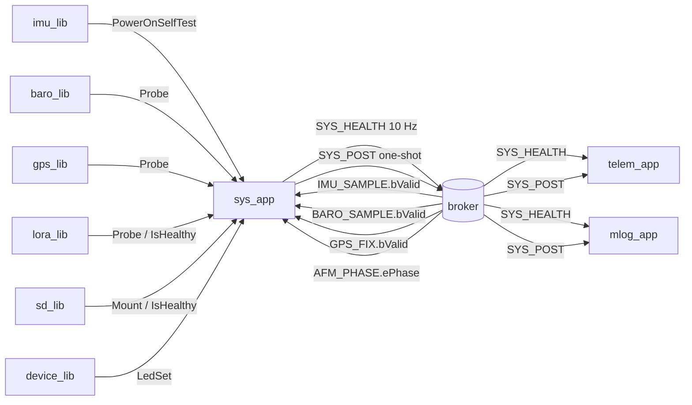
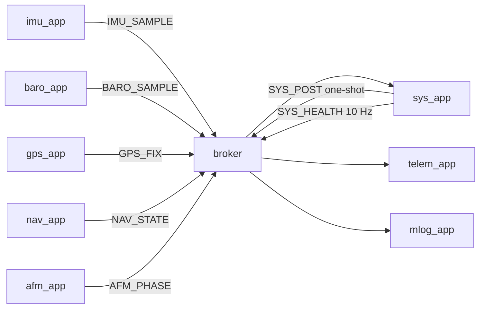
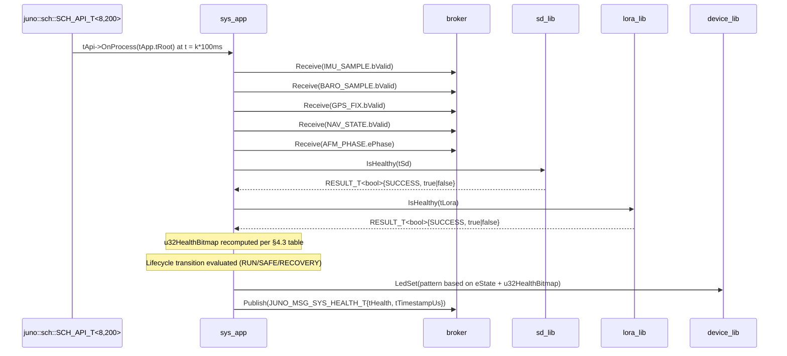

# Juno FSW — sys_app Design (L2)

**Document type:** IEEE 1016 Software Design Description
**Module:** `sys_app` (System Application)
**Authoritative references:** `docs/design/conventions.md`, `docs/design/system/system_design.md`, `libjuno/include/juno/app/app_api.hpp`
**Requirements covered:** `SW-REQ-SYS-APP-001` through `SW-REQ-SYS-APP-012`

---

<!-- @{"design": ["SW-REQ-SYS-APP-001", "SW-REQ-SYS-APP-002", "SW-REQ-SYS-APP-003", "SW-REQ-SYS-APP-004", "SW-REQ-SYS-APP-005", "SW-REQ-SYS-APP-006", "SW-REQ-SYS-APP-007", "SW-REQ-SYS-APP-008", "SW-REQ-SYS-APP-009", "SW-REQ-SYS-APP-010", "SW-REQ-SYS-APP-011", "SW-REQ-SYS-APP-012"]} -->
## 1. Purpose and Scope

`sys_app` owns the FSW lifecycle, the power-on self-test (POST) sequence, the operator status LED, and aggregation of the per-sensor health bitmap published on the software bus. It addresses every requirement in `docs/requirements/sys_app/requirements.json` (`SW-REQ-SYS-APP-001` through `SW-REQ-SYS-APP-012`) and implements the system-level state machine of `docs/design/system/system_design.md` §5 using the canonical `juno::JUNO_FSW_STATE_T` enum (`conventions.md` §4.7).

**In scope:** POST orchestration in `OnStart` (one startup-check per sensor lib, see §2 verb table); per-sensor POST result recording; one-shot `JUNO_MSG_SYS_POST_T` publish; continuous 10 Hz `JUNO_MSG_SYS_HEALTH_T` aggregation/publish from `OnProcess`; status LED drive; lifecycle state ownership (`JUNO_FSW_STATE_POST → _INIT → _RUN → _SAFE → _RECOVERY`); POSIX/Pico2 functional equivalence; `OnExit` no-op (Pico2) / diagnostic close (POSIX) per `SW-REQ-SYS-047`.

**Out of scope:** phase detection (`afm_lib`/`afm_app`); sensor acquisition (per-sensor apps); SD persistence (`mlog_app`); telemetry packetization (`telem_app`); reboot/self-shutdown (forbidden by `SW-REQ-SYS-037`/`-APP-009`); arming logic (`SW-REQ-SYS-APP-010`).

---

## 2. Definitions and Abbreviations

Cross-module vocabulary (time base, NED frame, body axes, status semantics, message naming, **FSW lifecycle state enum**) is defined in `conventions.md` §4 and inherited verbatim. In particular `juno::JUNO_FSW_STATE_T` is consumed verbatim from `conventions.md` §4.7 — no parallel `LIFECYCLE_T` is defined in this module. Module-local terms only:

| Term | Meaning |
|------|---------|
| POST | Power-On Self-Test — one-shot probe of each sensor library at boot |
| Health bitmap | `uint32_t u32HealthBitmap` — one bit per sensor/output device |
| Lifecycle state | The system-level execution mode owned by `sys_app` — values from `juno::JUNO_FSW_STATE_T` (`conventions.md` §4.7) |
| POST verb | The per-lib startup-check entry point (each lib uses its own verb — see table below) |
| Operator LED | Onboard Pico2 status LED driven via `device_lib` GPIO abstraction |
| All-healthy | `u32HealthBitmap == 0` |
| Sensor lib roster | `imu_lib`, `baro_lib`, `gps_lib`, `lora_lib`, `sd_lib` |

**Per-lib POST verb mapping** (PM Decision 6 — each lib exposes its own startup-check verb; no uniform `Probe()` API). All return `JUNO_STATUS_T`.

| Library | POST verb | Notes |
|---------|-----------|-------|
| `imu_lib` | `PowerOnSelfTest()` | IMU built-in self-test |
| `baro_lib` | `Probe()` | I2C WHO_AM_I read |
| `gps_lib` | `Probe()` | UART byte-stream presence check |
| `lora_lib` | `Probe()` | AT-command handshake |
| `sd_lib` | `Mount()` | Mounts volume — the SD POST equivalent |

The `juno::JUNO_FSW_STATE_T` lifecycle enum is **not** the vehicle phase enum. `juno::afm::JUNO_PHASE_T` is observed via `JUNO_MSG_AFM_PHASE_T` to inform the `JUNO_FSW_STATE_RECOVERY` transition only.

---

<!-- @{"design": ["SW-REQ-SYS-APP-005", "SW-REQ-SYS-APP-006", "SW-REQ-SYS-APP-010"]} -->
## 3. System Overview

`sys_app` is an **App (View)** in the MVC layering (`ai/memory/architecture.md`) and is realized as a `juno::app::APP_API_T { OnStart, OnProcess, OnExit }` triple wired into a `juno::app::APP_ROOT_T` (canonical from `libjuno/include/juno/app/app_api.hpp`). It owns no algorithms; the LED bit pattern is a deterministic function of the live health bitmap and lifecycle state. It uses every sensor library only once (during `OnStart` POST) and otherwise consumes published messages from the bus.

### 3.1 MVC mapping

| Layer | Realization |
|-------|-------------|
| View (App) | `juno::sys_app::SYS_APP_T` — this design; single-level `JUNO_MODULE_DERIVE` aggregate whose first member is `juno::app::APP_ROOT_T tRoot` |
| Controller (Lib) | `imu_lib`, `baro_lib`, `gps_lib`, `lora_lib`, `sd_lib`, `device_lib` (LED GPIO), `juno::time::TIME_ROOT_T` |
| Model (Bus) | Subscribes to all sensor health-bearing messages; publishes `JUNO_MSG_SYS_HEALTH_T` and `JUNO_MSG_SYS_POST_T` |

### 3.2 Module-in-context



### 3.3 Header layout

`apps/sys_app/include/sys_app/sys_app.hpp` (LibJuno C++ pattern per `conventions.md` §1, app lifecycle per `conventions.md` §1.4 and `libjuno/include/juno/app/app_api.hpp`):

```cpp
#pragma once
#include "juno/module.h"
#include "juno/module.hpp"
#include "juno/status.h"
#include "juno/app/app_api.hpp"
#include "juno/fsw_state.hpp"           // juno::JUNO_FSW_STATE_T (conventions §4.7)

namespace juno::sys_app
{
static constexpr uint32_t kSysAppPeriodMs = 100;  // 10 Hz, conventions §4.5

// Health/POST bit-mask constants — authoritative table in §4.3.
static constexpr uint32_t kHealthBitImu   = 1u << 0;
static constexpr uint32_t kHealthBitBaro  = 1u << 1;
static constexpr uint32_t kHealthBitGps   = 1u << 2;
static constexpr uint32_t kHealthBitSd    = 1u << 3;
static constexpr uint32_t kHealthBitRadio = 1u << 4;
static constexpr uint32_t kHealthBitNav   = 1u << 5;

struct SYS_APP_T JUNO_MODULE_DERIVE(juno::app::APP_ROOT_T,
    // Lifecycle state (conventions §4.7 — no local enum)
    juno::JUNO_FSW_STATE_T  eState;
    // Cached message snapshots — published from OnStart/OnProcess
    JUNO_MSG_SYS_POST_T     tPostResult;
    JUNO_MSG_SYS_HEALTH_T   tHealth;
    // Subscribed-message scratch (filled in OnProcess from broker latest-value reads)
    JUNO_MSG_IMU_SAMPLE_T   tImuLatest;
    JUNO_MSG_BARO_SAMPLE_T  tBaroLatest;
    JUNO_MSG_GPS_FIX_T      tGpsLatest;
    JUNO_MSG_AFM_PHASE_T    tAfmLatest;
    // DI back-references (injected at SysAppInit; PM Decision 3 — needed for IsHealthy() polling each tick)
    juno::imu::IMU_LIB_ROOT_T*                                                       _ptImu;
    juno::baro::BARO_LIB_ROOT_T*                                                     _ptBaro;
    juno::gps::GPS_LIB_ROOT_T*                                                       _ptGps;
    juno::lora::LORA_LIB_ROOT_T*                                                     _ptLora;
    juno::sd::SD_LIB_ROOT_T<juno::sd::kDefaultWriteBufBlocks>*                        _ptSd;
    juno::device::DEVICE_LIB_ROOT_T<juno::device::kDefaultRingCap>*                   _ptDev;
    juno::sb::BROKER_ROOT_T<JUNO_MSG_BUS_VARIANT_T, /*PipeN=*/8, /*RegCapacity=*/64>* _ptBus;
    juno::time::TIME_ROOT_T*                                                         _ptTime;
);

// Free setup — full signature in §4.1; wires DI refs and APP_API_T vtable into tApp.tRoot.
JUNO_STATUS_T SysAppInit(SYS_APP_T &tApp, /* lib refs, broker, time, handler, userdata */) noexcept;
} // namespace juno::sys_app
```

`SYS_APP_T` is declared via `JUNO_MODULE_DERIVE(juno::app::APP_ROOT_T, ...)` (`libjuno/include/juno/module.h:161`), which embeds `juno::app::APP_ROOT_T tRoot;` as the first member via the `JUNO_MODULE_SUPER` alias (`libjuno/include/juno/module.h:97`). This yields a **single-level** aggregate per `conventions.md` §1.2 and matches the canonical pattern used by every other Juno app (e.g., `IMU_APP_T`, `imu_app/design.md` §3.3). The DI back-references are direct members of `SYS_APP_T` — there is no separate `*_IMPL_T` struct, so each hook recovers the full `SYS_APP_T` from its `APP_ROOT_T&` parameter via a single layout-compatible `static_cast<SYS_APP_T&>(tRoot)` (legal because `tRoot` is the first member of `SYS_APP_T`; standard-layout downcast). The two-level wrapper-plus-derive pattern previously used here is removed because it produced a strict-aliasing UB — the wrapper's embedded `APP_ROOT_T` was not the first member of any `JUNO_MODULE_DERIVE` struct, so reading DI fields beyond it was undefined.

```cpp
namespace juno::sys_app
{
static JUNO_STATUS_T SysApp_OnStart  (juno::app::APP_ROOT_T &tRoot) noexcept;
static JUNO_STATUS_T SysApp_OnProcess(juno::app::APP_ROOT_T &tRoot) noexcept;
static JUNO_STATUS_T SysApp_OnExit   (juno::app::APP_ROOT_T &tRoot) noexcept;

JUNO_STATUS_T SysAppInit(SYS_APP_T &tApp, /* DI refs per §4.1 */) noexcept
{
    tApp._ptImu = &tImu; tApp._ptBaro = &tBaro; tApp._ptGps = &tGps;
    tApp._ptLora = &tLora; tApp._ptSd = &tSd; tApp._ptDev = &tDev;
    tApp._ptBus = &tBus; tApp._ptTime = &tTime;
    tApp.eState = juno::JUNO_FSW_STATE_T::JUNO_FSW_STATE_POST;
    static const juno::app::APP_API_T tApi{
        &SysApp_OnStart, &SysApp_OnProcess, &SysApp_OnExit };
    return juno::app::AppInit(tApp.tRoot, tApi, pfcnFailureHandler, pvUserData);
}
} // namespace juno::sys_app
```

The `APP_API_T` vtable is the **only** file-scope datum (read-only `static` local in `SysAppInit`), wired once and never reassigned. All hooks take `juno::app::APP_ROOT_T&` and are `noexcept` (`conventions.md` §1.2/§1.3); the hook bodies recover the enclosing `SYS_APP_T` via `auto &tApp = static_cast<SYS_APP_T&>(tRoot);` and then access `tApp.eState`, `tApp._ptImu`, etc. directly.

---

<!-- @{"design": ["SW-REQ-SYS-APP-001", "SW-REQ-SYS-APP-002", "SW-REQ-SYS-APP-005", "SW-REQ-SYS-APP-006", "SW-REQ-SYS-APP-007", "SW-REQ-SYS-APP-008", "SW-REQ-SYS-APP-010", "SW-REQ-SYS-APP-011"]} -->
## 4. Interface Definitions

The public surface is the free `SysAppInit` setup function plus the three `juno::app::APP_API_T` hooks dispatched by the scheduler. All hooks are `noexcept`; no constructors/destructors on `SYS_APP_T` (`conventions.md` §1.3).

### 4.1 SysAppInit (free setup function)

| Attribute | Value |
|-----------|-------|
| Signature | `JUNO_STATUS_T SysAppInit(SYS_APP_T &tApp, juno::imu::IMU_LIB_ROOT_T &tImu, juno::baro::BARO_LIB_ROOT_T &tBaro, juno::gps::GPS_LIB_ROOT_T &tGps, juno::lora::LORA_LIB_ROOT_T &tLora, juno::sd::SD_LIB_ROOT_T<juno::sd::kDefaultWriteBufBlocks> &tSd, juno::device::DEVICE_LIB_ROOT_T<juno::device::kDefaultRingCap> &tDev, juno::sb::BROKER_ROOT_T<JUNO_MSG_BUS_VARIANT_T, 8, 64> &tBus, juno::time::TIME_ROOT_T &tTime, JUNO_FAILURE_HANDLER_T pfcnFailureHandler, JUNO_USER_DATA_T *pvUserData) noexcept` |
| Preconditions | All injected `*_ROOT_T` references previously initialized via their `New()` factories. `tApp` is `.bss` zero-initialized. |
| Postconditions | `tApp.tRoot.ptApi` points at the static `APP_API_T{ &SysApp_OnStart, &SysApp_OnProcess, &SysApp_OnExit }`. DI back-refs stored in `SYS_APP_T` (single-level `JUNO_MODULE_DERIVE` per `conventions.md` §1.2). `tApp.eState == JUNO_FSW_STATE_POST`. The POST sequence has **not** yet run — POST runs in `OnStart`. |
| Error conditions | Returns `JUNO_STATUS_NULLPTR_ERROR` only via `juno::app::AppInit` if a vtable function reference is null (cannot occur with the static literal); otherwise `JUNO_STATUS_SUCCESS`. |
| Thread safety | Single-threaded; called once from the composition root before `juno::sch::SCH_API_T<8, 200>::Execute()`. |

`SysAppInit` does **not** wait for any external arm signal (`SW-REQ-SYS-APP-010`).

### 4.2 SysApp_OnProcess (cyclic process hook)

| Attribute | Value |
|-----------|-------|
| Signature | `static JUNO_STATUS_T SysApp_OnProcess(juno::app::APP_ROOT_T &tRoot) noexcept` |
| Dispatched by | `juno::sch::SCH_API_T<8, 200>::Execute()` at every minor frame where `(i × 5 ms) mod 100 ms == 0` (10 Hz, `kSysAppPeriodMs = 100`). |
| Preconditions | `SysApp_OnStart` returned `JUNO_STATUS_SUCCESS`. Bus broker live. |
| Postconditions | Drains subscribed health-bearing messages, recomputes `tHealth.u32HealthBitmap` per the §4.3 bit-assignment table, polls `sd_lib::IsHealthy(tSd)` and `lora_lib::IsHealthy(tLora)`, publishes `JUNO_MSG_SYS_HEALTH_T` (`SW-REQ-SYS-APP-005`/`-006`), drives the operator LED per current `eState` and bitmap (`SW-REQ-SYS-APP-007`/`-008`), evaluates lifecycle transitions among `JUNO_FSW_STATE_{INIT,RUN,SAFE,RECOVERY}` (§5). Never initiates shutdown or reboot (`SW-REQ-SYS-APP-009`/`-011`). |
| Error conditions | Bus publish failure sets the radio/SD health bit via the publisher's own contract — `sys_app` itself does not retry. Returns `JUNO_STATUS_SUCCESS` even when downstream calls report errors (continuation policy, `SW-REQ-SYS-APP-009`). |
| Thread safety | Called only by `juno::sch::SCH_API_T<8, 200>::Execute()` on the 100 ms slot; no re-entrancy. |

The hook body recovers the enclosing `SYS_APP_T` via `auto &tApp = static_cast<SYS_APP_T&>(tRoot);`. This downcast is layout-compatible because `SYS_APP_T` is declared via `JUNO_MODULE_DERIVE(juno::app::APP_ROOT_T, ...)` whose first member is `juno::app::APP_ROOT_T tRoot;` (the `JUNO_MODULE_SUPER` alias, `libjuno/include/juno/module.h:97`). After the cast the hook accesses `tApp.eState`, `tApp.tHealth`, `tApp._ptImu`, `tApp._ptSd`, `tApp._ptLora`, etc. directly with no further indirection. `OnProcess` must complete within `kSysAppPeriodMs = 100 ms` (§8). Doxygen blocks for all three hooks render in `sys_app.cpp`.

### 4.3 Health Bitmap — Authoritative Bit Assignments (closes S1-AI-019 / PDR-RFA-S1-009)

`u32HealthBitmap` (`uint32_t`) is the single canonical health bitmap published in `JUNO_MSG_SYS_HEALTH_T` (`SW-REQ-SYS-031`, `SW-REQ-SYS-APP-006`). Bits set ⇒ the named subsystem is currently unhealthy. Bits cleared ⇒ healthy. The table below is the **authoritative** bit-assignment reference; every per-app L2 design that sets or clears a bit must cite this table.

| Bit | Mask constant | Subsystem | Set by | Set when | Cleared by | Cleared when |
|-----|----------------|-----------|--------|----------|------------|--------------|
| 0 | `kHealthBitImu = 1u<<0` | IMU | `sys_app` (in `Execute`) | latest received `JUNO_MSG_IMU_SAMPLE_T.bValid==false` (`SW-REQ-SYS-058`) | `sys_app` | latest received `JUNO_MSG_IMU_SAMPLE_T.bValid==true` |
| 1 | `kHealthBitBaro = 1u<<1` | Barometer | `sys_app` (in `Execute`) | latest received `JUNO_MSG_BARO_SAMPLE_T.bValid==false` (`SW-REQ-SYS-058`) | `sys_app` | latest received `JUNO_MSG_BARO_SAMPLE_T.bValid==true` |
| 2 | `kHealthBitGps = 1u<<2` | GPS | `sys_app` (in `Execute`) | latest received `JUNO_MSG_GPS_FIX_T.bValid==false` (`SW-REQ-SYS-058`) | `sys_app` | latest received `JUNO_MSG_GPS_FIX_T.bValid==true` |
| 3 | `kHealthBitSd = 1u<<3` | SD card | `sys_app` (in `Execute`) | `sd_lib::IsHealthy(tSd)==false` (`SW-REQ-SYS-060`); `sd_lib` exposes the health channel per its L2 §4 | `sys_app` | `sd_lib::IsHealthy(tSd)==true` (sustained successful writes restore health) |
| 4 | `kHealthBitRadio = 1u<<4` | LoRa radio | `sys_app` (in `Execute`) | `lora_lib::IsHealthy(tLora)==false` (`SW-REQ-SYS-061`); `lora_lib` exposes the health channel per its L2 §4 | `sys_app` | `lora_lib::IsHealthy(tLora)==true` |
| 5 | `kHealthBitNav = 1u<<5` | Nav | `nav_app` (publishes; `sys_app` mirrors) | latest received `JUNO_MSG_NAV_STATE_T.bValid==false` (`SW-REQ-SYS-059`) | `nav_app` / `sys_app` | nav `bValid==true` |
| 6..31 | reserved | — | — | — | — | — |

POST-bit subset for `JUNO_MSG_SYS_POST_T.u32PostBitmap` reuses the same bit positions for sensors only (bits 0..4); bit 5 is unused in POST. Constants live in `sys_app/include/sys_app/sys_app.hpp` as `static constexpr uint32_t k…`.

Reservation policy: bits 6..31 are reserved for future subsystems; new bits MUST be added to this table before any worker references them. Cross-module references in other L2 designs MUST cite the bit number in this table by name (e.g., "set `kHealthBitBaro`"), not a duplicated numeric literal.

### 4.4 SysApp_OnStart (one-shot init hook)

| Attribute | Value |
|-----------|-------|
| Signature | `static JUNO_STATUS_T SysApp_OnStart(juno::app::APP_ROOT_T &tRoot) noexcept` |
| Dispatched by | Composition root (`apps/main.cpp`), invoked once per app after `SysAppInit` returns and before `juno::sch::SCH_API_T<8, 200>::Execute()` enters the cyclic-executive loop (`system_design.md` §8.1 step 6). |
| Preconditions | `SysAppInit` returned `JUNO_STATUS_SUCCESS`; all DI back-refs non-null; `tApp.eState == JUNO_FSW_STATE_POST`. |
| Postconditions | (1) Per-sensor POST verbs (§2 table) called exactly once each; per-sensor pass/fail recorded as bits in `tPostResult.u32PostBitmap`. Probe failure sets the corresponding bit in **both** `tPostResult.u32PostBitmap` and `tHealth.u32HealthBitmap` and continues with the next sensor (`SW-REQ-SYS-APP-001`/`-002`). (2) `JUNO_MSG_SYS_POST_T` published once on the bus with timestamp from `_ptTime->TimestampToMicros(_ptTime->ptApi->Now(*_ptTime).tOk).tOk` (`SW-REQ-SYS-APP-002`/`-003`/`-004`). (3) Broker subscriptions opened for `JUNO_MSG_IMU_SAMPLE_T`, `JUNO_MSG_BARO_SAMPLE_T`, `JUNO_MSG_GPS_FIX_T`, `JUNO_MSG_NAV_STATE_T`, `JUNO_MSG_AFM_PHASE_T`. (4) On exit, `tApp.eState == JUNO_FSW_STATE_INIT`. |
| Error conditions | Returns `JUNO_STATUS_SUCCESS` even when probe failures occur (continuation policy, `SW-REQ-SYS-APP-009`). The diagnostic failure handler is invoked per failure but never alters control flow (`conventions.md` §4.3). |
| Thread safety | Single-threaded; called once during composition root init. |

### 4.5 SysApp_OnExit (graceful teardown hook)

| Attribute | Value |
|-----------|-------|
| Signature | `static JUNO_STATUS_T SysApp_OnExit(juno::app::APP_ROOT_T &tRoot) noexcept` |
| Dispatched by | Composition root on graceful shutdown (POSIX unit tests / Trick teardown only). Pico2 flight build never invokes `OnExit` (`SW-REQ-SYS-047`/`-APP-011`). |
| Preconditions | `SysAppInit` returned `JUNO_STATUS_SUCCESS`. Safe to call after any `OnProcess` cycle. |
| Postconditions | Pico2: **no-op** (returns `JUNO_STATUS_SUCCESS`). POSIX: optionally clears `tPostResult`/`tHealth` for diagnostic purposes; no device handles are owned by `sys_app` itself — `device_lib`/`sd_lib`/etc. own their own. `eState` unchanged. |
| Error conditions | Returns `JUNO_STATUS_SUCCESS`; no failure mode observable. |
| Thread safety | Single-threaded; once at shutdown. |

`OnExit` is a structural placeholder for the canonical `APP_API_T` triple — it never invokes reboot, watchdog-trip, or `_exit` on either platform (`SW-REQ-SYS-APP-009`/`-011`).

---

<!-- @{"design": ["SW-REQ-SYS-APP-007", "SW-REQ-SYS-APP-008", "SW-REQ-SYS-APP-009", "SW-REQ-SYS-APP-010", "SW-REQ-SYS-APP-011"]} -->
## 5. State Machines — System Lifecycle

The `sys_app` lifecycle implements `system_design.md` §5 verbatim using the canonical `juno::JUNO_FSW_STATE_T` enum (`conventions.md` §4.7).

```mermaid
stateDiagram-v2
    [*] --> JUNO_FSW_STATE_POST: power-on (no arm signal, SW-REQ-SYS-APP-010)
    JUNO_FSW_STATE_POST --> JUNO_FSW_STATE_INIT: OnStart probed all sensors; tPostResult populated
    JUNO_FSW_STATE_INIT --> JUNO_FSW_STATE_RUN: scheduler started; LED green if u32HealthBitmap == 0
    JUNO_FSW_STATE_RUN --> JUNO_FSW_STATE_SAFE: any health bit set (sensor/SD/radio/nav fault)
    JUNO_FSW_STATE_SAFE --> JUNO_FSW_STATE_RUN: every health bit cleared by subsequent successful operation
    JUNO_FSW_STATE_RUN --> JUNO_FSW_STATE_RECOVERY: AFM_PHASE.ePhase == JUNO_PHASE_LANDING
    JUNO_FSW_STATE_SAFE --> JUNO_FSW_STATE_RECOVERY: AFM_PHASE.ePhase == JUNO_PHASE_LANDING
    JUNO_FSW_STATE_RECOVERY --> [*]: external power removed (SW-REQ-SYS-APP-011)
```



(Self-loops omitted: nominal/degraded 10 Hz ticks and the recovery 2 Hz beacon, `SW-REQ-SYS-021`/`-048`.)

### 5.1 Entry/exit conditions

| Transition | Entry condition | Exit action (side effects) |
|------------|-----------------|----------------------------|
| `[*] → POST` | `SysAppInit` returns; `OnStart` not yet entered | `eState = JUNO_FSW_STATE_POST`; `tPostResult`/`tHealth` zero-init in `.bss`. |
| `POST → INIT` | All five sensor probes returned at end of `OnStart` | Publish `JUNO_MSG_SYS_POST_T` once. LED off (no scheduler yet). |
| `INIT → RUN` | `SCH_API_T<8,200>::Execute()` reached; first `OnProcess` tick | LED solid green if `u32HealthBitmap == 0`, else error pattern. |
| `RUN → SAFE` | `u32HealthBitmap != 0` observed at start of `OnProcess` | LED error pattern (`SW-REQ-SYS-APP-008`). All scheduled apps continue (`SW-REQ-SYS-062`). |
| `SAFE → RUN` | `u32HealthBitmap == 0` observed at start of `OnProcess` | LED returns to solid green (`SW-REQ-SYS-APP-007`). |
| `{RUN,SAFE} → RECOVERY` | Latest received `JUNO_MSG_AFM_PHASE_T.ePhase == JUNO_PHASE_LANDING` | No app-rate change; LED pattern remains a function of `u32HealthBitmap`. |
| `RECOVERY → [*]` | External power removed (hardware event) | Not software-observable; FSW execution simply ceases (`SW-REQ-SYS-APP-011`). |

(All state names above are shorthand for `JUNO_FSW_STATE_<NAME>`; `conventions.md` §4.7 is authoritative.)

### 5.2 LED bit pattern (canonical)

| Lifecycle state | Health bitmap | LED pattern | Source |
|-----------------|--------------|-------------|--------|
| `JUNO_FSW_STATE_POST` (pre-scheduler) | n/a | Off | No scheduler running |
| `JUNO_FSW_STATE_INIT` | n/a | Off | No requirement covers Init LED (PM clarification 4 — yellow pattern dropped) |
| `JUNO_FSW_STATE_RUN` | `== 0` | Solid green | `SW-REQ-SYS-APP-007`, `SW-REQ-SYS-032` |
| `JUNO_FSW_STATE_RUN` | `!= 0` | Error pattern (solid red, transient) | `SW-REQ-SYS-APP-008`, `SW-REQ-SYS-032` |
| `JUNO_FSW_STATE_SAFE` | any | Blinking red (2 Hz) | `SW-REQ-SYS-APP-008` (error pattern variant) |
| `JUNO_FSW_STATE_RECOVERY` | any | Same as Run/Safe per `u32HealthBitmap` | `SW-REQ-SYS-APP-007`/`-008` continue |

### 5.3 Hard invariants

- `sys_app` **never** invokes any reboot, reset, watchdog-trip, or self-shutdown primitive (`SW-REQ-SYS-APP-009`/`-011`, `SW-REQ-SYS-037`/`-047`); only external power removal terminates execution. `OnExit` is a no-op on Pico2; the cyclic-executive loop never returns. Phase detection is read-only input from `afm_app`; `sys_app` never writes `AFM_PHASE`.

---

<!-- @{"design": ["SW-REQ-SYS-APP-002", "SW-REQ-SYS-APP-003", "SW-REQ-SYS-APP-004", "SW-REQ-SYS-APP-005", "SW-REQ-SYS-APP-006"]} -->
## 6. Data Flow

### 6.1 Subscriptions (sys_app reads from broker)

| Message | Publisher | Consumed for |
|---------|-----------|--------------|
| `JUNO_MSG_IMU_SAMPLE_T` | `imu_app` | `bValid` → IMU health bit |
| `JUNO_MSG_BARO_SAMPLE_T` | `baro_app` | `bValid` → baro health bit |
| `JUNO_MSG_GPS_FIX_T` | `gps_app` | `bValid` → GPS health bit |
| `JUNO_MSG_NAV_STATE_T` | `nav_app` | `bValid` → nav health bit (kHealthBitNav) |
| `JUNO_MSG_AFM_PHASE_T` | `afm_app` | `ePhase` → `JUNO_FSW_STATE_RECOVERY` transition |
| Failure-handler events (in-process) | every lib's `JUNO_FAILURE_HANDLER_T` chain | Diagnostic only — failure context strings forwarded to `log_lib` (do not alter control flow per `conventions.md` §4.3) |

**SD and LoRa health source (PM Decision 3 — canonical mechanism).** `sys_app` holds direct refs to `juno::sd::SD_LIB_ROOT_T<juno::sd::kDefaultWriteBufBlocks>` and `juno::lora::LORA_LIB_ROOT_T` (injected via `SysAppInit`, stored as `_ptSd` / `_ptLora` members of `SYS_APP_T`). Each `OnProcess` tick calls `sd_lib::IsHealthy(tSd)` and `lora_lib::IsHealthy(tLora)` synchronously and populates the SD/LoRa bits of `u32HealthBitmap` from the boolean returns. `IsHealthy()` is non-blocking — it inspects internal status (last I/O outcome) and does not perform device I/O. This is the sole mechanism by which SD/radio faults reach the bitmap (`SW-REQ-SYS-060`, `SW-REQ-SYS-061`).

### 6.2 Publications (sys_app writes to broker)

| Message | Period | Hook | Notes |
|---------|--------|------|-------|
| `JUNO_MSG_SYS_POST_T` | one-shot at end of `OnStart` | `OnStart` | Per-sensor pass/fail bitmap (`SW-REQ-SYS-APP-002`/`-003`/`-004`). Consumed by `mlog_app` (SD persistence, `-003`) and `telem_app` (downlink, `-004`). |
| `JUNO_MSG_SYS_HEALTH_T` | every `kSysAppPeriodMs = 100 ms` (10 Hz) | `OnProcess` | Continuous through mission (`SW-REQ-SYS-APP-006`). Consumed by `telem_app` and `mlog_app`. |

### 6.3 Direction diagram



Buffer ownership (`conventions.md` §5 rule 6): `tPostResult`/`tHealth` are POD members of `SYS_APP_T`, filled in place each cycle; broker copies on `Publish`. `sys_app` never mutates received messages.

---

<!-- @{"design": ["SW-REQ-SYS-APP-001", "SW-REQ-SYS-APP-002", "SW-REQ-SYS-APP-003", "SW-REQ-SYS-APP-004", "SW-REQ-SYS-APP-005", "SW-REQ-SYS-APP-006"]} -->
## 7. Sequence Diagrams

### 7.1 OnStart POST sequence (composition root → sys_app → each sensor lib → bus, one-shot)

```mermaid
sequenceDiagram
    participant Main as composition root
    participant Sys as sys_app
    participant Imu as imu_lib
    participant Baro as baro_lib
    participant Gps as gps_lib
    participant Lora as lora_lib
    participant Sd as sd_lib
    participant Bus as broker

    Main->>Sys: SysAppInit(refs...)
    Note over Sys: eState = JUNO_FSW_STATE_POST; tPostResult={}; tHealth={}
    Main->>Sys: tApi->OnStart(tApp.tRoot)
    Sys->>Imu: PowerOnSelfTest()
    Imu-->>Sys: JUNO_STATUS_SUCCESS
    Note over Sys: tPostResult.u32PostBitmap &= ~kHealthBitImu
    Sys->>Baro: Probe()
    Baro-->>Sys: JUNO_STATUS_READ_ERROR
    Note over Sys: tPostResult.u32PostBitmap |= kHealthBitBaro; tHealth.u32HealthBitmap |= kHealthBitBaro
    Sys->>Gps: Probe()
    Gps-->>Sys: JUNO_STATUS_SUCCESS
    Sys->>Lora: Probe()
    Lora-->>Sys: JUNO_STATUS_SUCCESS
    Sys->>Sd: Mount()
    Sd-->>Sys: JUNO_STATUS_SUCCESS
    Sys->>Bus: Subscribe(IMU/BARO/GPS/NAV/AFM)
    Sys->>Bus: Publish(JUNO_MSG_SYS_POST_T{tPostResult, tTimestampUs})
    Note over Sys: eState = JUNO_FSW_STATE_INIT; return JUNO_STATUS_SUCCESS
    Main->>Main: juno::sch::SCH_API_T<8,200>::Execute()
```

The `OnStart` hook invokes each sensor lib's startup-check verb exactly once per the §2 table (`SW-REQ-SYS-APP-001`), records pass/fail bits in `tPostResult.u32PostBitmap` (`SW-REQ-SYS-APP-002`), publishes `JUNO_MSG_SYS_POST_T` once for SD persistence (`SW-REQ-SYS-APP-003`) and downlink (`SW-REQ-SYS-APP-004`), and never blocks on a probe failure (`SW-REQ-SYS-APP-009`).

### 7.2 OnProcess 10 Hz health aggregation



### 7.3 Sensor failure → RUN → SAFE → RUN path

```mermaid
sequenceDiagram
    participant Sch as juno::sch::SCH_API_T<8,200>
    participant Sys as sys_app
    participant Bus as broker
    participant Dev as device_lib

    Note over Sys: eState = JUNO_FSW_STATE_RUN, u32HealthBitmap = 0, LED solid green
    Sch->>Sys: OnProcess()
    Sys->>Bus: Receive(IMU_SAMPLE{bValid=false})
    Note over Sys: u32HealthBitmap |= kHealthBitImu; eState: RUN -> SAFE
    Sys->>Dev: LedSet(blinking red)
    Sys->>Bus: Publish(SYS_HEALTH{u32HealthBitmap=kHealthBitImu})
    Sch->>Sys: OnProcess() (next 100 ms tick)
    Sys->>Bus: Receive(IMU_SAMPLE{bValid=true})
    Note over Sys: u32HealthBitmap = 0; eState: SAFE -> RUN
    Sys->>Dev: LedSet(solid green)
    Sys->>Bus: Publish(SYS_HEALTH{u32HealthBitmap=0})
```

---

<!-- @{"design": ["SW-REQ-SYS-APP-006", "SW-REQ-SYS-APP-009", "SW-REQ-SYS-APP-011"]} -->
## 8. Timing and Scheduling Analysis

### 8.1 Period and slot

- **TDM period:** `kSysAppPeriodMs = 100` (10 Hz) per `conventions.md` §4.5 / `system_design.md` §3.3.
- **Offset:** dispatched on minor-frame indices where `(i × 5 ms) mod 100 ms == 0` — slot 5 of `SCH_ROOT_T<8,200>::tArrSchTable` (`system_design.md` §8.1).
- **Slot budget:** ≤200 µs per `OnProcess` (drain five subscribed message types, two `IsHealthy()` calls, recompute bitmap, one GPIO write, one publish — constant work). Hyperperiod: 10 `OnProcess` per 1 s; `OnStart` once pre-loop; `OnExit` never on Pico2.

`OnProcess` must complete within its 100 ms slot with margin; loop-free, no allocation, no blocking I/O, no exception unwinding (`SW-REQ-SYS-053`).

### 8.2 Downstream consumers

| Consumer app | Period | Message consumed | Constraint |
|--------------|--------|------------------|-----------|
| `telem_app` | 500 ms | `JUNO_MSG_SYS_HEALTH_T`, `JUNO_MSG_SYS_POST_T` | `sys_app` publishes at 5× the consumer rate; consumer reads latest. |
| `mlog_app` | 5 ms | both messages | Logger oversampled (runs at IMU cadence `kMlogAppPeriodMs = 5` per `SW-REQ-SYS-011` and `conventions.md` §4.5; Workstream B3); deduplicates via `tTimestampUs`. |

### 8.3 OnStart POST timing

POST runs in `OnStart` before `SCH_API_T<8,200>::Execute()` enters the loop. Total POST duration is bounded by the slowest startup-check verb (per §2 table); each sensor lib's L2 design constrains its verb to ≤100 ms. Once all five returns are recorded and `JUNO_MSG_SYS_POST_T` is published, `OnStart` returns and the scheduler runs (`SW-REQ-SYS-APP-010`).

---

<!-- @{"design": ["SW-REQ-SYS-APP-001", "SW-REQ-SYS-APP-002", "SW-REQ-SYS-APP-005", "SW-REQ-SYS-APP-006", "SW-REQ-SYS-APP-007", "SW-REQ-SYS-APP-008", "SW-REQ-SYS-APP-009", "SW-REQ-SYS-APP-011"]} -->
## 9. Error Handling Strategy

`sys_app` follows the system-level error policy (`system_design.md` §9, `conventions.md` §4.3) without exception.

1. **Status propagation.** Every internal call uses `JUNO_ASSERT_SUCCESS` / `JUNO_ASSERT_OK` / `JUNO_ASSERT_SOME` / `JUNO_ASSERT_EXISTS` (no bare `if`-return). Both `OnStart` and `OnProcess` always return `JUNO_STATUS_SUCCESS` to the scheduler — bus or LED errors set the appropriate health bit and continue. `OnExit` always returns `JUNO_STATUS_SUCCESS`.
2. **POST probe failures.** A `JUNO_STATUS_READ_ERROR` / `JUNO_STATUS_WRITE_ERROR` (or any non-`SUCCESS`) from a sensor probe verb in `OnStart` sets the corresponding bit in `tPostResult.u32PostBitmap` and `tHealth.u32HealthBitmap`. Probing of the remaining sensors continues (`SW-REQ-SYS-APP-001`/`-002`).
3. **Health-bit policy.** Each per-sample message's `bValid == false` sets the corresponding bit (`SW-REQ-SYS-058`). The bit clears on the next sample with `bValid == true`, mirroring the system-level "clear on subsequent success" policy (`system_design.md` §5).
4. **Failure handler chain.** `SysAppInit` accepts a `JUNO_FAILURE_HANDLER_T` (defaulted to the chain that logs to `log_lib`). The handler is **diagnostic-only and does not alter control flow** (`conventions.md` §4.3). A probe-time failure in `OnStart` invokes the handler with a context string and the originating `JUNO_STATUS_T`.
5. **No reboot, no shutdown.** `SW-REQ-SYS-APP-009` (no autonomous reboot) and `SW-REQ-SYS-APP-011` (run until external power removed) are structural invariants: the codebase contains no call to a watchdog-trip, `abort`, `exit`, `_exit`, or RP2350 reset primitive. `OnExit` is a no-op on Pico2. Inspection-only verification is sufficient (`SW-REQ-SYS-APP-009.verification_method == Inspection`).
6. **Exceptions banned.** `-fno-exceptions` (`SW-REQ-SYS-053`) — every API function and every hook is `noexcept`; a stray throw would call `std::terminate`.
7. **LED drive errors.** A `device_lib::LedSet` failure sets the device-lib health bit but does not affect lifecycle progression; LED drive is a side effect, not a control input.

---

## 10. Memory Ownership

Per `conventions.md` §5 — caller-owned, zero dynamic allocation, no global mutable state in libraries.

| Buffer / facility | Owner | Lifetime | Allocation |
|-------------------|-------|----------|------------|
| `SYS_APP_T` instance (single-level `JUNO_MODULE_DERIVE` aggregate; first member is `juno::app::APP_ROOT_T tRoot`) | composition root (`apps/main.cpp`) | program lifetime | Static, `.bss` zero-init |
| `tRoot` (`juno::app::APP_ROOT_T`) | first member of `SYS_APP_T` (per `JUNO_MODULE_DERIVE` / `JUNO_MODULE_SUPER`, `libjuno/include/juno/module.h:97,161`) | program lifetime | Static, embedded POD |
| `eState` (`juno::JUNO_FSW_STATE_T`) | `SYS_APP_T` member | program lifetime | Static, embedded POD |
| `tPostResult` (`JUNO_MSG_SYS_POST_T`) | `SYS_APP_T` member | program lifetime | Static, embedded POD |
| `tHealth` (`JUNO_MSG_SYS_HEALTH_T`) | `SYS_APP_T` member | program lifetime | Static, embedded POD |
| Subscribed message scratch (`tImuLatest`, `tBaroLatest`, `tGpsLatest`, `tAfmLatest`) | `SYS_APP_T` members | program lifetime | Static |
| `juno::app::APP_API_T tApi{}` | `SysAppInit` `static const` local — **the only file-scope datum** | program lifetime | Read-only after construction |
| Sensor lib root refs (`_ptImu`, `_ptBaro`, `_ptGps`, `_ptLora`, `_ptSd`) | `SYS_APP_T` members | program lifetime | Pointers stored at `SysAppInit`; PM Decision 3 — needed for `IsHealthy()` polling each tick |
| `_ptDev`, `_ptBus`, `_ptTime` refs | `SYS_APP_T` members | program lifetime | Pointers stored at `SysAppInit` |
| Injected `*_ROOT_T` storage | composition root | program lifetime | Reference, no ownership transfer to `sys_app` |

Asserted invariants: no `new`/`delete`/`malloc`/`calloc`/`realloc`/`free`, no heap-backed STL containers (`SW-REQ-SYS-050`); no constructors/destructors on `SYS_APP_T` (`conventions.md` §1.3); no `virtual`, no `dynamic_cast`, no `typeid`, no `throw`/`try`/`catch` (`SW-REQ-SYS-051`/`-052`/`-053`); no global mutable state.

POSIX vs Pico2: a single `SYS_APP_T` definition is shared across both targets; the only platform-specific code path is the `device_lib` LED GPIO impl. `sys_app` itself is platform-neutral. `OnExit` is a no-op on Pico2 (`SW-REQ-SYS-047`); on POSIX it is a diagnostic close hook with no device handles to release. (`SW-REQ-SYS-APP-012`, `SW-REQ-SYS-043`).

---

## 11. Traceability

Per-section `<!-- @{"design": [...]} -->` tags above are authoritative; this table is descriptive consolidation.

| Req ID | Title | Section(s) |
|--------|-------|-----------|
| SW-REQ-SYS-APP-001 | Execute POST at startup | §1, §4.4, §7.1, §9 |
| SW-REQ-SYS-APP-002 | Record per-sensor POST pass/fail | §1, §4.4, §6.2, §7.1, §9 |
| SW-REQ-SYS-APP-003 | Log POST result to SD | §1, §4.4, §6.2, §7.1 |
| SW-REQ-SYS-APP-004 | Downlink POST result over radio | §1, §4.4, §6.2, §7.1 |
| SW-REQ-SYS-APP-005 | Aggregate sensor health into bitmap | §1, §3, §4.2, §6, §7.2, §9 |
| SW-REQ-SYS-APP-006 | Publish health bitmap on bus | §1, §3, §4.2, §6, §7.2, §8, §9 |
| SW-REQ-SYS-APP-007 | LED solid green when all healthy | §1, §4.2, §5.2, §7.3, §9 |
| SW-REQ-SYS-APP-008 | LED error pattern when unhealthy | §1, §4.2, §5.2, §7.3, §9 |
| SW-REQ-SYS-APP-009 | No autonomous reboot | §1, §4.2, §4.5, §5.3, §9, §10 |
| SW-REQ-SYS-APP-010 | Operational immediately at power-on | §1, §3, §4.1, §4.4, §5, §8.3 |
| SW-REQ-SYS-APP-011 | Run until external power removed | §1, §4.2, §4.5, §5, §9 |
| SW-REQ-SYS-APP-012 | POSIX/Pico2 functional equivalence | §1, §4.5, §10 |

POSIX/Pico2 functional equivalence (`SW-REQ-SYS-043`, `SW-REQ-SYS-APP-012`): `SYS_APP_T`, `SysAppInit`, and the three hooks `SysApp_OnStart`/`SysApp_OnProcess`/`SysApp_OnExit` contain no platform-conditional code; the only platform divergence is the `device_lib` LED impl (POSIX no-op stub vs Pico2 RP2350 GPIO) and the trivial Pico2-`OnExit`-is-no-op vs POSIX-diagnostic-close split (§4.5). Trick SITL exercises `sys_app` through the same `juno::app::APP_ROOT_T` reference the flight build uses (`SW-REQ-SYS-045`).
