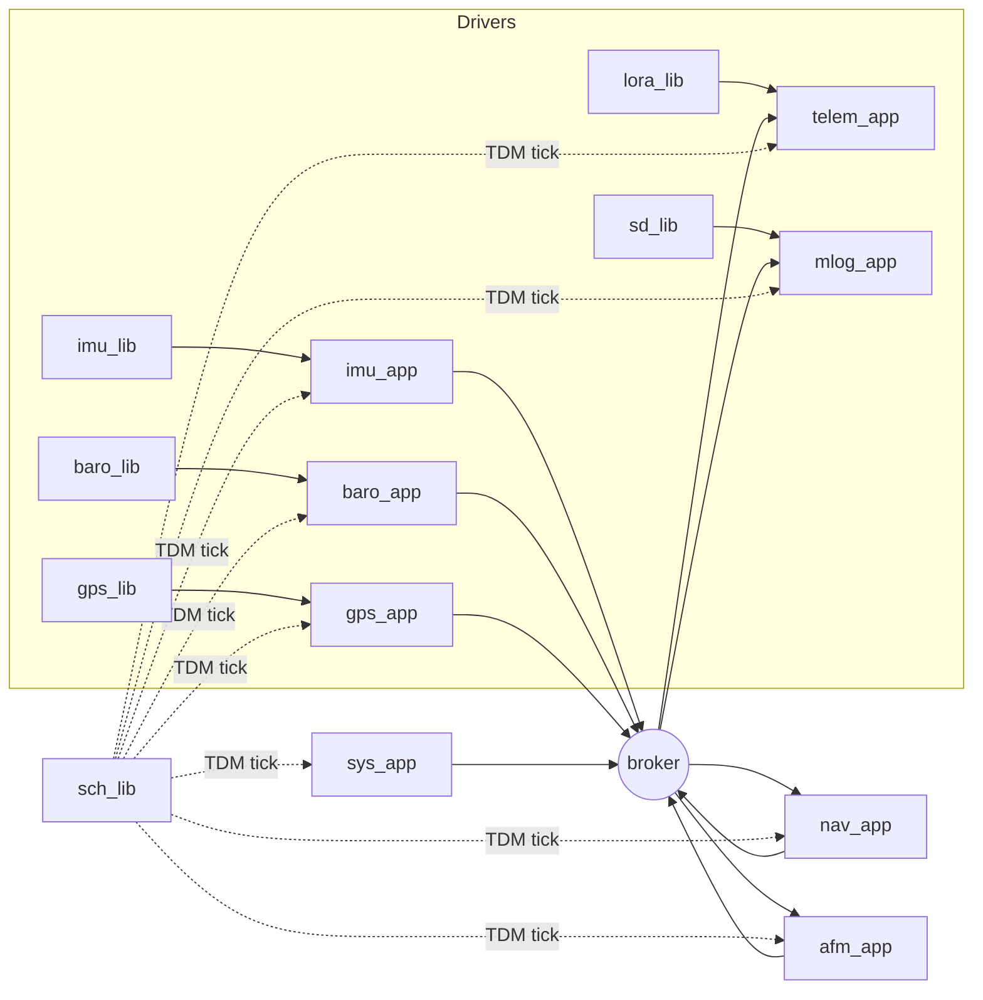
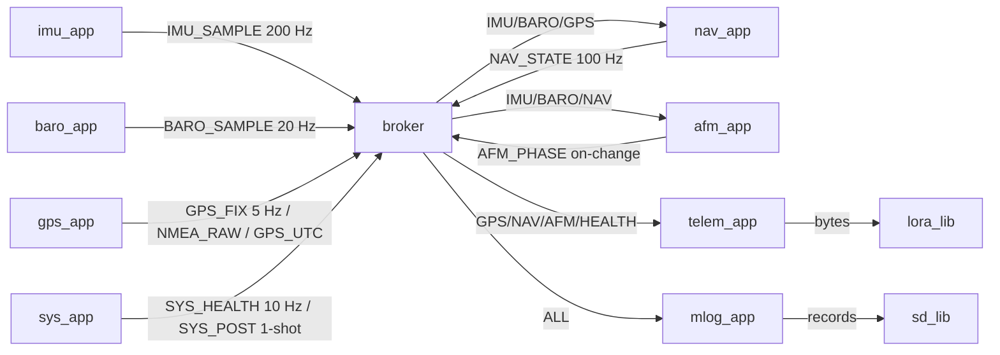
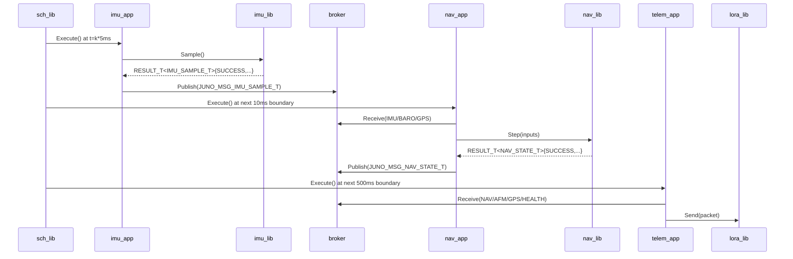
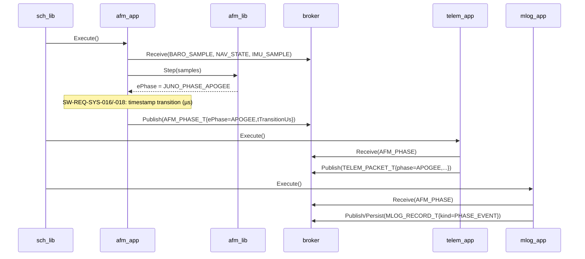
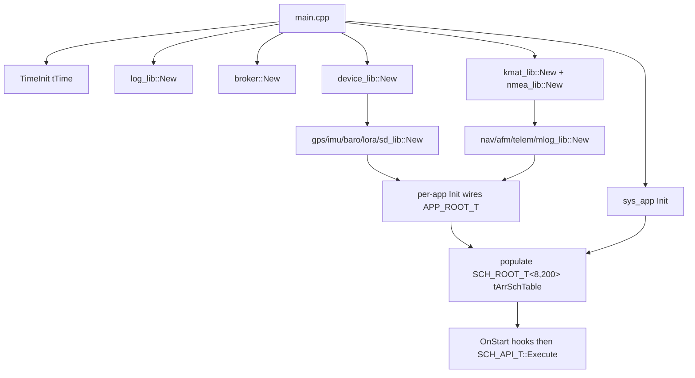

# Juno FSW — System Design (L1)

**Document type:** IEEE 1016 Software Design Description. **Scope:** Top-level system architecture for the Juno FT1 flight software. **Authoritative for:** Cross-module composition, scheduler periods, message catalog, lifecycle, POSIX/Pico2 split, system error handling. **Reference (do not contradict):** `docs/design/conventions.md` (names, idioms, vocabulary).

---

<!-- @{"design": ["SW-REQ-SYS-001", "SW-REQ-SYS-002", "SW-REQ-SYS-003", "SW-REQ-SYS-004"]} -->
## 1. Purpose and Scope

L1 system design for the Juno FT1 flight software (FSW). Addresses `SW-REQ-SYS-001` through `SW-REQ-SYS-062` and locks the architectural decisions that 27 per-module L2 designs reference: composition root, TDM scheduler periods, cross-app bus message catalog, POST/init/run/safe-mode lifecycle, POSIX/Pico2 split, system-wide timing budget, error-handling chain.

In scope: module catalog, schedule, bus message catalog, composition root order, lifecycle states, timing budget, error handling, traceability to all 62 SYS reqs. Out of scope: per-module algorithms (deferred to L2); concrete numeric thresholds for nav-vs-GPS divergence (deferred to nav L2 per `SW-REQ-SYS-014`); FT2/FIDR (`SW-REQ-SYS-037`); actuation (`SW-REQ-SYS-004`).

---

<!-- @{"design": ["SW-REQ-SYS-026", "SW-REQ-SYS-038", "SW-REQ-SYS-039", "SW-REQ-SYS-040", "SW-REQ-SYS-041", "SW-REQ-SYS-042", "SW-REQ-SYS-057"]} -->
## 2. Definitions and Abbreviations

Cross-module vocabulary (phase enum, time base, frames, status semantics, message naming, scheduler period units, body axes) is defined in `conventions.md` §4 and **not** redefined here. SYS reqs (`-026` µs time base, `-038`/`-039` geodetic + HAE, `-040` NED, `-041` quaternion, `-042` SI, `-057` body axes) are locked in `conventions.md` §4.2/§4.6 and inherited verbatim by every L2.

| Term | Meaning |
|------|---------|
| FSW | Flight Software (the artifact this document designs) |
| FT1 | Flight Test 1 — the mission scoped by the SYS requirements |
| TDM | Time-Division Multiplexed (cooperative scheduler model) |
| MVC | Model-View-Controller (per `ai/memory/architecture.md`) |
| POST | Power-On Self-Test |
| Hyperperiod | LCM of all app TDM periods; here, 1000 ms |
| Composition root | The single translation unit that wires every dependency (`apps/main.cpp`) |
| Bus | LibJuno software broker (`libjuno/sb/broker_api.h`) |
| Safe mode | Reduced-functionality run state where AFM/Nav/Telem continue at static rates while a sensor or output device is unhealthy (`SW-REQ-SYS-033`/`-062`) |

---

<!-- @{"design": ["SW-REQ-SYS-002", "SW-REQ-SYS-010", "SW-REQ-SYS-013", "SW-REQ-SYS-017", "SW-REQ-SYS-031", "SW-REQ-SYS-043"]} -->
## 3. System Overview

The FSW is a single-threaded, freestanding C++11 application built on the LibJuno C++ module pattern (`conventions.md` §1) and MVC layering (`ai/memory/architecture.md`). One translation unit per target is the composition root and wires the static schedule.

### 3.1 MVC layer mapping

| Layer | Realization | Examples |
|-------|-------------|----------|
| View (App) | `apps/<name>_app/` — owns state machine, scheduled by `juno_sch`, no business logic | `imu_app`, `nav_app`, `telem_app`, `afm_app`, `sys_app` |
| Controller (Lib) | `libs/<name>_lib/` — algorithms/drivers, LibJuno C++ module pattern, POSIX + Pico2 impls | `imu_lib`, `nav_lib`, `nmea_lib`, `kmat_lib` |
| Model (Bus) | `libjuno/sb/broker_api.h` — one broker, routes typed messages between apps | `JUNO_MSG_NAV_STATE_T`, `JUNO_MSG_AFM_PHASE_T` |

### 3.2 Top-level module composition



### 3.3 Module catalog — 15 libraries + 8 apps + 4 simulation modules. Header paths mandatory (`conventions.md` §1).

| Module | Type | Header path | TDM period |
|--------|------|------------|-----------|
| `time_lib` | lib | `libjuno/include/juno/time/time_api.hpp` (LibJuno; FT1 impls under `libs/time_lib/src/<platform>/`) | n/a |
| `log_lib` | lib | `libs/log_lib/include/log_lib/log_api.hpp` | n/a |
| `sch_lib` | lib | `libjuno/include/juno/sch/juno_sch_api.hpp` (LibJuno; FT1 impls under `libs/sch_lib/src/<platform>/`) | n/a |
| `device_lib` | lib | `libs/device_lib/include/device_lib/device_api.hpp` | n/a |
| `kmat_lib` | lib | `libs/kmat_lib/include/kmat_lib/kmat_api.hpp` | n/a |
| `nmea_lib` | lib | `libs/nmea_lib/include/nmea_lib/nmea_api.hpp` | n/a |
| `gps_lib` | lib | `libs/gps_lib/include/gps_lib/gps_api.hpp` | n/a |
| `imu_lib` | lib | `libs/imu_lib/include/imu_lib/imu_api.hpp` | n/a |
| `baro_lib` | lib | `libs/baro_lib/include/baro_lib/baro_api.hpp` | n/a |
| `lora_lib` | lib | `libs/lora_lib/include/lora_lib/lora_api.hpp` | n/a |
| `sd_lib` | lib | `libs/sd_lib/include/sd_lib/sd_api.hpp` | n/a |
| `nav_lib` | lib | `libs/nav_lib/include/nav_lib/nav_api.hpp` | n/a |
| `afm_lib` | lib | `libs/afm_lib/include/afm_lib/afm_api.hpp` | n/a |
| `telem_lib` | lib | `libs/telem_lib/include/telem_lib/telem_api.hpp` | n/a |
| `mlog_lib` | lib | `libs/mlog_lib/include/mlog_lib/mlog_api.hpp` | n/a |
| `imu_app` | app | `apps/imu_app/include/imu_app/imu_app.hpp` | `kImuAppPeriodMs = 5` |
| `baro_app` | app | `apps/baro_app/include/baro_app/baro_app.hpp` | `kBaroAppPeriodMs = 50` |
| `gps_app` | app | `apps/gps_app/include/gps_app/gps_app.hpp` | `kGpsAppPeriodMs = 200` |
| `nav_app` | app | `apps/nav_app/include/nav_app/nav_app.hpp` | `kNavAppPeriodMs = 10` |
| `afm_app` | app | `apps/afm_app/include/afm_app/afm_app.hpp` | `kAfmAppPeriodMs = 10` |
| `telem_app` | app | `apps/telem_app/include/telem_app/telem_app.hpp` | `kTelemAppPeriodMs = 500` |
| `mlog_app` | app | `apps/mlog_app/include/mlog_app/mlog_app.hpp` | `kMlogAppPeriodMs = 5` |
| `sys_app` | app | `apps/sys_app/include/sys_app/sys_app.hpp` | `kSysAppPeriodMs = 100` |
| `sim_*` (4) | sim | `sim/{sim_dynamics,sim_sensors,sim_scenario,sim_harness}/include/.../<name>.hpp` | n/a (Trick) |

Per-publisher message header path: `libs/<module>_lib/include/<module>_lib/<module>_msg.hpp` (per `conventions.md` §4.4).

**Note on LibJuno-published interfaces.** Three FT1 module categories use LibJuno's already-published canonical types verbatim and provide only platform implementations of the corresponding API vtables:
- **`time_lib`** implements `juno::time::TIME_API_T { Now, SleepTo, Sleep }` for POSIX and Pico2; the `juno::time::TIME_ROOT_T` aggregate is owned at the composition root and initialized via `juno::time::TimeInit(tTime, tApi, ...)`.
- **`sch_lib`** implements `juno::sch::SCH_API_T<NAppsPerFrame, NFrames> { Execute, GetMinorFramePeriod, GetMajorFramePeriod }` for POSIX and Pico2; FT1 instantiates `juno::sch::SCH_ROOT_T<8, 200>` (8 app slots × 200 minor frames at 5 ms = 1000 ms major).
- Each per-app module (`imu_app`, `baro_app`, `gps_app`, `nav_app`, `afm_app`, `telem_app`, `mlog_app`, `sys_app`) implements `juno::app::APP_API_T { OnStart, OnProcess, OnExit }` for its own `<APP>_T` aggregate that embeds `juno::app::APP_ROOT_T`.

All three categories use LibJuno's `juno/status.h` codes verbatim (see `conventions.md` §4.8) and the canonical `JUNO_TIMESTAMP_T` time type with `JUNO_TIME_US_T = uint64_t` derived for FSW message timestamps via `TIME_ROOT_T::TimestampToMicros()`.

Period derivations: IMU 200 Hz → 5 ms (`SW-REQ-SYS-005`); baro 20 Hz → 50 ms (`SW-REQ-SYS-008`); GPS 5 Hz → 200 ms (`SW-REQ-SYS-009`); nav 100 Hz → 10 ms (`SW-REQ-SYS-012`); telem 2 Hz → 500 ms (`SW-REQ-SYS-019`); `mlog_app` matches the highest publisher cadence (5 ms IMU) so that no sensor sample is overwritten between mlog dispatches, satisfying `SW-REQ-SYS-011` (no sensor downsampling for logging) under the broker's single-slot latest-value subscriber view; `afm_app` co-runs with nav at 10 ms; `sys_app` services health/LED at 100 ms.

---

<!-- @{"design": ["SW-REQ-SYS-005", "SW-REQ-SYS-008", "SW-REQ-SYS-009", "SW-REQ-SYS-012", "SW-REQ-SYS-013", "SW-REQ-SYS-015", "SW-REQ-SYS-017", "SW-REQ-SYS-019", "SW-REQ-SYS-020", "SW-REQ-SYS-031"]} -->
## 4. Interface Definitions — Bus Message Catalog

This is the **authoritative cross-app bus catalog**. Per-module designs use these type names verbatim (`conventions.md` §4.4). Every message is a POD aggregate with a leading `JUNO_TIME_US_T tTimestampUs` (`conventions.md` §4.2) and zero constructors/destructors.

| Type | Publisher | Subscribers | Period | Fields (summary) |
|------|-----------|-------------|--------|------------------|
| `JUNO_MSG_IMU_SAMPLE_T` | `imu_app` | `nav_app`, `afm_app`, `mlog_app` | 5 ms | `tTimestampUs`, `tAccel[3]` (m/s²), `tGyro[3]` (rad/s), `bValid` |
| `JUNO_MSG_BARO_SAMPLE_T` | `baro_app` | `nav_app`, `afm_app`, `mlog_app` | 50 ms | `tTimestampUs`, `fPressurePa`, `fAltMHae`, `fTempC`, `bValid` |
| `JUNO_MSG_GPS_FIX_T` | `gps_app` | `nav_app`, `mlog_app`, `telem_app` | 200 ms | `tTimestampUs`, `dLatDeg`, `dLonDeg`, `fAltMHae`, `tVelNed[3]`, `eFixQuality`, `bValid` |
| `JUNO_MSG_GPS_UTC_T` | `gps_app` | `mlog_app`, `telem_app` | aperiodic | `tTimestampUs`, `tUtc{year,mon,day,hr,min,sec,us}` |
| `JUNO_MSG_GPS_NMEA_RAW_T` | `gps_app` | `mlog_app` | per sentence | `tTimestampUs`, `acSentence[N]`, `zLen` |
| `JUNO_MSG_NAV_STATE_T` | `nav_app` | `afm_app`, `telem_app`, `mlog_app` | 10 ms | `tTimestampUs`, position (geodetic), velocity (NED), attitude quat, accel/gyro biases, `bValid` |
| `JUNO_MSG_AFM_PHASE_T` | `afm_app` | `telem_app`, `mlog_app` | 10 ms (publish on change) | `tTimestampUs`, `ePhase` (`JUNO_PHASE_T`), `tTransitionUs` |
| `JUNO_MSG_SYS_HEALTH_T` | `sys_app` | `telem_app`, `mlog_app` | 100 ms | `tTimestampUs`, `u32HealthBitmap`, per-sensor flags |
| `JUNO_MSG_SYS_POST_T` | `sys_app` | `telem_app`, `mlog_app` | one-shot | `tTimestampUs`, per-sensor pass/fail bitmap |
| `JUNO_MSG_TELEM_PACKET_T` | `telem_app` | `mlog_app` (echo) | 500 ms | `tTimestampUs`, packet bytes, CRC, frame state |
| `JUNO_MSG_MLOG_RECORD_T` | `mlog_app` | n/a (sink) | n/a | `tTimestampUs`, record kind, payload length |

`<MODULE>_API_T` vtable shapes for every library are defined in their own L2 design docs; this document only mandates that every vtable function reference be `noexcept` and that no module struct carry constructors or destructors (`conventions.md` §1.3).

---

<!-- @{"design": ["SW-REQ-SYS-015", "SW-REQ-SYS-021", "SW-REQ-SYS-029", "SW-REQ-SYS-030", "SW-REQ-SYS-032", "SW-REQ-SYS-033", "SW-REQ-SYS-046", "SW-REQ-SYS-047", "SW-REQ-SYS-048", "SW-REQ-SYS-053", "SW-REQ-SYS-058", "SW-REQ-SYS-062"]} -->
## 5. State Machines — System Lifecycle

The FSW has a single system-level state machine owned by `sys_app`. It is **not** a vehicle phase machine (that lives in `afm_app`); it governs FSW execution mode.

```mermaid
stateDiagram-v2
    [*] --> POST: power-on (no arm signal, SW-REQ-SYS-046)
    POST --> Init: all probes returned (pass or fail logged + downlinked, SW-REQ-SYS-029/-030/-056)
    POST --> Init: probe failure marks sensor unhealthy (SW-REQ-SYS-058)
    Init: composition root wires libs, broker, scheduler
    Init --> Run: scheduler started; LED green if all-healthy (SW-REQ-SYS-032)
    Run --> Safe: any health bit set (SW-REQ-SYS-033/-058/-060/-061)
    Safe --> Run: all health bits cleared
    Run --> Run: nominal TDM tick
    Safe --> Safe: degraded TDM tick (SW-REQ-SYS-034/-035/-036/-062)
    Run --> Recovery: AFM phase = LANDING and no further phase transitions expected
    Safe --> Recovery: same
    Recovery --> Recovery: 2 Hz telemetry beacon continues (SW-REQ-SYS-021/-048)
    Recovery --> [*]: external power removed (SW-REQ-SYS-047)
```

Key rules (cross-cutting):

- No FSW-initiated reboot or self-shutdown (`SW-REQ-SYS-037`, `-047`).
- Safe mode never halts apps — it sets the relevant health bit and sets `bValid = false` on degraded outputs (`SW-REQ-SYS-033`, `-034`, `-035`, `-036`, `-058`, `-060`, `-061`, `-062`).
- LED green ⇔ `u32HealthBitmap == 0` ; LED red otherwise (`SW-REQ-SYS-032`).
- The Recovery sub-state is a function of AFM phase = `JUNO_PHASE_LANDING` (`conventions.md` §4.1) and is observable, not a separate scheduler mode — apps continue at static rates (`SW-REQ-SYS-021`, `-048`).
- C++ exceptions are unconditionally absent (`SW-REQ-SYS-053`, enforced by `-fno-exceptions`); failure handlers are diagnostic-only.

---

<!-- @{"design": ["SW-REQ-SYS-001", "SW-REQ-SYS-011", "SW-REQ-SYS-022", "SW-REQ-SYS-023", "SW-REQ-SYS-024", "SW-REQ-SYS-025", "SW-REQ-SYS-027", "SW-REQ-SYS-028", "SW-REQ-SYS-055"]} -->
## 6. Data Flow



Logging fan-in (`SW-REQ-SYS-022`): `mlog_app` subscribes to **all** publishers and writes raw sensor samples at full rate (`SW-REQ-SYS-011`), nav state, AFM phase events, raw NMEA verbatim (`SW-REQ-SYS-024`), POST result (`SW-REQ-SYS-030`), GPS UTC (`SW-REQ-SYS-028`), and the health bitmap. Every record uses a machine-parseable binary format (`SW-REQ-SYS-023`) with per-sample monotonic-µs timestamp (`SW-REQ-SYS-027`). On each power-on, `mlog_app` opens a new run directory (`SW-REQ-SYS-025`); prior runs are preserved until externally wiped (`SW-REQ-SYS-055`).

Buffer ownership: **publisher-owned at fill, broker copies on publish, subscriber sees an immutable view** (`conventions.md` §5 rule 6); subscribers never mutate received messages.

---

<!-- @{"design": ["SW-REQ-SYS-005", "SW-REQ-SYS-008", "SW-REQ-SYS-009", "SW-REQ-SYS-012", "SW-REQ-SYS-016", "SW-REQ-SYS-017", "SW-REQ-SYS-018", "SW-REQ-SYS-019", "SW-REQ-SYS-022", "SW-REQ-SYS-029", "SW-REQ-SYS-031", "SW-REQ-SYS-058"]} -->
## 7. Sequence Diagrams

### 7.1 Nominal sample cycle (TDM tick → IMU → Nav → Telem)



### 7.2 Sensor failure (IMU read error → health bitmap → AFM degraded)

```mermaid
sequenceDiagram
    participant sch as sch_lib
    participant imu_app
    participant imu_lib
    participant broker
    participant sys_app
    participant afm_app

    sch->>imu_app: Execute()
    imu_app->>imu_lib: Sample()
    imu_lib-->>imu_app: RESULT_T<...>{IO_ERROR, ...}
    Note over imu_app: SW-REQ-SYS-058: mark sensor unhealthy.<br/>Failure handler diagnostic only.
    imu_app->>broker: Publish(IMU_SAMPLE_T{bValid=false})
    sch->>sys_app: Execute()
    sys_app->>broker: Publish(SYS_HEALTH_T{u32HealthBitmap |= IMU_BIT})
    sch->>afm_app: Execute()
    afm_app->>broker: Receive(IMU bValid=false, BARO, NAV)
    Note over afm_app: SW-REQ-SYS-034/-062: continue with degraded inputs;<br/>NAV_STATE.bValid drives AFM input gating.
    afm_app->>broker: Publish(AFM_PHASE_T) [unchanged]
```

### 7.3 Apogee detection (AFM phase transition → telem → mlog)



---

<!-- @{"design": ["SW-REQ-SYS-005", "SW-REQ-SYS-008", "SW-REQ-SYS-009", "SW-REQ-SYS-010", "SW-REQ-SYS-012", "SW-REQ-SYS-019", "SW-REQ-SYS-044"]} -->
## 8. Composition Root, Timing and Scheduling

### 8.1 Composition root

The composition root is `apps/main.cpp` (one per target — see §10 below for which file becomes `main.cpp` per platform). It is the **only** place dependencies are wired (`ai/memory/architecture.md`, `conventions.md` §1).



Composition order rules (compile-time, no runtime polymorphism past Init — `SW-REQ-SYS-051`):

1. Foundational libs first: `time_lib`, `log_lib`, `kmat_lib`, `device_lib`, `nmea_lib`.
2. Driver libs next: `imu_lib`, `baro_lib`, `gps_lib`, `lora_lib`, `sd_lib` — each `New()` returns `RESULT_T<*_IMPL_T>`; failure marks the sensor unhealthy in the POST bitmap and continues (`SW-REQ-SYS-029`, `-030`, `-058`).
3. Domain libs: `nav_lib`, `afm_lib`, `telem_lib`, `mlog_lib`.
4. Broker is constructed before any app `Init()` (apps subscribe at `Init()`).
5. Apps initialized via per-app `<App>AppInit(tApp, &libRoot, &broker, tTime)` — DI is by reference to `<MODULE>_ROOT_T` and `juno::time::TIME_ROOT_T`; no globals reach across modules. Each app's aggregate carries an embedded `juno::app::APP_ROOT_T tRoot` with its `juno::app::APP_API_T { OnStart, OnProcess, OnExit }` vtable wired at init.
6. `juno::sch::SCH_ROOT_T<8, 200>` aggregate-initialized with the static `SCH_API_T<8, 200>` vtable, the injected `tTime` reference, the 5 ms `tMinorFramePeriod`, and the 2D `tArrSchTable[200][8]` populated with each app's `APP_ROOT_T*` in its applicable minor-frame indices (offsets per §8.2 below).
7. After populating the table, the composition root invokes each app's `tRoot.ptApi->OnStart(tRoot)` once, then calls `tSch.ptApi->Execute(tSch)` to enter the cyclic-executive loop; never returns until external power is removed (`SW-REQ-SYS-047`).

Pseudocode (illustrative; matches the LibJuno-published `TIME_API_T` and `SCH_ROOT_T<NAppsPerFrame, NFrames>` aggregate-initialization examples):

```cpp
// apps/main.cpp — composition root (POSIX or Pico2; selected at build time)
// 1. Time: platform-specific TIME_API_T impl, aggregate-init TIME_ROOT_T.
static const juno::time::TIME_API_T tTimeApi{
    /*Now=*/     &PlatformTimeNow,      // posix: clock_gettime; pico2: time_us_64
    /*SleepTo=*/ &PlatformTimeSleepTo,  // posix: clock_nanosleep ABSTIME; pico2: busy-wait
    /*Sleep=*/   &PlatformTimeSleep,    // posix: clock_nanosleep relative; pico2: sleep_us
};
juno::time::TIME_ROOT_T tTime;
JUNO_ASSERT_SUCCESS(juno::time::TimeInit(tTime, tTimeApi, nullptr, nullptr), /*halt*/);
// 2. Software bus broker.
juno::sb::BROKER_IMPL_T tBus = juno::sb::BROKER_IMPL_T::New(...).tOk;
// 3. Driver libs — each returns RESULT_T<<MODULE>_IMPL_T>; failure marks POST bitmap.
juno::imu::IMU_LIB_IMPL_T   tImuLib  = juno::imu::IMU_LIB_IMPL_T::New(...).tOk;
juno::baro::BARO_LIB_IMPL_T tBaroLib = juno::baro::BARO_LIB_IMPL_T::New(...).tOk;
juno::gps::GPS_LIB_IMPL_T   tGpsLib  = juno::gps::GPS_LIB_IMPL_T::New(...).tOk;
juno::lora::LORA_LIB_IMPL_T tLoraLib = juno::lora::LORA_LIB_IMPL_T::New(...).tOk;
juno::sd::SD_LIB_IMPL_T     tSdLib   = juno::sd::SD_LIB_IMPL_T::New(...).tOk;
// 4. App instances — each carries juno::app::APP_ROOT_T tRoot; init wires its
//    APP_API_T impl with OnStart/OnProcess/OnExit refs.
juno::imu_app::IMU_APP tImuApp;
juno::imu_app::ImuAppInit(tImuApp, tImuLib.tRoot, tBus.tRoot, tTime);
// ... every other app similarly initialized ...
// 5. Scheduler: aggregate-init SCH_ROOT_T<8, 200>; minor frame i ∈ [0,200) at 5 ms.
static const juno::sch::SCH_API_T<8, 200> tSchApi{
    &PlatformSchExecute, &PlatformSchGetMinorFramePeriod, &PlatformSchGetMajorFramePeriod
};
juno::sch::SCH_ROOT_T<8, 200> tSch = {
    &tSchApi, nullptr, nullptr,
    /*tMinorFramePeriod=*/ {0U, 5U /* ms-equiv subseconds */},
    /*tTime=*/             tTime,
    /*tArrSchTable=*/      {{nullptr}}     // populated below
};
// Populate per app's k<App>AppPeriodMs:
for (size_t i = 0; i < 200; ++i) {
    tSch.tArrSchTable[i][0] = &tImuApp.tRoot;                        // 5 ms
    if (i %   2 == 0) tSch.tArrSchTable[i][1] = &tNavApp.tRoot;      // 10 ms
    if (i %   2 == 0) tSch.tArrSchTable[i][2] = &tAfmApp.tRoot;      // 10 ms
    tSch.tArrSchTable[i][3] = &tMlogApp.tRoot;                       // 5 ms (S1-AI-005)
    if (i %  10 == 0) tSch.tArrSchTable[i][4] = &tBaroApp.tRoot;     // 50 ms
    if (i %  20 == 0) tSch.tArrSchTable[i][5] = &tSysApp.tRoot;      // 100 ms
    if (i %  40 == 0) tSch.tArrSchTable[i][6] = &tGpsApp.tRoot;      // 200 ms
    if (i % 100 == 0) tSch.tArrSchTable[i][7] = &tTelemApp.tRoot;    // 500 ms
}
// 6. Invoke per-app OnStart hooks once before scheduler enters Execute.
JUNO_ASSERT_SUCCESS(tImuApp.tRoot.ptApi->OnStart(tImuApp.tRoot), /*mark POST bit*/);
// ... repeat for each app ...
// 7. Enter cyclic-executive loop (does not return on Pico2 flight; SW-REQ-SYS-047).
tSch.ptApi->Execute(tSch);
```

No `new`/`delete`, no constructors on module structs, all storage caller-owned (`SW-REQ-SYS-050`; `conventions.md` §5). The `TIME_ROOT_T` and `SCH_ROOT_T<8, 200>` aggregates are stack/static-allocated at the composition root; only their `TIME_API_T` / `SCH_API_T<8, 200>` vtables differ across POSIX/Pico2/Trick builds (no `TIME_LIB_*` or `SCH_LIB_*` derivation type — Option A — Chair, 2026-05-03).

### 8.2 Static schedule and timing budget

`SW-REQ-SYS-010` mandates a static, compile-time schedule. The hyperperiod is `lcm(5, 10, 50, 100, 200, 500) = 1000 ms`. The TDM scheduler uses the IMU's 5 ms tick as its base period; every app is dispatched only on ticks where `(tickIndex * 5 ms) mod kAppPeriodMs == kAppOffsetMs`.

Per-tick-budget snapshot (one 5 ms slot must complete every dispatched app's `Execute()`; offsets stagger the heavier apps so no single tick exceeds the budget):

| Tick offset (ms) | Apps dispatched | Why this offset |
|------------------|------------------|-----------------|
| 0, 5, 10, ... | `imu_app`, `mlog_app` (every 5 ms) | Highest-rate sample (IMU); mlog co-scheduled to capture every IMU publication without downsampling (`SW-REQ-SYS-011`) |
| 0, 10, 20, ... | `nav_app`, `afm_app` | Drain bus on the IMU-aligned 10 ms boundary |
| 0, 50, 100, ... | `baro_app` | 20 Hz, aligned with IMU/Nav cadence |
| 0, 100, 200, ... | `sys_app` | Health bitmap & LED service |
| 0, 200, 400, ... | `gps_app` | 5 Hz NMEA processing, longest-cost periodic |
| 0, 500 | `telem_app` | LoRa packet build + transmit |

Hyperperiod execution count = `200 imu + 200 mlog + 100 nav + 100 afm + 20 baro + 10 sys + 5 gps + 2 telem = 637` app invocations / 1 s. The exact per-invocation budget is documented in each per-module L2 §8 and bounded such that any single 5 ms tick (worst case: imu + mlog + nav + afm + baro + sys + gps + telem on the t=0 tick) fits in 5 ms with margin; per-module designs hold this budget.

The schedule above maps directly onto LibJuno's `juno::sch::SCH_ROOT_T<8, 200>` 2D schedule table: each minor frame index i ∈ [0, 200) corresponds to a 5 ms tick at `t = i × 5 ms`; the 8 columns are the 8 FT1 app slots. The composition root populates each `tArrSchTable[i][j]` with the appropriate `APP_ROOT_T*` based on the app's `k<App>AppPeriodMs` (see §8.1).

Determinism of the schedule (`SW-REQ-SYS-044`) follows from: compile-time periods, fixed dispatch order within a tick, no dynamic memory, no exception unwinding, no virtual dispatch.

---

<!-- @{"design": ["SW-REQ-SYS-006", "SW-REQ-SYS-007", "SW-REQ-SYS-014", "SW-REQ-SYS-029", "SW-REQ-SYS-030", "SW-REQ-SYS-031", "SW-REQ-SYS-032", "SW-REQ-SYS-033", "SW-REQ-SYS-034", "SW-REQ-SYS-035", "SW-REQ-SYS-036", "SW-REQ-SYS-037", "SW-REQ-SYS-053", "SW-REQ-SYS-056", "SW-REQ-SYS-058", "SW-REQ-SYS-059", "SW-REQ-SYS-060", "SW-REQ-SYS-061", "SW-REQ-SYS-062"]} -->
## 9. Error Handling Strategy

System-level error handling is uniform; per-module designs apply the same idiom.

1. **Status propagation.** Every fallible call returns `JUNO_STATUS_T` or `RESULT_T<T>` / `OPTION_T<T>`. Callers use `JUNO_ASSERT_SUCCESS` / `JUNO_ASSERT_OK` / `JUNO_ASSERT_SOME` / `JUNO_ASSERT_EXISTS` (`conventions.md` §4.3); bare `if`-return is a review failure.
2. **Failure handler chain.** `JUNO_FAILURE_HANDLER_T pfcnFailureHandler` is injected at every `New()`. Failures invoke this handler with a context string and the originating status. **The handler is diagnostic-only; it never alters control flow** (`conventions.md` §4.3, `SW-REQ-SYS-037`). The default chain points to `log_lib`, which writes a severity-tagged record and (when `mlog_lib` is up) emits an `MLOG_RECORD_T`.
3. **Per-sensor health bit.** Each driver/app sets its corresponding bit in `JUNO_MSG_SYS_HEALTH_T.u32HealthBitmap` on read failure (`SW-REQ-SYS-058`), SD write failure (`SW-REQ-SYS-060`), or LoRa transmit failure (`SW-REQ-SYS-061`). The bit clears on a subsequent successful operation. The bitmap is published by `sys_app` continuously (`SW-REQ-SYS-031`).
4. **No actuation, no auto-reboot.** `SW-REQ-SYS-004` and `SW-REQ-SYS-037` jointly forbid any FSW-initiated state change beyond logging and health-bit updates. A reset is only possible via external power removal (`SW-REQ-SYS-047`).
5. **Continuation policy.** Sensor-read failures (`SW-REQ-SYS-033`), nav with degraded inputs (`SW-REQ-SYS-034`, `SW-REQ-SYS-059` clears `bValid`), SD-write failures (`SW-REQ-SYS-035`), radio failures (`SW-REQ-SYS-036`), and AFM unavailability (`SW-REQ-SYS-062`) all proceed without altering the schedule.
6. **Exceptions banned.** `-fno-exceptions` (`SW-REQ-SYS-053`) — every API function is `noexcept`; a stray throw would invoke `std::terminate`. Designs treat this as a structural invariant.
7. **POST.** `sys_app` runs the POST sequence at boot, probing every sensor once, logs the per-sensor bitmap to SD (`SW-REQ-SYS-030`) and downlinks it once (`SW-REQ-SYS-056`). POST result records continue to surface as the initial value of `JUNO_MSG_SYS_HEALTH_T`.
8. **Operator LED.** `sys_app` drives the green/red status LED from the live health bitmap (`SW-REQ-SYS-032`). Driving the LED is a publish-side effect, not a control-flow change.
9. **Configurable nav-vs-GPS bound.** The numeric horizontal bound that triggers `bValid=false` for nav (`SW-REQ-SYS-014`) is owned by the nav L2 design. At system level, the contract is: nav publishes `NAV_STATE.bValid=false` whenever the bound is exceeded; this is observable to telem and mlog without any FSW reaction beyond the validity flag.
10. **Sensor range configuration failures.** IMU range mis-configuration (`SW-REQ-SYS-006`, `-007`) is an init-time POST failure: the bit is set, the FSW continues, and the operator sees red LED + downlinked POST record.

---

<!-- @{"design": ["SW-REQ-SYS-043", "SW-REQ-SYS-045", "SW-REQ-SYS-049", "SW-REQ-SYS-050", "SW-REQ-SYS-051", "SW-REQ-SYS-052", "SW-REQ-SYS-054"]} -->
## 10. Memory Ownership and POSIX/Pico2 Split

### 10.1 Memory ownership — system-level baseline; every per-module §10 reaffirms.

| Buffer / facility | Owner | Lifetime | Allocation |
|-------------------|-------|----------|------------|
| `*_IMPL_T`, `*_APP`, `BROKER_IMPL_T`, `TIME_ROOT_T`, `SCH_ROOT_T<8,200>` | composition root (`apps/main.cpp`) | program lifetime, `.bss` zero-init | Static / stack — caller-owned |
| Subscriber message buffers | each app (POD member of `_APP`) | program lifetime | Static |
| Telemetry packet buffer | `telem_app` | program lifetime | Static, `kPacketSize` const |
| Mission log scratch buffer | `mlog_app` | program lifetime | Static, `kRecordBuf` const |
| Block pools (where used) | the owning module via `BlockAlloc<T,N>` | program lifetime | Static — `T tPool[N]` member |
| Vtable (`tApi`) | `New()` factory or composition root, file-scope `static` | program lifetime | Read-only after construction |

Asserted invariants (from `conventions.md` §5 / `constraints.md`): caller-owned all storage; **no `new`, `delete`, `malloc`, `calloc`, `realloc`, `free`, no heap-backed STL containers** (`SW-REQ-SYS-050`); no global mutable state in libraries; no runtime polymorphism after init (`SW-REQ-SYS-051`); no RTTI (`SW-REQ-SYS-052`).

### 10.2 POSIX vs Pico2 split + Trick integration — `SW-REQ-SYS-043` (equivalence), `SW-REQ-SYS-045` (Trick); per `conventions.md` §6:

| Build target | `main.cpp` location | Driver impls linked | Test harness |
|--------------|--------------------|---------------------|--------------|
| `PLATFORM=POSIX` (host / unit tests) | `apps/main_posix.cpp` (alias `apps/main.cpp` under POSIX preset) | `libs/<module>_lib/src/posix/*.cpp` | Google Test, hosted libstdc++ |
| `PLATFORM=POSIX` (Trick SITL) | `sim/sim_harness/src/main_trick.cpp` | `libs/<module>_lib/src/posix/*.cpp` | Trick S_define harness; sensors driven by `sim_sensors` (`SW-REQ-SYS-045`) |
| `PLATFORM=PICO2` (flight) | `apps/main_pico2.cpp` (alias `apps/main.cpp` under Pico2 preset) | `libs/<module>_lib/src/pico2/*.cpp` | n/a |

The composition graph (§8.1) is identical across targets; only the IMPL files differ. Cross-platform equivalence is exercised by Trick SITL feeding the same `*_ROOT_T` API the flight build uses (`SW-REQ-SYS-045`). Where deliberate platform divergence exists (e.g., `juno::time` clock source — POSIX `clock_gettime(CLOCK_MONOTONIC)` vs. Pico2 RP2350 timer), it is documented in the relevant L2 design's §6 with rationale.

Trick SITL provides its own `juno::time::TIME_API_T` impl whose `Now()` returns the simulator's current `JUNO_TIMESTAMP_T`; the same `juno::time::TIME_ROOT_T` aggregate is initialized at composition with this Trick-specific vtable instead of the host clock vtable. There is no `JUNO_TIME_PROVIDER_T` callback parameter (Option A — Chair, 2026-05-03).

Coverage: POSIX test build gates `SW-REQ-SYS-054` (100% line coverage via gcov). FT1 closure artifacts (`SW-REQ-SYS-049`: SD log, telemetry transcript, operator video, signed checklist, recovered hardware) come from the Pico2 flight build; the SD log and telemetry transcript are the system-side outputs designed in §6 and §4.

---

## 11. Traceability

Per-section `<!-- @{"design": [...]} -->` tags above are authoritative; this table is descriptive. Every `SW-REQ-SYS-NNN` is mapped to at least one section.

| Req ID | Title | Section(s) |
|--------|-------|-----------|
| SW-REQ-SYS-001 | Raw Sensor Logging to SD | §1, §6 |
| SW-REQ-SYS-002 | Live Nav Estimation | §1, §3 |
| SW-REQ-SYS-003 | Live LoRa Telemetry | §1 |
| SW-REQ-SYS-004 | No Actuation FT1 | §1, §9 |
| SW-REQ-SYS-005 | IMU 200 Hz | §3.3, §7.1, §8 |
| SW-REQ-SYS-006 | IMU Accel ±16 G | §9 |
| SW-REQ-SYS-007 | IMU Gyro ±2000 dps | §9 |
| SW-REQ-SYS-008 | Baro 20 Hz | §3.3, §8 |
| SW-REQ-SYS-009 | GPS 5 Hz | §3.3, §8 |
| SW-REQ-SYS-010 | Static Compile-Time Schedule | §3, §8 |
| SW-REQ-SYS-011 | No Sensor Downsampling for Logging | §6 |
| SW-REQ-SYS-012 | Nav 100 Hz | §3.3, §8 |
| SW-REQ-SYS-013 | 16-state Nav | §3, §4 |
| SW-REQ-SYS-014 | Nav Position Bound to GPS | §9 |
| SW-REQ-SYS-015 | Nav Validity Flag | §4, §5 |
| SW-REQ-SYS-016 | AFM Phases | §7.3, §8 |
| SW-REQ-SYS-017 | AFM Phase on Bus | §3, §4, §8 |
| SW-REQ-SYS-018 | Phase Transition Timestamp | §7.3, §8 |
| SW-REQ-SYS-019 | Telem 2 Hz | §4, §8 |
| SW-REQ-SYS-020 | Telem Packet Content | §4 |
| SW-REQ-SYS-021 | Continuous Telemetry | §5 |
| SW-REQ-SYS-022 | SD Log Content | §6, §7 |
| SW-REQ-SYS-023 | Machine-Parseable Log Format | §4 (`MLOG_RECORD_T`), §6 |
| SW-REQ-SYS-024 | Verbatim NMEA | §6 |
| SW-REQ-SYS-025 | New Log Run Per Power-On | §6 (mlog), §10.2 |
| SW-REQ-SYS-026 | Monotonic µs Time Base | §2, §4 |
| SW-REQ-SYS-027 | Per-Sample Timestamping | §4, §6 |
| SW-REQ-SYS-028 | GPS UTC Logging | §4, §6 |
| SW-REQ-SYS-029 | POST | §5, §8, §9 |
| SW-REQ-SYS-030 | POST Logging | §5, §6, §9 |
| SW-REQ-SYS-031 | Health Bitmap | §3, §4, §9 |
| SW-REQ-SYS-032 | Health LED | §5, §9 |
| SW-REQ-SYS-033 | Sensor Read Continuation | §5, §9 |
| SW-REQ-SYS-034 | Nav Degraded Continuation | §5, §9 |
| SW-REQ-SYS-035 | SD Write Continuation | §5, §9 |
| SW-REQ-SYS-036 | Radio Failure Continuation | §5, §9 |
| SW-REQ-SYS-037 | No Auto-Reboot | §5, §9 |
| SW-REQ-SYS-038 | Geodetic Position | §2 (ref `conventions.md` §4.6), §4 |
| SW-REQ-SYS-039 | HAE Altitude | §2, §4 |
| SW-REQ-SYS-040 | NED Velocity | §2, §4 |
| SW-REQ-SYS-041 | Body→NED Quaternion | §2, §4 |
| SW-REQ-SYS-042 | SI Units | §2, §4 |
| SW-REQ-SYS-043 | POSIX/Pico2 Equivalence | §10.2 |
| SW-REQ-SYS-044 | Determinism | §8.2 |
| SW-REQ-SYS-045 | Trick Integration | §10.2 |
| SW-REQ-SYS-046 | Operational Power-On No Arm | §5 |
| SW-REQ-SYS-047 | Run Until Power Removed | §5, §8.1 |
| SW-REQ-SYS-048 | Recovery Beacon | §5 |
| SW-REQ-SYS-049 | FT1 Verification Artifacts | §1 (scope), §10.2 |
| SW-REQ-SYS-050 | No Heap | §10.1 |
| SW-REQ-SYS-051 | No Runtime Polymorphism After Init | §8.1, §10.1 |
| SW-REQ-SYS-052 | No RTTI | §10.1 |
| SW-REQ-SYS-053 | No Exceptions | §5, §9 |
| SW-REQ-SYS-054 | 100% Line Coverage | §10.2 (POSIX test build) |
| SW-REQ-SYS-055 | Prior Log Run Preservation | §6 (mlog), §10.2 |
| SW-REQ-SYS-056 | POST Result Downlink | §5, §9 |
| SW-REQ-SYS-057 | Body Axes X-fwd/Y-right/Z-down | §2 (ref `conventions.md` §4.6), §4 |
| SW-REQ-SYS-058 | Sensor Unhealthy on Read Fail | §5, §7.2, §9 |
| SW-REQ-SYS-059 | Nav Validity False on Missing Inputs | §9 |
| SW-REQ-SYS-060 | SD Unhealthy on Write Fail | §5, §9 |
| SW-REQ-SYS-061 | Radio Unhealthy on Tx Fail | §5, §9 |
| SW-REQ-SYS-062 | AFM-Loss Tolerance | §5, §7.2, §9 |

POSIX/Pico2 equivalence (`SW-REQ-SYS-043`) and Trick integration (`SW-REQ-SYS-045`): see §10.2.
