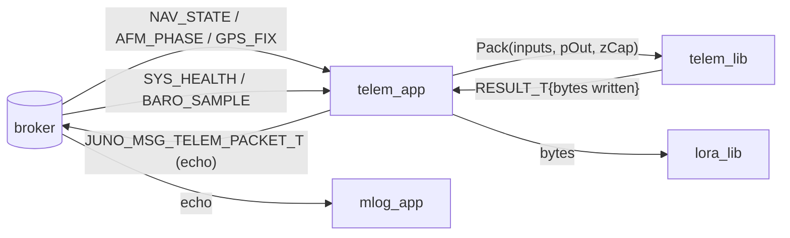
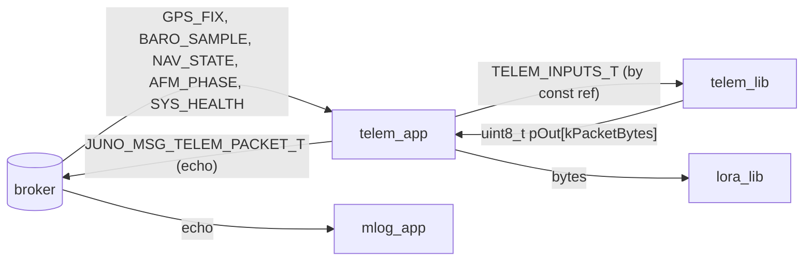
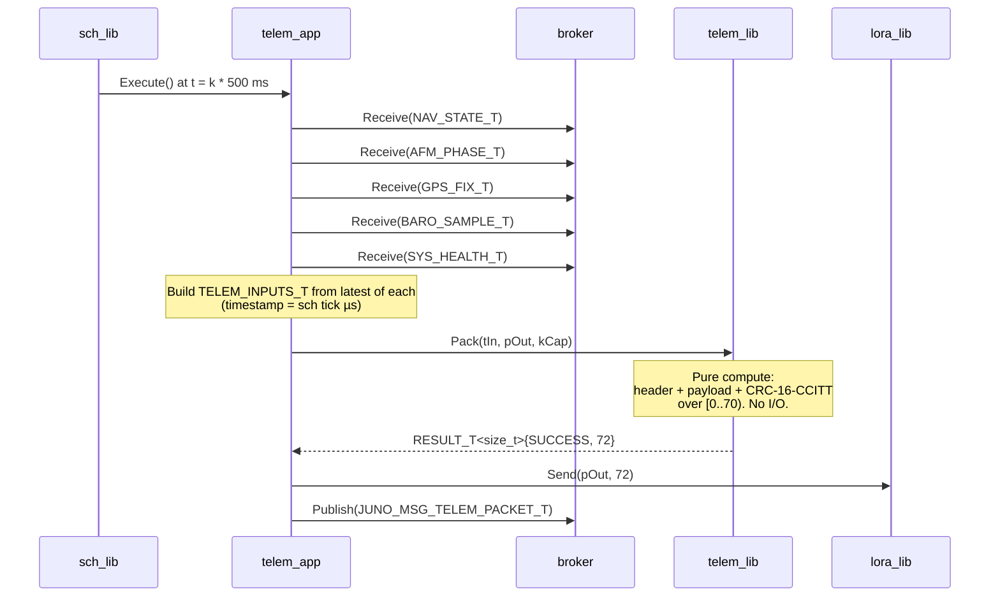

# telem_lib — Software Design Description (L2)

**Document type:** IEEE 1016 Software Design Description
**Module:** `telem_lib` (telemetry packet packing, framing, integrity)
**Scope:** Pure-compute encoder consumed by `telem_app` at 2 Hz; transmission belongs to `lora_lib`.
**Authoritative references:** `docs/design/conventions.md` (cross-module names, idioms), `docs/design/system/system_design.md` (composition, bus catalog), `docs/requirements/telem/requirements.json` (`SW-REQ-TELEM-001`..`-012`).

---

<!-- @{"design": ["SW-REQ-TELEM-001", "SW-REQ-TELEM-002", "SW-REQ-TELEM-011"]} -->
## 1. Purpose and Scope

`telem_lib` is the FSW telemetry **packet encoder**. Given a snapshot of caller-provided inputs (monotonic timestamp, AFM phase, GPS fix, baro altitude, nav state, voltage, validity, sensor health bitmap), it produces a deterministic byte sequence — a header, fixed-order payload, and integrity trailer — written into a caller-provided byte buffer. It is consumed exclusively by `telem_app`, which then hands the bytes to `lora_lib` for transmission.

In scope: packet content layout, byte-level packing, endianness, integrity field computation, size bound enforcement, deterministic serialization across POSIX and Pico2 builds.

Out of scope: any UART, SPI, GPIO, or radio I/O (`SW-REQ-TELEM-011`); buffer allocation (`SW-REQ-TELEM-002`, `conventions.md` §5); scheduling cadence (owned by `telem_app` per `SW-REQ-SYS-019`); LoRa framing/AT-commands (owned by `lora_lib`); ground decoder (out of FSW).

This document addresses every requirement in `docs/requirements/telem/requirements.json` (`SW-REQ-TELEM-001` through `SW-REQ-TELEM-012`).

---

## 2. Definitions and Abbreviations

Cross-module vocabulary is defined in `conventions.md` §4 and is **not** redefined here. `JUNO_PHASE_T` (§4.1), `JUNO_TIME_US_T` (§4.2), `JUNO_STATUS_T` / `RESULT_T<T>` (§4.3), bus message names (§4.4), and SI/frame conventions (§4.6) are inherited verbatim.

| Term | Meaning |
|------|---------|
| Packet | The byte sequence produced by `Pack()` — header + payload + CRC. |
| CRC-16-CCITT | The integrity algorithm used: polynomial `0x1021`, init `0xFFFF`, no reflection, no final XOR (variant locked in §4.3). |
| MTU | RYLR896 LoRa per-packet payload limit; ≤240 bytes (`SW-REQ-TELEM-004`). |
| Sync bytes | Fixed two-byte preamble `0x4A 0x55` ("JU") used by ground decoder for framing. |
| Endianness | All multi-byte fields are **big-endian** on the wire (network byte order). |
| Pure compute | The module has no I/O, no clock reads, no global state, no platform branches. |

---

<!-- @{"design": ["SW-REQ-TELEM-001", "SW-REQ-TELEM-006", "SW-REQ-TELEM-011"]} -->
## 3. System Overview

### 3.1 MVC layer mapping

| Layer | Realization |
|-------|-------------|
| View (App) | `telem_app` — owns the 500 ms TDM slot, subscribes to bus, calls `telem_lib::Pack()`, hands bytes to `lora_lib`. |
| Controller (Lib) | `telem_lib` — pure-compute encoder, this module. |
| Model (Bus) | `JUNO_MSG_TELEM_PACKET_T` is published by `telem_app` (echo to mlog); `telem_lib` itself does not touch the broker. |

### 3.2 Module placement



Per `SW-REQ-TELEM-011`, `telem_lib` does not touch UART, the radio, or the bus directly — `telem_app` owns those interactions.

### 3.3 LibJuno C++ pattern

`telem_lib` follows the LibJuno C++ template (`conventions.md` §1):

- Namespace: `juno::telem`
- Public header: `libs/telem_lib/include/telem_lib/telem_api.hpp`
- Single shared implementation file: `libs/telem_lib/src/telem_impl.cpp` (no platform split — module is pure compute, satisfies `SW-REQ-TELEM-010` by construction; see §6 below).
- Types: `TELEM_LIB_ROOT_T` (front-end) and `TELEM_LIB_IMPL_T` (`JUNO_MODULE_DERIVE`-d). Vtable: `TELEM_LIB_API_T`. Trivially constructible; no constructors or destructors.

---

<!-- @{"design": ["SW-REQ-TELEM-001", "SW-REQ-TELEM-002", "SW-REQ-TELEM-003", "SW-REQ-TELEM-004", "SW-REQ-TELEM-005", "SW-REQ-TELEM-007", "SW-REQ-TELEM-008", "SW-REQ-TELEM-010", "SW-REQ-TELEM-012"]} -->
## 4. Interface Definitions

### 4.1 Public types and constants (in `juno::telem`)

```cpp
namespace juno::telem
{
static constexpr uint16_t kSyncWord       = 0x4A55;        // 'J','U' big-endian
static constexpr uint8_t  kPacketVersion  = 0x01;
static constexpr uint16_t kPacketIdBeacon = 0x0001;
static constexpr size_t   kHeaderBytes    = 6;             // sync(2)+ver(1)+id(2)+len(1)
static constexpr size_t   kPayloadBytes   = 64;            // see §4.5 layout table
static constexpr size_t   kCrcBytes       = 2;             // CRC-16-CCITT
static constexpr size_t   kPacketBytes    = kHeaderBytes + kPayloadBytes + kCrcBytes; // 72
static constexpr size_t   kMaxPacketBytes = 240;           // RYLR896 MTU bound

static_assert(kPacketBytes <= kMaxPacketBytes,
              "telem packet must fit within RYLR896 MTU (SW-REQ-TELEM-004)");
}
```

The packet input bundle (POD aggregate, caller-filled, no constructor):

```cpp
struct TELEM_INPUTS_T
{
    JUNO_TIME_US_T          tTimestampUs;   // SW-REQ-TELEM-008 / SYS-026
    juno::afm::JUNO_PHASE_T ePhase;         // SW-REQ-TELEM-003 (phase)
    JUNO_MSG_GPS_FIX_T      tGps;           // SW-REQ-TELEM-003 (gps fix)
    float                   fBaroAltMHae;   // SW-REQ-TELEM-003 (baro alt)
    JUNO_MSG_NAV_STATE_T    tNav;           // SW-REQ-TELEM-003 (nav state)
    float                   fBatteryVolts;  // SW-REQ-TELEM-003 (voltage)
    bool                    bNavValid;      // SW-REQ-TELEM-012
    uint32_t                u32HealthBitmap;// SW-REQ-TELEM-007 / SYS-031
};
```

### 4.2 `TELEM_LIB_API_T` vtable

```cpp
struct TELEM_LIB_API_T
{
    RESULT_T<size_t> (&Pack)(TELEM_LIB_ROOT_T &tRoot,
                             const TELEM_INPUTS_T &tIn,
                             uint8_t *pOut,
                             size_t   zCap) noexcept;

    RESULT_T<uint16_t> (&ComputeCrc)(const TELEM_LIB_ROOT_T &tRoot,
                                     const uint8_t *pData,
                                     size_t         zLen) noexcept;
};

struct TELEM_LIB_ROOT_T JUNO_MODULE_ROOT(TELEM_LIB_API_T,
    /* no shared mutable members — module is functionally pure */
);
```

Every vtable function reference is `noexcept` (`conventions.md` §1.3). No constructors/destructors on `TELEM_LIB_ROOT_T` or `TELEM_LIB_IMPL_T`.

### 4.3 `Pack` contract

<!-- @{"design": ["SW-REQ-TELEM-001", "SW-REQ-TELEM-002", "SW-REQ-TELEM-003", "SW-REQ-TELEM-004", "SW-REQ-TELEM-005", "SW-REQ-TELEM-006", "SW-REQ-TELEM-007", "SW-REQ-TELEM-008", "SW-REQ-TELEM-009", "SW-REQ-TELEM-012"]} -->
#### 4.3.1 `juno::telem::Pack`

| Attribute | Value |
|-----------|-------|
| Signature | `RESULT_T<size_t> Pack(TELEM_LIB_ROOT_T &tRoot, const TELEM_INPUTS_T &tIn, uint8_t *pOut, size_t zCap) noexcept` |
| Preconditions | `pOut != nullptr`; `zCap >= kPacketBytes`; `tRoot` initialized via `New()`; `tIn` fully populated by caller. |
| Postconditions | On success: exactly `kPacketBytes` written to `pOut[0..kPacketBytes)`; trailing bytes of `pOut` untouched; `tRoot` unchanged; `tResult.tOk == kPacketBytes`. On size error: nothing written; `tResult.tStatus == JUNO_STATUS_INVALID_SIZE_ERROR`. On null buffer: nothing written; `tResult.tStatus == JUNO_STATUS_NULLPTR_ERROR`. |
| Error conditions | `JUNO_STATUS_NULLPTR_ERROR` (pOut null), `JUNO_STATUS_INVALID_SIZE_ERROR` (`zCap < kPacketBytes` per `conventions.md` §4.8). |
| Thread safety | Reentrant — no shared mutable state. Single-threaded TDM caller in flight build. |
| Determinism | `SW-REQ-TELEM-009`: identical `tIn` → byte-identical `pOut[0..kPacketBytes)`. No floating-point ops in pack ordering; field-level `memcpy` of IEEE-754 bit patterns into big-endian slots. |
| Phase independence | `SW-REQ-TELEM-006`: function executes its full encode path for every value of `tIn.ePhase` including `JUNO_PHASE_PRE_LAUNCH`. No early return based on phase. |

Doxygen header comment:

```cpp
/**
 * @brief Serialize a telemetry input snapshot into a wire-format packet.
 * @param tRoot Telemetry library root (initialized via TELEM_LIB_IMPL_T::New).
 * @param tIn   Caller-populated input bundle (timestamp, phase, gps, baro,
 *              nav, voltage, validity, health). All fields must be valid.
 * @param pOut  Caller-owned output byte buffer; non-null.
 * @param zCap  Capacity of pOut in bytes; must be >= juno::telem::kPacketBytes.
 * @return RESULT_T<size_t> tOk = kPacketBytes on success; tStatus is
 *         JUNO_STATUS_NULLPTR_ERROR for null pOut or
 *         JUNO_STATUS_INVALID_SIZE_ERROR when zCap < kPacketBytes.
 */
```

### 4.4 `ComputeCrc` contract

<!-- @{"design": ["SW-REQ-TELEM-005", "SW-REQ-TELEM-009"]} -->
#### 4.4.1 `juno::telem::ComputeCrc`

| Attribute | Value |
|-----------|-------|
| Signature | `RESULT_T<uint16_t> ComputeCrc(const TELEM_LIB_ROOT_T &tRoot, const uint8_t *pData, size_t zLen) noexcept` |
| Algorithm | **CRC-16-CCITT-FALSE**: polynomial `0x1021`, init `0xFFFF`, RefIn=false, RefOut=false, XorOut=`0x0000`. |
| Preconditions | `pData != nullptr` when `zLen > 0`. |
| Postconditions | `tResult.tOk` is the CRC over `pData[0..zLen)`; `tRoot` unchanged. |
| Error conditions | `JUNO_STATUS_NULLPTR_ERROR` (pData null with zLen>0). |
| Thread safety | Pure function; reentrant. |
| Determinism | Bitwise-deterministic; no floating-point; identical inputs → identical CRC across POSIX and Pico2 (`SW-REQ-TELEM-010`). |

The CRC variant is chosen to match the Linkbus / many embedded conventions and is documented here as the wire contract; the ground-station decoder must match these parameters exactly. **FLAG-CRC** (see §11) — confirm with PM that CRC-16-CCITT-FALSE is the desired variant; requirements (`SW-REQ-TELEM-005`) only mandate "an integrity check field" without naming the algorithm.

### 4.5 Wire format (packet layout)

<!-- @{"design": ["SW-REQ-TELEM-002", "SW-REQ-TELEM-003", "SW-REQ-TELEM-004", "SW-REQ-TELEM-005", "SW-REQ-TELEM-007", "SW-REQ-TELEM-008", "SW-REQ-TELEM-012"]} -->

All multi-byte fields are big-endian (`SW-REQ-TELEM-009`/`-010` only require determinism; big-endian is locked here so the wire is unambiguous and matches network byte order). Floats are IEEE-754 binary32 with the bit pattern stored big-endian; doubles are IEEE-754 binary64 stored big-endian.

| Offset | Size | Field | Type | Source / Notes |
|-------:|-----:|-------|------|----------------|
| 0 | 2 | Sync | `uint16_t` BE | `kSyncWord = 0x4A55` |
| 2 | 1 | Version | `uint8_t` | `kPacketVersion = 0x01` |
| 3 | 2 | Packet ID | `uint16_t` BE | `kPacketIdBeacon = 0x0001` |
| 5 | 1 | Payload length | `uint8_t` | `kPayloadBytes = 64` |
| 6 | 8 | Timestamp µs | `uint64_t` BE | `tIn.tTimestampUs` (SW-REQ-TELEM-008) |
| 14 | 1 | Phase | `uint8_t` | `static_cast<uint8_t>(tIn.ePhase)` (SW-REQ-TELEM-003) |
| 15 | 1 | Flags | `uint8_t` | bit0=`bNavValid` (SW-REQ-TELEM-012); bit1=`tGps.bValid`; bit2..7 reserved (zero) |
| 16 | 4 | GPS fix quality | `uint32_t` BE | `tGps.eFixQuality` |
| 20 | 8 | GPS lat | `double` BE | `tGps.dLatDeg` |
| 28 | 8 | GPS lon | `double` BE | `tGps.dLonDeg` |
| 36 | 4 | GPS alt HAE | `float` BE | `tGps.fAltMHae` (m) |
| 40 | 4 | Baro alt HAE | `float` BE | `tIn.fBaroAltMHae` (m) |
| 44 | 4 | Nav vel N | `float` BE | `tNav.tVelNed[0]` (m/s, NED) |
| 48 | 4 | Nav vel E | `float` BE | `tNav.tVelNed[1]` |
| 52 | 4 | Nav vel D | `float` BE | `tNav.tVelNed[2]` |
| 56 | 4 | Nav alt HAE | `float` BE | `static_cast<float>(tNav.tPosLla[2])` (m HAE; intentional `double`→`float` narrowing per `SW-REQ-SYS-042` wire-format precision contract; ~4 cm resolution at 600 m apogee — adequate for FT1 telemetry. NAV_STATE_T altitude lives at `tPosLla[2]` per nav §4.1; `fAltMHae` is a comment annotation in nav §4.1, not a field) |
| 60 | 4 | Battery V | `float` BE | `tIn.fBatteryVolts` |
| 64 | 4 | Health bitmap | `uint32_t` BE | `tIn.u32HealthBitmap` (SW-REQ-TELEM-007) |
| 68 | 2 | Reserved | `uint16_t` BE | zero-filled |
| 70 | 2 | CRC-16-CCITT | `uint16_t` BE | over bytes `[0..70)` (header + payload) |

Total packet size = 72 bytes ≤ 240 (`SW-REQ-TELEM-004`). Layout is fixed; payload length byte = 64 is a constant for v1 packets but exists so a future v2 (different packet ID) can extend without breaking decoders.

The above table is the **single source of truth** for the wire contract. The unit tests for `SW-REQ-TELEM-009` byte-compare `pOut` against a checked-in golden vector.

---

## 5. State Machines

<!-- @{"design": ["SW-REQ-TELEM-006", "SW-REQ-TELEM-009"]} -->

**No internal state machine; module is functionally pure given inputs.** Every call to `Pack()` is independent of every other call and depends only on `tIn`. There is no accumulator, no sequence counter, no rate-limit gate, no phase-dependent branching (`SW-REQ-TELEM-006`). This is what makes `SW-REQ-TELEM-009` (deterministic serialization) and `SW-REQ-TELEM-010` (POSIX/Pico2 byte equivalence) achievable structurally rather than by test alone.

A future packet sequence number, if added, would be supplied by `telem_app` as a field in `TELEM_INPUTS_T` — `telem_lib` would still be stateless.

---

<!-- @{"design": ["SW-REQ-TELEM-001", "SW-REQ-TELEM-011"]} -->
## 6. Data Flow

`telem_lib` does **not** publish or subscribe to any bus message. It is a pure encoder library; the bus message `JUNO_MSG_TELEM_PACKET_T` is owned and published by `telem_app` (see `system_design.md` §4 catalog). The library never touches the broker, UART, or the LoRa device — `telem_app` does (`SW-REQ-TELEM-011`).



Buffer ownership: `telem_app` owns `pOut` (a `static uint8_t[kPacketBytes]` member of the app struct). `telem_lib` writes only into that buffer, never retains it, never reads it back. See §10.

POSIX vs Pico2: per `conventions.md` §6, library implementations normally split by platform. `telem_lib` is **pure compute** with no platform-specific handles, so a single shared `src/telem_impl.cpp` is provided. `SW-REQ-TELEM-010` (byte-equivalent output across builds) is therefore satisfied by construction — there is literally one source file linked into both targets — rather than by a parallel POSIX/Pico2 fixture. The POSIX unit test build still runs the full Google Test suite; the Pico2 build links the same object.

---

<!-- @{"design": ["SW-REQ-TELEM-001", "SW-REQ-TELEM-006", "SW-REQ-TELEM-007", "SW-REQ-TELEM-008", "SW-REQ-TELEM-012"]} -->
## 7. Sequence Diagrams

### 7.1 Nominal pack: nav_state + afm_phase + health → packet bytes



### 7.2 Capacity error path

```mermaid
sequenceDiagram
    participant telem_app
    participant telem_lib

    telem_app->>telem_lib: Pack(tIn, pOut, zCap = 32)
    Note over telem_lib: zCap < kPacketBytes (72)
    telem_lib-->>telem_app: RESULT_T<size_t>{INVALID_SIZE_ERROR, 0}
    Note over telem_app: SW-REQ-SYS-061 path:<br/>set radio-unhealthy bit<br/>(diagnostic only; no halt)
```

The failure handler (if injected) is invoked with `JUNO_STATUS_INVALID_SIZE_ERROR` and a context string for diagnostics. **Failure handlers are diagnostic-only and do not alter control flow** (`conventions.md` §4.3).

---

<!-- @{"design": ["SW-REQ-TELEM-009"]} -->
## 8. Timing and Scheduling Analysis

`telem_lib` is invoked once per `telem_app` tick. `telem_app` runs at `kTelemAppPeriodMs = 500` (`conventions.md` §4.5; `SW-REQ-SYS-019`).

| Item | Value |
|------|-------|
| Caller | `telem_app::Execute()` |
| Caller period | 500 ms (`SW-REQ-SYS-019`) |
| Calls per tick | 1 × `Pack()` |
| Pack work | 72 byte writes + 70-byte CRC-16 (≈ 70 × 8 = 560 bit-shifts) |
| Worst-case duration estimate | < 50 µs on Pico2 RP2350 @ 150 MHz; < 5 µs on POSIX host |
| Slot budget | 5 ms (TDM tick) — telem fits with > 99% margin |

`telem_app` must complete its full `Execute()` (subscribe-drain + Pack + lora send) within its slot. The encoder's bounded, branch-light loop guarantees it does not exhaust the budget and is the dominant determinism contributor (`SW-REQ-TELEM-009`).

Downstream consumers of `JUNO_MSG_TELEM_PACKET_T`: `mlog_app` at 5 ms (echo-receive; runs at IMU cadence per `SW-REQ-SYS-011` and `conventions.md` §4.5). `telem_lib` itself has no downstream subscribers (the published echo is owned by `telem_app`).

---

<!-- @{"design": ["SW-REQ-TELEM-002", "SW-REQ-TELEM-004", "SW-REQ-TELEM-005"]} -->
## 9. Error Handling Strategy

`telem_lib` follows the system-wide `JUNO_STATUS_T` discipline (`conventions.md` §4.3, `system_design.md` §9):

1. **Status returns.** `Pack()` returns `RESULT_T<size_t>`; `ComputeCrc()` returns `RESULT_T<uint16_t>`. Callers use `JUNO_ASSERT_OK` — bare `if`-return is forbidden.
2. **Validated preconditions.**
   - `JUNO_ASSERT_EXISTS(pOut)` → `JUNO_STATUS_NULLPTR_ERROR` if null.
   - Capacity check `zCap < kPacketBytes` → `JUNO_STATUS_INVALID_SIZE_ERROR` (covers `SW-REQ-TELEM-004` defensively at runtime; `static_assert(kPacketBytes <= kMaxPacketBytes)` covers it at compile time).
3. **No throw.** Every entry point is `noexcept` (`SW-REQ-SYS-053` enforced by `-fno-exceptions`).
4. **No allocation on error.** On failure `Pack()` writes zero bytes and returns; the caller's buffer is untouched (`SW-REQ-TELEM-002`).
5. **Failure handler.** `pfcnFailureHandler` injected at `New()` is invoked with the originating status and a context string. **The handler is diagnostic-only; it never alters control flow.** A radio-failure bit (`SW-REQ-SYS-061`) is set by `telem_app`, not by `telem_lib` — the lib has no notion of the radio.
6. **Integrity field guarantees.** The 16-bit CRC trailer (`SW-REQ-TELEM-005`) protects header + payload (offsets `[0..70)`). The CRC field itself is not covered (standard CRC-16 protocol). The ground-station decoder validates CRC before consuming any field; corrupt packets are dropped on the ground.
7. **Phase independence.** No status code or branch depends on `tIn.ePhase` (`SW-REQ-TELEM-006`). A bug that gated output on phase would be caught by the per-phase byte-compare test (`SW-TC-TELEM-006*`).

---

<!-- @{"design": ["SW-REQ-TELEM-002"]} -->
## 10. Memory Ownership

Per `conventions.md` §5 (caller-owned, no heap, no global mutable state):

| Buffer / facility | Owner | Lifetime | Allocation |
|-------------------|-------|----------|------------|
| `TELEM_LIB_IMPL_T` instance | composition root (`apps/main.cpp`) | program lifetime | Static / `.bss` zero-init |
| Output packet buffer `pOut[kPacketBytes]` | `telem_app` | program lifetime | Static `uint8_t[]` member of `TELEM_APP` |
| `TELEM_INPUTS_T tIn` snapshot | `telem_app` | per-tick stack frame | Stack — caller-owned |
| `TELEM_LIB_API_T tApi` vtable | `New()` factory, file-scope `static` local | program lifetime | Read-only after construction |

Asserted invariants for `telem_lib`:

- **Caller owns input and output buffers.** `Pack()` only reads `tIn` (by `const&`) and writes the first `kPacketBytes` of `pOut`. It never retains either pointer beyond the call.
- **Zero dynamic allocation.** No `new`, `delete`, `malloc`, `calloc`, `realloc`, `free`, no heap-backed STL containers (`SW-REQ-SYS-050`).
- **No global mutable state in the library.** The single file-scope `static TELEM_LIB_API_T tApi{...}` inside `TELEM_LIB_IMPL_T::New()` is read-only after construction (`conventions.md` §5 rule 3).
- **No constructors or destructors** on `TELEM_LIB_ROOT_T` or `TELEM_LIB_IMPL_T` — they are `.bss`-zero-initialized and explicitly populated by `New()`.
- **No printf-family.** Encoding is byte-level (`memcpy` / shift-and-store); no `std::sprintf`, no heap-allocating formatters.

---

## 11. Traceability

Per-section `<!-- @{"design": [...]} -->` tags above are authoritative; this table is the descriptive consolidation. Every `SW-REQ-TELEM-NNN` is mapped to at least one section.

| Req ID | Title | Section(s) |
|--------|-------|-----------|
| SW-REQ-TELEM-001 | Build Telemetry Packet From Inputs | §1, §3, §4.3, §6, §7.1 |
| SW-REQ-TELEM-002 | Serialize Packet Into Caller Buffer | §1, §4.3, §4.5, §9, §10 |
| SW-REQ-TELEM-003 | Packet Content Coverage | §4.1 (`TELEM_INPUTS_T`), §4.5 (offset table) |
| SW-REQ-TELEM-004 | Bounded Packet Size | §4.1 (`static_assert`), §4.5, §9 |
| SW-REQ-TELEM-005 | Integrity Field In Packet | §4.4, §4.5 (CRC slot), §9 |
| SW-REQ-TELEM-006 | Phase-Independent Packet Production | §4.3, §5, §7.1 |
| SW-REQ-TELEM-007 | Embed Sensor Health Bitmap | §4.1, §4.5 (offset 64), §7.1 |
| SW-REQ-TELEM-008 | Embed Monotonic Microsecond Timestamp | §4.1, §4.5 (offset 6), §7.1 |
| SW-REQ-TELEM-009 | Deterministic Serialization | §4.3, §4.5, §5, §8 |
| SW-REQ-TELEM-010 | POSIX And Pico2 Equivalent Output | §6 (single-source file), §3.3 |
| SW-REQ-TELEM-011 | No Radio Or UART I/O | §1, §3.2, §6 |
| SW-REQ-TELEM-012 | Embed Navigation Validity Flag | §4.1, §4.5 (flags byte, bit0), §7.1 |

POSIX/Pico2 functional equivalence (`SW-REQ-SYS-043`, parent of `SW-REQ-TELEM-010`): satisfied by construction — one source file (`src/telem_impl.cpp`) is linked into both build targets; there is no platform branch in `telem_lib`. Trick SITL (`SW-REQ-SYS-045`) exercises the same object via the POSIX build.

### FLAGs raised

- **FLAG-CRC**: Requirements (`SW-REQ-TELEM-005`) mandate "an integrity check field" without naming the algorithm. This design locks **CRC-16-CCITT-FALSE** (poly `0x1021`, init `0xFFFF`, RefIn=false, RefOut=false, XorOut=`0x0000`, big-endian on the wire). Software Lead should confirm with PM that this variant is acceptable and matches the ground-station decoder spec.
- **FLAG-ENDIAN**: Requirements do not mandate endianness. This design locks **big-endian** for all multi-byte fields. If PM prefers little-endian for ground-station tooling reasons, only §4.5 changes; no other section is affected.
- **FLAG-VOLTAGE-SOURCE**: `SW-REQ-TELEM-003` lists "voltage" as packet content; the FT1 SYS L1 catalog does not yet enumerate a battery-voltage bus message. Design assumes `telem_app` reads it directly from `device_lib` (or that a `JUNO_MSG_SYS_BATTERY_T` will be added). The lib-side contract (`tIn.fBatteryVolts`) is unaffected by where it comes from.
