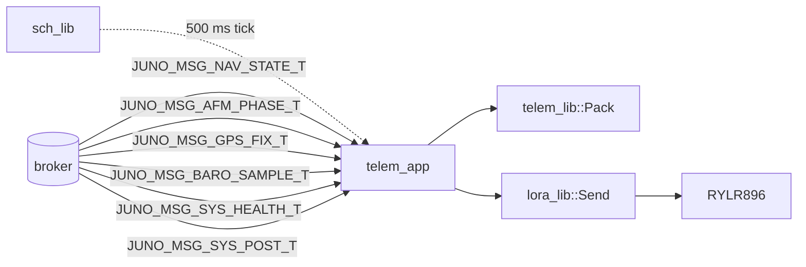

# Juno FSW — telem_app Design (L2)

**Document type:** IEEE 1016 Software Design Description
**Module:** `telem_app` (View / TDM-scheduled application)
**Coverage:** `SW-REQ-TELEM-APP-001` through `SW-REQ-TELEM-APP-011`
**Authoritative references (do not contradict):**
`docs/design/conventions.md` (cross-module idioms, naming, vocabulary, app lifecycle §1.4),
`docs/design/system/system_design.md` (composition root, schedule, message catalog),
`libjuno/include/juno/app/app_api.hpp` (canonical `APP_ROOT_T` / `APP_API_T`).

---

<!-- @{"design": ["SW-REQ-TELEM-APP-001", "SW-REQ-TELEM-APP-002", "SW-REQ-TELEM-APP-003", "SW-REQ-TELEM-APP-005", "SW-REQ-TELEM-APP-006", "SW-REQ-TELEM-APP-010"]} -->
## 1. Purpose and Scope

`telem_app` is the View-layer FSW application that publishes the live downlink stream. Once per scheduler tick (2 Hz, `kTelemAppPeriodMs = 500`), `OnProcess` snapshots the latest navigation, flight-phase, GPS-fix, baro, and system-health/POST messages from the broker, delegates packet composition to `telem_lib`, hands the resulting bytes to `lora_lib` for transmission over the RYLR896 LoRa radio, and surfaces the per-tick transmit outcome through the in-memory app state for `sys_app` health rollup. The app addresses requirements `SW-REQ-TELEM-APP-001` through `SW-REQ-TELEM-APP-011`.

In scope: TDM-driven control flow at 2 Hz (`-001`), bus subscriptions for the inputs that compose a packet (`-002`), invocation of `telem_lib::Pack` (`-003`), embedding the live health bitmap (`-004`), invocation of `lora_lib::Send` (`-005`), continuous run from power-on through external power loss including post-landing recovery beacon (`-006`, `-010`), tolerance to transmit failure with no backoff (`-007`), publishing radio-health observability (`-008`), POSIX/Pico2 functional equivalence (`-009`), deterministic output for identical inputs (`-011`).

Out of scope: packet byte-format and integrity field (`telem_lib`, `SW-REQ-TELEM-001..012`); UART / AT-command transport, LoRa configuration, retries (`lora_lib`, `SW-REQ-LORA-001..012`); SD-card recording (`mlog_app`); GPS UTC handling beyond passing the GPS fix message through (`gps_app`); per-sensor health bit ownership outside radio (each driver/app sets its own bit in `JUNO_MSG_SYS_HEALTH_T`).

---

## 2. Definitions and Abbreviations

Cross-module vocabulary (phase enum, time base, frames, status semantics, message naming, scheduler period units, body axes, memory-ownership invariants, POSIX/Pico2 split, **app lifecycle hooks per §1.4**) is defined in `docs/design/conventions.md` §1.4 / §4 / §5 / §6 and is **not** redefined here. This module-local table covers terms specific to the telem_app design.

| Term | Meaning |
|------|---------|
| Snapshot | The set of latest-known bus inputs read at the start of one `OnProcess` cycle |
| Pack | The `telem_lib` operation that composes packet fields and serializes to bytes |
| Send | The `lora_lib` operation that hands bytes to the RYLR896 driver for transmission |
| MTU | LoRa maximum transmission unit (≤ 240 B for the RYLR896 default profile) |
| Tx-busy | Internal state where the previous tick's `Send` has not yet released the radio |
| Backpressure | Per-tick policy that drops the new pack/send when `lora_lib` is still busy |
| Tx-status | One of {`OK`, `FAIL`, `BUSY`} captured per tick from `lora_lib::Send` |

---

<!-- @{"design": ["SW-REQ-TELEM-APP-001", "SW-REQ-TELEM-APP-002", "SW-REQ-TELEM-APP-003", "SW-REQ-TELEM-APP-005", "SW-REQ-TELEM-APP-009"]} -->
## 3. System Overview

### 3.1 MVC layer mapping

| Layer | Realization | Role for telem_app |
|-------|-------------|--------------------|
| View (App) | `juno::telem_app::TELEM_APP_T` (embeds `juno::app::APP_ROOT_T tRoot`) | Owns state machine, snapshots bus, drives lib calls, surfaces Tx status |
| Controller (Lib) | `juno::telem::TELEM_LIB_ROOT_T`, `juno::lora::LORA_LIB_ROOT_T` | Pack and transport |
| Model (Bus) | `juno::sb::BROKER_ROOT_T<JUNO_MSG_BUS_VARIANT_T, 8, 64>` | Carries inputs in (telem_app publishes nothing; the radio is the egress) |

The app contains **no** packet composition logic, no CRC/integrity computation, no UART I/O — those belong to `telem_lib` and `lora_lib` respectively (`SW-REQ-TELEM-011`, `SW-REQ-LORA-002`). The app is intentionally a thin scheduler-glue layer per `architecture.md`. Its lifecycle is the canonical `juno::app::APP_API_T { OnStart, OnProcess, OnExit }` triple from `libjuno/include/juno/app/app_api.hpp` (`docs/design/conventions.md` §1.4).

### 3.2 Module composition (telem_app in context)



### 3.3 Header and source layout

```
apps/telem_app/include/telem_app/telem_app.hpp     (TELEM_APP_T, kTelemAppPeriodMs, TelemAppInit)
apps/telem_app/src/telem_app.cpp                   (TelemApp_OnStart/OnProcess/OnExit; static APP_API_T tApi)
```

`TELEM_APP_T` aggregates `juno::app::APP_ROOT_T tRoot;` as its **first** member (`docs/design/conventions.md` §1.4). There is **no** parallel `TELEM_APP_ROOT_T` and **no** bespoke `TELEM_APP_API_T`; the lifecycle vtable is the canonical LibJuno-published `juno::app::APP_API_T { OnStart, OnProcess, OnExit }`. The app has no platform-specific source split. POSIX/Pico2 functional equivalence (`SW-REQ-TELEM-APP-009`) follows from: (a) the app is platform-agnostic glue, (b) all platform variation lives in `telem_lib` and `lora_lib::*_IMPL_T`, (c) the bus broker and time-root behavior are identical across targets (`docs/design/conventions.md` §6).

---

<!-- @{"design": ["SW-REQ-TELEM-APP-001", "SW-REQ-TELEM-APP-002", "SW-REQ-TELEM-APP-003", "SW-REQ-TELEM-APP-004", "SW-REQ-TELEM-APP-005", "SW-REQ-TELEM-APP-007", "SW-REQ-TELEM-APP-008", "SW-REQ-TELEM-APP-011"]} -->
## 4. Interface Definitions

### 4.1 Namespace, types, constants

```cpp
// apps/telem_app/include/telem_app/telem_app.hpp
#pragma once
#include "juno/app/app_api.hpp"
#include "juno/module.h"
#include "juno/module.hpp"
#include "juno/status.h"
#include "juno/sb/broker_api.hpp"
#include "juno/time/time_api.hpp"
#include "telem_lib/telem_api.hpp"
#include "lora_lib/lora_api.hpp"
#include <cstddef>
#include <cstdint>

namespace juno::telem_app
{

static constexpr uint32_t kTelemAppPeriodMs = 500;   // 2 Hz, SW-REQ-SYS-019 / SW-REQ-TELEM-APP-001
static constexpr size_t   kPacketBufBytes   = 240;   // RYLR896 LoRa MTU bound

struct TELEM_APP_T
{
    // First member — canonical LibJuno app aggregate (docs/design/conventions.md §1.4).
    juno::app::APP_ROOT_T tRoot;

    // Injected dependencies (wired by TelemAppInit; non-owning).
    juno::telem::TELEM_LIB_ROOT_T                                              *_ptTelemLib;
    juno::lora::LORA_LIB_ROOT_T                                                *_ptLora;
    juno::sb::BROKER_ROOT_T<JUNO_MSG_BUS_VARIANT_T, 8, 64>                     *_ptBus;
    juno::time::TIME_ROOT_T                                                    *_ptTime;

    // Caller-owned packet scratch buffer (no heap; SW-REQ-SYS-050).
    uint8_t  _atPacketBuf[kPacketBufBytes];
    size_t   _zPacketLen;
    uint64_t _u64TickIndex;
    uint8_t  _eState;          // see §5
    uint8_t  _eLastTxStatus;   // OK | FAIL | BUSY
};

// Free setup function (no API vtable here — the lifecycle vtable is APP_API_T).
JUNO_STATUS_T TelemAppInit(
    TELEM_APP_T                                                                &tApp,
    juno::telem::TELEM_LIB_ROOT_T                                              &tTelemLib,
    juno::lora::LORA_LIB_ROOT_T                                                &tLora,
    juno::sb::BROKER_ROOT_T<JUNO_MSG_BUS_VARIANT_T, 8, 64>                     &tBus,
    juno::time::TIME_ROOT_T                                                    &tTime,
    JUNO_FAILURE_HANDLER_T                                                      pfcnFailureHandler,
    JUNO_USER_DATA_T                                                           *pvUserData
) noexcept;

} // namespace juno::telem_app
```

`TELEM_APP_T` is trivially constructible (`docs/design/conventions.md` §1.3): no constructors, no destructors. `tRoot` (the canonical `juno::app::APP_ROOT_T`) is the **only** vtable carrier — the per-tick scheduler dispatches via `tRoot.ptApi->OnProcess(tRoot)` and the composition root invokes `tRoot.ptApi->OnStart(tRoot)` once before `juno::sch::SCH_API_T<8, 200>::Execute()` enters the cyclic-executive loop (`docs/design/system/system_design.md` §3.3 / §8.1).

### 4.2 Function contracts

The three lifecycle hooks are **file-scope `static`** functions inside `apps/telem_app/src/telem_app.cpp`. Each takes `juno::app::APP_ROOT_T &tApp` and downcasts to `TELEM_APP_T &` via `JUNO_MODULE_DERIVE` (`docs/design/conventions.md` §1.2). Every hook is `noexcept`.

#### 4.2.1 `juno::telem_app::TelemAppInit` (free setup function)

| Attribute | Value |
|-----------|-------|
| Signature | `JUNO_STATUS_T TelemAppInit(TELEM_APP_T &tApp, TELEM_LIB_ROOT_T &tTelemLib, LORA_LIB_ROOT_T &tLora, BROKER_ROOT_T<JUNO_MSG_BUS_VARIANT_T,8,64> &tBus, TIME_ROOT_T &tTime, JUNO_FAILURE_HANDLER_T pfcn, JUNO_USER_DATA_T *pv) noexcept` |
| Preconditions | `tTelemLib`, `tLora`, `tBus`, `tTime` already `New()`-/`TimeInit`-initialized; broker started; **`lora_lib::Configure` and `lora_lib::Probe` have already returned `SUCCESS`** in the composition root (per `lora_lib` design §4.2.1 / §4.2.6); `_atPacketBuf` zero-initialized via `.bss`. |
| Postconditions | Stores dependency pointers in `tApp._pt*`; assigns the file-scope `static juno::app::APP_API_T tApi{ &TelemApp_OnStart, &TelemApp_OnProcess, &TelemApp_OnExit }` into `tApp.tRoot` via `juno::app::AppInit(tApp.tRoot, tApi, pfcn, pv)`; `_eState = Initialized`; `_eLastTxStatus = OK`. **No bus subscribes here** — subscriptions occur in `OnStart` (per `docs/design/conventions.md` §1.4). |
| Error conditions | Propagates `juno::app::AppInit` failure status; returns `JUNO_STATUS_NULLPTR_ERROR` if any reference contract is violated (caught by `JUNO_ASSERT_EXISTS`). |
| Thread safety | Single-threaded; called once from composition root before `juno::sch::SCH_API_T<8, 200>::Execute()`. |
| Determinism | Same inputs → same wired pointers and identical zeroed buffers. |

Aggregate-init template (`apps/telem_app/src/telem_app.cpp`):

```cpp
namespace juno::telem_app
{
static JUNO_STATUS_T TelemApp_OnStart  (juno::app::APP_ROOT_T &tApp) noexcept;
static JUNO_STATUS_T TelemApp_OnProcess(juno::app::APP_ROOT_T &tApp) noexcept;
static JUNO_STATUS_T TelemApp_OnExit   (juno::app::APP_ROOT_T &tApp) noexcept;

JUNO_STATUS_T TelemAppInit(
    TELEM_APP_T &tApp,
    juno::telem::TELEM_LIB_ROOT_T &tTelemLib,
    juno::lora::LORA_LIB_ROOT_T &tLora,
    juno::sb::BROKER_ROOT_T<JUNO_MSG_BUS_VARIANT_T, 8, 64> &tBus,
    juno::time::TIME_ROOT_T &tTime,
    JUNO_FAILURE_HANDLER_T pfcnFailureHandler,
    JUNO_USER_DATA_T *pvUserData
) noexcept
{
    tApp._ptTelemLib = &tTelemLib;
    tApp._ptLora     = &tLora;
    tApp._ptBus      = &tBus;
    tApp._ptTime     = &tTime;
    static const juno::app::APP_API_T tApi {
        &TelemApp_OnStart, &TelemApp_OnProcess, &TelemApp_OnExit
    };
    return juno::app::AppInit(tApp.tRoot, tApi, pfcnFailureHandler, pvUserData);
}
}
```

The static `APP_API_T tApi{}` is the **sole file-scope datum** in `telem_app.cpp` (`docs/design/conventions.md` §5 rule 3); it is read-only after construction.

#### 4.2.2 `TelemApp_OnStart`

| Attribute | Value |
|-----------|-------|
| Signature | `static JUNO_STATUS_T TelemApp_OnStart(juno::app::APP_ROOT_T &tApp) noexcept` |
| Preconditions | `TelemAppInit` returned `SUCCESS`; `lora_lib::Configure`/`Probe` already complete in composition root (radio is in `Idle`); `tApp.tRoot.ptApi` non-null (`JUNO_ASSERT_EXISTS`). |
| Postconditions | Downcast `JUNO_MODULE_DERIVE` to `TELEM_APP_T&`; subscribes (latest-known snapshot) to `JUNO_MSG_GPS_FIX_T`, `JUNO_MSG_BARO_SAMPLE_T`, `JUNO_MSG_NAV_STATE_T`, `JUNO_MSG_AFM_PHASE_T`, `JUNO_MSG_SYS_HEALTH_T`, `JUNO_MSG_SYS_POST_T` on `*_ptBus`; `_eState = Running`. **Does not** invoke `lora_lib::Configure` (already done; recovery beacon reuses boot-time config — `SW-REQ-TELEM-APP-010`). |
| Error conditions | Propagates broker subscribe failure status via `JUNO_ASSERT_SUCCESS`; `JUNO_STATUS_NULLPTR_ERROR` on `JUNO_ASSERT_EXISTS` violation. |
| Thread safety | Single-threaded; invoked once by composition root before scheduler `Execute()`. |
| Determinism | Same broker → same subscribe handles; identical post-conditions across POSIX/Pico2 (`SW-REQ-TELEM-APP-009`). |

#### 4.2.3 `TelemApp_OnProcess`

| Attribute | Value |
|-----------|-------|
| Signature | `static JUNO_STATUS_T TelemApp_OnProcess(juno::app::APP_ROOT_T &tApp) noexcept` |
| Preconditions | `OnStart` completed; called by `juno::sch::SCH_API_T<8, 200>::Execute()` once every `kTelemAppPeriodMs` ms. |
| Per-tick step order | (1) `juno::lora::Tick(*_ptLora)` — advances the lora_lib FSM so long-tail AT responses resolve regardless of whether a fresh `Send()` is issued this tick (`lora_lib` §4.2.3); (2) `juno::lora::IsBusy(*_ptLora)` returns `RESULT_T<bool>` — unwrap via `JUNO_ASSERT_OK(...)` then read `.tOk` to drive the §5 state machine; (3) if not busy: snapshot 6 inputs → `telem_lib::Pack` → `lora_lib::Send`; if busy: skip Pack/Send, set `_eLastTxStatus = BUSY`. |
| Postconditions | If radio is free: latest snapshot is packed and sent; `_eLastTxStatus` updated to `OK` or `FAIL`; `_zPacketLen` records the packed size; the radio-health observable is current (`SW-REQ-TELEM-APP-008`). If radio is busy: state transitions to `SendBusy` with no new pack or send (`SW-REQ-TELEM-APP-007` continuation). In both cases, `juno::lora::Tick` has been called exactly once at the top of the cycle so the lora_lib FSM cannot dangle in `TRANSMITTING` (`lora_lib` §4.2.3). The post-landing recovery beacon (`SW-REQ-SYS-048` / `SW-REQ-TELEM-APP-010`) is identical: `OnProcess` continues at 2 Hz indefinitely after `JUNO_PHASE_LANDING` until external power is removed. |
| Error conditions | `lora_lib::Send` failure does **not** halt the cycle (`SW-REQ-TELEM-APP-007`); the failure is recorded in `_eLastTxStatus` and surfaces through `lora_lib::IsHealthy()` to `sys_app`. `telem_lib::Pack` failure logs via the failure handler and skips the send. `OnProcess` returns `JUNO_STATUS_SUCCESS` so the scheduler dispatches the next tick. |
| Thread safety | Single-threaded; the scheduler dispatches at most one `OnProcess` at a time. |
| Determinism | Given identical sequences of bus inputs and identical `lora_lib::Send` outcomes, the byte sequence handed to `lora_lib::Send` is identical (`SW-REQ-TELEM-APP-011`); identical across POSIX/Pico2 (`SW-REQ-TELEM-APP-009`). |

#### 4.2.4 `TelemApp_OnExit`

| Attribute | Value |
|-----------|-------|
| Signature | `static JUNO_STATUS_T TelemApp_OnExit(juno::app::APP_ROOT_T &tApp) noexcept` |
| Preconditions | Scheduler has stopped dispatching `OnProcess`. |
| Postconditions | Returns `JUNO_STATUS_SUCCESS`. **No-op on Pico2** — flight FSW never reaches `OnExit` (`SW-REQ-SYS-047`); only POSIX unit tests / Trick teardown invoke it (`docs/design/conventions.md` §1.4). The radio is **not** torn down here (lora_lib has no `Deinit` and `lora_lib::Configure` from boot persists). |
| Error conditions | None. |
| Thread safety | Single-threaded; called once. |

The lifecycle vtable is wired **once** via the `static const juno::app::APP_API_T tApi{...}` inside `TelemAppInit` and is never reassigned (`docs/design/conventions.md` §1.2 / §5).

---

<!-- @{"design": ["SW-REQ-TELEM-APP-001", "SW-REQ-TELEM-APP-006", "SW-REQ-TELEM-APP-007", "SW-REQ-TELEM-APP-010"]} -->
## 5. State Machines

The app's internal state machine governs `OnProcess`-cycle behavior in the presence of LoRa send-busy backpressure. It is **not** a vehicle phase machine (that lives in `afm_app` per `docs/design/conventions.md` §4.1). Phase has no effect on whether telem_app runs (`SW-REQ-TELEM-APP-006`, `-010`, and `SW-REQ-TELEM-006` enforce phase-independent emission).

```mermaid
stateDiagram-v2
    [*] --> Uninitialized
    Uninitialized --> Initialized: TelemAppInit returns SUCCESS
    Initialized --> Running: OnStart subscribes successfully
    Running --> Running: OnProcess: pack + send OK; _eLastTxStatus=OK
    Running --> SendBusy: OnProcess: lora_lib::IsBusy reports true
    Running --> Failed: OnStart wiring contract violated (NULLPTR / subscribe fail)
    SendBusy --> Running: OnProcess: radio free; pack + send issued this tick
    SendBusy --> SendBusy: OnProcess: radio still busy; skip pack/send (no backoff)
    Failed --> Failed: OnProcess: no-op, returns prior status; failure handler invoked once
```

State semantics (numbered for traceability):

1. **Uninitialized** — `_eState` after `.bss` zero-init. Neither `OnStart` nor `OnProcess` is defined; the composition root must call `TelemAppInit` first.
2. **Initialized** — Reached after `TelemAppInit` returns `SUCCESS`. `tRoot.ptApi` is wired but no broker subscriptions exist yet. The composition root must call `OnStart` before scheduler dispatch.
3. **Running** — Nominal. Each tick: snapshot the 6 inputs, call `telem_lib::Pack`, call `lora_lib::Send`; on `SUCCESS` `_eLastTxStatus = OK`. Recovery beacon (`SW-REQ-SYS-048`) is also `Running` — there is no separate post-landing sub-state.
4. **SendBusy** — `lora_lib::IsBusy` (after `JUNO_ASSERT_OK` unwrap of its `RESULT_T<bool>`) reported `true` because the radio's AT-command response from the previous tick has not landed. The transition driver out of this state is `lora_lib::Tick`, which telem_app calls **at the top of every `OnProcess` cycle** (before the IsBusy check) so the lora_lib FSM can advance from `TRANSMITTING` → `IDLE` even on ticks where telem_app issues no fresh `Send()` (`lora_lib` §4.2.3). Without `Tick`, lora_lib would never leave `TRANSMITTING` and SendBusy would be a permanent absorbing state. Backpressure policy: **drop** this tick's pack (no queue, no retry next tick beyond re-checking the radio). Rationale: LoRa traffic is best-effort and the next 500 ms tick will produce a fresher snapshot — old data is not held over (`SW-REQ-TELEM-APP-007`, no backoff).
5. **Failed** — A structural wiring failure detected at `OnStart` time (e.g., null root reference, broker subscribe failure). The app is inert in this state. Test only — not reachable in nominal flight given the `.bss`-only composition root.

The state machine has no `Recovery` sub-state; post-landing operation is identical to `Running` (`SW-REQ-TELEM-APP-010`). The recovery beacon is simply continued `OnProcess` at the same 500 ms cadence until external power is removed (`SW-REQ-SYS-047`, `SW-REQ-SYS-048`). LoRa configuration parameters do not change post-landing.

---

<!-- @{"design": ["SW-REQ-TELEM-APP-002", "SW-REQ-TELEM-APP-003", "SW-REQ-TELEM-APP-004", "SW-REQ-TELEM-APP-005", "SW-REQ-TELEM-APP-008"]} -->
## 6. Data Flow

### 6.1 Subscriptions (via `OnStart`)

Per `docs/design/system/system_design.md` §4 (authoritative bus catalog) and `SW-REQ-TELEM-APP-002`, `telem_app` subscribes to the latest-known value of:

| Message type | Publisher | Period | Field used by telem_app |
|--------------|-----------|--------|--------------------------|
| `JUNO_MSG_NAV_STATE_T` | `nav_app` | 10 ms | `tPosLla[3]` (geodetic deg/deg/m HAE), `tVelNed[3]` (m/s NED), `tAttQuat[4]` (w,x,y,z body→NED), `bValid` — exact field shape per `docs/design/nav/design.md` §4.1 |
| `JUNO_MSG_AFM_PHASE_T` | `afm_app` | 10 ms (publish-on-change) | `ePhase` (`JUNO_PHASE_T`), `tTransitionUs` |
| `JUNO_MSG_GPS_FIX_T` | `gps_app` | 200 ms | `dLatDeg`, `dLonDeg`, `fAltMHae`, `tVelNed[3]`, `eFixQuality`, `bValid` |
| `JUNO_MSG_BARO_SAMPLE_T` | `baro_app` | 50 ms | `fPressurePa`, `fAltMHae`, `bValid` |
| `JUNO_MSG_SYS_HEALTH_T` | `sys_app` | 100 ms | `u32HealthBitmap`, per-sensor flags |
| `JUNO_MSG_SYS_POST_T` | `sys_app` | one-shot | `tTimestampUs`, per-sensor pass/fail bitmap |

Snapshot semantics: at the start of each `OnProcess` the app reads the broker's **latest-known** value for each subscription (latch-on-publish; subscriber sees an immutable copy per `docs/design/system/system_design.md` §6). When the broker has no message yet for a topic (e.g., GPS still acquiring fix at boot), the snapshot field's `bValid = false` propagates downstream and `telem_lib::Pack` produces a packet with the validity flag set accordingly (`SW-REQ-TELEM-012`).

### 6.2 Publications

`telem_app` **publishes nothing** on the software bus. The radio is the egress: packed bytes are handed to `lora_lib::Send` and downlinked to the ground station. Mission-log capture of the as-transmitted byte stream is satisfied by `mlog_app` subscribing directly to the same upstream messages telem_app subscribes to (the SD log records are independently composed by `mlog_lib`); telem_app is not the source of the on-bus packet mirror in the current Workstream-B1 architecture.

Radio-health observability (`SW-REQ-TELEM-APP-008`) is satisfied by `sys_app` polling `juno::lora::IsHealthy(*_ptLora)` at 100 ms cadence and embedding the radio bit in `JUNO_MSG_SYS_HEALTH_T.u32HealthBitmap` (`SW-REQ-LORA-006`/`-007`/`-008`, `SW-REQ-SYS-031`/`-061`). telem_app's per-tick `_eLastTxStatus` is the proximate cause that drives that bit through `lora_lib`'s internal `bHealthy`.

### 6.3 Direction diagram

```
broker -----[NAV_STATE]-----> telem_app
broker -----[AFM_PHASE]-----> telem_app
broker -----[GPS_FIX]-------> telem_app
broker -----[BARO_SAMPLE]---> telem_app   --(snapshot)--> telem_lib::Pack --(bytes)--> lora_lib::Send
broker -----[SYS_HEALTH]----> telem_app                                                        |
broker -----[SYS_POST]------> telem_app                                                        v
                                                                                          (RYLR896)
sys_app --(IsHealthy poll)--> lora_lib --> JUNO_MSG_SYS_HEALTH_T.u32HealthBitmap
```

---

<!-- @{"design": ["SW-REQ-TELEM-APP-001", "SW-REQ-TELEM-APP-002", "SW-REQ-TELEM-APP-003", "SW-REQ-TELEM-APP-005", "SW-REQ-TELEM-APP-007", "SW-REQ-TELEM-APP-008"]} -->
## 7. Sequence Diagrams

### 7.1 OnStart (composition root → subscribe handles; no radio Configure here)

```mermaid
sequenceDiagram
    participant main as composition root
    participant lora_lib
    participant telem_app
    participant broker

    Note over main,lora_lib: Pre-OnStart (composition root):<br/>juno::lora::Configure(*_ptLora, tCfg)<br/>juno::lora::Probe(*_ptLora)<br/>both must return SUCCESS before sch::Execute starts
    main->>telem_app: TelemAppInit(tApp, tTelemLib, tLora, tBus, tTime, pfcn, pv)
    Note over telem_app: static APP_API_T tApi{ OnStart, OnProcess, OnExit };<br/>juno::app::AppInit(tApp.tRoot, tApi, pfcn, pv)
    telem_app-->>main: SUCCESS
    main->>telem_app: tApp.tRoot.ptApi->OnStart(tApp.tRoot)
    Note over telem_app: JUNO_MODULE_DERIVE downcast to TELEM_APP_T&
    telem_app->>broker: Subscribe(JUNO_MSG_NAV_STATE_T)
    telem_app->>broker: Subscribe(JUNO_MSG_AFM_PHASE_T)
    telem_app->>broker: Subscribe(JUNO_MSG_GPS_FIX_T)
    telem_app->>broker: Subscribe(JUNO_MSG_BARO_SAMPLE_T)
    telem_app->>broker: Subscribe(JUNO_MSG_SYS_HEALTH_T)
    telem_app->>broker: Subscribe(JUNO_MSG_SYS_POST_T)
    telem_app-->>main: SUCCESS (state := Running)
    main->>main: tSch.ptApi->Execute(tSch)  // SCH_API_T<8,200>::Execute
```

### 7.2 Nominal 500 ms OnProcess (snapshot → Pack → Send)

```mermaid
sequenceDiagram
    participant sch as SCH_API_T<8,200>::Execute
    participant telem_app
    participant broker
    participant telem_lib
    participant lora_lib

    sch->>telem_app: tRoot.ptApi->OnProcess(tRoot) at t = k * 500 ms
    telem_app->>lora_lib: Tick()
    Note over telem_app,lora_lib: Advances lora_lib FSM even with no fresh Send;<br/>lora_lib §4.2.3
    telem_app->>lora_lib: IsBusy()
    lora_lib-->>telem_app: RESULT_T<bool>{SUCCESS, false}
    telem_app->>broker: ReceiveLatest(JUNO_MSG_NAV_STATE_T)
    telem_app->>broker: ReceiveLatest(JUNO_MSG_AFM_PHASE_T)
    telem_app->>broker: ReceiveLatest(JUNO_MSG_GPS_FIX_T)
    telem_app->>broker: ReceiveLatest(JUNO_MSG_BARO_SAMPLE_T)
    telem_app->>broker: ReceiveLatest(JUNO_MSG_SYS_HEALTH_T)
    telem_app->>broker: ReceiveLatest(JUNO_MSG_SYS_POST_T)
    Note over telem_app: snapshot complete; SW-REQ-TELEM-APP-002
    telem_app->>telem_lib: Pack(snapshot, _atPacketBuf, kPacketBufBytes)
    telem_lib-->>telem_app: RESULT_T<size_t>{SUCCESS, _zPacketLen}
    telem_app->>lora_lib: Send(_atPacketBuf, _zPacketLen)
    lora_lib-->>telem_app: JUNO_STATUS_SUCCESS
    Note over telem_app: _eLastTxStatus = OK; SW-REQ-TELEM-APP-008
    telem_app-->>sch: JUNO_STATUS_SUCCESS
```

### 7.3 Tx-busy backpressure (previous Send not done within 500 ms)

```mermaid
sequenceDiagram
    participant sch as SCH_API_T<8,200>::Execute
    participant telem_app
    participant lora_lib

    sch->>telem_app: OnProcess() at t = k * 500 ms
    telem_app->>lora_lib: Tick()
    telem_app->>lora_lib: IsBusy()
    lora_lib-->>telem_app: RESULT_T<bool>{SUCCESS, true}
    Note over telem_app: state := SendBusy;<br/>SW-REQ-TELEM-APP-007: drop snapshot,<br/>do NOT call Pack or Send.<br/>_eLastTxStatus := BUSY
    telem_app-->>sch: JUNO_STATUS_SUCCESS
    sch->>telem_app: OnProcess() at t = (k+1) * 500 ms
    telem_app->>lora_lib: Tick()
    telem_app->>lora_lib: IsBusy()
    lora_lib-->>telem_app: RESULT_T<bool>{SUCCESS, false}
    Note over telem_app: state := Running; resume nominal flow
```

### 7.4 LoRa send failure (radio unhealthy → no halt)

```mermaid
sequenceDiagram
    participant sch as SCH_API_T<8,200>::Execute
    participant telem_app
    participant telem_lib
    participant lora_lib

    sch->>telem_app: OnProcess() at t = k * 500 ms
    telem_app->>lora_lib: Tick()
    telem_app->>lora_lib: IsBusy()
    lora_lib-->>telem_app: RESULT_T<bool>{SUCCESS, false}
    telem_app->>telem_lib: Pack(snapshot, buf, max)
    telem_lib-->>telem_app: RESULT_T<size_t>{SUCCESS, _zPacketLen}
    telem_app->>lora_lib: Send(buf, len)
    lora_lib-->>telem_app: JUNO_STATUS_WRITE_ERROR
    Note over telem_app: SW-REQ-TELEM-APP-007: continue; no backoff.<br/>_eLastTxStatus = FAIL
    telem_app-->>sch: JUNO_STATUS_SUCCESS
    sch->>telem_app: OnProcess() at t = (k+1) * 500 ms
    Note over telem_app: next tick proceeds normally
```

---

<!-- @{"design": ["SW-REQ-TELEM-APP-001", "SW-REQ-TELEM-APP-006", "SW-REQ-TELEM-APP-009", "SW-REQ-TELEM-APP-010", "SW-REQ-TELEM-APP-011"]} -->
## 8. Timing and Scheduling Analysis

### 8.1 Period

`static constexpr uint32_t juno::telem_app::kTelemAppPeriodMs = 500;` corresponds to 2 Hz, the rate mandated by `SW-REQ-SYS-019` and inherited by `SW-REQ-TELEM-APP-001`. Naming follows `docs/design/conventions.md` §4.5; declaration is in the public header per the same convention. The composition root populates `juno::sch::SCH_ROOT_T<8, 200>::tArrSchTable[i][7]` with `&tTelemApp.tRoot` at `i % 100 == 0` (every 500 ms; `system_design.md` §8.1).

### 8.2 Per-tick budget

`telem_app::OnProcess` must complete in well under 500 ms to leave headroom for the other apps that share the same tick boundary (per `docs/design/system/system_design.md` §8.2, the t=0 tick can simultaneously dispatch `imu_app + nav_app + afm_app + mlog_app + baro_app + sys_app + gps_app + telem_app` and must finish within the 5 ms IMU base period). The design therefore targets a worst-case in-tick budget of **≤ 500 µs** for the synchronous path of `OnProcess`:

| Step | Estimated cost | Notes |
|------|-----------------|-------|
| `lora_lib::Tick` | ≤ 50 µs | Top of every tick; advances FSM, drains AT response if landed (`lora_lib` §4.2.3) |
| `lora_lib::IsBusy` (`RESULT_T<bool>` unwrap) | < 10 µs | Single state read; `JUNO_ASSERT_OK` then read `.tOk` |
| 6× broker `ReceiveLatest` snapshots | < 60 µs | Constant-time copy from broker latest cell |
| `telem_lib::Pack` | ≤ 200 µs | Pure encoder, ≤ 240 B output, no I/O (`SW-REQ-TELEM-011`) |
| `lora_lib::Send` (kick-off) | ≤ 100 µs | Non-blocking issue; UART AT-command queued, not awaited |
| Bookkeeping (state, status, tick index) | < 50 µs | Trivial assignments |

**Coordination with lora_lib non-blocking semantics.** `lora_lib::Send` is non-blocking by contract (`SW-REQ-LORA-003`). Long AT-command/response sequences are handled inside `lora_lib` across multiple sub-ticks of its own state machine (visible to telem_app only through `IsBusy()`/`IsHealthy()`). telem_app never spins waiting for transmission; the 500 ms slot only needs to accommodate the synchronous "kick-off" portion of `Send`. Whenever a previous send is still completing when the next 500 ms tick fires, the `SendBusy` state of §5 dictates the new pack/send is **dropped** (no queue, no backoff), preserving determinism (`SW-REQ-TELEM-APP-011`) and avoiding overflow.

### 8.3 Downstream consumers

`telem_app` has no in-FSW downstream consumers — it publishes nothing on the bus; the radio is the sole egress. `sys_app` polls `lora_lib::IsHealthy()` directly (not telem_app state) and is unaffected by telem_app's per-tick scheduling.

### 8.4 Continuous run and composition-root prerequisites

`telem_app` is registered with the scheduler in the composition root and continues `OnProcess` every 500 ms from power-on until external power is removed (`SW-REQ-TELEM-APP-006`, mirroring `SW-REQ-SYS-047`). Phase transitions, AFM unavailability, sensor faults, GPS dropouts, and post-landing recovery (`SW-REQ-TELEM-APP-010`) are all transparent to the scheduler — none of them gate `OnProcess`.

**Composition-root prerequisite (preserved):** before `juno::sch::SCH_API_T<8, 200>::Execute()` starts dispatching `tTelemApp.tRoot.ptApi->OnProcess`, the composition root must have called `lora_lib::Configure` and `lora_lib::Probe` successfully on the injected `LORA_LIB_ROOT_T` (per `lora_lib` §4.2.1 / §4.2.6). `OnProcess` assumes the radio is configured; it does not invoke `Configure` itself. `OnStart` likewise does **not** invoke `Configure` — the radio is brought up in the composition root before any app's `OnStart`. Recovery beaconing (`SW-REQ-TELEM-APP-010`) reuses the boot-time radio configuration without re-`Configure`.

---

<!-- @{"design": ["SW-REQ-TELEM-APP-007", "SW-REQ-TELEM-APP-008"]} -->
## 9. Error Handling Strategy

System-level error handling (`docs/design/system/system_design.md` §9) applies; the app-specific specializations are:

1. **Status propagation.** Every internal call uses `JUNO_ASSERT_SUCCESS`, `JUNO_ASSERT_OK`, `JUNO_ASSERT_SOME`, `JUNO_ASSERT_EXISTS`. Bare `if`-return is a review failure (`docs/design/conventions.md` §4.3).
2. **Failure handler.** Diagnostic only; never alters control flow. Wired at `TelemAppInit` from the composition root through `juno::app::AppInit`; routed to `log_lib`.
3. **`telem_lib::Pack` failure.** Logged via failure handler; the tick is skipped (no Send issued); `_eLastTxStatus = FAIL`; `OnProcess` still returns `JUNO_STATUS_SUCCESS` to the scheduler so the next tick proceeds (`SW-REQ-TELEM-APP-007`).
4. **`lora_lib::Send` failure.** `_eLastTxStatus = FAIL`; the radio-health bit in `JUNO_MSG_SYS_HEALTH_T` is set by `sys_app` from `lora_lib::IsHealthy()` (`SW-REQ-LORA-007`, `SW-REQ-SYS-061`), satisfying `SW-REQ-TELEM-APP-008`. No backoff; the next 500 ms tick proceeds (`SW-REQ-TELEM-APP-007`).
5. **Tx-busy.** `_eState = SendBusy`; tick is dropped (no Pack, no Send, no per-tick error); `_eLastTxStatus = BUSY` so subsequent inspection sees the gap (`SW-REQ-TELEM-APP-007`).
6. **No exception unwinding.** Every public function and lifecycle hook is `noexcept` (`docs/design/conventions.md` §1.3 / §4.3); a stray `throw` would invoke `std::terminate`. `-fno-exceptions` is enforced project-wide (`SW-REQ-SYS-053`).
7. **No actuation, no auto-reboot.** Failures only update logs and health observability; never trigger schedule changes (`SW-REQ-SYS-004`, `SW-REQ-SYS-037`).

---

## 10. Memory Ownership

Per `docs/design/conventions.md` §5: every buffer is caller-owned, no `new`/`delete`/`malloc`, no global mutable state in libraries, no heap-backed STL containers. `telem_app` allocates **nothing** at runtime. The full inventory:

| Buffer / facility | Owner | Lifetime | Allocation site | Notes |
|-------------------|-------|----------|------------------|-------|
| `TELEM_APP_T` instance | composition root (`apps/main.cpp`) | program | static / `.bss` zero-init | Trivially constructible (`SW-REQ-SYS-050`); first member `juno::app::APP_ROOT_T tRoot` |
| `_atPacketBuf[kPacketBufBytes]` | `TELEM_APP_T` (caller) | program | embedded in `TELEM_APP_T` | ≤ 240 B; bound by RYLR896 LoRa MTU; satisfies `SW-REQ-TELEM-004` packet-size cap when consumed by `telem_lib::Pack` |
| Snapshot copies (nav, afm, gps, baro, sys-health, sys-post) | broker (latch) → app reads into stack-local POD | per-tick | scheduler stack frame | No retention across ticks — fresh read each tick |
| `_eState`, `_eLastTxStatus`, `_zPacketLen`, `_u64TickIndex` | `TELEM_APP_T` | program | embedded | Trivial scalar members |
| **`static const juno::app::APP_API_T tApi{}`** | factory `static` local in `telem_app.cpp` | program | read-only after init | **Sole file-scope datum** (`SW-REQ-SYS-051`; `docs/design/conventions.md` §5 rule 3); `{ &TelemApp_OnStart, &TelemApp_OnProcess, &TelemApp_OnExit }` |
| `juno::app::APP_ROOT_T tRoot` (inside `TELEM_APP_T`) | composition root via `TelemAppInit` | program | embedded | Wired once via `juno::app::AppInit`; never reassigned |
| Subscribed message storage | broker | program | broker's internal latch cells | `telem_app` never mutates received messages (`docs/design/system/system_design.md` §6) |
| Injected dependency pointers (`_ptTelemLib`, `_ptLora`, `_ptBus`, `_ptTime`) | composition root (referent) | program | embedded; pointer-only | Non-owning; libraries' own roots own their state |

Asserted invariants: zero dynamic allocation; zero global mutable state in the app or in any library it consumes; `_atPacketBuf` is the **only** packet-bytes storage (single-buffer policy keeps determinism trivially observable, `SW-REQ-TELEM-APP-011`); the buffer's typical fill is well below the 240 B cap because `telem_lib::Pack` enforces `SW-REQ-TELEM-004`.

---

## 11. Traceability

Per-section `<!-- @{"design": [...]} -->` tags above are authoritative; this table is descriptive consolidation. Every `SW-REQ-TELEM-APP-NNN` is mapped to at least one section.

| Req ID | Title | Section(s) |
|--------|-------|-----------|
| SW-REQ-TELEM-APP-001 | Scheduled at Two Hertz | §1, §3, §4.1, §5, §7.2, §8.1 |
| SW-REQ-TELEM-APP-002 | Subscribe to Telemetry Source Messages | §1, §3, §4.2.2, §6.1, §7.1 |
| SW-REQ-TELEM-APP-003 | Compose Packet via telem_lib | §1, §3, §4.2.3, §6, §7.2 |
| SW-REQ-TELEM-APP-004 | Embed Sensor Health Bitmap | §6.1 (snapshot of `JUNO_MSG_SYS_HEALTH_T`) |
| SW-REQ-TELEM-APP-005 | Transmit via lora_lib | §1, §3, §4.2.3 (Send + per-tick `lora_lib::Tick`), §6, §7.2, §10 |
| SW-REQ-TELEM-APP-006 | Continuous Operation From Power-On | §1, §5, §8.4 |
| SW-REQ-TELEM-APP-007 | Continue After Transmission Failure | §1, §4.2.3, §5 (SendBusy exits via `Tick`), §7.3, §7.4, §8.2, §9 |
| SW-REQ-TELEM-APP-008 | Publish Radio Health Status | §1, §4.2.3 (`IsBusy` `RESULT_T<bool>` unwrap), §6.2, §7.2, §7.4, §9 |
| SW-REQ-TELEM-APP-009 | POSIX and Pico2 Functional Equivalence | §3.3, §8 |
| SW-REQ-TELEM-APP-010 | Post-Landing Recovery Beacon | §1, §4.2.3, §5, §8.4 |
| SW-REQ-TELEM-APP-011 | Deterministic Telemetry Output | §3, §4.2.3, §8.2, §10 |

POSIX/Pico2 functional-equivalence statement (`SW-REQ-SYS-043` referred via `SW-REQ-TELEM-APP-009`): the `telem_app` source has no platform-conditional code; all platform variation is encapsulated by the injected `telem_lib` (single shared impl) and `lora_lib::*_IMPL_T` (per `docs/design/conventions.md` §6). Identical bus inputs produce identical packed-byte sequences across POSIX and Pico2 builds; deterministic encoding is delegated to `telem_lib` (`SW-REQ-TELEM-009`/`-010`). The lifecycle vtable (`juno::app::APP_API_T`) and the canonical `juno::app::APP_ROOT_T` aggregate are LibJuno-published types (`libjuno/include/juno/app/app_api.hpp`) shared verbatim by both targets.

### FLAGs raised

- **FLAG-APPINIT-SYMBOL** — The brief's aggregate-init template uses `juno::app::AppInit(tRoot, tApi, pfcn, pv)`. The current `libjuno/include/juno/app/app_api.hpp` declares `APP_ROOT_T` and `APP_API_T` but does **not** publish a free `AppInit(...)` function. This design follows the brief's template verbatim. Software Lead should confirm with LibJuno that `juno::app::AppInit` will be added to `app_api.hpp` (mirroring `juno::time::TimeInit` from `time_api.hpp`); otherwise the per-app design must aggregate-initialize `tApp.tRoot = { &tApi, pfcnFailureHandler, pvUserData }` directly.
