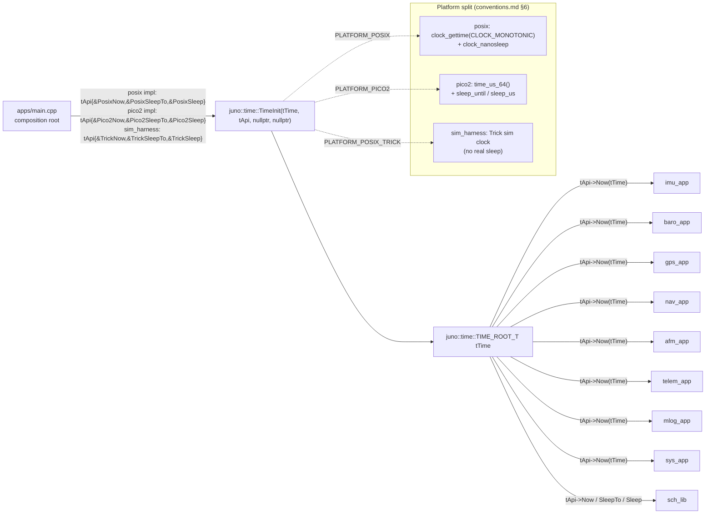
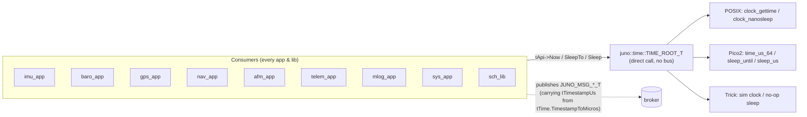
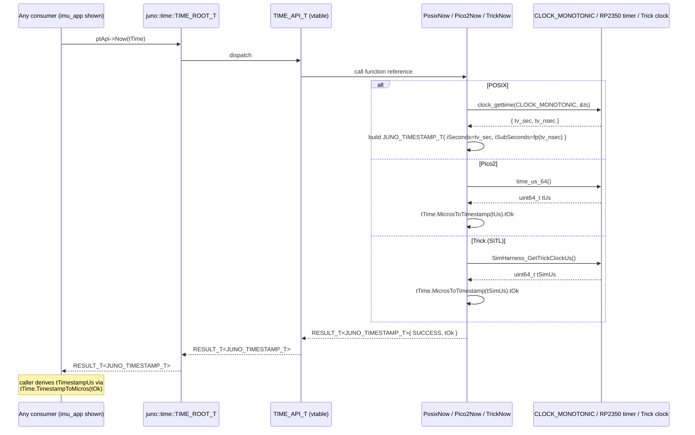

# Juno FSW — Time Library Design (L2)

**Document type:** IEEE 1016 Software Design Description
**Module:** `time_lib` (FT1 platform implementations of LibJuno's `juno::time` API)
**Public API header (LibJuno, canonical):** `libjuno/include/juno/time/time_api.hpp`
**FT1 platform impl headers:** `libs/time_lib/src/posix/time_posix.hpp`, `libs/time_lib/src/pico2/time_pico2.hpp`
**Authoritative for:** the three platform-specific function bodies that back `juno::time::TIME_API_T` (`Now`, `SleepTo`, `Sleep`) on POSIX and Pico2, and their wiring into `juno::time::TIME_ROOT_T` at the composition root.
**References (do not contradict):** `libjuno/include/juno/time/time_api.hpp` (canonical types), `docs/design/conventions.md` §1 / §4 / §5 / §6 / §7, `docs/design/system/system_design.md` §3.3 / §8.1 / §8.2 / §10.1, `docs/requirements/time/requirements.json`, `libjuno/include/juno/status.h`.

---

<!-- @{"design": ["SW-REQ-TIME-001", "SW-REQ-TIME-004", "SW-REQ-TIME-006", "SW-REQ-TIME-007"]} -->
## 1. Purpose and Scope

This document is the L2 design for the FT1 `time_lib` work product. **LibJuno already defines the canonical types** `juno::time::TIME_ROOT_T` and `juno::time::TIME_API_T { Now, SleepTo, Sleep }` in `libjuno/include/juno/time/time_api.hpp`, and provides every time math and unit-conversion routine (`AddTime`, `SubtractTime`, `TimestampToMicros`, `TimestampToNanos`, `TimestampToMillis`, `MicrosToTimestamp`, `NanosToTimestamp`, `MillisToTimestamp`, `TimestampToDouble`, `DoubleToTimestamp`) as non-static member functions of `TIME_ROOT_T`. **This design does not redefine any of those types or routines.** Its job is to specify, for FT1, the concrete bodies of the three platform-specific function references — `Now`, `SleepTo`, `Sleep` — for the POSIX and Pico2 builds, and the aggregate-initialized `TIME_API_T` instance the composition root binds into a `TIME_ROOT_T` via `juno::time::TimeInit`.

In scope: the POSIX and Pico2 implementations of `Now`, `SleepTo`, and `Sleep`; their preconditions, postconditions, error paths, blocking and determinism contracts; the aggregate-init pattern shared with the LibJuno example; the Trick SITL injection seam (`sim_harness` provides its own `TIME_API_T` impl). This addresses every requirement in `docs/requirements/time/requirements.json` (`SW-REQ-TIME-001` through `SW-REQ-TIME-007`).

Out of scope: redefining `TIME_ROOT_T` / `TIME_API_T` (LibJuno owns them); FSW-specific wrapper types — there are none and none are introduced here; any parallel `TIME_LIB_*` ROOT/API/IMPL types (explicitly forbidden by Option A); provider-callback injection of a sim-time function pointer into `time_lib` (the previously proposed `JUNO_TIME_PROVIDER_T` seam is withdrawn — sim harnesses inject sim time by supplying their own `TIME_API_T` impl, not by passing a callback to a Juno-provided impl); wall-clock / UTC time (handled by `gps_lib` per `SW-REQ-SYS-028`); scheduler tick generation (lives in `sch_lib`, which consumes this API).

---

## 2. Definitions and Abbreviations

Cross-module vocabulary — status semantics, the FSW time base in microseconds, the POSIX/Pico2 split — is defined in `docs/design/conventions.md` §4 and is **not** redefined here. Module-local terms only:

| Term | Meaning |
|------|---------|
| `JUNO_TIMESTAMP_T` | The canonical LibJuno timestamp struct — POD aggregate `{ JUNO_TIME_SECONDS_T iSeconds; JUNO_TIME_SUBSECONDS_T iSubSeconds; }` (`libjuno/include/juno/time/time_api.h`). All `Now / SleepTo / Sleep` arguments and returns use this struct. |
| `JUNO_TIMESTAMP_RESULT_T` | LibJuno `RESULT_T<JUNO_TIMESTAMP_T>` carrying status + payload. `Now` returns this. |
| `JUNO_TIME_US_T` | `using JUNO_TIME_US_T = uint64_t;` — the FSW message-field convention for sample-level timestamps (`conventions.md` §4.2). It is **derived** from a `Now()` read by calling `tTime.TimestampToMicros(tNow)` on the returned `JUNO_TIMESTAMP_T`. This module does not declare it; consumers obtain it through the LibJuno conversion routines. |
| `CLOCK_MONOTONIC` | POSIX clock id whose value is unaffected by wall-clock adjustments and never decreases (`man 2 clock_gettime`). The POSIX impl uses this clock and never `CLOCK_REALTIME`. |
| RP2350 hardware timer | The 64-bit free-running microsecond counter on the RP2350 (Pico 2). pico-sdk exposes it as `time_us_64()` via `pico/time.h`; pico-sdk also exposes `sleep_until(absolute_time_t)` and `sleep_us(uint64_t)`. |
| Trick SITL | The NASA Trick simulation built atop the POSIX object code (`SW-REQ-SYS-045`). Trick drives time via a `sim_harness`-provided `TIME_API_T` whose `Now` reads the Trick simulation clock. |

---

<!-- @{"design": ["SW-REQ-TIME-001", "SW-REQ-TIME-004", "SW-REQ-TIME-006", "SW-REQ-TIME-007"]} -->
## 3. System Overview

### 3.1 MVC layer mapping

The work product is a **Library (Controller)** under MVC (`system_design.md` §3.1). It has no app counterpart — every consumer obtains time directly via the injected `juno::time::TIME_ROOT_T &tTime` reference.

| Layer | Role |
|-------|------|
| View (App) | None. No app owns time. |
| Controller (Lib) | Two platform impls: `libs/time_lib/src/posix/time_posix.cpp` and `libs/time_lib/src/pico2/time_pico2.cpp`. Each defines the file-scope functions wired into `TIME_API_T` and a `static const TIME_API_T tApi{...};` literal. |
| Model (Bus) | None. `time_lib` does not publish or subscribe (§6). |

### 3.2 Composition context



Exactly **one** `TIME_ROOT_T tTime` exists at the composition root for the program lifetime. Every consumer holds a `juno::time::TIME_ROOT_T &` and dispatches via `tTime.ptApi->Now(tTime)` (or, for `Sleep` / `SleepTo`, through the same vtable). Time math and conversion are **member functions of `TIME_ROOT_T`** provided by LibJuno (`tTime.TimestampToMicros(tNow)`, `tTime.AddTime(...)`, etc.) and are platform-independent — there is no FT1 work product for them.

### 3.3 What FT1 produces (and does not)

| Item | Provided by | Notes |
|------|-------------|-------|
| `juno::time::TIME_ROOT_T` type | LibJuno | Single canonical type; FT1 does not derive or wrap it. |
| `juno::time::TIME_API_T` vtable struct | LibJuno | Holds three function refs: `Now`, `SleepTo`, `Sleep`. |
| `juno::time::TimeInit(...)` | LibJuno | The single canonical initializer. |
| Time math + conversion (`AddTime`, `SubtractTime`, `Timestamp{To,From}{Micros,Nanos,Millis,Double}`) | LibJuno | Non-static member functions on `TIME_ROOT_T`; platform-independent. |
| `Now`, `SleepTo`, `Sleep` POSIX bodies | **FT1 (this design)** | `libs/time_lib/src/posix/time_posix.cpp` |
| `Now`, `SleepTo`, `Sleep` Pico2 bodies | **FT1 (this design)** | `libs/time_lib/src/pico2/time_pico2.cpp` |
| `static const TIME_API_T tApi{...}` literal | **FT1 (this design)** | One per platform translation unit. |
| Trick SITL `Now / SleepTo / Sleep` | `sim_harness` (out of scope here, but specified in §4.4) | A separate `static const TIME_API_T` whose `Now` reads Trick's sim clock. |

---

<!-- @{"design": ["SW-REQ-TIME-001", "SW-REQ-TIME-002", "SW-REQ-TIME-003", "SW-REQ-TIME-004", "SW-REQ-TIME-005", "SW-REQ-TIME-006", "SW-REQ-TIME-007"]} -->
## 4. Interface Definitions

The canonical `juno::time::TIME_API_T` is reproduced verbatim from `libjuno/include/juno/time/time_api.hpp`:

```cpp
namespace juno { namespace time {

struct TIME_API_T
{
    RESULT_T<JUNO_TIMESTAMP_T> (&Now)    (const TIME_ROOT_T &tTime) noexcept;
    JUNO_STATUS_T              (&SleepTo)(const TIME_ROOT_T &tTime,
                                          JUNO_TIMESTAMP_T   tTimeToWakeup) noexcept;
    JUNO_STATUS_T              (&Sleep)  (const TIME_ROOT_T &tTime,
                                          JUNO_TIMESTAMP_T   tDuration) noexcept;
};

} } // namespace juno::time
```

Every function reference is `noexcept`. The first parameter is always a `const TIME_ROOT_T &`. None of these signatures are altered by FT1.

### 4.1 `Now` contract — POSIX

| Attribute | Value |
|-----------|-------|
| Signature | `RESULT_T<JUNO_TIMESTAMP_T> PosixNow(const TIME_ROOT_T &tTime) noexcept` |
| Source | `clock_gettime(CLOCK_MONOTONIC, &ts)`. `CLOCK_REALTIME` is forbidden — wall-clock adjustments would violate `SW-REQ-TIME-002`. |
| Conversion | `tOk.iSeconds = (JUNO_TIME_SECONDS_T)ts.tv_sec;` and `tOk.iSubSeconds` is filled by `tTime.NanosToTimestamp((uint64_t)ts.tv_nsec).tOk.iSubSeconds` (or by an inline scale of `ts.tv_nsec` through the LibJuno-published `kiSUBSECS_MAX`). The seconds field carries whole seconds; the subseconds field is the LibJuno fixed-point fraction over `kiSUBSECS_MAX`. |
| Preconditions | `tTime` already initialized via `juno::time::TimeInit`. |
| Postconditions | `tStatus == JUNO_STATUS_SUCCESS`; `tOk` is the current monotonic timestamp. The returned timestamp is non-decreasing across successive calls (`SW-REQ-TIME-002`). |
| Error conditions | Returns `tStatus = JUNO_STATUS_ERR` with `tOk` zeroed if `clock_gettime(CLOCK_MONOTONIC, ...)` reports failure. (Practically unreachable on POSIX.1-2008 targets; defensive only.) The injected failure handler is invoked diagnostically (`conventions.md` §4.3). |
| Thread safety | Re-entrant on stack; not thread-safe across threads (FSW is single-threaded — `system_design.md` §3). |
| Blocking | Non-blocking — VDSO-served on Linux, no syscall trap on the happy path (`SW-REQ-TIME-005`). |
| Determinism | O(1); no allocations; no exception unwinding. |

### 4.2 `Now` contract — Pico2

| Attribute | Value |
|-----------|-------|
| Signature | `RESULT_T<JUNO_TIMESTAMP_T> Pico2Now(const TIME_ROOT_T &tTime) noexcept` |
| Source | `time_us_64()` from `pico/time.h` — RP2350 64-bit hardware microsecond counter. |
| Conversion | `tOk = tTime.MicrosToTimestamp(time_us_64()).tOk;` — the LibJuno member function performs the µs → `{iSeconds, iSubSeconds}` split with the canonical fixed-point fraction. |
| Preconditions | `tTime` initialized; pico-sdk `stdlib_init_all()` already called by the composition root. |
| Postconditions | `tStatus == JUNO_STATUS_SUCCESS`; `tOk` is the current monotonic timestamp; non-decreasing across successive calls. |
| Error conditions | None — RP2350 hardware timer reads cannot fail. The function always returns `JUNO_STATUS_SUCCESS`. |
| Thread safety | Re-entrant on stack; single-core single-threaded usage assumed. |
| Blocking | Non-blocking — memory-mapped register read, a few cycles. |
| Determinism | O(1). |

### 4.3 `SleepTo` and `Sleep` contracts

`SleepTo(tTime, tWakeup)` blocks the calling thread until the absolute timestamp `tWakeup`; `Sleep(tTime, tDuration)` blocks for the relative duration `tDuration`. Both return `JUNO_STATUS_SUCCESS` on a normal return. Both honor monotonic time only.

| Attribute | POSIX | Pico2 |
|-----------|-------|-------|
| `SleepTo` body | `clock_nanosleep(CLOCK_MONOTONIC, TIMER_ABSTIME, &ts, NULL)` where `ts` is converted from `tWakeup` (whole `iSeconds` → `tv_sec`; subseconds → `tv_nsec` via LibJuno's fixed-point scaling, equivalent to `tTime.TimestampToNanos(tWakeup) % 1000000000`). | `sleep_until(at)` from pico-sdk where `at` is built from `tTime.TimestampToMicros(tWakeup).tOk`. (pico-sdk's `sleep_until` busy-waits internally for short residuals and uses the timer alarm for longer waits — chosen for FT1 because `sch_lib` always sleeps to the next 5 ms slot, well within the alarm-driven path.) |
| `Sleep` body | `clock_nanosleep(CLOCK_MONOTONIC, 0 /* relative */, &ts, NULL)` where `ts` is converted from `tDuration`. | `sleep_us(tTime.TimestampToMicros(tDuration).tOk)`. |
| Preconditions | `tTime` initialized; for `SleepTo`, `tWakeup` represents an absolute monotonic timestamp produced by `Now()` plus optional offsets via `tTime.AddTime(...)`. |
| Postconditions | On normal return, the elapsed monotonic time has reached `tWakeup` (for `SleepTo`) or has advanced by at least `tDuration` (for `Sleep`). Returns `JUNO_STATUS_SUCCESS`. |
| Early-wake / past target | If `tWakeup` is already in the past, both impls return immediately with `JUNO_STATUS_SUCCESS` (no error). `clock_nanosleep` with `TIMER_ABSTIME` and a past `ts` returns 0 immediately; `sleep_until` returns immediately when the target is reached or exceeded. This matches the LibJuno API contract. |
| Error conditions | If the underlying syscall reports failure (POSIX `EINTR` / `EINVAL`), the impl invokes the injected failure handler diagnostically and returns `JUNO_STATUS_ERR`. `EINTR` should not occur in FSW because the process does not install signal handlers; it is checked defensively. Pico2 cannot fail and always returns `JUNO_STATUS_SUCCESS`. |
| Thread safety | Single-thread only. |
| Blocking | Yes — by definition. The wake-up bound is the OS scheduler granularity (POSIX) or the RP2350 alarm resolution (Pico2). `sch_lib` is the sole expected caller; consumers other than the scheduler must justify a `Sleep`/`SleepTo` call. |

### 4.4 Trick SITL integration (no provider callback)

When the POSIX object code is linked into a Trick S_define harness (`SW-REQ-SYS-045`), `sim_harness` provides **its own** `TIME_API_T` impl whose `Now` reads the Trick simulation clock and whose `SleepTo` / `Sleep` are no-ops or accelerated (Trick advances simulated time independently of wall-clock waits). The composition root in the Trick build constructs and binds that `TIME_API_T` instead of the POSIX `clock_gettime`-based one. **There is no provider callback** — this is the canonical injection seam under Option A. The flight POSIX build (no Trick) and the Pico2 build use their respective platform `TIME_API_T` from §4.1–§4.3.

```cpp
// sim_harness, illustrative:
static juno::time::RESULT_T<JUNO_TIMESTAMP_T>
TrickNow(const juno::time::TIME_ROOT_T &tTime) noexcept
{
    juno::time::RESULT_T<JUNO_TIMESTAMP_T> tResult;
    tResult.tStatus = JUNO_STATUS_SUCCESS;
    tResult.tOk     = tTime.MicrosToTimestamp(SimHarness_GetTrickClockUs()).tOk;
    return tResult;
}
static JUNO_STATUS_T TrickSleepTo(const juno::time::TIME_ROOT_T &, JUNO_TIMESTAMP_T) noexcept
{ return JUNO_STATUS_SUCCESS; } // simulated time advances under Trick control
static JUNO_STATUS_T TrickSleep  (const juno::time::TIME_ROOT_T &, JUNO_TIMESTAMP_T) noexcept
{ return JUNO_STATUS_SUCCESS; }
```

### 4.5 Aggregate-init and binding (matches LibJuno example)

Each platform translation unit declares its `TIME_API_T` literal exactly per the LibJuno header example:

```cpp
// libs/time_lib/src/posix/time_posix.cpp  (illustrative)
static juno::time::RESULT_T<JUNO_TIMESTAMP_T> PosixNow    (const juno::time::TIME_ROOT_T &) noexcept;
static JUNO_STATUS_T                           PosixSleepTo(const juno::time::TIME_ROOT_T &,
                                                            JUNO_TIMESTAMP_T) noexcept;
static JUNO_STATUS_T                           PosixSleep  (const juno::time::TIME_ROOT_T &,
                                                            JUNO_TIMESTAMP_T) noexcept;

static const juno::time::TIME_API_T tApi{ PosixNow, PosixSleepTo, PosixSleep };

// apps/main.cpp (composition root, POSIX target):
juno::time::TIME_ROOT_T tTime;
JUNO_STATUS_T tStatus = juno::time::TimeInit(tTime, tApi, /*pfcnFailureHandler=*/nullptr,
                                                          /*pvUserData=*/nullptr);
JUNO_ASSERT_SUCCESS(tStatus, return tStatus);
```

The Pico2 translation unit follows the identical pattern with `Pico2Now / Pico2SleepTo / Pico2Sleep`. The Trick harness follows the identical pattern with `TrickNow / TrickSleepTo / TrickSleep`. **`tApi` is `static const`** in the platform source file (§10) — it is the only file-scope datum and is read-only after construction. No `JUNO_TIME_PROVIDER_T` typedef appears anywhere; no callback is passed to any FT1 init function.

---

## 5. State Machines

**No internal state machine; module is functionally pure given inputs.** The OS-maintained `CLOCK_MONOTONIC` (POSIX), the RP2350 hardware free-running counter (Pico2), and the Trick simulation clock (SITL) are external monotonic counters; the FT1 platform impls are stateless readers/sleepers over them.

---

<!-- @{"design": ["SW-REQ-TIME-001", "SW-REQ-TIME-004"]} -->
## 6. Data Flow

`time_lib` does **not** touch the software bus. It neither publishes nor subscribes to any `JUNO_MSG_*_T` message; it has no broker handle. All access is **direct calls** from consumers through the injected `juno::time::TIME_ROOT_T &tTime` reference.



Bus messages published by **other** modules carry a leading `JUNO_TIME_US_T tTimestampUs` (`conventions.md` §4.4) whose value is obtained by calling `tTime.ptApi->Now(tTime)` and then `tTime.TimestampToMicros(tNow.tOk).tOk` — both LibJuno-provided. That coupling is informational; this work product remains a pure direct-call dependency.

---

<!-- @{"design": ["SW-REQ-TIME-001", "SW-REQ-TIME-002", "SW-REQ-TIME-004", "SW-REQ-TIME-005"]} -->
## 7. Sequence Diagrams

### 7.1 Nominal `Now` call (any consumer → POSIX/Pico2 backing)



### 7.2 Defensive error path on POSIX (`clock_gettime` failure)

```mermaid
sequenceDiagram
    participant caller
    participant impl as PosixNow
    participant src as CLOCK_MONOTONIC

    caller->>impl: Now(tTime)
    impl->>src: clock_gettime(CLOCK_MONOTONIC, &ts)
    src-->>impl: -1 (errno set)
    impl->>impl: invoke pfcnFailureHandler<br/>(diagnostic only — conventions.md §4.3)
    impl-->>caller: RESULT_T{ JUNO_STATUS_ERR, tOk={0,0} }
    Note over caller: caller uses JUNO_ASSERT_OK(...)<br/>to propagate; no control-flow change<br/>beyond status return.
```

In practice unreachable on supported POSIX.1-2008 targets — `CLOCK_MONOTONIC` is mandatory — but the impl checks the return value explicitly so every branch is accounted for.

---

<!-- @{"design": ["SW-REQ-TIME-005"]} -->
## 8. Timing and Scheduling Analysis

`time_lib` is not scheduled by `sch_lib`; **it has no TDM period** (`system_design.md` §3.3 lists "n/a"). The three platform hooks are invoked synchronously inside every consumer's `Execute()` and inside `sch_lib`'s dispatch loop.

| Path | Worst-case work | Rationale |
|------|------------------|-----------|
| POSIX `Now` | One VDSO `clock_gettime(CLOCK_MONOTONIC)` + the LibJuno `NanosToTimestamp` fixed-point scale (a multiply + a divide). On modern Linux ~20 ns total. | No syscall trap, no I/O. |
| Pico2 `Now` | One `time_us_64()` (a few cycles) + the LibJuno `MicrosToTimestamp` fixed-point scale. | Memory-mapped register read; non-blocking. |
| `SleepTo` / `Sleep` | One syscall (`clock_nanosleep`) on POSIX or one pico-sdk wait on Pico2. Blocking by definition; bounded by the requested wakeup minus the current monotonic time. | Sole expected caller is `sch_lib`. |
| Time math/conversion (`AddTime`, `TimestampToMicros`, etc.) | LibJuno-provided member functions — O(1), no allocations. | Out of scope for this design (LibJuno owns); listed for completeness. |

`SW-REQ-TIME-005` (bounded query latency for `Now`) is satisfied by the non-blocking VDSO / register-read paths above. `SW-REQ-SYS-044` (deterministic schedule) is preserved.

Downstream consumers that depend on `Now()` for record timestamping (`SW-REQ-SYS-027`):

| Consumer | Period (ms) | Source |
|----------|-------------|--------|
| `imu_app` | 5 | `kImuAppPeriodMs` (`conventions.md` §4.5, `SW-REQ-SYS-005`) |
| `baro_app` | 50 | `kBaroAppPeriodMs` (`SW-REQ-SYS-008`) |
| `gps_app` | 200 | `kGpsAppPeriodMs` (`SW-REQ-SYS-009`) |
| `nav_app` | 10 | `kNavAppPeriodMs` (`SW-REQ-SYS-012`) |
| `afm_app` | 10 | `kAfmAppPeriodMs` |
| `telem_app` | 500 | `kTelemAppPeriodMs` (`SW-REQ-SYS-019`) |
| `mlog_app` | **5** | `kMlogAppPeriodMs = 5` (per `system_design.md` §3.3 / S1-AI-005 disposition: `mlog_app` co-runs with `imu_app` so no IMU sample is overwritten between mlog dispatches) |
| `sys_app` | 100 | `kSysAppPeriodMs` |

### 8.1 Resolution and overflow

- Nominal resolution: 1 µs. POSIX delivers nanosecond-precision values; the LibJuno fixed-point split preserves them losslessly into `iSubSeconds`. Pico2 is natively 1 µs.
- Overflow: The LibJuno `JUNO_TIME_SECONDS_T` is `uint32_t`, so the timestamp wraps at ~136 years of monotonic uptime — far beyond any FT1 / Juno mission. `JUNO_TIME_US_T` (`uint64_t` µs) wraps at ~584,554 years. No wrap-handling logic is generated.

---

<!-- @{"design": ["SW-REQ-TIME-002", "SW-REQ-TIME-005"]} -->
## 9. Error Handling Strategy

Standard system idiom (`conventions.md` §4.3, `system_design.md` §9):

1. **Status propagation.** `Now` returns `RESULT_T<JUNO_TIMESTAMP_T>`; `SleepTo` and `Sleep` return `JUNO_STATUS_T`. Callers use `JUNO_ASSERT_OK(tResult, return tResult.tStatus);` and `JUNO_ASSERT_SUCCESS(tStatus, return tStatus);` per `conventions.md` §4.3. Bare `if`-on-status is a review failure.
2. **Failure handler chain.** `JUNO_FAILURE_HANDLER_T pfcnFailureHandler` injected at `juno::time::TimeInit` is invoked when the underlying counter read or sleep syscall fails. **The handler is diagnostic-only and never alters control flow** (`SW-REQ-SYS-037`).
3. **Status codes used.** From `libjuno/include/juno/status.h` only:
   - `JUNO_STATUS_SUCCESS` — normal return path.
   - `JUNO_STATUS_ERR` — defensive error returned when `clock_gettime(CLOCK_MONOTONIC, ...)` or `clock_nanosleep(...)` reports failure on POSIX. (Pico2 paths never fail.)
   No other status codes are produced by this design. In particular `JUNO_STATUS_NULLPTR_ERROR` is **not** emitted by `Now / SleepTo / Sleep` because their first parameter is a `const TIME_ROOT_T &` (a reference cannot be null); LibJuno's `TimeInit` itself is responsible for any nullptr guarding at init time. No fabricated codes are used.
4. **No exceptions.** Every function reference is `noexcept`; `-fno-exceptions` is enforced (`SW-REQ-SYS-053`).
5. **No allocation.** No `new` / `delete` / `malloc`. The vtable is a `static const` literal in the platform source file; the `TIME_ROOT_T` is caller-owned (§10).
6. **Health-bit exemption.** Unlike sensor libraries, `time_lib` does **not** set a per-sensor bit in `JUNO_MSG_SYS_HEALTH_T`. Rationale: `SW-REQ-SYS-058` (sensor read failure → unhealthy bit), `SW-REQ-SYS-060` (SD write failure), and `SW-REQ-SYS-061` (radio Tx failure) all scope the health bitmap to **sensor and output-device** failures. `time_lib` is neither; its failure mode (already practically unreachable) returns a status to the caller, who decides whether to set its own validity flag (`SW-REQ-SYS-059` is the canonical knob for downstream validity propagation). The composition root and the failure handler are the operator-visible signals.
7. **Monotonicity invariant.** Non-decreasing returns from `Now` are guaranteed within a single `TIME_ROOT_T` (`SW-REQ-TIME-002`). POSIX achieves this via `CLOCK_MONOTONIC`; Pico2 via the hardware-monotonic RP2350 timer; Trick SITL via the harness's monotonic sim clock contract. No additional clamping is performed.

### 9.1 POSIX-specific notes

- `CLOCK_MONOTONIC` is the only acceptable clock id. `CLOCK_REALTIME` is forbidden. `CLOCK_MONOTONIC_RAW` and `CLOCK_BOOTTIME` are not used.
- `clock_nanosleep(CLOCK_MONOTONIC, TIMER_ABSTIME, ...)` is the only acceptable absolute-sleep call. The relative-sleep variant uses flags `0`. `nanosleep(2)` is **not** used (it does not allow choosing the clock).

### 9.2 Pico2-specific notes

- `time_us_64()` is the only acceptable counter read. The 32-bit `time_us_32()` is forbidden — it would wrap inside the FT1 mission.
- `sleep_until(absolute_time_t)` and `sleep_us(uint64_t)` are the canonical waits. `busy_wait_until(...)` may be substituted for short residuals if pico-sdk version constraints require it; the choice is encapsulated in `Pico2SleepTo` / `Pico2Sleep` and is invisible to consumers.

---

## 10. Memory Ownership

Trivial — the work product owns no buffers and allocates nothing.

| Item | Owner | Lifetime | Allocation |
|------|-------|----------|------------|
| `juno::time::TIME_ROOT_T tTime` | composition root (`apps/main.cpp`) | program lifetime, `.bss` zero-init | Static / stack — caller-owned |
| `static const juno::time::TIME_API_T tApi{...}` | platform translation unit (file-scope) | program lifetime | Read-only after construction |
| `JUNO_TIMESTAMP_T` returns and arguments | call frame of caller | call duration | By value (POD) |

Asserted invariants (`conventions.md` §5):
- Caller owns all storage. No allocation by this work product.
- No `new`, `delete`, `malloc`, `calloc`, `realloc`, `free`; no heap-backed STL containers (`SW-REQ-SYS-050`).
- No global mutable state. The platform `tApi` literal is `static const` and read-only after construction.
- No constructors / destructors on `juno::time::TIME_ROOT_T` (LibJuno owns it; trivially constructible).
- No FT1-defined `TIME_LIB_*` types. The canonical types are `juno::time::TIME_ROOT_T` and `juno::time::TIME_API_T` from LibJuno and they are not wrapped or shadowed.

---

## 11. Traceability

Per-section `<!-- @{"design": [...]} -->` tags above are authoritative; this table is descriptive consolidation. Every `SW-REQ-TIME-NNN` is mapped to at least one section.

| Req ID | Title | Section(s) |
|--------|-------|-----------|
| SW-REQ-TIME-001 | Monotonic Microsecond Time Source | §1, §3, §4.1, §4.2, §6, §7.1 |
| SW-REQ-TIME-002 | Non-Decreasing Time Values | §4.1, §4.2, §7, §9, §9.1, §9.2 |
| SW-REQ-TIME-003 | Sixty-Four-Bit Counter Width | §2 (`JUNO_TIME_US_T = uint64_t`), §4.2, §8.1 |
| SW-REQ-TIME-004 | Per-Call Time Query Interface | §1, §3, §4.1, §4.2, §6, §7.1 |
| SW-REQ-TIME-005 | Bounded Query Latency | §4.1, §4.2, §7.1, §8, §9 |
| SW-REQ-TIME-006 | POSIX Implementation Functional Equivalence | §3, §4.1, §4.3, §4.4, §9.1, §11.1 |
| SW-REQ-TIME-007 | Pico2 Implementation for Flight Hardware | §3, §4.2, §4.3, §9.2, §11.1 |

### 11.1 POSIX/Pico2 functional equivalence statement (`SW-REQ-SYS-043`, `SW-REQ-TIME-006`, `SW-REQ-TIME-007`)

The `juno::time::TIME_ROOT_T` and `juno::time::TIME_API_T` API surface is identical across both targets; LibJuno owns both types and they are not customized by FT1. Only `libs/time_lib/src/posix/time_posix.cpp` and `libs/time_lib/src/pico2/time_pico2.cpp` differ — each translation unit defines its three platform functions and a `static const TIME_API_T tApi{...}` literal, then the composition root binds that `tApi` into a `TIME_ROOT_T` via `juno::time::TimeInit`. Both impls return `RESULT_T<JUNO_TIMESTAMP_T>` from `Now` with values in identical units (LibJuno-canonical `{iSeconds, iSubSeconds}` over `kiSUBSECS_MAX`) and identical monotonicity guarantees, satisfying `SW-REQ-TIME-006` and `SW-REQ-TIME-007`. Trick SITL exercises the same `juno::time::TIME_API_T` contract by binding a sim-harness `TIME_API_T` whose `Now` reads the Trick simulation clock (§4.4), satisfying `SW-REQ-SYS-045`. The deliberate platform divergence — POSIX `clock_gettime(CLOCK_MONOTONIC)` + `clock_nanosleep` vs. Pico2 `time_us_64` + `sleep_until` / `sleep_us` vs. Trick sim clock + no-op sleeps — is documented in §4.1, §4.2, §4.3, §4.4, §9.1, and §9.2 with rationale, in conformance with `conventions.md` §6 and `SW-REQ-SYS-043`.
