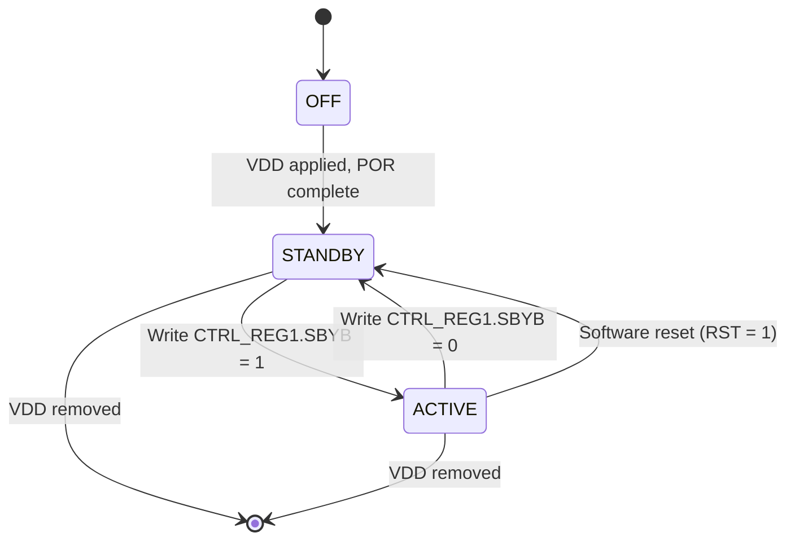

# 04 — Operating Modes

[← Back to Baro ICD index](index.md)

The MPL3115A2 has two orthogonal mode axes:

1. **Power state**: OFF / STANDBY / ACTIVE.
2. **Measurement mode**: Barometer / Altimeter, optionally with **RAW**.

A third axis selects the **data-retrieval method**: polling, interrupt,
or FIFO.

## 4.1 Power-State Machine

| State | I2C usable? | Analog block | Notes |
|-------|-------------|--------------|-------|
| OFF     | No  | Off | VDD < ~1.62 V. |
| STANDBY | Yes | Off | Digital + POR enabled; configuration writable. Default after POR. |
| ACTIVE  | Yes | On  | Acquiring data per CTRL_REG2.ST timing. |

### 4.1.1 STANDBY-only Configuration Fields

The following fields **may only be modified while in STANDBY**:

- All bits in CTRL_REG1 *except* `SBYB`, `OST`, `RST`.
- All bits in CTRL_REG2.
- All bits in CTRL_REG3, CTRL_REG4, CTRL_REG5.

Fields that may be written in either state include FIFO mode/watermark,
BAR_IN, P_TGT, P_WND, T_TGT, T_WND, OFF_P, OFF_T, OFF_H, PT_DATA_CFG.

### 4.1.2 STANDBY → ACTIVE Reset Effects

When transitioning from STANDBY to ACTIVE, the following registers
are **reset to 0x00** (see datasheet Table 9, "Reset when STBY to
Active" column):

- STATUS, OUT_P_*, OUT_T_*, DR_STATUS.
- OUT_P_DELTA_*, OUT_T_DELTA_*.
- F_STATUS, F_DATA, TIME_DLY, SYSMOD.

Configuration registers, WHO_AM_I, F_SETUP, INT_SOURCE,
PT_DATA_CFG, BAR_IN, P_TGT, T_TGT, P_WND, T_WND, P_MIN/MAX,
T_MIN/MAX, CTRL_REG[1..5], OFF_P, OFF_T, OFF_H are **preserved**.

## 4.2 Measurement Modes

Selected via `CTRL_REG1` bits `ALT` and `RAW`:

| ALT | RAW | Mode | Pressure register interpretation | Altitude/temp processing |
|-----|-----|------|----------------------------------|--------------------------|
| 0   | 0   | **Barometer**       | Q18.2 unsigned Pascals | Compensated |
| 1   | 0   | **Altimeter**       | Q16.4 signed meters    | Compensated |
| X   | 1   | **RAW**             | 24-bit raw ADC counts (no offset/scale) | Disabled |

In RAW mode, FIFO, alarms, deltas, min/max, and event interrupts are
**all disabled** and the OUT_x_DELTA registers are not updated. RAW
mode is intended only for diagnostic use.

The `ALT` field can only be modified in STANDBY. The `RAW` field
overrides `ALT`.

## 4.3 Oversampling (OSR)

`CTRL_REG1.OS[2:0]` selects oversampling, which trades acquisition
time for noise reduction. The OSR determines the minimum time
between successive samples:

| OS[2:0] | OSR | Min sample period | Notes |
|---------|-----|-------------------|-------|
| 000 | 1×   | 6 ms   | Highest speed mode |
| 001 | 2×   | 10 ms  | |
| 010 | 4×   | 18 ms  | |
| 011 | 8×   | 34 ms  | |
| 100 | 16×  | 66 ms  | "Standard mode" |
| 101 | 32×  | 130 ms | |
| 110 | 64×  | 258 ms | |
| 111 | 128× | 512 ms | Highest resolution mode |

Pressure RMS noise scales from 19 Pa @ 1× to 1.5 Pa @ 128×. Default
value is `000` (1×).

## 4.4 Acquisition Timing — Periodic vs One-Shot

`CTRL_REG2.ST[3:0]` sets the auto-acquisition step interval as
`2^ST` seconds, giving a range of **1 s to 32 768 s (~9 hours)**.

`CTRL_REG1.OST` triggers a single one-shot acquisition:

- If `SBYB = 0` (STANDBY), setting `OST = 1` causes the part to
  briefly enter ACTIVE, take one sample, then auto-clear `OST` and
  return to STANDBY. This is the lowest-power data acquisition mode.
- If `SBYB = 1` (ACTIVE), setting `OST = 1` initiates an immediate
  measurement; subsequently the part resumes the periodic schedule
  determined by `ST`. The bit does **not** auto-clear in this case
  and must be cleared and re-set to trigger another one-shot.

## 4.5 Data Retrieval Methods

The host has three options for retrieving data, summarized in
Section 4 ("Quick Start") of the source datasheet:

### 4.5.1 Polling (no FIFO)

1. Configure the device (mode, OSR, PT_DATA_CFG flags).
2. Enter ACTIVE.
3. Repeatedly read `STATUS` (`0x00`) and check `PTDR` (bit 1).
4. When `PTDR = 1`, burst-read 5 bytes from `0x01..0x05`
   (OUT_P_MSB..OUT_T_LSB). Reading OUT_P_MSB clears the flag.

### 4.5.2 Interrupt-driven (no FIFO)

1. Configure the device (mode, OSR, PT_DATA_CFG flags).
2. Configure interrupt pin: CTRL_REG3 (polarity, push-pull/OD).
3. Enable DRDY interrupt: `CTRL_REG4.INT_EN_DRDY = 1`.
4. Optionally route to INT1 via `CTRL_REG5.INT_CFG_DRDY = 1`
   (default INT2).
5. Enter ACTIVE.
6. On interrupt edge, read `INT_SOURCE` (`0x12`) to determine the
   source (`SRC_DRDY = bit 7`).
7. Burst-read OUT_P / OUT_T to clear the interrupt.

### 4.5.3 FIFO

1. Configure the device (mode, OSR).
2. Set acquisition step `ST` in CTRL_REG2.
3. Configure FIFO mode and watermark in `F_SETUP`. Modes:
   - `F_MODE = 00`: FIFO disabled.
   - `F_MODE = 01`: Circular buffer. Oldest sample overwritten on
     overflow.
   - `F_MODE = 10`: Stop-on-full. New samples discarded once full.
4. Optionally enable FIFO interrupt: `CTRL_REG4.INT_EN_FIFO = 1`.
5. Enter ACTIVE.
6. On `SRC_FIFO`, read `F_STATUS` (`0x0D`) to clear the interrupt
   and check `F_CNT[5:0]` for queued sample count.
7. Burst-read `F_DATA` (`0x0E`, aliased to `0x01` when FIFO is
   enabled): each 5-byte block is one sample
   (OUT_P_MSB, OUT_P_CSB, OUT_P_LSB, OUT_T_MSB, OUT_T_LSB).
8. Up to 32 samples = 160 bytes per drain.

`F_MODE` may be switched only via the disabled state; to change
between circular and stop-on-full, write `00` first, then the new
value.

## 4.6 Mode Compatibility Matrix

| Feature | RAW | Barometer | Altimeter |
|---------|-----|-----------|-----------|
| OUT_P scaling     | raw 24-bit | Q18.2 Pa | Q16.4 m |
| OUT_T scaling     | raw 16-bit | Q8.4 °C  | Q8.4 °C |
| OUT_P_DELTA       | disabled   | enabled  | enabled |
| FIFO              | disabled   | enabled  | enabled |
| Threshold/window interrupts | disabled | enabled (Pa) | enabled (m) |
| OFF_P / OFF_H     | not applied | OFF_P only | OFF_P + OFF_H |

[← Back to Baro ICD index](index.md)
