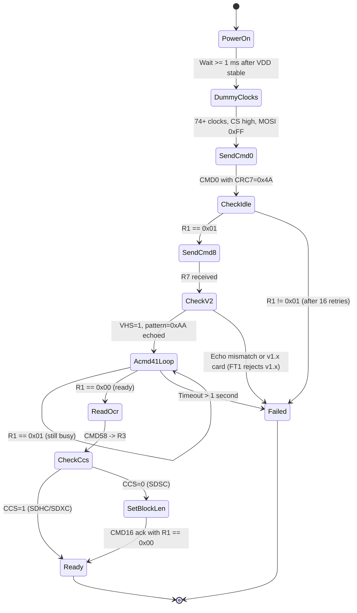

# 05 — Initialization Sequence

[← Back to index](index.md)

> **Source note:** Authored from public SD SPI-mode protocol knowledge.
> The SD Physical Layer Simplified Specification PDF is not present in
> this repository.

## 5.1 Goal

Bring an unknown SD card from a cold power-up state to a known,
ready-for-data-transfer state in SPI mode, while discovering whether the
card is SDHC/SDXC (block-addressed) or SDSC (byte-addressed).

A successful init produces:

- Card in SPI mode (locked-in until next power cycle).
- Card in the data-transfer state, ready for CMD17 / CMD24.
- Host-side knowledge of the CCS bit (SDHC/SDXC vs. SDSC), used by every
  subsequent CMD17 / CMD24 to decide between block-index and byte-offset
  addressing.

## 5.2 State Machine

## 5.3 Step-by-Step Procedure

The host SPI clock shall be set to **≤ 400 kHz** for all of the steps in
this section. The host shall raise the clock to its operating rate
(see [section 2.4](02_signal_interface.md#24-clock-rate-plan)) only after
this sequence completes successfully.

### Step 1 — Power and Dummy Clocks

1. Apply 3.3 V to the card; wait at least **1 ms** after VDD crosses 2.7
   V for the card's internal regulator to settle.
2. Hold **CS high** and **MOSI high (0xFF)**.
3. Toggle CLK for at least **74 cycles** (rounded up to **80 cycles** =
   10 bytes of 0xFF in practice). This is the SD spec's "supply ramp"
   training requirement.

Purpose: The card uses the dummy clocks to bring its internal logic out
of the power-on reset state. Without the dummy clocks, the card may
ignore the first CMD0 entirely.

### Step 2 — CMD0 (GO_IDLE_STATE)

1. Pull **CS low**.
2. Send the CMD0 frame: `0x40 0x00 0x00 0x00 0x00 0x95`.
3. Read MISO until a byte with bit 7 = 0 appears (or up to 16 bytes
   timeout).
4. Verify the response byte is `R1 = 0x01` (in-idle-state, no errors).
5. Pull **CS high**, send one byte of 0xFF (eight clocks) to release
   MISO.

Purpose: This command (with CS low at the moment of issue) commits the
card to **SPI mode** for the rest of this power cycle and resets it to
the idle state. The mandatory CRC7 = 0x4A in byte 5 is enforced by the
card for CMD0; using any other CRC7 will cause the card to ignore the
command.

If R1 != 0x01 after 16 bytes of polling, retry CMD0 up to **3 times**
total. After three failures, declare card-not-present and abort.

### Step 3 — CMD8 (SEND_IF_COND)

1. Pull **CS low**.
2. Send the CMD8 frame: `0x48 0x00 0x00 0x01 0xAA 0x87`.
3. Read MISO and parse R7 (5 bytes total).
4. Verify:
   - R1 byte = 0x01 (still in idle, no errors).
   - VHS-echo nibble (lower nibble of byte 3 of R7 payload) = 0x1.
   - Check-pattern echo (byte 4 of R7 payload) = 0xAA.
5. Pull **CS high**, send one byte of 0xFF.

Purpose: CMD8 declares the host's voltage range to the card and proves
that the card is SD spec v2.0 or later (a v1.x SDSC card returns R1 with
the Illegal-Command bit set). A v2.0+ card is required for SDHC/SDXC
support, which is what FT1 needs.

If the card replies with the Illegal-Command bit set (R1 byte = 0x05),
the card is v1.x SDSC. **FT1 does not support v1.x SDSC cards** and shall
abort init. (Drivers that need v1.x compatibility take a CMD1-based path
instead of ACMD41; that path is out of scope here.)

### Step 4 — CMD55 + ACMD41 Loop (with HCS = 1)

This step polls the card until its internal initialization completes.

1. Pull **CS low**.
2. Send CMD55: `0x77 0x00 0x00 0x00 0x00 0x65` (CRC7 not validated by
   card; 0x65 is a precomputed valid value, or use 0xFF stuff).
3. Read R1; expect `0x01` (idle, no errors). Pull CS high, send 0xFF.
4. Pull CS low.
5. Send ACMD41 with HCS = 1: `0x69 0x40 0x00 0x00 0x00 0x77` (argument
   0x40000000 sets bit 30 = HCS; CRC7 = 0x77, but most cards ignore it).
6. Read R1.
7. Pull CS high, send 0xFF.
8. If R1 == 0x00, the card is ready — proceed to step 5.
9. If R1 == 0x01, the card is still initializing — wait at least **10
   ms**, then loop back to (1).
10. If the loop has run for more than **1 second** total, declare init
    failure.

Purpose: ACMD41 (with HCS=1) signals to the card "I am a host that can
address SDHC/SDXC capacities — please leave the idle state." The card
does internal calibration and capacity-class arbitration during this
window, which can take tens to hundreds of milliseconds. CMD55 is
required before any ACMDn to put the card in the application-command
acceptance window.

Note that **every** ACMD41 must be preceded by its own CMD55 — the
"application command" mode is one-shot per CMD55.

### Step 5 — CMD58 (READ_OCR), Determine CCS

1. Pull **CS low**.
2. Send CMD58: `0x7A 0x00 0x00 0x00 0x00 0xFD` (CRC7 not validated;
   0xFD or 0xFF are both fine).
3. Read R3 (5 bytes total). The R1 byte should be 0x00.
4. Parse the 32-bit OCR (bytes 1..4, big-endian).
5. Confirm bit 31 = 1 (powered up). If 0, the card is unexpectedly busy —
   abort.
6. Inspect bit 30 (CCS):
   - **CCS = 1** → card is SDHC or SDXC. Block-addressed. Skip CMD16.
   - **CCS = 0** → card is SDSC. Byte-addressed. Proceed to step 6.
7. Pull **CS high**, send one byte of 0xFF.

Purpose: The OCR is the only authoritative source for the SDHC/SDXC vs.
SDSC distinction. The driver must record the CCS bit and reuse it for
every subsequent CMD17/CMD24 address translation.

### Step 6 — CMD16 (SET_BLOCKLEN), SDSC Only

This step is **executed only when CCS = 0** (SDSC card). On SDHC/SDXC
cards the block length is fixed at 512 bytes by spec, and CMD16 is a
no-op (it returns success but changes nothing).

1. Pull **CS low**.
2. Send CMD16 with argument 512 (0x00000200): `0x50 0x00 0x00 0x02 0x00 0xFF`.
3. Read R1. Expect 0x00.
4. Pull **CS high**, send one byte of 0xFF.

Purpose: For SDSC cards, the default block length after power-on is
**not** 512 bytes — it is the value reported in the CSD's READ_BL_LEN
field. The Juno FSW driver and the FAT32 layer assume 512-byte blocks
universally, so SDSC cards are forced into 512-byte mode here.

For FT1 the recommended path is to use SDHC/SDXC and never reach this
step.

## 5.4 Post-Init Actions

After step 5 (or step 6 for SDSC), the driver shall:

1. Increase the SPI clock rate to the operating value (10–12 MHz for
   FT1; see [section 2.4](02_signal_interface.md#24-clock-rate-plan)).
2. Optionally issue **CMD9** to read the CSD and compute total capacity
   (see [07_csd_cid.md](07_csd_cid.md)).
3. Optionally issue **CMD10** to read the CID and log the manufacturer /
   serial number for diagnostics.
4. Mark the card "ready" in the FSW health table.

## 5.5 Init Timing Budget

| Step | Worst-case time |
|------|----------------|
| 1 — Power settle + dummy clocks at 400 kHz | 1.5 ms |
| 2 — CMD0 (with retries) | 5 ms |
| 3 — CMD8 | 0.5 ms |
| 4 — ACMD41 loop until ready | up to 1000 ms (1 s budget) |
| 5 — CMD58 | 0.5 ms |
| 6 — CMD16 (SDSC only) | 0.5 ms |
| **Total** | **≈ 1010 ms** |

The Juno FSW boot sequence shall budget **at least 1.5 seconds** for SD
init before declaring the mass-storage subsystem failed. Init failures
shall be reported to the FSW health table but shall not block other
non-storage subsystems from running.

## 5.6 Failure Modes

| Failure | Driver action | Health flag |
|---------|--------------|-------------|
| CMD0 returns nothing after 3 retries | Abort init | `SD_NOT_PRESENT` |
| CMD8 returns Illegal Command (R1 = 0x05) | Abort init (v1.x SDSC unsupported in FT1) | `SD_INCOMPATIBLE_VERSION` |
| CMD8 returns wrong VHS or check pattern | Abort init | `SD_VOLTAGE_MISMATCH` |
| ACMD41 loop exceeds 1 s | Abort init | `SD_INIT_TIMEOUT` |
| CMD58 returns OCR with bit 31 = 0 after ACMD41 success | Abort init (inconsistent card state) | `SD_INIT_INCONSISTENT` |
| CMD16 returns R1 != 0x00 (SDSC path) | Abort init | `SD_BLOCKLEN_REJECTED` |
