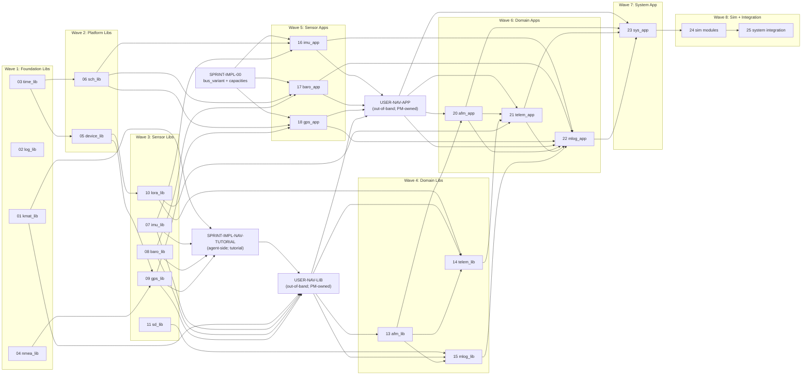

# Juno FT1 FSW — Software Development Plan (Index)

> **Status (2026-08-29):** This is a planning baseline. It predates the
> current codebase, which is written in Rust (not the C++ this plan
> describes); none of the sprints' modules are implemented in this
> repository's code, and the `ai/` directory it references is not present in
> this repository. See the root `README.md` for what exists today.

## 1. Purpose

This Software Development Plan (SDP) sequences every implementation sprint that converts the PDR-closed design baseline into a flight-ready FT1 Flight Software (FSW). It defines the per-sprint structure, the dependency-correct ordering of all libraries and applications, the build and test gates that every sprint must pass, the requirement traceability strategy that links code and tests back to `SW-REQ-*` IDs, and the exit criteria for FT1 FSW closure. Each sprint is bite-sized — exactly one library OR one application OR one tightly-scoped sim/integration deliverable — and includes test authoring plus test execution as a non-negotiable closure gate, in keeping with the project's TDD methodology recorded in `ai/memory/project-overview.md`.

## 2. Scope

This SDP covers all 26 implementation sprints required to produce the FT1 FSW image: 1 Wave 0 enabler sprint, 4 Wave 1 foundation library sprints, 2 Wave 2 platform library sprints, 5 Wave 3 sensor driver library sprints, 4 Wave 4 domain library sprints, 3 Wave 5 sensor application sprints, 5 Wave 6+7 domain and system application sprints, and 2 Wave 8 sim and integration sprints. It excludes HIL post-CDR test sprints, mission-day operations, and FT2 / CDR closure activities. The PDR-closed design baseline at `docs/design/` and the requirement baseline at `docs/requirements/` are the input artifacts to every sprint defined here.

## 3. SDP Document Set

This index links every file in the SDP authoring sprint:

- [methodology.md](methodology.md) — per-sprint structure, file inventory template, test gate, traceability tagging
- [foundation_libs.md](foundation_libs.md) — Wave 1+2: kmat_lib, log_lib, time_lib, nmea_lib, device_lib, sch_lib (also hosts the Wave 0 preface)
- [sensor_libs.md](sensor_libs.md) — Wave 3: imu_lib, baro_lib, gps_lib, lora_lib, sd_lib
- [domain_libs.md](domain_libs.md) — Wave 4: nav_lib, afm_lib, telem_lib, mlog_lib
- [sensor_apps.md](sensor_apps.md) — Wave 5: imu_app, baro_app, gps_app
- [domain_apps.md](domain_apps.md) — Wave 6+7: nav_app, afm_app, telem_app, mlog_app, sys_app
- [sim_and_integration.md](sim_and_integration.md) — Wave 8: sim modules + system integration

## 4. Project Organization

Reference (do not duplicate): `ai/memory/project-overview.md` (roles, methodology), `ai/memory/architecture.md` (MVC + LibJuno module pattern), `ai/memory/coding-standards.md` (C++11 freestanding rules), `ai/memory/constraints.md` (hard limits including 500 LoC/file), `docs/reviews/pdr/charter.md` (review board structure carries into CDR).

The FSW is built bottom-up across 8 dependency waves; each wave's libraries land before the apps that consume them. The sole orchestrator (Software Lead) spawns workers and reviewers per `ai/skills/software-lead.md`; one file is produced per worker invocation; tests are authored and executed in every sprint. The Chief Engineer holds the unconditional GO that authorized the SDP; PM signs off on amendments.

## 5. Master Sprint Table

Authoritative dependency-ordered sequence. Test case counts are the authoritative count of `SW-TC-*` entries in each module's `docs/test_cases/<module>/test_cases.json` as of 2026-05-03; Files counts are the expected production count per `methodology.md`'s lib/app inventory templates (libraries: header + impl_posix + impl_pico2 + tests + CMakeLists + tagging; apps: header + impl + tests + CMakeLists).

| Sprint ID | Module | Wave | Predecessors | Files | Test Cases | Status | Wave File |
|-----------|--------|------|--------------|-------|------------|--------|-----------|
| SPRINT-IMPL-00 | bus_variant + capacity pins | 0 | none | 2 | 0 (header-only) | **CLOSED** 2026-05-04 | foundation_libs.md (preface §) |
| SPRINT-IMPL-01 | kmat_lib | 1 | none | 4 | 20 | **CLOSED** 2026-05-04 | foundation_libs.md |
| SPRINT-IMPL-02 | log_lib | 1 | none | 6 | 12 | **CLOSED** 2026-05-04 | foundation_libs.md |
| SPRINT-IMPL-02-retro | log_lib (Pico2 stub coverage) | 1 (retrofit) | 02, 03 | 3 | 19 (12 mirror + 7 EC) | **CLOSED** 2026-05-05 — retro-discharges methodology §5.1 Revision B for log_lib | foundation_libs.md |
| SPRINT-IMPL-03 | time_lib | 1 | none | 8 | 8 (7 Unit + 1 deferred Demo) — covered both POSIX and Pico2 backends per Revision B | **CLOSED** 2026-05-05 | foundation_libs.md |
| SPRINT-IMPL-04 | nmea_lib | 1 | none | 5 | 17 | **CLOSED** 2026-05-05 | foundation_libs.md |
| SPRINT-IMPL-05 | device_lib | 2 | 03 (time_lib) | 10 | 12 (8 Unit + 4 Demo) | **CLOSED** 2026-05-05 — dual-impl + Pico2-stub triplet + pico/types.h shim + WriteBytes coverage TEST_F | foundation_libs.md |
| SPRINT-IMPL-05-retro-A | template_cpp + device_lib (per-platform IMPL pattern + G3 full-lib mitigation) | 2 (retro) | 05 | 11 (4 template + 7 device_lib retro) | (no test-case changes; counter delta 0) | **CLOSED** 2026-05-05 — rectifies single-IMPL-with-`void*`-handle drift; new canonical per-platform DERIVE pattern in template_cpp; resolves SPRINT-IMPL-05 G3 + fd-leak carry-forwards | foundation_libs.md |
| SPRINT-IMPL-05-retro-B | log_lib per-platform IMPL mirror (LOG_LIB_POSIX_T / LOG_LIB_PICO2_T split + Pico2-only 3-arg New per PM Q1 Option A) | 1 (retro) | 05-retro-A | 9 (log_api/posix/pico2/posix.cpp/pico2.cpp/common.cpp/test/pico2_test/CMakeLists) | (no test-case changes; counter delta 0) | **CLOSED** 2026-05-05 — rectifies LOG_LIB_IMPL_T `int iSinkFd` "unused on Pico2" anti-pattern; resolves G3 transitive-source for log_lib via per-source-file COMPILE_OPTIONS | foundation_libs.md |
| SPRINT-IMPL-06 | sch_lib | 2 | 03 (time_lib) | 9 (5 SDP + 2 seam .hpp + 2 split tests + helpers .hpp) | 12 | **CLOSED** 2026-05-06 — 9 of 10 SW-REQ-SCH retired; SW-REQ-SCH-007 deferred to SPRINT-IMPL-25 composition root | foundation_libs.md |
| SPRINT-IMPL-06-retro-A | LibJuno juno_sch_api.hpp app type C→C++ + sch_lib consumer ripple | 2 (retrofit) | 06 | 6 (1 LibJuno header + 5 sch_lib consumers) | 0 (no test-case changes; pure type rename) | **CLOSED** 2026-05-06 — schedule-table type fixed from C `JUNO_APP_ROOT_T*` to C++ `juno::app::APP_ROOT_T*`; libjuno gitlink converted to vendored | foundation_libs.md |
| SPRINT-IMPL-07 | imu_lib | 3 | none (composition root injects I2C; no device_lib dep — device_lib is UART1-only per its L2) | 6 | 17 | sensor_libs.md |
| SPRINT-IMPL-08 | baro_lib | 3 | none (composition root injects BARO_LIB_BUS_T callbacks; no device_lib dep) | 6 | 12 | sensor_libs.md |
| SPRINT-IMPL-09 | gps_lib | 3 | 05 (device_lib), 04 (nmea_lib) | 9 | 13 (10 Unit + 3 Demonstration deferred) | **CLOSED** 2026-05-06 — per-platform IMPL split (Q1) + ptTime injection (Q5 mid-sprint amendment) | sensor_libs.md |
| SPRINT-IMPL-10 | lora_lib | 3 | 05 (device_lib) | 9 | 15 (13 Unit + 2 Demonstration deferred) | **CLOSED** 2026-05-06 — per-platform IMPL split (Q1) + ptTime injection upfront (Q4 preempts gps_lib Q5 pattern) | sensor_libs.md |
| SPRINT-IMPL-11 | sd_lib | 3 | none (sd_lib owns SPI directly per its L2; no device_lib dep) | 14 (Q1 per-platform IMPL split + Q2 imu_lib-style host-stub triplet + companion gpio.h/pico/time.h stubs) | 15 (12 Unit + 2 Integration parity in-scope + 1 Demonstration deferred to HIL) | **CLOSED** 2026-05-09 — closes Wave 3; per-platform IMPL split + imu_lib-style host-stub coverage + parametric byte-identity parity tests | sensor_libs.md |
| SPRINT-IMPL-NAV-TUTORIAL | nav_kalman tutorial (replaces SPRINT-IMPL-12 nav_lib AND SPRINT-IMPL-19 nav_app per Revision C; agent system authors a structured Kalman-filter + navigation tutorial under `docs/tutorials/nav_kalman/` and the PM owns nav_lib + nav_app implementations out-of-band) | 4 | 01 (kmat), 07 (imu_lib), 08 (baro_lib), 09 (gps_lib) | 13 (12 chapters + index) | n/a (tutorial; not a code lib) | docs/sprints/SPRINT-IMPL-NAV-TUTORIAL_nav_kalman.md |
| USER-NAV-LIB | nav_lib (out-of-band, PM-owned) | 4 (out-of-band) | SPRINT-IMPL-NAV-TUTORIAL + 01 + 07 + 08 + 09 | 6 | 23 (SW-TC-NAV-001..023 already specified at PDR) | n/a (PM implementation; same G1+G2+G3 gates apply at integration) |
| SPRINT-IMPL-13 | afm_lib | 4 | USER-NAV-LIB (nav_lib types) | 6 | 16 | domain_libs.md |
| SPRINT-IMPL-14 | telem_lib | 4 | 10 (lora_lib), USER-NAV-LIB (nav_lib types), 13 (afm_lib types) | 6 | 16 | domain_libs.md |
| SPRINT-IMPL-15 | mlog_lib | 4 | 11 (sd_lib), USER-NAV-LIB, 13 | 6 | 17 | domain_libs.md |
| SPRINT-IMPL-16 | imu_app | 5 | 00, 06, 07 | 4 (+ Phase 0 prereq `libs/imu_lib/include/imu_lib/imu_msg.hpp` per PM Q2 2026-05-10) | 12 | **CLOSED** 2026-05-10 — opens Wave 5; manual-aggregate-init precedent for RFA #1; Wave 0→5 missed-link mitigation for `JUNO_MSG_IMU_SAMPLE_T` | sensor_apps.md |
| SPRINT-IMPL-17 | baro_app | 5 | 00, 06, 08 | 4 (+ Phase 0 prereq `libs/baro_lib/include/baro_lib/baro_msg.hpp` per PM Q1 2026-05-11) | 14 (12 Unit/Integration + 2 Demonstration deferred to HIL CDR per Q5) | **CLOSED** 2026-05-11 — Wave 5 progress 2 of 3; manual-aggregate-init RFA #1 precedent applied verbatim from SPRINT-IMPL-16; TC-013 paired-sequence-number pattern set as canonical Sample-before-Publish idiom | sensor_apps.md |
| SPRINT-IMPL-18 | gps_app | 5 | 00, 06, 09 | 4 | 12 | sensor_apps.md |
| USER-NAV-APP | nav_app (out-of-band, PM-owned; replaces SPRINT-IMPL-19 per Revision C) | 6 (out-of-band) | 16, 17, 18, USER-NAV-LIB | 4 | 18 (SW-TC-NAV-APP-001..018 already specified at PDR) | n/a (PM implementation; same G1+G2+G3 gates apply at integration) |
| SPRINT-IMPL-20 | afm_app | 6 | USER-NAV-APP, 13 | 4 | 13 | domain_apps.md |
| SPRINT-IMPL-21 | telem_app | 6 | USER-NAV-APP, 20, 14, 10 | 4 | 13 | domain_apps.md |
| SPRINT-IMPL-22 | mlog_app | 6 | 16, 17, 18, USER-NAV-APP, 20, 21, 15 | 4 | 14 | domain_apps.md |
| SPRINT-IMPL-23 | sys_app | 7 | All Wave 5+6 (includes USER-NAV-APP) | 4 | 14 | domain_apps.md |
| SPRINT-IMPL-24 | sim modules (sim_dynamics, sim_sensors, sim_scenario, sim_harness as one coordinated sprint) | 8 | All Wave 1-7 | 12 | 61 (18+16+14+13) | sim_and_integration.md |
| SPRINT-IMPL-25 | system integration (composition root + first full-FSW Trick test) | 8 | 24 | 3 | (smoke test) | sim_and_integration.md |

**Authoritative test-case total across modules in §5: 387.** (Recount via `jq '.test_cases | length' docs/test_cases/*/test_cases.json` if regression suspected.)

## 6. Sprint-DAG Diagram

Dependency-correct DAG of all 26 sprints. Wave 0 is the prerequisite for every Wave 5+ application sprint (provides `JUNO_MSG_BUS_VARIANT_T` and `juno_fsw_capacities.hpp`). Wave 1 sprints are independent of one another. Wave 2 depends on time_lib. Wave 3 depends on device_lib (and gps_lib also depends on nmea_lib). Wave 4 depends on sensor library types. Wave 5 depends on Wave 0 + Wave 2 (sch) + matching Wave 3 lib. Wave 6 layers upward from Wave 5 apps and Wave 4 libs. Wave 7 (sys_app) depends on all Wave 5+6 apps. Wave 8 follows everything.

Critical paths to monitor: **kmat → SPRINT-IMPL-NAV-TUTORIAL → USER-NAV-LIB → USER-NAV-APP → afm_app → telem_app → sys_app** (numerical-to-system path; the agent-side tutorial gates the PM's out-of-band nav_lib + nav_app implementations, which in turn gate every Wave 6+ app that consumes nav state) and **time_lib → sch_lib → every app** (scheduling path).



## 7. Risk Register

Carried forward from `closure_memo.md` §5 (PDR closure 2026-05-03). Each carry-forward RFA is mapped to the sprint that resolves it.

| Risk ID | Description | Sprint Impact | Mitigation | Owner |
|---------|-------------|---------------|------------|-------|
| SDP-R-01 | LibJuno `juno::app::AppInit(...)` not yet published | Wave 5+ | FSW workaround: per-app `<App>AppInit()` setup function in `apps/main.cpp` manually aggregate-inits `tApp.tRoot` with the static `juno::app::APP_API_T` instance; document workaround in any Wave 5+ sprint; if LibJuno publishes `AppInit`, prefer it | LibJuno team (upstream) |
| SDP-R-02 | `JUNO_MSG_BUS_VARIANT_T` placeholder | Blocks any app sprint | Wave 0 sprint (`SPRINT-IMPL-00`) defines the project-wide variant of all bus message types | Software Lead |
| SDP-R-03 | Capacity placeholder pins (`kBrokerPipes`, `kBrokerRegistry`, `kDefaultWriteBufBlocks`, `kDefaultRingCap`) not authoritative | Blocks broker / sd_lib / device_lib instantiation | Wave 0 sprint defines `juno_fsw_capacities.hpp`; per-lib pins land in their Wave 1-3 sprints | Software Lead |
| SDP-R-04 | Option C `SIM_SENSORS_RAW_T` / `SIM_BARO_REGS_T` migration deferred | Sim test fixtures rely on Option D `static_assert` cross-checks | Accept; revisit post-FT1 (not blocking) | Software Lead |
| SDP-R-05 | NASA Trick `exec_get_sim_time()` symbol unverified | Wave 8 sim integration | Verify at Wave 8 entry; flag in `sim_and_integration.md` Wave 8 §; do not close `SPRINT-IMPL-25` until symbol resolution succeeds | Software Lead |
| SDP-R-06 | 26-sprint plan may discover circular deps not visible at PDR | Any future wave | `methodology.md` §SDP Amendment Process; the Lead may revise this SDP between waves with PM sign-off and revision-letter increment | Software Lead |
| SDP-R-07 | Pico2 cross-compile coverage may lag POSIX (tests run only on POSIX) | Per-sprint | Each sprint exit gate requires both `PLATFORM=POSIX` build clean (with tests) AND `PLATFORM=PICO2` cross-compile clean (no test execution on Pico2; cross-compile pass is sufficient) | Software Lead |
| SDP-R-08 | USER-NAV-LIB and USER-NAV-APP are out-of-band PM-owned implementations (Revision C). Downstream sprints (afm_lib -13, afm_app -20, telem_lib -14, telem_app -21, mlog_lib -15, mlog_app -22, sys_app -23) cannot start until the PM signals nav_lib and nav_app delivery. Agent-system burndown excludes these two scopes. | All Wave 4+ sprints depending on nav | (a) SPRINT-IMPL-NAV-TUTORIAL delivers the complete Kalman-filter + navigation tutorial under `docs/tutorials/nav_kalman/` so the PM has a self-contained learning path before implementation; (b) the PDR-baselined `docs/requirements/nav/`, `docs/design/nav/`, `docs/test_cases/nav/` (and `nav_app/` triplet) remain authoritative spec artifacts the PM implements against — same G1 (POSIX build + tests) + G2 (`tools/traceability.py`) + G3 (Pico2 cross-compile) gates apply at integration as for any agent-produced lib; (c) PM signals readiness in writing before each downstream sprint opens. | PM |

## 8. Traceability Strategy

- Every implementation sprint must end with `tools/traceability.py` exit 0
- Every code function authored is tagged `// @{"req": ["SW-REQ-<MODULE>-NNN"]}` per `ai/memory/traceability.md`
- Every Google Test is tagged `// @{"verify": ["SW-REQ-<MODULE>-NNN"]}`
- Design sections continue to be tagged `<!-- @{"design": ["SW-REQ-<MODULE>-NNN"]} -->` per the PDR baseline
- The `SW-TC-*` IDs in `docs/test_cases/<module>/test_cases.json` are authoritative for test-spec coverage; implementation sprints must implement every Unit-type test case for their module
- RTM (`tools/rtm.py`) is regenerated per sprint; Burndown (`tools/burndown.py`) is tracked at §10 below

## 9. Build & CI Gates (per-sprint, non-negotiable)

Two gates every sprint must pass before closure:

**Gate G1 — POSIX build + tests pass**

```bash
mkdir -p build_posix && cd build_posix && cmake -DPLATFORM=POSIX .. && cmake --build . && ctest --output-on-failure
```

**Gate G2 — traceability clean**

```bash
python3 tools/traceability.py
```

**Gate G3 (conditional) — Pico2 cross-compile passes (no execution)** for sprints whose deliverable touches Pico2 IMPL files (every Wave 1-3 lib and every Wave 5+ app):

```bash
mkdir -p build_pico2 && cd build_pico2 && cmake -DPLATFORM=PICO2 .. && cmake --build .
```

All gates must exit 0 before sprint closure. The Lead documents the ctest summary line and the Pico2 cmake/build exit codes in the sprint closure note.

## 10. Exit Criteria for FT1 FSW

The SDP closes when all in-band sprints (24 agent-system sprints + SPRINT-IMPL-NAV-TUTORIAL) are CLOSED, both out-of-band PM-owned implementations (USER-NAV-LIB and USER-NAV-APP) are delivered against the same gates, the burndown is at 100%, the Chief Engineer issues a PASS verdict on the integrated FSW, and Demonstration test cases are executed at the HIL bench:

1. SPRINT-IMPL-00 through SPRINT-IMPL-25 (excluding SPRINT-IMPL-12 and SPRINT-IMPL-19, which are replaced per Revision C) all CLOSED with G1 + G2 (and G3 where applicable) gates passed
2. SPRINT-IMPL-NAV-TUTORIAL (Revision C addition) CLOSED with all tutorial chapters approved
3. **USER-NAV-LIB delivered by PM and passing G1 (POSIX ctest with all SW-TC-NAV-001..023 PASSING) + G2 (`tools/traceability.py` exit 0) + G3 (Pico2 cross-compile clean)** — the same gates that apply to any agent-produced library. Delivery means the PM has merged code that satisfies these gates; agent system does not author the implementation.
4. **USER-NAV-APP delivered by PM and passing G1 (POSIX ctest with all SW-TC-NAV-APP-001..018 PASSING) + G2 + G3** — same conditions as USER-NAV-LIB.
5. `tools/burndown.py` shows 100% requirement closure across every `docs/requirements/` module (including `nav/` and `nav_app/`, which the PM is responsible for closing through implementation)
6. CE issues a PASS verdict on the integrated FSW
7. Demonstration test cases (per `verification_method=Demonstration` in the requirement baseline and the corresponding `type=Demonstration` test cases) executed at the HIL bench (HIL CDR phase; out of scope for this SDP)

## 11. Canonical Names — Single Source of Truth

Workers in every future sprint MUST use these names verbatim. Approximations were the root cause of the Delta-PDR Remediation Sprint; quote these references rather than paraphrasing.

- LibJuno macros: `JUNO_MODULE_ROOT(API_T, ...)` (publishes `const API_T *ptApi;`); `JUNO_MODULE_DERIVE(ROOT_T, ...)` (embeds `ROOT_T tRoot;` first via the `JUNO_MODULE_SUPER` alias). See `libjuno/include/juno/module.h:97,131,161`.
- Apps: `<MODULE>_APP_T JUNO_MODULE_DERIVE(juno::app::APP_ROOT_T, ...)` — single-level pattern (per the sys_app remediation 2026-05-03)
- Vtable dispatch: `tRoot.ptApi->Hook(...)` — NEVER `tRoot.tApi->...`
- Time injection: `juno::time::TimeInit(tTime, tApi, pfcnFailureHandler, pvUserData)` — NOT a `JUNO_TIME_PROVIDER_T` callback
- Time conversion: `_ptTime->TimestampToMicros(<JUNO_TIMESTAMP_T>).tOk` — non-static member function per `libjuno/include/juno/time/time_api.hpp:142`
- Scheduler: `juno::sch::SCH_API_T<8, 200>::Execute(tSch)` — NOT `sch_lib::Run`
- Status codes: only the 19 canonical from `libjuno/include/juno/status.h` OR FSW extensions `JUNO_FSW_STATUS_<NAME> = JUNO_STATUS_CUSTOM_ERROR + N` per consuming namespace (e.g., `juno::nav`, `juno::kmat`)
- Bus message variant: `JUNO_MSG_BUS_VARIANT_T` (defined in Wave 0; FSW project-wide variant of all bus message types)
- Capacity pins: `kBrokerPipes`, `kBrokerRegistry`, `kDefaultWriteBufBlocks`, `kDefaultRingCap` (defined in `juno_fsw_capacities.hpp` in Wave 0)

Full per-sprint citation rules and the test gate boilerplate are in [methodology.md](methodology.md).

## 12. SDP Amendment Process

Reference (no detail here): see [methodology.md](methodology.md) §SDP Amendment Process. Briefly: between sprints, the Lead may propose amendments to this SDP via a PR-style update; PM signs off; the revision letter increments (current revision: C).

## 13. Approval

| Field | Value |
|-------|-------|
| Author | Software Lead |
| Date | 2026-05-03 (Revision A) / 2026-05-05 (Revision B) / 2026-05-08 (Revision C) |
| Predecessor | Revision A: PDR Closure 2026-05-03 (Delta-PDR Remediation Sprint CE GO); Revision B: 2026-05-05 (Pico2 stub coverage mandate); **Revision C: 2026-05-08 (nav implementations moved out-of-band; tutorial replaces SPRINT-IMPL-12/-19)** |
| Successor | Revision A→B→C: SPRINT-IMPL-NAV-TUTORIAL (this Revision C amendment) |
| Holistic MAE review | Revision A: NEEDS CHANGES → 10 findings remediated Lead-direct; re-verified PASS 2026-05-03. Revision C: APPROVED 2026-05-08 (one advisory on §12 stale "current revision: A" — fixed Lead-direct). |
| Chief Engineer verdict | Revision A: **PASS** (2026-05-03). Revision C: **PASS unconditional** (2026-05-08, via SPRINT-IMPL-NAV-TUTORIAL final gate; all 8 sprint ACs MET). |
| Chair (PM) approval | Revision A: **APPROVED 2026-05-04**. Revision B: **APPROVED 2026-05-05** (Pico2-stub mandate). **Revision C: APPROVED 2026-05-08 (PM directive: "I want to adjust the SDP so the nav library and application and kalman filter implementation is done by me. The primary purpose for this project is for me to learn how to perform navigation and implement a kalman filter. Instead of you developing the nav library and app, I would like you to develop a lesson and tutorial for how to develop the library."). PM concurred with Software Lead's Option A (replace SPRINT-IMPL-12 and SPRINT-IMPL-19 with a single agent-side tutorial sprint; PM owns the implementations out-of-band) and recommended scope (math primer including linear algebra and probability per PM rusty-on-math floor; 12 chapters + index; reviewers granted WebFetch + WebSearch for authoritative-source verification).** |
| Chair signature line | Robin Onsay (PM) — Revision A 2026-05-04 / Revision B 2026-05-05 / Revision C 2026-05-08 |

## 14. Chief Engineer Final-Gate Rationale

The SDP is internally consistent, IEEE-12207-style structurally sound, and ready to operate as the implementation handbook from SPRINT-IMPL-00 onward. Coverage is complete: §5's master sprint table enumerates all 26 sprints (00 enabler, 01-06 foundation/platform libs, 07-11 sensor libs, 12-15 domain libs, 16-18 sensor apps, 19-22 domain apps, 23 sys_app, 24 sim modules, 25 system integration) and every L2-bearing module under `docs/design/` maps one-to-one to a sprint with libs unconditionally preceding apps per the Wave-DAG in §6 — and §7's risk register binds each of the five carry-forward RFAs from `closure_memo.md` §5 to a concrete resolution sprint (SDP-R-01 → Wave-5 per-app workaround documented in `sensor_apps.md` §2.1; SDP-R-02 / SDP-R-03 → SPRINT-IMPL-00 in `foundation_libs.md` §3; SDP-R-04 → Wave-8 Option-D `static_assert` cross-check in `sim_and_integration.md` §3 sim_sensors AC; SDP-R-05 → SPRINT-IMPL-24 entry gate). The four PM rules are all satisfied: each sprint scopes exactly one library or one application (sole exception SPRINT-IMPL-24, justified in `sim_and_integration.md` §2 by interlocking sim L2 designs and explicitly flagged with sub-staging guidance in §3); libs precede apps; `methodology.md` §4 enforces one file per worker invocation including the test-author/impl-author distinction; and `methodology.md` §5+§6 mandate test authoring (Google Test + DI vtable stubs, no mock framework) plus per-sprint G1 (POSIX build + ctest) and G2 (`tools/traceability.py`) gates with G3 (Pico2 cross-compile) wherever a `src/pico2/` TU is touched. Cross-cutting consistency post-MAE remediation holds end-to-end: `index.md` §11 publishes a single canonical-name source of truth (single-level `JUNO_MODULE_DERIVE`, `tRoot.ptApi->Hook(...)` dispatch, `_ptTime->TimestampToMicros(...).tOk` member form, `juno::sch::SCH_API_T<8, 200>::Execute(tSch)`, `<APP>_T` suffix), each wave file references it verbatim in its per-sprint AC, and the wave exit gates in `foundation_libs.md` §4 / `sensor_libs.md` §4 / `domain_libs.md` §4 / `sensor_apps.md` §4 / `domain_apps.md` §4 / `sim_and_integration.md` §4 each re-verify these invariants with explicit grep checks before the next wave is authorized — the wave-by-wave CE gate cadence is the right firebreak against cross-sprint API drift. Methodology rigor is sufficient for IEEE-12207-style implementation: `methodology.md` §2 defines the five-phase per-sprint lifecycle (Lead pre-flight → workers → reviewers → gates → CE → closure), §2 Phase 2 sets the three-iteration cap per file with PM-escalation on the third NEEDS-CHANGES verdict, §10 wires the lessons-learned hook to per-role memory files, and §11 codifies the SDP amendment process with revision-letter increment plus PM countersign for major changes (mitigates SDP-R-06). Implementation feasibility checks out — sprint sizes range from 5 agents (SPRINT-IMPL-00) to 33 agents (SPRINT-IMPL-24) with the largest correctly flagged for Lead sub-staging within Phase 1, file inventories per sprint match the lib-6/5/4 vs app-4 templates in `methodology.md` §3, and the authoritative 387 SW-TC-* test count in §5 reconciles against the per-module JSON files. Recommendation to the Software Lead: proceed with SPRINT-IMPL-00 (Wave 0 enablers) under the SDP as written.

**Final Verdict: PASS**
